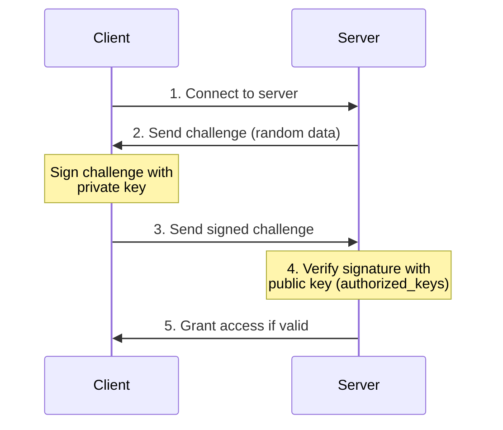
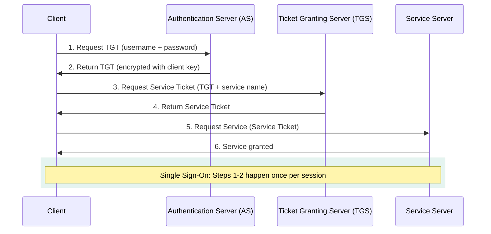

# Authentication and Authorization

## Kya Seekhoge Is Tutorial Mein

Socho ek second — jab tum Zomato app khol ke login karte ho, phir order place karte ho, aur phir refund request karte ho — in teeno steps mein OS/system level pe bilkul alag-alag mechanism kaam kar raha hota hai. Login karte time system check karta hai "tum ho kaun" (authentication), aur order/refund ke time check karta hai "tumhe yeh karne ki permission hai ya nahi" (authorization). Yeh dono concepts operating systems aur secure applications ki backbone hain, aur is note mein hum dono ko root se samjhenge.

Is tutorial mein cover karenge:

- Authentication (tum kaun ho) vs Authorization (tum kya kar sakte ho) — clear distinction
- Password-based authentication — hashing aur salting ke saath
- Multi-factor authentication (2FA/MFA) — concepts aur real implementation
- Biometric aur public key authentication (SSH keys)
- Kerberos authentication protocol — enterprise SSO ka backbone
- PAM (Pluggable Authentication Modules) — Linux ka flexible auth system
- Authorization mechanisms aur sudo
- User aur group management Linux mein
- Password policies aur security best practices

**Time Required**: 40-50 minutes

---

## 1. Authentication vs Authorization

### Kya Hota Hai?

Yeh dono words sunne mein similar lagte hain, isliye log confuse ho jaate hain. Lekin inka kaam bilkul alag hai:

- **Authentication** = "Tum kaun ho?" — Yeh identity verify karta hai. Jaise IRCTC pe login karte time username-password daalte ho, system verify karta hai ki tum wahi ho jo claim kar rahe ho.
- **Authorization** = "Tum kya kar sakte ho?" — Yeh permissions check karta hai. Jaise IRCTC pe login ho jaane ke baad bhi, tum kisi aur ke tatkal ticket cancel nahi kar sakte — sirf apne ticket cancel kar sakte ho. Yeh authorization ka kaam hai.

Simple trick yaad rakhne ka: **AuthN** (Authentication) = pehle N wala, **AuthZ** (Authorization) = doosra Z wala. Interview mein bhi yehi shorthand use hota hai.

```
Authentication vs Authorization
===============================

┌─────────────────────────────────────────────────┐
│                                                 │
│  Authentication: "Who are you?"                 │
│  ┌─────────────────────────────────────┐        │
│  │ User: alice                         │        │
│  │ Password: ********                  │        │
│  │ → Verify identity                   │        │
│  └─────────────────────────────────────┘        │
│                   │                             │
│                   ▼                             │
│              Authenticated                      │
│                   │                             │
│                   ▼                             │
│  Authorization: "What can you do?"              │
│  ┌─────────────────────────────────────┐        │
│  │ Check permissions:                  │        │
│  │ - Can alice read file X?            │        │
│  │ - Can alice write to directory Y?   │        │
│  │ - Can alice execute program Z?      │        │
│  └─────────────────────────────────────┘        │
│                                                 │
└─────────────────────────────────────────────────┘

Key Difference:
- Authentication: Identity verification (login)
- Authorization: Permission checking (access control)
```

Ek aur real-life analogy socho — **airport**. Boarding pass aur ID check karna (security counter pe) authentication hai — woh verify kar rahe hain ki tum wahi ho jiska ticket hai. Lekin uske baad, boarding gate pe sirf business class wale hi priority lane use kar sakte hain — yeh authorization hai. Tumhari identity same rehti hai, lekin tumhare paas kya access hai woh alag hota hai (economy vs business class ticket ke basis pe).

> [!tip]
> Jab bhi koi bug report aaye "user X ko access nahi mil raha", sabse pehle yeh check karo — login fail ho raha hai (authentication issue) ya login toh ho gaya lekin permission nahi mil rahi (authorization issue)? Dono ka fix bilkul alag hota hai.

### Example: Web Application Flow

Neeche ek simplified C example hai jo dikhata hai ki authentication aur authorization do separate functions kaise hote hain — pehle `authenticate()` chalta hai, tab jaake `authorize()` call hota hai:

```c
// Simple authentication and authorization example
#include <stdio.h>
#include <string.h>
#include <stdbool.h>

typedef struct {
    char username[32];
    char password_hash[65];  // SHA-256 hash
    char role[16];
} User;

// Simulated user database
User users[] = {
    {"alice", "5e884898da28047151d0e56f8dc6292773603d0d6aabbdd62a11ef721d1542d8", "admin"},
    {"bob", "6ca13d52ca70c883e0f0bb101e425a89e8624de51db2d2392593af6a84118090", "user"},
};

// Authentication: Verify identity
bool authenticate(const char *username, const char *password_hash) {
    for (int i = 0; i < sizeof(users) / sizeof(User); i++) {
        if (strcmp(users[i].username, username) == 0 &&
            strcmp(users[i].password_hash, password_hash) == 0) {
            printf("✓ Authentication successful for %s\n", username);
            return true;
        }
    }
    printf("✗ Authentication failed\n");
    return false;
}

// Authorization: Check permissions
bool authorize(const char *username, const char *required_role) {
    for (int i = 0; i < sizeof(users) / sizeof(User); i++) {
        if (strcmp(users[i].username, username) == 0) {
            if (strcmp(users[i].role, required_role) == 0 ||
                strcmp(users[i].role, "admin") == 0) {
                printf("✓ Authorization successful: %s has %s access\n",
                       username, required_role);
                return true;
            }
        }
    }
    printf("✗ Authorization failed: insufficient privileges\n");
    return false;
}

int main() {
    const char *username = "alice";
    const char *password_hash = "5e884898da28047151d0e56f8dc6292773603d0d6aabbdd62a11ef721d1542d8";
    
    // Step 1: Authentication
    if (authenticate(username, password_hash)) {
        // Step 2: Authorization
        authorize(username, "admin");  // Check if user can perform admin actions
    }
    
    return 0;
}
```

Notice karo — `authenticate()` sirf yeh check karta hai ki username aur password hash match karta hai ya nahi. `authorize()` alag se check karta hai ki us user ka "role" required permission ke barabar hai ya woh admin hai. Real production systems (jaise Swiggy ka backend) mein yeh dono steps middleware layers ke through hote hain — authentication middleware pehle chalta hai (JWT/session verify), phir authorization middleware role/permission check karta hai.

---

## 2. Password-Based Authentication

### Kyun Zaruri Hai Password Ko Sahi Se Store Karna?

Password sabse common authentication factor hai, lekin sabse zyada misuse bhi yahin hota hai. Agar kisi company ka database leak ho jaaye aur unhone passwords plaintext mein store kiye the, toh attacker ko sabke passwords mil jaayenge — aur log usually same password Gmail, Paytm, Instagram sab jagah use karte hain, toh ek leak se sab kuch compromise ho sakta hai. Isliye password storage ek bahut critical topic hai.

### Password Storage: Plaintext Kabhi Mat Karo!

```
Password Storage Evolution
==========================

❌ Plaintext:
   password → "mypassword123" (NEVER DO THIS!)

❌ Simple Hash:
   password → MD5("mypassword123") = "482c811da5d5b4bc6d497ffa98491e38"
   (Vulnerable to rainbow table attacks)

❌ Hash with Fixed Salt:
   password → SHA256("mypassword123" + "fixedsalt")
   (Vulnerable if salt is discovered)

✅ Hash with Random Salt:
   password → SHA256("mypassword123" + random_salt)
   Store: salt + hash
   (Secure against rainbow tables)

✅✅ Key Derivation Function (Best):
   password → bcrypt/scrypt/Argon2("mypassword123", cost_factor)
   (Slow hashing prevents brute force)
```

Isko step-by-step samjhte hain:

1. **Plaintext**: Bilkul mat karo. Agar database dump ho jaaye, sab password directly visible ho jaayenge. Yeh sabse bada security disaster hai jo kisi bhi company ke saath ho sakta hai.

2. **Simple Hash (MD5/SHA1)**: Yeh thoda better hai kyunki password directly visible nahi hota, lekin attacker "rainbow table" use kar sakta hai — yeh ek precomputed table hai jisme common passwords ke hashes already calculate karke store kiye hote hain. Toh attacker sirf table mein lookup karega aur match mil jaayega. Jaise ek phone book mein number dhoondhna — agar tumhe pata hai list already ready hai toh reverse lookup easy hai.

3. **Hash + Fixed Salt**: Salt ek random string hoti hai jo password ke saath add ki jaati hai hash karne se pehle. Lekin agar salt fixed hai (sab users ke liye same), toh attacker ek hi baar rainbow table banayega us salt ke liye aur phir sabko crack kar sakta hai.

4. **Hash + Random Salt (per user)**: Har user ka apna unique random salt hota hai. Isse rainbow table attack bekaar ho jaata hai kyunki attacker ko har user ke liye alag table banani padegi — practically impossible.

5. **Key Derivation Functions (bcrypt/scrypt/Argon2)**: Yeh sabse best approach hai. Yeh functions **intentionally slow** hote hain — ek hash compute karne mein milliseconds lagte hain (normal SHA256 se hazaar guna zyada slow). Isse brute-force attack bahut mehenga ho jaata hai — agar attacker ek second mein sirf 10 passwords try kar sakta hai (instead of 10 million), toh unka attack practically infeasible ho jaata hai.

> [!warning]
> SHA-256/MD5 general-purpose hashing ke liye fast hone chahiye (file integrity check jaise use cases ke liye), lekin password hashing ke liye **fast hona hi problem hai** — kyunki attacker bhi fast hash try kar sakta hai brute force mein. Isiliye password ke liye specifically bcrypt/scrypt/Argon2 use karo, plain SHA-256 nahi.

### Implementation: Secure Password Hashing

Yeh ek simplified C example hai jo dikhata hai ki salt kaise generate hoti hai aur password kaise hash + verify hota hai (production mein tum bcrypt/Argon2 library use karoge, yeh sirf concept samjhane ke liye hai):

```c
// Password hashing with salt (simplified example)
#include <stdio.h>
#include <stdlib.h>
#include <string.h>
#include <time.h>
#include <openssl/sha.h>

#define SALT_LENGTH 16

// Generate random salt
void generate_salt(unsigned char *salt, size_t length) {
    srand(time(NULL));
    for (size_t i = 0; i < length; i++) {
        salt[i] = rand() % 256;
    }
}

// Hash password with salt
void hash_password(const char *password, const unsigned char *salt,
                   unsigned char *hash_output) {
    unsigned char data[256];
    size_t password_len = strlen(password);
    
    // Combine password and salt
    memcpy(data, password, password_len);
    memcpy(data + password_len, salt, SALT_LENGTH);
    
    // Hash with SHA-256
    SHA256(data, password_len + SALT_LENGTH, hash_output);
}

// Verify password
int verify_password(const char *password, const unsigned char *stored_salt,
                    const unsigned char *stored_hash) {
    unsigned char computed_hash[SHA256_DIGEST_LENGTH];
    
    hash_password(password, stored_salt, computed_hash);
    
    return memcmp(computed_hash, stored_hash, SHA256_DIGEST_LENGTH) == 0;
}

int main() {
    const char *password = "SecurePassword123!";
    unsigned char salt[SALT_LENGTH];
    unsigned char hash[SHA256_DIGEST_LENGTH];
    
    printf("=== Password Hashing Demo ===\n\n");
    
    // Create new password
    generate_salt(salt, SALT_LENGTH);
    hash_password(password, salt, hash);
    
    printf("Password: %s\n", password);
    printf("Salt (hex): ");
    for (int i = 0; i < SALT_LENGTH; i++) {
        printf("%02x", salt[i]);
    }
    printf("\n");
    
    printf("Hash (hex): ");
    for (int i = 0; i < SHA256_DIGEST_LENGTH; i++) {
        printf("%02x", hash[i]);
    }
    printf("\n\n");
    
    // Verify password
    if (verify_password(password, salt, hash)) {
        printf("✓ Password verification successful\n");
    } else {
        printf("✗ Password verification failed\n");
    }
    
    if (verify_password("WrongPassword", salt, hash)) {
        printf("✓ Wrong password accepted (BUG!)\n");
    } else {
        printf("✗ Wrong password rejected (correct)\n");
    }
    
    return 0;
}

// Compile: gcc -o password_hash password_hash.c -lssl -lcrypto
```

Yaad rakhna — verify karte time hum dobara password + stored salt se hash compute karte hain aur compare karte hain original stored hash se. Kabhi bhi hash reverse nahi kiya jaata (yeh mathematically possible hi nahi hai, isiliye hash "one-way function" kehlata hai).

### /etc/shadow Format

Linux mein actual passwords `/etc/passwd` mein nahi, balki `/etc/shadow` file mein store hote hain (aur woh bhi hashed form mein, root ke alawa koi read nahi kar sakta). Chalo iska structure dekhte hain:

```bash
#!/bin/bash
# Understanding /etc/shadow file structure

echo "=== /etc/shadow Format ==="
echo "username:\$id\$salt\$hash:lastchange:min:max:warn:inactive:expire:reserved"
echo ""

# Example entry breakdown
echo "alice:\$6\$rounds=5000\$saltsaltsal\$hash...:18800:0:99999:7:::"
echo ""
echo "Field breakdown:"
echo "1. username: alice"
echo "2. password: \$6\$rounds=5000\$saltsaltsal\$hash..."
echo "   - \$6 = SHA-512 algorithm"
echo "   - \$rounds=5000 = cost factor"
echo "   - saltsaltsal = random salt"
echo "   - hash... = actual password hash"
echo "3. lastchange: 18800 (days since Jan 1, 1970)"
echo "4. min: 0 (minimum days between password changes)"
echo "5. max: 99999 (maximum days password is valid)"
echo "6. warn: 7 (days before expiration to warn user)"
echo "7. inactive: (days after expiration before account is disabled)"
echo "8. expire: (account expiration date)"
echo ""

# View your shadow entry (requires sudo)
if [ "$EUID" -eq 0 ]; then
    echo "Your shadow entry:"
    grep "^$(logname):" /etc/shadow
else
    echo "Run with sudo to view /etc/shadow"
fi
```

Notice karo `$6$` prefix — yeh batata hai ki kaunsa hashing algorithm use hua hai. `$1` = MD5, `$5` = SHA-256, `$6` = SHA-512 (modern default). Yeh format ek standard hai jise "Modular Crypt Format" kehte hain, taaki system ko pata rahe kaunsa algorithm use karke hash generate hua tha.

---

## 3. Multi-Factor Authentication (MFA)

### Kya Hota Hai?

Socho tumhara bank account sirf password se protected hai. Agar kisi tarah tumhara password leak ho gaya (phishing email, keylogger, ya data breach), toh attacker seedha tumhare paise nikaal sakta hai. Isliye banks aur serious apps (Paytm, CRED, Google) **multi-factor authentication** use karte hain — matlab sirf password kaafi nahi, ek aur "factor" bhi chahiye hoga.

### Authentication Factors

Authentication ke teen fundamental "factors" hote hain:

```
Three Authentication Factors
=============================

┌────────────────────────────────────────┐
│ Factor 1: Something You Know           │
│ ├─ Password                            │
│ ├─ PIN                                 │
│ └─ Security question answer            │
├────────────────────────────────────────┤
│ Factor 2: Something You Have           │
│ ├─ Security token (RSA SecurID)        │
│ ├─ Smart card                          │
│ ├─ Phone (for SMS/app)                 │
│ └─ Hardware key (YubiKey)              │
├────────────────────────────────────────┤
│ Factor 3: Something You Are            │
│ ├─ Fingerprint                         │
│ ├─ Face recognition                    │
│ ├─ Iris scan                           │
│ └─ Voice recognition                   │
└────────────────────────────────────────┘

2FA/MFA = Using 2 or more different factors
```

Real-life example samjho — jab tum PhonePe se paisa transfer karte ho:
1. Pehle app khol ke login karte ho (password ya fingerprint — factor 1 ya 3)
2. Phir UPI PIN daalte ho transaction confirm karne ke liye (factor 1 — kuch aur jo tumhe pata hai)

Yeh do alag factors ka combination hai, isliye agar koi tumhara phone chura bhi le, sirf PIN pata na hone se woh transaction nahi kar sakta.

> [!info]
> Important gotcha: **do passwords use karna 2FA nahi hai**. 2FA ke liye do **different categories** ke factors chahiye — jaise password (know) + OTP phone pe (have). Agar tum password + security question dono use karo, yeh technically single-factor hi hai kyunki dono "something you know" category mein aate hain.

### TOTP (Time-Based One-Time Password) Example

Google Authenticator, Microsoft Authenticator jaise apps TOTP algorithm use karte hain — yeh ek shared secret key aur current time ka combination use karke har 30 second mein naya 6-digit code generate karta hai. Server bhi same secret aur time use karke same code compute karta hai, isliye match ho jaata hai bina kisi network communication ke.

```bash
#!/bin/bash
# Simulating TOTP 2FA (like Google Authenticator)

# Install required package: apt-get install oathtool

echo "=== Setting Up TOTP 2FA ==="

# Generate a secret key (base32 encoded)
SECRET=$(head -c 16 /dev/urandom | base32 | tr -d '=')
echo "Your secret key: $SECRET"
echo "(Scan QR code or enter manually in authenticator app)"

# Generate QR code URL for Google Authenticator
USER="alice@example.com"
ISSUER="MyApp"
QR_URL="otpauth://totp/${ISSUER}:${USER}?secret=${SECRET}&issuer=${ISSUER}"
echo ""
echo "QR Code URL: $QR_URL"
echo ""

# Generate current TOTP code
generate_totp() {
    local secret="$1"
    oathtool --totp -b "$secret"
}

# Verify TOTP code
verify_totp() {
    local secret="$1"
    local user_code="$2"
    local current_code=$(generate_totp "$secret")
    
    if [ "$user_code" == "$current_code" ]; then
        return 0  # Valid
    else
        return 1  # Invalid
    fi
}

# Demo: Generate codes every 30 seconds
echo "=== TOTP Codes (change every 30 seconds) ==="
if command -v oathtool &> /dev/null; then
    for i in {1..5}; do
        CODE=$(generate_totp "$SECRET")
        echo "$(date '+%H:%M:%S'): $CODE"
        sleep 5
    done
else
    echo "Install oathtool: sudo apt-get install oathtool"
fi
```

Yeh dekhna interesting hai ki jab tum QR code scan karte ho apne Authenticator app se, actual mein tum sirf yeh `SECRET` key share kar rahe ho — uske baad koi network call nahi hoti, dono taraf (tumhara phone aur server) independently same formula (secret + current timestamp) use karke code compute karte hain. Isiliye internet band hone par bhi Authenticator app codes generate karta rehta hai.

---

## 4. Public Key Authentication (SSH)

### Kya Hota Hai Aur Kyun Better Hai Password Se?

Jab tum kisi remote server pe SSH karte ho (jaise koi AWS EC2 instance, ya production server), password use karne ki jagah **public-private key pair** use karna zyada secure hota hai. Isme private key sirf tumhare paas hoti hai (kabhi network pe travel nahi karti), aur public key server pe already registered hoti hai.

Socho isko is tarah — tumhare ghar ki chaabi (private key) sirf tumhare paas hai. Ghar ka taala (public key equivalent) building ke security guard ke paas registered hai ki "yeh chaabi is address ke liye valid hai". Guard kabhi tumhari chaabi nahi maangta, bas verify karta hai ki tumhari chaabi taale mein fit ho rahi hai ya nahi.

### How SSH Key Authentication Works



```
SSH Public Key Authentication Flow
===================================

Client                                    Server
┌──────┐                                ┌──────┐
│      │                                │      │
│  1. Connect to server                 │      │
│  ────────────────────────────────────>│      │
│      │                                │      │
│      │  2. Server sends challenge    │      │
│  <────────────────────────────────────│      │
│      │     (random data)              │      │
│      │                                │      │
│  3. Sign challenge with private key   │      │
│     (only client has private key)     │      │
│  ────────────────────────────────────>│      │
│      │                                │      │
│      │  4. Verify signature with      │      │
│      │     public key                 │      │
│      │     (stored in authorized_keys)│      │
│      │                                │      │
│      │  5. Grant access if valid      │      │
│  <────────────────────────────────────│      │
│      │                                │      │
└──────┘                                └──────┘
```

Yahan sabse important point yeh hai — **private key kabhi network pe nahi jaati**. Server sirf ek random challenge bhejta hai, client us challenge ko apni private key se "sign" karta hai (jaise digital signature), aur server sirf yeh verify karta hai ki signature valid hai using public key. Chahe koi beech mein traffic sniff kar le, unhe private key ka koi clue nahi milega — matlab man-in-the-middle attack se bhi safe.

Isiliye jab tum GitHub pe SSH key add karte ho, tumhe apni **public** key paste karni hoti hai — private key kabhi kahin share nahi karni, woh sirf tumhare laptop pe rehni chahiye (`~/.ssh/id_rsa` — file permission bhi strict honi chahiye, `600`).

### SSH Key Setup

```bash
#!/bin/bash
# Complete SSH key authentication setup

echo "=== SSH Key Authentication Setup ==="

# Generate SSH key pair
generate_ssh_key() {
    echo "Generating RSA key pair..."
    ssh-keygen -t rsa -b 4096 -C "alice@example.com" -f ~/.ssh/id_rsa_demo -N ""
    
    echo ""
    echo "✓ Generated key pair:"
    echo "  Private key: ~/.ssh/id_rsa_demo"
    echo "  Public key:  ~/.ssh/id_rsa_demo.pub"
    echo ""
    
    # Display public key
    echo "Public key content:"
    cat ~/.ssh/id_rsa_demo.pub
}

# Copy public key to server
setup_server_auth() {
    local server="$1"
    
    echo ""
    echo "Copying public key to server..."
    ssh-copy-id -i ~/.ssh/id_rsa_demo.pub "$server"
    
    echo "✓ Public key added to $server:~/.ssh/authorized_keys"
}

# Test SSH connection
test_connection() {
    local server="$1"
    
    echo ""
    echo "Testing SSH connection..."
    ssh -i ~/.ssh/id_rsa_demo "$server" "echo '✓ SSH key authentication successful!'"
}

# Secure SSH configuration
secure_ssh_config() {
    echo ""
    echo "=== Recommended /etc/ssh/sshd_config settings ==="
    cat << 'EOF'
# Disable password authentication (use keys only)
PasswordAuthentication no
ChallengeResponseAuthentication no

# Disable root login
PermitRootLogin no

# Enable public key authentication
PubkeyAuthentication yes

# Limit authentication attempts
MaxAuthTries 3

# Use strong ciphers
Ciphers aes256-gcm@openssh.com,aes128-gcm@openssh.com

# Enable strict mode (check file permissions)
StrictModes yes
EOF
}

# Usage
# generate_ssh_key
# setup_server_auth "user@remote-server.com"
# test_connection "user@remote-server.com"
secure_ssh_config
```

> [!warning]
> Production servers pe `PasswordAuthentication no` set karna best practice hai — isse brute-force password attacks completely block ho jaate hain kyunki server password authentication accept hi nahi karega, sirf key-based auth allow hoga.

---

## 5. Kerberos Authentication

### Kya Hota Hai Aur Kyun Chahiye?

Socho ek bade corporate office ka scenario — jaha employee ko email, file server, printer, internal tools sab access karne hain. Agar har service ke liye alag password daalna pade, toh bahut painful hoga. **Kerberos** yeh problem solve karta hai — ek baar login karo, phir saari services automatically accessible ho jaati hain bina baar-baar password daale. Isse **Single Sign-On (SSO)** kehte hain.

Yeh bilkul waise hi hai jaise tumhara **Aadhaar-linked digital locker** — ek baar Aadhaar se verify ho gaye, phir multiple government services access kar sakte ho bina baar-baar ID proof dikhaye.

### Kerberos Architecture



```
Kerberos Authentication Protocol
=================================

Components:
- Client: User requesting service
- KDC (Key Distribution Center):
  ├─ AS (Authentication Server)
  └─ TGS (Ticket Granting Server)
- Service Server: Resource being accessed

Flow:
         ┌─────────────────┐
         │   Client (C)    │
         └────────┬────────┘
                  │
         1. Request TGT
         (username + password)
                  │
                  ▼
         ┌─────────────────┐
         │ AS (Auth Server)│
         └────────┬────────┘
                  │
         2. Return TGT
         (encrypted with client's key)
                  │
                  ▼
         ┌─────────────────┐
         │   Client (C)    │
         └────────┬────────┘
                  │
         3. Request Service Ticket
         (TGT + service name)
                  │
                  ▼
         ┌─────────────────┐
         │  TGS (Ticket    │
         │  Granting Srv)  │
         └────────┬────────┘
                  │
         4. Return Service Ticket
                  │
                  ▼
         ┌─────────────────┐
         │   Client (C)    │
         └────────┬────────┘
                  │
         5. Request Service
         (Service Ticket)
                  │
                  ▼
         ┌─────────────────┐
         │ Service Server  │
         └─────────────────┘

Advantages:
✓ Single Sign-On (SSO)
✓ No password sent over network
✓ Mutual authentication
✓ Time-limited tickets
```

Isko simplify karke samjhein toh — pehle tum ek "master ticket" (TGT — Ticket Granting Ticket) lete ho AS (Authentication Server) se, apna username-password ek baar de kar. Yeh TGT thodi der ke liye valid rehta hai (usually 8-10 hours, jaise office shift). Har baar jab tumhe koi specific service chahiye hoti hai (jaise file server), tum TGS ko yeh TGT dikhate ho aur woh tumhe ek chota "service-specific ticket" de deta hai — jo sirf us particular service ke liye kaam karega.

Yeh ekdum railway station ke locker system jaisa hai — pehle tum station master se ek main token lete ho (TGT), phir har locker ke liye us token ko dikhake specific locker chaabi (service ticket) lete ho, bina baar-baar ID proof dikhaye.

Sabse important cheez — **password kabhi network pe nahi jaata baar-baar**. Sirf pehli baar AS ko bhejte time jaata hai, uske baad sab kuch encrypted tickets ke through hota hai. Isse **replay attacks** aur **credential sniffing** ka risk kaafi kam ho jaata hai. Windows Active Directory internally Kerberos hi use karta hai domain login ke liye.

---

## 6. PAM (Pluggable Authentication Modules)

### Kya Hota Hai?

Linux mein alag-alag applications (login, ssh, sudo, cron) ko authentication chahiye hoti hai. Agar har application apna khud ka authentication logic likhe, toh maintain karna nightmare ban jaayega — password check kaha hoga, LDAP integrate karna hai toh sab jagah code change karna padega.

**PAM** yeh problem solve karta hai — yeh ek **pluggable/modular framework** hai jo authentication logic ko application se **decouple** kar deta hai. Application sirf PAM library call karta hai, aur PAM decide karta hai actual authentication kaise hogi (local password, LDAP, Kerberos, Google Authenticator, waisa kuch bhi) — **bina application ka code change kiye**.

Socho isko payment gateway integration ki tarah — Zomato/Swiggy apne app mein "Razorpay" ya "PayU" plug karte hain payment ke liye. Agar kal woh gateway switch karna chahein (Razorpay se Cashfree), unhe apna poora checkout flow rewrite nahi karna padta — bas configuration change karni padti hai. PAM bhi authentication ke liye yehi flexibility deta hai.

### PAM Architecture

```
PAM Architecture
================

Application (login, ssh, sudo)
        │
        ▼
┌───────────────────┐
│   PAM Library     │
│  (libpam.so)      │
└─────────┬─────────┘
          │
    ┌─────┴─────┬─────────┬─────────┐
    ▼           ▼         ▼         ▼
┌────────┐ ┌────────┐ ┌────────┐ ┌────────┐
│ Module │ │ Module │ │ Module │ │ Module │
│ pam_   │ │ pam_   │ │ pam_   │ │ pam_   │
│ unix   │ │ ldap   │ │ krb5   │ │ google │
│ .so    │ │ .so    │ │ .so    │ │ _auth  │
└────────┘ └────────┘ └────────┘ └────────┘
    │           │         │         │
    └───────────┴─────────┴─────────┘
                  │
                  ▼
        Authentication Result
```

### PAM Configuration

```bash
#!/bin/bash
# Understanding PAM configuration

echo "=== PAM Configuration Files ==="
echo "Location: /etc/pam.d/"
echo ""

# Show PAM configuration for login
cat << 'EOF'
Example: /etc/pam.d/login
=========================

# Authentication
auth       required     pam_unix.so
auth       required     pam_env.so

# Account validation
account    required     pam_unix.so
account    required     pam_time.so

# Password management
password   required     pam_unix.so sha512 shadow
password   required     pam_pwquality.so retry=3

# Session management
session    required     pam_unix.so
session    required     pam_limits.so
session    optional     pam_mail.so standard

PAM Control Flags:
- required:   Must succeed; continue checking
- requisite:  Must succeed; stop if fails
- sufficient: Success is enough; stop checking
- optional:   Result ignored
EOF

echo ""
echo "=== Configuring Password Quality with PAM ==="
cat << 'EOF'
/etc/security/pwquality.conf
============================

# Minimum password length
minlen = 12

# Require at least one digit
dcredit = -1

# Require at least one uppercase
ucredit = -1

# Require at least one lowercase
lcredit = -1

# Require at least one special character
ocredit = -1

# Maximum consecutive characters
maxrepeat = 3

# Check against dictionary
dictcheck = 1
EOF
```

`/etc/pam.d/` ke andar har application ke liye ek config file hoti hai jisme "stack" of modules define hote hain. Yeh stack top se bottom order mein execute hota hai, aur control flags (`required`, `requisite`, `sufficient`, `optional`) decide karte hain agar ek module fail ho jaaye toh kya hoga — jaise ek pipeline jisme kai checks sequentially chalte hain (thoda CI/CD pipeline jaisa socho, jaha har stage pass hone ke baad hi next stage chalta hai).

### Custom PAM Module Example

Tum apna khud ka custom PAM module bhi likh sakte ho — jaise neeche wala example jo sirf business hours (9 AM - 5 PM) mein login allow karta hai:

```c
// Simple custom PAM module (pam_time_restriction.c)
#include <security/pam_modules.h>
#include <security/pam_ext.h>
#include <time.h>
#include <syslog.h>

// PAM authentication function
PAM_EXTERN int pam_sm_authenticate(pam_handle_t *pamh, int flags,
                                   int argc, const char **argv) {
    time_t now;
    struct tm *timeinfo;
    int hour;
    
    // Get current time
    time(&now);
    timeinfo = localtime(&now);
    hour = timeinfo->tm_hour;
    
    // Only allow login during business hours (9 AM - 5 PM)
    if (hour >= 9 && hour < 17) {
        pam_syslog(pamh, LOG_INFO, "Login allowed during business hours");
        return PAM_SUCCESS;
    } else {
        pam_syslog(pamh, LOG_WARNING, "Login denied outside business hours");
        return PAM_AUTH_ERR;
    }
}

// PAM account management function
PAM_EXTERN int pam_sm_acct_mgmt(pam_handle_t *pamh, int flags,
                                int argc, const char **argv) {
    return PAM_SUCCESS;
}

// Compile: gcc -fPIC -shared -o pam_time_restriction.so pam_time_restriction.c -lpam
// Install: sudo cp pam_time_restriction.so /lib/x86_64-linux-gnu/security/
// Configure: Add to /etc/pam.d/login: auth required pam_time_restriction.so
```

Yeh dikhata hai PAM ki asli power — koi bhi custom business logic (time-based restriction, IP-based restriction, custom 2FA) authentication flow mein plug kar sakte ho bina existing applications ka code touch kiye.

---

## 7. sudo aur Privilege Escalation

### Kya Hota Hai?

Linux mein `root` user ke paas sab kuch kar sakne ki power hoti hai (unrestricted access). Lekin roz-roz root ke through login karna dangerous hai — ek galat command (`rm -rf /`) poora system tabaah kar sakti hai. Isliye `sudo` ("superuser do") aata hai — jisse normal user apna khud ka account use karke temporarily elevated privileges ke saath specific commands run kar sakta hai, without directly root ban ke login kiye.

Yeh company ke "temporary access card" jaisa hai — normal employee card se sirf apna floor access milta hai, lekin agar server room mein kaam karna hai toh IT team temporary elevated access card issue karti hai — sirf us specific kaam ke liye, sab jagah ke liye nahi.

### sudo Configuration

```bash
#!/bin/bash
# Understanding and configuring sudo

echo "=== sudo Configuration ==="

# View sudoers file (NEVER edit directly, use visudo!)
cat << 'EOF'
/etc/sudoers
============

# User privilege specification
root    ALL=(ALL:ALL) ALL

# Allow members of group sudo to execute any command
%sudo   ALL=(ALL:ALL) ALL

# User alice can run all commands without password
alice   ALL=(ALL) NOPASSWD: ALL

# User bob can only restart nginx
bob     ALL=(ALL) NOPASSWD: /usr/sbin/service nginx restart

# User charlie can run commands as user www-data
charlie ALL=(www-data) /usr/bin/php

# Users in webadmin group can manage web services
%webadmin ALL=(ALL) /usr/sbin/service apache2 *, /usr/sbin/service nginx *

Syntax: user host=(runas_user:runas_group) commands
EOF

echo ""
echo "=== sudo Security Best Practices ==="
cat << 'EOF'
1. Use visudo to edit /etc/sudoers (prevents syntax errors)
2. Grant minimum necessary privileges
3. Avoid NOPASSWD except for specific commands
4. Use groups instead of individual users
5. Log all sudo usage
6. Set timeout (Defaults timestamp_timeout=5)
7. Require password for sensitive commands
EOF
```

> [!warning]
> `/etc/sudoers` file ko kabhi directly `vim`/`nano` se edit mat karo — hamesha `visudo` command use karo. Yeh command syntax validate karta hai save karne se pehle. Agar tumne direct edit kiya aur ek typo reh gaya, toh sudo hi completely broken ho jaayega aur tum khud ko lock out kar loge system se!

Notice karo — `bob` sirf `nginx restart` command run kar sakta hai, poora root access nahi. Yeh **principle of least privilege** ka best example hai — jitna zaruri hai utna hi access do, extra kuch nahi. Production companies mein yehi practice follow hoti hai — DevOps engineer ko poora server root access dene ki jagah specific commands (deploy scripts, service restart) ke liye scoped sudo access diya jaata hai.

### Logging sudo Usage

```bash
#!/bin/bash
# Monitor sudo usage

echo "=== Monitoring sudo Activity ==="

# View sudo logs
echo "Recent sudo commands:"
grep sudo /var/log/auth.log | tail -20

echo ""
echo "=== sudo Usage by User ==="
grep sudo /var/log/auth.log | grep COMMAND | \
    awk '{print $5}' | sort | uniq -c | sort -rn

echo ""
echo "=== Failed sudo Attempts ==="
grep "sudo.*incorrect password" /var/log/auth.log | tail -10

# Real-time monitoring
echo ""
echo "=== Real-time sudo Monitoring (Ctrl+C to stop) ==="
echo "Watching /var/log/auth.log for sudo activity..."
# tail -f /var/log/auth.log | grep --line-buffered sudo
```

Production servers pe sudo usage ko monitor karna security audit ka standard part hota hai — agar koi employee suspicious commands run kar raha hai (jaise 3 AM ko database drop karne ki koshish), yeh logs se turant pata chal jaata hai.

---

## 8. User aur Group Management

### Kya Hota Hai?

Linux mein har user ek unique ID (UID) rakhta hai, aur users ko groups mein organize kiya jaata hai taaki permissions manage karna aasan ho. Socho isko office ke department structure jaisa — har employee (user) ka apna ID hota hai, aur woh kisi department (group) ka member hota hai. HR department ke logon ko salary data access milta hai, engineering department ko codebase access milta hai — group-based permission assignment se yeh manage karna aasan ho jaata hai, har individual employee ke liye alag se rule banane ki zarurat nahi padti.

### User Management Commands

```bash
#!/bin/bash
# Complete user and group management guide

echo "=== User Management ==="

# Create new user
create_user_demo() {
    echo "Creating user 'testuser'..."
    
    # Method 1: useradd (low-level)
    sudo useradd -m -s /bin/bash -c "Test User" testuser
    sudo passwd testuser
    
    # Method 2: adduser (high-level, interactive)
    # sudo adduser testuser
    
    echo "✓ User created"
    grep testuser /etc/passwd
}

# Modify user
modify_user_demo() {
    echo "Modifying user 'testuser'..."
    
    # Change shell
    sudo usermod -s /bin/zsh testuser
    
    # Add to group
    sudo usermod -aG sudo testuser
    
    # Change home directory
    sudo usermod -d /home/newtest -m testuser
    
    # Lock account
    sudo usermod -L testuser
    
    # Unlock account
    sudo usermod -U testuser
    
    echo "✓ User modified"
}

# Delete user
delete_user_demo() {
    echo "Deleting user 'testuser'..."
    
    # Delete user but keep home directory
    sudo userdel testuser
    
    # Delete user and home directory
    sudo userdel -r testuser
    
    echo "✓ User deleted"
}

echo "=== Group Management ==="

# Create group
create_group_demo() {
    echo "Creating group 'developers'..."
    sudo groupadd developers
    
    # Create with specific GID
    sudo groupadd -g 1500 admins
    
    echo "✓ Groups created"
    tail -2 /etc/group
}

# Add users to groups
manage_group_membership() {
    echo "Managing group membership..."
    
    # Add user to group
    sudo usermod -aG developers testuser
    
    # Add user to multiple groups
    sudo usermod -aG developers,admins testuser
    
    # View user's groups
    groups testuser
    id testuser
}

# Display functions available
cat << 'EOF'

User Management Commands:
=========================

Create Users:
  useradd [options] username
    -m          Create home directory
    -s shell    Set login shell
    -G groups   Add to supplementary groups
    -c comment  Set comment (full name)

Modify Users:
  usermod [options] username
    -aG group   Append to group
    -L          Lock account
    -U          Unlock account
    -s shell    Change shell
    -d dir      Change home directory

Delete Users:
  userdel [options] username
    -r          Remove home directory

Group Commands:
  groupadd groupname
  groupdel groupname
  groupmod -n newname oldname

View Information:
  id username
  groups username
  getent passwd username
  getent group groupname
EOF
```

> [!warning]
> `usermod -aG` mein `-a` (append) flag bhoolna common mistake hai. Agar sirf `usermod -G developers testuser` likha (bina `-a` ke), toh yeh user ke **saare existing groups replace** kar dega sirf `developers` se — matlab user apne baaki groups se remove ho jaayega! Hamesha `-aG` saath mein use karo.

### /etc/passwd, /etc/shadow, /etc/group

```bash
#!/bin/bash
# Understanding authentication files

echo "=== /etc/passwd Format ==="
echo "username:x:UID:GID:comment:homedir:shell"
echo ""
echo "Example:"
echo "alice:x:1000:1000:Alice Smith:/home/alice:/bin/bash"
echo ""
echo "Fields:"
echo "1. Username"
echo "2. x (password stored in /etc/shadow)"
echo "3. UID (user ID)"
echo "4. GID (primary group ID)"
echo "5. Comment/Full Name"
echo "6. Home directory"
echo "7. Login shell"
echo ""

echo "=== /etc/shadow Format ==="
echo "username:\$algorithm\$salt\$hash:lastchange:min:max:warn:inactive:expire"
echo ""
echo "Example:"
echo "alice:\$6\$xyz\$abc...:18800:0:99999:7:::"
echo ""

echo "=== /etc/group Format ==="
echo "groupname:x:GID:members"
echo ""
echo "Example:"
echo "developers:x:1001:alice,bob,charlie"
echo ""

# Display actual entries
if [ "$EUID" -eq 0 ]; then
    echo "=== Your Entries ==="
    echo "/etc/passwd:"
    grep "^$(logname):" /etc/passwd
    echo ""
    echo "/etc/shadow:"
    grep "^$(logname):" /etc/shadow
    echo ""
    echo "/etc/group (groups containing you):"
    groups $(logname)
fi
```

`/etc/passwd` mein `x` field dekh ke confuse mat hona — yeh actual password nahi hai, sirf ek placeholder hai jo batata hai "password `/etc/shadow` mein store hai". Purane Unix systems mein password directly `/etc/passwd` mein hota tha (jo world-readable hai), aur woh bahut bada security hole tha. Isiliye baad mein `/etc/shadow` file introduce ki gayi jo sirf root read kar sakta hai.

---

## 9. Password Policies

### Kyun Zaruri Hai?

Strong password enforce karna kaafi nahi — users agar chahein toh "Password123!" jaisa weak-but-technically-valid password bana lenge. Isliye system-level policies chahiye hoti hain jo enforce karein — minimum length, complexity, expiration, aur password reuse prevention.

### Implementing Password Policies

```bash
#!/bin/bash
# Configure comprehensive password policies

echo "=== Password Policy Configuration ==="

# 1. Password Aging (/etc/login.defs)
cat << 'EOF'
/etc/login.defs
===============

# Password aging controls
PASS_MAX_DAYS   90      # Maximum password age
PASS_MIN_DAYS   1       # Minimum days between changes
PASS_MIN_LEN    12      # Minimum password length
PASS_WARN_AGE   7       # Days warning before expiration

# Umask for user home directories
UMASK           077     # Restrictive by default
EOF

echo ""
echo "=== Set Password Aging for User ==="
cat << 'EOF'
# Set maximum password age (90 days)
sudo chage -M 90 username

# Set minimum password age (1 day)
sudo chage -m 1 username

# Set warning period (7 days)
sudo chage -W 7 username

# Set account expiration date
sudo chage -E 2024-12-31 username

# View password aging information
sudo chage -l username
EOF

echo ""
echo "=== Password Quality Requirements (PAM) ==="
cat << 'EOF'
/etc/security/pwquality.conf
============================

# Length
minlen = 12
minclass = 3        # Minimum character classes

# Character requirements
dcredit = -1        # At least 1 digit
ucredit = -1        # At least 1 uppercase
lcredit = -1        # At least 1 lowercase
ocredit = -1        # At least 1 special char

# Restrictions
maxrepeat = 3       # Max consecutive characters
maxclassrepeat = 4  # Max same class consecutive
gecoscheck = 1      # Check against GECOS field
dictcheck = 1       # Dictionary check
usercheck = 1       # Check against username

# History
remember = 5        # Remember last 5 passwords
EOF

# Apply password aging to existing user
apply_password_policy() {
    local username="$1"
    
    echo ""
    echo "Applying password policy to $username..."
    
    sudo chage -M 90 -m 1 -W 7 "$username"
    sudo passwd -e "$username"  # Force password change at next login
    
    echo "✓ Password policy applied"
    sudo chage -l "$username"
}

# Force password change
force_password_change() {
    local username="$1"
    
    echo "Forcing password change for $username..."
    sudo passwd -e "$username"
    echo "✓ User will be prompted to change password at next login"
}

echo ""
echo "=== Password Policy Checker Script ==="
cat << 'EOF'
#!/bin/bash
# check_password_policies.sh

for user in $(getent passwd | awk -F: '$3 >= 1000 {print $1}'); do
    echo "User: $user"
    chage -l "$user" | grep -E "Last password change|Password expires"
    echo "---"
done
EOF
```

`remember = 5` wali setting interesting hai — yeh purane 5 passwords ka hash history store karta hai, taaki user "Password123" se "Password124" pe switch karke wapas "Password123" pe na aa jaaye har baar expiry ke time. Yeh CRED ya banking apps mein bhi common practice hai jaha "last N passwords repeat nahi kar sakte" wala rule hota hai.

> [!tip]
> `PASS_MAX_DAYS` aur `PASS_MIN_DAYS` dono set karna zaruri hai. Agar sirf max days set kiya (bina min days ke), toh smart users expiry ke time password change karke turant wapas same password pe switch kar sakte hain (do quick changes karke history bypass) — min days yeh trick rokta hai.

---

## Key Takeaways

- **Authentication vs Authorization**: Authentication identity verify karta hai ("tum kaun ho"); authorization permissions check karta hai ("tum kya kar sakte ho"). Dono alag concerns hain, kabhi confuse mat karo.
- **Password Security**: Kabhi plaintext store mat karo. Hamesha salt ke saath hash karo, aur naye systems ke liye bcrypt/scrypt/Argon2 use karo — inki intentional slowness brute-force attacks ko mehenga bana deti hai.
- **Multi-Factor Authentication**: Do ya zyada alag categories ke factors (know/have/are) combine karna security dramatically improve karta hai — jaise PhonePe ka password + UPI PIN combo.
- **Public Key Cryptography**: SSH keys password se zyada secure hain kyunki private key kabhi network pe travel nahi karti — sirf signed challenge bhejta hai.
- **Kerberos**: Enterprise environments mein Single Sign-On aur mutual authentication enable karta hai — password sirf ek baar bhejna padta hai, uske baad time-limited tickets kaam karti hain.
- **PAM**: Linux applications ke liye pluggable authentication framework — application code change kiye bina authentication backend (local, LDAP, Kerberos, 2FA) switch kiya ja sakta hai.
- **sudo**: Principle of least privilege follow karo — poore root access ki jagah specific commands ke liye scoped access do, aur `visudo` hi use karo config edit ke liye.
- **User/Group Management**: `/etc/passwd`, `/etc/shadow`, `/etc/group` — inka structure samajhna Linux security ki foundation hai. Groups se permission management scalable banta hai.
- **Password Policies**: Length, complexity, expiration, aur history — sab enforce karna zaruri hai taaki weak/reused passwords se system compromise na ho.
- **Defense in Depth**: Kabhi ek hi security mechanism pe depend mat karo — password + MFA + monitoring + least privilege sab layers milke system ko secure banate hain.

---

## Exercises

### Beginner

1. Ek bash script likho jo check kare ki `/etc/shadow` mein passwords properly encrypted hain ya nahi
2. Different password policies wale users banao aur unki expiration test karo
3. Do systems ke beech SSH key authentication set up karo
4. sudo configure karo taaki ek user bina full root access ke sirf ek service restart kar sake

### Intermediate

5. Ek C program implement karo jo SHA-256 with salt use karke passwords verify kare
6. Ek custom PAM module banao jo time-of-day ke basis pe login restrict kare
7. Ek script likho jo sudo usage audit kare aur suspicious activity report kare
8. Password quality requirements configure karo aur alag-alag passwords se test karo
9. TOTP (Google Authenticator) use karke ek simple 2FA system set up karo

### Advanced

10. C mein ek simplified Kerberos-jaisa ticket system implement karo
11. Automated password policies ke saath ek comprehensive user provisioning system banao
12. Ek authentication broker banao jo multiple methods support kare (password, SSH key, 2FA)
13. Ek password strength meter develop karo jo common vulnerabilities check kare
14. Multiple applications ke liye ek single sign-on (SSO) system design aur implement karo

---

## Navigation

- [← Back: Security Fundamentals](./01_security_fundamentals.md)
- [Next: Access Control Models →](./03_access_control.md)
- [Security and Protection Home](./README.md)

---

**Further Reading**:
- [PAM System Administrator's Guide](http://www.linux-pam.org/Linux-PAM-html/)
- [SSH Protocol Specification (RFC 4251)](https://tools.ietf.org/html/rfc4251)
- [Kerberos Protocol (RFC 4120)](https://tools.ietf.org/html/rfc4120)
- [NIST Password Guidelines](https://pages.nist.gov/800-63-3/)
