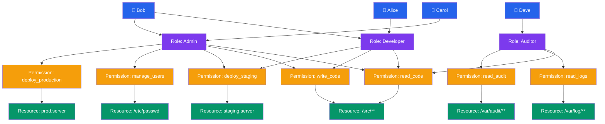

# Access Control

## What You'll Learn

In this tutorial, you'll master the access control models used in modern operating systems:

- DAC (Discretionary Access Control): Unix permissions, chmod, chown, umask
- ACLs: extending Unix permissions with getfacl and setfacl
- MAC (Mandatory Access Control): security labels, Bell-LaPadula model
- RBAC (Role-Based Access Control): roles, permissions, role hierarchy
- Capability-based security
- sudo and /etc/sudoers configuration

**Time Required**: 45-55 minutes

---

## 1. Access Control Fundamentals

Access control answers the question: **"Who can do what to which resource?"**

Every access control system has three components:

- **Subject** — the entity requesting access (user, process)
- **Object** — the resource being accessed (file, device, socket)
- **Action** — the operation requested (read, write, execute)

```
Access Control Decision
=======================

Subject (Process)          Object (File)
┌────────────────┐         ┌─────────────────┐
│ UID: 1000      │──read?──▶  /etc/passwd     │
│ GID: 1000      │         │  owner: root     │
│ Groups: sudo   │         │  perms: -rw-r--r-│
└────────────────┘         └─────────────────┘
         │
         ▼
  ┌──────────────┐
  │  Kernel ACM  │
  │  (Reference  │
  │   Monitor)   │
  └──────────────┘
         │
    ┌────┴────┐
    ▼         ▼
  Allow     Deny
```

The **reference monitor** enforces all access decisions. It must be:
1. **Always invoked** — cannot be bypassed
2. **Tamper-proof** — cannot be modified by untrusted code
3. **Verifiable** — small enough to be analyzed for correctness

---

## 2. DAC: Discretionary Access Control

In DAC, the **owner of a resource decides** who can access it. Unix uses DAC as its primary model.

### Unix Permission Bits

Every file has a 9-bit permission field (plus 3 special bits):

```
-rwxr-xr--  1  alice  developers  4096  Mar 28 10:00  script.sh
│└──┬──┘└──┬──┘└──┬──┘
│   │      │      └── Other: r-- (read only)
│   │      └───────── Group: r-x (read + execute)
│   └──────────────── Owner: rwx (read + write + execute)
└──────────────────── File type: - (regular file)

Type characters:
  -  regular file
  d  directory
  l  symbolic link
  c  character device
  b  block device
  p  named pipe
  s  socket
```

### Permission Meanings by File Type

```
For regular files:
  r = read file contents
  w = write/modify file contents
  x = execute as program

For directories:
  r = list directory contents (ls)
  w = create/delete files in directory
  x = enter directory (cd) and access contents
```

### chmod: Changing Permissions

```bash
# Symbolic mode
chmod u+x script.sh          # add execute for owner
chmod g-w sensitive.txt      # remove write for group
chmod o=r public.html        # set other to read-only
chmod a+r README.md          # add read for all (a = ugo)
chmod u+x,g+x deploy.sh      # multiple changes at once

# Octal mode — each digit is a 3-bit field
chmod 755 script.sh          # rwxr-xr-x
chmod 644 config.txt         # rw-r--r--
chmod 600 private.key        # rw------- (owner only)
chmod 777 shared/            # rwxrwxrwx (everyone — dangerous)
chmod 700 ~/.ssh/            # rwx------ (private directory)

# Octal reference:
# 4 = read (r)
# 2 = write (w)
# 1 = execute (x)
# 7 = rwx, 6 = rw-, 5 = r-x, 4 = r--, 0 = ---

# Recursive
chmod -R 755 /var/www/html/
```

### Special Permission Bits

```bash
# SUID (Set User ID) — bit 4 in special field
# When set on executable: runs as file owner, not caller
chmod u+s /usr/bin/passwd    # passwd runs as root
ls -la /usr/bin/passwd
# -rwsr-xr-x  root  root  /usr/bin/passwd
#    ^--- 's' means SUID is set

# SGID (Set Group ID) — bit 2 in special field
# On executable: runs with file's group
# On directory: new files inherit directory's group
chmod g+s /shared/project/
ls -la /shared/
# drwxrwsr-x  alice  team  project/

# Sticky bit — bit 1 in special field
# On directory: only file owner can delete their own files
chmod +t /tmp
ls -la /
# drwxrwxrwt  root  root  tmp/
#          ^--- 't' means sticky bit set

# Octal: 4=SUID, 2=SGID, 1=sticky
chmod 4755 /usr/local/bin/mysetuid    # SUID + rwxr-xr-x
chmod 1777 /tmp                        # sticky + rwxrwxrwx
```

### chown: Changing Ownership

```bash
# Change owner
chown alice file.txt

# Change owner and group
chown alice:developers file.txt

# Change group only
chown :developers file.txt
# equivalent:
chgrp developers file.txt

# Recursive
chown -R www-data:www-data /var/www/html/

# Change ownership to match another file
chown --reference=reference.txt target.txt
```

### umask: Default Permission Mask

`umask` defines which permission bits are **removed** when new files are created:

```bash
# View current umask
umask          # outputs: 0022
umask -S       # outputs: u=rwx,g=rx,o=rx

# How umask works:
# New file base permissions: 666 (rw-rw-rw-)
# New dir base permissions:  777 (rwxrwxrwx)
# Subtract umask:            022
# Result for file:  666 - 022 = 644 (rw-r--r--)
# Result for dir:   777 - 022 = 755 (rwxr-xr-x)

# Common umask values:
# 022 — default (public readable, group/other no write)
# 027 — group read, no other access
# 077 — private (owner only)
# 002 — group writable (for team directories)

# Set umask (in ~/.bashrc or ~/.profile)
umask 027

# Verify new file permissions
umask 027
touch testfile
ls -la testfile
# -rw-r----- alice developers testfile
```

---

## 3. ACLs: Access Control Lists

Unix permission bits support only one owner, one group, and "other." ACLs extend this to arbitrary users and groups.

### Checking ACL Support

```bash
# Most modern Linux filesystems support ACLs
# ext4, xfs, btrfs all support ACLs natively
# Mount options may be needed on older systems:
# /dev/sda1  /  ext4  defaults,acl  0 1

# Check if filesystem has ACLs enabled
tune2fs -l /dev/sda1 | grep "Default mount options"
```

### getfacl: Reading ACLs

```bash
# View ACL of a file
getfacl /etc/myapp/config.yml

# Example output:
# file: etc/myapp/config.yml
# owner: root
# group: root
# user::rw-          <- owner permissions
# user:alice:r--     <- named user ACL entry
# user:bob:rw-       <- named user ACL entry
# group::r--         <- owning group permissions
# group:ops:rw-      <- named group ACL entry
# mask::rw-          <- effective permission mask
# other::---         <- other permissions

# ACL entry format: type:qualifier:permissions
# type: user, group, other, mask
# qualifier: username, groupname, or empty (for owning user/group)
```

### setfacl: Setting ACLs

```bash
# Grant user alice read access to a file
setfacl -m u:alice:r file.txt

# Grant group devs read+write access
setfacl -m g:devs:rw /srv/app/logs/

# Grant multiple entries at once
setfacl -m u:alice:rwx,g:ops:rx script.sh

# Set default ACL on directory (inherited by new files)
setfacl -d -m g:devs:rw /srv/shared/

# Remove a specific ACL entry
setfacl -x u:alice file.txt

# Remove all ACL entries (revert to standard permissions)
setfacl -b file.txt

# Copy ACL from one file to another
getfacl source.txt | setfacl --set-file=- dest.txt

# Recursive application
setfacl -R -m u:deploy:rx /var/www/html/

# The mask entry limits effective permissions for
# named users, named groups, and owning group:
setfacl -m mask::r /sensitive/file
```

### ACL Mask

```
ACL Effective Permissions
==========================

Entry            Permissions    Mask      Effective
user:alice       rwx        AND rw-    =  rw-
group:devs       rw-        AND rw-    =  rw-
group:ops        r-x        AND rw-    =  r--

The mask acts as a ceiling for all named entries
and the owning group (NOT for the owning user or other)
```

---

## 4. MAC: Mandatory Access Control

In MAC, the **system enforces access policy** — resource owners cannot override it. Every subject and object has a **security label**.

### Security Labels and Clearances

```
Bell-LaPadula Model — Information Flow
=======================================

Security Levels (ordered):
  Top Secret (TS)   ─── highest
  Secret (S)
  Confidential (C)
  Unclassified (U)  ─── lowest

Subject clearances:     Object classifications:
  Alice:  Secret          file_A: Top Secret
  Bob:    Top Secret      file_B: Secret
  Carol:  Confidential    file_C: Unclassified

Bell-LaPadula Rules:
┌─────────────────────────────────────────────────┐
│  No Read Up:  Subject cannot read objects       │
│               at HIGHER classification          │
│               (prevents info leakage upward)    │
│                                                 │
│  No Write Down: Subject cannot write to objects │
│                 at LOWER classification         │
│                 (prevents info leakage downward)│
└─────────────────────────────────────────────────┘

Alice (Secret) can:
  ✓ Read file_B (Secret) — same level
  ✓ Read file_C (Unclassified) — read down allowed
  ✗ Read file_A (Top Secret) — no read up

Bob (Top Secret) can:
  ✓ Read file_A, file_B, file_C
  ✗ Write to file_C (Unclassified) — no write down
```

### Categories and Compartments

Real MAC systems add **compartments** (need-to-know categories):

```
MLS Label format:  level:categories
Examples:
  Secret:NATO,EUR        — Secret, NATO and EUR compartments
  TopSecret:CRYPTO       — Top Secret, CRYPTO compartment only
  Unclassified           — no compartments

Subject must dominate object to access it:
  Dominates means: level >= object level AND
                   subject categories ⊇ object categories

Alice(Secret:NATO) can access Secret:NATO file
Alice(Secret:NATO) CANNOT access Secret:CRYPTO file
```

---

## 5. RBAC: Role-Based Access Control

RBAC assigns permissions to **roles**, then assigns users to roles — decoupling users from permissions.



### RBAC in Linux: Groups as Roles

Linux groups are a simple form of RBAC:

```bash
# Create roles (groups)
groupadd developers
groupadd ops
groupadd auditors

# Assign users to roles
usermod -aG developers alice
usermod -aG developers bob
usermod -aG ops carol
usermod -aG auditors dave

# Assign permissions to roles (via file ownership + ACLs)
chgrp developers /srv/codebase/
chmod 770 /srv/codebase/
setfacl -m g:ops:rx /srv/codebase/

# View user's group memberships (their roles)
groups alice
id alice    # uid=1001(alice) gid=1001(alice) groups=1001(alice),1002(developers)
```

### Role Hierarchy

```
RBAC Role Inheritance
=====================

          superadmin
          /        \
       admin      poweruser
       /    \          \
  operator  auditor   developer
      \                   \
       viewer            junior-dev

Rules:
- Admin inherits all permissions from operator and auditor
- Superadmin inherits from all roles below it
- Junior-dev has subset of developer permissions
```

---

## 6. Capability-Based Security

Instead of ACLs on objects, **capabilities** are unforgeable tokens held by processes that grant specific rights:

```
Capability Model vs ACL Model
==============================

ACL Model (object-centric):
  File: /etc/passwd
  ACL: root:rw, shadow:r, ...
  → "Who can access this object?"

Capability Model (subject-centric):
  Process holds a capability token:
  [cap_token: FILE_READ, /etc/passwd, uid:0]
  → "What can this process access?"

Advantages of capabilities:
  - No ambient authority — must explicitly hold capability
  - Easy to delegate: pass token to subprocess
  - Principle of least privilege naturally enforced
  - No confused deputy problem
```

### Linux POSIX Capabilities

Linux splits root's omnipotent privilege into fine-grained capabilities:

```bash
# View process capabilities
cat /proc/self/status | grep Cap
# CapInh: 0000000000000000  (inheritable)
# CapPrm: 0000000000000000  (permitted)
# CapEff: 0000000000000000  (effective)
# CapBnd: 000001ffffffffff  (bounding set)

# Common capabilities:
# CAP_NET_BIND_SERVICE  — bind ports < 1024
# CAP_NET_ADMIN         — configure network interfaces
# CAP_SYS_TIME          — set system clock
# CAP_DAC_OVERRIDE      — bypass file permission checks
# CAP_KILL              — send signals to any process
# CAP_SYS_ADMIN         — many privileged operations (avoid!)
# CAP_CHOWN             — change file ownership
# CAP_SETUID            — change UID

# Grant a capability to a binary (instead of SUID)
setcap cap_net_bind_service+ep /usr/local/bin/myserver
getcap /usr/local/bin/myserver
# /usr/local/bin/myserver cap_net_bind_service=ep

# Drop all capabilities from a binary
setcap -r /usr/local/bin/myserver

# Run process with dropped capabilities
capsh --drop=cap_sys_admin -- -c "myprogram"

# List capabilities of running process
getpcaps <PID>
```

---

## 7. sudo and /etc/sudoers

`sudo` allows specific users to run commands as another user (typically root), with logging and fine-grained control.

### Basic sudo Usage

```bash
# Run command as root
sudo apt update

# Run as a specific user
sudo -u postgres psql

# Open interactive root shell
sudo -s
sudo -i    # login shell (loads root's environment)

# Run with specific environment
sudo env PATH=/custom/path mycommand

# List what current user can sudo
sudo -l

# Run last command as sudo
sudo !!
```

### /etc/sudoers Syntax

```bash
# Always edit with visudo — validates syntax before saving
sudo visudo
# or edit a specific file:
sudo visudo -f /etc/sudoers.d/myapp

# /etc/sudoers format:
# WHO  WHERE=(AS_WHOM)  WHAT

# User privilege specification
root    ALL=(ALL:ALL) ALL
alice   ALL=(ALL:ALL) ALL             # alice has full sudo
bob     ALL=(root) /usr/bin/systemctl # bob can only run systemctl as root

# Group syntax (% prefix)
%sudo   ALL=(ALL:ALL) ALL             # all members of 'sudo' group
%wheel  ALL=(ALL) ALL                 # all members of 'wheel' group

# NOPASSWD — no password prompt
alice   ALL=(ALL) NOPASSWD: ALL
deploy  ALL=(ALL) NOPASSWD: /usr/bin/systemctl restart nginx

# Command aliases
Cmnd_Alias NETWORKING = /sbin/ifconfig, /sbin/ip, /usr/bin/nmap
Cmnd_Alias SERVICES   = /usr/bin/systemctl start *, /usr/bin/systemctl stop *
Cmnd_Alias REBOOT     = /sbin/reboot, /sbin/shutdown

# User aliases
User_Alias NETADMINS = alice, bob, carol
User_Alias WEBADMINS = dave, eve

# Host aliases
Host_Alias WEBSERVERS = web1, web2, web3

# Combining aliases
NETADMINS  WEBSERVERS=(root) NETWORKING
WEBADMINS  WEBSERVERS=(root) SERVICES, REBOOT

# Deny specific commands (use ! prefix)
alice   ALL=(ALL) ALL, !/bin/su, !/bin/bash

# Include drop-in files
#includedir /etc/sudoers.d
```

### sudoers Drop-in Files

```bash
# Modern systems use /etc/sudoers.d/ for modular config
# Files must have no spaces, no .bak extension, mode 440

# Create a file for the deploy user
cat > /etc/sudoers.d/deploy << 'EOF'
deploy  ALL=(root) NOPASSWD: /usr/bin/systemctl restart myapp, \
                              /usr/bin/systemctl status myapp, \
                              /usr/bin/journalctl -u myapp
EOF
chmod 440 /etc/sudoers.d/deploy

# Validate
sudo visudo -c -f /etc/sudoers.d/deploy
# parsed OK
```

### sudo Logging

```bash
# sudo logs to syslog by default
grep sudo /var/log/auth.log
# Mar 28 10:15:42 host sudo: alice : TTY=pts/0 ; PWD=/home/alice ;
#   USER=root ; COMMAND=/usr/bin/apt update

# More detailed logging with log_output in sudoers:
Defaults log_output
Defaults logfile="/var/log/sudo.log"
Defaults log_host, log_year

# View sudo session recordings (if configured)
sudoreplay -l
sudoreplay -d /var/log/sudo-io/ timestamp
```

---

## 8. Access Control Comparison

```
Model Comparison
================

Feature              DAC       MAC       RBAC      Capabilities
─────────────────────────────────────────────────────────────────
Who sets policy?     Owner     System    Admin     System/Admin
Owner can override?  Yes       No        No        No
Granularity          Medium    Low       High      Very High
Complexity           Low       High      Medium    Medium
Information flow     No        Yes       No        No
  control?
Common use case      Unix      MLS,      Enterprise Linux fine-
                     files     SELinux   systems   grained privs

Typical OS location:
  DAC          → /etc/passwd, chmod, chown
  MAC          → SELinux, AppArmor
  RBAC         → Database systems, enterprise apps, AD
  Capabilities → Linux CAP_*, Docker seccomp
```

---

## 9. Principle of Least Privilege

All access control models should enforce **least privilege**:

```bash
# Bad: overly permissive service account
# Service running as root, accessing everything

# Good: dedicated user with minimal permissions
useradd -r -s /sbin/nologin -d /var/lib/myapp myapp
chown -R myapp:myapp /var/lib/myapp
chmod 700 /var/lib/myapp

# Only grant the capabilities actually needed
setcap cap_net_bind_service+ep /usr/local/bin/myapp

# Use ACLs to grant only what is needed
setfacl -m u:myapp:r /etc/ssl/certs/myapp.crt
setfacl -m u:myapp:r /etc/ssl/private/myapp.key
# (private key should normally be 600 root:root, not world-readable)

# Verify effective permissions
sudo -u myapp cat /etc/ssl/private/myapp.key
```

---

## Summary

| Concept | Key Idea | Linux Tool |
|---------|----------|------------|
| DAC | Owner grants permissions | chmod, chown, umask |
| ACL | Per-user/group permissions | getfacl, setfacl |
| MAC | System-enforced labels | SELinux, AppArmor |
| RBAC | Users get roles, roles get permissions | groups, sudo |
| Capabilities | Fine-grained privilege tokens | setcap, getcap |
| sudo | Controlled privilege escalation | /etc/sudoers |

Access control is layered — production systems combine DAC for everyday file access, RBAC via groups for team workflows, capabilities to eliminate SUID binaries, and MAC (SELinux/AppArmor) as a safety net when other layers fail.
