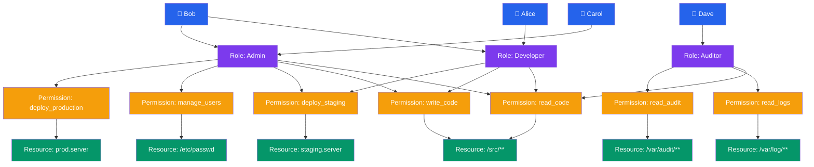

# Access Control

## Kya Seekhoge Is Tutorial Mein

Socho tumhare paas ek building hai — kisi ko lobby tak entry milegi, kisi ko sirf apne floor tak, kisi ko server room tak, aur security guard (watchman) sabko check karega ki kaun kahan jaa sakta hai. Operating system mein bhi bilkul yehi cheez hoti hai — har file, device, socket ek "resource" hai, aur OS ko decide karna padta hai ki kaun usse touch kar sakta hai. Isi poore mechanism ko **Access Control** kehte hain.

Is tutorial mein hum deep dive karenge:

- DAC (Discretionary Access Control): Unix permissions, chmod, chown, umask
- ACLs: Unix permissions ko getfacl aur setfacl se extend karna
- MAC (Mandatory Access Control): security labels, Bell-LaPadula model
- RBAC (Role-Based Access Control): roles, permissions, role hierarchy
- Capability-based security
- sudo aur /etc/sudoers configuration

**Time Required**: 45-55 minutes

---

## 1. Access Control Fundamentals

Access control basically ek simple sawaal ka jawab deta hai: **"Kaun, kis resource pe, kya kar sakta hai?"**

Zomato ka example lo — jab tum order karte ho, toh Zomato ka system check karta hai ki tum (subject) is restaurant ke menu (object) ko dekh sakte ho ya nahi (action = read), aur kya tum order place kar sakte ho (action = write). Bilkul waise hi OS level pe bhi teen cheezein involve hoti hain:

- **Subject** — jo access maang raha hai (user, process). Jaise Zomato app pe logged-in user.
- **Object** — jis resource ko access karna hai (file, device, socket). Jaise restaurant ka menu data.
- **Action** — kya operation chahiye (read, write, execute). Jaise "view menu" ya "place order".

```
Access Control Decision
=======================

Subject (Process)          Object (File)
┌────────────────┐         ┌─────────────────┐
│ UID: 1000      │──read?──▶  /etc/passwd     │
│ GID: 1000      │         │  owner: root     │
│ Groups: sudo   │         │  perms: -rw-r--r-│
└────────────────┘         └─────────────────┘
         │
         ▼
  ┌──────────────┐
  │  Kernel ACM  │
  │  (Reference  │
  │   Monitor)   │
  └──────────────┘
         │
    ┌────┴────┐
    ▼         ▼
  Allow     Deny
```

Yahan jo **reference monitor** hai, wahi asli decision-maker hai — bilkul us building ke security guard ki tarah jo har entry point pe khada hoke check karta hai. Lekin ek achha guard (aur ek achha reference monitor) teen zaruri properties follow karta hai:

1. **Always invoked** — bypass nahi kiya ja sakta. Building mein koi backdoor se andar nahi ghus sakta, security check har entry pe compulsory hai.
2. **Tamper-proof** — koi untrusted code ise modify nahi kar sakta. Guard ko koi bribe deke "mujhe mat rokna" nahi bol sakta.
3. **Verifiable** — itna chhota aur simple ho ki uski correctness verify ki ja sake. Complex logic wala guard galtiyan karega, simple aur clear rules wala nahi.

> [!info]
> Yeh teeno properties mil ke banate hain jise security world mein **"Reference Monitor Concept"** kehte hain — ye Orange Book (TCSEC) jaisi purani security standards ka core idea hai, aur aaj bhi SELinux, kernel LSM (Linux Security Modules) isi principle pe based hain.

---

## 2. DAC: Discretionary Access Control

DAC mein **resource ka owner khud decide karta hai** ki kaun access kar sakta hai. Socho tumhara khud ka Instagram account — tum decide karte ho ki account public rakhna hai ya private, kisko follow request accept karni hai. Unix filesystem bhi bilkul isi tarah kaam karta hai — file ka owner (usually jisne file banayi) decide karta hai permissions kya honge.

### Unix Permission Bits

Har file ke paas 9-bit permission field hota hai (plus 3 special bits jo hum aage dekhenge):

```
-rwxr-xr--  1  alice  developers  4096  Mar 28 10:00  script.sh
│└──┬──┘└──┬──┘└──┬──┘
│   │      │      └── Other: r-- (read only)
│   │      └───────── Group: r-x (read + execute)
│   └──────────────── Owner: rwx (read + write + execute)
└──────────────────── File type: - (regular file)

Type characters:
  -  regular file
  d  directory
  l  symbolic link
  c  character device
  b  block device
  p  named pipe
  s  socket
```

Yaha teen groups hain — **Owner** (jisne file banayi, jaise alice), **Group** (jis team se file belong karti hai, jaise developers), aur **Other** (baaki sab duniya). Har group ke paas apna alag read/write/execute permission hota hai — bilkul jaise ek WhatsApp group mein admin, members, aur "baaki sab" ke alag alag rights hote hain.

### File Type Ke Hisaab Se Permission Ka Matlab

Yahan ek important gotcha hai jo naye developers ko confuse karta hai — file aur directory ke liye `r`, `w`, `x` ka matlab alag hota hai:

```
For regular files:
  r = read file contents
  w = write/modify file contents
  x = execute as program

For directories:
  r = list directory contents (ls)
  w = create/delete files in directory
  x = enter directory (cd) and access contents
```

> [!warning]
> Directory pe `x` permission na ho toh tum us folder ke andar `cd` nahi kar sakte, chahe tumhe `r` permission ho — matlab tum folder ka naam-list dekh sakte ho par andar ja ke files access nahi kar sakte. Aur agar `w` nahi hai directory pe, toh us directory ke andar koi bhi file delete nahi kar sakta — chahe us file ke apne permissions kuch bhi ho. Yeh ek common confusion point hai.

### chmod: Permissions Change Karna

`chmod` (change mode) command se hum permissions modify karte hain. Do tarike hain — symbolic aur octal:

```bash
# Symbolic mode
chmod u+x script.sh          # add execute for owner
chmod g-w sensitive.txt      # remove write for group
chmod o=r public.html        # set other to read-only
chmod a+r README.md          # add read for all (a = ugo)
chmod u+x,g+x deploy.sh      # multiple changes at once

# Octal mode — each digit is a 3-bit field
chmod 755 script.sh          # rwxr-xr-x
chmod 644 config.txt         # rw-r--r--
chmod 600 private.key        # rw------- (owner only)
chmod 777 shared/            # rwxrwxrwx (everyone — dangerous)
chmod 700 ~/.ssh/            # rwx------ (private directory)

# Octal reference:
# 4 = read (r)
# 2 = write (w)
# 1 = execute (x)
# 7 = rwx, 6 = rw-, 5 = r-x, 4 = r--, 0 = ---

# Recursive
chmod -R 755 /var/www/html/
```

Octal mode samajhna easy hai — socho ye ek 3-bit binary switch hai: read=4, write=2, execute=1. Jo jo chahiye unko add kar do. Chahiye read+write toh 4+2=6, chahiye sab kuch toh 4+2+1=7. Teen digits hote hain — owner, group, other ke liye, order wahi rehta hai.

> [!tip]
> `chmod 777` dekhte hi red flag samajho — matlab duniya ka koi bhi user us file ko padh, likh, aur execute kar sakta hai. Production mein galti se koi `chmod 777` daal de, toh woh ek security incident ban sakta hai — jaise apne ghar ka main gate khula chhod dena aur bolna "koi bhi andar aa sakta hai, jo chahe le jaaye."

### Special Permission Bits

Normal `rwx` ke alawa 3 special bits bhi hote hain jo advanced use-cases handle karte hain:

```bash
# SUID (Set User ID) — bit 4 in special field
# When set on executable: runs as file owner, not caller
chmod u+s /usr/bin/passwd    # passwd runs as root
ls -la /usr/bin/passwd
# -rwsr-xr-x  root  root  /usr/bin/passwd
#    ^--- 's' means SUID is set

# SGID (Set Group ID) — bit 2 in special field
# On executable: runs with file's group
# On directory: new files inherit directory's group
chmod g+s /shared/project/
ls -la /shared/
# drwxrwsr-x  alice  team  project/

# Sticky bit — bit 1 in special field
# On directory: only file owner can delete their own files
chmod +t /tmp
ls -la /
# drwxrwxrwt  root  root  tmp/
#          ^--- 't' means sticky bit set

# Octal: 4=SUID, 2=SGID, 1=sticky
chmod 4755 /usr/local/bin/mysetuid    # SUID + rwxr-xr-x
chmod 1777 /tmp                        # sticky + rwxrwxrwx
```

**SUID ka real-world use-case samajho**: `passwd` command jab tum apna password change karte ho, toh usse `/etc/shadow` file mein likhna padta hai jo sirf root hi likh sakta hai. Lekin tum root nahi ho! Toh kaise kaam karta hai? SUID bit ki wajah se — jab tum `passwd` run karte ho, woh temporarily root ban jaata hai (owner ke permission se run hota hai, tumhare nahi), apna kaam karta hai, aur wapas normal ho jaata hai. Bilkul jaise IRCTC ka ek special counter clerk hota hai jo tumhari taraf se seat book kar sakta hai, kyunki usko system access hai, tumhe direct nahi.

**Sticky bit** ka best example `/tmp` folder hai — yeh ek shared directory hai jahan sab users file bana sakte hain, lekin sticky bit ki wajah se koi bhi doosre ki file delete nahi kar sakta, sirf apni khud ki. Socho ek shared PG (paying guest) ka common fridge — sab apna khaana rakh sakte hain, par koi doosre ka khaana nahi fek sakta.

### chown: Ownership Change Karna

```bash
# Change owner
chown alice file.txt

# Change owner and group
chown alice:developers file.txt

# Change group only
chown :developers file.txt
# equivalent:
chgrp developers file.txt

# Recursive
chown -R www-data:www-data /var/www/html/

# Change ownership to match another file
chown --reference=reference.txt target.txt
```

`chown` se file ka owner ya group change hota hai. Ye normally root hi kar sakta hai — kyunki ownership change karna khud ek powerful action hai (socho, agar koi apna passport doosre ke naam pe transfer kar sake toh kaisa chaos ho). Web servers mein common pattern hai `chown -R www-data:www-data` — matlab web server process (jo `www-data` user ke naam se chalta hai) ko us directory ka poora access de dena.

### umask: Default Permission Mask

`umask` decide karta hai ki jab bhi koi **nayi file ya directory banti hai**, uske default permissions kya honge. Ye ek "subtraction mask" ki tarah kaam karta hai — jo bits set hote hain umask mein, wo naye file se **hata diye** jaate hain.

```bash
# View current umask
umask          # outputs: 0022
umask -S       # outputs: u=rwx,g=rx,o=rx

# How umask works:
# New file base permissions: 666 (rw-rw-rw-)
# New dir base permissions:  777 (rwxrwxrwx)
# Subtract umask:            022
# Result for file:  666 - 022 = 644 (rw-r--r--)
# Result for dir:   777 - 022 = 755 (rwxr-xr-x)

# Common umask values:
# 022 — default (public readable, group/other no write)
# 027 — group read, no other access
# 077 — private (owner only)
# 002 — group writable (for team directories)

# Set umask (in ~/.bashrc or ~/.profile)
umask 027

# Verify new file permissions
umask 027
touch testfile
ls -la testfile
# -rw-r----- alice developers testfile
```

Yaad rakho — files ka base 666 hota hai (kabhi bhi 777 nahi, kyunki security reason se OS koi bhi nayi file automatically executable nahi banata), directories ka base 777. Umask jo bhi digit hoga, uska matlab hai "ye permission hata do". Isliye umask **jitna zyada** hoga, naye files utne **kam** open honge — bilkul discount coupon ke ulta, zyada umask = kam permission milna.

---

## 3. ACLs: Access Control Lists

Ab tak jo dekha, usme sirf **teen** categories mil rahi thi — owner, group, other. Lekin real life mein zaroorat padti hai zyada granular control ki. Socho tumhe apni ek file mein sirf alice ko read access dena hai aur bob ko read+write, lekin baaki team ko kuch nahi — normal Unix permission bits se ye possible nahi, kyunki wahan sirf ek "group" allowed hai. Isi limitation ko solve karta hai **ACL (Access Control List)** — ye arbitrary users aur groups ke liye custom permissions allow karta hai.

### ACL Support Check Karna

```bash
# Most modern Linux filesystems support ACLs
# ext4, xfs, btrfs all support ACLs natively
# Mount options may be needed on older systems:
# /dev/sda1  /  ext4  defaults,acl  0 1

# Check if filesystem has ACLs enabled
tune2fs -l /dev/sda1 | grep "Default mount options"
```

### getfacl: ACLs Padhna

```bash
# View ACL of a file
getfacl /etc/myapp/config.yml

# Example output:
# file: etc/myapp/config.yml
# owner: root
# group: root
# user::rw-          <- owner permissions
# user:alice:r--     <- named user ACL entry
# user:bob:rw-       <- named user ACL entry
# group::r--         <- owning group permissions
# group:ops:rw-      <- named group ACL entry
# mask::rw-          <- effective permission mask
# other::---         <- other permissions

# ACL entry format: type:qualifier:permissions
# type: user, group, other, mask
# qualifier: username, groupname, or empty (for owning user/group)
```

Dekho yahan alice ko sirf `r--` (read-only) mila hai, jabki bob ko `rw-` mila hai — yeh flexibility normal `chmod` se possible nahi thi. Ye bilkul Google Docs jaise "share with specific people, different permission levels" wale sharing model jaisa hai — kisi ko sirf "view", kisi ko "edit" access.

### setfacl: ACLs Set Karna

```bash
# Grant user alice read access to a file
setfacl -m u:alice:r file.txt

# Grant group devs read+write access
setfacl -m g:devs:rw /srv/app/logs/

# Grant multiple entries at once
setfacl -m u:alice:rwx,g:ops:rx script.sh

# Set default ACL on directory (inherited by new files)
setfacl -d -m g:devs:rw /srv/shared/

# Remove a specific ACL entry
setfacl -x u:alice file.txt

# Remove all ACL entries (revert to standard permissions)
setfacl -b file.txt

# Copy ACL from one file to another
getfacl source.txt | setfacl --set-file=- dest.txt

# Recursive application
setfacl -R -m u:deploy:rx /var/www/html/

# The mask entry limits effective permissions for
# named users, named groups, and owning group:
setfacl -m mask::r /sensitive/file
```

`-d` flag wala **default ACL** important concept hai — ye directory pe set karo toh us directory ke andar jitni bhi nayi files banengi, unhe automatically wahi ACL inherit hoga. Ye bilkul us shared team folder jaisa hai jahan naya document banate hi automatically poori team ko access mil jaaye, bina manually har baar permission set kiye.

### ACL Mask

Yahan ek subtlety hai jo bahut log miss karte hain — **mask** ek ceiling ki tarah kaam karta hai:

```
ACL Effective Permissions
==========================

Entry            Permissions    Mask      Effective
user:alice       rwx        AND rw-    =  rw-
group:devs       rw-        AND rw-    =  rw-
group:ops        r-x        AND rw-    =  r--

The mask acts as a ceiling for all named entries
and the owning group (NOT for the owning user or other)
```

Matlab chahe tum alice ko `rwx` de do, agar mask sirf `rw-` hai, toh alice ko effective mein `rw-` hi milega — execute chhin jaayega. Ye bilkul us situation jaisi hai jab company tumhe "senior access" deti hai, lekin overall system policy (mask) kehti hai "kisi ko bhi is level se zyada nahi milega" — toh tumhara actual access us overall cap tak hi limit rehta hai. Ye mask sirf named users/groups aur owning group pe apply hota hai — owning user (jo actual chmod wale bits use karta hai) aur "other" is se affect nahi hote.

---

## 4. MAC: Mandatory Access Control

DAC mein hamne dekha ki owner khud decide karta hai kaun access kar sakta hai. Lekin sochiye — agar koi malicious program kisi tarah root ban jaaye ya file ka owner banke uski permissions change kar de, toh poora security model tut jaayega. Isi problem ko solve karta hai **MAC** — yahan **system khud policy enforce karta hai**, resource ka owner bhi ise override nahi kar sakta. Isko socho jaise army ya defense establishment ka access control — chahe tum kisi document ke "owner" ho, agar tumhare paas required clearance nahi hai toh tum use dekh hi nahi sakte, aur na hi apni marzi se kisi ko de sakte ho.

### Security Labels Aur Clearances

MAC mein har subject (user/process) aur object (file/resource) ko ek **security label** milta hai:

```
Bell-LaPadula Model — Information Flow
=======================================

Security Levels (ordered):
  Top Secret (TS)   ─── highest
  Secret (S)
  Confidential (C)
  Unclassified (U)  ─── lowest

Subject clearances:     Object classifications:
  Alice:  Secret          file_A: Top Secret
  Bob:    Top Secret      file_B: Secret
  Carol:  Confidential    file_C: Unclassified

Bell-LaPadula Rules:
┌─────────────────────────────────────────────────┐
│  No Read Up:  Subject cannot read objects       │
│               at HIGHER classification          │
│               (prevents info leakage upward)    │
│                                                 │
│  No Write Down: Subject cannot write to objects │
│                 at LOWER classification         │
│                 (prevents info leakage downward)│
└─────────────────────────────────────────────────┘

Alice (Secret) can:
  ✓ Read file_B (Secret) — same level
  ✓ Read file_C (Unclassified) — read down allowed
  ✗ Read file_A (Top Secret) — no read up

Bob (Top Secret) can:
  ✓ Read file_A, file_B, file_C
  ✗ Write to file_C (Unclassified) — no write down
```

**Bell-LaPadula model** ke do simple rules hain, aur inko yaad rakhne ka trick hai — "no read up, no write down":

- **No Read Up**: Tum apne level se upar ka data nahi padh sakte. Socho ek junior developer (Confidential level) kabhi bhi CEO ke confidential salary negotiation document (Top Secret) nahi padh sakta — chahe wo kitna bhi senior process chala le.
- **No Write Down**: Tum apne level se neeche kuch likh nahi sakte. Yeh thoda counter-intuitive lagta hai, lekin iska reason hai — agar Top Secret clearance wala Bob kisi Unclassified file mein likh de, toh ho sakta hai wo galti se sensitive info leak kar de us niche wale document mein jo koi bhi padh sakta hai. Isliye "write down" allowed nahi.

> [!tip]
> Yaad rakhne ka trick: **"No Read Up, No Write Down"** — ye military aur government systems ke liye design hua tha jahan **confidentiality** (data leak na ho) sabse important cheez thi, performance ya convenience nahi.

### Categories Aur Compartments

Sirf ek linear level (Secret > Confidential > ...) kaafi nahi hota real world mein — isliye MAC systems mein **compartments** (need-to-know categories) bhi hote hain:

```
MLS Label format:  level:categories
Examples:
  Secret:NATO,EUR        — Secret, NATO and EUR compartments
  TopSecret:CRYPTO       — Top Secret, CRYPTO compartment only
  Unclassified           — no compartments

Subject must dominate object to access it:
  Dominates means: level >= object level AND
                   subject categories ⊇ object categories

Alice(Secret:NATO) can access Secret:NATO file
Alice(Secret:NATO) CANNOT access Secret:CRYPTO file
```

Socho tumhare paas Secret level ka access hai, lekin sirf "NATO" compartment ka — matlab tum sirf NATO se related Secret files dekh sakte ho, "CRYPTO" compartment ka Secret data nahi, chahe level same ho. Yeh bilkul us company jaisi hai jahan "Senior Engineer" title kaafi nahi, tumhe specific project ka access bhi chahiye — sirf designation se sab kuch nahi khulta.

> [!info]
> Real world mein **SELinux** aur **AppArmor** MAC ke practical implementations hain. Android bhi internally SELinux use karta hai — isiliye ek app doosre app ka private data directly nahi padh sakta, chahe dono root pe bhi chal rahe hon (agar rooted ho).

---

## 5. RBAC: Role-Based Access Control

DAC mein owner decide karta hai, MAC mein system rigid labels ke through enforce karta hai — dono hi enterprise jaise scenario ke liye slightly impractical hain jahan sainkdon users hain aur unko individually permissions dena ek nightmare ban jaayega. Isiliye aata hai **RBAC** — jahan permissions directly users ko nahi, **roles** ko diye jaate hain, aur phir users ko roles assign kiye jaate hain.

Socho Swiggy ke internal admin dashboard ka example — company mein 500 employees hain. Agar har employee ko individually permission do, toh HR ka nightmare ban jayega. Iski jagah tum roles banate ho — "Support Agent", "Restaurant Partner Manager", "Finance Admin" — aur naye employee ko sirf uska role assign kar do, permissions automatically mil jaate hain.



Notice karo Bob ka case — usko Developer aur Admin dono roles mile hain, matlab uske paas dono role ki permissions ka union hai. Ye real world mein bahut common hai — ek tech lead ko developer ke saath-saath kuch admin rights bhi mil sakti hain.

### RBAC in Linux: Groups as Roles

Linux mein **groups** khud ek simple RBAC implementation hain:

```bash
# Create roles (groups)
groupadd developers
groupadd ops
groupadd auditors

# Assign users to roles
usermod -aG developers alice
usermod -aG developers bob
usermod -aG ops carol
usermod -aG auditors dave

# Assign permissions to roles (via file ownership + ACLs)
chgrp developers /srv/codebase/
chmod 770 /srv/codebase/
setfacl -m g:ops:rx /srv/codebase/

# View user's group memberships (their roles)
groups alice
id alice    # uid=1001(alice) gid=1001(alice) groups=1001(alice),1002(developers)
```

Isko dekho — hum permission ko directly kisi user ko nahi de rahe, balki group (role) ko de rahe hain, aur users ko group mein daal rahe hain. Kal agar alice team change kare, bas usko group se nikaal do aur naye group mein daal do — permission automatically switch ho jayegi. Individually har file pe har user ka access change karne se ye kaafi zyada maintainable hai.

### Role Hierarchy

Real enterprise systems mein roles ek **hierarchy** mein organize hote hain, taaki upar wale roles automatically neeche wale ki saari permissions inherit kar len:

```
RBAC Role Inheritance
=====================

          superadmin
          /        \
       admin      poweruser
       /    \          \
  operator  auditor   developer
      \                   \
       viewer            junior-dev

Rules:
- Admin inherits all permissions from operator and auditor
- Superadmin inherits from all roles below it
- Junior-dev has subset of developer permissions
```

Ye bilkul CRED app ke tiers jaisa hai — "CRED Max" wale ko wahi benefits milte hain jo "CRED" wale ko milte hain, plus kuch extra. Higher role automatically lower role ka superset hota hai, taaki tumhe har role ke liye permissions dobara define na karni padein.

---

## 6. Capability-Based Security

Ab tak jitne models dekhe, unme focus **object** pe tha — "is file ko kaun access kar sakta hai?" (ACL yehi karta hai). Lekin ek doosra tareeka hai sochne ka — **capability-based security**, jahan hum poochte hain "yeh process kya access kar sakta hai?" Yahan process ke paas **unforgeable tokens (capabilities)** hote hain jo specific rights grant karte hain — jaise ek movie ticket jo sirf ek specific seat, specific show ke liye valid hai, na ki poore theatre ka access.

```
Capability Model vs ACL Model
==============================

ACL Model (object-centric):
  File: /etc/passwd
  ACL: root:rw, shadow:r, ...
  → "Who can access this object?"

Capability Model (subject-centric):
  Process holds a capability token:
  [cap_token: FILE_READ, /etc/passwd, uid:0]
  → "What can this process access?"

Advantages of capabilities:
  - No ambient authority — must explicitly hold capability
  - Easy to delegate: pass token to subprocess
  - Principle of least privilege naturally enforced
  - No confused deputy problem
```

Capability model ke fayde samajho ek analogy se — socho tumhare paas ek valet parking token hai jo sirf "gaadi park karo, gaadi nikaalo" ki permission deta hai — us token se koi tumhara ghar ka lock nahi khol sakta, chahe wo gaadi ki chaabi ke saath ho. Har capability sirf specific, limited kaam ke liye hoti hai:

- **No ambient authority** — matlab sirf "root hone" se sab kuch nahi mil jaata, jab tak explicitly capability na ho. Ye "confused deputy problem" ko bhi solve karta hai — jahan ek trusted program (jaise root pe chal raha koi service) bina jaane-samjhe apni full authority kisi attacker ke liye use kar deta hai.
- **Easy to delegate** — token pass karna easy hai, jaise ek valet ko chaabi dena, poori car documents nahi.
- **Least privilege naturally enforced** — process ke paas sirf wahi power hoti hai jo usko explicitly di gayi ho.

### Linux POSIX Capabilities

Linux ne root ka "sab kuch kar sakta hoon" wala omnipotent power todke fine-grained capabilities mein baant diya hai — taaki har program ko sirf utni hi power milе jitni usko zaroorat hai, poora root nahi:

```bash
# View process capabilities
cat /proc/self/status | grep Cap
# CapInh: 0000000000000000  (inheritable)
# CapPrm: 0000000000000000  (permitted)
# CapEff: 0000000000000000  (effective)
# CapBnd: 000001ffffffffff  (bounding set)

# Common capabilities:
# CAP_NET_BIND_SERVICE  — bind ports < 1024
# CAP_NET_ADMIN         — configure network interfaces
# CAP_SYS_TIME          — set system clock
# CAP_DAC_OVERRIDE      — bypass file permission checks
# CAP_KILL              — send signals to any process
# CAP_SYS_ADMIN         — many privileged operations (avoid!)
# CAP_CHOWN             — change file ownership
# CAP_SETUID            — change UID

# Grant a capability to a binary (instead of SUID)
setcap cap_net_bind_service+ep /usr/local/bin/myserver
getcap /usr/local/bin/myserver
# /usr/local/bin/myserver cap_net_bind_service=ep

# Drop all capabilities from a binary
setcap -r /usr/local/bin/myserver

# Run process with dropped capabilities
capsh --drop=cap_sys_admin -- -c "myprogram"

# List capabilities of running process
getpcaps <PID>
```

Best real-world example: agar tum Node.js server bana rahe ho jo port 80 (privileged port, kyunki < 1024) pe bind hona chahta hai, purana tareeka tha poora root banake chalao — jo dangerous hai, kyunki ek bug hone pe attacker root access le sakta hai. Naya tareeka — sirf `CAP_NET_BIND_SERVICE` capability do binary ko:

```bash
setcap cap_net_bind_service+ep /usr/local/bin/myserver
```

Ab woh binary port 80 pe bind ho sakta hai, lekin baaki kisi bhi tarah ka root-level power nahi rakhta — file ownership change nahi kar sakta, doosre processes ko kill nahi kar sakta. Yeh SUID se kaafi zyada safe approach hai kyunki blast radius chhota hai.

> [!warning]
> `CAP_SYS_ADMIN` ko "the new root" bola jata hai security circles mein — ismein itni saari cheezein bundled hain ki isko grant karna almost poore root access dene jaisa hai. Jab bhi possible ho, specific narrow capability use karo (jaise `CAP_NET_BIND_SERVICE`), `CAP_SYS_ADMIN` se bacho.

---

## 7. sudo Aur /etc/sudoers

`sudo` (superuser do) ek aisa mechanism hai jo specific users ko controlled tareeke se dusre user (usually root) ban ke commands run karne deta hai — poori tarah root login karne ki jagah, ek specific command ke liye temporary elevated access. Isko socho jaise office mein ek temporary access card jo tumhe sirf server room mein 10 minute ke liye jaane deta hai, aur har entry-exit ka log rakhta hai.

### Basic sudo Usage

```bash
# Run command as root
sudo apt update

# Run as a specific user
sudo -u postgres psql

# Open interactive root shell
sudo -s
sudo -i    # login shell (loads root's environment)

# Run with specific environment
sudo env PATH=/custom/path mycommand

# List what current user can sudo
sudo -l

# Run last command as sudo
sudo !!
```

`sudo !!` bahut kaam ka trick hai — jab tum koi command bina sudo ke run karo aur "Permission denied" mile, toh `sudo !!` type karke last command ko turant sudo ke saath re-run kar sakte ho, dobara type nahi karna padta.

### /etc/sudoers Syntax

`/etc/sudoers` file define karti hai ki kaun, kahan, kis user ban ke, kya kar sakta hai. Isko kabhi bhi directly text editor se edit mat karo — hamesha `visudo` use karo, kyunki ye syntax validate karta hai save karne se pehle. Agar file corrupt ho gayi bina validation ke, toh koi bhi sudo use nahi kar payega, root access tak lock ho sakta hai.

```bash
# Always edit with visudo — validates syntax before saving
sudo visudo
# or edit a specific file:
sudo visudo -f /etc/sudoers.d/myapp

# /etc/sudoers format:
# WHO  WHERE=(AS_WHOM)  WHAT

# User privilege specification
root    ALL=(ALL:ALL) ALL
alice   ALL=(ALL:ALL) ALL             # alice has full sudo
bob     ALL=(root) /usr/bin/systemctl # bob can only run systemctl as root

# Group syntax (% prefix)
%sudo   ALL=(ALL:ALL) ALL             # all members of 'sudo' group
%wheel  ALL=(ALL) ALL                 # all members of 'wheel' group

# NOPASSWD — no password prompt
alice   ALL=(ALL) NOPASSWD: ALL
deploy  ALL=(ALL) NOPASSWD: /usr/bin/systemctl restart nginx

# Command aliases
Cmnd_Alias NETWORKING = /sbin/ifconfig, /sbin/ip, /usr/bin/nmap
Cmnd_Alias SERVICES   = /usr/bin/systemctl start *, /usr/bin/systemctl stop *
Cmnd_Alias REBOOT     = /sbin/reboot, /sbin/shutdown

# User aliases
User_Alias NETADMINS = alice, bob, carol
User_Alias WEBADMINS = dave, eve

# Host aliases
Host_Alias WEBSERVERS = web1, web2, web3

# Combining aliases
NETADMINS  WEBSERVERS=(root) NETWORKING
WEBADMINS  WEBSERVERS=(root) SERVICES, REBOOT

# Deny specific commands (use ! prefix)
alice   ALL=(ALL) ALL, !/bin/su, !/bin/bash

# Include drop-in files
#includedir /etc/sudoers.d
```

Format `WHO WHERE=(AS_WHOM) WHAT` samajh lo — "kaun", "kis machine pe", "kis user ban ke", "kya command chala sakta hai". Bob ka example dekho — usko `systemctl` chalane ki hi permission hai, poora sudo nahi. Ye least-privilege principle ka perfect example hai — deploy engineer ko sirf service restart karne ki zaroorat hai, poora root access nahi.

> [!warning]
> `alice ALL=(ALL) ALL, !/bin/su, !/bin/bash` jaisi deny-list approach mein loophole ho sakta hai — agar alice `sudo vim` chala ke phir vim ke andar se shell spawn kar de (`:!bash`), toh woh restriction bypass ho sakti hai. Deny-list se better hai ek tight allow-list banao jo sirf zaroori commands allow kare.

### sudoers Drop-in Files

```bash
# Modern systems use /etc/sudoers.d/ for modular config
# Files must have no spaces, no .bak extension, mode 440

# Create a file for the deploy user
cat > /etc/sudoers.d/deploy << 'EOF'
deploy  ALL=(root) NOPASSWD: /usr/bin/systemctl restart myapp, \
                              /usr/bin/systemctl status myapp, \
                              /usr/bin/journalctl -u myapp
EOF
chmod 440 /etc/sudoers.d/deploy

# Validate
sudo visudo -c -f /etc/sudoers.d/deploy
# parsed OK
```

Ek badi monolithic `/etc/sudoers` file manage karne ki jagah, modern systems `/etc/sudoers.d/` directory use karte hain jahan har team/app ke liye alag chhoti file ho sakti hai — bilkul microservices jaisa modular approach, ek monolith ki jagah.

### sudo Logging

```bash
# sudo logs to syslog by default
grep sudo /var/log/auth.log
# Mar 28 10:15:42 host sudo: alice : TTY=pts/0 ; PWD=/home/alice ;
#   USER=root ; COMMAND=/usr/bin/apt update

# More detailed logging with log_output in sudoers:
Defaults log_output
Defaults logfile="/var/log/sudo.log"
Defaults log_host, log_year

# View sudo session recordings (if configured)
sudoreplay -l
sudoreplay -d /var/log/sudo-io/ timestamp
```

`sudo` ka har use automatically syslog mein log hota hai — kaun, kab, kya command chalaayi. Enterprise setups mein `log_output` enable karke poori session ka recording bhi rakha ja sakta hai — bilkul CCTV footage jaisa, jisse baad mein audit kiya ja sake ki kisne kya kiya.

---

## 8. Access Control Comparison

Ab tak humne 4 alag models dekhe — inko side-by-side compare karte hain taaki clear ho jaaye ki kaunsa kab use karna hai:

```
Model Comparison
================

Feature              DAC       MAC       RBAC      Capabilities
─────────────────────────────────────────────────────────────────
Who sets policy?     Owner     System    Admin     System/Admin
Owner can override?  Yes       No        No        No
Granularity          Medium    Low       High      Very High
Complexity           Low       High      Medium    Medium
Information flow     No        Yes       No        No
  control?
Common use case      Unix      MLS,      Enterprise Linux fine-
                     files     SELinux   systems   grained privs

Typical OS location:
  DAC          → /etc/passwd, chmod, chown
  MAC          → SELinux, AppArmor
  RBAC         → Database systems, enterprise apps, AD
  Capabilities → Linux CAP_*, Docker seccomp
```

Simple tareeke se yaad rakho — DAC casual/flexible hai (jaise apne ghar ke rules, khud decide karo), MAC strict aur rigid hai (jaise government/military rules, koi override nahi kar sakta), RBAC enterprise-friendly hai (jaise company ke designations ke hisaab se access), aur Capabilities modern/precise hain (jaise specific-purpose tokens, minimum blast radius).

---

## 9. Principle of Least Privilege

Chahe koi bhi access control model use karo, ek universal rule hamesha follow karna chahiye — **Principle of Least Privilege**: kisi ko bhi utni hi permission do jitni uske kaam ke liye zaroori hai, ek bit bhi zyada nahi.

Socho tum ek naya delivery boy hire karte ho Swiggy jaisi company mein — kya usko poori company ke financial records, HR data, aur admin panel ka access doge? Bilkul nahi — usko sirf apni delivery app ka access chahiye. Yehi principle software services ke liye bhi apply hota hai:

```bash
# Bad: overly permissive service account
# Service running as root, accessing everything

# Good: dedicated user with minimal permissions
useradd -r -s /sbin/nologin -d /var/lib/myapp myapp
chown -R myapp:myapp /var/lib/myapp
chmod 700 /var/lib/myapp

# Only grant the capabilities actually needed
setcap cap_net_bind_service+ep /usr/local/bin/myapp

# Use ACLs to grant only what is needed
setfacl -m u:myapp:r /etc/ssl/certs/myapp.crt
setfacl -m u:myapp:r /etc/ssl/private/myapp.key
# (private key should normally be 600 root:root, not world-readable)

# Verify effective permissions
sudo -u myapp cat /etc/ssl/private/myapp.key
```

Yahan `useradd -r -s /sbin/nologin` se ek dedicated service user banaya gaya hai jo login bhi nahi kar sakta (`nologin` shell), sirf apna service chala sakta hai. Isse agar kabhi is service mein koi vulnerability ho aur attacker isse exploit kare, toh uska damage sirf `myapp` user ki limited permissions tak restrict rahega — poore system pe root access nahi milega.

> [!tip]
> Har production deployment (Docker container ho ya bare-metal server) mein pehla sawaal poochho: "Ye process root ke roop mein kyun chal raha hai?" Agar jawab "convenience ke liye" hai, toh usko fix karo — dedicated user banao, sirf zaroori capabilities do, aur least privilege follow karo.

---

## Key Takeaways

- Access control teen basic cheezon pe based hota hai — **Subject** (kaun), **Object** (kya), **Action** (kya operation) — aur ek **reference monitor** (kernel) inke beech decision leta hai, jo hamesha invoked, tamper-proof, aur verifiable hona chahiye.
- **DAC** mein resource ka owner khud decide karta hai kaun access kar sakta hai — Unix ke `chmod`, `chown`, `umask` isi model pe based hain. Special bits — SUID, SGID, sticky bit — advanced use-cases (jaise `passwd` command, `/tmp` folder) handle karte hain.
- **ACL** DAC ki "sirf owner/group/other" limitation ko todta hai aur arbitrary users/groups ko custom permissions deta hai — `getfacl`/`setfacl` se manage hota hai, aur **mask** ek ceiling ki tarah effective permissions ko limit karta hai.
- **MAC** mein system khud policy enforce karta hai, owner override nahi kar sakta — Bell-LaPadula model ka "No Read Up, No Write Down" rule confidentiality maintain karta hai. SELinux aur AppArmor real-world MAC implementations hain.
- **RBAC** permissions ko roles ke through assign karta hai (users → roles → permissions), jisse large organizations mein management easy ho jaata hai — Linux groups isi ka simple implementation hain.
- **Capabilities** object-centric ACL model se hatke subject-centric approach lete hain — process ke paas sirf explicitly di gayi unforgeable tokens ki power hoti hai, jisse "confused deputy problem" avoid hota hai aur SUID binaries ki jagah fine-grained Linux capabilities (`CAP_NET_BIND_SERVICE` waghera) use ki ja sakti hain.
- **sudo/etc/sudoers** controlled privilege escalation deta hai, hamesha `visudo` se edit karo, allow-list approach use karo deny-list ki jagah, aur `/etc/sudoers.d/` se config ko modular rakho.
- Production systems mein sab models **layered** tarike se use hote hain — everyday file access ke liye DAC, team-based workflows ke liye RBAC (groups), SUID hataane ke liye capabilities, aur ek extra safety net ke roop mein MAC (SELinux/AppArmor). Har jagah **Principle of Least Privilege** follow karo — kisi ko bhi zaroorat se zyada access mat do.
