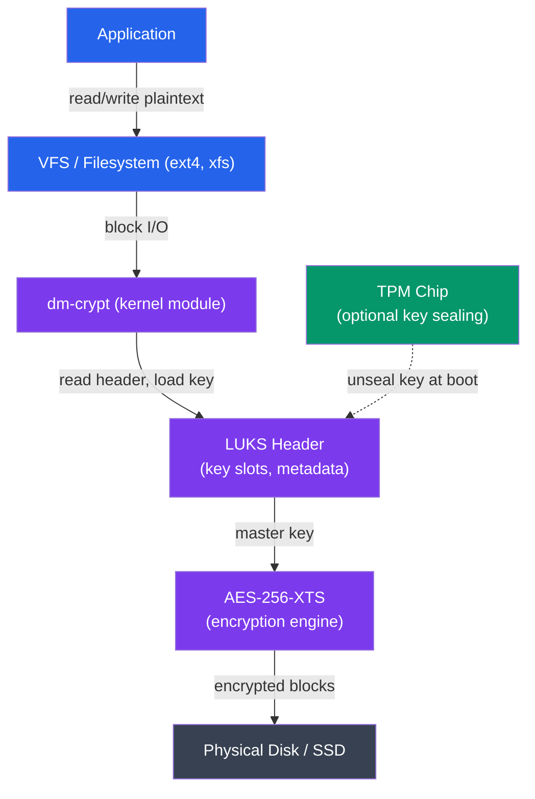

# Cryptography in Operating Systems

## Kya Seekhoge Is Tutorial Mein?

Socho tumhara laptop chori ho gaya. Ab attacker ke paas physical access hai — disk nikal ke kisi doosre machine mein laga sakta hai, bina password ke read kar sakta hai. Isse bachne ka ek hi tareeka hai: **cryptography**. Yehi wo layer hai jo OS ko batati hai ki data ko kaise chhupaya jaaye, tamper hua hai ya nahi kaise pata chale, aur banda wahi hai jo claim kar raha hai ya nahi.

Is note mein hum cover karenge:

- Symmetric encryption (AES): modes ECB/CBC/GCM, key sizes
- Asymmetric encryption (RSA): key pairs, encryption aur signing
- Cryptographic hashing: SHA-256, SHA-3, bcrypt passwords ke liye
- Full disk encryption: LUKS (Linux), BitLocker (Windows), FileVault (macOS)
- eCryptfs — home directory encryption
- TPM (Trusted Platform Module) aur Secure Boot
- Practical: cryptsetup aur dm-crypt commands

**Time Required**: 50-60 minutes

---

## 1. Cryptography Fundamentals

### Kyun Zaruri Hai?

Zomato pe order karte waqt tumhara card number, address, sab kuch network se guzarta hai. Agar koi beech mein baith ke ye data padh le (confidentiality break), ya use change kar de (integrity break), ya fake Zomato server bana ke tumse data churaye (authenticity break) — teeno cases mein tumhara nuksaan hai. Cryptography in teeno problems ko solve karti hai.

```
CIA Triad in Cryptography
==========================

Confidentiality  ─── Encryption prevents unauthorized reading
Integrity        ─── Hashing/MAC detects unauthorized modification
Authenticity     ─── Digital signatures verify the source

Cryptographic Primitives:
┌──────────────────┬──────────────────────────────────────────┐
│ Primitive        │ Purpose                                  │
├──────────────────┼──────────────────────────────────────────┤
│ Symmetric cipher │ Fast bulk data encryption (AES)          │
│ Asymmetric cipher│ Key exchange, signatures (RSA, ECC)      │
│ Hash function    │ Fingerprinting, integrity check (SHA)    │
│ MAC              │ Authenticated integrity (HMAC)           │
│ KDF              │ Derive keys from passwords (bcrypt, PBKDF2)│
│ RNG              │ Unpredictable key material (/dev/urandom) │
└──────────────────┴──────────────────────────────────────────┘
```

Har primitive ka apna specific kaam hai — bilkul kitchen ke tools jaise. Chaaku se sabzi kaatoge, chimta se roti uthaoge. Symmetric cipher bulk data ke liye fast hai (poora movie file encrypt karna), lekin key share karna problem hai. Asymmetric cipher key share karne ka safe tareeka deta hai lekin slow hai. Isliye real systems dono ko mila ke use karte hain — aage "Hybrid Encryption" section mein dekhoge.

---

## 2. Symmetric Encryption: AES

**Symmetric** ka matlab hai — encrypt aur decrypt dono ke liye **same key** use hoti hai. Jaise ek hi taala-chaabi ka set ho, jisse tum bhi darwaza khol sakte ho aur dost bhi (agar chaabi uske paas ho).

AES (Advanced Encryption Standard) ek **block cipher** hai — matlab ye data ko fixed 128-bit (16-byte) blocks mein process karta hai, using shared secret key. Ye poori duniya ka industry-standard cipher hai — tumhara WhatsApp, banking app, WiFi (WPA2/3) sab AES use karte hain.

### Key Sizes

Jitni badi key, utna zyada brute-force resistant — lekin thoda slower bhi.

```
AES Key Sizes
=============
AES-128: 128-bit key (16 bytes)  — 10 rounds, fast, secure
AES-192: 192-bit key (24 bytes)  — 12 rounds
AES-256: 256-bit key (32 bytes)  — 14 rounds, most common for FDE

Security comparison:
  AES-128: ~2^128 operations to brute-force (practically unbreakable)
  AES-256: ~2^256 operations (recommended for long-term data)

The key size is the weakness — never reuse keys, derive them properly.
```

> [!info]
> AES-128 khud kabhi practically break nahi hui hai — 2^128 combinations itni zyada hain ki universe ke saare computers mila ke bhi lifetime mein brute-force nahi kar sakte. Lekin long-term sensitive data (jaise government records, backups jo 20 saal store honge) ke liye AES-256 recommend hota hai, quantum computing ke future threat ko dhyan mein rakhte hue.

### Modes of Operation

Ab yahan interesting part aata hai. Block cipher sirf ek 16-byte block encrypt kar sakta hai. Real file toh GBs ki hoti hai — usme thousands of blocks hote hain. Toh un blocks ko chain kaise karein? Yehi decide karta hai **mode of operation**. Wrong mode choose karna encryption ko practically bekaar bana deta hai — chahe key kitni bhi strong ho.

```
ECB (Electronic Codebook) — NEVER USE
=======================================
  Plaintext:  [Block1][Block2][Block3]
  Key:        [  K  ] [  K  ] [  K  ]
  Ciphertext: [Enc1 ] [Enc2 ] [Enc3 ]

  Problem: identical plaintext blocks → identical ciphertext blocks.
  Pattern leakage visible even in encrypted data (famous penguin image).

CBC (Cipher Block Chaining) — Common, but fragile
==================================================
  IV ──XOR──▶ Encrypt ──▶ [Cipher1]
              Plaintext1           │
                                   ▼
              [Cipher1]──XOR──▶ Encrypt ──▶ [Cipher2]
              Plaintext2

  Requires random IV per message.
  Malleable: bit flips in ciphertext affect decryption predictably.
  No built-in integrity verification — must add HMAC separately.

GCM (Galois/Counter Mode) — Use this
=====================================
  - Combines encryption (CTR mode) + authentication (GHASH)
  - Produces ciphertext + 16-byte authentication tag
  - Tag verifies both integrity and authenticity
  - Parallelizable (fast on modern hardware with AES-NI)
  - Output: nonce + ciphertext + tag

  AES-256-GCM is the standard for authenticated encryption (AEAD)
```

**ECB samajh lo aise**: har block ko independently, same key se encrypt kar diya — bina kisi context ke. Result? Agar original image mein do jagah same color ka pattern hai (jaise ek famous "penguin image" example, jisme ECB-encrypted image ka silhouette clearly dikhta hai), toh encrypted version mein bhi wahi pattern dikhega, kyunki same plaintext block → same ciphertext block. Ye bilkul aisa hai jaise tum apna Aadhar number chhupane ke liye har digit ko fixed rule se replace karo (jaise 1→A, 2→B) — pattern phir bhi predictable rahega.

**CBC**: har block ka encryption pichhle block ke ciphertext pe depend karta hai (chaining), plus ek random IV (Initialization Vector) first block ke liye. Isse pattern leakage fix ho jaata hai, lekin CBC ke apne issues hain — jaise "padding oracle attacks" aur ye fact ki CBC khud integrity verify nahi karta. Matlab agar attacker beech mein ciphertext ke kuch bits flip kar de, CBC use predictably decrypt kar dega bina error diye — tumhe pata bhi nahi chalega ki data tamper hua hai, jab tak separately HMAC check na karo.

**GCM**: yehi modern default hai. Ye encryption (CTR mode jaisa) + authentication (GHASH) dono ek saath karta hai, aur ek 16-byte "authentication tag" produce karta hai. Ye tag verify karta hai ki data na sirf encrypted hai, balki tamper bhi nahi hua. Isko bolte hain **AEAD** (Authenticated Encryption with Associated Data). Modern CPUs mein AES-NI hardware acceleration hone ki wajah se GCM fast bhi hai aur parallelizable bhi.

> [!warning]
> Agar kabhi encryption library mein AES mode choose karne ka option mile, **ECB kabhi mat choose karo**. Aur CBC use kar rahe ho toh hamesha alag se HMAC laga ke integrity check karo. Jahan tak ho sake, GCM (ya ChaCha20-Poly1305) use karo — ye already dono kaam (confidentiality + integrity) kar deta hai.

### Using AES in Practice (OpenSSL)

```bash
# Encrypt a file with AES-256-CBC
openssl enc -aes-256-cbc -salt -pbkdf2 -iter 100000 \
  -in plaintext.txt -out encrypted.bin -pass pass:MyPassword

# Decrypt
openssl enc -aes-256-cbc -d -pbkdf2 -iter 100000 \
  -in encrypted.bin -out decrypted.txt -pass pass:MyPassword

# AES-256-GCM (authenticated — better choice)
openssl enc -aes-256-gcm -salt -pbkdf2 -iter 100000 \
  -in plaintext.txt -out encrypted.bin -pass pass:MyPassword

# Generate a random 256-bit key
openssl rand -hex 32
# → a8f3d2e1... (32 bytes = 64 hex chars)

# Generate a random 128-bit IV
openssl rand -hex 16
```

Yahan `-pbkdf2 -iter 100000` dhyan se dekho — hum directly password ko AES key nahi bana rahe. Password se key **derive** kar rahe hain, aur wo bhi 100,000 iterations laga ke, taaki brute-force attacker ko slow kiya jaa sake. Ye concept aage KDF section mein aur detail mein aayega.

---

## 3. Asymmetric Encryption: RSA

### Kya Hota Hai?

Symmetric encryption ki sabse badi problem: dono taraf same key chahiye. Ab socho tum Flipkart pe pehli baar shopping kar rahe ho — tumhare paas Flipkart ke server se koi pehle se shared key nahi hai. Toh secret key safely transmit kaise karoge, jab connection khud abhi secure nahi hai? Ye hai "key distribution problem" — aur isko solve karta hai **asymmetric (public-key) cryptography**.

RSA uses a **key pair**: ek public key (jise sabke saath share kar sakte ho) aur ek private key (jo sirf tumhare paas rehti hai, kabhi share nahi karte). Jo ek key se encrypt hota hai, wo sirf doosri key se decrypt ho sakta hai.

```
RSA Key Pair Usage
==================

Encryption (Confidentiality):
  Sender:  encrypt with recipient's PUBLIC key
  Recipient: decrypt with own PRIVATE key
  → Only recipient can read the message

Digital Signature (Authenticity + Integrity):
  Signer:  sign (encrypt hash) with own PRIVATE key
  Verifier: verify (decrypt hash) with signer's PUBLIC key
  → Only key holder could have signed it

Key Sizes:
  RSA-1024: BROKEN — do not use
  RSA-2048: minimum acceptable (legacy)
  RSA-4096: recommended for long-term security
  ECC P-256: equivalent to RSA-3072, much faster
```

Isko UPI ki analogy se samjho: tumhara UPI ID (public key jaisa) sab jagah share hota hai — QR code pe, contacts mein, kahin bhi. Koi bhi tumhe paise bhej sakta hai UPI ID se. Lekin actual paisa nikaalne ke liye tumhara UPI PIN (private key jaisa) chahiye, jo sirf tumhe pata hai. Same tarah, koi bhi tumhari public key se data encrypt kar sakta hai, lekin decrypt sirf tumhari private key kar sakti hai.

**Digital signature ulta kaam karta hai**: Tum apni private key se hash "sign" karte ho, aur koi bhi tumhari public key se verify kar sakta hai ki signature genuine hai. Ye bilkul aadhar-verified digital signature jaisa hai — jab koi government document pe digital signature dekhta hai, wo verify kar sakta hai ki signer wahi hai jo claim kar raha hai, bina private key jaane.

> [!warning]
> RSA-1024 aur usse chhote keys practically broken maane jaate hain — modern computing power se factorize ho sakte hain. Naye systems mein RSA-2048 minimum hai, aur RSA-4096 ya better, ECC (Elliptic Curve Cryptography) prefer karo. ECC P-256, RSA-3072 jitni security deta hai lekin kaafi tez aur chhoti keys ke saath — yehi wajah hai ki modern TLS/SSH zyada ECC-based algorithms (Ed25519, ECDSA) ki taraf shift ho gaye hain.

### RSA Operations with OpenSSL

```bash
# Generate RSA-4096 key pair
openssl genpkey -algorithm RSA -pkeyopt rsa_keygen_bits:4096 \
  -out private_key.pem

# Extract public key
openssl pkey -in private_key.pem -pubout -out public_key.pem

# Encrypt a file with public key (small files only — use hybrid encryption for large data)
openssl pkeyutl -encrypt -inkey public_key.pem -pubin \
  -in secret.txt -out secret.enc

# Decrypt with private key
openssl pkeyutl -decrypt -inkey private_key.pem \
  -in secret.enc -out secret_decrypted.txt

# Sign a file
openssl dgst -sha256 -sign private_key.pem -out signature.bin document.pdf

# Verify signature
openssl dgst -sha256 -verify public_key.pem \
  -signature signature.bin document.pdf
# → Verified OK

# Protect private key with passphrase
openssl pkey -in private_key.pem -aes-256-cbc -out protected_key.pem
```

Dhyan do — "small files only" comment important hai. RSA mathematically bahut heavy hai (big-number modular exponentiation), aur ek certain size se bada data directly encrypt nahi kar sakta. Isliye RSA ko sirf keys aur signatures ke liye use karte hain, bulk data ke liye nahi.

### Hybrid Encryption

Ye woh trick hai jo har real-world secure system use karta hai — TLS (HTTPS), SSH, PGP (email encryption), sab.

```
Hybrid Encryption (TLS, GPG, etc.)
====================================

1. Generate random AES session key (32 bytes)
2. Encrypt data with AES-GCM using session key     ← fast
3. Encrypt session key with recipient's RSA public key ← secure
4. Transmit: [RSA-encrypted session key] + [AES-encrypted data]

Decryption:
1. Decrypt session key with RSA private key
2. Decrypt data with recovered AES session key

This is how TLS, SSH, PGP, and most real systems work.
```

Isko Ola/Uber ke ride booking se compare karo: pehli baar tumhara account (RSA jaisa slow, secure handshake) verify hota hai, lekin us verification ke baad ek "session" bann jaata hai jisse baaki poora ride ka data fast aur lightweight tareeke se handle hota hai (AES jaisa). Har baar poori identity verification nahi karte — ek baar secure channel bana ke, uske andar fast symmetric key se kaam chalate hain. Yehi exact philosophy hai jab tum browser mein "https://" wali site kholte ho — TLS handshake mein RSA/ECDH use hota hai session key exchange karne ke liye, phir poori session AES-GCM se encrypted rehti hai.

---

## 4. Cryptographic Hashing

### Kya Hota Hai?

Hash function arbitrary size ka data leke usko ek **fixed-size digest** (fingerprint) mein convert kar deta hai. Socho Aadhar number ki tarah — chahe tumhara naam 3 letters ka ho ya 30 letters ka, Aadhar number hamesha 12 digits ka hi rahega, aur ye uniquely tumhe identify karta hai.

Good hash function ki properties:
- **Deterministic** — same input hamesha same output dega
- **One-way** — hash se wapas original input nikal na sako
- **Collision-resistant** — do alag inputs same hash produce na karein
- **Avalanche effect** — input mein chhota sa change → poora hash completely different ho jaaye

```bash
# SHA-256 (256-bit output, 64 hex chars) — general purpose
sha256sum /etc/passwd
# d14a028c2a3a2bc9... /etc/passwd

echo -n "hello" | sha256sum
# 2cf24dba5fb0a30e26e83b2ac5b9e29e1b161e5c1fa7425e73043362938b9824  -

# SHA-512 (512-bit output)
sha512sum important_file.iso

# SHA-3 (Keccak, different internal design from SHA-2)
sha3sum file.txt      # if available; openssl dgst -sha3-256

# MD5 — BROKEN, do not use for security (only legacy checksums)
md5sum file.txt

# Verify file integrity
sha256sum -c checksums.txt   # checks multiple files
echo "d14a028c... /etc/passwd" | sha256sum -c
```

**Kyun zaruri hai?** Socho tumne 4GB ka ISO file download kiya. Download poora hua ki nahi, corrupt toh nahi hua — ye check karne ke liye poora file baar baar compare karne ki zaroorat nahi. Bas SHA-256 hash compare karo — agar match hua, file bit-by-bit same hai. Ye exact use case hai jab Linux distros (Ubuntu, etc.) ISO ke saath ek `.sha256` file dete hain.

> [!warning]
> MD5 aur SHA-1 dono **cryptographically broken** maane jaate hain — collision attacks demonstrate ho chuke hain (do alag files same hash produce kar sakti hain). Inhe sirf legacy checksums (jaise "file corrupt nahi hua" verify karna) ke liye use karo, security-critical cheezon (passwords, signatures) ke liye kabhi nahi.

### HMAC: Keyed Hashing

Plain hash sirf integrity verify karta hai — koi bhi random banda hash compute kar sakta hai. Lekin authenticity (ye data sach mein us specific sender se aaya hai) verify karne ke liye HMAC chahiye, jisme ek secret key add hoti hai.

```bash
# HMAC-SHA256: verifies both integrity AND that sender knows the key
openssl dgst -sha256 -hmac "secret_key" message.txt
# HMAC-SHA256(message.txt)= 5a41402abc4b2a76...

# Verify: compute HMAC on received data with same key,
# compare constant-time with received HMAC
```

**Real-world example**: Razorpay ya Paytm jaise payment gateways webhook events bhejte waqt HMAC signature attach karte hain. Tumhara server received data pe wahi secret key se HMAC compute karta hai aur compare karta hai — agar match nahi hua, matlab ya toh data tamper hua hai, ya request Razorpay se nahi aayi. Isse fake payment-success webhooks block hote hain.

### Password Hashing: bcrypt, scrypt, Argon2

**Kyun alag treatment chahiye?** SHA-256 ekdum fast hai — modern GPU billions of hashes per second compute kar sakta hai. Agar tumne password ko plain SHA-256 se hash kiya aur database leak ho gaya, attacker brute-force se crore passwords per second try kar sakta hai. Isliye password hashing algorithms **jaan-boojh kar slow** banaye jaate hain.

```bash
# bcrypt — most widely supported
# Cost factor controls iterations (higher = slower)
# Format: $2b$12$<22-char salt><31-char hash>
python3 -c "
import bcrypt
password = b'MyPassword123'
# Hash (cost=12 means 2^12 = 4096 iterations)
hashed = bcrypt.hashpw(password, bcrypt.gensalt(rounds=12))
print(hashed)  # b'\$2b\$12\$...'

# Verify
print(bcrypt.checkpw(password, hashed))  # True
"

# Linux /etc/shadow uses yescrypt (default on modern systems)
# or SHA-512 crypt with salt:
# $6$<salt>$<hash>  — SHA-512 (6 = SHA-512 identifier)
# $y$<params>$<salt>$<hash>  — yescrypt

# View password hashing method
grep "^alice:" /etc/shadow
# alice:$6$randomsalt$longhashstring...:19450:0:99999:7:::

# Change password hash algorithm (in /etc/pam.d/common-password)
# password [success=1 default=ignore] pam_unix.so obscure yescrypt
```

Cost factor (`rounds=12` matlab 2^12 = 4096 iterations) tune kar sakte ho — jitna zyada, utna slow hashing, jo brute-force attacker ke liye expensive banata hai. Ye bilkul CRED app jaisa hai jo login pe intentionally thoda delay laata hai security ke liye — password verify karna instant nahi, thoda slow jaan-boojh kar rakha jaata hai.

Salt bhi notice karo — har hash mein ek unique random salt embedded hota hai (`$2b$12$<salt><hash>`). Isse "rainbow table" attacks fail ho jaate hain, kyunki same password bhi har user ke liye different hash produce karta hai (kyunki salt different hai).

> [!tip]
> Agar naya system design kar rahe ho, **Argon2id** best choice hai — ye memory-hard hai (matlab GPU/ASIC-based brute-force ko bhi mehnga bana deta hai, sirf CPU time nahi). bcrypt purana aur widely-supported hai, so still fine hai agar library available nahi hai Argon2 ke liye.

---

## 5. Full Disk Encryption

### Kyun Zaruri Hai?

Socho tumhara office laptop kisi ne chura liya, jisme company ka confidential data hai. Agar disk unencrypted hai, thief hard-disk nikal ke doosre machine mein laga ke sara data padh sakta hai — login password ki koi zarurat nahi, kyunki OS ka login sirf software-level protection hai, disk level pe kuch protect nahi karta.

Full disk encryption (FDE) poore block device ko encrypt kar deta hai, taaki hardware chori hone pe bhi data safe rahe.

### LUKS on Linux

LUKS (Linux Unified Key Setup) Linux ka standard FDE format hai. Ye ek header mein key management metadata store karta hai, jisse multiple passphrases/keys allow hote hain (jaise ek family ke ghar mein multiple chaabiyan ho sakti hain, sabki apni chaabi lekin ek hi taala).



**Kaise kaam karta hai?** Application ko kuch pata hi nahi hota — wo normal file read/write karta hai. VFS layer se hoke request `dm-crypt` kernel module tak jaati hai, jo LUKS header se master key load karta hai (agar correct passphrase di ho), aur phir AES-256-XTS engine use karke transparently encrypt/decrypt karta hai. Ye poora process application ke liye invisible hai — ekdum transparent.

### cryptsetup Commands

```bash
# Create a LUKS container on a partition or file
# (WARNING: destroys existing data)
cryptsetup luksFormat --type luks2 \
  --cipher aes-xts-plain64 \
  --key-size 512 \
  --hash sha256 \
  --iter-time 3000 \
  /dev/sdb1

# Open (decrypt and map to /dev/mapper/mydata)
cryptsetup luksOpen /dev/sdb1 mydata
# → /dev/mapper/mydata is now an unencrypted block device

# Create filesystem on the mapped device
mkfs.ext4 /dev/mapper/mydata

# Mount and use normally
mount /dev/mapper/mydata /mnt/secure

# Unmount and close (re-encrypts)
umount /mnt/secure
cryptsetup luksClose mydata

# View LUKS header info
cryptsetup luksDump /dev/sdb1

# Add a second passphrase/key (LUKS supports 32 key slots)
cryptsetup luksAddKey /dev/sdb1

# Add a key file (for automated unlock)
dd if=/dev/urandom bs=512 count=4 of=/root/keyfile
cryptsetup luksAddKey /dev/sdb1 /root/keyfile
chmod 400 /root/keyfile

# Remove a passphrase
cryptsetup luksRemoveKey /dev/sdb1

# Backup the LUKS header (critical — losing it = losing all data)
cryptsetup luksHeaderBackup /dev/sdb1 --header-backup-file luks-header.bin

# Auto-mount at boot via /etc/crypttab
# name           device        keyfile     options
echo "mydata  /dev/sdb1  none        luks" >> /etc/crypttab
# Then add to /etc/fstab:
echo "/dev/mapper/mydata  /mnt/secure  ext4  defaults  0 2" >> /etc/fstab
```

> [!warning]
> `luksFormat` puraana data **completely destroy** kar deta hai — ye disk header rewrite karta hai. Aur LUKS header backup lena bhool mat, kyunki header lost hone ka matlab hai poora data permanently inaccessible — chahe tumhe passphrase yaad ho tab bhi, kyunki master key sirf header mein encrypted state mein store hoti hai. Ye bilkul aisa hi hai jaise tumhare paas bank locker ki chaabi hai lekin locker ka registration record hi bank ne khoo diya — koi fayda nahi.

### AES-XTS Mode for Disk Encryption

Yahan interesting sawaal aata hai: disk encryption ke liye GCM (jo authenticated hai) kyun nahi, XTS kyun?

```
Why XTS instead of GCM for disk encryption?
============================================

XTS (XEX-based Tweaked CodeBook with ciphertext Stealing):
  - Designed specifically for disk sectors
  - Each 512-byte sector uses a unique "tweak" (sector number)
  - No authentication tag — disk I/O is performance-sensitive
  - XTS-AES-256 uses two 256-bit keys (one for data, one for tweak)

  Key size 512 = two 256-bit keys for XTS mode (not "AES-512")

dm-crypt/LUKS uses XTS by default for this reason.
Integrity checking is added separately via dm-integrity if needed.
```

Disk sectors ko randomly access karna padta hai (kabhi sector 5000 padho, kabhi sector 200) — GCM jaise mode mein sequential nonce chahiye hota hai jo random-access disk I/O ke liye practical nahi hai. Plus GCM ka authentication tag extra storage overhead lega har sector ke liye, jo disk performance ke liye costly hai. XTS specifically disk sectors ke liye design hua hai — har sector apna unique "tweak" (sector number se derived) use karta hai, taaki same plaintext different sectors mein different ciphertext produce kare, bina extra authentication overhead ke.

**Key size 512 ka matlab "AES-512" nahi hai** — confusing point hai. XTS mode mein do alag 256-bit keys use hoti hain (ek data encrypt karne ke liye, ek "tweak" compute karne ke liye), total 512 bits. Isliye "AES-256-XTS" mein actually key-size parameter 512 dikhta hai.

### BitLocker (Windows)

```
BitLocker Architecture
======================

Key protectors (one or more must be configured):
  1. TPM — automatic unlock if system unchanged
  2. TPM + PIN — requires PIN at boot
  3. TPM + USB key — requires USB dongle at boot
  4. Password — manual passphrase entry
  5. Recovery key — 48-digit emergency key (save to AD/Azure AD)

Encryption:
  - AES-128-XTS or AES-256-XTS (configurable via Group Policy)
  - Encrypts entire OS volume, including page file and hibernation

PowerShell commands:
  Enable-BitLocker -MountPoint "C:" -TPMProtector
  Enable-BitLocker -MountPoint "D:" -PasswordProtector -Password (Read-Host -AsSecureString)
  Get-BitLockerVolume
  Backup-BitLockerKeyProtector -MountPoint "C:" -KeyProtectorId $id
  Suspend-BitLocker -MountPoint "C:"     # temporary suspend (e.g., for BIOS update)
  Disable-BitLocker -MountPoint "C:"
```

Windows ka LUKS-equivalent hai BitLocker. "Key protector" concept LUKS ke key slots jaisa hi hai — bas naming alag. Sabse common setup "TPM only" hai — system boot hota hai automatically bina password maange, jab tak TPM verify kare ki system tamper nahi hua (Secure Boot chain intact hai). Agar koi bootloader tamper kare ya disk kisi doosre machine mein transplant kare, TPM key release nahi karega, aur recovery key maangega.

### FileVault (macOS)

```bash
# Enable FileVault (macOS)
sudo fdesetup enable

# Check status
fdesetup status
# FileVault is On.

# Get recovery key
fdesetup showrecovery -inputplist << EOF
<?xml version="1.0" ...>
<plist><dict>
  <key>Username</key><string>admin</string>
  <key>Password</key><string>password</string>
</dict></plist>
EOF

# FileVault uses AES-128-XTS
# Key sealed in Secure Enclave on Apple Silicon / T2 chip
```

Apple ka approach thoda alag hai — key TPM jaisi separate chip mein nahi, balki "Secure Enclave" (Apple Silicon ya T2 chip ka special isolated processor) mein sealed rehti hai. Concept same hai — hardware-backed key protection.

---

## 6. eCryptfs: Home Directory Encryption

### Kya Hota Hai?

Full disk encryption poore disk ko lock karta hai — heavy setup hai, boot process complex ho jaata hai. Agar sirf ek specific directory (jaise `/home/alice`) encrypt karna ho, bina poori disk touch kiye, tab kaam aata hai **eCryptfs**.

eCryptfs individual directories ko filesystem layer pe encrypt karta hai — full disk encryption ke bina bhi home directory encryption ke liye useful hai.

```bash
# eCryptfs encrypts file-by-file in a stacked filesystem
# Each file is independently encrypted with a per-file key
# encrypted with a master key stored in the kernel keyring

# Ubuntu home directory encryption uses eCryptfs by default
# (selected during install)

# Mount an eCryptfs directory manually
mount -t ecryptfs /home/.alice /home/alice
# → prompts for passphrase, cipher, key size

# Auto-mount at login via PAM:
# /etc/pam.d/common-auth includes pam_ecryptfs.so

# Check if home dir is eCryptfs
mount | grep ecryptfs
# /home/.alice on /home/alice type ecryptfs (...)

# Migrate existing unencrypted home to eCryptfs
# (Use ecryptfs-migrate-home as root — requires enough free space)
sudo ecryptfs-migrate-home -u alice

# eCryptfs key management
ecryptfs-add-passphrase
keyctl list @u   # list kernel keyring entries
```

Ye ek "stacked filesystem" hai — matlab ye ext4 jaisi actual filesystem ke upar ek layer ki tarah baithta hai. Har file **individually** apni khud ki key se encrypt hoti hai, aur wo per-file key ek master key se encrypted state mein store hoti hai (jo kernel keyring mein rehti hai). Isse per-user encryption possible hota hai bina poori disk pe FDE laga ke — multi-user Linux system mein useful, jahan har user ka home directory alag se secure karna ho.

---

## 7. TPM aur Secure Boot

### Trusted Platform Module (TPM)

TPM ek dedicated security chip hai jo cryptographic keys ko **hardware mein** store karta hai — matlab keys kabhi bhi normal RAM/disk mein plaintext form mein expose nahi hoti (attacker software-level access se bhi unhe nikal nahi sakta).

```
TPM Capabilities
================

Platform Configuration Registers (PCRs):
  - SHA-1 or SHA-256 hash registers (24 registers in TPM 2.0)
  - Extended at each boot stage: PCR[0] = BIOS, PCR[1] = BIOS config,
    PCR[4] = bootloader, PCR[7] = Secure Boot state
  - Cannot be directly written — only extended (hash chaining)

Key sealing:
  - Bind a key to specific PCR values
  - TPM will only release the key if PCRs match (system unmodified)
  - BitLocker seals its VMK to PCRs 0, 2, 4, 7, 11

Other TPM operations:
  - Hardware RNG (truly random, not pseudo-random)
  - Attestation: prove platform identity/state to remote verifier
  - Endorsement Key (EK): unique per-TPM, burned in at manufacture

Linux TPM tools:
  tpm2-tools package
  tpm2_pcrread                  # read PCR values
  tpm2_createprimary            # create primary key
  tpm2_seal --auth=pcr:sha256:7 # seal data to PCR 7 value
  tpm2_unseal                   # retrieve sealed data (if PCRs match)
```

**PCR concept samjho ek zanjeer (chain) ki tarah**: har boot stage apna hash "extend" karta hai — matlab naya value = hash(purana PCR value + naya component ka hash). Ye ek-tarfa hai; tum PCR ko kabhi bhi directly overwrite nahi kar sakte, sirf extend kar sakte ho. Isliye agar koi bootloader tamper kare, uska hash different hoga, aur chain mein aage saare PCR values automatically alag ho jaayenge.

**Key sealing** ka use case ekdum practical hai: BitLocker apni encryption key ko specific PCR values se "seal" karta hai. Matlab agar system same state mein hai (same BIOS, same bootloader, Secure Boot enabled) toh TPM automatically key release kar dega, koi password maange bina. Lekin agar koi attacker bootloader replace kare ya BIOS setting change kare, PCR values badal jaayenge, aur TPM key release karne se **refuse** kar dega — system recovery key maangega. Ye bilkul CRED app ke device-binding jaisa hai — agar tum naya phone use karo bina proper re-verification ke, app suspicious activity treat karta hai.

### Secure Boot

```
Secure Boot Chain of Trust
===========================

UEFI firmware
  │  Contains Platform Key (PK) — OEM key
  │  Contains Key Exchange Key (KEK) — OS vendor keys
  │  Contains DB — allowed bootloaders/OS signers
  │  Contains DBX — revoked signatures
  │
  ▼ Verifies signature of:
Bootloader (GRUB/Windows Boot Manager)
  │  Signed by Microsoft or distro key
  │
  ▼ Verifies signature of:
Kernel
  │  Signed with distro signing key
  │
  ▼ Optionally loads:
Kernel modules
  │  Must be signed (CONFIG_MODULE_SIG_FORCE)

If any signature check fails → boot halted (tamper detected)

Linux Secure Boot commands:
  mokutil --sb-state          # check Secure Boot status
  mokutil --list-enrolled     # list enrolled keys
  mokutil --import mok.der    # enroll custom key (for self-signed modules)
  mokutil --disable-validation # disable (requires physical confirmation)

  # Sign a custom kernel module
  openssl req -new -x509 -newkey rsa:4096 \
    -keyout mok.key -out mok.crt -days 365 -subj "/CN=Module Signing/"
  mokutil --import mok.crt
  /usr/src/linux-headers-$(uname -r)/scripts/sign-file \
    sha256 mok.key mok.crt mymodule.ko
```

Secure Boot ek **chain of trust** hai — har stage aage wale component ka digital signature verify karta hai, bilkul kisi railway reservation system ki tarah jahan har checkpoint (booking → confirmation → ticket-check → platform entry) pichhle step ki validity verify karta hai, tabhi aage badhne deta hai. UEFI firmware bootloader ka signature verify karta hai, bootloader kernel ka, aur agar `CONFIG_MODULE_SIG_FORCE` enabled hai, kernel modules ka bhi. Agar kahin bhi signature match nahi hua — boot rok diya jaata hai. Ye rootkits aur bootkits (jo boot process ke bahut early stage pe inject hote hain, antivirus se bhi bach jaate hain) se bachne ka primary defense hai.

> [!tip]
> Agar tum khud custom kernel module develop kar rahe ho (jaise koi driver), aur Secure Boot enabled hai, to unsigned module load nahi hoga. Upar wale commands se apni khud ki signing key generate karke MOK (Machine Owner Key) database mein enroll kar sakte ho — phir apne module sign karke load kar sakte ho, bina Secure Boot disable kiye.

---

## 8. Cryptography Performance

```bash
# Benchmark OpenSSL algorithms
openssl speed aes-256-gcm aes-256-cbc rsa4096 sha256

# Sample output (modern CPU with AES-NI):
# type             16 bytes    64 bytes   256 bytes  1024 bytes  8192 bytes
# aes-256-gcm    1234567.8k  2345678.9k  3456789.0k  4567890.1k  5678901.2k
# aes-256-cbc    1123456.7k  2234567.8k  3345678.9k  4456789.0k  5567890.1k

# Check if CPU has AES-NI hardware acceleration
grep aes /proc/cpuinfo
# flags: ... aes ...   ← present means hardware AES acceleration

# dm-crypt performance test
cryptsetup benchmark
# Tests cipher/hash throughput for disk encryption selection
```

Performance ka sawaal isliye zaruri hai kyunki encryption/decryption **har** disk read/write pe hoti hai — agar slow hui, poora system slow feel hoga. Modern CPUs mein **AES-NI** (AES New Instructions) hota hai — special hardware instructions jo AES operations ko directly silicon mein accelerate karte hain, software implementation se 5-10x tak fast. Yehi wajah hai ki aaj-kal full disk encryption enable karne se system performance pe almost koi noticeable impact nahi padta — pehle (bina AES-NI wale zamane mein) ye ek real concern hota tha.

---

## Summary

| Technology | Algorithm | Use Case |
|-----------|-----------|----------|
| Bulk encryption | AES-256-GCM | Files, network traffic |
| Disk encryption | AES-256-XTS | LUKS, BitLocker, FileVault |
| Key exchange | RSA-4096 / ECDH | TLS handshake, SSH |
| File integrity | SHA-256 | Checksums, signing |
| Password storage | bcrypt / Argon2id | /etc/shadow, app DBs |
| Authenticated integrity | HMAC-SHA256 | API tokens, MACs |
| Hardware key storage | TPM 2.0 | Sealed keys, attestation |

OS ka poora cryptography stack ye saari primitives layer-by-layer use karta hai: kernel `/dev/urandom` se entropy deta hai (random keys generate karne ke liye), hardware drivers AES-NI aur TPM expose karte hain, dm-crypt block-level pe encryption apply karta hai, aur uske upar filesystems baithti hain — ye sab application ke liye completely transparent hota hai. Application ko pata bhi nahi chalta ki file read/write karte waqt itni saari cryptographic machinery kaam kar rahi hai.

## Key Takeaways

- **Symmetric (AES)** fast hai bulk data ke liye lekin key-sharing problem hoti hai; **asymmetric (RSA/ECC)** key-sharing solve karta hai lekin slow hai — isliye real systems dono ko **hybrid encryption** mein combine karte hain (TLS, SSH, PGP sab isi tarah kaam karte hain).
- Block cipher **mode of operation** matter karta hai: ECB kabhi use mat karo (pattern leakage), CBC ko alag HMAC ke saath use karo, aur AEAD modes (GCM) prefer karo jo encryption + integrity dono ek saath dete hain.
- **Hashing** (SHA-256/SHA-3) integrity check ke liye hai, **HMAC** authenticity ke liye (keyed hash), aur **password hashing** (bcrypt/Argon2id) intentionally slow hona chahiye brute-force resist karne ke liye — kabhi plain SHA se passwords hash mat karo.
- **Full disk encryption** (LUKS/BitLocker/FileVault) poore disk ko AES-XTS mode se protect karta hai — physical theft se data safe rehta hai; header backup lena critical hai, warna data permanently lost ho sakta hai.
- **eCryptfs** directory-level encryption deta hai bina poori disk encrypt kiye — multi-user systems mein per-user home directory encryption ke liye useful.
- **TPM** hardware mein keys store karta hai aur PCR-based key sealing se ensure karta hai ki key sirf tab release ho jab system tamper na hua ho; **Secure Boot** chain-of-trust se ensure karta hai ki har boot stage cryptographically signed aur verified ho.
- Modern CPUs ka **AES-NI** hardware acceleration disk encryption ko almost-zero performance overhead ke saath possible banata hai — isliye aaj FDE enable karna standard practice hai, koi bahana nahi hai.
