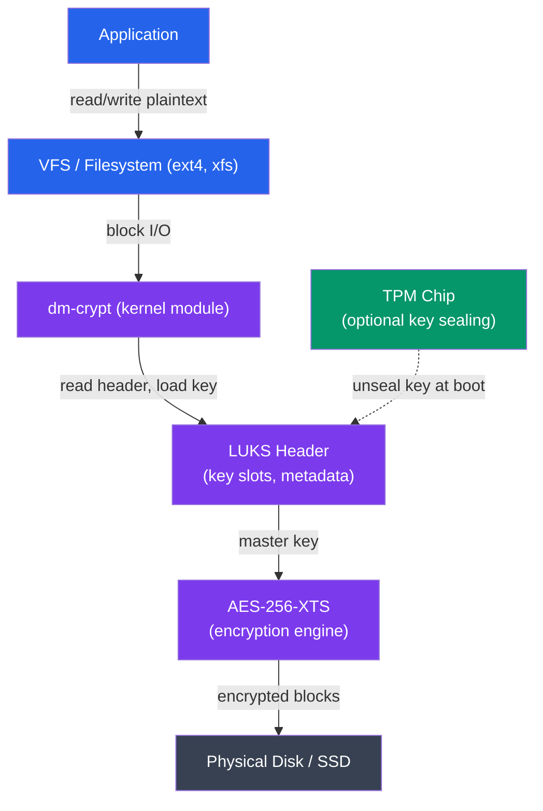

# Cryptography in Operating Systems

## What You'll Learn

In this tutorial, you'll understand how operating systems use cryptography to protect data:

- Symmetric encryption (AES): modes ECB/CBC/GCM, key sizes
- Asymmetric encryption (RSA): key pairs, encryption and signing
- Cryptographic hashing: SHA-256, SHA-3, bcrypt for passwords
- Full disk encryption: LUKS (Linux), BitLocker (Windows), FileVault (macOS)
- eCryptfs for home directory encryption
- TPM (Trusted Platform Module) and Secure Boot
- Practical: cryptsetup and dm-crypt commands

**Time Required**: 50-60 minutes

---

## 1. Cryptography Fundamentals

Cryptography protects three properties of information:

```
CIA Triad in Cryptography
==========================

Confidentiality  ─── Encryption prevents unauthorized reading
Integrity        ─── Hashing/MAC detects unauthorized modification
Authenticity     ─── Digital signatures verify the source

Cryptographic Primitives:
┌──────────────────┬──────────────────────────────────────────┐
│ Primitive        │ Purpose                                  │
├──────────────────┼──────────────────────────────────────────┤
│ Symmetric cipher │ Fast bulk data encryption (AES)          │
│ Asymmetric cipher│ Key exchange, signatures (RSA, ECC)      │
│ Hash function    │ Fingerprinting, integrity check (SHA)    │
│ MAC              │ Authenticated integrity (HMAC)           │
│ KDF              │ Derive keys from passwords (bcrypt, PBKDF2)│
│ RNG              │ Unpredictable key material (/dev/urandom) │
└──────────────────┴──────────────────────────────────────────┘
```

---

## 2. Symmetric Encryption: AES

AES (Advanced Encryption Standard) is a **block cipher** — it processes data in fixed 128-bit (16-byte) blocks using a shared secret key.

### Key Sizes

```
AES Key Sizes
=============
AES-128: 128-bit key (16 bytes)  — 10 rounds, fast, secure
AES-192: 192-bit key (24 bytes)  — 12 rounds
AES-256: 256-bit key (32 bytes)  — 14 rounds, most common for FDE

Security comparison:
  AES-128: ~2^128 operations to brute-force (practically unbreakable)
  AES-256: ~2^256 operations (recommended for long-term data)

The key size is the weakness — never reuse keys, derive them properly.
```

### Modes of Operation

Block ciphers need a **mode** to handle data longer than one block:

```
ECB (Electronic Codebook) — NEVER USE
=======================================
  Plaintext:  [Block1][Block2][Block3]
  Key:        [  K  ] [  K  ] [  K  ]
  Ciphertext: [Enc1 ] [Enc2 ] [Enc3 ]

  Problem: identical plaintext blocks → identical ciphertext blocks.
  Pattern leakage visible even in encrypted data (famous penguin image).

CBC (Cipher Block Chaining) — Common, but fragile
==================================================
  IV ──XOR──▶ Encrypt ──▶ [Cipher1]
              Plaintext1           │
                                   ▼
              [Cipher1]──XOR──▶ Encrypt ──▶ [Cipher2]
              Plaintext2

  Requires random IV per message.
  Malleable: bit flips in ciphertext affect decryption predictably.
  No built-in integrity verification — must add HMAC separately.

GCM (Galois/Counter Mode) — Use this
=====================================
  - Combines encryption (CTR mode) + authentication (GHASH)
  - Produces ciphertext + 16-byte authentication tag
  - Tag verifies both integrity and authenticity
  - Parallelizable (fast on modern hardware with AES-NI)
  - Output: nonce + ciphertext + tag

  AES-256-GCM is the standard for authenticated encryption (AEAD)
```

### Using AES in Practice (OpenSSL)

```bash
# Encrypt a file with AES-256-CBC
openssl enc -aes-256-cbc -salt -pbkdf2 -iter 100000 \
  -in plaintext.txt -out encrypted.bin -pass pass:MyPassword

# Decrypt
openssl enc -aes-256-cbc -d -pbkdf2 -iter 100000 \
  -in encrypted.bin -out decrypted.txt -pass pass:MyPassword

# AES-256-GCM (authenticated — better choice)
openssl enc -aes-256-gcm -salt -pbkdf2 -iter 100000 \
  -in plaintext.txt -out encrypted.bin -pass pass:MyPassword

# Generate a random 256-bit key
openssl rand -hex 32
# → a8f3d2e1... (32 bytes = 64 hex chars)

# Generate a random 128-bit IV
openssl rand -hex 16
```

---

## 3. Asymmetric Encryption: RSA

RSA uses a **key pair**: a public key (shareable) and a private key (secret). What one key encrypts, only the other can decrypt.

```
RSA Key Pair Usage
==================

Encryption (Confidentiality):
  Sender:  encrypt with recipient's PUBLIC key
  Recipient: decrypt with own PRIVATE key
  → Only recipient can read the message

Digital Signature (Authenticity + Integrity):
  Signer:  sign (encrypt hash) with own PRIVATE key
  Verifier: verify (decrypt hash) with signer's PUBLIC key
  → Only key holder could have signed it

Key Sizes:
  RSA-1024: BROKEN — do not use
  RSA-2048: minimum acceptable (legacy)
  RSA-4096: recommended for long-term security
  ECC P-256: equivalent to RSA-3072, much faster
```

### RSA Operations with OpenSSL

```bash
# Generate RSA-4096 key pair
openssl genpkey -algorithm RSA -pkeyopt rsa_keygen_bits:4096 \
  -out private_key.pem

# Extract public key
openssl pkey -in private_key.pem -pubout -out public_key.pem

# Encrypt a file with public key (small files only — use hybrid encryption for large data)
openssl pkeyutl -encrypt -inkey public_key.pem -pubin \
  -in secret.txt -out secret.enc

# Decrypt with private key
openssl pkeyutl -decrypt -inkey private_key.pem \
  -in secret.enc -out secret_decrypted.txt

# Sign a file
openssl dgst -sha256 -sign private_key.pem -out signature.bin document.pdf

# Verify signature
openssl dgst -sha256 -verify public_key.pem \
  -signature signature.bin document.pdf
# → Verified OK

# Protect private key with passphrase
openssl pkey -in private_key.pem -aes-256-cbc -out protected_key.pem
```

### Hybrid Encryption

RSA is slow for large data — production systems use hybrid encryption:

```
Hybrid Encryption (TLS, GPG, etc.)
====================================

1. Generate random AES session key (32 bytes)
2. Encrypt data with AES-GCM using session key     ← fast
3. Encrypt session key with recipient's RSA public key ← secure
4. Transmit: [RSA-encrypted session key] + [AES-encrypted data]

Decryption:
1. Decrypt session key with RSA private key
2. Decrypt data with recovered AES session key

This is how TLS, SSH, PGP, and most real systems work.
```

---

## 4. Cryptographic Hashing

A hash function maps arbitrary data to a **fixed-size digest**. Good hash functions are:
- **Deterministic** — same input always produces same output
- **One-way** — cannot reverse hash to find input
- **Collision-resistant** — cannot find two inputs with same hash
- **Avalanche effect** — small input change → completely different hash

```bash
# SHA-256 (256-bit output, 64 hex chars) — general purpose
sha256sum /etc/passwd
# d14a028c2a3a2bc9... /etc/passwd

echo -n "hello" | sha256sum
# 2cf24dba5fb0a30e26e83b2ac5b9e29e1b161e5c1fa7425e73043362938b9824  -

# SHA-512 (512-bit output)
sha512sum important_file.iso

# SHA-3 (Keccak, different internal design from SHA-2)
sha3sum file.txt      # if available; openssl dgst -sha3-256

# MD5 — BROKEN, do not use for security (only legacy checksums)
md5sum file.txt

# Verify file integrity
sha256sum -c checksums.txt   # checks multiple files
echo "d14a028c... /etc/passwd" | sha256sum -c
```

### HMAC: Keyed Hashing

A plain hash verifies integrity but not authenticity. HMAC adds a secret key:

```bash
# HMAC-SHA256: verifies both integrity AND that sender knows the key
openssl dgst -sha256 -hmac "secret_key" message.txt
# HMAC-SHA256(message.txt)= 5a41402abc4b2a76...

# Verify: compute HMAC on received data with same key,
# compare constant-time with received HMAC
```

### Password Hashing: bcrypt, scrypt, Argon2

Plain SHA is fast — a GPU can compute billions/second. Password hashing must be **slow**:

```bash
# bcrypt — most widely supported
# Cost factor controls iterations (higher = slower)
# Format: $2b$12$<22-char salt><31-char hash>
python3 -c "
import bcrypt
password = b'MyPassword123'
# Hash (cost=12 means 2^12 = 4096 iterations)
hashed = bcrypt.hashpw(password, bcrypt.gensalt(rounds=12))
print(hashed)  # b'\$2b\$12\$...'

# Verify
print(bcrypt.checkpw(password, hashed))  # True
"

# Linux /etc/shadow uses yescrypt (default on modern systems)
# or SHA-512 crypt with salt:
# $6$<salt>$<hash>  — SHA-512 (6 = SHA-512 identifier)
# $y$<params>$<salt>$<hash>  — yescrypt

# View password hashing method
grep "^alice:" /etc/shadow
# alice:$6$randomsalt$longhashstring...:19450:0:99999:7:::

# Change password hash algorithm (in /etc/pam.d/common-password)
# password [success=1 default=ignore] pam_unix.so obscure yescrypt
```

---

## 5. Full Disk Encryption

Full disk encryption (FDE) encrypts the entire block device so data is protected if the hardware is stolen.

### LUKS on Linux

LUKS (Linux Unified Key Setup) is the standard FDE format for Linux. It stores key management metadata in a header, allowing multiple passphrases/keys.



### cryptsetup Commands

```bash
# Create a LUKS container on a partition or file
# (WARNING: destroys existing data)
cryptsetup luksFormat --type luks2 \
  --cipher aes-xts-plain64 \
  --key-size 512 \
  --hash sha256 \
  --iter-time 3000 \
  /dev/sdb1

# Open (decrypt and map to /dev/mapper/mydata)
cryptsetup luksOpen /dev/sdb1 mydata
# → /dev/mapper/mydata is now an unencrypted block device

# Create filesystem on the mapped device
mkfs.ext4 /dev/mapper/mydata

# Mount and use normally
mount /dev/mapper/mydata /mnt/secure

# Unmount and close (re-encrypts)
umount /mnt/secure
cryptsetup luksClose mydata

# View LUKS header info
cryptsetup luksDump /dev/sdb1

# Add a second passphrase/key (LUKS supports 32 key slots)
cryptsetup luksAddKey /dev/sdb1

# Add a key file (for automated unlock)
dd if=/dev/urandom bs=512 count=4 of=/root/keyfile
cryptsetup luksAddKey /dev/sdb1 /root/keyfile
chmod 400 /root/keyfile

# Remove a passphrase
cryptsetup luksRemoveKey /dev/sdb1

# Backup the LUKS header (critical — losing it = losing all data)
cryptsetup luksHeaderBackup /dev/sdb1 --header-backup-file luks-header.bin

# Auto-mount at boot via /etc/crypttab
# name           device        keyfile     options
echo "mydata  /dev/sdb1  none        luks" >> /etc/crypttab
# Then add to /etc/fstab:
echo "/dev/mapper/mydata  /mnt/secure  ext4  defaults  0 2" >> /etc/fstab
```

### AES-XTS Mode for Disk Encryption

```
Why XTS instead of GCM for disk encryption?
============================================

XTS (XEX-based Tweaked CodeBook with ciphertext Stealing):
  - Designed specifically for disk sectors
  - Each 512-byte sector uses a unique "tweak" (sector number)
  - No authentication tag — disk I/O is performance-sensitive
  - XTS-AES-256 uses two 256-bit keys (one for data, one for tweak)

  Key size 512 = two 256-bit keys for XTS mode (not "AES-512")

dm-crypt/LUKS uses XTS by default for this reason.
Integrity checking is added separately via dm-integrity if needed.
```

### BitLocker (Windows)

```
BitLocker Architecture
======================

Key protectors (one or more must be configured):
  1. TPM — automatic unlock if system unchanged
  2. TPM + PIN — requires PIN at boot
  3. TPM + USB key — requires USB dongle at boot
  4. Password — manual passphrase entry
  5. Recovery key — 48-digit emergency key (save to AD/Azure AD)

Encryption:
  - AES-128-XTS or AES-256-XTS (configurable via Group Policy)
  - Encrypts entire OS volume, including page file and hibernation

PowerShell commands:
  Enable-BitLocker -MountPoint "C:" -TPMProtector
  Enable-BitLocker -MountPoint "D:" -PasswordProtector -Password (Read-Host -AsSecureString)
  Get-BitLockerVolume
  Backup-BitLockerKeyProtector -MountPoint "C:" -KeyProtectorId $id
  Suspend-BitLocker -MountPoint "C:"     # temporary suspend (e.g., for BIOS update)
  Disable-BitLocker -MountPoint "C:"
```

### FileVault (macOS)

```bash
# Enable FileVault (macOS)
sudo fdesetup enable

# Check status
fdesetup status
# FileVault is On.

# Get recovery key
fdesetup showrecovery -inputplist << EOF
<?xml version="1.0" ...>
<plist><dict>
  <key>Username</key><string>admin</string>
  <key>Password</key><string>password</string>
</dict></plist>
EOF

# FileVault uses AES-128-XTS
# Key sealed in Secure Enclave on Apple Silicon / T2 chip
```

---

## 6. eCryptfs: Home Directory Encryption

eCryptfs encrypts individual directories at the filesystem layer — useful for home directory encryption without full disk encryption:

```bash
# eCryptfs encrypts file-by-file in a stacked filesystem
# Each file is independently encrypted with a per-file key
# encrypted with a master key stored in the kernel keyring

# Ubuntu home directory encryption uses eCryptfs by default
# (selected during install)

# Mount an eCryptfs directory manually
mount -t ecryptfs /home/.alice /home/alice
# → prompts for passphrase, cipher, key size

# Auto-mount at login via PAM:
# /etc/pam.d/common-auth includes pam_ecryptfs.so

# Check if home dir is eCryptfs
mount | grep ecryptfs
# /home/.alice on /home/alice type ecryptfs (...)

# Migrate existing unencrypted home to eCryptfs
# (Use ecryptfs-migrate-home as root — requires enough free space)
sudo ecryptfs-migrate-home -u alice

# eCryptfs key management
ecryptfs-add-passphrase
keyctl list @u   # list kernel keyring entries
```

---

## 7. TPM and Secure Boot

### Trusted Platform Module (TPM)

A TPM is a dedicated security chip that stores cryptographic keys in hardware:

```
TPM Capabilities
================

Platform Configuration Registers (PCRs):
  - SHA-1 or SHA-256 hash registers (24 registers in TPM 2.0)
  - Extended at each boot stage: PCR[0] = BIOS, PCR[1] = BIOS config,
    PCR[4] = bootloader, PCR[7] = Secure Boot state
  - Cannot be directly written — only extended (hash chaining)

Key sealing:
  - Bind a key to specific PCR values
  - TPM will only release the key if PCRs match (system unmodified)
  - BitLocker seals its VMK to PCRs 0, 2, 4, 7, 11

Other TPM operations:
  - Hardware RNG (truly random, not pseudo-random)
  - Attestation: prove platform identity/state to remote verifier
  - Endorsement Key (EK): unique per-TPM, burned in at manufacture

Linux TPM tools:
  tpm2-tools package
  tpm2_pcrread                  # read PCR values
  tpm2_createprimary            # create primary key
  tpm2_seal --auth=pcr:sha256:7 # seal data to PCR 7 value
  tpm2_unseal                   # retrieve sealed data (if PCRs match)
```

### Secure Boot

```
Secure Boot Chain of Trust
===========================

UEFI firmware
  │  Contains Platform Key (PK) — OEM key
  │  Contains Key Exchange Key (KEK) — OS vendor keys
  │  Contains DB — allowed bootloaders/OS signers
  │  Contains DBX — revoked signatures
  │
  ▼ Verifies signature of:
Bootloader (GRUB/Windows Boot Manager)
  │  Signed by Microsoft or distro key
  │
  ▼ Verifies signature of:
Kernel
  │  Signed with distro signing key
  │
  ▼ Optionally loads:
Kernel modules
  │  Must be signed (CONFIG_MODULE_SIG_FORCE)

If any signature check fails → boot halted (tamper detected)

Linux Secure Boot commands:
  mokutil --sb-state          # check Secure Boot status
  mokutil --list-enrolled     # list enrolled keys
  mokutil --import mok.der    # enroll custom key (for self-signed modules)
  mokutil --disable-validation # disable (requires physical confirmation)

  # Sign a custom kernel module
  openssl req -new -x509 -newkey rsa:4096 \
    -keyout mok.key -out mok.crt -days 365 -subj "/CN=Module Signing/"
  mokutil --import mok.crt
  /usr/src/linux-headers-$(uname -r)/scripts/sign-file \
    sha256 mok.key mok.crt mymodule.ko
```

---

## 8. Cryptography Performance

```bash
# Benchmark OpenSSL algorithms
openssl speed aes-256-gcm aes-256-cbc rsa4096 sha256

# Sample output (modern CPU with AES-NI):
# type             16 bytes    64 bytes   256 bytes  1024 bytes  8192 bytes
# aes-256-gcm    1234567.8k  2345678.9k  3456789.0k  4567890.1k  5678901.2k
# aes-256-cbc    1123456.7k  2234567.8k  3345678.9k  4456789.0k  5567890.1k

# Check if CPU has AES-NI hardware acceleration
grep aes /proc/cpuinfo
# flags: ... aes ...   ← present means hardware AES acceleration

# dm-crypt performance test
cryptsetup benchmark
# Tests cipher/hash throughput for disk encryption selection
```

---

## Summary

| Technology | Algorithm | Use Case |
|-----------|-----------|----------|
| Bulk encryption | AES-256-GCM | Files, network traffic |
| Disk encryption | AES-256-XTS | LUKS, BitLocker, FileVault |
| Key exchange | RSA-4096 / ECDH | TLS handshake, SSH |
| File integrity | SHA-256 | Checksums, signing |
| Password storage | bcrypt / Argon2id | /etc/shadow, app DBs |
| Authenticated integrity | HMAC-SHA256 | API tokens, MACs |
| Hardware key storage | TPM 2.0 | Sealed keys, attestation |

The OS cryptography stack layers these primitives: the kernel provides `/dev/urandom` for entropy, hardware drivers expose AES-NI and TPM, dm-crypt applies block-level encryption, and filesystems sit on top — all transparent to applications.
