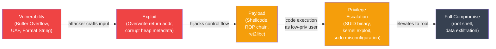

# OS Vulnerabilities and Exploitation

## Kya seekhoge is note mein?

Socho ek second ke liye — tum ek banking app bana rahe ho, aur ek din pata chalta hai ki koi hacker tumhare server pe root shell le chuka hai, sirf ek innocent-looking `strcpy()` call ki wajah se. Scary lagta hai na? Lekin isliye important hai samajhna ki attackers OS-level memory aur process internals ka fayda kaise uthate hain, aur modern OS unse defend kaise karta hai.

Is tutorial mein hum cover karenge:

- Buffer overflow: stack-based attacks, exploitation ka basic idea
- Stack protection: canaries, ASLR, DEP/NX bit
- Format string vulnerabilities
- Use-after-free aur heap exploits
- Race conditions aur TOCTOU attacks
- SUID/SGID misuse se privilege escalation
- Defense mechanisms aur secure coding practices

**Time Required**: 50-60 minutes

> [!info]
> Yeh sab concepts thoda "dark art" jaise lagte hain, lekin inka purpose attack karna nahi hai — purpose hai samajhna ki tumhara C code (ya kisi bhi low-level system ka code) kis tarah se exploit ho sakta hai, taaki tum secure code likh sako. Jaise ek bank ka security guard lock-picking seekhta hai taaki wo behtar locks laga sake.

---

## 1. Memory Layout aur Attack Surface

Vulnerabilities samajhne se pehle yeh samajhna zaroori hai ki ek process apni memory kaise use karta hai. Socho memory ek building ki tarah hai jisme alag-alag floors pe alag-alag cheezein rakhi hain — code, global variables, heap (dynamic memory), aur stack (function calls ka data).

```
Process Memory Layout (x86-64 Linux)
======================================

High address (0xFFFFFFFFFFFFFFFF)
┌──────────────────────────────────┐
│         Kernel space             │ ← user cannot access directly
├──────────────────────────────────┤ 0x7fffffffffff
│         Stack                    │ ← grows downward ↓
│         (local vars, return addr)│
│              │                   │
│              ▼                   │
│                                  │
│              ▲                   │
│              │                   │
│         Heap                     │ ← grows upward ↑
│         (malloc'd memory)        │
├──────────────────────────────────┤
│         BSS segment              │ ← uninitialized globals
├──────────────────────────────────┤
│         Data segment             │ ← initialized globals
├──────────────────────────────────┤
│         Text segment             │ ← executable code (read-only)
├──────────────────────────────────┤
│         Reserved                 │
└──────────────────────────────────┘
Low address (0x0000000000000000)

Stack frame for function call:
┌──────────────────────────────────┐  ← high address
│  Caller's stack frame            │
├──────────────────────────────────┤
│  Return address (RIP/EIP)        │ ← attacker wants to overwrite this
├──────────────────────────────────┤
│  Saved base pointer (RBP)        │
├──────────────────────────────────┤
│  Local variable: char buf[64]    │ ← buffer starts here
│  ...                             │
└──────────────────────────────────┘  ← low address (buf grows upward)
```

Yaha sabse important cheez hai **return address**. Jab tumhara function `vulnerable()` complete ho jata hai, CPU ko pata hona chahiye ki wapas kaha jaana hai (caller function mein). Yeh address stack pe store hota hai. Ab agar koi attacker isi return address ko overwrite kar de apne diye hue address se, toh CPU wahi jump kar dega jaha attacker chahta hai — chahe wo koi malicious code ho. Yehi poore buffer overflow attack ka core idea hai.

---

## 2. Buffer Overflow

**Kya hota hai?** Buffer overflow tab hota hai jab program ek buffer (fixed-size memory block) mein uski capacity se zyada data likh deta hai, aur wo extra data adjacent memory ko overwrite kar deta hai — jaise ek chhoti si dabba mein zyada saaman thoons diya jaaye aur wo bagal ke dabbe mein bhi phel jaaye.

Socho Swiggy ke ek delivery bag ki capacity 5 items ki hai, lekin agar restaurant wala usme 8 items thoons de, toh 3 items bag ke bahar gir jaenge aur bagal wale order ka saaman kharab kar denge. Buffer overflow bilkul yehi karta hai — memory mein.

### Vulnerable C Example

```c
// vuln.c — classic stack buffer overflow
#include <stdio.h>
#include <string.h>

void secret_function() {
    printf("You have gained unauthorized access!\n");
    // In real exploits, this might spawn a shell:
    // system("/bin/sh");
}

void vulnerable(char *input) {
    char buffer[64];           // fixed 64-byte buffer on stack
    strcpy(buffer, input);     // DANGEROUS: no length check!
    printf("You entered: %s\n", buffer);
}

int main(int argc, char *argv[]) {
    if (argc < 2) {
        printf("Usage: %s <input>\n", argv[0]);
        return 1;
    }
    vulnerable(argv[1]);
    return 0;
}

// Normal usage:
//   ./vuln "hello"     → works fine
//   ./vuln "AAAA...A"  → 80+ chars overflows buf into return address

// Stack during vulnerable() with overflow:
//   buffer[0..63]   = 'A' * 64
//   saved RBP       = 'A' * 8     ← overwritten
//   return address  = 0xdeadbeef  ← attacker controls where we return
```

Yaha `strcpy()` ka koi length check nahi hai — jitna bhi input diya jaaye, wo blindly copy kar dega. Agar tum 64 bytes se zyada bhejo, toh baaki data `buffer` ke bagal wali memory (saved RBP, return address) mein overflow ho jaayega. Agar attacker sahi se calculate kar le ki kitne bytes ke baad return address aata hai, wo apna khud ka address wahan likh sakta hai — jaise `secret_function()` ka address, ya kisi injected shellcode ka address. Result: program tumhare control se bahar chala jata hai.

### Safe Alternatives

```c
// Fix 1: use bounded copy functions
void safe_version(char *input) {
    char buffer[64];
    strncpy(buffer, input, sizeof(buffer) - 1);
    buffer[sizeof(buffer) - 1] = '\0';  // ensure null termination
    printf("You entered: %s\n", buffer);
}

// Better fix: use strlcpy (BSD) or snprintf
void safer_version(char *input) {
    char buffer[64];
    snprintf(buffer, sizeof(buffer), "%s", input);
    printf("You entered: %s\n", buffer);
}

// Fix 2: avoid fixed-size buffers — use dynamic allocation
#include <stdlib.h>
void dynamic_version(char *input) {
    size_t len = strlen(input) + 1;
    char *buffer = malloc(len);
    if (!buffer) { perror("malloc"); return; }
    memcpy(buffer, input, len);
    printf("You entered: %s\n", buffer);
    free(buffer);
}

// Dangerous functions to avoid (no bounds checking):
// gets()        → use fgets() instead
// strcpy()      → use strncpy() / strlcpy() / stpncpy()
// strcat()      → use strncat() / strlcat()
// sprintf()     → use snprintf()
// scanf("%s")   → use scanf("%63s", ...) with width specifier
```

> [!tip]
> Simple rule of thumb: agar C function ka naam bina `n` ya bina size-limit ke hai (`strcpy`, `strcat`, `sprintf`, `gets`), samajh lo woh "trust-me-bro" function hai — kitna bhi input aaye, kabhi mana nahi karega. Production code mein inko dekhte hi red flag samjho.

---

## 3. Stack Protection Mechanisms

Modern systems ek hi defense pe depend nahi karte — layers pe layers lagayi jaati hain, jaise ek ATM mein security camera, guard, aur locked door sab saath mein hote hain.

### Stack Canaries

**Kya hota hai?** Ek random value jo local variables aur return address ke beech mein rakhi jaati hai. Agar buffer overflow is canary ko overwrite kar de, OS ko turant pata chal jaata hai ki kuch gadbad hui hai.

Isko samjho building ki security guard ki tarah — agar koi unauthorized entry karta hai, guard (canary check) usse turant pakad leta hai return se pehle hi, aur alarm baja deta hai.

```c
// How stack canaries work (compiler inserts this automatically with -fstack-protector)

void vulnerable(char *input) {
    // Compiler-inserted canary setup:
    unsigned long canary = __stack_chk_guard;  // random value from kernel

    char buffer[64];
    strcpy(buffer, input);

    // Compiler-inserted check before return:
    if (canary != __stack_chk_guard) {
        __stack_chk_fail();  // abort() with "stack smashing detected"
    }
}

// Stack layout with canary:
// buffer[64]       ← overflow fills this
// canary (8 bytes) ← must match __stack_chk_guard
// saved RBP        ← overwritten after canary
// return address   ← target

// Attacker must know exact canary value to bypass this.
// Canary is random per-process and per-boot.
```

```bash
# Compile with stack protection (default in modern GCC)
gcc -fstack-protector-strong -o prog prog.c

# Compile without (to test vulnerabilities in controlled environment)
gcc -fno-stack-protector -o prog prog.c

# Check if binary has stack canaries
checksec --file=prog
# CANARY: Enabled

# Run vulnerable program (with protections bypassed for education)
# It will print: "*** stack smashing detected ***: terminated"
```

Yeh canary har process aur har boot ke liye random hota hai, isliye attacker ko yeh guess karna almost impossible hai — jab tak use koi memory leak na mil jaaye jisse wo canary ki value pehle hi padh sake.

### ASLR: Address Space Layout Randomization

**Kyun zaruri hai?** Agar stack, heap, aur shared libraries har baar same fixed address pe load ho, toh attacker easily predict kar sakta hai ki apna shellcode/gadget kaha rakhna hai. ASLR har execution pe in base addresses ko randomize kar deta hai — jaise IRCTC agar har train ki seat number har trip mein shuffle kar de, toh koi specific seat target karke fraud nahi kar sakta.

```bash
# Check ASLR setting
cat /proc/sys/kernel/randomize_va_space
# 0 = disabled
# 1 = randomize stack, mmap, VDSO
# 2 = randomize stack, mmap, VDSO, heap (default on most distros)

# Enable ASLR (temporary)
sysctl -w kernel.randomize_va_space=2

# Permanent (in /etc/sysctl.conf)
echo "kernel.randomize_va_space=2" >> /etc/sysctl.conf

# Verify ASLR is working: stack address changes each run
cat /proc/self/maps | head -5  # run twice, compare addresses

# Disable ASLR for a single process (debugging)
setarch $(uname -m) -R ./prog

# ASLR entropy (how random are the addresses?)
# x86_64: 28 bits for mmap, 30 bits for stack
# Brute-force probability: 1/2^28 ≈ 1 in 268 million
```

### DEP / NX Bit: Non-Executable Memory

**Kya karta hai?** NX (No-Execute) bit memory ke kuch regions ko "non-executable" mark kar deta hai — matlab stack ya heap mein pada hua data CPU kabhi bhi instructions ki tarah execute nahi karega, chahe attacker wahan shellcode hi kyun na daal de.

Socho ek locker room hai jaha tum apna saaman rakh sakte ho, lekin us locker room mein khada hoke kaam nahi kar sakte — sirf designated office desk (text segment) pe hi kaam ho sakta hai. Isi tarah stack/heap sirf "data store" hai, "code execute" karne ki jagah nahi.

```bash
# Check if CPU supports NX
grep nx /proc/cpuinfo
# flags: ... nx ...   ← present

# Check if kernel enforces NX
dmesg | grep NX
# NX (Execute Disable) protection: active

# Check if binary uses NX (via ELF PT_GNU_STACK header)
checksec --file=prog
# NX: Enabled    ← stack and heap not executable

# Compile without NX (dangerous, educational only)
gcc -z execstack -o prog prog.c

# View memory protections of a running process
cat /proc/<PID>/maps
# 7ffff7a00000-7ffff7bcd000 r-xp  /lib/libc.so.6    ← r-x = read+execute
# 7ffff7bcd000-7ffff7dcd000 ---p  /lib/libc.so.6    ← guard page
# 7fffffffb000-7ffffffff000 rwxp  [stack]            ← rw- normally; rwx if NX off

# NX alone doesn't stop Return-Oriented Programming (ROP):
# attacker chains existing code fragments (gadgets) instead of injecting shellcode
```

> [!warning]
> NX bit shellcode injection ko rok deta hai, lekin attacker ek smart trick use kar sakta hai — **ROP (Return-Oriented Programming)**. Isme attacker apna naya code inject nahi karta, balki already existing code ke chhote-chhote pieces ("gadgets") ko chain karke chala deta hai, jaise ek chef apna khud ka recipe likhne ke bajaye restaurant ki maujooda dishes ke tukdo ko jod ke naya dish bana de. Isliye ek layer kabhi kaafi nahi hoti.

---

## 4. Format String Vulnerabilities

**Kya hota hai?** Yeh bug tab hota hai jab user ka input directly format string argument ki jagah pass kar diya jaata hai — matlab tum function ko keh rahe ho "is string ko literally format specifiers ki tarah treat karo," aur attacker ne is string mein khud `%x`, `%n` jaise specifiers daal diye.

```c
// Vulnerable: user controls format string
void log_input(char *user_input) {
    printf(user_input);           // DANGEROUS
    // vs safe:
    printf("%s", user_input);     // SAFE — user_input is just data
}

// What an attacker can do with a malicious format string:
//
// Input: "%x %x %x %x"
// → leaks stack values as hex (information disclosure)
//
// Input: "%s"
// → tries to dereference whatever is on the stack as a string pointer
//   → likely crashes (segfault) or leaks memory
//
// Input: "%n"  (writes number of characters printed to pointer argument)
// → arbitrary write to an attacker-controlled address
//   → can overwrite return addresses, function pointers, GOT entries
//
// Input: "AAAA%4$n"
// → %4$ selects the 4th argument (positional), writes to 0x41414141

// Other dangerous patterns:
fprintf(stderr, user_input);    // same problem
syslog(LOG_INFO, user_input);   // same problem
sprintf(buf, user_input);       // same problem

// Always specify format strings explicitly:
printf("%s", user_input);
fprintf(logfile, "%s\n", message);
syslog(LOG_INFO, "%s", event);
```

Socho tumne ek chat support form banaya jaha user apna message likhta hai, aur tum backend mein `printf(user_message)` likh dete ho "quick logging" ke liye. Agar koi user message mein `%x %x %x %x` bhej de, toh tumhare stack ke internal values (jo tumhare code ka hi data hain, jaise session tokens, memory addresses) leak ho jaayenge. Aur `%n` toh aur khatarnak hai — yeh actually memory mein **likh** sakta hai, sirf padh nahi sakta. Ek chhoti si carelessness poore server ka control de sakti hai.

> [!warning]
> Golden rule: format string function ko **kabhi bhi** direct user input mat do. Hamesha `"%s"` ko literal format string rakho aur user input ko argument ki tarah pass karo.

---

## 5. Use-After-Free aur Heap Exploits

**Kya hota hai?** Use-after-free (UAF) tab hota hai jab program `free()` karne ke baad bhi usi memory ko access karta rehta hai. Yeh aisa hi hai jaise tumne apna Ola cab drop kiya, lekin tumhara phone abhi bhi driver ke pehle wale seat belt sensor se connected hai — aur agli sawari mein koi aur passenger baith gaya hai jiska data tumhare purane connection se milne lagta hai.

```c
#include <stdlib.h>
#include <string.h>
#include <stdio.h>

typedef struct {
    char name[32];
    void (*print_func)(char *);   // function pointer in struct
} User;

void print_normal(char *s) { printf("User: %s\n", s); }
void backdoor(char *s)     { printf("BACKDOOR TRIGGERED: %s\n", s); }

void use_after_free_demo() {
    User *user = malloc(sizeof(User));
    strncpy(user->name, "alice", 31);
    user->print_func = print_normal;

    free(user);                   // memory released back to allocator

    // Attacker allocates same-sized chunk — may get same memory
    char *attacker_data = malloc(sizeof(User));
    // Write backdoor address into where print_func used to be
    // (offset 32 bytes into the struct)
    memcpy(attacker_data + 32, &backdoor, sizeof(void *));

    // Now the old 'user' pointer points to attacker-controlled data
    user->print_func(user->name); // calls backdoor()!

    free(attacker_data);
}

// Prevention:
// 1. Set pointer to NULL after free (NULL dereference is detectable)
free(user);
user = NULL;    // subsequent use → segfault instead of exploit

// 2. Use smart pointers / memory-safe languages
// 3. Use heap hardening: glibc safe-unlink checks, guard pages
// 4. AddressSanitizer (ASan) during testing:
//    gcc -fsanitize=address -o prog prog.c
```

Yaha jo ho raha hai wo yeh hai: `user` ko `free()` kiya gaya, lekin `user` pointer abhi bhi purani address ko point kar raha hai (isko "dangling pointer" kehte hain). Jab allocator (malloc) ne wahi memory chunk attacker ke agle `malloc()` call ko de diya, attacker ne apni marzi ka data us memory mein likh diya — including ek fake function pointer jo `backdoor()` ki taraf point karta hai. Jab original code `user->print_func()` call karta hai, wo unknowingly attacker ka function chala deta hai. Yeh bahut dangerous hai kyunki attacker seedha control-flow hijack kar leta hai.

### Heap Exploit Primitives

```
Heap Exploitation Overview
===========================

tcache/fastbin attack (glibc < 2.34):
  - Corrupt free list metadata (fd/bk pointers in free chunks)
  - Next malloc of same size returns attacker-chosen address
  - Write to arbitrary memory (GOT, heap metadata, stack)

House of Force (older glibc):
  - Overflow into top chunk size field
  - Set size to huge value → next malloc returns any address

Double-free:
  - free() same pointer twice
  - Corrupts allocator's free list
  - Modern glibc detects this (tcache poisoning check)

Mitigation: glibc hardening (randomized tcache keys, integrity checks)
Mitigation: heap canaries (electric fence)
Mitigation: hardened_malloc (GrapheneOS allocator)
```

> [!tip]
> Interview mein agar koi puche "use-after-free se kaise bacho," seedha bol do: pointer ko `free()` ke turant baad `NULL` set karo (isko "nulling out" kehte hain), smart pointers use karo (C++/Rust), aur testing mein AddressSanitizer chalao. Production mein memory-safe language (Rust, Go) is poori category ki bugs ko design se hi khatam kar deti hai.

---

## 6. Race Conditions aur TOCTOU

**Kya hota hai?** Time-of-Check to Time-of-Use (TOCTOU) ek race condition hai jaha check karne aur use karne ke beech ke "window" mein state badal jaati hai. Isko samjho aise — tumne Zomato pe dekha ki restaurant "Open" hai (check), lekin jab tak order place kiya (use), restaurant band ho chuka. TOCTOU mein attacker isi gap ka fayda uthata hai, sirf attacker khud us gap ko jaan-boojhke create karta hai.

```c
#include <unistd.h>
#include <stdio.h>
#include <fcntl.h>

// TOCTOU vulnerability — classic /tmp symlink attack
void vulnerable_open(char *filename) {
    // Step 1: CHECK — is this file safe to open?
    if (access(filename, R_OK) == 0) {
        // RACE WINDOW: attacker replaces file with symlink to /etc/shadow

        // Step 2: USE — open the file
        FILE *f = fopen(filename, "r");  // now opens /etc/shadow!
        if (f) {
            // read sensitive data...
            fclose(f);
        }
    }
}

// The attack:
// 1. Run vulnerable_open("/tmp/myfile")
// 2. During race window, attacker does:
//      unlink("/tmp/myfile")
//      symlink("/etc/shadow", "/tmp/myfile")
// 3. access() checked /tmp/myfile (OK)
// 4. fopen() opens /etc/shadow (shadow password file)

// Fix: open the file first, then check with fstat (not stat)
void safe_open(char *filename) {
    int fd = open(filename, O_RDONLY | O_NOFOLLOW);  // O_NOFOLLOW prevents symlink
    if (fd < 0) { perror("open"); return; }

    struct stat st;
    fstat(fd, &st);  // stat the already-opened fd — no race

    if (S_ISREG(st.st_mode)) {   // ensure it's a regular file
        FILE *f = fdopen(fd, "r");
        // ... read safely
        fclose(f);
    } else {
        close(fd);
    }
}

// Other TOCTOU examples:
// - mkdir() after checking directory doesn't exist (→ symlink attack)
// - Creating temp files in /tmp (use mkstemp() instead of tmpnam())

// Safe temp file creation:
char template[] = "/tmp/myapp_XXXXXX";
int fd = mkstemp(template);  // atomically creates unique file, returns fd
// No race: file exists exclusively before we use it
```

Yaha `access()` aur `fopen()` ke beech ek tiny time-gap hai — milliseconds ka, lekin attacker ke liye kaafi. Attacker isi gap mein `/tmp/myfile` ko delete karke ek symlink bana deta hai jo `/etc/shadow` (password hashes wali file) ki taraf point karti hai. Program ko lagta hai wo apni hi file khol raha hai, lekin actually root-owned sensitive file khul jaati hai.

**Fix ka core idea:** check aur use ko ek hi atomic operation mein combine karo. `open()` pehle karo (with `O_NOFOLLOW` taaki symlink follow hi na ho), phir already-open file descriptor pe `fstat()` karo — is beech koi race window hi nahi bachta kyunki fd already ek specific inode se locked hai.

> [!tip]
> Jab bhi tum "check, phir act karo" pattern likhte ho (file exist check, balance check, stock availability check), hamesha socho — "is beech koi aur process/thread yeh state badal sakta hai kya?" Agar haan, toh atomic operation dhoondo (jaise database mein `SELECT ... FOR UPDATE`, ya filesystem mein `O_EXCL`).

---

## 7. Privilege Escalation

### SUID/SGID Misuse

**Kya hota hai?** Ek SUID binary file ke owner ke permissions ke saath run hota hai — aksar root ke saath. Matlab agar `root` ne ek program pe SUID bit set kar diya, toh jo bhi normal user usse chalayega, program root ke privileges ke saath chalega. Yeh design intentionally kiya gaya hai (jaise `passwd` command ko root privileges chahiye password file update karne ke liye), lekin misconfiguration hone pe yeh ek golden ticket ban jaata hai attacker ke liye root banne ka.

```bash
# Find all SUID binaries on the system
find / -perm -4000 -type f 2>/dev/null
# Common legitimate ones: sudo, passwd, su, ping, mount

# Find SGID binaries
find / -perm -2000 -type f 2>/dev/null

# Dangerous SUID scenarios:

# 1. SUID shell — instant root (should never exist)
ls -la /bin/bash
# -rwsr-xr-x root root /bin/bash   ← SUID set = catastrophic
bash -p    # -p: don't drop SUID privilege

# 2. SUID copy/move utilities
# If 'cp' is SUID root:
cp /etc/sudoers /tmp/sudoers
echo "alice ALL=(ALL) NOPASSWD: ALL" >> /tmp/sudoers
cp /tmp/sudoers /etc/sudoers   # runs as root

# 3. SUID editors
# vim with SUID: can read/write any file as root
# :!/bin/sh   → drops into root shell from within vim

# 4. PATH injection in SUID scripts (old systems)
# SUID script calls "system("ls")" without full path
# Attacker puts malicious 'ls' earlier in PATH
export PATH=/tmp:$PATH
echo '#!/bin/bash' > /tmp/ls
echo '/bin/bash -p' >> /tmp/ls
chmod +x /tmp/ls
./suid_script   # runs attacker's 'ls' as root

# Defenses:
# - Audit SUID binaries regularly
# - Use capabilities instead of SUID (setcap)
# - Kernel: nosuid mount option for untrusted filesystems
mount -o nosuid /dev/sdb1 /mnt/usb
```

Socho ek office ka scenario — normally ek junior employee ko finance room mein entry nahi milti, lekin agar usse ek "master key" (SUID binary) mil jaaye jo galti se poore building ke access ke liye configured hai, wo seedha CEO cabin mein bhi ghus sakta hai. PATH injection wala example bhi isi tarah ka hai — agar SUID script bina full path ke `ls` ya `cp` call karta hai, aur attacker apna khud ka fake `ls`/`cp` PATH mein pehle rakh de, root privileges wala script attacker ka hi banaya hua malicious binary run kar dega.

> [!warning]
> CTF challenges mein `find / -perm -4000` command bahut common hai privilege escalation dhundne ke liye — real-world mein bhi security audits isi command se shuru hote hain. Agar tum kabhi apna production server harden kar rahe ho, iss command ko chala ke dekhna zaroor ki koi unnecessary SUID binary toh nahi pada hua.

---

## 8. Attack Chain

Ek real attack usually ek single step nahi hota — yeh ek chain hoti hai, jaise ek chor pehle chhoti khidki todta hai, phir andar ghus ke bada lock todta hai, aur finally vault tak pahunchta hai.



Pattern samajh lo: attacker pehle ek vulnerability dhundta hai (jaise buffer overflow), usko exploit karke control-flow hijack karta hai, phir apna payload (code) chalata hai — lekin abhi bhi low-privilege user ke roop mein. Uske baad wo koi privilege escalation vulnerability (SUID misuse, kernel bug) dhundta hai root banne ke liye. Isliye "defense in depth" itna crucial hai — chain ke kisi bhi ek step ko rok do, poora attack fail ho jaata hai.

---

## 9. Defenses Overview

**Kyun zaruri hai?** Koi single defense perfect nahi hota — har ek ko koi na koi bypass karne ka tareeka mil jaata hai. Isliye modern systems multiple layers use karte hain, taaki attacker ko har layer ke liye alag skill aur effort lagana pade.

```
Defense Mechanisms Summary
===========================

Technique          Mitigates                   Cost    Bypass Method
──────────────────────────────────────────────────────────────────────────
Stack canary       Stack buffer overflow        Low     Info leak + overwrite
ASLR               Code reuse, shellcode        Low     Info leak, brute force
NX / DEP           Shellcode injection          Low     ROP/JOP chains
PIE                Code reuse (GOT overwrite)   Low     Info leak
RELRO              GOT/PLT overwrite            Low     Heap/stack targets
Safe functions     Buffer overflow              Low     Must audit all calls
Fortify source     Buffer overflow              Low     Runtime check
CFI                Control flow hijack          Medium  Bypass constraints
Shadow stack       Return address overwrite     Medium  Hardware-dependent
ASan/UBSan         Memory bugs (dev/test)       High    Not for production
Seccomp            Syscall restriction          Medium  Allowed syscalls
SELinux/AppArmor   Post-exploitation            Medium  Policy escape

Defense-in-depth: use multiple layers.
A single bypass doesn't give full exploitation if other layers hold.
```

| Compiler Flag | Protection | GCC Default |
|--------------|-----------|-------------|
| `-fstack-protector-strong` | Stack canaries | Yes (most distros) |
| `-D_FORTIFY_SOURCE=2` | Buffer overflow checks | Yes (most distros) |
| `-pie -fPIE` | Position Independent Executable | Yes (most distros) |
| `-Wl,-z,relro,-z,now` | Full RELRO | Partial by default |
| `-fsanitize=address` | AddressSanitizer (testing) | No |
| `-fsanitize=undefined` | Undefined Behavior Sanitizer (testing) | No |

```bash
# Check what protections a binary has
checksec --file=/usr/bin/sudo
# RELRO: Full   STACK CANARY: Canary found   NX: NX enabled
# PIE: PIE enabled   RPATH: No RPATH   RUNPATH: No RUNPATH

# Compile a hardened binary
gcc -O2 \
    -fstack-protector-strong \
    -D_FORTIFY_SOURCE=2 \
    -pie -fPIE \
    -Wl,-z,relro,-z,now \
    -o secure_prog prog.c
```

Yaad rakho — jaise CRED ya kisi bhi banking app mein OTP + password + device-binding sab saath mile hain security ke liye, exactly waise hi yeh sab compiler flags aur OS mitigations ek saath layer bana ke rakhte hain. Ek attacker ko canary bhi bypass karni padegi, ASLR bhi predict karna padega, NX bhi todna padega — tabhi jaake full exploit chalega. Har layer attack ki cost badha deti hai.

---

## 10. Kernel Vulnerabilities

Kernel level attacks sabse dangerous hote hain kyunki kernel ka access matlab poore system ka access — jaise building ke security control room mein ghus jaana, jaha se har floor ka access diya ja sakta hai.

```bash
# Kernel exploits target OS code itself — often race conditions
# or type confusion in kernel modules

# Common kernel vulnerability classes:
# - NULL pointer dereference (can be exploited if mmap_min_addr is 0)
# - Race conditions in syscall handlers (dirty COW: CVE-2016-5195)
# - Integer overflows in memory allocation
# - Use-after-free in kernel objects

# Mitigations:
# SMEP: Supervisor Mode Execution Prevention
#   → kernel cannot execute user-space code
cat /proc/cpuinfo | grep smep

# SMAP: Supervisor Mode Access Prevention
#   → kernel cannot access user-space memory without explicit allow
cat /proc/cpuinfo | grep smap

# KASLR: Kernel ASLR (randomizes kernel base address)
cat /proc/cmdline | grep nokaslr  # nokaslr means disabled

# kASAN: Kernel AddressSanitizer (debug builds)
# KGDB: Kernel debugger (disabled in production)

# Check kernel lockdown mode
cat /sys/kernel/security/lockdown
# none / integrity / confidentiality

# Keep kernel patched
apt list --upgradable | grep linux-image
uname -r   # current kernel version
```

**Dirty COW (CVE-2016-5195)** ek famous example hai — yeh Linux kernel ke Copy-on-Write mechanism mein ek race condition thi jisse ek normal user read-only files ko bhi write access de sakta tha, including root-owned system files. Yeh bug saalon tak production kernels mein chhupi rahi, jab tak researchers ne dhundh nahi liya. Isi wajah se OS updates aur kernel patching ko ignore nahi karna chahiye — production environment mein regularly `apt list --upgradable | grep linux-image` check karna ek basic hygiene practice honi chahiye, jaise ghar ka lock time-to-time check karna.

---

## Summary Table

| Vulnerability Class | Root Cause | Primary Defense |
|--------------------|-----------|----------------|
| Buffer overflow | No bounds checking | Safe functions, stack canary, ASLR, NX |
| Format string | User controls format arg | Always use `%s` literal |
| Use-after-free | Access after free | NULL pointers, memory-safe languages |
| TOCTOU | Check/use race window | Atomic operations, `O_NOFOLLOW` |
| SUID misuse | Excessive privilege | Replace with capabilities |
| Integer overflow | Arithmetic wraparound | Safe integer libraries, compiler checks |

> [!warning]
> Security kabhi bhi ek single fix nahi hoti. Stack canaries, ASLR, NX, RELRO, seccomp, aur SELinux — yeh sab layers hain jinhe attacker ko ek-ek karke todna padta hai. Jaise ek locker sirf lock se secure nahi hota, uske saath CCTV, guard, aur alarm system bhi hote hain — waise hi OS security "defense-in-depth" ke principle pe chalti hai, jisse har successful exploitation ki cost dramatically badh jaati hai.

## Key Takeaways

- Buffer overflow tab hota hai jab program bounds check kiye bina buffer mein data likh deta hai — fix hai bounded functions (`strncpy`, `snprintf`) use karna, ya dynamic allocation.
- Stack canary, ASLR, aur NX/DEP teeno alag layers hain — canary overwrite detect karta hai, ASLR addresses random karta hai, NX code execution ko data segments mein block karta hai. Koi bhi akela kaafi nahi hai (ROP jaise techniques NX ko bypass kar sakti hain).
- Format string bugs tab hote hain jab user input directly format specifier ki jagah pass ho jaata hai — hamesha `printf("%s", input)` likho, kabhi `printf(input)` nahi.
- Use-after-free tab hota hai jab freed memory dobara access ki jaati hai — `free()` ke baad pointer ko turant `NULL` set karo, aur testing mein AddressSanitizer use karo.
- TOCTOU race condition check aur use ke beech ke time-gap ka fayda uthati hai — fix hai atomic operations (`open()` + `fstat()` on fd, `mkstemp()`, `O_NOFOLLOW`).
- SUID/SGID misconfiguration ek normal user ko root-level access de sakta hai — regularly SUID binaries audit karo aur jaha ho sake capabilities use karo, poora SUID nahi.
- Real attacks usually ek chain hote hain: vulnerability → exploit → payload execution → privilege escalation → full compromise. Chain ke kisi bhi ek link ko todna poore attack ko fail kar deta hai.
- Defense-in-depth hi asli security hai — multiple layers (canary + ASLR + NX + RELRO + SELinux) saath milke attacker ki cost itni badha dete hain ki exploitation practically infeasible ho jaata hai.
