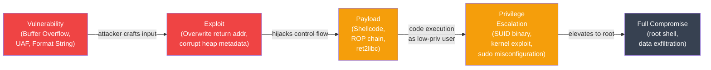

# OS Vulnerabilities and Exploitation

## What You'll Learn

In this tutorial, you'll understand how OS-level vulnerabilities work and how modern defenses mitigate them:

- Buffer overflow: stack-based attacks, exploitation basics
- Stack protection: canaries, ASLR, DEP/NX bit
- Format string vulnerabilities
- Use-after-free and heap exploits
- Race conditions and TOCTOU attacks
- Privilege escalation via SUID/SGID misuse
- Defense mechanisms and secure coding practices

**Time Required**: 50-60 minutes

---

## 1. Memory Layout and Attack Surface

Understanding vulnerabilities requires understanding how processes use memory:

```
Process Memory Layout (x86-64 Linux)
======================================

High address (0xFFFFFFFFFFFFFFFF)
┌──────────────────────────────────┐
│         Kernel space             │ ← user cannot access directly
├──────────────────────────────────┤ 0x7fffffffffff
│         Stack                    │ ← grows downward ↓
│         (local vars, return addr)│
│              │                   │
│              ▼                   │
│                                  │
│              ▲                   │
│              │                   │
│         Heap                     │ ← grows upward ↑
│         (malloc'd memory)        │
├──────────────────────────────────┤
│         BSS segment              │ ← uninitialized globals
├──────────────────────────────────┤
│         Data segment             │ ← initialized globals
├──────────────────────────────────┤
│         Text segment             │ ← executable code (read-only)
├──────────────────────────────────┤
│         Reserved                 │
└──────────────────────────────────┘
Low address (0x0000000000000000)

Stack frame for function call:
┌──────────────────────────────────┐  ← high address
│  Caller's stack frame            │
├──────────────────────────────────┤
│  Return address (RIP/EIP)        │ ← attacker wants to overwrite this
├──────────────────────────────────┤
│  Saved base pointer (RBP)        │
├──────────────────────────────────┤
│  Local variable: char buf[64]    │ ← buffer starts here
│  ...                             │
└──────────────────────────────────┘  ← low address (buf grows upward)
```

---

## 2. Buffer Overflow

A buffer overflow occurs when a program writes more data to a buffer than it can hold, overwriting adjacent memory.

### Vulnerable C Example

```c
// vuln.c — classic stack buffer overflow
#include <stdio.h>
#include <string.h>

void secret_function() {
    printf("You have gained unauthorized access!\n");
    // In real exploits, this might spawn a shell:
    // system("/bin/sh");
}

void vulnerable(char *input) {
    char buffer[64];           // fixed 64-byte buffer on stack
    strcpy(buffer, input);     // DANGEROUS: no length check!
    printf("You entered: %s\n", buffer);
}

int main(int argc, char *argv[]) {
    if (argc < 2) {
        printf("Usage: %s <input>\n", argv[0]);
        return 1;
    }
    vulnerable(argv[1]);
    return 0;
}

// Normal usage:
//   ./vuln "hello"     → works fine
//   ./vuln "AAAA...A"  → 80+ chars overflows buf into return address

// Stack during vulnerable() with overflow:
//   buffer[0..63]   = 'A' * 64
//   saved RBP       = 'A' * 8     ← overwritten
//   return address  = 0xdeadbeef  ← attacker controls where we return
```

### Safe Alternatives

```c
// Fix 1: use bounded copy functions
void safe_version(char *input) {
    char buffer[64];
    strncpy(buffer, input, sizeof(buffer) - 1);
    buffer[sizeof(buffer) - 1] = '\0';  // ensure null termination
    printf("You entered: %s\n", buffer);
}

// Better fix: use strlcpy (BSD) or snprintf
void safer_version(char *input) {
    char buffer[64];
    snprintf(buffer, sizeof(buffer), "%s", input);
    printf("You entered: %s\n", buffer);
}

// Fix 2: avoid fixed-size buffers — use dynamic allocation
#include <stdlib.h>
void dynamic_version(char *input) {
    size_t len = strlen(input) + 1;
    char *buffer = malloc(len);
    if (!buffer) { perror("malloc"); return; }
    memcpy(buffer, input, len);
    printf("You entered: %s\n", buffer);
    free(buffer);
}

// Dangerous functions to avoid (no bounds checking):
// gets()        → use fgets() instead
// strcpy()      → use strncpy() / strlcpy() / stpncpy()
// strcat()      → use strncat() / strlcat()
// sprintf()     → use snprintf()
// scanf("%s")   → use scanf("%63s", ...) with width specifier
```

---

## 3. Stack Protection Mechanisms

Modern systems layer multiple defenses against buffer overflows:

### Stack Canaries

A random value placed between local variables and the return address. If a buffer overflow overwrites the canary, the OS detects it:

```c
// How stack canaries work (compiler inserts this automatically with -fstack-protector)

void vulnerable(char *input) {
    // Compiler-inserted canary setup:
    unsigned long canary = __stack_chk_guard;  // random value from kernel

    char buffer[64];
    strcpy(buffer, input);

    // Compiler-inserted check before return:
    if (canary != __stack_chk_guard) {
        __stack_chk_fail();  // abort() with "stack smashing detected"
    }
}

// Stack layout with canary:
// buffer[64]       ← overflow fills this
// canary (8 bytes) ← must match __stack_chk_guard
// saved RBP        ← overwritten after canary
// return address   ← target

// Attacker must know exact canary value to bypass this.
// Canary is random per-process and per-boot.
```

```bash
# Compile with stack protection (default in modern GCC)
gcc -fstack-protector-strong -o prog prog.c

# Compile without (to test vulnerabilities in controlled environment)
gcc -fno-stack-protector -o prog prog.c

# Check if binary has stack canaries
checksec --file=prog
# CANARY: Enabled

# Run vulnerable program (with protections bypassed for education)
# It will print: "*** stack smashing detected ***: terminated"
```

### ASLR: Address Space Layout Randomization

ASLR randomizes the base addresses of the stack, heap, and shared libraries on each execution, making it hard for attackers to predict where to jump:

```bash
# Check ASLR setting
cat /proc/sys/kernel/randomize_va_space
# 0 = disabled
# 1 = randomize stack, mmap, VDSO
# 2 = randomize stack, mmap, VDSO, heap (default on most distros)

# Enable ASLR (temporary)
sysctl -w kernel.randomize_va_space=2

# Permanent (in /etc/sysctl.conf)
echo "kernel.randomize_va_space=2" >> /etc/sysctl.conf

# Verify ASLR is working: stack address changes each run
cat /proc/self/maps | head -5  # run twice, compare addresses

# Disable ASLR for a single process (debugging)
setarch $(uname -m) -R ./prog

# ASLR entropy (how random are the addresses?)
# x86_64: 28 bits for mmap, 30 bits for stack
# Brute-force probability: 1/2^28 ≈ 1 in 268 million
```

### DEP / NX Bit: Non-Executable Memory

The NX (No-Execute) bit marks memory regions as non-executable, preventing shellcode in the stack or heap from running:

```bash
# Check if CPU supports NX
grep nx /proc/cpuinfo
# flags: ... nx ...   ← present

# Check if kernel enforces NX
dmesg | grep NX
# NX (Execute Disable) protection: active

# Check if binary uses NX (via ELF PT_GNU_STACK header)
checksec --file=prog
# NX: Enabled    ← stack and heap not executable

# Compile without NX (dangerous, educational only)
gcc -z execstack -o prog prog.c

# View memory protections of a running process
cat /proc/<PID>/maps
# 7ffff7a00000-7ffff7bcd000 r-xp  /lib/libc.so.6    ← r-x = read+execute
# 7ffff7bcd000-7ffff7dcd000 ---p  /lib/libc.so.6    ← guard page
# 7fffffffb000-7ffffffff000 rwxp  [stack]            ← rw- normally; rwx if NX off

# NX alone doesn't stop Return-Oriented Programming (ROP):
# attacker chains existing code fragments (gadgets) instead of injecting shellcode
```

---

## 4. Format String Vulnerabilities

Format string bugs occur when user input is passed directly as a format string argument:

```c
// Vulnerable: user controls format string
void log_input(char *user_input) {
    printf(user_input);           // DANGEROUS
    // vs safe:
    printf("%s", user_input);     // SAFE — user_input is just data
}

// What an attacker can do with a malicious format string:
//
// Input: "%x %x %x %x"
// → leaks stack values as hex (information disclosure)
//
// Input: "%s"
// → tries to dereference whatever is on the stack as a string pointer
//   → likely crashes (segfault) or leaks memory
//
// Input: "%n"  (writes number of characters printed to pointer argument)
// → arbitrary write to an attacker-controlled address
//   → can overwrite return addresses, function pointers, GOT entries
//
// Input: "AAAA%4$n"
// → %4$ selects the 4th argument (positional), writes to 0x41414141

// Other dangerous patterns:
fprintf(stderr, user_input);    // same problem
syslog(LOG_INFO, user_input);   // same problem
sprintf(buf, user_input);       // same problem

// Always specify format strings explicitly:
printf("%s", user_input);
fprintf(logfile, "%s\n", message);
syslog(LOG_INFO, "%s", event);
```

---

## 5. Use-After-Free and Heap Exploits

Use-after-free (UAF) occurs when a program accesses memory after it has been freed:

```c
#include <stdlib.h>
#include <string.h>
#include <stdio.h>

typedef struct {
    char name[32];
    void (*print_func)(char *);   // function pointer in struct
} User;

void print_normal(char *s) { printf("User: %s\n", s); }
void backdoor(char *s)     { printf("BACKDOOR TRIGGERED: %s\n", s); }

void use_after_free_demo() {
    User *user = malloc(sizeof(User));
    strncpy(user->name, "alice", 31);
    user->print_func = print_normal;

    free(user);                   // memory released back to allocator

    // Attacker allocates same-sized chunk — may get same memory
    char *attacker_data = malloc(sizeof(User));
    // Write backdoor address into where print_func used to be
    // (offset 32 bytes into the struct)
    memcpy(attacker_data + 32, &backdoor, sizeof(void *));

    // Now the old 'user' pointer points to attacker-controlled data
    user->print_func(user->name); // calls backdoor()!

    free(attacker_data);
}

// Prevention:
// 1. Set pointer to NULL after free (NULL dereference is detectable)
free(user);
user = NULL;    // subsequent use → segfault instead of exploit

// 2. Use smart pointers / memory-safe languages
// 3. Use heap hardening: glibc safe-unlink checks, guard pages
// 4. AddressSanitizer (ASan) during testing:
//    gcc -fsanitize=address -o prog prog.c
```

### Heap Exploit Primitives

```
Heap Exploitation Overview
===========================

tcache/fastbin attack (glibc < 2.34):
  - Corrupt free list metadata (fd/bk pointers in free chunks)
  - Next malloc of same size returns attacker-chosen address
  - Write to arbitrary memory (GOT, heap metadata, stack)

House of Force (older glibc):
  - Overflow into top chunk size field
  - Set size to huge value → next malloc returns any address

Double-free:
  - free() same pointer twice
  - Corrupts allocator's free list
  - Modern glibc detects this (tcache poisoning check)

Mitigation: glibc hardening (randomized tcache keys, integrity checks)
Mitigation: heap canaries (electric fence)
Mitigation: hardened_malloc (GrapheneOS allocator)
```

---

## 6. Race Conditions and TOCTOU

Time-of-Check to Time-of-Use (TOCTOU) is a race condition where the state changes between checking a condition and acting on it:

```c
#include <unistd.h>
#include <stdio.h>
#include <fcntl.h>

// TOCTOU vulnerability — classic /tmp symlink attack
void vulnerable_open(char *filename) {
    // Step 1: CHECK — is this file safe to open?
    if (access(filename, R_OK) == 0) {
        // RACE WINDOW: attacker replaces file with symlink to /etc/shadow

        // Step 2: USE — open the file
        FILE *f = fopen(filename, "r");  // now opens /etc/shadow!
        if (f) {
            // read sensitive data...
            fclose(f);
        }
    }
}

// The attack:
// 1. Run vulnerable_open("/tmp/myfile")
// 2. During race window, attacker does:
//      unlink("/tmp/myfile")
//      symlink("/etc/shadow", "/tmp/myfile")
// 3. access() checked /tmp/myfile (OK)
// 4. fopen() opens /etc/shadow (shadow password file)

// Fix: open the file first, then check with fstat (not stat)
void safe_open(char *filename) {
    int fd = open(filename, O_RDONLY | O_NOFOLLOW);  // O_NOFOLLOW prevents symlink
    if (fd < 0) { perror("open"); return; }

    struct stat st;
    fstat(fd, &st);  // stat the already-opened fd — no race

    if (S_ISREG(st.st_mode)) {   // ensure it's a regular file
        FILE *f = fdopen(fd, "r");
        // ... read safely
        fclose(f);
    } else {
        close(fd);
    }
}

// Other TOCTOU examples:
// - mkdir() after checking directory doesn't exist (→ symlink attack)
// - Creating temp files in /tmp (use mkstemp() instead of tmpnam())

// Safe temp file creation:
char template[] = "/tmp/myapp_XXXXXX";
int fd = mkstemp(template);  // atomically creates unique file, returns fd
// No race: file exists exclusively before we use it
```

---

## 7. Privilege Escalation

### SUID/SGID Misuse

A SUID binary runs as the file's owner (often root). Misconfigurations allow privilege escalation:

```bash
# Find all SUID binaries on the system
find / -perm -4000 -type f 2>/dev/null
# Common legitimate ones: sudo, passwd, su, ping, mount

# Find SGID binaries
find / -perm -2000 -type f 2>/dev/null

# Dangerous SUID scenarios:

# 1. SUID shell — instant root (should never exist)
ls -la /bin/bash
# -rwsr-xr-x root root /bin/bash   ← SUID set = catastrophic
bash -p    # -p: don't drop SUID privilege

# 2. SUID copy/move utilities
# If 'cp' is SUID root:
cp /etc/sudoers /tmp/sudoers
echo "alice ALL=(ALL) NOPASSWD: ALL" >> /tmp/sudoers
cp /tmp/sudoers /etc/sudoers   # runs as root

# 3. SUID editors
# vim with SUID: can read/write any file as root
# :!/bin/sh   → drops into root shell from within vim

# 4. PATH injection in SUID scripts (old systems)
# SUID script calls "system("ls")" without full path
# Attacker puts malicious 'ls' earlier in PATH
export PATH=/tmp:$PATH
echo '#!/bin/bash' > /tmp/ls
echo '/bin/bash -p' >> /tmp/ls
chmod +x /tmp/ls
./suid_script   # runs attacker's 'ls' as root

# Defenses:
# - Audit SUID binaries regularly
# - Use capabilities instead of SUID (setcap)
# - Kernel: nosuid mount option for untrusted filesystems
mount -o nosuid /dev/sdb1 /mnt/usb
```

---

## 8. Attack Chain



---

## 9. Defenses Overview

```
Defense Mechanisms Summary
===========================

Technique          Mitigates                   Cost    Bypass Method
──────────────────────────────────────────────────────────────────────────
Stack canary       Stack buffer overflow        Low     Info leak + overwrite
ASLR               Code reuse, shellcode        Low     Info leak, brute force
NX / DEP           Shellcode injection          Low     ROP/JOP chains
PIE                Code reuse (GOT overwrite)   Low     Info leak
RELRO              GOT/PLT overwrite            Low     Heap/stack targets
Safe functions     Buffer overflow              Low     Must audit all calls
Fortify source     Buffer overflow              Low     Runtime check
CFI                Control flow hijack          Medium  Bypass constraints
Shadow stack       Return address overwrite     Medium  Hardware-dependent
ASan/UBSan         Memory bugs (dev/test)       High    Not for production
Seccomp            Syscall restriction          Medium  Allowed syscalls
SELinux/AppArmor   Post-exploitation            Medium  Policy escape

Defense-in-depth: use multiple layers.
A single bypass doesn't give full exploitation if other layers hold.
```

| Compiler Flag | Protection | GCC Default |
|--------------|-----------|-------------|
| `-fstack-protector-strong` | Stack canaries | Yes (most distros) |
| `-D_FORTIFY_SOURCE=2` | Buffer overflow checks | Yes (most distros) |
| `-pie -fPIE` | Position Independent Executable | Yes (most distros) |
| `-Wl,-z,relro,-z,now` | Full RELRO | Partial by default |
| `-fsanitize=address` | AddressSanitizer (testing) | No |
| `-fsanitize=undefined` | Undefined Behavior Sanitizer (testing) | No |

```bash
# Check what protections a binary has
checksec --file=/usr/bin/sudo
# RELRO: Full   STACK CANARY: Canary found   NX: NX enabled
# PIE: PIE enabled   RPATH: No RPATH   RUNPATH: No RUNPATH

# Compile a hardened binary
gcc -O2 \
    -fstack-protector-strong \
    -D_FORTIFY_SOURCE=2 \
    -pie -fPIE \
    -Wl,-z,relro,-z,now \
    -o secure_prog prog.c
```

---

## 10. Kernel Vulnerabilities

```bash
# Kernel exploits target OS code itself — often race conditions
# or type confusion in kernel modules

# Common kernel vulnerability classes:
# - NULL pointer dereference (can be exploited if mmap_min_addr is 0)
# - Race conditions in syscall handlers (dirty COW: CVE-2016-5195)
# - Integer overflows in memory allocation
# - Use-after-free in kernel objects

# Mitigations:
# SMEP: Supervisor Mode Execution Prevention
#   → kernel cannot execute user-space code
cat /proc/cpuinfo | grep smep

# SMAP: Supervisor Mode Access Prevention
#   → kernel cannot access user-space memory without explicit allow
cat /proc/cpuinfo | grep smap

# KASLR: Kernel ASLR (randomizes kernel base address)
cat /proc/cmdline | grep nokaslr  # nokaslr means disabled

# kASAN: Kernel AddressSanitizer (debug builds)
# KGDB: Kernel debugger (disabled in production)

# Check kernel lockdown mode
cat /sys/kernel/security/lockdown
# none / integrity / confidentiality

# Keep kernel patched
apt list --upgradable | grep linux-image
uname -r   # current kernel version
```

---

## Summary

| Vulnerability Class | Root Cause | Primary Defense |
|--------------------|-----------|----------------|
| Buffer overflow | No bounds checking | Safe functions, stack canary, ASLR, NX |
| Format string | User controls format arg | Always use `%s` literal |
| Use-after-free | Access after free | NULL pointers, memory-safe languages |
| TOCTOU | Check/use race window | Atomic operations, `O_NOFOLLOW` |
| SUID misuse | Excessive privilege | Replace with capabilities |
| Integer overflow | Arithmetic wraparound | Safe integer libraries, compiler checks |

Security is never a single fix — stack canaries, ASLR, NX, RELRO, seccomp, and SELinux form layers that must all be overcome by an attacker, dramatically raising the cost of successful exploitation.
