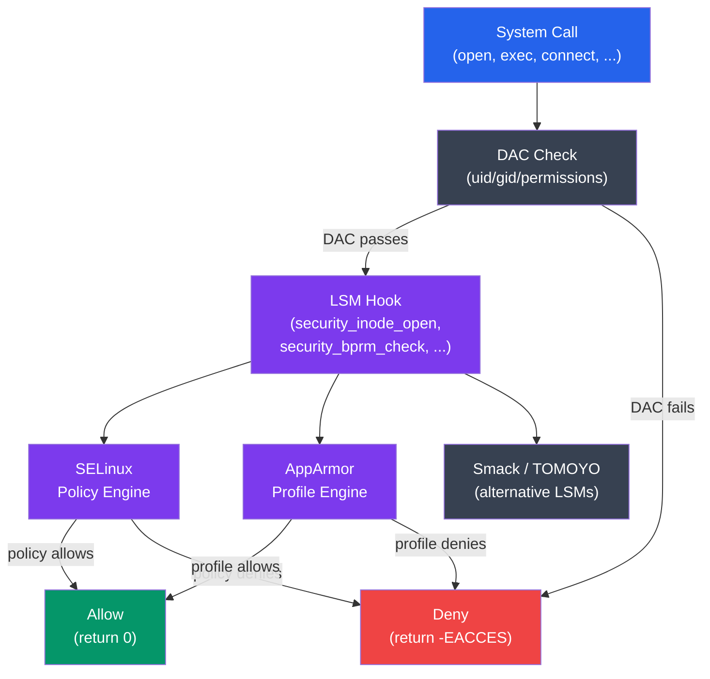

# OS Security Mechanisms

## Kya Seekhoge Is Note Mein

Socho tumhara Node.js/Express app production mein deploy hua hai — koi attacker kisi tarah RCE (remote code execution) nikaal leta hai tumhare app mein. Ab sawaal ye hai: uske baad kya hota hai? Kya wo attacker pura server control kar sakta hai, ya OS ke andar kuch aise "guards" baithe hain jo usko rok denge?

Yehi guards hote hain — **SELinux, AppArmor, seccomp, namespaces, aur cgroups**. Ye sab kernel-level security frameworks hain jo mandatory policies enforce karte hain — matlab, koi bhi process, chahe root ho ya na ho, inn rules ko bypass nahi kar sakta.

Is tutorial mein cover karenge:

- SELinux: modes, contexts, type enforcement, aur important commands
- AppArmor: profiles, modes, aur administration
- Seccomp: syscall filtering aur Docker ka seccomp profile
- Linux namespaces — process isolation ka foundation
- cgroups v2 — resource limits aur containment

**Time Required**: 50-60 minutes

---

## 1. Linux Security Module (LSM) Framework

**Kya hota hai?** LSM ek kernel infrastructure hai jisme SELinux, AppArmor, aur doosre security systems "plug-in" ki tarah baith jaate hain. Isko society ke building security system jaisa socho — LSM ek common "security gate" hai, aur SELinux ya AppArmor us gate pe tainaat guard hai jo apne rules ke hisaab se entry allow/deny karta hai.



**Kaise kaam karta hai?** Jab koi system call aata hai (jaise `open`, `exec`, `connect`), pehle traditional **DAC check** hota hai — matlab normal Linux permissions (uid/gid, rwx bits). Ye pass hone ke baad hi request LSM hook tak pahunchti hai, jahan SELinux ya AppArmor apna extra layer of policy check lagate hain. Socho ye do-step security jaisa — pehle building ka main gate (DAC), fir apne floor ka smart-lock (LSM) — dono pass karne ke baad hi andar ja sakte ho.

> [!info]
> Ek time pe sirf **ek hi primary LSM active** ho sakta hai — ya toh SELinux ya AppArmor, dono ek saath nahi chal sakte. Lekin kuch "stacked" LSMs jaise Landlock aur Yama inke saath parallel chal sakte hain — ye extra restrictions add karte hain, primary policy engine ko replace nahi karte.

---

## 2. SELinux

**Kya hai SELinux?** SELinux (Security-Enhanced Linux) NSA ne banaya tha aur ye **Mandatory Access Control (MAC)** implement karta hai **type enforcement** ke through — Linux ka sabse strong security framework mana jaata hai.

Normal Linux permissions (rwx) ko "Discretionary Access Control (DAC)" kehte hain kyunki file ka owner khud decide kar sakta hai kaun access kare. Lekin agar root compromise ho jaaye, DAC ka koi matlab nahi rehta — root sab kuch kar sakta hai. SELinux ye gap bharta hai: chahe tum root ho, agar policy allow nahi karti, toh operation deny ho jaata hai. Isko socho jaise CRED app mein — tumhare paas bank ka full access ho sakta hai, lekin CRED ka apna internal policy engine decide karta hai ki kaunsi transaction allowed hai, sirf balance check karke nahi chalta.

### SELinux Modes

**Kyun zaruri hai?** Production mein directly "Enforcing" mode daal dena risky ho sakta hai agar policies galat set hain — isliye "Permissive" mode milta hai jisme sirf log hota hai, block nahi hota. Testing ke liye bahut useful hai.

```bash
# Check current mode
getenforce
# Enforcing   ← active, denying policy violations
# Permissive  ← logging only, not blocking
# Disabled    ← completely off

# Change mode at runtime (doesn't survive reboot)
setenforce 0    # switch to Permissive
setenforce 1    # switch to Enforcing

# Permanent mode in /etc/selinux/config
cat /etc/selinux/config
# SELINUX=enforcing     ← enforcing | permissive | disabled
# SELINUXTYPE=targeted  ← targeted | minimum | mls

# Check detailed status
sestatus
# SELinux status:                 enabled
# SELinuxfs mount:                /sys/fs/selinux
# SELinux mount point:            /sys/fs/selinux
# Loaded policy name:             targeted
# Current mode:                   enforcing
# Mode from config file:          enforcing
# Policy MLS status:              disabled
# Policy deny_unknown status:     allowed
# Memory protection checking:     actual (secure)
# Max kernel policy version:      33
```

> [!tip]
> Agar tumhara app SELinux ki wajah se "Permission denied" de raha hai aur pata nahi kyun, sabse pehla debugging step hota hai `setenforce 0` karke check karna ki problem SELinux hi hai ya kuch aur. Lekin production mein permanently disable mat karo — ye poora security layer hata deta hai.

### SELinux Contexts

**Kya hota hai context?** Har process aur file ka ek **security context** (label) hota hai. Access decisions sirf uid/gid pe nahi, in labels pe based hote hain. Isko socho jaise Zomato delivery — sirf ye nahi dekha jaata ki delivery boy "authorized" hai, balki uska specific "zone label" bhi check hota hai (jaise "South Delhi zone" wala boy "North Delhi zone" ka order deliver nahi kar sakta, chahe wo authorized delivery partner hi kyun na ho).

```bash
# View file security contexts
ls -Z /etc/passwd
# system_u:object_r:passwd_file_t:s0  /etc/passwd
#   │         │         │           └── MLS/MCS level
#   │         │         └───────────── type (most important)
#   │         └─────────────────────── role
#   └───────────────────────────────── user

# View process security contexts
ps -Z
# LABEL                           PID   TTY   CMD
# unconfined_u:unconfined_r:unconfined_t:s0  1234  pts/0  bash
# system_u:system_r:httpd_t:s0    5678  ?     httpd

# Your shell context
id -Z
# unconfined_u:unconfined_r:unconfined_t:s0

# Show context of current process
cat /proc/self/attr/current

# Context format: user:role:type:level
# user:  SELinux user (system_u, user_u, unconfined_u)
# role:  what types this user can transition to (object_r, system_r)
# type:  the enforcement label (httpd_t, sshd_t, passwd_file_t)
# level: MLS/MCS sensitivity:categories (s0, s0:c0.c1023)
```

Context format hai `user:role:type:level`. Inme se **type** sabse important hai — yehi decide karta hai ki koi process kya kar sakta hai.

### Type Enforcement

**Kaise kaam karta hai?** Policies is tarah likhi jaati hain:
**"type A ke processes, type B ke objects pe operation X kar sakte hain"**

Ye bilkul RBAC (role-based access control) jaisa hai jo tum apne Node.js apps mein implement karte ho — bas ye kernel-level pe, har file aur process ke liye enforce hota hai.

```bash
# Example policy rules (conceptual — actual rules are in binary policy)
# allow httpd_t httpd_config_t:file { read open getattr };
# allow httpd_t httpd_log_t:file { write append create };
# allow httpd_t http_port_t:tcp_socket name_bind;

# View what a type is allowed to do
sesearch --allow --source httpd_t --class file 2>/dev/null | head -20
# allow httpd_t httpd_sys_content_t:file { getattr ioctl lock map open read };
# allow httpd_t httpd_log_t:file { append create getattr ioctl ...};

# View what can access a specific type
sesearch --allow --target passwd_file_t --class file 2>/dev/null | head -10

# Look up type for a file
stat -c %C /var/www/html/index.html
# system_u:object_r:httpd_sys_content_t:s0   ← httpd can read this

stat -c %C /etc/shadow
# system_u:object_r:shadow_t:s0              ← httpd cannot read this
```

Yaha `httpd_t` type ka process (nginx/apache) sirf `httpd_sys_content_t`, `httpd_log_t` types ki files access kar sakta hai — `/etc/shadow` jo `shadow_t` type ki hai, uske paas jaa hi nahi sakta, chahe web server root bhi kyun na ho jaaye (RCE ke through).

### Managing SELinux Contexts

Agar galat context set ho jaaye toh file access denied hoti rehti hai — isliye context manage karna zaruri skill hai:

```bash
# Restore default context (fixes wrong labels)
restorecon -v /var/www/html/index.html
restorecon -Rv /var/www/html/   # recursive

# Change context manually
chcon -t httpd_sys_content_t /srv/mysite/index.html
chcon --reference=/var/www/html/index.html /srv/mysite/index.html

# Set persistent context (survives restorecon)
semanage fcontext -a -t httpd_sys_content_t "/srv/mysite(/.*)?"
restorecon -Rv /srv/mysite/

# List all file context rules
semanage fcontext -l | grep httpd

# Manage port contexts
semanage port -l | grep http
# http_port_t  tcp  80, 443, 8008, 8009, 8443, 9000
semanage port -a -t http_port_t -p tcp 8080   # allow httpd on port 8080

# Manage boolean switches (toggle policy features)
getsebool -a | grep httpd
# httpd_can_network_connect --> off
# httpd_enable_cgi --> on
# httpd_use_nfs --> off

setsebool -P httpd_can_network_connect on   # -P = persistent
setsebool httpd_enable_cgi off              # temporary
```

> [!warning]
> Bahut common gotcha: agar tum apna website content `/srv/mysite` mein rakhte ho (`/var/www/html` ki jagah), aur `chcon` se manually context set karte ho, toh agla `restorecon` run hone pe (jo automatic bhi ho sakta hai) tumhara custom context reset ho jaayega. Isliye `semanage fcontext -a` use karo taaki context **persistent** rahe — ye rule database mein save hota hai, sirf ek file pe temporary label nahi.

### SELinux Audit Log and Troubleshooting

**Kyun zaruri hai?** Jab SELinux kisi cheez ko deny karta hai, wo silently fail nahi hota — audit log mein detailed entry likhi jaati hai. Yehi debugging ka starting point hai.

```bash
# SELinux denials go to audit log
tail -f /var/log/audit/audit.log | grep AVC

# Example denial log entry:
# type=AVC msg=audit(1711620000.123:456): avc:  denied  { read }
#   for  pid=5678 comm="httpd" name="myfile.conf"
#   dev="sda1" ino=12345 scontext=system_u:system_r:httpd_t:s0
#   tcontext=system_u:object_r:admin_home_t:s0 tclass=file permissive=0

# Search audit log for denials
ausearch -m AVC -ts recent
ausearch -m AVC -c httpd    # denials involving httpd
ausearch -m AVC --start today --raw | aureport -a  # summary report

# Decode an AVC denial into human-readable form
ausearch -m AVC -ts recent | audit2why
# Was caused by:  Missing type enforcement (TE) allow rule.
# You can use audit2allow to generate a loadable module to allow this access.

# Generate a policy module to allow denied operations
ausearch -m AVC -ts recent | audit2allow -M mypolicy
semodule -i mypolicy.pp   # install the policy module

# List installed policy modules
semodule -l | head -20

# Remove a module
semodule -r mypolicy
```

Is example mein `httpd_t` process ne `admin_home_t` type ki file read karne ki koshish ki — jo allowed nahi tha, isliye AVC (Access Vector Cache) denial log hua. `audit2allow` ek shortcut tool hai jo denial se automatically ek policy module bana deta hai — lekin isko blindly use karna dangerous hai, kyunki ye poore attack surface ko open kar sakta hai agar galat use ho. Production mein har generated rule ko manually review karo.

---

## 3. AppArmor

**Kya hai AppArmor?** AppArmor SELinux ka simpler alternative hai, jo **path-based profiles** use karta hai (type enforcement ki jagah). Ubuntu aur openSUSE pe default hai.

Fark samjho: SELinux "labels" ke basis pe decide karta hai (file kahan hai, isse farak nahi padta), jabki AppArmor seedha **file path** ke basis pe rules likhta hai — jaise "is process ko `/var/www/html/**` read karne do". Isliye AppArmor seekhna aur set up karna aasan hai, lekin thoda kam flexible bhi hai (agar file move ho jaaye toh path-based rule tootne ka chance rehta hai).

### AppArmor Modes

```bash
# Check AppArmor status
aa-status
# apparmor module is loaded.
# 42 profiles are loaded.
# 42 profiles are in enforce mode.
#   /usr/bin/man
#   /usr/sbin/cups-browsed
#   ...
# 0 profiles are in complain mode.
# 20 processes have profiles defined.
# 20 processes are in enforce mode.

# Check status in more detail
systemctl status apparmor

# Check a specific process
cat /proc/<PID>/attr/current
# Shows AppArmor label: /usr/sbin/nginx (enforce)
```

### AppArmor Profile Syntax

**Kaise likha jaata hai profile?** Profiles `/etc/apparmor.d/` mein store hote hain — har binary/app ke liye ek text file jisme allowed capabilities aur file paths likhe hote hain.

```
# /etc/apparmor.d/usr.sbin.nginx — sample AppArmor profile for nginx

#include <tunables/global>

/usr/sbin/nginx {
    #include <abstractions/base>
    #include <abstractions/nameservice>

    # Capabilities allowed
    capability net_bind_service,    # bind port 80/443
    capability setuid,
    capability setgid,
    capability dac_override,

    # Network access
    network inet tcp,
    network inet6 tcp,

    # Executable
    /usr/sbin/nginx mr,             # m=memory map, r=read

    # Config files — read only
    /etc/nginx/** r,
    /etc/ssl/certs/** r,

    # Web content — read only
    /var/www/html/** r,
    /srv/www/** r,

    # Log files — write/append
    /var/log/nginx/*.log w,

    # Temporary files
    /var/lib/nginx/tmp/** rw,
    owner /tmp/nginx-* rw,

    # PID file
    /run/nginx.pid rw,

    # Deny everything else (implicit)
}

# Permission flags:
# r = read, w = write, x = execute, m = mmap, k = lock
# l = link, L = follow symlink, i = inherit on exec
# deny = explicitly deny (overrides allows)
```

Note karo — profile ke last mein jo cheez explicitly allow nahi hui, wo **implicitly deny** hoti hai (default-deny model, jaise firewall). Ye Swiggy ki delivery zones jaisa hai — jo zone list mein nahi hai, wahan delivery hi nahi hoga, chahe tum kitna bhi request karo.

### Managing AppArmor Profiles

```bash
# Set a profile to complain mode (log but don't enforce)
aa-complain /usr/sbin/nginx
aa-complain /etc/apparmor.d/usr.sbin.nginx

# Set a profile to enforce mode
aa-enforce /usr/sbin/nginx

# Disable a profile
aa-disable /usr/sbin/nginx
ln -s /etc/apparmor.d/usr.sbin.nginx /etc/apparmor.d/disable/
apparmor_parser -R /etc/apparmor.d/usr.sbin.nginx

# Reload a profile after editing
apparmor_parser -r /etc/apparmor.d/usr.sbin.nginx

# Load a new profile
apparmor_parser -a /etc/apparmor.d/usr.sbin.mynewapp

# Generate profile interactively based on log output
aa-genprof /usr/local/bin/myapp
# → runs app, captures accesses, generates profile

# Update profile from logs (complain mode first)
aa-logprof   # reads /var/log/syslog, suggests profile rules

# Check AppArmor denials
grep apparmor /var/log/syslog | grep DENIED
dmesg | grep apparmor | grep DENIED
```

> [!tip]
> Naya profile banate waqt best practice ye hai: pehle **complain mode** mein daalo (`aa-complain`), apni app ko normal traffic ke saath run karo, phir logs se `aa-logprof` use karke actual accesses ke basis pe rules generate karo, tabhi jaake `aa-enforce` karo. Directly enforce mode mein profile likhna guaranteed hai ki kuch legit operation break hoga.

---

## 4. Seccomp: Syscall Filtering

**Kya hota hai seccomp?** Seccomp (Secure Computing Mode) restrict karta hai ki koi process **kaunse system calls** kar sakta hai. Ye "last line of defense" hai — agar attacker tumhara app exploit kar bhi le (jaise buffer overflow ya RCE), toh bhi wo kernel ke saath limited tarike se hi baat kar sakta hai.

Socho ek delivery boy (process) ko sirf "delivery drop karna" aur "OTP verify karna" allowed hai — chahe wo kitna bhi chalak ho jaaye, wo bank transfer initiate nahi kar sakta kyunki uske app mein wo feature (syscall) hi exist nahi karta. Yehi seccomp karta hai — attack ke baad bhi damage limit karta hai.

### Seccomp Modes

```c
#include <sys/prctl.h>
#include <linux/seccomp.h>
#include <linux/filter.h>

// Mode 1: strict — allow ONLY read, write, exit, sigreturn
prctl(PR_SET_SECCOMP, SECCOMP_MODE_STRICT);
// Any other syscall → SIGKILL
// Used by vsftpd in its sandbox

// Mode 2: filter — BPF program decides per-syscall
// More flexible — can allow/deny specific syscalls with conditions
```

Do modes hain: **strict** (sirf 4 syscalls allowed — bahut restrictive, kam use hota hai) aur **filter** (BPF program ke through fine-grained control — ye industry standard hai, Docker isi mode ko use karta hai).

### Seccomp-BPF with libseccomp

```c
#include <seccomp.h>
#include <stdio.h>
#include <unistd.h>

int main() {
    // Initialize seccomp with default action: kill process
    scmp_filter_ctx ctx = seccomp_init(SCMP_ACT_KILL);

    // Allow specific syscalls this process needs
    seccomp_rule_add(ctx, SCMP_ACT_ALLOW, SCMP_SYS(read), 0);
    seccomp_rule_add(ctx, SCMP_ACT_ALLOW, SCMP_SYS(write), 0);
    seccomp_rule_add(ctx, SCMP_ACT_ALLOW, SCMP_SYS(exit), 0);
    seccomp_rule_add(ctx, SCMP_ACT_ALLOW, SCMP_SYS(exit_group), 0);
    seccomp_rule_add(ctx, SCMP_ACT_ALLOW, SCMP_SYS(brk), 0);
    seccomp_rule_add(ctx, SCMP_ACT_ALLOW, SCMP_SYS(mmap), 0);

    // Conditionally allow open only for reading
    seccomp_rule_add(ctx, SCMP_ACT_ALLOW, SCMP_SYS(open), 1,
        SCMP_A1(SCMP_CMP_EQ, O_RDONLY));  // 2nd arg must be O_RDONLY

    // Apply the filter
    seccomp_load(ctx);
    seccomp_release(ctx);

    // From here: any non-whitelisted syscall kills the process
    printf("Seccomp filter active\n");
    return 0;
}
```

Yaha default action `SCMP_ACT_KILL` set kiya gaya hai — matlab jo bhi syscall explicitly allow nahi kiya gaya, wo process ko turant kill kar dega. `open` syscall ko bhi conditionally allow kiya gaya hai — sirf read-only mode mein, write mode mein nahi. Ye "whitelist" approach hai jo bahut secure hai lekin dhyan se likhna padta hai — agar koi zaruri syscall miss ho gaya, tumhara app crash ho jaayega bina kisi clear error ke (seedha SIGKILL milega).

### Docker's Seccomp Profile

**Kyun zaruri hai?** Docker containers by default ek seccomp profile ke saath chalte hain jo ~300 available syscalls mein se ~40 dangerous syscalls ko block karta hai — jaise `ptrace` (debugging/injection), `reboot`, `mount`.

```bash
# Docker applies a default seccomp profile that blocks ~40 dangerous syscalls
# View the default profile
docker run --security-opt seccomp=default alpine sh

# Run without seccomp (dangerous — for debugging)
docker run --security-opt seccomp=unconfined alpine sh

# Apply custom seccomp profile
cat > my-seccomp.json << 'EOF'
{
  "defaultAction": "SCMP_ACT_ERRNO",
  "architectures": ["SCMP_ARCH_X86_64"],
  "syscalls": [
    {
      "names": ["read", "write", "open", "close", "stat", "fstat",
                "mmap", "mprotect", "munmap", "brk", "exit_group",
                "futex", "clock_gettime", "gettimeofday"],
      "action": "SCMP_ACT_ALLOW"
    }
  ]
}
EOF
docker run --security-opt seccomp=my-seccomp.json myapp

# Check what syscalls a binary uses (for profile creation)
strace -c -f ./myapp 2>&1 | tail -20
# Shows count and time of each syscall used

# Blocked syscalls by Docker default:
# keyctl, add_key, request_key  — kernel keyring manipulation
# ptrace                        — process debugging/injection
# personality                   — execution domain changes
# reboot                        — system reboot
# setns                         — join another namespace
# sysfs, mount, umount2         — filesystem manipulation
# kexec_load                    — load new kernel
```

> [!warning]
> `--security-opt seccomp=unconfined` sirf local debugging ke liye hai — production mein ye lagana matlab poori seccomp protection utaar dena. Agar tumhara app mein koi RCE bug hai, toh unconfined mode mein attacker `ptrace` jaise dangerous syscalls bhi use kar sakta hai container break-out ki koshish mein.

---

## 5. Linux Namespaces

**Kya hota hai?** Namespaces system resources ka **isolated view** dete hain — containers ka poora foundation yehi hai. Socho namespaces ko IRCTC ke alag-alag "PNR sessions" jaisa — har passenger ko lagta hai ki uska apna independent booking window hai, jabki underlying system same hi hai, bas view isolated hai.

```bash
# List namespaces of current process
ls -la /proc/self/ns/
# cgroup -> cgroup:[4026531835]
# ipc    -> ipc:[4026531839]
# mnt    -> mnt:[4026531841]
# net    -> net:[4026531840]
# pid    -> pid:[4026531836]
# time   -> time:[4026531834]
# user   -> user:[4026531837]
# uts    -> uts:[4026531838]

# List all namespaces on system
lsns

# Namespace types and what they isolate:
```

| Namespace | Isolates | Use Case |
|-----------|---------|----------|
| `pid` | Process IDs (PID 1 in container) | Container process trees |
| `net` | Network interfaces, routing, sockets | Container networking |
| `mnt` | Mount points and filesystems | Container root filesystems |
| `uts` | Hostname and NIS domain name | Per-container hostnames |
| `ipc` | SysV IPC, POSIX message queues | Container IPC isolation |
| `user` | UID/GID mappings | Rootless containers |
| `cgroup` | cgroup root directory | Per-container cgroup views |
| `time` | System clocks (boot, monotonic) | Checkpoint/restore |

**Kyun zaruri hai?** Isi se ek Docker container ko lagta hai ki uska apna independent PID 1, apna hostname, apna network stack hai — jabki reality mein sab ek hi host kernel share kar rahe hain. Ye "illusion of isolation" bahut halka (lightweight) hai VM ke comparison mein, kyunki alag kernel boot nahi karna padta.

```bash
# Create a new network namespace (no network access by default)
ip netns add isolated
ip netns exec isolated ip link list
# Only loopback — no external network

# Run a process in a new UTS namespace (custom hostname)
unshare --uts /bin/bash
hostname container-1   # only affects this namespace
hostname               # container-1
# Another terminal: hostname → still original hostname

# Create a full container-like environment
unshare --pid --net --mount --uts --ipc --fork /bin/bash
# New PID namespace: this shell is PID 1
echo $$    # → 1

# Enter an existing namespace (used by 'docker exec')
nsenter --target <PID> --pid --net --mount
# Joins namespaces of process <PID>

# See namespaces of a running container
docker inspect <container_id> | grep -i pid
# "Pid": 12345
ls -la /proc/12345/ns/
```

`docker exec` ke peeche yahi `nsenter` command chalti hai — jab tum `docker exec -it mycontainer bash` karte ho, Docker daemon `nsenter` use karke tumhare shell ko container ke existing namespaces mein "join" kara deta hai.

### User Namespaces and Rootless Containers

**Kyun important hai?** Traditionally container ke andar UID 0 (root) matlab host pe bhi kisi had tak root jaisi power — agar container escape ho jaaye toh attacker host pe bhi root ban sakta hai. **User namespaces** ye risk kam karte hain — container ke UID 0 ko host ke ek unprivileged UID (jaise 100000) pe map kar dete hain.

```bash
# User namespaces map container UIDs to host UIDs
# Container root (UID 0) → host UID 100000

# Create user namespace where current user appears as root
unshare --user --map-root-user /bin/bash
id
# uid=0(root) gid=0(root) groups=0(root)  ← inside namespace
# But outside: uid=1000(alice)             ← actually unprivileged

# Podman/Docker rootless use user namespaces:
cat /etc/subuid
# alice:100000:65536   ← alice gets 65536 subordinate UIDs starting at 100000

cat /etc/subgid
# alice:100000:65536

# Container UID 0 → host UID 100000
# Container UID 1 → host UID 100001
# ... no real root access
```

Isko socho jaise OYO ka "manager access" — hotel ke andar wo full admin lagta hai (room allot kar sakta hai, staff manage kar sakta hai), lekin OYO ke central system mein uska access sirf uske ek hotel tak hi limited hai — company-wide admin access nahi hai. Container ke andar "root" dikhna aur host pe actually root hona — do alag cheezein hain, aur user namespace yehi separation enforce karta hai.

---

## 6. cgroups v2: Resource Limits

**Kya hota hai?** Control Groups (cgroups) resource usage ko **limit aur track** karte hain. cgroups v2 ek unified hierarchy provide karta hai. Agar namespaces "kya dikhta hai" control karte hain, toh cgroups control karte hain "kitna use kar sakte ho".

Socho ek WeWork office jaisa — har company (cgroup) ko fix electricity aur AC load allot hota hai. Ek company chaahe kitna bhi load use karna chaahe, unke meter pe limit lagi hai — poori building ka power grid crash nahi hoga sirf ek company ki wajah se.

```bash
# cgroups v2 mounted at /sys/fs/cgroup
ls /sys/fs/cgroup/
# cgroup.controllers  cgroup.procs  cgroup.stat  cpu.stat  memory.stat
# system.slice/  user.slice/  init.scope/

# Create a new cgroup
mkdir /sys/fs/cgroup/myapp

# List available controllers
cat /sys/fs/cgroup/cgroup.controllers
# cpuset cpu io memory hugetlb pids rdma misc

# Enable controllers for the child cgroup
echo "+cpu +memory +pids" > /sys/fs/cgroup/cgroup.subtree_control

# Add process to cgroup
echo <PID> > /sys/fs/cgroup/myapp/cgroup.procs

# Set memory limit (500 MB)
echo $((500 * 1024 * 1024)) > /sys/fs/cgroup/myapp/memory.max
# Process gets OOM-killed if it exceeds 500 MB

# Set memory swap limit (disable swap for this cgroup)
echo 0 > /sys/fs/cgroup/myapp/memory.swap.max

# Set CPU weight (proportional scheduling, default is 100)
echo 50 > /sys/fs/cgroup/myapp/cpu.weight    # gets half the default CPU share

# Set CPU quota (max 20% of one CPU)
# period is 100ms (100000 microseconds), quota is 20ms
echo "20000 100000" > /sys/fs/cgroup/myapp/cpu.max

# Limit number of processes/threads
echo 100 > /sys/fs/cgroup/myapp/pids.max

# Monitor resource usage
cat /sys/fs/cgroup/myapp/memory.current       # current memory usage
cat /sys/fs/cgroup/myapp/memory.stat          # detailed memory breakdown
cat /sys/fs/cgroup/myapp/cpu.stat             # CPU time used
cat /sys/fs/cgroup/myapp/io.stat              # I/O statistics

# systemd slice configuration (recommended over manual cgroup manipulation)
systemctl set-property myservice.service MemoryMax=500M CPUQuota=20% TasksMax=100
```

> [!tip]
> Manually `/sys/fs/cgroup` mein likhna kaam toh karta hai, lekin production mein `systemctl set-property` (systemd slices) use karna better practice hai — reboot ke baad bhi persist karta hai aur systemd khud manage karta hai.

**cgroups kyun security ka bhi hissa hai?** Because resource exhaustion khud ek attack vector hai — agar ek process (jaan-boojh kar ya bug ki wajah se) sara RAM ya sare PIDs le le, toh ye ek tarah ka DoS (Denial of Service) ban jaata hai. `pids.max` set karke fork-bomb attacks (jahan ek process infinite child processes spawn kar deta hai) rok sakte ho.

### cgroups in Containers

```bash
# Docker uses cgroups automatically
docker run \
  --memory=512m \           # memory limit
  --memory-swap=512m \      # disable swap (swap limit = memory limit)
  --cpus=0.5 \              # 50% of one CPU
  --pids-limit=200 \        # max 200 processes
  --blkio-weight=100 \      # I/O weight
  nginx

# Verify from inside container
cat /sys/fs/cgroup/memory.max
# 536870912   (= 512 MB in bytes)

# Or check from host — find container's cgroup
docker inspect <container_id> --format '{{.Id}}' | head -12
cat /sys/fs/cgroup/system.slice/docker-<ID>.scope/memory.max
```

---

## 7. Combining Security Layers

**Kyun zaruri hai?** Ek akela mechanism kabhi kaafi nahi hota — real production hardening mein sab layers ek saath use hoti hain, defense-in-depth ki tarah. Socho ek bank locker: sirf ek lock kaafi nahi — CCTV (namespaces — kya dikh raha hai), guard (SELinux/AppArmor — kaun andar jaa sakta hai), locker limit (cgroups — kitna store kar sakte ho), aur biometric check (seccomp — konsi actions allowed hain) — sab mila ke security banti hai.

```bash
# Hardened Docker container — all security mechanisms
docker run \
  # Namespaces (always active in containers)
  # pid, net, mnt, uts, ipc namespaces by default

  # User namespace (rootless — map UID 0 in container to unprivileged host UID)
  --userns=host \    # or configure daemon for user namespaces

  # cgroup resource limits
  --memory=256m \
  --cpus=0.25 \
  --pids-limit=50 \

  # Capabilities — drop all, add only what's needed
  --cap-drop ALL \
  --cap-add NET_BIND_SERVICE \

  # Seccomp — custom profile
  --security-opt seccomp=myapp-seccomp.json \

  # AppArmor profile
  --security-opt apparmor=docker-nginx \

  # Read-only filesystem
  --read-only \
  --tmpfs /tmp \
  --tmpfs /run \

  # No new privileges (prevent SUID escalation inside container)
  --security-opt no-new-privileges:true \

  nginx
```

Har flag ka apna role hai: `--cap-drop ALL` + `--cap-add` sirf zaruri Linux capabilities deta hai (poora root nahi), `--read-only` filesystem tampering rokta hai, aur `no-new-privileges` ensure karta hai ki koi SUID binary exploit karke privilege escalate na kar sake. Production mein jitna zyaada in flags ko explicitly set karoge, attack surface utna hi chhota hoga.

---

## Summary

| Mechanism | What It Restricts | Kernel Feature | Distro Default |
|-----------|------------------|----------------|----------------|
| SELinux | File/process type access | LSM | RHEL/Fedora/CentOS |
| AppArmor | Per-program file/capability access | LSM | Ubuntu/Debian/SUSE |
| Seccomp | Allowed system calls | prctl/BPF | Docker default |
| Namespaces | Resource visibility (net, pid, mnt...) | clone/unshare | Container runtimes |
| cgroups v2 | Resource consumption limits | cgroupfs | systemd/containers |
| Capabilities | Root privilege granularity | execve/prctl | All Linux |

Ye mechanisms ek doosre ko complement karte hain: SELinux/AppArmor enforce karta hai *kya access ho sakta hai*, namespaces control karte hain *kya visible hai*, cgroups limit karte hain *kitna consume ho sakta hai*, aur seccomp restrict karta hai *kaunse kernel interfaces reachable hain* — ye sab milkar defense-in-depth banate hain, dono external attacks aur post-exploitation (jab attacker already andar aa chuka ho) scenarios ke against.

## Key Takeaways

- **LSM** ek plug-in framework hai jisme SELinux ya AppArmor (ek time pe ek hi primary) baithte hain — ye normal DAC (uid/gid) checks ke baad extra mandatory policy layer add karte hain.
- **SELinux** type enforcement use karta hai — context labels (`user:role:type:level`) ke basis pe decide karta hai kaun kya access kar sakta hai, chahe process root hi kyun na ho. Debugging ke liye `getenforce`, `sesearch`, `ausearch -m AVC`, aur `audit2allow` jaise tools yaad rakho.
- **AppArmor** simpler, path-based profiles use karta hai (`/etc/apparmor.d/`) — naya profile hamesha pehle **complain mode** mein test karo, phir enforce karo.
- **Seccomp** syscall-level whitelist hai — RCE ho jaane ke baad bhi attacker ke paas sirf whitelisted syscalls hi available rehte hain. Docker default profile ~40 dangerous syscalls (jaise `ptrace`, `mount`, `reboot`) block karta hai.
- **Namespaces** (pid, net, mnt, uts, ipc, user, cgroup, time) isolated **views** dete hain — containers ka poora foundation yehi hai. **User namespaces** rootless containers enable karte hain — container ka UID 0 host pe kabhi real root nahi hota.
- **cgroups v2** resource **limits** enforce karte hain (memory, CPU, PIDs, I/O) — resource exhaustion attacks (jaise fork bombs) se bachaate hain.
- Real production hardening mein ye sab layers **ek saath** use hoti hain — koi ek akela mechanism kaafi nahi hai, defense-in-depth hi asli security hai.
