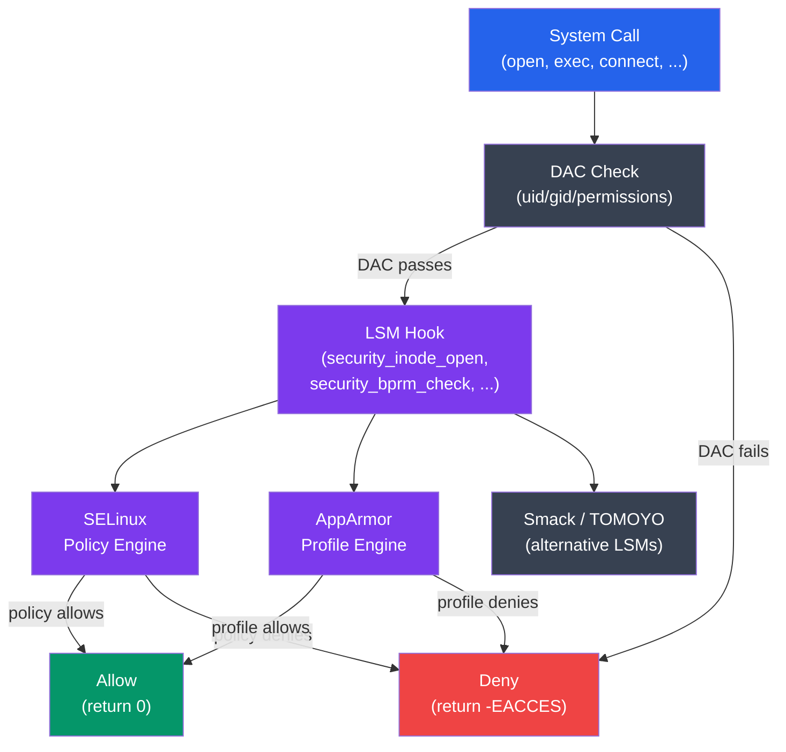

# OS Security Mechanisms

## What You'll Learn

In this tutorial, you'll master the kernel-level security frameworks that enforce mandatory policies:

- SELinux: modes, contexts, type enforcement, and key commands
- AppArmor: profiles, modes, and administration
- Seccomp: syscall filtering and Docker's seccomp profile
- Linux namespaces for process isolation
- cgroups v2 for resource limits and containment

**Time Required**: 50-60 minutes

---

## 1. Linux Security Module (LSM) Framework

LSM is the kernel infrastructure that SELinux, AppArmor, and other security systems plug into:



Only one primary LSM can be active at a time (SELinux or AppArmor — not both). Some stacked LSMs (Landlock, Yama) can run alongside.

---

## 2. SELinux

SELinux (Security-Enhanced Linux) was developed by the NSA and implements **Mandatory Access Control** with **type enforcement** — one of the strongest Linux security frameworks.

### SELinux Modes

```bash
# Check current mode
getenforce
# Enforcing   ← active, denying policy violations
# Permissive  ← logging only, not blocking
# Disabled    ← completely off

# Change mode at runtime (doesn't survive reboot)
setenforce 0    # switch to Permissive
setenforce 1    # switch to Enforcing

# Permanent mode in /etc/selinux/config
cat /etc/selinux/config
# SELINUX=enforcing     ← enforcing | permissive | disabled
# SELINUXTYPE=targeted  ← targeted | minimum | mls

# Check detailed status
sestatus
# SELinux status:                 enabled
# SELinuxfs mount:                /sys/fs/selinux
# SELinux mount point:            /sys/fs/selinux
# Loaded policy name:             targeted
# Current mode:                   enforcing
# Mode from config file:          enforcing
# Policy MLS status:              disabled
# Policy deny_unknown status:     allowed
# Memory protection checking:     actual (secure)
# Max kernel policy version:      33
```

### SELinux Contexts

Every process and file has a **security context** (label). Access decisions are based on these labels, not just uid/gid:

```bash
# View file security contexts
ls -Z /etc/passwd
# system_u:object_r:passwd_file_t:s0  /etc/passwd
#   │         │         │           └── MLS/MCS level
#   │         │         └───────────── type (most important)
#   │         └─────────────────────── role
#   └───────────────────────────────── user

# View process security contexts
ps -Z
# LABEL                           PID   TTY   CMD
# unconfined_u:unconfined_r:unconfined_t:s0  1234  pts/0  bash
# system_u:system_r:httpd_t:s0    5678  ?     httpd

# Your shell context
id -Z
# unconfined_u:unconfined_r:unconfined_t:s0

# Show context of current process
cat /proc/self/attr/current

# Context format: user:role:type:level
# user:  SELinux user (system_u, user_u, unconfined_u)
# role:  what types this user can transition to (object_r, system_r)
# type:  the enforcement label (httpd_t, sshd_t, passwd_file_t)
# level: MLS/MCS sensitivity:categories (s0, s0:c0.c1023)
```

### Type Enforcement

The type is the most important part of the SELinux context. Policies are written as:
**"processes of type A can perform operation X on objects of type B"**

```bash
# Example policy rules (conceptual — actual rules are in binary policy)
# allow httpd_t httpd_config_t:file { read open getattr };
# allow httpd_t httpd_log_t:file { write append create };
# allow httpd_t http_port_t:tcp_socket name_bind;

# View what a type is allowed to do
sesearch --allow --source httpd_t --class file 2>/dev/null | head -20
# allow httpd_t httpd_sys_content_t:file { getattr ioctl lock map open read };
# allow httpd_t httpd_log_t:file { append create getattr ioctl ...};

# View what can access a specific type
sesearch --allow --target passwd_file_t --class file 2>/dev/null | head -10

# Look up type for a file
stat -c %C /var/www/html/index.html
# system_u:object_r:httpd_sys_content_t:s0   ← httpd can read this

stat -c %C /etc/shadow
# system_u:object_r:shadow_t:s0              ← httpd cannot read this
```

### Managing SELinux Contexts

```bash
# Restore default context (fixes wrong labels)
restorecon -v /var/www/html/index.html
restorecon -Rv /var/www/html/   # recursive

# Change context manually
chcon -t httpd_sys_content_t /srv/mysite/index.html
chcon --reference=/var/www/html/index.html /srv/mysite/index.html

# Set persistent context (survives restorecon)
semanage fcontext -a -t httpd_sys_content_t "/srv/mysite(/.*)?"
restorecon -Rv /srv/mysite/

# List all file context rules
semanage fcontext -l | grep httpd

# Manage port contexts
semanage port -l | grep http
# http_port_t  tcp  80, 443, 8008, 8009, 8443, 9000
semanage port -a -t http_port_t -p tcp 8080   # allow httpd on port 8080

# Manage boolean switches (toggle policy features)
getsebool -a | grep httpd
# httpd_can_network_connect --> off
# httpd_enable_cgi --> on
# httpd_use_nfs --> off

setsebool -P httpd_can_network_connect on   # -P = persistent
setsebool httpd_enable_cgi off              # temporary
```

### SELinux Audit Log and Troubleshooting

```bash
# SELinux denials go to audit log
tail -f /var/log/audit/audit.log | grep AVC

# Example denial log entry:
# type=AVC msg=audit(1711620000.123:456): avc:  denied  { read }
#   for  pid=5678 comm="httpd" name="myfile.conf"
#   dev="sda1" ino=12345 scontext=system_u:system_r:httpd_t:s0
#   tcontext=system_u:object_r:admin_home_t:s0 tclass=file permissive=0

# Search audit log for denials
ausearch -m AVC -ts recent
ausearch -m AVC -c httpd    # denials involving httpd
ausearch -m AVC --start today --raw | aureport -a  # summary report

# Decode an AVC denial into human-readable form
ausearch -m AVC -ts recent | audit2why
# Was caused by:  Missing type enforcement (TE) allow rule.
# You can use audit2allow to generate a loadable module to allow this access.

# Generate a policy module to allow denied operations
ausearch -m AVC -ts recent | audit2allow -M mypolicy
semodule -i mypolicy.pp   # install the policy module

# List installed policy modules
semodule -l | head -20

# Remove a module
semodule -r mypolicy
```

---

## 3. AppArmor

AppArmor is a simpler alternative to SELinux, using **path-based profiles** rather than type enforcement. Default on Ubuntu and openSUSE.

### AppArmor Modes

```bash
# Check AppArmor status
aa-status
# apparmor module is loaded.
# 42 profiles are loaded.
# 42 profiles are in enforce mode.
#   /usr/bin/man
#   /usr/sbin/cups-browsed
#   ...
# 0 profiles are in complain mode.
# 20 processes have profiles defined.
# 20 processes are in enforce mode.

# Check status in more detail
systemctl status apparmor

# Check a specific process
cat /proc/<PID>/attr/current
# Shows AppArmor label: /usr/sbin/nginx (enforce)
```

### AppArmor Profile Syntax

Profiles are stored in `/etc/apparmor.d/`:

```
# /etc/apparmor.d/usr.sbin.nginx — sample AppArmor profile for nginx

#include <tunables/global>

/usr/sbin/nginx {
    #include <abstractions/base>
    #include <abstractions/nameservice>

    # Capabilities allowed
    capability net_bind_service,    # bind port 80/443
    capability setuid,
    capability setgid,
    capability dac_override,

    # Network access
    network inet tcp,
    network inet6 tcp,

    # Executable
    /usr/sbin/nginx mr,             # m=memory map, r=read

    # Config files — read only
    /etc/nginx/** r,
    /etc/ssl/certs/** r,

    # Web content — read only
    /var/www/html/** r,
    /srv/www/** r,

    # Log files — write/append
    /var/log/nginx/*.log w,

    # Temporary files
    /var/lib/nginx/tmp/** rw,
    owner /tmp/nginx-* rw,

    # PID file
    /run/nginx.pid rw,

    # Deny everything else (implicit)
}

# Permission flags:
# r = read, w = write, x = execute, m = mmap, k = lock
# l = link, L = follow symlink, i = inherit on exec
# deny = explicitly deny (overrides allows)
```

### Managing AppArmor Profiles

```bash
# Set a profile to complain mode (log but don't enforce)
aa-complain /usr/sbin/nginx
aa-complain /etc/apparmor.d/usr.sbin.nginx

# Set a profile to enforce mode
aa-enforce /usr/sbin/nginx

# Disable a profile
aa-disable /usr/sbin/nginx
ln -s /etc/apparmor.d/usr.sbin.nginx /etc/apparmor.d/disable/
apparmor_parser -R /etc/apparmor.d/usr.sbin.nginx

# Reload a profile after editing
apparmor_parser -r /etc/apparmor.d/usr.sbin.nginx

# Load a new profile
apparmor_parser -a /etc/apparmor.d/usr.sbin.mynewapp

# Generate profile interactively based on log output
aa-genprof /usr/local/bin/myapp
# → runs app, captures accesses, generates profile

# Update profile from logs (complain mode first)
aa-logprof   # reads /var/log/syslog, suggests profile rules

# Check AppArmor denials
grep apparmor /var/log/syslog | grep DENIED
dmesg | grep apparmor | grep DENIED
```

---

## 4. Seccomp: Syscall Filtering

Seccomp (Secure Computing Mode) restricts which system calls a process can make — a final defense layer if exploited code tries to take harmful actions.

### Seccomp Modes

```c
#include <sys/prctl.h>
#include <linux/seccomp.h>
#include <linux/filter.h>

// Mode 1: strict — allow ONLY read, write, exit, sigreturn
prctl(PR_SET_SECCOMP, SECCOMP_MODE_STRICT);
// Any other syscall → SIGKILL
// Used by vsftpd in its sandbox

// Mode 2: filter — BPF program decides per-syscall
// More flexible — can allow/deny specific syscalls with conditions
```

### Seccomp-BPF with libseccomp

```c
#include <seccomp.h>
#include <stdio.h>
#include <unistd.h>

int main() {
    // Initialize seccomp with default action: kill process
    scmp_filter_ctx ctx = seccomp_init(SCMP_ACT_KILL);

    // Allow specific syscalls this process needs
    seccomp_rule_add(ctx, SCMP_ACT_ALLOW, SCMP_SYS(read), 0);
    seccomp_rule_add(ctx, SCMP_ACT_ALLOW, SCMP_SYS(write), 0);
    seccomp_rule_add(ctx, SCMP_ACT_ALLOW, SCMP_SYS(exit), 0);
    seccomp_rule_add(ctx, SCMP_ACT_ALLOW, SCMP_SYS(exit_group), 0);
    seccomp_rule_add(ctx, SCMP_ACT_ALLOW, SCMP_SYS(brk), 0);
    seccomp_rule_add(ctx, SCMP_ACT_ALLOW, SCMP_SYS(mmap), 0);

    // Conditionally allow open only for reading
    seccomp_rule_add(ctx, SCMP_ACT_ALLOW, SCMP_SYS(open), 1,
        SCMP_A1(SCMP_CMP_EQ, O_RDONLY));  // 2nd arg must be O_RDONLY

    // Apply the filter
    seccomp_load(ctx);
    seccomp_release(ctx);

    // From here: any non-whitelisted syscall kills the process
    printf("Seccomp filter active\n");
    return 0;
}
```

### Docker's Seccomp Profile

```bash
# Docker applies a default seccomp profile that blocks ~40 dangerous syscalls
# View the default profile
docker run --security-opt seccomp=default alpine sh

# Run without seccomp (dangerous — for debugging)
docker run --security-opt seccomp=unconfined alpine sh

# Apply custom seccomp profile
cat > my-seccomp.json << 'EOF'
{
  "defaultAction": "SCMP_ACT_ERRNO",
  "architectures": ["SCMP_ARCH_X86_64"],
  "syscalls": [
    {
      "names": ["read", "write", "open", "close", "stat", "fstat",
                "mmap", "mprotect", "munmap", "brk", "exit_group",
                "futex", "clock_gettime", "gettimeofday"],
      "action": "SCMP_ACT_ALLOW"
    }
  ]
}
EOF
docker run --security-opt seccomp=my-seccomp.json myapp

# Check what syscalls a binary uses (for profile creation)
strace -c -f ./myapp 2>&1 | tail -20
# Shows count and time of each syscall used

# Blocked syscalls by Docker default:
# keyctl, add_key, request_key  — kernel keyring manipulation
# ptrace                        — process debugging/injection
# personality                   — execution domain changes
# reboot                        — system reboot
# setns                         — join another namespace
# sysfs, mount, umount2         — filesystem manipulation
# kexec_load                    — load new kernel
```

---

## 5. Linux Namespaces

Namespaces provide isolated views of system resources — the foundation of containers:

```bash
# List namespaces of current process
ls -la /proc/self/ns/
# cgroup -> cgroup:[4026531835]
# ipc    -> ipc:[4026531839]
# mnt    -> mnt:[4026531841]
# net    -> net:[4026531840]
# pid    -> pid:[4026531836]
# time   -> time:[4026531834]
# user   -> user:[4026531837]
# uts    -> uts:[4026531838]

# List all namespaces on system
lsns

# Namespace types and what they isolate:
```

| Namespace | Isolates | Use Case |
|-----------|---------|----------|
| `pid` | Process IDs (PID 1 in container) | Container process trees |
| `net` | Network interfaces, routing, sockets | Container networking |
| `mnt` | Mount points and filesystems | Container root filesystems |
| `uts` | Hostname and NIS domain name | Per-container hostnames |
| `ipc` | SysV IPC, POSIX message queues | Container IPC isolation |
| `user` | UID/GID mappings | Rootless containers |
| `cgroup` | cgroup root directory | Per-container cgroup views |
| `time` | System clocks (boot, monotonic) | Checkpoint/restore |

```bash
# Create a new network namespace (no network access by default)
ip netns add isolated
ip netns exec isolated ip link list
# Only loopback — no external network

# Run a process in a new UTS namespace (custom hostname)
unshare --uts /bin/bash
hostname container-1   # only affects this namespace
hostname               # container-1
# Another terminal: hostname → still original hostname

# Create a full container-like environment
unshare --pid --net --mount --uts --ipc --fork /bin/bash
# New PID namespace: this shell is PID 1
echo $$    # → 1

# Enter an existing namespace (used by 'docker exec')
nsenter --target <PID> --pid --net --mount
# Joins namespaces of process <PID>

# See namespaces of a running container
docker inspect <container_id> | grep -i pid
# "Pid": 12345
ls -la /proc/12345/ns/
```

### User Namespaces and Rootless Containers

```bash
# User namespaces map container UIDs to host UIDs
# Container root (UID 0) → host UID 100000

# Create user namespace where current user appears as root
unshare --user --map-root-user /bin/bash
id
# uid=0(root) gid=0(root) groups=0(root)  ← inside namespace
# But outside: uid=1000(alice)             ← actually unprivileged

# Podman/Docker rootless use user namespaces:
cat /etc/subuid
# alice:100000:65536   ← alice gets 65536 subordinate UIDs starting at 100000

cat /etc/subgid
# alice:100000:65536

# Container UID 0 → host UID 100000
# Container UID 1 → host UID 100001
# ... no real root access
```

---

## 6. cgroups v2: Resource Limits

Control Groups (cgroups) limit and track resource usage. cgroups v2 provides a unified hierarchy:

```bash
# cgroups v2 mounted at /sys/fs/cgroup
ls /sys/fs/cgroup/
# cgroup.controllers  cgroup.procs  cgroup.stat  cpu.stat  memory.stat
# system.slice/  user.slice/  init.scope/

# Create a new cgroup
mkdir /sys/fs/cgroup/myapp

# List available controllers
cat /sys/fs/cgroup/cgroup.controllers
# cpuset cpu io memory hugetlb pids rdma misc

# Enable controllers for the child cgroup
echo "+cpu +memory +pids" > /sys/fs/cgroup/cgroup.subtree_control

# Add process to cgroup
echo <PID> > /sys/fs/cgroup/myapp/cgroup.procs

# Set memory limit (500 MB)
echo $((500 * 1024 * 1024)) > /sys/fs/cgroup/myapp/memory.max
# Process gets OOM-killed if it exceeds 500 MB

# Set memory swap limit (disable swap for this cgroup)
echo 0 > /sys/fs/cgroup/myapp/memory.swap.max

# Set CPU weight (proportional scheduling, default is 100)
echo 50 > /sys/fs/cgroup/myapp/cpu.weight    # gets half the default CPU share

# Set CPU quota (max 20% of one CPU)
# period is 100ms (100000 microseconds), quota is 20ms
echo "20000 100000" > /sys/fs/cgroup/myapp/cpu.max

# Limit number of processes/threads
echo 100 > /sys/fs/cgroup/myapp/pids.max

# Monitor resource usage
cat /sys/fs/cgroup/myapp/memory.current       # current memory usage
cat /sys/fs/cgroup/myapp/memory.stat          # detailed memory breakdown
cat /sys/fs/cgroup/myapp/cpu.stat             # CPU time used
cat /sys/fs/cgroup/myapp/io.stat              # I/O statistics

# systemd slice configuration (recommended over manual cgroup manipulation)
systemctl set-property myservice.service MemoryMax=500M CPUQuota=20% TasksMax=100
```

### cgroups in Containers

```bash
# Docker uses cgroups automatically
docker run \
  --memory=512m \           # memory limit
  --memory-swap=512m \      # disable swap (swap limit = memory limit)
  --cpus=0.5 \              # 50% of one CPU
  --pids-limit=200 \        # max 200 processes
  --blkio-weight=100 \      # I/O weight
  nginx

# Verify from inside container
cat /sys/fs/cgroup/memory.max
# 536870912   (= 512 MB in bytes)

# Or check from host — find container's cgroup
docker inspect <container_id> --format '{{.Id}}' | head -12
cat /sys/fs/cgroup/system.slice/docker-<ID>.scope/memory.max
```

---

## 7. Combining Security Layers

A hardened container uses all mechanisms together:

```bash
# Hardened Docker container — all security mechanisms
docker run \
  # Namespaces (always active in containers)
  # pid, net, mnt, uts, ipc namespaces by default

  # User namespace (rootless — map UID 0 in container to unprivileged host UID)
  --userns=host \    # or configure daemon for user namespaces

  # cgroup resource limits
  --memory=256m \
  --cpus=0.25 \
  --pids-limit=50 \

  # Capabilities — drop all, add only what's needed
  --cap-drop ALL \
  --cap-add NET_BIND_SERVICE \

  # Seccomp — custom profile
  --security-opt seccomp=myapp-seccomp.json \

  # AppArmor profile
  --security-opt apparmor=docker-nginx \

  # Read-only filesystem
  --read-only \
  --tmpfs /tmp \
  --tmpfs /run \

  # No new privileges (prevent SUID escalation inside container)
  --security-opt no-new-privileges:true \

  nginx
```

---

## Summary

| Mechanism | What It Restricts | Kernel Feature | Distro Default |
|-----------|------------------|----------------|----------------|
| SELinux | File/process type access | LSM | RHEL/Fedora/CentOS |
| AppArmor | Per-program file/capability access | LSM | Ubuntu/Debian/SUSE |
| Seccomp | Allowed system calls | prctl/BPF | Docker default |
| Namespaces | Resource visibility (net, pid, mnt...) | clone/unshare | Container runtimes |
| cgroups v2 | Resource consumption limits | cgroupfs | systemd/containers |
| Capabilities | Root privilege granularity | execve/prctl | All Linux |

These mechanisms are complementary: SELinux/AppArmor enforces *what* can be accessed, namespaces control *what is visible*, cgroups limit *how much* is consumed, and seccomp restricts *what kernel interfaces* are reachable — together forming defense-in-depth against both external and post-exploitation attacks.
