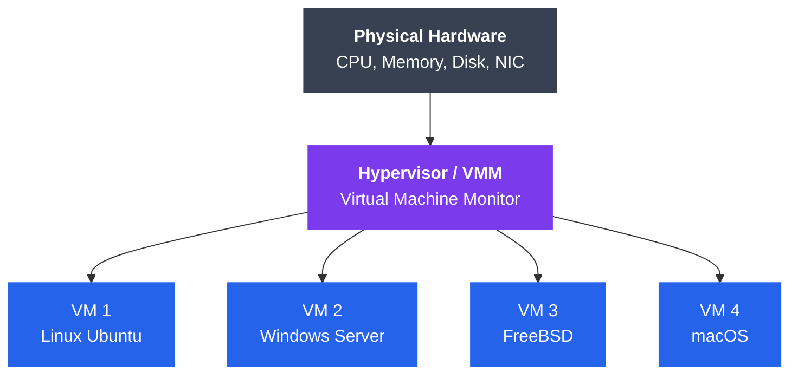
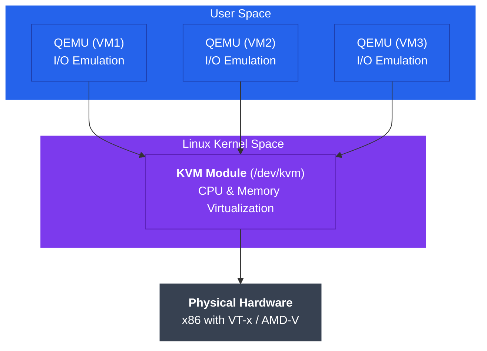

# Virtualization and Hypervisors

## Kya Seekhoge Is Tutorial Mein?

Socho tumhare paas ek hi laptop hai, lekin usmein tumhe Linux, Windows aur ek testing ke liye FreeBSD — teeno chalane hain, ek saath. Normally toh ek machine pe ek hi OS chalta hai na? Yahi problem solve karta hai **virtualization**. Is tutorial mein hum dekhenge ki ek hi physical server pe multiple "virtual machines" kaise chalti hain, hypervisors ke types kya hote hain, CPU/memory/I/O ko virtualize kaise kiya jata hai, aur KVM jaisa production-grade hypervisor kaise use hota hai.

**Topics cover honge**:
- Virtualization kya hai aur iske fayde
- Type 1 (bare-metal) aur Type 2 (hosted) hypervisors
- Hardware virtualization support (Intel VT-x, AMD-V)
- CPU, memory, aur I/O virtualization ke techniques
- KVM architecture aur uska management
- Nested virtualization ke concepts

---

## Virtualization Hai Kya?

**Virtualization** ek aisi technology hai jisse ek hi physical computer pe multiple **virtual machines (VMs)** chal sakti hain, aur har VM ka apna alag operating system aur apps hote hain — bilkul jaise wo apni khud ki dedicated machine ho. Jis physical computer pe ye sab chal raha hai use **host** kehte hain, aur jo virtual machines usmein chal rahi hain unhe **guest** kehte hain.

Isko aise socho — tumhara ek building hai (physical hardware), aur usmein alag-alag flats bante hain (VMs). Har flat mein alag family (guest OS) rehti hai, apna alag furniture (apps) hota hai, aur ek family doosri family ke kaam mein dakhal nahi de sakti. Lekin sabka bijli-paani connection (CPU, RAM, disk) ussi ek building se aata hai. Building ka watchman/manager (hypervisor) decide karta hai ki kis flat ko kितna resource milega aur sab flats peacefully saath rahein.



```
┌─────────────────────────────────────────────────────────────┐
│                    Physical Hardware                        │
│                  (CPU, Memory, Disk, NIC)                   │
└────────────────────────┬────────────────────────────────────┘
                         │
         ┌───────────────┴───────────────┐
         │       Hypervisor/VMM          │  ← Virtualization Layer
         │  (Virtual Machine Monitor)    │
         └───────────┬───────────────────┘
                     │
      ┌──────────────┼──────────────┬──────────────┐
      │              │              │              │
  ┌───▼───┐     ┌───▼───┐     ┌───▼───┐     ┌───▼───┐
  │ VM 1  │     │ VM 2  │     │ VM 3  │     │ VM 4  │
  │Linux  │     │Windows│     │FreeBSD│     │MacOS  │
  │Ubuntu │     │Server │     │       │     │       │
  └───────┘     └───────┘     └───────┘     └───────┘
```

> [!info]
> Yaha jo beech ka layer hai — **Hypervisor**, jise **VMM (Virtual Machine Monitor)** bhi kehte hain — wahi asli hero hai. Ye layer physical hardware ko multiple "virtual" hardware sets mein baant deta hai, aur har VM ko lagta hai ki uske paas apna khud ka dedicated CPU, RAM aur disk hai.

### Virtualization Ke Fayde (Benefits)

Kyun zaruri hai ye sab? Socho AWS, Azure, GCP jaise cloud providers — agar unhe har customer ke liye ek alag physical server kharidna padta, toh cloud computing kabhi itni sasti nahi hoti. Virtualization ne hi cloud computing revolution ko possible banaya. Iske practical fayde:

1. **Consolidation**: Kam physical servers pe zyada workloads chalao. Pehle jaha 10 servers chahiye the alag-alag apps ke liye, ab ek powerful server pe 10 VMs chala sakte ho.
2. **Isolation**: VMs ek doosre se completely isolated hoti hain — agar ek VM crash ho jaye ya usmein malware aa jaye, doosri VMs safe rehti hain. Jaise Zomato ke ek restaurant partner ka server down ho jaye toh doosre restaurants ka order lena band nahi hota.
3. **Portability**: VM ek file jaisi hoti hai (disk image) — usko easily ek host se doosre host pe copy/move kar sakte ho.
4. **Snapshots**: VM ki current state ka "photo" le sakte ho — kuch galat ho jaye toh turant purani state pe wapas jaa sakte ho. Bilkul CRED app ke undo transaction jaisa (well, almost!).
5. **Resource Efficiency**: Hardware ka better utilization — ek server jo pehle 20% CPU use kar raha tha, ab usi pe 4 VMs chalke 80% utilization ho sakti hai.
6. **Cost Savings**: Kam hardware, kam power bill, kam cooling cost — data centers ke liye ye crore rupaye bacha sakta hai.
7. **Testing & Development**: Naya feature test karna hai? Ek disposable VM spin up karo, test karo, delete karo — production ko touch kiye bina.
8. **Legacy Support**: Purana software jo sirf Windows XP pe chalta hai, use modern hardware pe VM ke andar chala sakte ho.

---

## Virtualization Ke Types

Ab sawaal ye hai — hypervisor guest OS ko "virtual" hardware kaise dikhata hai? Iske teen tareeke hain, har ek ka apna trade-off hai.

### Full Virtualization

Isme guest OS bina kisi modification ke chalta hai — usse pata hi nahi chalta ki wo virtualized environment mein hai. Hypervisor guest ke saare privileged instructions ko intercept karke emulate karta hai.

Socho ek naya employee company mein aaya hai jo nahi jaanta ki uska boss uske kaam ko background mein double-check kar raha hai — wo apna kaam normal tareeke se karta rehta hai, lekin hypervisor peeche se saari sensitive cheezein handle kar raha hota hai.

**Fayde**:
- Guest OS mein koi modification nahi chahiye
- Koi bhi OS chala sakte ho (Windows, Linux, BSD, kuch bhi)

**Nuksaan**:
- Instruction emulation ki wajah se performance overhead hota hai (har privileged instruction ko intercept + emulate karna padta hai, jo slow hai)

### Para-virtualization

Yaha guest OS ko modify kiya jata hai taaki usse pata ho ki wo virtualized hai, aur wo hypervisor ke saath cooperate kare using **hypercalls** (system calls jaisa hi concept, bas ye OS se hypervisor ko call hote hain).

Isko aise socho — jaise Swiggy delivery partner ko pata hota hai ki wo Swiggy ke platform pe kaam kar raha hai, isliye wo directly Swiggy ke app se communicate karta hai (efficient), bajaye ye pretend karne ke ki wo independent hai aur uske actions ko manually track karna pade.

**Fayde**:
- Full virtualization se better performance
- Kam overhead

**Nuksaan**:
- Guest OS mein modification chahiye hoti hai (source code access zaruri)
- Unmodified/closed-source OS (jaise Windows, agar special support na ho) chalana mushkil

### Hardware-Assisted Virtualization

Modern CPUs mein built-in virtualization extensions hote hain jo hypervisor ko bina emulation ya guest modification ke efficiently guests chalane dete hain. Ye aaj-kal ka industry-standard approach hai.

**Intel VT-x** (Intel Virtualization Technology) aur **AMD-V** (AMD Virtualization) ye provide karte hain:
- Guests ke liye naye CPU execution modes
- Memory virtualization ke liye hardware support
- I/O virtualization ke liye hardware support

**Fayde**:
- Near-native performance (bilkul real hardware jaisi speed)
- Guest OS modify karne ki zarurat nahi
- Hypervisor design simple ho jata hai (CPU khud bahut kuch handle karta hai)

> [!tip]
> Aaj ke zamane mein KVM, VMware, Hyper-V — sab hardware-assisted virtualization use karte hain kyunki almost saare modern CPUs (Intel i3 se lekar Xeon tak) VT-x/AMD-V support karte hain.

---

## Hypervisor Ke Types

### Type 1 Hypervisor (Bare-Metal)

Ye directly physical hardware pe chalta hai — beech mein koi host operating system nahi hota. Hypervisor khud "OS" ka kaam karta hai.

```
┌────────────────────────────────────────────┐
│     VM 1    │    VM 2    │    VM 3        │
│  Guest OS   │  Guest OS  │  Guest OS      │
├─────────────┴────────────┴────────────────┤
│      Type 1 Hypervisor (Bare-Metal)       │
│    (ESXi, Xen, KVM, Hyper-V)              │
├────────────────────────────────────────────┤
│          Physical Hardware                 │
└────────────────────────────────────────────┘
```

**Examples**:
- **VMware ESXi**: Enterprise-grade virtualization platform, bade data centers mein use hota hai
- **Xen**: Open-source hypervisor — AWS EC2 ka original backbone yahi tha
- **KVM**: Linux kernel-based virtualization — Linux kernel khud ko hypervisor bana leta hai
- **Microsoft Hyper-V**: Windows Server ka virtualization solution

**Characteristics**:
- Performance better hoti hai (direct hardware access, beech mein koi extra OS layer nahi)
- Zyada secure (attack surface chota hota hai — koi host OS nahi jo compromise ho)
- Production data centers mein use hota hai (AWS, Azure, GCP jaise cloud providers isi pe chalte hain)
- Dedicated hardware chahiye hota hai

Socho Type 1 hypervisor ko ek dedicated railway station manager ki tarah — poori station (hardware) uske control mein hai, aur wo directly platforms (VMs) allot karta hai. Koi beech ka middle-man nahi.

### Type 2 Hypervisor (Hosted)

Ye ek normal application ki tarah host operating system ke upar chalta hai.

```
┌────────────────────────────────────────────┐
│     VM 1    │    VM 2    │    VM 3        │
│  Guest OS   │  Guest OS  │  Guest OS      │
├─────────────┴────────────┴────────────────┤
│   Type 2 Hypervisor (Hosted)              │
│   (VirtualBox, VMware Workstation)        │
├────────────────────────────────────────────┤
│         Host Operating System              │
│         (Windows, Linux, macOS)            │
├────────────────────────────────────────────┤
│          Physical Hardware                 │
└────────────────────────────────────────────┘
```

**Examples**:
- **Oracle VirtualBox**: Free, open-source hypervisor — students aur developers ka favorite
- **VMware Workstation/Fusion**: Desktop virtualization, thoda paid/enterprise-focused
- **Parallels Desktop**: macOS pe Windows chalane ke liye popular

**Characteristics**:
- Install aur use karna aasan hai (bas ek app ki tarah download karo)
- Development aur testing ke liye better fit hai
- Performance kam hoti hai (ek extra host OS layer hai beech mein)
- Host OS ke saath resources share karta hai

Ye bilkul aise hai jaise tumhare laptop pe Windows chal raha hai, aur tumne usi ke andar VirtualBox install karke Ubuntu chala diya — Ubuntu (guest) ko Windows (host) ke through hi hardware access milega, direct nahi.

### Comparison: Type 1 vs Type 2

| Feature | Type 1 (Bare-Metal) | Type 2 (Hosted) |
|---------|---------------------|-----------------|
| **Installation** | Directly hardware pe | Host OS ke upar |
| **Performance** | Zyada (near-native) | Kam (OS overhead) |
| **Security** | Zyada secure | Kam secure |
| **Management** | Complex, enterprise tools | Simple, GUI-based |
| **Use Case** | Production servers, data centers | Development, testing, desktop |
| **Cost** | Often commercial | Often free/low-cost |
| **Examples** | ESXi, Xen, KVM, Hyper-V | VirtualBox, VMware Workstation |
| **Resource Efficiency** | Bahut high | Moderate |
| **Hardware Requirements** | Dedicated server | Desktop/laptop |

---

## CPU Virtualization

### Privilege Levels Aur Ring Structure

x86 CPUs mein protection rings hote hain (0 se 3 tak). OS kernel Ring 0 mein chalta hai (sabse zyada privileged, jaise ki company ka owner), aur applications Ring 3 mein chalte hain (kam privileged, jaise normal employees).

**Challenge kya hai?**: Guest OS ko expect hota hai ki wo Ring 0 mein chale (kyunki wo sochta hai ki wo real hardware pe hai), lekin hypervisor ko bhi Ring 0 chahiye hota hai kyunki wo hi asli boss hai. Dono ek hi jagah nahi baith sakte!

```
Traditional:              Virtualized (without HW support):
┌──────────┐             ┌──────────┐
│  Apps    │  Ring 3     │  Apps    │  Ring 3
├──────────┤             ├──────────┤
│          │  Ring 2     │ Guest OS │  Ring 1  ← Deprivileged
│          │  Ring 1     ├──────────┤
├──────────┤             │Hypervisor│  Ring 0
│   OS     │  Ring 0     └──────────┘
└──────────┘
```

Purane zamane mein (hardware support ke bina) guest OS ko "deprivilege" karke Ring 1 mein daal diya jata tha aur hypervisor Ring 0 mein baitha rehta tha. Isse guest OS ke privileged instructions trap hoke hypervisor ke paas jaate the — lekin ye trick-based approach slow aur complex thi.

### Hardware-Assisted Virtualization (Intel VT-x)

Intel VT-x ne **VMX** (Virtual Machine Extensions) introduce kiya, jisme do modes hote hain:
- **VMX root operation**: Yaha hypervisor chalta hai (boss mode)
- **VMX non-root operation**: Yaha guest VMs chalti hain (guest apne aap ko Ring 0 mein hi samajhti hai, koi deprivileging nahi)

**Key operations**:
- **VM Entry**: Hypervisor se guest mein switch hona
- **VM Exit**: Guest se hypervisor mein wapas switch hona (privileged instruction, interrupt, ya kisi sensitive event pe trigger hota hai)

```
Hypervisor (VMX root)
    │
    │ VM Entry (VMLAUNCH/VMRESUME)
    ▼
Guest VM (VMX non-root)
    │
    │ Privileged instruction / Interrupt
    │
    │ VM Exit
    ▼
Hypervisor (VMX root)
    │
    │ Handle the event
    │
    │ VM Entry
    ▼
Guest VM (VMX non-root)
```

> [!info]
> Ye "VM Exit" wala concept bahut important hai practically — jitne zyada VM Exits honge, utni zyada performance overhead hogi (kyunki har exit pe hypervisor ko intervene karna padta hai). Isliye achhe drivers aur hardware support VM Exits ko minimize karne ki koshish karte hain.

---

## Memory Virtualization

Virtualization mein memory translation ka ek extra layer add ho jata hai — normal system mein sirf virtual-to-physical translation hota hai, par yaha do level ho jate hain:

```
Guest Virtual Address (GVA)
          │
          │ Guest Page Tables
          ▼
Guest Physical Address (GPA)
          │
          │ Hypervisor Translation
          ▼
Host Physical Address (HPA)
```

Socho GVA-GPA-HPA translation ko IRCTC ki booking system jaisa — tumne (guest) seat number book kiya (GVA), lekin wo actual coach aur berth (GPA) IRCTC ke internal system se map hota hai, aur phir wo train ke real physical compartment (HPA) se link hota hai. Passenger ko sirf apna seat number pata hota hai, backend mapping usse hidden hoti hai.

### Shadow Page Tables

Hypervisor **shadow page tables** maintain karta hai jo directly GVA → HPA map karte hain, GPA ko bypass karke.

**Fayde**: Direct translation, extra hop nahi
**Nuksaan**: Complex hai, aur jab bhi guest apne page tables update karta hai, hypervisor ko shadow tables bhi sync karni padti hain — ye performance overhead create karta hai

### Extended Page Tables (EPT) / Nested Page Tables (NPT)

Ye hardware support hai two-level page tables ke liye:
- Guest khud GVA → GPA manage karta hai (normal page tables, jaise wo real hardware pe ho)
- Hypervisor GPA → HPA manage karta hai (EPT/NPT tables)
- Hardware (CPU) khud dono tables ko automatically walk kar leta hai — software intervention nahi chahiye

**Intel EPT** (Extended Page Tables) aur **AMD NPT** (Nested Page Tables) yahi kaam karte hain.

**Fayde**:
- Hypervisor design simple ho jata hai
- Performance better hoti hai
- VM Exits kam hote hain (kyunki hardware khud translation handle kar leta hai)

---

## I/O Virtualization

Ab baat karte hain ki VM ke andar chal rahe guest OS ko network card, disk jaise devices kaise dikhte hain — kyunki ek physical NIC ko literally 4-5 VMs ke beech "baantna" possible nahi hai directly.

### Device Emulation

Hypervisor standard devices ko emulate karta hai (jaise e1000 network card, IDE disk controller) — software mein hi fake device bana deta hai jo guest ko real lagta hai.

**Fayde**: Kisi bhi guest OS ke saath kaam karta hai (koi special driver nahi chahiye)
**Nuksaan**: High overhead hota hai (bahut saare VM exits, kyunki har I/O operation ko emulate karna padta hai)

### Para-virtualized Drivers

Guest special drivers use karta hai (jaise **virtio**) jo hypervisor ke saath efficiently communicate karte hain — bina fake hardware emulate kiye, seedha optimized channel banate hain.

**Fayde**: Bahut better performance
**Nuksaan**: Guest ke andar driver install karna padta hai

### Direct Device Assignment

Physical device ko directly ek VM ko assign kar diya jata hai using **IOMMU** (I/O Memory Management Unit) — bilkul jaise ek dedicated lane kisi ek VM ko de di gayi ho.

**Intel VT-d** aur **AMD-Vi** ye enable karte hain:
- Device se seedha guest tak Direct Memory Access (DMA)
- Near-native performance
- Device isolation (ek VM ka device doosri VM access nahi kar sakti)

### SR-IOV (Single Root I/O Virtualization)

Ek physical device (jaise network card) multiple **virtual functions (VFs)** present karta hai jo alag-alag VMs ko assign ki ja sakti hain.

```
Physical NIC with SR-IOV
        │
        ├─── Physical Function (PF) → Hypervisor
        │
        ├─── Virtual Function 1 (VF1) → VM 1
        ├─── Virtual Function 2 (VF2) → VM 2
        └─── Virtual Function 3 (VF3) → VM 3
```

Isko IRCTC ke Tatkal booking jaisa socho — ek hi server (physical NIC) hai, lekin usne apne resources ko chhote-chhote "counters" (virtual functions) mein baant diya hai, aur har counter directly ek user (VM) ko serve kar raha hai bina beech mein extra queue ke.

**Fayde**: High performance, kam CPU overhead — enterprise networking ke liye ye gold standard hai.

---

## KVM (Kernel-based Virtual Machine)

Ab practical duniya mein aate hain. **KVM** Linux kernel ko hi ek Type 1 hypervisor bana deta hai — matlab Linux kernel khud virtualization capabilities provide karta hai, koi alag se hypervisor OS install nahi karna padta.

### KVM Architecture



```
┌──────────────────────────────────────────────────────┐
│                   User Space                         │
│  ┌─────────────┐  ┌─────────────┐  ┌─────────────┐ │
│  │  QEMU (VM1) │  │  QEMU (VM2) │  │  QEMU (VM3) │ │
│  │  (I/O       │  │  (I/O       │  │  (I/O       │ │
│  │  Emulation) │  │  Emulation) │  │  Emulation) │ │
│  └──────┬──────┘  └──────┬──────┘  └──────┬──────┘ │
│         │                 │                 │        │
├─────────┼─────────────────┼─────────────────┼────────┤
│         │     Linux Kernel Space            │        │
│  ┌──────▼─────────────────▼─────────────────▼──────┐ │
│  │            KVM Module (/dev/kvm)                │ │
│  │     (Handles CPU & Memory Virtualization)       │ │
│  └─────────────────────────────────────────────────┘ │
├──────────────────────────────────────────────────────┤
│             Physical Hardware (x86 with VT-x/AMD-V) │
└──────────────────────────────────────────────────────┘
```

**Components samjho ek-ek karke**:
1. **KVM kernel module**: `/dev/kvm` interface provide karta hai, VM execution handle karta hai — ye CPU aur memory virtualization ka core hai (VT-x/AMD-V use karke)
2. **QEMU**: Userspace process jo I/O devices ko emulate karta hai (disk, network, USB, etc.) — matlab CPU/memory KVM handle karta hai, aur baaki devices QEMU
3. **libvirt**: Management library aur API — is se tum programmatically VMs manage kar sakte ho (Terraform, Ansible waghera isi ko use karte hain)
4. **virt-manager/virsh**: Management tools — virt-manager GUI hai, virsh command-line hai

> [!tip]
> Agar tum Node.js/TS developer ho aur Docker use kar chuke ho, toh samajh lo — KVM+QEMU wahi role play karte hain jo Docker Engine containers ke liye karta hai, bas yaha level poora ek OS ka hai, container jitna lightweight nahi.

### KVM Support Check Karna

```bash
# Check if CPU supports virtualization
egrep -c '(vmx|svm)' /proc/cpuinfo
# Output > 0 means supported (vmx=Intel, svm=AMD)

# Check if KVM modules are loaded
lsmod | grep kvm
# Should show: kvm_intel or kvm_amd

# Verify KVM device exists
ls -l /dev/kvm
# Should show: crw-rw-rw- 1 root kvm /dev/kvm
```

### virt-manager (GUI) Se VMs Banana

```bash
# Install KVM and management tools (Ubuntu/Debian)
sudo apt install qemu-kvm libvirt-daemon-system libvirt-clients bridge-utils virt-manager

# Install on RHEL/CentOS/Fedora
sudo dnf install @virtualization

# Start libvirtd service
sudo systemctl start libvirtd
sudo systemctl enable libvirtd

# Launch virt-manager GUI
virt-manager
```

### virsh (CLI) Se VMs Manage Karna

```bash
# List all VMs
virsh list --all

# Start a VM
virsh start vm-name

# Shutdown a VM
virsh shutdown vm-name

# Force stop a VM
virsh destroy vm-name

# Get VM info
virsh dominfo vm-name

# Connect to VM console
virsh console vm-name

# Create snapshot
virsh snapshot-create-as vm-name snapshot-name

# List snapshots
virsh snapshot-list vm-name

# Revert to snapshot
virsh snapshot-revert vm-name snapshot-name

# Clone a VM
virt-clone --original vm-name --name new-vm-name --auto-clone

# Delete a VM
virsh undefine vm-name
```

### virt-install Se VM Banana

```bash
# Create Ubuntu VM with 2 CPUs, 2GB RAM, 20GB disk
virt-install \
  --name ubuntu-vm \
  --ram 2048 \
  --disk path=/var/lib/libvirt/images/ubuntu-vm.qcow2,size=20 \
  --vcpus 2 \
  --os-type linux \
  --os-variant ubuntu20.04 \
  --network bridge=virbr0 \
  --graphics vnc,listen=0.0.0.0 \
  --console pty,target_type=serial \
  --cdrom /path/to/ubuntu-20.04.iso
```

---

## Nested Virtualization

**Nested virtualization** ka matlab hai — ek VM ke andar dusra hypervisor chalana, jisse VM ke andar VM ban jaye. Suno ye thoda mind-bending lagega, but socho ek building ke andar (host) ek flat hai (L1 VM), aur us flat ke andar koi PG (paying guest) rooms bana ke aage rent pe de raha hai (nested L2 VMs) — layers ke andar layers.

```
Physical Host
    └── Hypervisor (L0)
        └── VM (L1)
            └── Hypervisor in VM (L1)
                └── Nested VM (L2)
```

**Use cases**:
- Hypervisor software test karna (bina real hardware ke ek dusre level pe test kar lo)
- Cloud development environments (jab tumhe apne laptop pe ek "mini cloud" simulate karna ho)
- Training aur education (students ko bina extra hardware diye virtualization sikhana)

### KVM Mein Nested Virtualization Enable Karna

```bash
# Check if nested virtualization is enabled (Intel)
cat /sys/module/kvm_intel/parameters/nested
# Should output: Y or 1

# Enable nested virtualization (Intel)
sudo modprobe -r kvm_intel
sudo modprobe kvm_intel nested=1

# Make it persistent
echo "options kvm_intel nested=1" | sudo tee /etc/modprobe.d/kvm.conf

# For AMD:
echo "options kvm_amd nested=1" | sudo tee /etc/modprobe.d/kvm.conf

# Verify VM CPU configuration exposes virtualization
virsh edit vm-name
# Add: <cpu mode='host-passthrough'/>
```

> [!warning]
> Nested virtualization production mein rarely use hoti hai kyunki performance overhead double ho jata hai (har layer apna translation aur exit-handling add karti hai). Ye mostly dev/test/training ke liye hi use hoti hai.

---

## Advanced Virtualization Features

### Live Migration

Ek chalti hui VM ko ek physical host se doosre host pe move karna, wo bhi bina downtime ke — user ko pata bhi nahi chalega ki uska workload kisi doosre server pe shift ho gaya.

Ye bilkul aise hai jaise Ola/Uber driver switch trip karte waqt tumhe pata bhi nahi chalta ki backend pe kaunsa server tumhari request handle kar raha hai — seamlessly switch ho jata hai.

```bash
# Migrate VM to another host
virsh migrate --live vm-name qemu+ssh://destination-host/system
```

**Requirements**:
- Shared storage (NFS, SAN) ya storage migration ka support
- Dono hosts pe same CPU family (warna guest ko confusion ho jayegi kyunki instructions match nahi karenge)
- Network connectivity

### Memory Ballooning

VM ki memory allocation ko dynamically adjust karna — jaise ek balloon ko phulaana ya pichkana.

```bash
# Set maximum memory
virsh setmaxmem vm-name 4G --config

# Set current memory (balloon)
virsh setmem vm-name 2G --live
```

### CPU Pinning

Specific physical CPUs ko ek VM ke saath bind kar dena, better performance ke liye — taaki VM hamesha usi CPU core pe schedule ho, bar-bar migrate na ho (cache locality maintain rehti hai).

```bash
# Pin VM's vCPU 0 to physical CPU 2
virsh vcpupin vm-name 0 2

# Pin VM's vCPU 1 to physical CPU 3
virsh vcpupin vm-name 1 3
```

---

## Performance Considerations

| Technique | Performance Impact | Complexity |
|-----------|-------------------|------------|
| **Full Emulation** | Slow (10-50% overhead) | Low |
| **Para-virtualization** | Good (5-10% overhead) | Medium |
| **Hardware-Assisted** | Excellent (1-5% overhead) | Low |
| **SR-IOV** | Near-native | High |
| **virtio Drivers** | Very good | Low-Medium |

### Best Practices

1. **Hardware virtualization enable karo** (VT-x/AMD-V) BIOS mein — bahut baar ye default off hota hai
2. **virtio drivers use karo** network aur disk I/O ke liye — emulated devices se kaafi tez
3. **Sahi resources allocate karo**: Bahut zyada overcommit mat karo (jaise 8GB RAM wale host pe 5 VMs ko 4-4 GB allocate karna disaster hai)
4. **Huge pages use karo** memory-intensive VMs ke liye
5. **CPU pin karo** latency-sensitive workloads ke liye
6. **SR-IOV use karo** high-performance networking ke liye
7. **Regular snapshots lo** backup aur recovery ke liye

---

## Key Takeaways

- **Virtualization** ek physical hardware pe multiple VMs ko efficiently share karne deta hai — cloud computing ki poori nींव yahi hai
- **Type 1 hypervisors** (bare-metal) production ke liye better performance dete hain kyunki direct hardware access hota hai
- **Type 2 hypervisors** (hosted) development ke liye easy hote hain kyunki host OS ke upar ek app ki tarah install ho jate hain
- **Hardware virtualization** (VT-x/AMD-V) modern virtualization ke liye essential hai — bina iske performance bahut slow hoti
- **Memory virtualization** EPT/NPT use karke efficient address translation karti hai (GVA → GPA → HPA)
- **I/O virtualization** emulation se lekar direct device assignment tak ka range cover karti hai — SR-IOV enterprise networking ke liye best hai
- **KVM** Linux ko ek powerful Type 1 hypervisor bana deta hai — QEMU I/O emulate karta hai, KVM kernel module CPU/memory handle karta hai
- **Nested virtualization** VMs ke andar hypervisor chalane deta hai — mostly testing/training ke liye useful
- **Performance tuning** mein virtio drivers, CPU pinning, aur SR-IOV jaise techniques important role play karte hain

---

## Exercises

### Beginner

1. **VirtualBox install karo** aur ek Linux VM banao
2. **CPU support check karo**: `lscpu` ya `/proc/cpuinfo` use karke VT-x/AMD-V verify karo
3. **Hypervisors compare karo**: 3 Type 1 aur 3 Type 2 hypervisors ka comparison table banao
4. **Memory calculation**: Agar ek host ke paas 64GB RAM hai, toh 4GB per VM ke hisaab se kitni VMs chala sakte ho?
5. **Snapshots research karo**: VM snapshots kaise kaam karte hain aur unke use cases explain karo

### Intermediate

1. **KVM install karo** ek Linux system pe aur verify karo ki wo kaam kar raha hai
2. **virt-install se VM banao** command-line use karke
3. **virtio configure karo**: Ek VM ko disk aur network ke liye virtio drivers use karne ke liye set up karo
4. **Network setup**: Apni VMs ke liye ek bridged network banao
5. **Live migration**: Do KVM hosts set up karo aur unke beech ek VM migrate karo (shared storage chahiye hoga)
6. **Performance test**: IDE, SATA, aur virtio drivers ke saath disk I/O performance compare karo

### Advanced

1. **Nested virtualization enable karo** aur ek VM ke andar VM banao
2. **SR-IOV setup**: Ek compatible network card pe SR-IOV configure karo aur VFs ko VMs ko assign karo
3. **NUMA tuning**: Better performance ke liye ek VM ko specific NUMA nodes pe pin karo
4. **CPU hotplug**: Ek chalti hui VM mein dynamically vCPUs add/remove karo
5. **Memory overcommit**: KSM (Kernel Samepage Merging) configure karo aur memory deduplication test karo
6. **Mini cloud banao**: OpenStack ya Proxmox use karke multiple VMs ke saath ek chhota private cloud banao
7. **Benchmark comparison**: CPU, memory, disk, aur network ke liye VM performance vs bare-metal compare karo

---

## Navigation

- [← Back to README](./README.md)
- [Next: Containers and Isolation →](./02_containers.md)
- [Operating Systems Main](../README.md)
