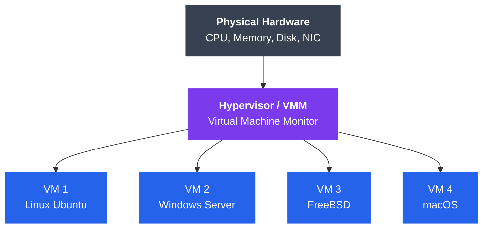
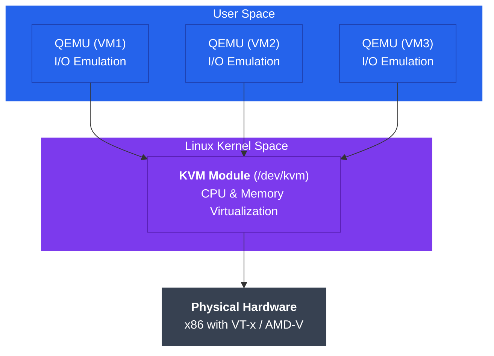

# Virtualization and Hypervisors

## What You'll Learn

In this tutorial, you'll explore virtualization technology that enables multiple virtual machines (VMs) to run on a single physical host. You'll understand different types of hypervisors, learn how CPU, memory, and I/O virtualization work, and gain practical knowledge of managing virtual machines.

**Topics covered**:
- Fundamentals of virtualization and its benefits
- Type 1 (bare-metal) and Type 2 (hosted) hypervisors
- Hardware virtualization support (Intel VT-x, AMD-V)
- CPU, memory, and I/O virtualization techniques
- KVM architecture and management
- Nested virtualization concepts

---

## What is Virtualization?

**Virtualization** is the technology that allows multiple virtual machines (VMs) to run on a single physical computer, each with its own operating system and applications. The physical computer is called the **host**, and the virtual machines are called **guests**.



```
┌─────────────────────────────────────────────────────────────┐
│                    Physical Hardware                        │
│                  (CPU, Memory, Disk, NIC)                   │
└────────────────────────┬────────────────────────────────────┘
                         │
         ┌───────────────┴───────────────┐
         │       Hypervisor/VMM          │  ← Virtualization Layer
         │  (Virtual Machine Monitor)    │
         └───────────┬───────────────────┘
                     │
      ┌──────────────┼──────────────┬──────────────┐
      │              │              │              │
  ┌───▼───┐     ┌───▼───┐     ┌───▼───┐     ┌───▼───┐
  │ VM 1  │     │ VM 2  │     │ VM 3  │     │ VM 4  │
  │Linux  │     │Windows│     │FreeBSD│     │MacOS  │
  │Ubuntu │     │Server │     │       │     │       │
  └───────┘     └───────┘     └───────┘     └───────┘
```

### Benefits of Virtualization

1. **Consolidation**: Run multiple workloads on fewer physical servers
2. **Isolation**: VMs are isolated from each other; failures don't cascade
3. **Portability**: VMs can be moved between hosts easily
4. **Snapshots**: Save VM state for backup and recovery
5. **Resource Efficiency**: Better utilization of physical hardware
6. **Cost Savings**: Reduce hardware, power, and cooling costs
7. **Testing & Development**: Create isolated environments quickly
8. **Legacy Support**: Run old OS versions on modern hardware

---

## Types of Virtualization

### Full Virtualization

The guest OS runs unmodified and is unaware it's being virtualized. The hypervisor intercepts and emulates privileged instructions.

**Advantages**:
- No guest OS modification required
- Can run any OS

**Disadvantages**:
- Performance overhead from instruction emulation

### Para-virtualization

The guest OS is modified to be aware of virtualization and cooperates with the hypervisor through **hypercalls** (like system calls, but to the hypervisor).

**Advantages**:
- Better performance than full virtualization
- Lower overhead

**Disadvantages**:
- Requires guest OS modifications
- Cannot run unmodified OS

### Hardware-Assisted Virtualization

Modern CPUs include virtualization extensions that allow the hypervisor to run guests efficiently without emulation or modification.

**Intel VT-x** (Intel Virtualization Technology) and **AMD-V** (AMD Virtualization) provide:
- New CPU execution modes for guests
- Hardware support for memory virtualization
- Hardware support for I/O virtualization

**Advantages**:
- Near-native performance
- No guest OS modification needed
- Simplified hypervisor design

---

## Hypervisor Types

### Type 1 Hypervisor (Bare-Metal)

Runs directly on the physical hardware without a host operating system.

```
┌────────────────────────────────────────────┐
│     VM 1    │    VM 2    │    VM 3        │
│  Guest OS   │  Guest OS  │  Guest OS      │
├─────────────┴────────────┴────────────────┤
│      Type 1 Hypervisor (Bare-Metal)       │
│    (ESXi, Xen, KVM, Hyper-V)              │
├────────────────────────────────────────────┤
│          Physical Hardware                 │
└────────────────────────────────────────────┘
```

**Examples**:
- **VMware ESXi**: Enterprise virtualization platform
- **Xen**: Open-source hypervisor used by AWS
- **KVM**: Linux kernel-based virtualization
- **Microsoft Hyper-V**: Windows Server virtualization

**Characteristics**:
- Better performance (direct hardware access)
- More secure (smaller attack surface)
- Used in production data centers
- Requires dedicated hardware

### Type 2 Hypervisor (Hosted)

Runs as an application on top of a host operating system.

```
┌────────────────────────────────────────────┐
│     VM 1    │    VM 2    │    VM 3        │
│  Guest OS   │  Guest OS  │  Guest OS      │
├─────────────┴────────────┴────────────────┤
│   Type 2 Hypervisor (Hosted)              │
│   (VirtualBox, VMware Workstation)        │
├────────────────────────────────────────────┤
│         Host Operating System              │
│         (Windows, Linux, macOS)            │
├────────────────────────────────────────────┤
│          Physical Hardware                 │
└────────────────────────────────────────────┘
```

**Examples**:
- **Oracle VirtualBox**: Free, open-source hypervisor
- **VMware Workstation/Fusion**: Desktop virtualization
- **Parallels Desktop**: macOS virtualization

**Characteristics**:
- Easier to install and use
- Better for development and testing
- Lower performance (additional OS layer)
- Can share resources with host OS

### Comparison: Type 1 vs Type 2

| Feature | Type 1 (Bare-Metal) | Type 2 (Hosted) |
|---------|---------------------|-----------------|
| **Installation** | Directly on hardware | On top of host OS |
| **Performance** | Higher (near-native) | Lower (OS overhead) |
| **Security** | More secure | Less secure |
| **Management** | Complex, enterprise tools | Simple, GUI-based |
| **Use Case** | Production servers, data centers | Development, testing, desktop |
| **Cost** | Often commercial | Often free/low-cost |
| **Examples** | ESXi, Xen, KVM, Hyper-V | VirtualBox, VMware Workstation |
| **Resource Efficiency** | Very high | Moderate |
| **Hardware Requirements** | Dedicated server | Desktop/laptop |

---

## CPU Virtualization

### Privilege Levels and Ring Structure

x86 CPUs have protection rings (0-3). The OS kernel runs in Ring 0 (most privileged), applications in Ring 3.

**Challenge**: Guest OS expects to run in Ring 0, but hypervisor needs Ring 0.

```
Traditional:              Virtualized (without HW support):
┌──────────┐             ┌──────────┐
│  Apps    │  Ring 3     │  Apps    │  Ring 3
├──────────┤             ├──────────┤
│          │  Ring 2     │ Guest OS │  Ring 1  ← Deprivileged
│          │  Ring 1     ├──────────┤
├──────────┤             │Hypervisor│  Ring 0
│   OS     │  Ring 0     └──────────┘
└──────────┘
```

### Hardware-Assisted Virtualization (Intel VT-x)

Intel VT-x introduces **VMX** (Virtual Machine Extensions) with two modes:
- **VMX root operation**: Hypervisor runs here
- **VMX non-root operation**: Guest VMs run here

**Key operations**:
- **VM Entry**: Switch from hypervisor to guest
- **VM Exit**: Switch from guest to hypervisor (on privileged instructions, interrupts, etc.)

```
Hypervisor (VMX root)
    │
    │ VM Entry (VMLAUNCH/VMRESUME)
    ▼
Guest VM (VMX non-root)
    │
    │ Privileged instruction / Interrupt
    │
    │ VM Exit
    ▼
Hypervisor (VMX root)
    │
    │ Handle the event
    │
    │ VM Entry
    ▼
Guest VM (VMX non-root)
```

---

## Memory Virtualization

Virtualization introduces an additional layer of memory translation:

```
Guest Virtual Address (GVA)
          │
          │ Guest Page Tables
          ▼
Guest Physical Address (GPA)
          │
          │ Hypervisor Translation
          ▼
Host Physical Address (HPA)
```

### Shadow Page Tables

The hypervisor maintains **shadow page tables** that directly map GVA → HPA, bypassing GPA.

**Advantages**: Direct translation
**Disadvantages**: Complex, performance overhead on page table updates

### Extended Page Tables (EPT) / Nested Page Tables (NPT)

Hardware support for two-level page tables:
- Guest manages GVA → GPA (normal page tables)
- Hypervisor manages GPA → HPA (EPT/NPT tables)
- Hardware automatically walks both tables

**Intel EPT** (Extended Page Tables) and **AMD NPT** (Nested Page Tables)

**Advantages**:
- Simplified hypervisor design
- Better performance
- Reduced VM exits

---

## I/O Virtualization

### Device Emulation

Hypervisor emulates standard devices (e.g., e1000 network card, IDE disk controller).

**Advantages**: Works with any guest OS
**Disadvantages**: High overhead (many VM exits)

### Para-virtualized Drivers

Guest uses special drivers (e.g., **virtio**) that communicate efficiently with hypervisor.

**Advantages**: Much better performance
**Disadvantages**: Requires driver installation in guest

### Direct Device Assignment

Physical device is assigned directly to a VM using **IOMMU** (I/O Memory Management Unit).

**Intel VT-d** and **AMD-Vi** enable:
- Direct memory access (DMA) from device to guest
- Near-native performance
- Device isolation

### SR-IOV (Single Root I/O Virtualization)

A physical device (e.g., network card) presents multiple **virtual functions** (VFs) that can be assigned to different VMs.

```
Physical NIC with SR-IOV
        │
        ├─── Physical Function (PF) → Hypervisor
        │
        ├─── Virtual Function 1 (VF1) → VM 1
        ├─── Virtual Function 2 (VF2) → VM 2
        └─── Virtual Function 3 (VF3) → VM 3
```

**Advantages**: High performance, low CPU overhead

---

## KVM (Kernel-based Virtual Machine)

KVM turns the Linux kernel into a Type 1 hypervisor.

### KVM Architecture



```
┌──────────────────────────────────────────────────────┐
│                   User Space                         │
│  ┌─────────────┐  ┌─────────────┐  ┌─────────────┐ │
│  │  QEMU (VM1) │  │  QEMU (VM2) │  │  QEMU (VM3) │ │
│  │  (I/O       │  │  (I/O       │  │  (I/O       │ │
│  │  Emulation) │  │  Emulation) │  │  Emulation) │ │
│  └──────┬──────┘  └──────┬──────┘  └──────┬──────┘ │
│         │                 │                 │        │
├─────────┼─────────────────┼─────────────────┼────────┤
│         │     Linux Kernel Space            │        │
│  ┌──────▼─────────────────▼─────────────────▼──────┐ │
│  │            KVM Module (/dev/kvm)                │ │
│  │     (Handles CPU & Memory Virtualization)       │ │
│  └─────────────────────────────────────────────────┘ │
├──────────────────────────────────────────────────────┤
│             Physical Hardware (x86 with VT-x/AMD-V) │
└──────────────────────────────────────────────────────┘
```

**Components**:
1. **KVM kernel module**: Provides `/dev/kvm` interface, handles VM execution
2. **QEMU**: Userspace process that emulates I/O devices
3. **libvirt**: Management library and API
4. **virt-manager/virsh**: Management tools

### Checking KVM Support

```bash
# Check if CPU supports virtualization
egrep -c '(vmx|svm)' /proc/cpuinfo
# Output > 0 means supported (vmx=Intel, svm=AMD)

# Check if KVM modules are loaded
lsmod | grep kvm
# Should show: kvm_intel or kvm_amd

# Verify KVM device exists
ls -l /dev/kvm
# Should show: crw-rw-rw- 1 root kvm /dev/kvm
```

### Creating VMs with virt-manager (GUI)

```bash
# Install KVM and management tools (Ubuntu/Debian)
sudo apt install qemu-kvm libvirt-daemon-system libvirt-clients bridge-utils virt-manager

# Install on RHEL/CentOS/Fedora
sudo dnf install @virtualization

# Start libvirtd service
sudo systemctl start libvirtd
sudo systemctl enable libvirtd

# Launch virt-manager GUI
virt-manager
```

### Managing VMs with virsh (CLI)

```bash
# List all VMs
virsh list --all

# Start a VM
virsh start vm-name

# Shutdown a VM
virsh shutdown vm-name

# Force stop a VM
virsh destroy vm-name

# Get VM info
virsh dominfo vm-name

# Connect to VM console
virsh console vm-name

# Create snapshot
virsh snapshot-create-as vm-name snapshot-name

# List snapshots
virsh snapshot-list vm-name

# Revert to snapshot
virsh snapshot-revert vm-name snapshot-name

# Clone a VM
virt-clone --original vm-name --name new-vm-name --auto-clone

# Delete a VM
virsh undefine vm-name
```

### Creating a VM with virt-install

```bash
# Create Ubuntu VM with 2 CPUs, 2GB RAM, 20GB disk
virt-install \
  --name ubuntu-vm \
  --ram 2048 \
  --disk path=/var/lib/libvirt/images/ubuntu-vm.qcow2,size=20 \
  --vcpus 2 \
  --os-type linux \
  --os-variant ubuntu20.04 \
  --network bridge=virbr0 \
  --graphics vnc,listen=0.0.0.0 \
  --console pty,target_type=serial \
  --cdrom /path/to/ubuntu-20.04.iso
```

---

## Nested Virtualization

**Nested virtualization** allows running a hypervisor inside a VM, creating VMs within VMs.

```
Physical Host
    └── Hypervisor (L0)
        └── VM (L1)
            └── Hypervisor in VM (L1)
                └── Nested VM (L2)
```

**Use cases**:
- Testing hypervisor software
- Cloud development environments
- Training and education

### Enabling Nested Virtualization in KVM

```bash
# Check if nested virtualization is enabled (Intel)
cat /sys/module/kvm_intel/parameters/nested
# Should output: Y or 1

# Enable nested virtualization (Intel)
sudo modprobe -r kvm_intel
sudo modprobe kvm_intel nested=1

# Make it persistent
echo "options kvm_intel nested=1" | sudo tee /etc/modprobe.d/kvm.conf

# For AMD:
echo "options kvm_amd nested=1" | sudo tee /etc/modprobe.d/kvm.conf

# Verify VM CPU configuration exposes virtualization
virsh edit vm-name
# Add: <cpu mode='host-passthrough'/>
```

---

## Advanced Virtualization Features

### Live Migration

Move a running VM from one physical host to another without downtime.

```bash
# Migrate VM to another host
virsh migrate --live vm-name qemu+ssh://destination-host/system
```

**Requirements**:
- Shared storage (NFS, SAN) or storage migration
- Same CPU family on both hosts
- Network connectivity

### Memory Ballooning

Dynamically adjust VM memory allocation.

```bash
# Set maximum memory
virsh setmaxmem vm-name 4G --config

# Set current memory (balloon)
virsh setmem vm-name 2G --live
```

### CPU Pinning

Assign specific physical CPUs to a VM for better performance.

```bash
# Pin VM's vCPU 0 to physical CPU 2
virsh vcpupin vm-name 0 2

# Pin VM's vCPU 1 to physical CPU 3
virsh vcpupin vm-name 1 3
```

---

## Performance Considerations

| Technique | Performance Impact | Complexity |
|-----------|-------------------|------------|
| **Full Emulation** | Slow (10-50% overhead) | Low |
| **Para-virtualization** | Good (5-10% overhead) | Medium |
| **Hardware-Assisted** | Excellent (1-5% overhead) | Low |
| **SR-IOV** | Near-native | High |
| **virtio Drivers** | Very good | Low-Medium |

### Best Practices

1. **Enable hardware virtualization** (VT-x/AMD-V) in BIOS
2. **Use virtio drivers** for network and disk I/O
3. **Allocate appropriate resources**: Don't overcommit severely
4. **Use huge pages** for memory-intensive VMs
5. **Pin CPUs** for latency-sensitive workloads
6. **Use SR-IOV** for high-performance networking
7. **Regular snapshots** for backup and recovery

---

## Key Takeaways

1. **Virtualization** enables multiple VMs to share physical hardware efficiently
2. **Type 1 hypervisors** (bare-metal) offer better performance for production
3. **Type 2 hypervisors** (hosted) are easier to use for development
4. **Hardware virtualization** (VT-x/AMD-V) is essential for modern virtualization
5. **Memory virtualization** uses EPT/NPT for efficient address translation
6. **I/O virtualization** ranges from emulation to direct device assignment
7. **KVM** turns Linux into a powerful Type 1 hypervisor
8. **Nested virtualization** enables running hypervisors within VMs
9. **Performance tuning** involves virtio drivers, CPU pinning, and SR-IOV

---

## Exercises

### Beginner

1. **Install VirtualBox** and create a Linux VM
2. **Check CPU support**: Use `lscpu` or `/proc/cpuinfo` to verify VT-x/AMD-V
3. **Compare hypervisors**: Create a table comparing 3 Type 1 and 3 Type 2 hypervisors
4. **Memory calculation**: If a host has 64GB RAM, how many VMs can you run with 4GB each?
5. **Research snapshots**: Explain how VM snapshots work and their use cases

### Intermediate

1. **Install KVM** on a Linux system and verify it works
2. **Create a VM with virt-install** using the command-line
3. **Configure virtio**: Set up a VM to use virtio drivers for disk and network
4. **Network setup**: Create a bridged network for your VMs
5. **Live migration**: Set up two KVM hosts and migrate a VM between them (requires shared storage)
6. **Performance test**: Compare disk I/O performance with IDE, SATA, and virtio drivers

### Advanced

1. **Enable nested virtualization** and create a VM within a VM
2. **SR-IOV setup**: Configure SR-IOV on a compatible network card and assign VFs to VMs
3. **NUMA tuning**: Pin a VM to specific NUMA nodes for better performance
4. **CPU hotplug**: Dynamically add/remove vCPUs from a running VM
5. **Memory overcommit**: Configure KSM (Kernel Samepage Merging) and test memory deduplication
6. **Build a mini cloud**: Use OpenStack or Proxmox to create a small private cloud with multiple VMs
7. **Benchmark comparison**: Compare VM performance vs bare-metal for CPU, memory, disk, and network

---

## Navigation

- [← Back to README](./README.md)
- [Next: Containers and Isolation →](./02_containers.md)
- [Operating Systems Main](../README.md)
