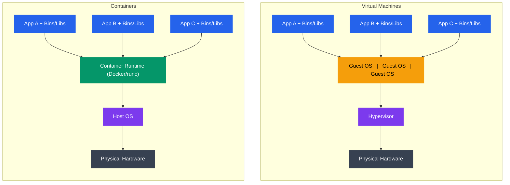
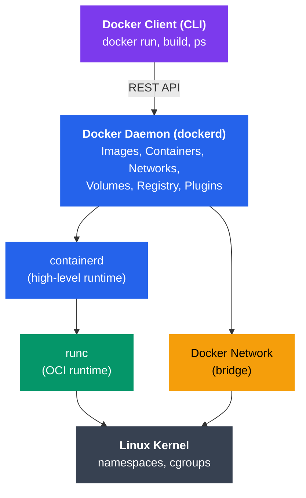

# Containers and Isolation

## What You'll Learn

In this tutorial, you'll explore container technology, a lightweight form of virtualization that provides process isolation without the overhead of full virtual machines. You'll understand how Linux namespaces and cgroups enable containerization, learn Docker fundamentals, and explore the container ecosystem.

**Topics covered**:
- Containers vs Virtual Machines comparison
- History of Linux containers (chroot to Docker)
- Docker architecture and container lifecycle
- Linux namespaces for isolation
- cgroups for resource management
- Container images and Dockerfiles
- Container runtimes and orchestration
- Security considerations

---

## Containers vs Virtual Machines

### Architecture Comparison



```
Virtual Machines:                    Containers:
┌──────────────────────────┐        ┌──────────────────────────┐
│  App A  │  App B  │ App C│        │  App A  │  App B  │ App C│
│ ─────── │ ─────── │ ──── │        │ ─────── │ ─────── │ ──── │
│  Bins/  │  Bins/  │ Bins/│        │  Bins/  │  Bins/  │ Bins/│
│  Libs   │  Libs   │ Libs │        │  Libs   │  Libs   │ Libs │
├─────────┴─────────┴──────┤        ├─────────┴─────────┴──────┤
│ Guest   │ Guest   │Guest │        │   Container Runtime      │
│   OS    │   OS    │  OS  │        │      (Docker/runc)       │
├─────────┴─────────┴──────┤        ├──────────────────────────┤
│      Hypervisor          │        │       Host OS            │
├──────────────────────────┤        ├──────────────────────────┤
│    Physical Hardware     │        │   Physical Hardware      │
└──────────────────────────┘        └──────────────────────────┘
```

### Key Differences

| Feature | Virtual Machines | Containers |
|---------|------------------|------------|
| **Isolation** | Hardware-level (full OS) | Process-level (shared kernel) |
| **Startup Time** | Minutes | Seconds |
| **Size** | Gigabytes (full OS) | Megabytes (app + deps) |
| **Performance** | Overhead (~5-10%) | Near-native |
| **Portability** | Less portable (VM images) | Highly portable (images) |
| **Resource Usage** | Higher (separate OS) | Lower (shared kernel) |
| **Security** | Strong isolation | Weaker isolation |
| **Density** | 10s per host | 100s-1000s per host |
| **Boot Overhead** | Full OS boot | Process startup |
| **Use Case** | Different OS, strong isolation | Microservices, CI/CD |

---

## History of Linux Containers

### Evolution Timeline

```
1979: chroot
   │   └─── Change root directory (filesystem isolation)
   │
2000: FreeBSD Jails
   │   └─── More complete process isolation
   │
2004: Solaris Zones
   │   └─── OS-level virtualization
   │
2006: Process Containers (cgroups)
   │   └─── Resource limiting and accounting
   │
2008: LXC (Linux Containers)
   │   └─── First complete Linux container manager
   │   └─── Combines cgroups + namespaces
   │
2013: Docker
   │   └─── Simplified container creation and distribution
   │   └─── Container images and Docker Hub
   │
2014: Kubernetes
   │   └─── Container orchestration at scale
   │
2015: runc & OCI
   │   └─── Open Container Initiative standards
   │
2016: containerd
   │   └─── Industry-standard container runtime
   │
Present: Cloud-native ecosystem
       └─── Kubernetes, service mesh, serverless
```

### chroot (Change Root)

The oldest form of isolation, limiting filesystem access:

```bash
# Create a minimal root filesystem
mkdir -p /tmp/newroot/bin
cp /bin/bash /tmp/newroot/bin/

# Change root directory
sudo chroot /tmp/newroot /bin/bash
# Now / points to /tmp/newroot
```

**Limitations**: Only filesystem isolation, no process or network isolation

---

## Container Benefits

1. **Lightweight**: Share host kernel, minimal overhead
2. **Fast Startup**: Seconds vs minutes for VMs
3. **Portability**: "Build once, run anywhere"
4. **Consistency**: Same environment dev → test → prod
5. **Resource Efficiency**: Higher density than VMs
6. **Microservices**: Perfect for distributed architectures
7. **CI/CD**: Rapid build, test, deploy cycles
8. **Version Control**: Images are versioned and immutable

---

## Docker Architecture

Docker is the most popular container platform.



```
┌─────────────────────────────────────────────────────────────┐
│                     Docker Client (CLI)                     │
│                    $ docker run, build, ps                  │
└────────────────────────────┬────────────────────────────────┘
                             │ REST API
                             │
┌────────────────────────────▼────────────────────────────────┐
│                     Docker Daemon (dockerd)                 │
│  ┌─────────────┐  ┌──────────────┐  ┌──────────────────┐  │
│  │   Images    │  │  Containers  │  │    Networks      │  │
│  │ Management  │  │  Management  │  │   Management     │  │
│  └─────────────┘  └──────────────┘  └──────────────────┘  │
│  ┌─────────────┐  ┌──────────────┐  ┌──────────────────┐  │
│  │   Volumes   │  │   Registry   │  │    Plugins       │  │
│  │ Management  │  │   Client     │  │                  │  │
│  └─────────────┘  └──────────────┘  └──────────────────┘  │
└────────────────────────────┬────────────────────────────────┘
                             │
                ┌────────────┼────────────┐
                │            │            │
        ┌───────▼───────┐    │    ┌───────▼───────┐
        │  containerd   │    │    │ Docker Network│
        │  (runtime)    │    │    │   (bridge)    │
        └───────┬───────┘    │    └───────────────┘
                │            │
        ┌───────▼───────┐    │
        │     runc      │    │
        │ (OCI runtime) │    │
        └───────┬───────┘    │
                │            │
        ┌───────▼────────────▼──────┐
        │   Linux Kernel            │
        │  (namespaces, cgroups)    │
        └───────────────────────────┘
```

### Key Components

1. **Docker Client**: CLI tool (`docker` command)
2. **Docker Daemon** (`dockerd`): Core service managing containers
3. **containerd**: High-level container runtime
4. **runc**: Low-level runtime that creates containers (OCI compliant)
5. **Docker Registry**: Stores container images (Docker Hub, private registries)

---

## Container Images and Dockerfiles

### Container Images

A **container image** is a lightweight, standalone package containing:
- Application code
- Runtime (e.g., Python, Node.js)
- System libraries
- Dependencies
- Configuration files

Images are built in **layers** (like a Git commit history):

```
┌────────────────────────────┐
│   App Layer (Your Code)    │  ← Top layer (smallest)
├────────────────────────────┤
│   Dependencies Layer       │  ← pip install, npm install
├────────────────────────────┤
│   Runtime Layer            │  ← Python, Node.js
├────────────────────────────┤
│   OS Layer (Base Image)    │  ← Ubuntu, Alpine (largest)
└────────────────────────────┘
```

**Layer Caching**: Unchanged layers are reused, speeding up builds.

### Dockerfile

A **Dockerfile** is a text file with instructions to build an image.

```dockerfile
# Use official Python runtime as base image
FROM python:3.9-slim

# Set working directory in container
WORKDIR /app

# Copy requirements file
COPY requirements.txt .

# Install Python dependencies
RUN pip install --no-cache-dir -r requirements.txt

# Copy application code
COPY . .

# Expose port 8000
EXPOSE 8000

# Set environment variable
ENV FLASK_APP=app.py

# Run application
CMD ["python", "app.py"]
```

### Common Dockerfile Instructions

| Instruction | Purpose | Example |
|-------------|---------|---------|
| `FROM` | Base image | `FROM ubuntu:20.04` |
| `RUN` | Execute command (build time) | `RUN apt-get update` |
| `COPY` | Copy files from host | `COPY app.py /app/` |
| `ADD` | Copy + extract archives | `ADD archive.tar.gz /app/` |
| `WORKDIR` | Set working directory | `WORKDIR /app` |
| `ENV` | Set environment variable | `ENV NODE_ENV=production` |
| `EXPOSE` | Document port | `EXPOSE 80` |
| `CMD` | Default command (runtime) | `CMD ["npm", "start"]` |
| `ENTRYPOINT` | Fixed command prefix | `ENTRYPOINT ["python"]` |
| `VOLUME` | Declare mount point | `VOLUME /data` |

### Building and Running

```bash
# Build image from Dockerfile
docker build -t myapp:1.0 .

# List images
docker images

# Run container from image
docker run -d -p 8000:8000 --name myapp-container myapp:1.0

# List running containers
docker ps

# View container logs
docker logs myapp-container

# Execute command in running container
docker exec -it myapp-container bash

# Stop container
docker stop myapp-container

# Remove container
docker rm myapp-container

# Remove image
docker rmi myapp:1.0
```

---

## Linux Namespaces

**Namespaces** provide isolation by giving each container its own view of system resources.

### Types of Namespaces

```
┌─────────────────────────────────────────────────────────────┐
│                         Host System                         │
├──────────────┬──────────────┬──────────────┬────────────────┤
│ Container 1  │ Container 2  │ Container 3  │  Host Process  │
├──────────────┼──────────────┼──────────────┼────────────────┤
│              │              │              │                │
│ PID NS       │ PID NS       │ PID NS       │  PID NS        │
│  PID 1, 2... │  PID 1, 2... │  PID 1, 2... │  (all PIDs)    │
│              │              │              │                │
│ NET NS       │ NET NS       │ NET NS       │  NET NS        │
│  eth0, lo    │  eth0, lo    │  eth0, lo    │  (all ifaces)  │
│              │              │              │                │
│ MNT NS       │ MNT NS       │ MNT NS       │  MNT NS        │
│  /app mounts │  /app mounts │  /app mounts │  (all mounts)  │
│              │              │              │                │
│ UTS NS       │ UTS NS       │ UTS NS       │  UTS NS        │
│  hostname    │  hostname    │  hostname    │  hostname      │
│              │              │              │                │
│ IPC NS       │ IPC NS       │ IPC NS       │  IPC NS        │
│  (isolated)  │  (isolated)  │  (isolated)  │                │
│              │              │              │                │
│ USER NS      │ USER NS      │ USER NS      │  USER NS       │
│  UID mapping │  UID mapping │  UID mapping │  (real UIDs)   │
│              │              │              │                │
│ CGROUP NS    │ CGROUP NS    │ CGROUP NS    │  CGROUP NS     │
│  (view)      │  (view)      │  (view)      │  (full view)   │
└──────────────┴──────────────┴──────────────┴────────────────┘
```

#### 1. PID Namespace (Process ID)

Isolates process IDs. Each container has its own PID 1.

```bash
# Inside container
$ ps aux
USER  PID  COMMAND
root    1  /bin/bash
root   23  ps aux

# On host
$ ps aux | grep bash
user  15432  /bin/bash  # Same process, different PID
```

#### 2. Network Namespace (NET)

Isolates network interfaces, IP addresses, routing tables, firewall rules.

```bash
# Create network namespace
sudo ip netns add container1

# List network namespaces
sudo ip netns list

# Execute command in namespace
sudo ip netns exec container1 ip addr show
```

#### 3. Mount Namespace (MNT)

Isolates filesystem mount points. Each container has its own filesystem view.

#### 4. UTS Namespace (Unix Timesharing System)

Isolates hostname and domain name.

```bash
# Inside container
$ hostname
container1

# On host
$ hostname
myserver.example.com
```

#### 5. IPC Namespace (Interprocess Communication)

Isolates System V IPC and POSIX message queues.

#### 6. User Namespace (USER)

Maps user/group IDs. Root in container can be non-root on host.

```
Container:  UID 0 (root) → Host: UID 1000 (user)
Container:  UID 1 (user) → Host: UID 1001 (user)
```

**Security benefit**: Container root cannot modify host files.

#### 7. Cgroup Namespace

Isolates the view of cgroup hierarchy.

### Creating Namespaces (Demo)

```bash
# Create new PID and Mount namespaces
sudo unshare --pid --mount --fork bash

# Now in isolated namespace
ps aux  # Will show only processes in this namespace
```

---

## Control Groups (cgroups)

**cgroups** limit and account for resource usage of processes.

### cgroup Subsystems (Controllers)

```
┌──────────────────────────────────────────────────────────┐
│                      cgroup Hierarchy                    │
├──────────────────────────────────────────────────────────┤
│                                                          │
│  CPU Controller         Memory Controller               │
│  ├─ Container1: 50%    ├─ Container1: 512MB            │
│  ├─ Container2: 30%    ├─ Container2: 1GB              │
│  └─ Container3: 20%    └─ Container3: 256MB            │
│                                                          │
│  Block I/O Controller   Network Controller              │
│  ├─ Container1: 10MB/s ├─ Container1: 100Mbps          │
│  ├─ Container2: 20MB/s ├─ Container2: 1Gbps            │
│  └─ Container3: 5MB/s  └─ Container3: 10Mbps           │
│                                                          │
└──────────────────────────────────────────────────────────┘
```

### Key Controllers

| Controller | Purpose | Limits |
|------------|---------|--------|
| **cpu** | CPU time | CPU shares, quotas |
| **cpuset** | CPU/NUMA node assignment | Which CPUs to use |
| **memory** | Memory usage | Max memory, swap |
| **blkio** | Block I/O | Read/write bandwidth |
| **net_cls** | Network classification | Traffic shaping |
| **devices** | Device access | Which devices allowed |
| **pids** | Process count | Max number of processes |

### Docker Resource Limits

```bash
# Limit memory to 512MB
docker run -m 512m nginx

# Limit CPU shares (relative weight)
docker run --cpu-shares 512 nginx

# Limit CPU cores (absolute limit)
docker run --cpus 2.0 nginx

# Limit both CPU and memory
docker run -m 1g --cpus 2.0 nginx

# Limit block I/O
docker run --device-read-bps /dev/sda:10mb nginx

# Limit PIDs
docker run --pids-limit 100 nginx
```

### Viewing cgroup Limits

```bash
# Inside container
cat /sys/fs/cgroup/memory/memory.limit_in_bytes
cat /sys/fs/cgroup/cpu/cpu.cfs_quota_us

# On host (Docker cgroups)
ls /sys/fs/cgroup/memory/docker/
cat /sys/fs/cgroup/memory/docker/<container-id>/memory.limit_in_bytes
```

---

## Union File Systems (overlay2)

Docker uses **union file systems** to create layers efficiently.

```
Container View:                     Actual Storage:
┌──────────────┐                   ┌──────────────┐
│   /app       │                   │ UpperDir     │ ← Read/Write
│   /bin       │                   │ (Container)  │   (changes)
│   /etc       │                   └──────┬───────┘
│   /lib       │                          │
│   ...        │                          │ Union
│              │                          │
└──────────────┘                   ┌──────▼───────┐
                                   │ LowerDir     │ ← Read-Only
                                   │ (Image       │   (base layers)
                                   │  Layers)     │
                                   └──────────────┘
```

**OverlayFS** combines multiple directories:
- **LowerDir**: Read-only image layers
- **UpperDir**: Read-write container layer
- **MergedDir**: Union view presented to container
- **WorkDir**: Internal use by OverlayFS

**Copy-on-Write (CoW)**: Files from lower layers are copied to upper layer only when modified.

---

## Container Runtimes

```
┌────────────────────────────────────────────────┐
│         High-Level Runtimes                    │
│  ┌──────────┐  ┌──────────┐  ┌──────────┐    │
│  │  Docker  │  │containerd│  │  CRI-O   │    │
│  └────┬─────┘  └────┬─────┘  └────┬─────┘    │
│       │             │             │           │
│       └─────────────┼─────────────┘           │
│                     │                         │
├─────────────────────┼─────────────────────────┤
│         Low-Level Runtimes (OCI)              │
│            ┌────────▼────────┐                │
│            │      runc       │                │
│            │   (reference)   │                │
│            └─────────────────┘                │
│  ┌──────────────┐      ┌──────────────┐      │
│  │   crun       │      │   kata       │      │
│  │ (C, faster)  │      │ (VM-based)   │      │
│  └──────────────┘      └──────────────┘      │
└────────────────────────────────────────────────┘
```

### OCI (Open Container Initiative)

Standards for container formats and runtimes:
- **Image Spec**: How to package container images
- **Runtime Spec**: How to run containers

### Popular Runtimes

1. **runc**: Reference OCI runtime (Go)
2. **crun**: Fast OCI runtime (C)
3. **containerd**: High-level runtime (used by Docker, Kubernetes)
4. **CRI-O**: Kubernetes-specific runtime
5. **kata-containers**: VM-isolated containers for security

---

## Docker Commands Reference

```bash
# ===== Images =====
docker pull ubuntu:20.04          # Download image
docker images                     # List images
docker build -t myapp:1.0 .       # Build image
docker tag myapp:1.0 myapp:latest # Tag image
docker push myapp:1.0             # Push to registry
docker rmi myapp:1.0              # Remove image

# ===== Containers =====
docker run -d --name web nginx    # Run container (detached)
docker run -it ubuntu bash        # Run interactive
docker ps                         # List running containers
docker ps -a                      # List all containers
docker stop web                   # Stop container
docker start web                  # Start stopped container
docker restart web                # Restart container
docker rm web                     # Remove container
docker rm -f web                  # Force remove

# ===== Inspection =====
docker logs web                   # View logs
docker logs -f web                # Follow logs
docker inspect web                # Detailed info (JSON)
docker stats                      # Live resource usage
docker top web                    # Running processes
docker port web                   # Port mappings

# ===== Execution =====
docker exec -it web bash          # Execute command
docker cp file.txt web:/app/      # Copy file to container
docker cp web:/app/log.txt .      # Copy file from container

# ===== Networks =====
docker network ls                 # List networks
docker network create mynet       # Create network
docker run --network mynet nginx  # Connect to network

# ===== Volumes =====
docker volume create mydata       # Create volume
docker run -v mydata:/data nginx  # Mount volume
docker volume ls                  # List volumes
docker volume rm mydata           # Remove volume
```

---

## Container Orchestration

For running containers at scale, orchestration platforms are needed:

### Kubernetes

The de facto standard for container orchestration.

**Features**:
- Automatic scaling
- Self-healing (restart failed containers)
- Load balancing
- Rolling updates
- Service discovery

### Docker Swarm

Docker's built-in orchestration.

### Others

- Apache Mesos
- HashiCorp Nomad

---

## Security Considerations

### Container Vulnerabilities

1. **Shared Kernel**: All containers share host kernel
   - Kernel exploit can escape container
   - **Mitigation**: Keep kernel updated, use kata-containers for isolation

2. **Privileged Containers**: Have root access to host
   ```bash
   docker run --privileged  # DANGEROUS!
   ```
   - **Mitigation**: Never use in production unless absolutely necessary

3. **Docker Daemon Access**: Socket access = root access
   ```bash
   docker run -v /var/run/docker.sock:/var/run/docker.sock
   # Can control all containers!
   ```
   - **Mitigation**: Restrict socket access

4. **Container Escape**: Bugs allowing breakout from container
   - **Mitigation**: Use security profiles (AppArmor, SELinux, Seccomp)

### Security Best Practices

```bash
# Run as non-root user
FROM python:3.9
RUN useradd -m appuser
USER appuser

# Use minimal base images
FROM alpine:3.14  # 5MB vs Ubuntu's 72MB

# Scan images for vulnerabilities
docker scan myapp:1.0

# Drop capabilities
docker run --cap-drop ALL --cap-add NET_BIND_SERVICE nginx

# Read-only root filesystem
docker run --read-only nginx

# Use user namespaces
dockerd --userns-remap=default

# Enable seccomp profile
docker run --security-opt seccomp=profile.json nginx

# Don't expose Docker daemon
# Never: -v /var/run/docker.sock:/var/run/docker.sock
```

---

## Key Takeaways

1. **Containers** provide lightweight, process-level isolation using shared kernel
2. **Namespaces** isolate resources (PID, network, mount, UTS, IPC, user, cgroup)
3. **cgroups** limit and account for resource usage (CPU, memory, I/O)
4. **Docker** is the most popular container platform with a rich ecosystem
5. **Container images** are built in layers, enabling efficient caching and distribution
6. **Union file systems** (overlay2) enable efficient layered storage
7. **OCI standards** ensure compatibility between runtimes
8. **Security** requires careful configuration (non-root, dropped capabilities, scanning)
9. **Orchestration** platforms (Kubernetes) manage containers at scale

---

## Exercises

### Beginner

1. **Install Docker** on your system and verify with `docker run hello-world`
2. **Pull and run**: Pull nginx image and run it, access via browser
3. **Create Dockerfile**: Write a Dockerfile for a simple Python "Hello World" app
4. **Build and run**: Build your Docker image and run a container from it
5. **Explore namespaces**: List the 7 Linux namespace types and their purposes

### Intermediate

1. **Multi-stage build**: Create a Dockerfile with multi-stage build to reduce image size
2. **Docker Compose**: Write a `docker-compose.yml` for a web app + database
3. **Resource limits**: Run a container with CPU and memory limits, verify with `docker stats`
4. **Custom network**: Create a Docker network and run two containers that can communicate
5. **Volume persistence**: Create a volume, write data in a container, verify it persists after container removal
6. **Inspect cgroups**: Find and examine cgroup files for a running container

### Advanced

1. **Create namespace manually**: Use `unshare` to create isolated namespaces without Docker
2. **Container from scratch**: Use `runc` directly to run a container (without Docker)
3. **Security hardening**: Configure AppArmor or SELinux profile for a container
4. **User namespaces**: Enable and configure user namespace remapping in Docker
5. **Build mini-Kubernetes**: Set up a 3-node Kubernetes cluster with kubeadm
6. **Container escape**: Research CVE-2019-5736 (runc vulnerability) and mitigation
7. **Custom runtime**: Experiment with alternative runtimes (crun, kata-containers)

---

## Navigation

- [← Previous: Virtualization and Hypervisors](./01_virtualization.md)
- [Next: Real-Time Operating Systems →](./03_rtos.md)
- [Back to README](./README.md)
