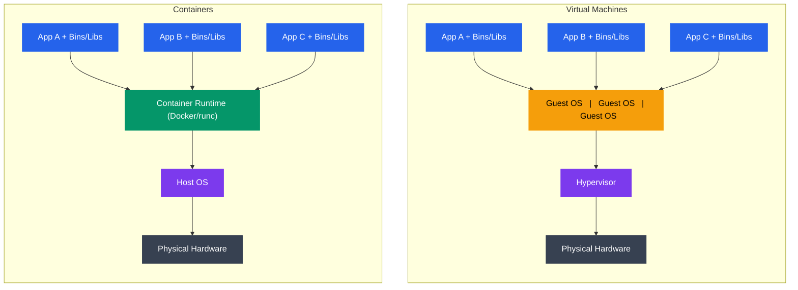
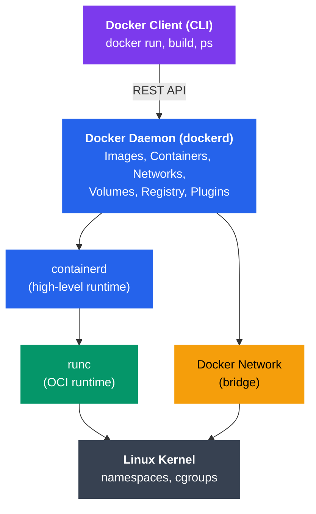

# Containers and Isolation

## Kya Seekhoge Is Tutorial Mein?

Socho tumne apne laptop pe ek Node.js app perfectly chala liya, sab kuch green tick, `npm start` bhi chal gaya. Ab tumne wahi code production server pe push kiya aur... crash. "Works on my machine" wala classic dialogue. Yeh problem decades se developers ko pareshan kar rahi thi — aur containers ne isko solve kiya.

Is note mein hum dekhenge ki **containers** kya hote hain — ek lightweight virtualization technique jo process isolation deti hai bina full virtual machine ke overhead ke. Hum samjhenge ki Linux **namespaces** aur **cgroups** kaise mil kar containerization ko possible banate hain, Docker fundamentals seekhenge, aur pura container ecosystem explore karenge.

**Topics cover honge**:
- Containers vs Virtual Machines — dono mein fark
- Linux containers ki history (chroot se leke Docker tak)
- Docker architecture aur container lifecycle
- Isolation ke liye Linux namespaces
- Resource management ke liye cgroups
- Container images aur Dockerfiles
- Container runtimes aur orchestration
- Security considerations

---

## Containers vs Virtual Machines

### Kya Farak Hai In Dono Mein?

Yeh samajhne ke liye ek analogy lete hain. Socho tum ek building mein rehte ho.

**Virtual Machine** = Har tenant ke paas apna **poora alag ghar** hai, complete infrastructure ke saath — apna kitchen, apna bathroom, apna electric meter, apna sab kuch. Yeh super isolated hai — agar ek ghar mein aag lag jaye, doosre ghar ko koi farak nahi padta. Lekin banane mein bahut resources lagte hain (zameen, materials, time).

**Container** = Yeh ek **PG (Paying Guest) / shared apartment** jaisa hai — sab log same building (host OS/kernel) share karte hain, lekin har kisi ka apna room hai (apna isolated environment), apna locker (apni files), apna schedule. Kitchen shared hai lekin har koi apna hi khana banata hai apne time pe. Setup fast hai, resources kam lagte hain, lekin agar building ki foundation (kernel) mein hi problem aa jaye, sabko asar hota hai.

Yeh hi core difference hai: **VM hardware-level isolation deta hai (poora alag OS)**, jabki **container process-level isolation deta hai (shared kernel)**.

### Architecture Comparison



```
Virtual Machines:                    Containers:
┌──────────────────────────┐        ┌──────────────────────────┐
│  App A  │  App B  │ App C│        │  App A  │  App B  │ App C│
│ ─────── │ ─────── │ ──── │        │ ─────── │ ─────── │ ──── │
│  Bins/  │  Bins/  │ Bins/│        │  Bins/  │  Bins/  │ Bins/│
│  Libs   │  Libs   │ Libs │        │  Libs   │  Libs   │ Libs │
├─────────┴─────────┴──────┤        ├─────────┴─────────┴──────┤
│ Guest   │ Guest   │Guest │        │   Container Runtime      │
│   OS    │   OS    │  OS  │        │      (Docker/runc)       │
├─────────┴─────────┴──────┤        ├──────────────────────────┤
│      Hypervisor          │        │       Host OS            │
├──────────────────────────┤        ├──────────────────────────┤
│    Physical Hardware     │        │   Physical Hardware      │
└──────────────────────────┘        └──────────────────────────┘
```

Dekho VM waali diagram mein har app ke neeche **apna poora Guest OS** hai — matlab har VM apna khud ka kernel boot karta hai. Container waali side mein saare apps seedha **Host OS ka kernel** share karte hain, sirf ek thin **Container Runtime** layer (Docker/runc) unhe isolate karti hai. Yehi wajah hai ki containers itne fast aur lightweight hote hain.

### Key Differences

| Feature | Virtual Machines | Containers |
|---------|------------------|------------|
| **Isolation** | Hardware-level (full OS) | Process-level (shared kernel) |
| **Startup Time** | Minutes | Seconds |
| **Size** | Gigabytes (full OS) | Megabytes (app + deps) |
| **Performance** | Overhead (~5-10%) | Near-native |
| **Portability** | Less portable (VM images) | Highly portable (images) |
| **Resource Usage** | Higher (separate OS) | Lower (shared kernel) |
| **Security** | Strong isolation | Weaker isolation |
| **Density** | 10s per host | 100s-1000s per host |
| **Boot Overhead** | Full OS boot | Process startup |
| **Use Case** | Different OS, strong isolation | Microservices, CI/CD |

> [!tip]
> Agar tumhe alag-alag OS chalane hai (jaise Windows guest on Linux host), ya bank-grade strict isolation chahiye — VM better hai. Agar tumhe fast, portable, lightweight deployment chahiye (jaise ek Node.js microservice) — container better hai. Real world mein bahut companies dono use karti hain: VM ke andar container chalate hain (jaise AWS EC2 instance ke andar Docker) — best of both worlds.

---

## Linux Containers Ki History

### Kaise Evolve Hua Yeh Sab?

Container koi ek din mein invent nahi hua — yeh 40+ saal ki incremental engineering ka result hai. Chalo timeline dekhte hain:

```
1979: chroot
   │   └─── Change root directory (filesystem isolation)
   │
2000: FreeBSD Jails
   │   └─── More complete process isolation
   │
2004: Solaris Zones
   │   └─── OS-level virtualization
   │
2006: Process Containers (cgroups)
   │   └─── Resource limiting and accounting
   │
2008: LXC (Linux Containers)
   │   └─── First complete Linux container manager
   │   └─── Combines cgroups + namespaces
   │
2013: Docker
   │   └─── Simplified container creation and distribution
   │   └─── Container images and Docker Hub
   │
2014: Kubernetes
   │   └─── Container orchestration at scale
   │
2015: runc & OCI
   │   └─── Open Container Initiative standards
   │
2016: containerd
   │   └─── Industry-standard container runtime
   │
Present: Cloud-native ecosystem
       └─── Kubernetes, service mesh, serverless
```

Notice karo — **1979 mein chroot** aaya, sirf filesystem isolation ke liye. Phir **2006 mein Google ne cgroups** banaya resource limiting ke liye (kyunki unko apne data centers mein hazaaron processes ka resource usage control karna tha). **2008 mein LXC** ne in dono (namespaces + cgroups) ko combine kiya aur pehli baar "container" jaisa kuch bana. Lekin asli game-changer tha **2013 mein Docker** — usne containers ko developer-friendly banaya. Isse pehle containers expert Linux admins ke liye tha, Docker ne isko har developer ke liye accessible bana diya, bilkul waise hi jaise UPI ne payments ko har aam aadmi ke liye accessible bana diya (isse pehle NEFT/RTGS complicated tha).

### chroot (Change Root)

Yeh sabse purana isolation form hai, sirf filesystem access ko limit karta hai:

```bash
# Create a minimal root filesystem
mkdir -p /tmp/newroot/bin
cp /bin/bash /tmp/newroot/bin/

# Change root directory
sudo chroot /tmp/newroot /bin/bash
# Now / points to /tmp/newroot
```

**Limitations**: Sirf filesystem isolation milta hai, process ya network isolation bilkul nahi. Matlab agar tum chroot ke andar ho, tab bhi tum host ke saare processes dekh sakte ho, network access bhi same hai. Isliye chroot ko "container" nahi bola jata — yeh sirf ek building block tha.

---

## Container Ke Benefits

Ab sochte hain container use kyun karein — yeh kaunse practical problems solve karta hai:

1. **Lightweight**: Host kernel share karta hai, minimal overhead — jaise shared WiFi router, sabko apna router nahi chahiye
2. **Fast Startup**: Seconds mein start hota hai VMs ke minutes ke against — jaise Zomato app open hote hi order place kar sakte ho, poora phone restart nahi karna padta
3. **Portability**: "Build once, run anywhere" — laptop pe test kiya, wahi image AWS/GCP/Azure kahin bhi chalega
4. **Consistency**: Dev → test → prod sab jagah same environment — "works on my machine" wala excuse khatam
5. **Resource Efficiency**: VMs se zyada density milti hai same hardware pe
6. **Microservices**: Distributed architectures ke liye perfect — Swiggy jaisi company mein order-service, payment-service, delivery-service sab alag containers mein chalte hain independently
7. **CI/CD**: Rapid build, test, deploy cycles — GitHub Actions ya Jenkins pipeline mein container spin up karo, test chalao, destroy karo
8. **Version Control**: Images versioned aur immutable hote hain — jaise Git commits, `myapp:1.0`, `myapp:1.1` alag-alag tagged versions

---

## Docker Architecture

Docker sabse popular container platform hai — jab log "containers" bolte hain, unka matlab practically Docker hi hota hai.



```
┌─────────────────────────────────────────────────────────────┐
│                     Docker Client (CLI)                     │
│                    $ docker run, build, ps                  │
└────────────────────────────┬────────────────────────────────┘
                             │ REST API
                             │
┌────────────────────────────▼────────────────────────────────┐
│                     Docker Daemon (dockerd)                 │
│  ┌─────────────┐  ┌──────────────┐  ┌──────────────────┐  │
│  │   Images    │  │  Containers  │  │    Networks      │  │
│  │ Management  │  │  Management  │  │   Management     │  │
│  └─────────────┘  └──────────────┘  └──────────────────┘  │
│  ┌─────────────┐  ┌──────────────┐  ┌──────────────────┐  │
│  │   Volumes   │  │   Registry   │  │    Plugins       │  │
│  │ Management  │  │   Client     │  │                  │  │
│  └─────────────┘  └──────────────┘  └──────────────────┘  │
└────────────────────────────┬────────────────────────────────┘
                             │
                ┌────────────┼────────────┐
                │            │            │
        ┌───────▼───────┐    │    ┌───────▼───────┐
        │  containerd   │    │    │ Docker Network│
        │  (runtime)    │    │    │   (bridge)    │
        └───────┬───────┘    │    └───────────────┘
                │            │
        ┌───────▼───────┐    │
        │     runc      │    │
        │ (OCI runtime) │    │
        └───────┬───────┘    │
                │            │
        ┌───────▼────────────▼──────┐
        │   Linux Kernel            │
        │  (namespaces, cgroups)    │
        └───────────────────────────┘
```

Jab tum `docker run nginx` type karte ho, kya hota hai step-by-step samjho — bilkul Swiggy order flow ki tarah:

1. **Docker Client (CLI)** — Tumhara `docker` command, jaise Swiggy app pe order place karna. Yeh REST API ke through **Docker Daemon** ko request bhejta hai.
2. **Docker Daemon (dockerd)** — Yeh order-taking restaurant hai. Yeh images, containers, networks, volumes sab manage karta hai. Yeh decide karta hai ki image chahiye ya nahi, agar nahi hai toh registry se pull karega.
3. **containerd** — Yeh restaurant ka kitchen manager hai jo actual "cooking" (container lifecycle) delegate karta hai.
4. **runc** — Yeh actual "cook" hai jo OCI (Open Container Initiative) spec follow karke container ko **kernel level pe create karta hai** — namespaces set karta hai, cgroups attach karta hai.
5. **Linux Kernel** — Yeh sab kuch enable karne wali underlying machinery hai — namespaces aur cgroups yahin implement hote hain.

### Key Components

1. **Docker Client**: CLI tool (`docker` command) — tumhara order-placing interface
2. **Docker Daemon** (`dockerd`): Core service jo containers manage karti hai — background mein hamesha chalti hai
3. **containerd**: High-level container runtime — lifecycle management (start, stop, pause)
4. **runc**: Low-level runtime jo actual container create karta hai (OCI compliant)
5. **Docker Registry**: Container images store karta hai (Docker Hub public registry hai, private registries bhi ho sakte hain — jaise company ka apna private AWS ECR)

---

## Container Images Aur Dockerfiles

### Container Images Kya Hote Hain?

Ek **container image** ek lightweight, standalone package hai jisme sab kuch hota hai jo application chalane ke liye chahiye:
- Application code
- Runtime (jaise Python, Node.js)
- System libraries
- Dependencies
- Configuration files

Socho ek **tiffin box** ki tarah — usme roti, sabzi, dal, rice sab compartments mein packed hai. Tumhe alag se kuch banana nahi padta, poora meal ready-to-eat hai. Container image bhi waise hi — poora application "ready-to-run" package hai.

Images **layers** mein build hote hain (bilkul Git commit history ki tarah — har commit ek naya layer hai jo pichle commit ke upar built hai):

```
┌────────────────────────────┐
│   App Layer (Your Code)    │  ← Top layer (smallest)
├────────────────────────────┤
│   Dependencies Layer       │  ← pip install, npm install
├────────────────────────────┤
│   Runtime Layer            │  ← Python, Node.js
├────────────────────────────┤
│   OS Layer (Base Image)    │  ← Ubuntu, Alpine (largest)
└────────────────────────────┘
```

**Layer Caching**: Jo layers change nahi hue, wo reuse hote hain, jisse builds fast ho jate hain. Jaise agar tumne sirf apna application code change kiya (top layer), toh Docker `pip install` ya `npm install` wala layer dobara nahi chalayega — usko cache se utha lega. Isliye Dockerfile mein order matter karta hai: jo cheez kam badalti hai (base image, dependencies) usko upar rakho, jo zyada badalti hai (tumhara code) usko neeche.

> [!tip]
> Agar tum `COPY . .` pehle karke `RUN npm install` baad mein karoge, toh har chhoti si code change pe poora `npm install` dobara chalega — cache waste ho jayega. Isliye hamesha `COPY package.json` pehle, `RUN npm install` uske baad, phir `COPY . .` — yeh Docker layer caching ka golden rule hai.

### Dockerfile

Ek **Dockerfile** ek text file hai jisme image build karne ke instructions hote hain — bilkul ek recipe card ki tarah.

```dockerfile
# Use official Python runtime as base image
FROM python:3.9-slim

# Set working directory in container
WORKDIR /app

# Copy requirements file
COPY requirements.txt .

# Install Python dependencies
RUN pip install --no-cache-dir -r requirements.txt

# Copy application code
COPY . .

# Expose port 8000
EXPOSE 8000

# Set environment variable
ENV FLASK_APP=app.py

# Run application
CMD ["python", "app.py"]
```

### Common Dockerfile Instructions

| Instruction | Purpose | Example |
|-------------|---------|---------|
| `FROM` | Base image | `FROM ubuntu:20.04` |
| `RUN` | Execute command (build time) | `RUN apt-get update` |
| `COPY` | Copy files from host | `COPY app.py /app/` |
| `ADD` | Copy + extract archives | `ADD archive.tar.gz /app/` |
| `WORKDIR` | Set working directory | `WORKDIR /app` |
| `ENV` | Set environment variable | `ENV NODE_ENV=production` |
| `EXPOSE` | Document port | `EXPOSE 80` |
| `CMD` | Default command (runtime) | `CMD ["npm", "start"]` |
| `ENTRYPOINT` | Fixed command prefix | `ENTRYPOINT ["python"]` |
| `VOLUME` | Declare mount point | `VOLUME /data` |

> [!info]
> `RUN` **build time** pe chalta hai (jab image ban rahi hai), jabki `CMD` **run time** pe chalta hai (jab container start hota hai). Yeh confusion bahut logon ko hota hai jab Node.js developers naye-naye Docker seekhte hain — `RUN npm install` build ke time hoga, `CMD ["node", "server.js"]` container start hone pe.

### Building and Running

```bash
# Build image from Dockerfile
docker build -t myapp:1.0 .

# List images
docker images

# Run container from image
docker run -d -p 8000:8000 --name myapp-container myapp:1.0

# List running containers
docker ps

# View container logs
docker logs myapp-container

# Execute command in running container
docker exec -it myapp-container bash

# Stop container
docker stop myapp-container

# Remove container
docker rm myapp-container

# Remove image
docker rmi myapp:1.0
```

---

## Linux Namespaces

**Namespaces** isolation dete hain by har container ko system resources ka apna alag "view" dena.

### Kya Hota Hai Namespace?

Yeh samajhne ke liye socho ek **shared office building** ka scenario — jisme alag-alag companies (containers) kaam karti hain. Har company apni floor pe apna extension number system rakhti hai (PID namespace), apna internal network (network namespace), apna storage room (mount namespace), apna company naam board (UTS namespace). Sabko lagta hai jaise wo akele building mein hai, lekin actual mein sab log same building (kernel) share kar rahe hain.

Namespace ka kaam hai: **"tumhe sirf tumhara data dikhega, baaki sabka data tumse chhupa diya jayega"** — chahe wo actual mein memory mein saath-saath hi kyun na ho.

### Types of Namespaces

```
┌─────────────────────────────────────────────────────────────┐
│                         Host System                         │
├──────────────┬──────────────┬──────────────┬────────────────┤
│ Container 1  │ Container 2  │ Container 3  │  Host Process  │
├──────────────┼──────────────┼──────────────┼────────────────┤
│              │              │              │                │
│ PID NS       │ PID NS       │ PID NS       │  PID NS        │
│  PID 1, 2... │  PID 1, 2... │  PID 1, 2... │  (all PIDs)    │
│              │              │              │                │
│ NET NS       │ NET NS       │ NET NS       │  NET NS        │
│  eth0, lo    │  eth0, lo    │  eth0, lo    │  (all ifaces)  │
│              │              │              │                │
│ MNT NS       │ MNT NS       │ MNT NS       │  MNT NS        │
│  /app mounts │  /app mounts │  /app mounts │  (all mounts)  │
│              │              │              │                │
│ UTS NS       │ UTS NS       │ UTS NS       │  UTS NS        │
│  hostname    │  hostname    │  hostname    │  hostname      │
│              │              │              │                │
│ IPC NS       │ IPC NS       │ IPC NS       │  IPC NS        │
│  (isolated)  │  (isolated)  │  (isolated)  │                │
│              │              │              │                │
│ USER NS      │ USER NS      │ USER NS      │  USER NS       │
│  UID mapping │  UID mapping │  UID mapping │  (real UIDs)   │
│              │              │              │                │
│ CGROUP NS    │ CGROUP NS    │ CGROUP NS    │  CGROUP NS     │
│  (view)      │  (view)      │  (view)      │  (full view)   │
└──────────────┴──────────────┴──────────────┴────────────────┘
```

Total **7 types** ke namespaces Linux mein hain. Chalo ek-ek karke dekhte hain.

#### 1. PID Namespace (Process ID)

**Kya karta hai?** Process IDs ko isolate karta hai. Har container ka apna PID 1 hota hai.

Socho — real life mein har company apna employee ID system rakhti hai. Employee #1 Infosys mein bhi hoga aur TCS mein bhi hoga — dono alag insaan hain, bas number same coincidentally hai. Waise hi container ke andar PID 1 hota hai (jaise container ka "init" process), jabki host pe wahi process kisi bade number (jaise 15432) se dikhta hai.

```bash
# Inside container
$ ps aux
USER  PID  COMMAND
root    1  /bin/bash
root   23  ps aux

# On host
$ ps aux | grep bash
user  15432  /bin/bash  # Same process, different PID
```

**Kyun zaruri hai?** Bina PID namespace ke, container ke andar chalne wala process host ke saare processes dekh sakta hai aur potentially unhe kill bhi kar sakta hai — bahut bada security risk.

#### 2. Network Namespace (NET)

**Kya karta hai?** Network interfaces, IP addresses, routing tables, firewall rules — sab isolate karta hai.

Har container ko apna virtual network card (`eth0`) milta hai, apna IP address milta hai — bilkul jaise har flat ko apna independent WiFi router milta hai society mein, chahe underlying internet connection same ISP se aa raha ho.

```bash
# Create network namespace
sudo ip netns add container1

# List network namespaces
sudo ip netns list

# Execute command in namespace
sudo ip netns exec container1 ip addr show
```

#### 3. Mount Namespace (MNT)

**Kya karta hai?** Filesystem mount points isolate karta hai. Har container ka apna filesystem view hota hai — matlab ek container `/app` mein jo dekhta hai, wo doosre container ke `/app` se bilkul alag ho sakta hai, chahe underlying disk same ho.

#### 4. UTS Namespace (Unix Timesharing System)

**Kya karta hai?** Hostname aur domain name isolate karta hai.

```bash
# Inside container
$ hostname
container1

# On host
$ hostname
myserver.example.com
```

#### 5. IPC Namespace (Interprocess Communication)

**Kya karta hai?** System V IPC aur POSIX message queues isolate karta hai — matlab ek container ke andar do processes aapas mein shared memory ya semaphores se baat kar sakte hain, lekin doosre container ke processes unhe access nahi kar sakte.

#### 6. User Namespace (USER)

**Kya karta hai?** User/group IDs ko map karta hai. Container ke andar "root" (UID 0) actually host pe non-root user ho sakta hai.

```
Container:  UID 0 (root) → Host: UID 1000 (user)
Container:  UID 1 (user) → Host: UID 1001 (user)
```

**Security benefit**: Container ke andar root user host ki files modify nahi kar sakta. Yeh bahut important hai — agar koi container escape ho bhi jaye, use host pe real root access nahi milega.

#### 7. Cgroup Namespace

**Kya karta hai?** cgroup hierarchy ka view isolate karta hai — container ko apni hi resource limits ka view milta hai, poore host ka nahi.

### Namespaces Banana (Demo)

```bash
# Create new PID and Mount namespaces
sudo unshare --pid --mount --fork bash

# Now in isolated namespace
ps aux  # Will show only processes in this namespace
```

Yeh `unshare` command dikhata hai ki container "magic" nahi hai — yeh sirf Linux kernel ke built-in features (namespaces) ka smart use hai. Docker bhi under the hood yehi karta hai, bas usne isko user-friendly bana diya.

---

## Control Groups (cgroups)

**cgroups** processes ke resource usage ko limit aur account karte hain.

### Namespace Aur cgroup Mein Kya Farak Hai?

Yeh confusion bahut logon ko hota hai. Simple tarike se samjho:
- **Namespace** = "Tum **kya dekh sakte ho**" (visibility/isolation)
- **cgroup** = "Tum **kitna use kar sakte ho**" (resource limits)

Analogy: Society ke flat mein rehna. Namespace matlab tumhe sirf apna flat dikhta hai, doosron ka nahi (isolation). cgroup matlab tumhare flat ka electricity meter hai jo limit karta hai ki tum ek mahine mein kitna current use kar sakte ho (resource control). Dono milkar container banate hain.

### cgroup Subsystems (Controllers)

```
┌──────────────────────────────────────────────────────────┐
│                      cgroup Hierarchy                    │
├──────────────────────────────────────────────────────────┤
│                                                          │
│  CPU Controller         Memory Controller               │
│  ├─ Container1: 50%    ├─ Container1: 512MB            │
│  ├─ Container2: 30%    ├─ Container2: 1GB              │
│  └─ Container3: 20%    └─ Container3: 256MB            │
│                                                          │
│  Block I/O Controller   Network Controller              │
│  ├─ Container1: 10MB/s ├─ Container1: 100Mbps          │
│  ├─ Container2: 20MB/s ├─ Container2: 1Gbps            │
│  └─ Container3: 5MB/s  └─ Container3: 10Mbps           │
│                                                          │
└──────────────────────────────────────────────────────────┘
```

Yeh bilkul waise hai jaise ek data center mein alag-alag tenants ko resource quotas diye jaate hain — koi ek tenant poore server ka CPU/memory hijack na kar le, isliye limits set kiye jaate hain.

### Key Controllers

| Controller | Purpose | Limits |
|------------|---------|--------|
| **cpu** | CPU time | CPU shares, quotas |
| **cpuset** | CPU/NUMA node assignment | Which CPUs to use |
| **memory** | Memory usage | Max memory, swap |
| **blkio** | Block I/O | Read/write bandwidth |
| **net_cls** | Network classification | Traffic shaping |
| **devices** | Device access | Which devices allowed |
| **pids** | Process count | Max number of processes |

> [!warning]
> Agar tum memory limit set nahi karte, ek buggy container (jaise memory leak wala Node.js process) poora host ka RAM kha sakta hai aur baaki saare containers ko crash kar sakta hai. Production mein hamesha `-m` (memory) aur `--cpus` limits set karo — yeh "noisy neighbor" problem se bachata hai, jaise ek building mein ek flat ka loud music sabko disturb na kare.

### Docker Resource Limits

```bash
# Limit memory to 512MB
docker run -m 512m nginx

# Limit CPU shares (relative weight)
docker run --cpu-shares 512 nginx

# Limit CPU cores (absolute limit)
docker run --cpus 2.0 nginx

# Limit both CPU and memory
docker run -m 1g --cpus 2.0 nginx

# Limit block I/O
docker run --device-read-bps /dev/sda:10mb nginx

# Limit PIDs
docker run --pids-limit 100 nginx
```

### Viewing cgroup Limits

```bash
# Inside container
cat /sys/fs/cgroup/memory/memory.limit_in_bytes
cat /sys/fs/cgroup/cpu/cpu.cfs_quota_us

# On host (Docker cgroups)
ls /sys/fs/cgroup/memory/docker/
cat /sys/fs/cgroup/memory/docker/<container-id>/memory.limit_in_bytes
```

---

## Union File Systems (overlay2)

Docker **union file systems** use karta hai layers ko efficiently create karne ke liye.

### Kya Hota Hai Yeh?

Socho ek **transparency sheet** stack — jaise school mein anatomy diagrams mein alag-alag transparent sheets stack karke poora body dikhate the (skeleton sheet, muscles sheet, skin sheet). Har sheet independent hai, lekin jab sab stack karo, ek complete combined view milta hai. OverlayFS bhi waise hi kaam karta hai — multiple read-only layers ke upar ek thin writable layer daal deta hai.

```
Container View:                     Actual Storage:
┌──────────────┐                   ┌──────────────┐
│   /app       │                   │ UpperDir     │ ← Read/Write
│   /bin       │                   │ (Container)  │   (changes)
│   /etc       │                   └──────┬───────┘
│   /lib       │                          │
│   ...        │                          │ Union
│              │                          │
└──────────────┘                   ┌──────▼───────┐
                                   │ LowerDir     │ ← Read-Only
                                   │ (Image       │   (base layers)
                                   │  Layers)     │
                                   └──────────────┘
```

**OverlayFS** multiple directories ko combine karta hai:
- **LowerDir**: Read-only image layers — yeh tumhari base image hai, kabhi change nahi hoti
- **UpperDir**: Read-write container layer — jab bhi container koi file change karta hai, wo yahan likhi jati hai
- **MergedDir**: Union view jo container ko dikhaya jata hai — dono ka combined result
- **WorkDir**: OverlayFS ka internal use ke liye

**Copy-on-Write (CoW)**: Lower layers ki files, upper layer mein tabhi copy hoti hain jab unhe modify kiya jaye. Matlab agar 100 containers same base image use kar rahe hain aur koi bhi file modify nahi karta, toh disk pe sirf **ek** copy store hoti hai — bahut efficient. Jis moment koi container koi file change karta hai, sirf tab uski apni copy banti hai (upper layer mein) — bilkul Google Docs ke "make a copy" jaisa, jab tak edit nahi karte original hi use hota hai.

---

## Container Runtimes

```
┌────────────────────────────────────────────────┐
│         High-Level Runtimes                    │
│  ┌──────────┐  ┌──────────┐  ┌──────────┐    │
│  │  Docker  │  │containerd│  │  CRI-O   │    │
│  └────┬─────┘  └────┬─────┘  └────┬─────┘    │
│       │             │             │           │
│       └─────────────┼─────────────┘           │
│                     │                         │
├─────────────────────┼─────────────────────────┤
│         Low-Level Runtimes (OCI)              │
│            ┌────────▼────────┐                │
│            │      runc       │                │
│            │   (reference)   │                │
│            └─────────────────┘                │
│  ┌──────────────┐      ┌──────────────┐      │
│  │   crun       │      │   kata       │      │
│  │ (C, faster)  │      │ (VM-based)   │      │
│  └──────────────┘      └──────────────┘      │
└────────────────────────────────────────────────┘
```

### OCI (Open Container Initiative) Kyun Zaruri Hai?

Socho agar har payment app ka apna alag QR code standard hota — Paytm ka QR sirf Paytm reader padh sakta, PhonePe ka sirf PhonePe reader. Kitna chaos hota! UPI ne isko standardize kiya — ek QR code, koi bhi app scan kar sakti hai. **OCI** ne containers ke liye yehi kiya — pehle Docker, rkt, LXC sab apne alag formats use karte the. OCI ne standard banaya taaki koi bhi tool kisi bhi compliant image/runtime ke saath kaam kar sake.

Standards for container formats and runtimes:
- **Image Spec**: Container images kaise package ki jaayein
- **Runtime Spec**: Containers kaise run ki jaayein

### Popular Runtimes

1. **runc**: Reference OCI runtime (Go mein likha)
2. **crun**: Fast OCI runtime (C mein likha, lighter aur faster)
3. **containerd**: High-level runtime (Docker aur Kubernetes dono use karte hain)
4. **CRI-O**: Kubernetes-specific runtime
5. **kata-containers**: VM-isolated containers — jab tumhe container ki speed chahiye lekin VM jaisi strong isolation bhi chahiye (jaise multi-tenant cloud platforms mein)

---

## Docker Commands Reference

```bash
# ===== Images =====
docker pull ubuntu:20.04          # Download image
docker images                     # List images
docker build -t myapp:1.0 .       # Build image
docker tag myapp:1.0 myapp:latest # Tag image
docker push myapp:1.0             # Push to registry
docker rmi myapp:1.0              # Remove image

# ===== Containers =====
docker run -d --name web nginx    # Run container (detached)
docker run -it ubuntu bash        # Run interactive
docker ps                         # List running containers
docker ps -a                      # List all containers
docker stop web                   # Stop container
docker start web                  # Start stopped container
docker restart web                # Restart container
docker rm web                     # Remove container
docker rm -f web                  # Force remove

# ===== Inspection =====
docker logs web                   # View logs
docker logs -f web                # Follow logs
docker inspect web                # Detailed info (JSON)
docker stats                      # Live resource usage
docker top web                    # Running processes
docker port web                   # Port mappings

# ===== Execution =====
docker exec -it web bash          # Execute command
docker cp file.txt web:/app/      # Copy file to container
docker cp web:/app/log.txt .      # Copy file from container

# ===== Networks =====
docker network ls                 # List networks
docker network create mynet       # Create network
docker run --network mynet nginx  # Connect to network

# ===== Volumes =====
docker volume create mydata       # Create volume
docker run -v mydata:/data nginx  # Mount volume
docker volume ls                  # List volumes
docker volume rm mydata           # Remove volume
```

> [!tip]
> `-d` (detached) sabse zyada use hone wala flag hai production mein — matlab container background mein chalega, terminal free ho jayega. `-it` (interactive + tty) tab use karo jab tumhe container ke andar manually kuch debug karna ho, jaise `docker exec -it web bash` se andar jaake logs check karna.

---

## Container Orchestration

Jab ek-do container manually manage karna easy hai, lekin jab tumhare paas **100s ya 1000s** containers hon — jaise ek bade e-commerce platform (Flipkart scale) ke microservices — tab manually `docker run` karna impossible ho jata hai. Isliye **orchestration platforms** chahiye.

### Kubernetes

Container orchestration ka de facto standard.

**Features**:
- **Automatic scaling** — traffic badhne pe automatically zyada containers spin up ho jaate hain (jaise Big Billion Day sale ke time Flipkart apne servers auto-scale karta hai)
- **Self-healing** — agar koi container crash ho jaye, Kubernetes usko automatically restart kar deta hai bina insaan ke intervention ke
- **Load balancing** — incoming traffic ko multiple container instances mein evenly distribute karta hai
- **Rolling updates** — naya version deploy karte waqt zero downtime, ek-ek karke purane containers replace hote hain
- **Service discovery** — containers ek doosre ko dhundh sakte hain naam se, IP address yaad rakhne ki zarurat nahi

### Docker Swarm

Docker ka apna built-in orchestration tool — Kubernetes se simpler hai lekin utna powerful/popular nahi hai.

### Others

- Apache Mesos
- HashiCorp Nomad

---

## Security Considerations

Yeh sabse important section hai — kyunki containers convenient toh hain, lekin galat configure kiye toh bahut bada security risk ban sakte hain.

### Container Vulnerabilities

1. **Shared Kernel**: Saare containers host kernel share karte hain
   - Kernel exploit se container escape ho sakta hai — matlab agar kernel mein hi bug hai, ek container us bug ko use karke doosre container ya host pe pahuch sakta hai
   - **Mitigation**: Kernel update rakho, strong isolation ke liye kata-containers use karo

2. **Privileged Containers**: Host pe root access milta hai
   ```bash
   docker run --privileged  # DANGEROUS!
   ```
   - Yeh basically container ko bol dena "tum host ke boss ho" — matlab container ke andar se koi bhi malicious code direct host ko control kar sakta hai
   - **Mitigation**: Production mein kabhi mat use karo, jab tak bilkul zaruri na ho

3. **Docker Daemon Access**: Socket access = root access
   ```bash
   docker run -v /var/run/docker.sock:/var/run/docker.sock
   # Can control all containers!
   ```
   - Yeh ek common mistake hai jo bahut CI/CD pipelines mein dikhti hai — agar koi container ko Docker socket mount kar diya, toh us container ke andar se koi bhi process poore Docker daemon ko control kar sakta hai (naye containers spawn karo, host filesystem access karo, sab kuch)
   - **Mitigation**: Socket access restrict karo, agar bilkul zaruri ho tabhi karo

4. **Container Escape**: Bugs jo container se breakout allow karte hain
   - **Mitigation**: Security profiles use karo (AppArmor, SELinux, Seccomp)

> [!warning]
> Real world example: **CVE-2019-5736** ek runc vulnerability thi jisse malicious container `runc` binary ko overwrite kar sakta tha host pe, jisse attacker ko host pe root access mil jata tha. Yeh isliye important hai samajhna ki "container = 100% secure" wali soch galat hai — proper configuration zaruri hai.

### Security Best Practices

```bash
# Run as non-root user
FROM python:3.9
RUN useradd -m appuser
USER appuser

# Use minimal base images
FROM alpine:3.14  # 5MB vs Ubuntu's 72MB

# Scan images for vulnerabilities
docker scan myapp:1.0

# Drop capabilities
docker run --cap-drop ALL --cap-add NET_BIND_SERVICE nginx

# Read-only root filesystem
docker run --read-only nginx

# Use user namespaces
dockerd --userns-remap=default

# Enable seccomp profile
docker run --security-opt seccomp=profile.json nginx

# Don't expose Docker daemon
# Never: -v /var/run/docker.sock:/var/run/docker.sock
```

Kuch quick rules of thumb jo har production Docker setup mein follow karne chahiye:
- **Non-root user** se hi container ke andar app chalao — root ki zarurat rarely hoti hai
- **Minimal base images** use karo (Alpine, distroless) — jitna kam software image mein hoga, utni kam attack surface
- **Regular scanning** karo images ki known vulnerabilities ke liye (`docker scan`, Trivy, Snyk jaise tools)
- **Capabilities drop** karo jo chahiye nahi — Linux capabilities fine-grained root permissions hoti hain, sabki zarurat nahi hoti

---

## Key Takeaways

- **Containers** lightweight, process-level isolation dete hain shared kernel use karke — VM jaisi heavy nahi, phir bhi kaafi isolated
- **Namespaces** resources isolate karte hain (PID, network, mount, UTS, IPC, user, cgroup) — "tum kya dekh sakte ho" wala part
- **cgroups** resource usage limit aur account karte hain (CPU, memory, I/O) — "tum kitna use kar sakte ho" wala part
- **Docker** sabse popular container platform hai apne rich ecosystem ke saath (client, daemon, containerd, runc)
- **Container images** layers mein build hote hain, jisse efficient caching aur distribution possible hoti hai
- **Union file systems** (overlay2) efficient layered storage enable karte hain via Copy-on-Write
- **OCI standards** ensure karte hain ki alag-alag runtimes aapas mein compatible rahen — bilkul UPI jaisa universal standard
- **Security** careful configuration maangti hai (non-root, dropped capabilities, image scanning, kabhi Docker socket expose mat karo)
- **Orchestration** platforms (Kubernetes) scale pe containers manage karte hain — auto-scaling, self-healing, rolling updates

---

## Exercises

### Beginner

1. **Install Docker** apne system pe aur verify karo `docker run hello-world` se
2. **Pull and run**: nginx image pull karo aur run karo, browser se access karo
3. **Create Dockerfile**: Ek simple Python "Hello World" app ke liye Dockerfile likho
4. **Build and run**: Apna Docker image build karo aur usse container run karo
5. **Explore namespaces**: 7 Linux namespace types list karo unke purpose ke saath

### Intermediate

1. **Multi-stage build**: Ek Dockerfile banao jisme multi-stage build ho image size kam karne ke liye
2. **Docker Compose**: Ek `docker-compose.yml` likho web app + database ke liye
3. **Resource limits**: CPU aur memory limits ke saath container chalao, `docker stats` se verify karo
4. **Custom network**: Docker network banao aur do containers run karo jo aapas mein communicate kar sakein
5. **Volume persistence**: Volume banao, container mein data likho, verify karo ki container remove hone ke baad bhi data persist hota hai
6. **Inspect cgroups**: Running container ke liye cgroup files dhundo aur examine karo

### Advanced

1. **Create namespace manually**: `unshare` use karke bina Docker ke isolated namespaces banao
2. **Container from scratch**: `runc` directly use karke container chalao (bina Docker ke)
3. **Security hardening**: Kisi container ke liye AppArmor ya SELinux profile configure karo
4. **User namespaces**: Docker mein user namespace remapping enable aur configure karo
5. **Build mini-Kubernetes**: `kubeadm` se 3-node Kubernetes cluster set up karo
6. **Container escape**: CVE-2019-5736 (runc vulnerability) research karo aur mitigation samjho
7. **Custom runtime**: Alternative runtimes (crun, kata-containers) experiment karo

---

## Navigation

- [← Previous: Virtualization and Hypervisors](./01_virtualization.md)
- [Next: Real-Time Operating Systems →](./03_rtos.md)
- [Back to README](./README.md)
