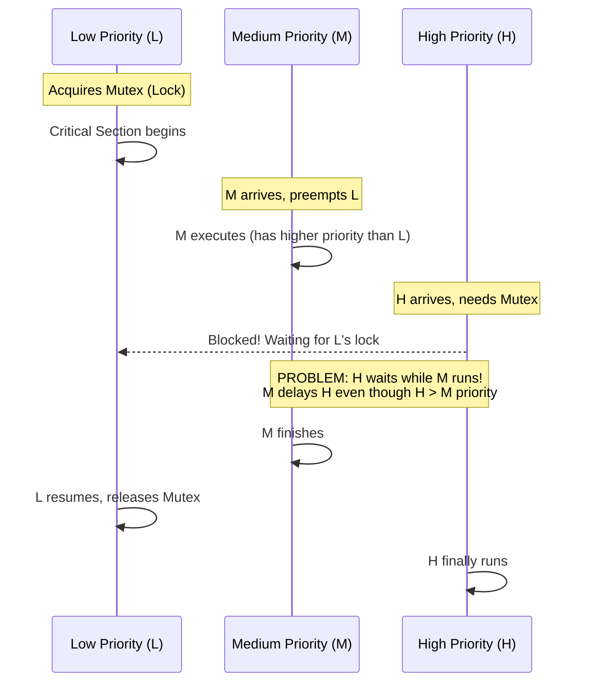
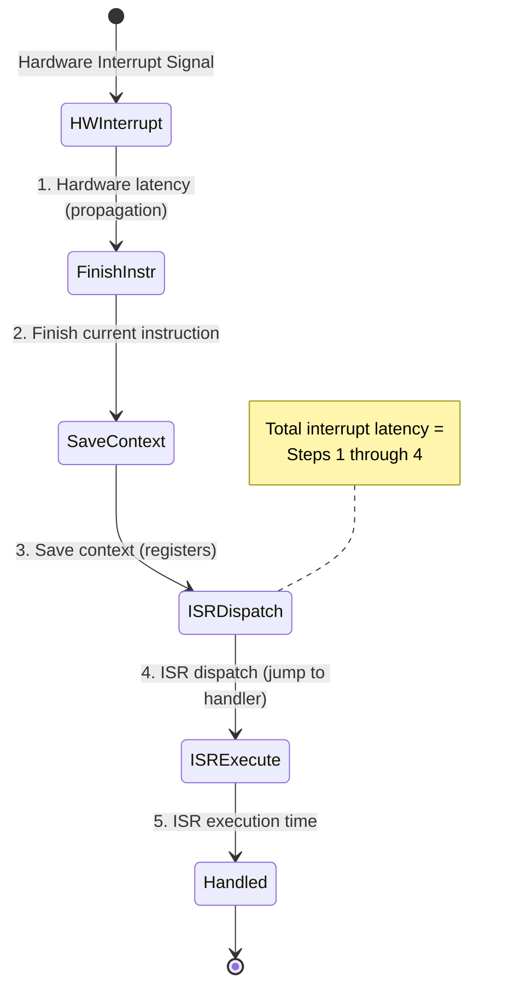

# Real-Time Operating Systems (RTOS)

## What You'll Learn

Socho tum IRCTC ka Tatkal booking system bana rahe ho, ya phir ek car ka airbag control system. Dono jagah "kaam ho gaya" kaafi nahi hai — "kaam **time pe** hua" ye matter karta hai. Yahi soch RTOS (Real-Time Operating System) ke peeche hai. Is note mein hum dekhenge ki RTOS normal OS (Windows/Linux jaisa jo tumhare laptop pe chalta hai) se kaise alag hai, aur kyun ek pacemaker ya airbag ka software "average" performance pe compromise nahi kar sakta.

**Topics covered**:
- Real-Time Operating System kya hota hai
- Hard real-time vs soft real-time systems
- Determinism aur predictability ki requirements
- Real-time scheduling algorithms (RMS, EDF)
- Priority inversion problem aur uske solutions
- Interrupt latency aur jitter
- Popular RTOS platforms
- Real-time constraints aur guarantees

---

## Real-Time Operating System kya hota hai?

**Kya hota hai?** Ek **Real-Time Operating System (RTOS)** ek aisa OS hai jo data aur events ko strict, predictable time constraints ke andar process karta hai. Yaha pe correctness sirf "sahi answer aaya" pe depend nahi karti — **kab** answer aaya, wo bhi utna hi important hai.

Zara samjho difference: agar Zomato ka server tumhara order confirm karne mein 2 second ki jagah 5 second le le, toh irritating hai lekin duniya nahi rukegi. Lekin agar car ka airbag control system decide karne mein 5ms ki jagah 50ms le le ki airbag phulana hai ya nahi — accident ho chuka hoga, decision bekaar hai. Yehi fundamental difference hai general-purpose OS aur RTOS mein.

```
General-Purpose OS:              Real-Time OS:
┌──────────────────┐            ┌──────────────────┐
│  Optimize for:   │            │  Optimize for:   │
│  - Throughput    │            │  - Predictability│
│  - Fairness      │            │  - Determinism   │
│  - Average case  │            │  - Worst case    │
│  - Responsiveness│            │  - Deadlines     │
└──────────────────┘            └──────────────────┘
```

### Key Characteristics

RTOS ki pehchaan in cheezon se hoti hai:

1. **Determinism**: Same input hamesha same time mein output dega — ek dum consistent, jaise ek acchi factory assembly line jisme har part exactly usi time pe ban ke nikalta hai
2. **Predictability**: Worst-case response time pehle se predict kar sakte ho — matlab "sabse bura scenario bhi kitna bura hoga" ye pata hota hai
3. **Time Constraints**: Har task ki deadline hoti hai jo miss nahi honi chahiye
4. **Priority-based**: High-priority task, low-priority task ko preempt (beech mein rok) kar sakta hai
5. **Minimal Jitter**: Timing mein consistency, variation kam se kam
6. **Fast Context Switch**: Task switching bahut tez (microseconds mein)
7. **Preemptive Kernel**: Higher priority tasks kabhi bhi lower priority ko interrupt kar sakte hain

> [!info]
> Node.js developer hone ke naate tumhe ye samajhna easy hoga: event loop mein agar ek callback bahut lamba chal jaye, baaki sab wait karta hai — koi guarantee nahi hoti ki agla event kab process hoga. RTOS is exact opposite karta hai — hard guarantee deta hai ki high priority kaam turant milega.

---

## Hard vs Soft Real-Time Systems

**Kyun zaruri hai ye distinction?** Kyunki har real-time system ek jaisa "strict" nahi hota. Kuch systems mein deadline miss hone se accident hota hai, kuch mein sirf thoda annoying lagta hai. Isliye RTOS world ko do bade categories mein baanta jaata hai.

### Hard Real-Time

Deadline miss hona yaha **system failure** maana jaata hai. Consequences catastrophic ho sakte hain — jaan tak ja sakti hai.

```
Task Execution Timeline (Hard Real-Time):

Task Period: 100ms, Deadline: 100ms

Time:    0ms      100ms     200ms     300ms
         │         │         │         │
Task:    [Execute] [Execute] [Execute] [Execute]
         └─ ✓ OK  └─ ✓ OK   └─ ✗ FAIL! (missed deadline)
                             └─ System failure!
```

**Examples**:
- **Airbag deployment**: 10-20ms ke andar phoolna hi hoga
- **Anti-lock braking (ABS)**: Milliseconds mein respond karna hi hoga
- **Pacemaker**: Impulse exactly time pe deliver hona chahiye
- **Nuclear reactor control**: Deadline miss = meltdown
- **Fly-by-wire avionics**: Plane ke control surfaces ka adjustment

**Characteristics**:
- Deadlines **non-negotiable** hain — jaise IRCTC ka train chhootne ka time, koi excuse nahi chalega
- Worst-case execution time (WCET) guarantee honi chahiye
- Formal verification (mathematical proof) zaruri hoti hai
- Typically embedded systems mein milta hai (chhote, dedicated hardware)

### Soft Real-Time

Deadline miss karne se performance **degrade** hoti hai, lekin system fail nahi hota. Duniya khatam nahi hoti.

```
Task Execution Timeline (Soft Real-Time):

Task Period: 16.67ms (60 FPS), Deadline: 16.67ms

Time:    0ms      16.67ms   33.33ms   50ms
         │         │         │         │
Frame:   [Render]  [Render]  [Render]  [Render]
         └─ ✓ 60fps└─ ✓ 60fps└─ ✗ Lag  └─ ✓ 60fps
                             └─ Dropped frame, not ideal but OK
```

**Examples**:
- **Video streaming**: Netflix pe kabhi kabhi ek frame drop ho jaye, chalega
- **Online gaming**: Ola/PUBG mein lag aana annoying hai, catastrophic nahi
- **Voice over IP**: WhatsApp call mein thoda jitter tolerable hai
- **Live audio processing**: Kabhi kabhi glitch acceptable hai
- **Stock trading**: Order thoda late gaya toh suboptimal hai, fatal nahi

**Characteristics**:
- Deadlines **goals** hain, guarantees nahi
- Best-effort scheduling — jitna best ho sake utna karo
- Statistical guarantees hoti hain (jaise "99.9% requests 100ms ke andar")
- General-purpose real-time se zyada flexible

### Comparison Table

| Feature | Hard Real-Time | Soft Real-Time | General-Purpose |
|---------|----------------|----------------|-----------------|
| **Deadline Miss** | System failure | Performance degradation | Irrelevant |
| **Predictability** | Must guarantee | Best effort | Not guaranteed |
| **WCET** | Must know | Helpful | Don't care |
| **Scheduling** | Strict priority | Mixed | Fair/throughput |
| **Jitter** | Minimal | Low | High |
| **Examples** | Airbag, pacemaker | Video, gaming | Desktop, server |
| **Verification** | Formal methods | Testing | Testing |
| **Cost** | High | Medium | Low |

---

## Determinism aur Predictability

### Determinism

**Kya hota hai?** **Deterministic** system woh hota hai jisme same input diya jaye toh output hamesha same time mein aata hai — bilkul train ke fixed timetable jaisa, agar sab kuch normal hai toh train har din usi time pe aayegi.

```
Non-deterministic (Cache misses vary):
Input A → [Process] → Output (10ms or 50ms or 30ms)

Deterministic (Predictable):
Input A → [Process] → Output (always 25ms ± 1ms)
```

**Determinism ke saamne challenges**:
- **Caches**: Kabhi cache mein data mil jaata hai (fast), kabhi nahi (slow) — timing vary karti hai
- **Interrupts**: Kab aayenge, ye unpredictable hota hai
- **DMA**: Memory bandwidth chura leta hai
- **Branch prediction**: CPU kabhi sahi guess karta hai, kabhi galat — timing variable
- **Virtual memory**: Page faults ho sakte hain, jo achanak slow down kar dete hain

**RTOS ke solutions**:
- Caches disable kar do, ya critical data ko cache mein lock kar do (permanently rakho)
- Interrupt handling ko bounded (fixed max time ke andar) rakho
- Memory access patterns predictable banao
- Virtual memory use hi mat karo (ya phir real-time allocator use karo)

### Predictability

**Kya hota hai?** **Predictable** system woh hai jisme tum worst-case execution time (WCET) calculate kar sakte ho — matlab "sabse zyada time ye task kitna le sakta hai" ye pehle se pata hota hai.

```
Task Analysis:
┌──────────────────────────────────────────┐
│ Task: Process Sensor Data                │
├──────────────────────────────────────────┤
│ Best Case Execution Time (BCET):  5ms    │
│ Average Case Execution Time (ACET): 10ms │
│ Worst Case Execution Time (WCET):  15ms  │
├──────────────────────────────────────────┤
│ For hard real-time, schedule based on    │
│ WCET (15ms), not average (10ms)          │
└──────────────────────────────────────────┘
```

> [!warning]
> Hard real-time systems mein hamesha **WCET** (worst case) pe schedule karte hain, average pe nahi. Agar tum average pe plan karoge, toh jis din bhi worst case scenario hoga (jaise IRCTC ka Tatkal wala traffic spike), system deadline miss kar dega. Real-time engineering mein "average achha hai" koi excuse nahi hai.

---

## Real-Time Scheduling

**Kya hota hai?** Real-time scheduling algorithms decide karte hain ki konsa task pehle chalega taaki sab tasks apni deadline meet kar saken. Ye Swiggy ke dispatcher jaisa hai — usko decide karna hota hai kis order ko pehle delivery boy assign karna hai taaki koi bhi order "cold ho jaye" wale deadline se pehle deliver ho jaye.

### Task Model

Har task ke paas ye properties hoti hain:
- **Period (P)**: Task kitne der baad dobara activate hota hai
- **Execution time (C)**: Task complete hone mein kitna time lagta hai
- **Deadline (D)**: Task ko kab tak complete hona chahiye
- **Priority**: Task kitna important hai (relative)

```
Task T:
│<────── Period (P) ──────>│
│                          │
Start                   Deadline (D)
  │                       │
  │ [Execute C time]      │
  └───────────────────────┘
```

### Rate Monotonic Scheduling (RMS)

**Kya hota hai?** **Rate Monotonic Scheduling** priorities **period** ke basis pe assign karta hai: jitna chhota period, utni high priority.

Socho ek chai stall pe teen kaam hain — chai banana (har 2 min mein), samosa garam karna (har 5 min mein), aur bartan dhona (har 20 min mein). Jo kaam sabse zyada baar-baar karna padta hai (chai), usko sabse zyada priority milegi kyunki wo kaam bar bar "due" hota rehta hai.

**Properties**:
- **Static priority**: Priorities design time pe hi decide ho jaati hain, runtime mein change nahi hoti
- **Preemptive**: Higher priority task, lower priority ko beech mein rok sakta hai
- **Optimal** fixed-priority scheduling ke liye — matlab agar koi fixed-priority algorithm schedule kar sakta hai, RMS bhi kar payega

```
Example: Three tasks
┌──────┬────────┬──────────┬──────────┬──────────┐
│ Task │ Period │ Exec Time│ Deadline │ Priority │
├──────┼────────┼──────────┼──────────┼──────────┤
│  T1  │  50ms  │   10ms   │   50ms   │ Highest  │
│  T2  │ 100ms  │   20ms   │  100ms   │ Medium   │
│  T3  │ 200ms  │   50ms   │  200ms   │ Lowest   │
└──────┴────────┴──────────┴──────────┴──────────┘

Priority: T1 > T2 > T3 (shorter period = higher priority)
```

**Schedulability Test**: Tasks tabhi schedulable hain agar:

```
C1/P1 + C2/P2 + ... + Cn/Pn ≤ n(2^(1/n) - 1)

For 3 tasks: Utilization ≤ 3(2^(1/3) - 1) ≈ 0.78 (78%)
```

Matlab CPU ko 78% se zyada busy nahi rakh sakte agar tumhare paas 3 tasks hain RMS ke saath — kyunki priority mismatch ki wajah se kabhi kabhi lower priority tasks CPU capacity ke hote hue bhi deadline miss kar sakte hain.

**Timeline Example**:

```
Time: 0    10   20   30   40   50   60   70   80   90  100
      │    │    │    │    │    │    │    │    │    │    │
T1:   [T1─]     [T1─]     [T1─]     [T1─]
T2:        [T2──────────]                [T2──────────]
T3:                  [T3──────────────────────────────────...
      
Legend: [Tx] = Task x executing
```

### Earliest Deadline First (EDF)

**Kya hota hai?** **EDF** priority ko dynamically assign karta hai — jis task ki **absolute deadline sabse jaldi** hai, wo pehle chalega.

Ye samjho jaise ek delivery hub pe multiple orders hain aur dispatcher har second dekh raha hai "kaunsa order sabse jaldi late ho jayega" — usi order ko turant bhej dega, chahe wo order abhi arrive hua ho.

**Properties**:
- **Dynamic priority**: Runtime mein change hoti rehti hai
- **Optimal** single processor ke liye — agar koi bhi algorithm tasks ko schedule kar sakta hai, toh EDF bhi kar payega
- 100% CPU utilization tak achieve kar sakta hai (RMS se better)

```
Example: Two tasks arrive
┌──────┬─────────┬───────────┬──────────────────┐
│ Task │ Arrival │ Exec Time │ Absolute Deadline│
├──────┼─────────┼───────────┼──────────────────┤
│  T1  │   0ms   │   30ms    │      60ms        │
│  T2  │   0ms   │   20ms    │      50ms        │
└──────┴─────────┴───────────┴──────────────────┘

At time 0:
  T1 deadline: 60ms
  T2 deadline: 50ms → T2 has earlier deadline, execute first
  
Timeline:
Time: 0              20              50   60
      │              │               │    │
      [─── T2 ───]   [──── T1 ────]
      (deadline 50)  (deadline 60)
```

**Schedulability Test**: Tasks tabhi schedulable hain agar:

```
C1/P1 + C2/P2 + ... + Cn/Pn ≤ 1.0 (100% utilization)
```

### RMS vs EDF Comparison

| Feature | RMS | EDF |
|---------|-----|-----|
| **Priority** | Static (period-based) | Dynamic (deadline-based) |
| **Optimality** | Optimal for fixed-priority | Optimal overall |
| **Utilization** | ~69% (2 tasks) to ~100% (∞ tasks) | 100% |
| **Overhead** | Lower (static) | Higher (dynamic) |
| **Predictability** | More predictable | Less predictable |
| **Implementation** | Simpler | More complex |
| **Missed Deadlines** | Lower priority tasks | Tasks with later deadlines |

> [!tip]
> RMS simple aur predictable hai (embedded systems mein isliye popular hai), EDF zyada CPU nichodta hai (100% utilization tak) lekin dynamically priority calculate karne ka overhead zyada hota hai. Real world mein choice depend karti hai — agar tumhe simplicity aur strict predictability chahiye, RMS jao; agar CPU ka har bit use karna hai aur complexity affordable hai, EDF jao.

---

## Priority Inversion

**Kya hota hai?** **Priority inversion** tab hota hai jab ek high-priority task, ek low-priority task ke waajeh se block ho jaata hai.

Socho aisa scenario — CRED app mein tumhara payment (high priority) process ho raha hai, lekin wo ek lock use kar raha hai jo abhi ek low-priority background sync task (jaise "last login time update karna") ne pakad rakha hai. Ab agar beech mein ek medium-priority task (jaise notification bhejna) aa jaaye aur CPU pe chal jaaye — toh tumhara payment wait karta reh jaata hai jabki uski priority sabse zyada thi! Ye hi hai priority inversion — high priority task, medium priority task ki wajah se delay ho raha hai, jabki technically wo medium priority se upar hai.

### Classic Example



```
Three tasks: H (high), M (medium), L (low)
Shared resource: Mutex

Time: 0    1    2    3    4    5    6    7    8
      │    │    │    │    │    │    │    │    │
L:    [Lock]              [Unlock]
      └─── Critical Section ────┘

M:         [──────── M executes ────────]
           (preempts L)

H:              [Wait...] [Finally run!]
                (blocked by L's lock, but M runs first!)

Problem: H waits for L, but M (medium priority) runs!
         H is delayed by M even though H > M priority.
```

> [!warning]
> Ye problem real world mein bhi hua hai — 1997 mein NASA ka **Mars Pathfinder** rover isi priority inversion bug ki wajah se baar baar reset ho raha tha. High-priority bus management task, ek low-priority meteorological data task ke lock ki wajah se block ho jaata tha, aur beech mein medium-priority communication task chal jaata tha. Solution tha priority inheritance enable karna — jo aage explain kiya hai.

### Priority Inheritance Protocol

**Kya hota hai?** Jab ek low-priority task ek lock pakad ke baitha hai jo high-priority task ko chahiye, toh temporarily low-priority task ki priority **badha do** (high task ke barabar).

```
Time: 0    1    2    3    4    5    6
      │    │    │    │    │    │    │
L:    [Lock: priority → H]  [Unlock: priority → L]
      └─── Critical Section ─┘

M:         (tried to run, but L now has H priority)
                           [Now M can run]

H:              [Wait]      [Run!]
                (L inherits H's priority, finishes quickly)
                
Solution: L inherits H's priority, completes critical section,
          M can't preempt, H unblocked quickly.
```

Matlab jaise ek chota employee (L) accidentally CEO (H) ka zaruri kaam pakad ke baitha hai. Jab tak wo fasा hua kaam khatam nahi karta, HR temporarily usko "CEO ki priority" de deta hai taaki koi middle-manager (M) beech mein aa ke usko distract na kare. Kaam jaldi khatam hota hai, priority wapas normal ho jaati hai, aur CEO (H) ko jaldi unblock kar diya jaata hai.

### Priority Ceiling Protocol

**Kya hota hai?** Har resource ka ek **priority ceiling** hota hai = uss resource ko use karne wale sabse high-priority task ki priority.

- Task tabhi resource lock kar sakta hai jab uski priority sab locked resources ke ceilings se zyada ho
- Isse priority inversion hone se pehle hi rok diya jaata hai (proactive approach, priority inheritance reactive hai)

---

## Interrupt Latency

**Kya hota hai?** **Interrupt latency** wo time hai jo interrupt signal aane se lekar ISR (Interrupt Service Routine) shuru hone tak lagta hai.

Socho tumhare phone pe call aata hai jab tum WhatsApp pe type kar rahe ho. "Interrupt latency" wo time hai jo ring baajne se leke actual call screen aane tak lagta hai — beech mein phone ko current operation (jo tum type kar rahe the usko save) khatam karna padta hai, phir context switch karna padta hai, tab jaake call handler chalta hai.



```
Interrupt Latency Components:

Hardware Interrupt
    │
    │ 1. Hardware latency (propagation)
    ▼
    │ 2. Finish current instruction
    │
    │ 3. Save context (registers)
    ▼
    │ 4. ISR dispatch (jump to handler)
    │
    ▼
ISR starts executing ← Total latency
    │
    │ 5. ISR execution time
    │
    ▼
Interrupt handled
```

**Latency pe asar daalne wale factors**:
1. **Interrupt disabled duration**: Critical sections mein interrupts disable ho jaate hain — jitni der disable rahenge, utni zyada latency
2. **Current instruction**: Jo instruction chal raha hai wo complete hone ke baad hi interrupt handle hoga
3. **Context save time**: CPU registers save karne mein lagta time
4. **Cache state**: Agar ISR ka code cache mein nahi hai toh fetch karna padega (slow)
5. **Other interrupts**: Agar koi aur higher priority interrupt already chal raha hai

**RTOS ke optimizations**:
- Interrupt-disabled sections ko minimum rakho
- Fast context switching implement karo
- Preemptive kernel rakho (interrupts task switch trigger kar sakein)
- Nested interrupt support do (ek interrupt ke andar dusra interrupt bhi handle ho sake)

---

## Jitter

**Kya hota hai?** **Jitter** timing mein variation hai. Kam jitter = consistent timing.

```
Ideal (no jitter):
Task execution: 10ms, 10ms, 10ms, 10ms
                │    │    │    │
                ▼    ▼    ▼    ▼
Time:           10   20   30   40  (perfectly periodic)

With Jitter:
Task execution: 9ms, 11ms, 10.5ms, 9.5ms
                │    │     │      │
                ▼    ▼     ▼      ▼
Time:           9    20    30.5   40  (variable)
                
Jitter = deviation from ideal timing
```

Socho tumhari daily office bus 9:00 AM pe aani chahiye. Agar wo roz 9:00 AM sharp aati hai, zero jitter hai. Agar kabhi 8:58, kabhi 9:05, kabhi 8:55 aati hai — ye jitter hai. Ek audio/video streaming app ke liye jitter bahut bura hota hai kyunki isse buffering, glitches hote hain.

**Jitter ke sources**:
- Interrupt handling
- Cache misses
- DMA transfers
- Doosre tasks ka execution
- OS overhead

**Jitter measure karna**:
```c
// Pseudo-code to measure jitter
uint64_t last_time = get_time();
uint64_t expected_period = 10000; // 10ms in microseconds

while (1) {
    wait_for_next_period();
    uint64_t current_time = get_time();
    uint64_t actual_period = current_time - last_time;
    int64_t jitter = actual_period - expected_period;
    
    printf("Jitter: %lld us\n", jitter);
    last_time = current_time;
}
```

---

## Popular RTOS Platforms

### FreeRTOS

Open-source, embedded systems mein sabse zyada use hota hai — ye woh RTOS hai jisse tum ESP32 ya Arduino pe khud try kar sakte ho.

```c
// FreeRTOS Task Example
void vTaskFunction(void *pvParameters) {
    const TickType_t xDelay = 500 / portTICK_PERIOD_MS; // 500ms
    
    for (;;) {
        // Task code here
        printf("Task executing\n");
        
        // Delay for 500ms
        vTaskDelay(xDelay);
    }
}

int main(void) {
    // Create task
    xTaskCreate(
        vTaskFunction,    // Task function
        "Task1",          // Task name
        1000,             // Stack size
        NULL,             // Parameters
        1,                // Priority
        NULL              // Task handle
    );
    
    // Start scheduler
    vTaskStartScheduler();
    
    return 0;
}
```

**Features**:
- Preemptive aur cooperative dono scheduling support karta hai
- Bahut chota footprint (~4KB) — Node.js apps ke mukaable to kuch bhi nahi hai
- Wide hardware support
- Duniya bhar mein millions devices mein use hota hai (smart bulbs se lekar industrial sensors tak)

### VxWorks

Wind River ka commercial RTOS, aerospace aur defense mein use hota hai.

**Features**:
- Hard real-time capabilities
- POSIX compliant
- Mars rovers aur Boeing 787 mein use hota hai — matlab Mars pe bhi ye chal raha hai!
- Advanced debugging tools

### QNX

Microkernel RTOS, automotive aur medical devices mein use hota hai.

**Architecture**:
```
┌──────────────────────────────────────────┐
│ Applications (userspace)                 │
├──────────────────────────────────────────┤
│ Drivers, Filesystems (userspace servers)│
├──────────────────────────────────────────┤
│ QNX Microkernel (minimal)                │
│ - Message passing                        │
│ - Thread scheduling                      │
│ - Interrupt handling                     │
└──────────────────────────────────────────┘
```

**Features**:
- Microkernel architecture (fault isolation — agar ek driver crash ho, poora system nahi girta)
- POSIX compliant
- BlackBerry aur automotive infotainment mein use hota hai
- Hard real-time certified

### RT-Linux (Preempt-RT)

Linux kernel ke liye ek real-time patch.

**Approach**:
- Linux kernel ko fully preemptive banao
- Spinlocks ko mutexes se replace karo
- Mutexes ke liye priority inheritance add karo
- High-resolution timers use karo

```
Standard Linux:          Preempt-RT Linux:
┌─────────────────┐     ┌─────────────────┐
│  User Space     │     │  User Space     │
├─────────────────┤     ├─────────────────┤
│ Non-preemptive  │     │ Fully           │
│ Kernel          │     │ Preemptive      │
│ (high latency)  │     │ Kernel          │
│                 │     │ (low latency)   │
└─────────────────┘     └─────────────────┘
```

**Benefits**:
- Linux applications ko real-time guarantees ke saath chala sakte ho
- Bada ecosystem milta hai (drivers, tools, libraries) — jo pure embedded RTOS mein nahi milega
- Industrial automation aur automotive mein use hota hai

### RTEMS

Real-Time Executive for Multiprocessor Systems — NASA ka pasandida RTOS.

**Features**:
- Open source
- Multiprocessor support
- Space-qualified (space radiation aur extreme conditions ke liye tested)
- Spacecraft aur satellites mein use hota hai

### Comparison Table

| RTOS | Type | License | Typical Use | Hard RT | Microkernel |
|------|------|---------|-------------|---------|-------------|
| **FreeRTOS** | Embedded | MIT | IoT, MCUs | Yes | No |
| **VxWorks** | Commercial | Proprietary | Aerospace, Defense | Yes | No |
| **QNX** | Commercial | Proprietary | Automotive, Medical | Yes | Yes |
| **RT-Linux** | Patch | GPL | Industrial, Research | Soft | No |
| **RTEMS** | Embedded | BSD | Space, Aviation | Yes | No |
| **Zephyr** | Embedded | Apache | IoT, Wearables | Yes | No |

---

## RTOS vs General-Purpose OS

| Feature | RTOS | General-Purpose OS |
|---------|------|--------------------|
| **Primary Goal** | Meet deadlines | Throughput, fairness |
| **Scheduling** | Priority-based | Fair, time-sharing |
| **Latency** | Bounded, low | Unbounded, variable |
| **Determinism** | High | Low |
| **Jitter** | Minimal | High |
| **Context Switch** | Fast (<1μs) | Slower (~10μs) |
| **Kernel** | Preemptive | Often non-preemptive |
| **Memory** | Static allocation | Dynamic allocation |
| **Footprint** | Small (KB) | Large (GB) |
| **Verification** | Formal methods | Testing |
| **Examples** | FreeRTOS, VxWorks | Windows, Linux |

> [!info]
> Tum jo Windows/Linux/macOS roz use karte ho, wo general-purpose OS hai — usme goal hai "sab logon/apps ko fair share do, overall throughput maximize karo". RTOS ka goal bilkul opposite hai — "koi bhi cheez, chahe worst case mein bhi, apni deadline miss na kare". Isliye general-purpose OS mein dynamic memory allocation (`malloc`) freely use hota hai, lekin hard-RTOS mein static allocation prefer karte hain kyunki dynamic allocation ka time predictable nahi hota.

---

## Real-Time Constraints aur Guarantees

### Timing Constraints

```
Task with timing constraints:
│
│ Release time (r)
│   ↓
│   │ Execution time (C)
│   │   ↓
│   ├───────┤
│   │ Execute│
│   └───────┘
│           ↓
│         Deadline (D)
│         (relative to release)
│
│ If completion > deadline → MISS
```

### Schedulability Analysis

**Goal**: Prove karna ki saare tasks worst-case conditions mein bhi apni deadline meet karenge.

**Methods**:
1. **Utilization-based tests**: (RMS, EDF) — jaise upar dekha
2. **Response time analysis**: Worst-case response time calculate karna
3. **Simulation**: Alag-alag scenarios mein test karna
4. **Formal verification**: Mathematical proofs se guarantee dena

### Worst-Case Execution Time (WCET)

WCET calculate karna challenging hota hai:

```
Code:           WCET Analysis:
for (i=0; i<n; i++) {   ← Loop bound?
    if (condition) {    ← Which path?
        // Path A        ← 10 cycles
    } else {
        // Path B        ← 5 cycles
    }
}

WCET = n × max(Path A, Path B) = n × 10 cycles
       + loop overhead
       + cache miss penalty
       + interrupt interference
```

**WCET tools**:
- **Static analysis**: Code ko chalaye bina hi analyze karna
- **Measurement**: Actually chala ke measure karna (worst case miss ho sakta hai isliye)
- **Hybrid**: Dono approaches ko combine karna

---

## Use Cases

### Automotive

- **Engine control**: Fuel injection, ignition timing (hard RT)
- **ABS/ESC**: Anti-lock braking, stability control (hard RT)
- **ADAS**: Advanced driver assistance (soft RT)
- **Infotainment**: Navigation, audio (soft RT) — jaise car ka music system, thoda lag chalega

### Aerospace

- **Flight control**: Autopilot, fly-by-wire (hard RT)
- **Navigation**: GPS, inertial systems (hard RT)
- **Communication**: Data links, radar (soft RT)

### Medical Devices

- **Pacemaker**: Heart rhythm control (hard RT)
- **Infusion pump**: Drug delivery (hard RT)
- **Monitoring**: ECG, vital signs (soft RT)

### Industrial Automation

- **Robotics**: Motion control (hard RT)
- **PLCs**: Programmable logic controllers (hard RT)
- **SCADA**: Supervisory control (soft RT)

---

## Key Takeaways

1. **RTOS** throughput ke bajaye predictability aur deadlines meet karne ko prioritize karta hai
2. **Hard real-time** systems missed deadline tolerate nahi kar sakte; **soft real-time** kar sakte hain
3. **Determinism** consistent timing ensure karta hai; **predictability** WCET calculate karne ko possible banati hai
4. **Rate Monotonic Scheduling** (RMS) period ke basis pe static priorities use karta hai
5. **Earliest Deadline First** (EDF) dynamic priorities use karta hai, single CPU ke liye optimal hai
6. **Priority inversion** tab hota hai jab low-priority tasks high-priority tasks ko block kar dein
7. **Priority inheritance** inversion ko solve karta hai — low-priority task ki priority temporarily badha ke
8. **Interrupt latency** aur **jitter** ko minimize karna real-time guarantees ke liye zaruri hai
9. **FreeRTOS**, **VxWorks**, **QNX**, **RT-Linux** popular RTOS platforms hain
10. **WCET analysis** schedulability guarantees ke liye crucial hai

---

## Exercises

### Beginner

1. **Compare RT types**: 5-5 examples ka table banao hard aur soft real-time systems ke
2. **Calculate utilization**: Given tasks T1(P=50ms, C=10ms), T2(P=100ms, C=30ms), T3(P=200ms, C=60ms), total utilization calculate karo
3. **RMS priorities**: In tasks ko RMS priorities assign karo: T1(P=20ms), T2(P=50ms), T3(P=100ms), T4(P=30ms)
4. **Identify jitter**: Task execution time 10 baar measure karo aur jitter (max - min) calculate karo
5. **RTOS research**: FreeRTOS aur Zephyr ke features ka table banao compare karke

### Intermediate

1. **Install FreeRTOS**: Arduino ya ESP32 pe FreeRTOS setup karo, alag priorities wale do tasks banao
2. **Schedulability test**: RMS ke under ye tasks schedulable hain ya nahi check karo:
   - T1: P=50ms, C=15ms
   - T2: P=80ms, C=25ms
   - T3: P=110ms, C=30ms
3. **Priority inversion demo**: Code likho jo priority inversion demonstrate kare, phir priority inheritance se fix karo
4. **EDF simulation**: 3 tasks ke liye EDF scheduling ko 1 second ke liye simulate karo, timeline draw karo
5. **Latency measurement**: Ek embedded board pe interrupt latency measure karne ka code likho

### Advanced

1. **WCET analysis**: Ek WCET analysis tool use karke ek code snippet ka worst-case time calculate karo
2. **Build RT system**: FreeRTOS se ek hard real-time system banao jo 3 sensors ko strict deadlines ke saath control kare
3. **RT-Linux setup**: Linux kernel ko Preempt-RT se patch karo, cyclictest se latency measure karo
4. **Schedulability analysis**: Fixed-priority scheduling ke liye response-time analysis implement karo
5. **Priority ceiling**: Priority ceiling protocol implement karo aur priority inheritance se compare karo
6. **Custom scheduler**: C mein ek simple EDF scheduler implement karo
7. **Aerospace simulation**: Multiple real-time tasks ke saath ek flight control system design aur simulate karo

---

## Navigation

- [← Previous: Containers and Isolation](./02_containers.md)
- [Next: Distributed Systems →](./04_distributed_systems.md)
- [Back to README](./README.md)
