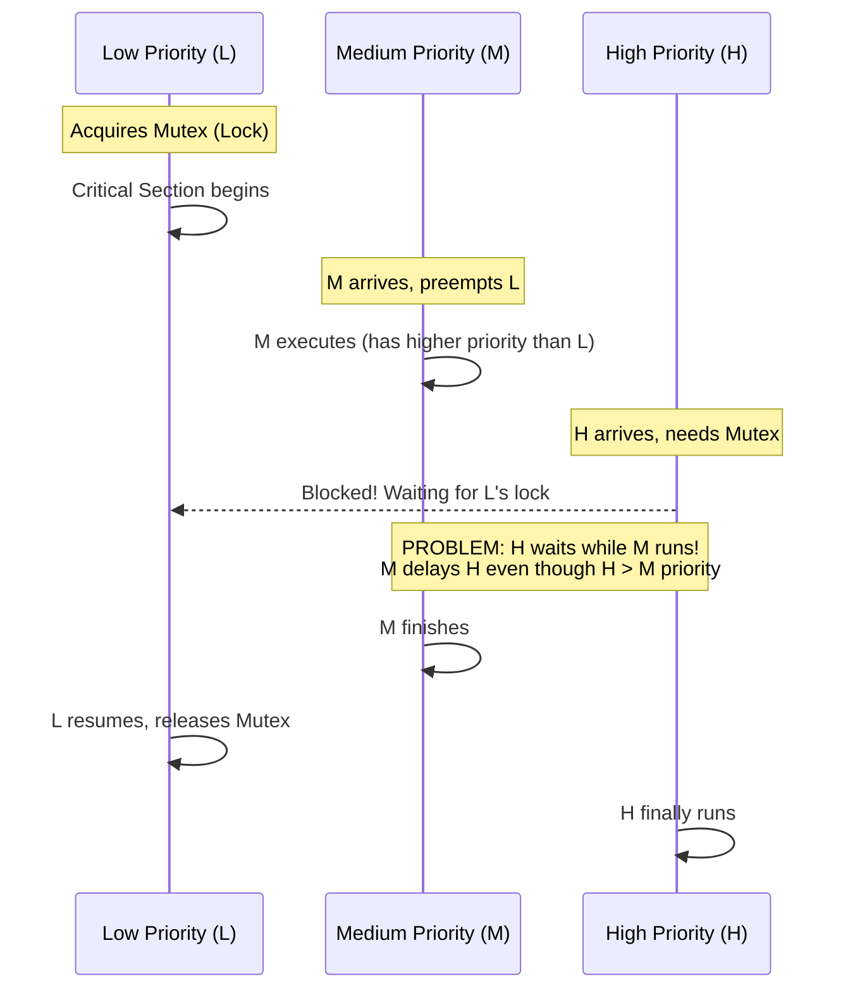
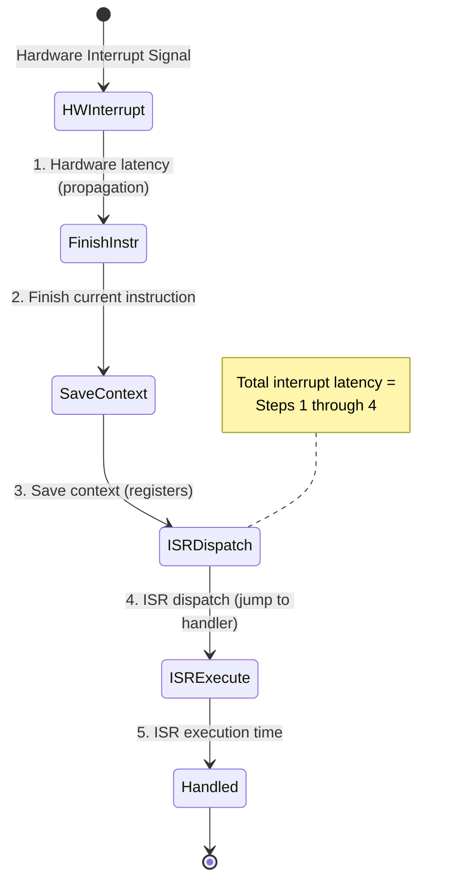

# Real-Time Operating Systems (RTOS)

## What You'll Learn

In this tutorial, you'll explore Real-Time Operating Systems (RTOS), which are designed for applications where timing constraints are critical. You'll understand the difference between hard and soft real-time systems, learn about real-time scheduling algorithms, and discover how RTOS differs from general-purpose operating systems.

**Topics covered**:
- What is a Real-Time Operating System
- Hard real-time vs soft real-time systems
- Determinism and predictability requirements
- Real-time scheduling algorithms (RMS, EDF)
- Priority inversion problem and solutions
- Interrupt latency and jitter
- Popular RTOS platforms
- Real-time constraints and guarantees

---

## What is a Real-Time Operating System?

A **Real-Time Operating System (RTOS)** is an operating system designed to process data and events within strict, predictable time constraints. The correctness of the system depends not only on the logical result but also on the **time** at which the result is produced.

```
General-Purpose OS:              Real-Time OS:
┌──────────────────┐            ┌──────────────────┐
│  Optimize for:   │            │  Optimize for:   │
│  - Throughput    │            │  - Predictability│
│  - Fairness      │            │  - Determinism   │
│  - Average case  │            │  - Worst case    │
│  - Responsiveness│            │  - Deadlines     │
└──────────────────┘            └──────────────────┘
```

### Key Characteristics

1. **Determinism**: Same input always produces output in same time
2. **Predictability**: Can predict worst-case response time
3. **Time Constraints**: Tasks have deadlines that must be met
4. **Priority-based**: High-priority tasks preempt low-priority ones
5. **Minimal Jitter**: Consistent timing, low variability
6. **Fast Context Switch**: Rapid task switching
7. **Preemptive Kernel**: Higher priority tasks can interrupt lower ones

---

## Hard vs Soft Real-Time Systems

### Hard Real-Time

Missing a deadline is considered a **system failure**. Consequences can be catastrophic.

```
Task Execution Timeline (Hard Real-Time):

Task Period: 100ms, Deadline: 100ms

Time:    0ms      100ms     200ms     300ms
         │         │         │         │
Task:    [Execute] [Execute] [Execute] [Execute]
         └─ ✓ OK  └─ ✓ OK   └─ ✗ FAIL! (missed deadline)
                             └─ System failure!
```

**Examples**:
- **Airbag deployment**: Must inflate within 10-20ms
- **Anti-lock braking (ABS)**: Must respond within milliseconds
- **Pacemaker**: Must deliver impulse precisely on time
- **Nuclear reactor control**: Missing deadline = meltdown
- **Fly-by-wire avionics**: Control surface adjustments

**Characteristics**:
- Deadlines are **non-negotiable**
- Worst-case execution time (WCET) must be guaranteed
- Formal verification often required
- Typically embedded systems

### Soft Real-Time

Missing a deadline **degrades performance** but doesn't cause system failure.

```
Task Execution Timeline (Soft Real-Time):

Task Period: 16.67ms (60 FPS), Deadline: 16.67ms

Time:    0ms      16.67ms   33.33ms   50ms
         │         │         │         │
Frame:   [Render]  [Render]  [Render]  [Render]
         └─ ✓ 60fps└─ ✓ 60fps└─ ✗ Lag  └─ ✓ 60fps
                             └─ Dropped frame, not ideal but OK
```

**Examples**:
- **Video streaming**: Occasional dropped frame is acceptable
- **Online gaming**: Lag is annoying but not catastrophic
- **Voice over IP**: Some jitter is tolerable
- **Live audio processing**: Occasional glitch acceptable
- **Stock trading**: Delayed order is suboptimal but not fatal

**Characteristics**:
- Deadlines are **goals**, not guarantees
- Best-effort scheduling
- Statistical guarantees (e.g., 99.9% meet deadline)
- More flexible than hard real-time

### Comparison Table

| Feature | Hard Real-Time | Soft Real-Time | General-Purpose |
|---------|----------------|----------------|-----------------|
| **Deadline Miss** | System failure | Performance degradation | Irrelevant |
| **Predictability** | Must guarantee | Best effort | Not guaranteed |
| **WCET** | Must know | Helpful | Don't care |
| **Scheduling** | Strict priority | Mixed | Fair/throughput |
| **Jitter** | Minimal | Low | High |
| **Examples** | Airbag, pacemaker | Video, gaming | Desktop, server |
| **Verification** | Formal methods | Testing | Testing |
| **Cost** | High | Medium | Low |

---

## Determinism and Predictability

### Determinism

**Deterministic** system: Given the same input, produces output in the same time.

```
Non-deterministic (Cache misses vary):
Input A → [Process] → Output (10ms or 50ms or 30ms)

Deterministic (Predictable):
Input A → [Process] → Output (always 25ms ± 1ms)
```

**Challenges to determinism**:
- **Caches**: Hit/miss timing varies
- **Interrupts**: Unpredictable arrival
- **DMA**: Steals memory bandwidth
- **Branch prediction**: Variable timing
- **Virtual memory**: Page faults

**RTOS solutions**:
- Disable caches or lock critical data in cache
- Bounded interrupt handling
- Predictable memory access patterns
- No virtual memory (or real-time allocator)

### Predictability

**Predictable** system: Can calculate worst-case execution time (WCET).

```
Task Analysis:
┌──────────────────────────────────────────┐
│ Task: Process Sensor Data                │
├──────────────────────────────────────────┤
│ Best Case Execution Time (BCET):  5ms    │
│ Average Case Execution Time (ACET): 10ms │
│ Worst Case Execution Time (WCET):  15ms  │
├──────────────────────────────────────────┤
│ For hard real-time, schedule based on    │
│ WCET (15ms), not average (10ms)          │
└──────────────────────────────────────────┘
```

---

## Real-Time Scheduling

Real-time scheduling algorithms ensure tasks meet their deadlines.

### Task Model

Each task has:
- **Period (P)**: Time between task activations
- **Execution time (C)**: Time required to complete
- **Deadline (D)**: Time by which task must complete
- **Priority**: Relative importance

```
Task T:
│<────── Period (P) ──────>│
│                          │
Start                   Deadline (D)
  │                       │
  │ [Execute C time]      │
  └───────────────────────┘
```

### Rate Monotonic Scheduling (RMS)

**Rate Monotonic Scheduling** assigns priorities based on **period**: shorter period = higher priority.

**Properties**:
- **Static priority**: Priorities assigned at design time
- **Preemptive**: Higher priority tasks interrupt lower ones
- **Optimal** for fixed-priority scheduling

```
Example: Three tasks
┌──────┬────────┬──────────┬──────────┬──────────┐
│ Task │ Period │ Exec Time│ Deadline │ Priority │
├──────┼────────┼──────────┼──────────┼──────────┤
│  T1  │  50ms  │   10ms   │   50ms   │ Highest  │
│  T2  │ 100ms  │   20ms   │  100ms   │ Medium   │
│  T3  │ 200ms  │   50ms   │  200ms   │ Lowest   │
└──────┴────────┴──────────┴──────────┴──────────┘

Priority: T1 > T2 > T3 (shorter period = higher priority)
```

**Schedulability Test**: Tasks are schedulable if:

```
C1/P1 + C2/P2 + ... + Cn/Pn ≤ n(2^(1/n) - 1)

For 3 tasks: Utilization ≤ 3(2^(1/3) - 1) ≈ 0.78 (78%)
```

**Timeline Example**:

```
Time: 0    10   20   30   40   50   60   70   80   90  100
      │    │    │    │    │    │    │    │    │    │    │
T1:   [T1─]     [T1─]     [T1─]     [T1─]
T2:        [T2──────────]                [T2──────────]
T3:                  [T3──────────────────────────────────...
      
Legend: [Tx] = Task x executing
```

### Earliest Deadline First (EDF)

**EDF** assigns priority dynamically to the task with the **earliest absolute deadline**.

**Properties**:
- **Dynamic priority**: Changes at runtime
- **Optimal** for single processor (if any algorithm can schedule, EDF can)
- Can achieve 100% CPU utilization

```
Example: Two tasks arrive
┌──────┬─────────┬───────────┬──────────────────┐
│ Task │ Arrival │ Exec Time │ Absolute Deadline│
├──────┼─────────┼───────────┼──────────────────┤
│  T1  │   0ms   │   30ms    │      60ms        │
│  T2  │   0ms   │   20ms    │      50ms        │
└──────┴─────────┴───────────┴──────────────────┘

At time 0:
  T1 deadline: 60ms
  T2 deadline: 50ms → T2 has earlier deadline, execute first
  
Timeline:
Time: 0              20              50   60
      │              │               │    │
      [─── T2 ───]   [──── T1 ────]
      (deadline 50)  (deadline 60)
```

**Schedulability Test**: Tasks are schedulable if:

```
C1/P1 + C2/P2 + ... + Cn/Pn ≤ 1.0 (100% utilization)
```

### RMS vs EDF Comparison

| Feature | RMS | EDF |
|---------|-----|-----|
| **Priority** | Static (period-based) | Dynamic (deadline-based) |
| **Optimality** | Optimal for fixed-priority | Optimal overall |
| **Utilization** | ~69% (2 tasks) to ~100% (∞ tasks) | 100% |
| **Overhead** | Lower (static) | Higher (dynamic) |
| **Predictability** | More predictable | Less predictable |
| **Implementation** | Simpler | More complex |
| **Missed Deadlines** | Lower priority tasks | Tasks with later deadlines |

---

## Priority Inversion

**Priority inversion** occurs when a high-priority task is blocked by a low-priority task.

### Classic Example



```
Three tasks: H (high), M (medium), L (low)
Shared resource: Mutex

Time: 0    1    2    3    4    5    6    7    8
      │    │    │    │    │    │    │    │    │
L:    [Lock]              [Unlock]
      └─── Critical Section ────┘

M:         [──────── M executes ────────]
           (preempts L)

H:              [Wait...] [Finally run!]
                (blocked by L's lock, but M runs first!)

Problem: H waits for L, but M (medium priority) runs!
         H is delayed by M even though H > M priority.
```

### Priority Inheritance Protocol

When a low-priority task holds a lock needed by a high-priority task, temporarily **raise** the low-priority task's priority.

```
Time: 0    1    2    3    4    5    6
      │    │    │    │    │    │    │
L:    [Lock: priority → H]  [Unlock: priority → L]
      └─── Critical Section ─┘

M:         (tried to run, but L now has H priority)
                           [Now M can run]

H:              [Wait]      [Run!]
                (L inherits H's priority, finishes quickly)
                
Solution: L inherits H's priority, completes critical section,
          M can't preempt, H unblocked quickly.
```

### Priority Ceiling Protocol

Each resource has a **priority ceiling** = highest priority of any task that uses it.

- Task can only lock resource if its priority > all locked resources' ceilings
- Prevents priority inversion by blocking before it occurs

---

## Interrupt Latency

**Interrupt latency** is the time from interrupt signal to start of ISR (Interrupt Service Routine).



```
Interrupt Latency Components:

Hardware Interrupt
    │
    │ 1. Hardware latency (propagation)
    ▼
    │ 2. Finish current instruction
    │
    │ 3. Save context (registers)
    ▼
    │ 4. ISR dispatch (jump to handler)
    │
    ▼
ISR starts executing ← Total latency
    │
    │ 5. ISR execution time
    │
    ▼
Interrupt handled
```

**Factors affecting latency**:
1. **Interrupt disabled duration**: Critical sections disable interrupts
2. **Current instruction**: Must complete before handling interrupt
3. **Context save time**: Save CPU registers
4. **Cache state**: ISR code may not be cached
5. **Other interrupts**: Higher priority interrupts

**RTOS optimizations**:
- Minimize interrupt-disabled sections
- Fast context switching
- Preemptive kernel (interrupts can trigger task switch)
- Nested interrupt support

---

## Jitter

**Jitter** is the variation in timing. Low jitter = consistent timing.

```
Ideal (no jitter):
Task execution: 10ms, 10ms, 10ms, 10ms
                │    │    │    │
                ▼    ▼    ▼    ▼
Time:           10   20   30   40  (perfectly periodic)

With Jitter:
Task execution: 9ms, 11ms, 10.5ms, 9.5ms
                │    │     │      │
                ▼    ▼     ▼      ▼
Time:           9    20    30.5   40  (variable)
                
Jitter = deviation from ideal timing
```

**Sources of jitter**:
- Interrupt handling
- Cache misses
- DMA transfers
- Other task execution
- OS overhead

**Measuring jitter**:
```c
// Pseudo-code to measure jitter
uint64_t last_time = get_time();
uint64_t expected_period = 10000; // 10ms in microseconds

while (1) {
    wait_for_next_period();
    uint64_t current_time = get_time();
    uint64_t actual_period = current_time - last_time;
    int64_t jitter = actual_period - expected_period;
    
    printf("Jitter: %lld us\n", jitter);
    last_time = current_time;
}
```

---

## Popular RTOS Platforms

### FreeRTOS

Open-source, widely used in embedded systems.

```c
// FreeRTOS Task Example
void vTaskFunction(void *pvParameters) {
    const TickType_t xDelay = 500 / portTICK_PERIOD_MS; // 500ms
    
    for (;;) {
        // Task code here
        printf("Task executing\n");
        
        // Delay for 500ms
        vTaskDelay(xDelay);
    }
}

int main(void) {
    // Create task
    xTaskCreate(
        vTaskFunction,    // Task function
        "Task1",          // Task name
        1000,             // Stack size
        NULL,             // Parameters
        1,                // Priority
        NULL              // Task handle
    );
    
    // Start scheduler
    vTaskStartScheduler();
    
    return 0;
}
```

**Features**:
- Preemptive and cooperative scheduling
- Small footprint (~4KB)
- Wide hardware support
- Used in millions of devices

### VxWorks

Commercial RTOS by Wind River, used in aerospace and defense.

**Features**:
- Hard real-time capabilities
- POSIX compliant
- Used in Mars rovers, Boeing 787
- Advanced debugging tools

### QNX

Microkernel RTOS, used in automotive and medical devices.

**Architecture**:
```
┌──────────────────────────────────────────┐
│ Applications (userspace)                 │
├──────────────────────────────────────────┤
│ Drivers, Filesystems (userspace servers)│
├──────────────────────────────────────────┤
│ QNX Microkernel (minimal)                │
│ - Message passing                        │
│ - Thread scheduling                      │
│ - Interrupt handling                     │
└──────────────────────────────────────────┘
```

**Features**:
- Microkernel architecture (fault isolation)
- POSIX compliant
- Used in BlackBerry, automotive infotainment
- Hard real-time certified

### RT-Linux (Preempt-RT)

Real-time patch for the Linux kernel.

**Approach**:
- Make Linux kernel fully preemptive
- Replace spinlocks with mutexes
- Priority inheritance for mutexes
- High-resolution timers

```
Standard Linux:          Preempt-RT Linux:
┌─────────────────┐     ┌─────────────────┐
│  User Space     │     │  User Space     │
├─────────────────┤     ├─────────────────┤
│ Non-preemptive  │     │ Fully           │
│ Kernel          │     │ Preemptive      │
│ (high latency)  │     │ Kernel          │
│                 │     │ (low latency)   │
└─────────────────┘     └─────────────────┘
```

**Benefits**:
- Run Linux applications with real-time guarantees
- Large ecosystem (drivers, tools, libraries)
- Used in industrial automation, automotive

### RTEMS

Real-Time Executive for Multiprocessor Systems, NASA's choice.

**Features**:
- Open source
- Multiprocessor support
- Space-qualified
- Used in spacecraft, satellites

### Comparison Table

| RTOS | Type | License | Typical Use | Hard RT | Microkernel |
|------|------|---------|-------------|---------|-------------|
| **FreeRTOS** | Embedded | MIT | IoT, MCUs | Yes | No |
| **VxWorks** | Commercial | Proprietary | Aerospace, Defense | Yes | No |
| **QNX** | Commercial | Proprietary | Automotive, Medical | Yes | Yes |
| **RT-Linux** | Patch | GPL | Industrial, Research | Soft | No |
| **RTEMS** | Embedded | BSD | Space, Aviation | Yes | No |
| **Zephyr** | Embedded | Apache | IoT, Wearables | Yes | No |

---

## RTOS vs General-Purpose OS

| Feature | RTOS | General-Purpose OS |
|---------|------|--------------------|
| **Primary Goal** | Meet deadlines | Throughput, fairness |
| **Scheduling** | Priority-based | Fair, time-sharing |
| **Latency** | Bounded, low | Unbounded, variable |
| **Determinism** | High | Low |
| **Jitter** | Minimal | High |
| **Context Switch** | Fast (<1μs) | Slower (~10μs) |
| **Kernel** | Preemptive | Often non-preemptive |
| **Memory** | Static allocation | Dynamic allocation |
| **Footprint** | Small (KB) | Large (GB) |
| **Verification** | Formal methods | Testing |
| **Examples** | FreeRTOS, VxWorks | Windows, Linux |

---

## Real-Time Constraints and Guarantees

### Timing Constraints

```
Task with timing constraints:
│
│ Release time (r)
│   ↓
│   │ Execution time (C)
│   │   ↓
│   ├───────┤
│   │ Execute│
│   └───────┘
│           ↓
│         Deadline (D)
│         (relative to release)
│
│ If completion > deadline → MISS
```

### Schedulability Analysis

**Goal**: Prove that all tasks will meet deadlines under worst-case conditions.

**Methods**:
1. **Utilization-based tests**: (RMS, EDF)
2. **Response time analysis**: Calculate worst-case response time
3. **Simulation**: Test under various scenarios
4. **Formal verification**: Mathematical proofs

### Worst-Case Execution Time (WCET)

Calculating WCET is challenging:

```
Code:           WCET Analysis:
for (i=0; i<n; i++) {   ← Loop bound?
    if (condition) {    ← Which path?
        // Path A        ← 10 cycles
    } else {
        // Path B        ← 5 cycles
    }
}

WCET = n × max(Path A, Path B) = n × 10 cycles
       + loop overhead
       + cache miss penalty
       + interrupt interference
```

**WCET tools**:
- **Static analysis**: Analyze code without execution
- **Measurement**: Run and measure (may miss worst case)
- **Hybrid**: Combine both approaches

---

## Use Cases

### Automotive

- **Engine control**: Fuel injection, ignition timing (hard RT)
- **ABS/ESC**: Anti-lock braking, stability control (hard RT)
- **ADAS**: Advanced driver assistance (soft RT)
- **Infotainment**: Navigation, audio (soft RT)

### Aerospace

- **Flight control**: Autopilot, fly-by-wire (hard RT)
- **Navigation**: GPS, inertial systems (hard RT)
- **Communication**: Data links, radar (soft RT)

### Medical Devices

- **Pacemaker**: Heart rhythm control (hard RT)
- **Infusion pump**: Drug delivery (hard RT)
- **Monitoring**: ECG, vital signs (soft RT)

### Industrial Automation

- **Robotics**: Motion control (hard RT)
- **PLCs**: Programmable logic controllers (hard RT)
- **SCADA**: Supervisory control (soft RT)

---

## Key Takeaways

1. **RTOS** prioritizes predictability and meeting deadlines over throughput
2. **Hard real-time** systems cannot tolerate missed deadlines; **soft real-time** can
3. **Determinism** ensures consistent timing; **predictability** enables WCET calculation
4. **Rate Monotonic Scheduling** (RMS) uses static priorities based on period
5. **Earliest Deadline First** (EDF) uses dynamic priorities, optimal for single CPU
6. **Priority inversion** occurs when low-priority tasks block high-priority ones
7. **Priority inheritance** solves inversion by elevating low-priority task's priority
8. **Interrupt latency** and **jitter** must be minimized for real-time guarantees
9. **FreeRTOS**, **VxWorks**, **QNX**, **RT-Linux** are popular RTOS platforms
10. **WCET analysis** is crucial for schedulability guarantees

---

## Exercises

### Beginner

1. **Compare RT types**: Create a table with 5 examples each of hard and soft real-time systems
2. **Calculate utilization**: Given tasks T1(P=50ms, C=10ms), T2(P=100ms, C=30ms), T3(P=200ms, C=60ms), calculate total utilization
3. **RMS priorities**: Assign RMS priorities to tasks: T1(P=20ms), T2(P=50ms), T3(P=100ms), T4(P=30ms)
4. **Identify jitter**: Measure task execution time 10 times and calculate jitter (max - min)
5. **RTOS research**: Compare FreeRTOS and Zephyr features in a table

### Intermediate

1. **Install FreeRTOS**: Set up FreeRTOS on Arduino or ESP32, create two tasks with different priorities
2. **Schedulability test**: Check if tasks are schedulable under RMS:
   - T1: P=50ms, C=15ms
   - T2: P=80ms, C=25ms
   - T3: P=110ms, C=30ms
3. **Priority inversion demo**: Write code demonstrating priority inversion, then fix with priority inheritance
4. **EDF simulation**: Simulate EDF scheduling for 3 tasks over 1 second, draw timeline
5. **Latency measurement**: Write code to measure interrupt latency on an embedded board

### Advanced

1. **WCET analysis**: Use a WCET analysis tool to calculate worst-case time for a code snippet
2. **Build RT system**: Create a hard real-time system with FreeRTOS controlling 3 sensors with strict deadlines
3. **RT-Linux setup**: Patch Linux kernel with Preempt-RT, measure latency with cyclictest
4. **Schedulability analysis**: Implement response-time analysis for fixed-priority scheduling
5. **Priority ceiling**: Implement priority ceiling protocol and compare with priority inheritance
6. **Custom scheduler**: Implement a simple EDF scheduler in C
7. **Aerospace simulation**: Design and simulate a flight control system with multiple real-time tasks

---

## Navigation

- [← Previous: Containers and Isolation](./02_containers.md)
- [Next: Distributed Systems →](./04_distributed_systems.md)
- [Back to README](./README.md)
