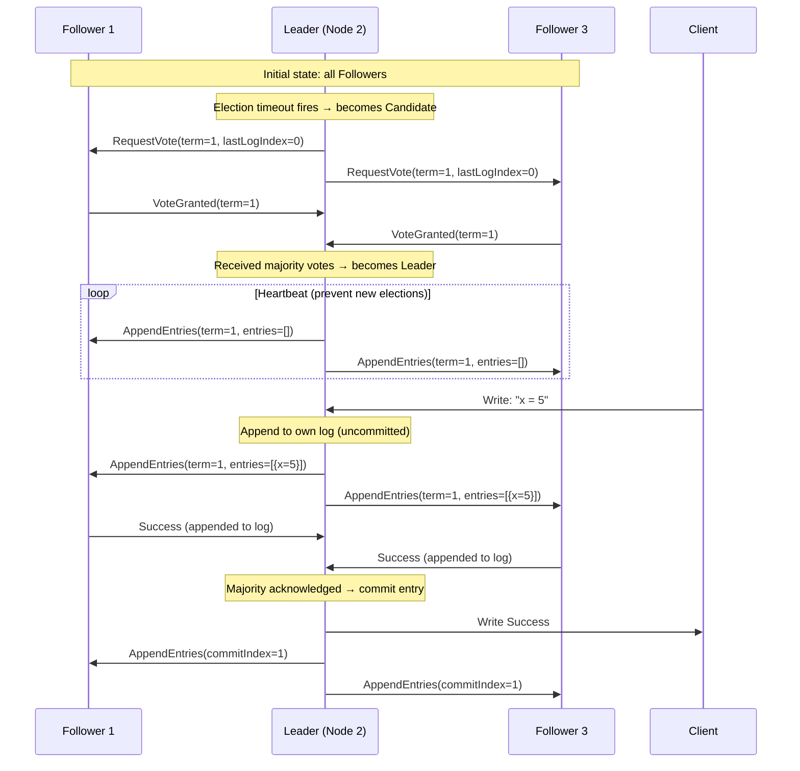

# Distributed Systems

## What You'll Learn

In this tutorial, you'll understand the core challenges and algorithms of distributed systems:

- Why distributed systems are hard: CAP theorem and network partitions
- Clock synchronization: NTP, Lamport logical clocks, vector clocks
- Consensus algorithms: Paxos overview and Raft in depth
- Distributed file systems: NFS and HDFS architecture
- MapReduce paradigm
- RPC and gRPC communication

**Time Required**: 55-65 minutes

---

## 1. What Makes Distributed Systems Hard

A distributed system is a collection of independent computers that appears to users as a single coherent system. The fundamental problem: **failures are partial** — some nodes work, some don't, and you can't always tell the difference.

```
Distributed System Challenges
===============================

1. Partial failures:
   Node A thinks Node B is down (network partition)
   Node B is actually running fine
   → Who is right? What should happen?

2. No global clock:
   Node A records event at 10:00:00.000
   Node B records event at 10:00:00.001
   → Did A happen before B? Clocks drift!

3. Asynchronous communication:
   Message sent at time T might arrive at T+1ms or T+10 minutes
   → Cannot timeout and know if node is dead or just slow

4. Consistency vs Availability tradeoff (CAP):
   Under partition, choose: serve stale data OR refuse to serve

8 Fallacies of Distributed Computing (Peter Deutsch):
  1. The network is reliable
  2. Latency is zero
  3. Bandwidth is infinite
  4. The network is secure
  5. Topology doesn't change
  6. There is one administrator
  7. Transport cost is zero
  8. The network is homogeneous
```

### CAP Theorem

Brewer's CAP theorem: a distributed system can provide at most **2 of 3** guarantees:

```
CAP Theorem
============

Consistency (C):
  Every read receives the most recent write (or an error).
  All nodes see the same data at the same time.

Availability (A):
  Every request receives a (non-error) response.
  System is always responsive (may return stale data).

Partition Tolerance (P):
  System continues operating despite dropped/delayed messages
  between nodes (network partition).

Since network partitions WILL happen, you must choose:
  CP: Consistent + Partition Tolerant (sacrifice availability)
      → During partition: refuse requests rather than serve stale data
      → Examples: HBase, Zookeeper, etcd, Consul

  AP: Available + Partition Tolerant (sacrifice consistency)
      → During partition: serve possibly stale data
      → Examples: DynamoDB (eventually consistent), Cassandra, CouchDB

  CA: Consistent + Available (sacrifice partition tolerance)
      → Only achievable on a single machine (no distribution)
      → Traditional RDBMS on single server

Nuance — PACELC model extends CAP:
  Even when no partition (E=else):
    latency vs consistency tradeoff exists
  Full: PAC + ELC (Partition → A vs C; Else → Latency vs Consistency)
```

---

## 2. Clock Synchronization

### NTP: Network Time Protocol

```
NTP Clock Synchronization
==========================

NTP hierarchy (strata):
  Stratum 0: atomic clocks, GPS receivers (not on network)
  Stratum 1: servers directly connected to Stratum 0 (±microseconds)
  Stratum 2: servers synced to Stratum 1 (±milliseconds)
  Stratum 3+: servers synced to level above

NTP offset calculation:
  Client sends request at T1
  Server receives at T2
  Server sends reply at T3
  Client receives at T4

  Round-trip delay = (T4 - T1) - (T3 - T2)
  Offset = ((T2 - T1) + (T3 - T4)) / 2

  Client adjusts local clock by the offset
  (slews gradually — avoids jumping backward)
```

```bash
# Check NTP sync status
timedatectl status
# System clock synchronized: yes
# NTP service: active
# RTC in local TZ: no

# Check NTP sources and offsets
chronyc sources -v
# MS Name/IP address         Stratum Poll Reach LastRx Last sample
# ===============================================================================
# ^* time.google.com               1   6   377    32   +0.5ms ±0.2ms

chronyc tracking
# Reference ID    : A29F2F01 (162.159.47.1)
# Stratum         : 2
# System time     : 0.000001234 seconds fast of NTP time
# RMS offset      : 0.000234567 seconds
# Frequency       : 1.234 ppm slow

# NTP accuracy is typically 1-50ms over Internet
# Within a datacenter: ~100 microseconds with PTP (Precision Time Protocol)
# Google Spanner uses GPS + atomic clocks: ~7ms worst-case global uncertainty
```

### Lamport Logical Clocks

When physical clocks cannot be trusted, logical clocks establish event ordering:

```
Lamport Clock Algorithm
========================

Rule 1: Increment counter before each event
  counter++
  event happens at counter value

Rule 2: On message send, attach counter
  msg.timestamp = counter

Rule 3: On message receive, update counter
  counter = max(local_counter, msg.timestamp) + 1

Example:
  Node A:  counter=1 (event a1)
           counter=2 (send message to B with timestamp=2)
           counter=3 (event a2)
           counter=4 (receive message from B with timestamp=5)
           counter=max(4,5)+1=6 (event a3)

  Node B:  counter=1 (event b1)
           counter=2 (receive message from A with timestamp=2)
           counter=max(2,2)+1=3 (event b2)
           counter=4 (event b3)
           counter=5 (send message to A with timestamp=5)

Result: Lamport timestamps give a total order consistent with causality.
  If a → b (a happened before b), then L(a) < L(b)
  BUT L(a) < L(b) does NOT imply a → b (concurrent events also ordered)
```

### Vector Clocks

Vector clocks capture causality more precisely — they can detect **concurrent events**:

```
Vector Clock Algorithm
=======================

Each node maintains a vector V[n] where n = number of nodes.
Node i increments V[i] on each event and send.
On receive: V[j] = max(V[j], msg.V[j]) for all j, then V[i]++

Example with 3 nodes A, B, C:

Node A: [1,0,0] → event a1
        [2,0,0] → send to B
Node B: [0,1,0] → event b1
        [2,2,0] → receive from A (max each component, increment own)
        [2,3,0] → send to C
Node C: [0,0,1] → event c1
        [2,3,2] → receive from B
        [2,3,3] → event c2

Comparing clocks:
  V1 < V2 if V1[i] ≤ V2[i] for all i (V1 causally precedes V2)
  V1 ∥ V2 if neither V1 < V2 nor V2 < V1 (concurrent — no causal relationship)

Use cases: DynamoDB (detect conflicting writes), Riak, Git (merge conflicts)
```

---

## 3. Consensus Algorithms

Consensus: getting a group of nodes to agree on a single value, despite failures.

### Paxos Overview

```
Paxos in Brief (Single-Decree Paxos)
======================================

Roles:
  Proposer: suggests a value
  Acceptor: votes on proposals (usually 2f+1 nodes to tolerate f failures)
  Learner: learns the agreed value

Phase 1 — Prepare:
  Proposer sends PREPARE(n) with unique proposal number n
  Acceptor responds PROMISE(n, accepted_value) if n > any seen so far
    → also promises not to accept proposals numbered < n

Phase 2 — Accept:
  If proposer receives promise from majority (quorum):
    Sends ACCEPT(n, value)
    (uses highest-numbered previously accepted value if any)
  Acceptor accepts if n ≥ highest promised

Phase 3 — Decide:
  When majority accepts, value is chosen
  Learners are notified

Why Paxos is hard:
  - "Paxos is simple" but Multi-Paxos (for log) is complex
  - Leader election, log compaction, membership changes all require
    careful protocol extensions
  - Hard to implement correctly → Raft was designed as a simpler alternative
```

### Raft: Leader Election and Log Replication



### Raft Algorithm Details

```
Raft Consensus
===============

Node States:
  Follower  → default state, receives AppendEntries from leader
  Candidate → starts election when follower timeout fires
  Leader    → sends heartbeats, accepts client writes

Terms:
  Logical clock unit. Each election starts a new term.
  Nodes with old term update and become followers.

Election:
  1. Follower hasn't heard from leader → becomes Candidate
  2. Increments term, votes for itself, sends RequestVote to all
  3. If receives majority votes → becomes Leader
  4. If another leader found (higher term) → revert to Follower
  5. If election times out → start new election with new term

Log Replication:
  1. Client sends write to Leader
  2. Leader appends to its log (uncommitted)
  3. Leader sends AppendEntries to all Followers
  4. When majority acknowledge → Leader commits entry
  5. Leader notifies Followers to commit in next AppendEntries

Safety guarantee: Committed entries are never lost.
  A new leader must have all committed entries in its log.
  (Ensured by vote restriction: won't vote for candidate with stale log)

Implementations: etcd, Consul, CockroachDB, TiKV, RethinkDB
```

---

## 4. Distributed File Systems

### NFS: Network File System

```
NFS Architecture
=================

Client                          Server
┌──────────────────────┐        ┌──────────────────────┐
│  User process        │        │  NFS Server daemon   │
│  open("/nfs/file")   │        │  (nfsd)              │
│         │            │        │         │            │
│  VFS Layer           │        │  VFS Layer           │
│         │            │        │         │            │
│  NFS Client          │◄──────▶│  NFS Server          │
│  (kernel module)     │  RPC   │  (kernel module)     │
│         │            │        │         │            │
│  [mount: server:/data│        │  Local Filesystem    │
│   on /mnt/data]      │        │  (ext4, xfs, ...)    │
└──────────────────────┘        └──────────────────────┘

NFS versions:
  NFSv3: stateless (server doesn't track open files)
          → survives server restart, but no file locking
  NFSv4: stateful, includes file locking, stronger consistency,
          works through firewalls (single TCP port 2049),
          compound operations (reduce round trips), ACLs
  NFSv4.1/4.2: pNFS (parallel NFS), sessions, copy offload
```

```bash
# Server setup
apt install nfs-kernel-server

# /etc/exports
/srv/data  192.168.1.0/24(rw,sync,no_subtree_check)
# /path    client(options)
# Options:
#   ro/rw          read-only / read-write
#   sync           write to disk before ACK (safe but slower)
#   async          ACK before write (faster but risky on crash)
#   no_root_squash root on client is treated as root on server (danger!)
#   root_squash    root on client maps to anonymous user (default, safer)
#   no_subtree_check skip subtree check (recommended, performance)

exportfs -ra    # reload exports
exportfs -v     # show active exports

# Client setup
apt install nfs-common
mount -t nfs4 server:/srv/data /mnt/data
mount -t nfs -o vers=4.1,rsize=1048576,wsize=1048576 server:/data /mnt/data

# Persistent mount (/etc/fstab)
server:/srv/data  /mnt/data  nfs4  defaults,_netdev  0 0
```

### HDFS: Hadoop Distributed File System

```
HDFS Architecture
==================

NameNode (single master — coordination)
  ├── Stores filesystem metadata (namespace, block locations)
  ├── Manages file-to-block mapping
  ├── Orchestrates replication
  └── Does NOT store actual data

DataNodes (many workers — data storage)
  ├── Store actual data blocks (default 128 MB per block)
  ├── Report block list to NameNode at startup (block reports)
  ├── Send heartbeats to NameNode every 3 seconds
  └── Replicate blocks on NameNode instruction

Client Write Flow:
  1. Client asks NameNode: "where to write new file?"
  2. NameNode assigns blocks + chooses 3 DataNodes (replication=3)
  3. Client writes to DataNode 1 (pipeline replication)
  4. DataNode 1 forwards to DataNode 2 → DataNode 2 to DataNode 3
  5. Acknowledgments flow back up the pipeline
  6. Client notifies NameNode when complete

Fault Tolerance:
  Default replication factor: 3
  Rack-aware placement: 2 replicas in same rack, 1 in different rack
  If DataNode dies: NameNode detects missing heartbeat (10 min)
                    Schedules re-replication from surviving copies
  NameNode HA: Active + Standby NameNode (via Zookeeper)

Block Size Rationale:
  Large blocks (128 MB) reduce NameNode metadata overhead
  Optimize for large sequential reads (MapReduce workloads)
  Small files are a known HDFS weakness (each file uses metadata entry)
```

---

## 5. MapReduce

MapReduce is a programming model for processing large datasets in parallel across a cluster:

```
MapReduce Word Count Example
=============================

Input: 3 files across 3 nodes
  File1: "the quick brown fox"
  File2: "the fox jumped over"
  File3: "the lazy dog"

MAP phase (parallel, one mapper per input split):
  Mapper 1: (the,1),(quick,1),(brown,1),(fox,1)
  Mapper 2: (the,1),(fox,1),(jumped,1),(over,1)
  Mapper 3: (the,1),(lazy,1),(dog,1)

SHUFFLE phase (framework groups by key):
  the:    [1,1,1]
  fox:    [1,1]
  quick:  [1]
  brown:  [1]
  jumped: [1]
  over:   [1]
  lazy:   [1]
  dog:    [1]

REDUCE phase (parallel, one reducer per key group):
  (the, 3)
  (fox, 2)
  (quick, 1)
  (brown, 1)
  ...

Key properties:
  - Scales to thousands of nodes
  - Fault tolerant: re-run failed map/reduce tasks
  - Programmer only writes map() and reduce() functions
  - Framework handles parallelism, scheduling, failures, data movement

Modern successors: Apache Spark (in-memory), Apache Flink (streaming),
                   Dask (Python), Google Dataflow
```

---

## 6. RPC and gRPC

### Remote Procedure Call

RPC makes calling a function on a remote machine look like a local function call:

```
RPC Architecture
=================

Client                          Server
┌────────────────────┐          ┌────────────────────┐
│  app code          │          │  app code          │
│  result = Add(3,4) │          │  func Add(a,b int) │
│         │          │          │       return a+b   │
│  Client Stub       │          │  Server Stub       │
│  (marshaling)      │──────────▶  (unmarshaling)    │
│         │          │   wire   │         │          │
│  Transport         │◄──────────  Transport         │
└────────────────────┘   format └────────────────────┘

Steps:
  1. Client calls stub function (looks like local call)
  2. Stub serializes (marshals) arguments to wire format
  3. Transport sends over network (TCP/HTTP)
  4. Server stub deserializes (unmarshals) arguments
  5. Server calls actual function
  6. Return value goes through same process in reverse
```

### gRPC

gRPC is a modern RPC framework from Google using HTTP/2 and Protocol Buffers:

```protobuf
// Define service in .proto file
syntax = "proto3";

package calculator;

service Calculator {
    rpc Add(AddRequest) returns (AddResponse);
    rpc StreamNumbers(StreamRequest) returns (stream NumberResponse);  // server streaming
}

message AddRequest {
    int32 a = 1;
    int32 b = 2;
}

message AddResponse {
    int32 result = 1;
}
```

```python
# gRPC Python server
import grpc
from concurrent import futures
import calculator_pb2
import calculator_pb2_grpc

class CalculatorServicer(calculator_pb2_grpc.CalculatorServicer):
    def Add(self, request, context):
        result = request.a + request.b
        return calculator_pb2.AddResponse(result=result)

server = grpc.server(futures.ThreadPoolExecutor(max_workers=10))
calculator_pb2_grpc.add_CalculatorServicer_to_server(CalculatorServicer(), server)
server.add_insecure_port('[::]:50051')
server.start()
server.wait_for_termination()
```

```python
# gRPC Python client
import grpc
import calculator_pb2
import calculator_pb2_grpc

channel = grpc.insecure_channel('localhost:50051')
stub = calculator_pb2_grpc.CalculatorStub(channel)
response = stub.Add(calculator_pb2.AddRequest(a=3, b=4))
print(response.result)  # 7
```

```
gRPC Features vs REST
======================

Feature              gRPC                    REST/HTTP
─────────────────────────────────────────────────────────────
Protocol             HTTP/2 (binary)         HTTP/1.1 (text)
Serialization        Protocol Buffers        JSON/XML
Schema               Required (.proto)       Optional (OpenAPI)
Streaming            Bidirectional           Limited (SSE/WebSocket)
Code generation      Built-in               External tools
Browser support      Limited (needs proxy)  Full
Latency              Lower (binary, multiplexed) Higher
Use case             Internal microservices  Public APIs, browsers
```

---

## 7. Consistency Models

```
Consistency Models (strongest to weakest)
==========================================

Linearizability (Strict Consistency):
  Operations appear instantaneous and in real-time order.
  Strongest model. Requires coordination.
  Used by: etcd, Zookeeper, Google Spanner

Sequential Consistency:
  All nodes see operations in same order.
  Order may not match real-time.
  Used by: some distributed locks

Causal Consistency:
  Causally related operations seen in causal order.
  Concurrent operations may be seen in different orders.
  Used by: MongoDB (causal sessions), some databases

Eventual Consistency:
  Given no new updates, all replicas converge to same value.
  No guarantees on when or intermediate states.
  Used by: DNS, DynamoDB default, Cassandra

Read-your-writes:
  After writing, subsequent reads from same client see the write.
  Weaker than linearizability but useful for user experience.

Monotonic reads:
  If a client reads a value, later reads won't return older values.
```

---

## Summary

| Concept | Key Insight | Example System |
|---------|-------------|----------------|
| CAP Theorem | Can only have 2 of: Consistency, Availability, Partition Tolerance | etcd (CP), Cassandra (AP) |
| NTP | Physical clock sync via round-trip timing | All servers |
| Lamport clocks | Logical ordering without physical clocks | Event logs |
| Vector clocks | Detect causality and concurrency | DynamoDB, Riak |
| Raft | Understandable consensus with leader election | etcd, Consul |
| HDFS | Large file distributed storage with replication | Hadoop clusters |
| MapReduce | Parallel batch processing with map/shuffle/reduce | Hadoop, Spark |
| gRPC | Efficient typed RPC over HTTP/2 | Microservices |

Distributed systems trade simplicity for scale — every design decision involves a tradeoff between consistency, availability, performance, and fault tolerance.
