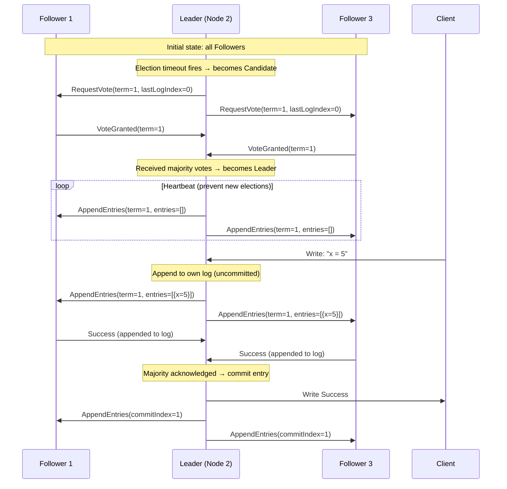

# Distributed Systems

## Kya Seekhoge Is Tutorial Mein

Socho tumhe Zomato jaisa system banana hai — jahan crores of orders, hazaaron restaurants, aur lakhon delivery partners ek saath, real-time mein, poore India mein chal rahe hain. Ye ek single server pe nahi chalta — ye **distributed system** hai, matlab bahut saare independent computers/servers milke ek single coherent system jaisa dikhte hain user ko. Is tutorial mein hum dekhenge ki jab tumhara system ek machine se hazaaron machines mein failta hai, toh kya-kya naye problems aate hain aur unhe kaise solve kiya jaata hai:

- Distributed systems itne hard kyun hain: CAP theorem aur network partitions
- Clock synchronization: NTP, Lamport logical clocks, vector clocks
- Consensus algorithms: Paxos ka overview aur Raft deep dive
- Distributed file systems: NFS aur HDFS ka architecture
- MapReduce paradigm
- RPC aur gRPC communication

**Time Required**: 55-65 minutes

---

## 1. Distributed Systems Itne Hard Kyun Hain?

Distributed system matlab independent computers ka ek group jo user ko ek single, coherent system jaisa lagta hai — jaise Zomato app tumhe ek single app lagta hai, lekin backend mein order service, payment service, restaurant service, delivery-tracking service — sab alag-alag machines pe, alag data centers mein chal rahe hote hain.

Ab fundamental problem ye hai: **failures partial hoti hain**. Iska matlab — kuch nodes (machines/servers) sahi chal rahe hote hain, kuch down ho jaate hain, aur sabse pareshan karne wali baat — **tumhe pata hi nahi chalta ki kaunsa case hai**. Socho tumne Swiggy se order kiya aur restaurant ka app "processing..." pe atak gaya. Ab do possibilities hain: restaurant ka server slow hai (bas thoda wait karo), ya restaurant ka server crash ho gaya hai (order kabhi nahi aayega). Tumhare paas is doubt ko turant resolve karne ka koi seedha tareeka nahi hai — ye hi distributed systems ki asli dikkat hai.

```
Distributed System Challenges
===============================

1. Partial failures:
   Node A thinks Node B is down (network partition)
   Node B is actually running fine
   → Who is right? What should happen?

2. No global clock:
   Node A records event at 10:00:00.000
   Node B records event at 10:00:00.001
   → Did A happen before B? Clocks drift!

3. Asynchronous communication:
   Message sent at time T might arrive at T+1ms or T+10 minutes
   → Cannot timeout and know if node is dead or just slow

4. Consistency vs Availability tradeoff (CAP):
   Under partition, choose: serve stale data OR refuse to serve

8 Fallacies of Distributed Computing (Peter Deutsch):
  1. The network is reliable
  2. Latency is zero
  3. Bandwidth is infinite
  4. The network is secure
  5. Topology doesn't change
  6. There is one administrator
  7. Transport cost is zero
  8. The network is homogeneous
```

> [!info]
> Peter Deutsch ke "8 Fallacies" ek famous list hai jo naye developers galti se assume kar lete hain jab wo pehli baar distributed system design karte hain. Jaise "network reliable hai" — bhai, tumhara mobile data hi kabhi 4G se 2G ho jaata hai train mein, network kabhi reliable nahi hota! Isliye har distributed system ko **retries, timeouts, aur idempotency** ke saath design karna padta hai.

Ek concrete example lete hain — socho IRCTC pe Tatkal booking chal rahi hai. Tumne "Book Now" dabaya, request gayi server pe, lekin response nahi aaya 10 second tak. Ab: (a) tumhara ticket book ho gaya but response wapas nahi aaya (network slow), ya (b) request hi server tak nahi pahunchi (network down), ya (c) server crash ho gaya request process karte hue. Client (tumhara browser) in teeno cases mein exactly same cheez dekh raha hai — "no response". Yehi hai "partial failure ka ghost problem" — is wajah se hi distributed systems mein retry karna dangerous hota hai (double-booking ho sakti hai), aur isliye idempotency keys jaisi cheezein use ki jaati hain.

### CAP Theorem

Brewer ka CAP theorem kehta hai: ek distributed system **teen mein se sirf do** guarantees de sakta hai — Consistency, Availability, Partition Tolerance. Teeno ek saath kabhi nahi.

Socho ek Zomato jaisa system jiske do data centers hain — Mumbai aur Bangalore — aur unke beech ka network link kat gaya (partition). Ab jab koi Mumbai user restaurant ka menu update karta hai, aur usi time Bangalore ka user wahi restaurant dekh raha hai — Bangalore server ko update ka pata hi nahi chala (network kat gaya hai). Ab decision lena padega:

- Ya toh Bangalore server **purana (stale) menu dikha de** — availability choose ki (user ko response toh mila, but galat data)
- Ya toh Bangalore server **error de de** — consistency choose ki (galat data nahi diya, but user ko kuch response hi nahi mila)

Yehi hai CAP theorem ka core dilemma.

```
CAP Theorem
============

Consistency (C):
  Every read receives the most recent write (or an error).
  All nodes see the same data at the same time.

Availability (A):
  Every request receives a (non-error) response.
  System is always responsive (may return stale data).

Partition Tolerance (P):
  System continues operating despite dropped/delayed messages
  between nodes (network partition).

Since network partitions WILL happen, you must choose:
  CP: Consistent + Partition Tolerant (sacrifice availability)
      → During partition: refuse requests rather than serve stale data
      → Examples: HBase, Zookeeper, etcd, Consul

  AP: Available + Partition Tolerant (sacrifice consistency)
      → During partition: serve possibly stale data
      → Examples: DynamoDB (eventually consistent), Cassandra, CouchDB

  CA: Consistent + Available (sacrifice partition tolerance)
      → Only achievable on a single machine (no distribution)
      → Traditional RDBMS on single server

Nuance — PACELC model extends CAP:
  Even when no partition (E=else):
    latency vs consistency tradeoff exists
  Full: PAC + ELC (Partition → A vs C; Else → Latency vs Consistency)
```

> [!tip]
> Real duniya mein "partition tolerance" optional nahi hai — network partitions hoti hi hain (cable cut, router crash, datacenter down). Isliye practically CAP theorem ka choice hamesha **CP vs AP** ke beech hota hai, CA option sirf single-machine systems ke liye relevant hai jaha distribution hai hi nahi.
>
> Example: **Payment/booking systems (bank transfer, seat booking)** usually CP choose karte hain — galat balance dikhane se better hai error dena. **Social media feed, product catalog (Flipkart product listing)** usually AP choose karte hain — thoda purana data dikhana better hai crash hone se.

PACELC ek extra nuance add karta hai: partition na bhi ho (normal operation mein), phir bhi ek tradeoff hota hai — **Latency vs Consistency**. Jaise agar tum strong consistency chahte ho (sab replicas ko confirm karwa ke response bhejo), toh latency badh jaayegi. Agar tum fast response chahte ho, toh thodi consistency compromise karni padegi. Yehi PACELC ka "ELC" part hai.

---

## 2. Clock Synchronization

Socho zara — agar Mumbai ka server kehta hai "order placed at 10:00:00.000" aur Bangalore ka server kehta hai "payment confirmed at 10:00:00.001" — kaunsi event pehle hui? Agar dono servers ki clocks thodi bhi out-of-sync hain (jo real duniya mein hamesha hoti hain), toh ye ordering galat ho sakti hai. Distributed systems mein "kaunsa event pehle hua" jaan-na bahut critical hota hai — jaise banking mein double-spending detect karna, ya distributed database mein conflict resolve karna.

### NTP: Network Time Protocol

**Kya hota hai?** NTP ek protocol hai jo servers ke physical (wall-clock) time ko sync karta hai ek reference time source ke against — jaise sab restaurants apni ghadiyan ek master atomic clock se milate hain.

```
NTP Clock Synchronization
==========================

NTP hierarchy (strata):
  Stratum 0: atomic clocks, GPS receivers (not on network)
  Stratum 1: servers directly connected to Stratum 0 (±microseconds)
  Stratum 2: servers synced to Stratum 1 (±milliseconds)
  Stratum 3+: servers synced to level above

NTP offset calculation:
  Client sends request at T1
  Server receives at T2
  Server sends reply at T3
  Client receives at T4

  Round-trip delay = (T4 - T1) - (T3 - T2)
  Offset = ((T2 - T1) + (T3 - T4)) / 2

  Client adjusts local clock by the offset
  (slews gradually — avoids jumping backward)
```

Ye offset calculation samajhne ke liye ek analogy: socho tum apne dost ko call karke pooch rahe ho "abhi time kya hua?" — lekin call connect hone mein bhi kuch time lagta hai. Toh sirf uske bataye time ko copy karna galat hoga, kyunki us time ke bataye jaane aur tumtak pahunchne mein bhi delay hai. NTP isi round-trip delay ko measure karke usko compensate karta hai — taaki accurate offset nikal sake.

**Kyun "slew gradually" karta hai, jump nahi?** Agar clock ko achanak backward jump kara diya (jaise 10:05 se 10:02), toh koi file jo abhi-abhi "modified at 10:05" mark hui thi, wo future mein modified dikhegi — bahut sare programs (build systems, log analyzers) is se confuse ho jaate hain. Isliye NTP time ko dheere-dheere adjust karta hai (speed thodi badha/ghata deta hai), jump nahi maarta.

```bash
# Check NTP sync status
timedatectl status
# System clock synchronized: yes
# NTP service: active
# RTC in local TZ: no

# Check NTP sources and offsets
chronyc sources -v
# MS Name/IP address         Stratum Poll Reach LastRx Last sample
# ===============================================================================
# ^* time.google.com               1   6   377    32   +0.5ms ±0.2ms

chronyc tracking
# Reference ID    : A29F2F01 (162.159.47.1)
# Stratum         : 2
# System time     : 0.000001234 seconds fast of NTP time
# RMS offset      : 0.000234567 seconds
# Frequency       : 1.234 ppm slow

# NTP accuracy is typically 1-50ms over Internet
# Within a datacenter: ~100 microseconds with PTP (Precision Time Protocol)
# Google Spanner uses GPS + atomic clocks: ~7ms worst-case global uncertainty
```

> [!info]
> Google Spanner (globally distributed database) ne is problem ko itna seriously liya ki har datacenter mein **GPS receivers aur atomic clocks** laga diye taaki clock uncertainty sirf ~7ms tak reh jaaye. Isse unko "TrueTime API" milta hai jo real-time ordering guarantee kar sakta hai — normal NTP (jo 1-50ms off ho sakta hai internet pe) is level ki precision nahi de sakta.

### Lamport Logical Clocks

**Kya hota hai?** Jab physical clocks pe bharosa nahi kar sakte (kyunki wo drift karti hain, sync nahi hoti perfectly), toh hum **logical clocks** use karte hain — jo sirf "kaunsa event pehle hua" ye order batate hain, actual time nahi.

Socho tum aur tumhara colleague WhatsApp pe chat kar rahe ho, aur tum dono ke phone ki ghadi thodi alag time dikha rahi hai. Lekin phir bhi tumhe pata hota hai ki kaunsa message pehle aaya kyunki messages ek sequence mein aate hain — reply hamesha original message ke baad aata hai. Lamport clock isi principle ko formalize karta hai.

```
Lamport Clock Algorithm
========================

Rule 1: Increment counter before each event
  counter++
  event happens at counter value

Rule 2: On message send, attach counter
  msg.timestamp = counter

Rule 3: On message receive, update counter
  counter = max(local_counter, msg.timestamp) + 1

Example:
  Node A:  counter=1 (event a1)
           counter=2 (send message to B with timestamp=2)
           counter=3 (event a2)
           counter=4 (receive message from B with timestamp=5)
           counter=max(4,5)+1=6 (event a3)

  Node B:  counter=1 (event b1)
           counter=2 (receive message from A with timestamp=2)
           counter=max(2,2)+1=3 (event b2)
           counter=4 (event b3)
           counter=5 (send message to A with timestamp=5)

Result: Lamport timestamps give a total order consistent with causality.
  If a → b (a happened before b), then L(a) < L(b)
  BUT L(a) < L(b) does NOT imply a → b (concurrent events also ordered)
```

**Kyun zaruri hai?** Har node ka apna ek counter hota hai jo sirf badhta hai. Jab bhi koi message bhejta hai, apna current counter usme attach kar deta hai. Jab receive karta hai, toh apna counter aur aaye hue message ka counter — dono mein se jo bada hai usse +1 karke apna counter update kar leta hai. Isse ek guarantee milti hai: agar event A causally event B se pehle hua hai (matlab A ne B ko trigger kiya, jaise message bhejna aur receive hona), toh A ka Lamport timestamp hamesha B se chota hoga.

> [!warning]
> Lamport clocks ki limitation ye hai — agar do events ke Lamport timestamps mein L(a) < L(b) hai, iska matlab ye zaruri nahi ki a, b se pehle hua ho. Wo dono completely unrelated (concurrent) events bhi ho sakte hain jinko bas coincidentally alag counter values mil gaye. Matlab Lamport clock **ordering deta hai but causality detect nahi kar sakta** — iske liye Vector clocks chahiye.

### Vector Clocks

**Kya hota hai?** Vector clocks Lamport clocks se ek kadam aage hain — ye batate hain ki do events **causally related hain ya completely concurrent (independent)** hain. Ye bahut kaam aata hai jab distributed database mein conflict detect karna ho.

Socho CRED app pe tumne apna profile update kiya do alag devices se (phone aur laptop) almost same time pe — ek pe naam change kiya, doosre pe address change kiya. Ye dono updates ek doosre se independent (concurrent) hain — inme koi causal relation nahi hai (ek doosre ko trigger nahi kar raha). System ko pata hona chahiye ki ye conflict hai (merge karna padega), na ki bas last-write-wins kar dena — kyunki dono updates valid hain. Vector clocks isi tarah ke conflicts detect karne mein use hote hain.

```
Vector Clock Algorithm
=======================

Each node maintains a vector V[n] where n = number of nodes.
Node i increments V[i] on each event and send.
On receive: V[j] = max(V[j], msg.V[j]) for all j, then V[i]++

Example with 3 nodes A, B, C:

Node A: [1,0,0] → event a1
        [2,0,0] → send to B
Node B: [0,1,0] → event b1
        [2,2,0] → receive from A (max each component, increment own)
        [2,3,0] → send to C
Node C: [0,0,1] → event c1
        [2,3,2] → receive from B
        [2,3,3] → event c2

Comparing clocks:
  V1 < V2 if V1[i] ≤ V2[i] for all i (V1 causally precedes V2)
  V1 ∥ V2 if neither V1 < V2 nor V2 < V1 (concurrent — no causal relationship)

Use cases: DynamoDB (detect conflicting writes), Riak, Git (merge conflicts)
```

Har node apni ek pura vector maintain karta hai (ek entry per node in system), na ki sirf ek single number jaisa Lamport clock mein hota tha. Isse har node ye pura context carry karta hai ki usne baaki sab nodes ke baare mein "last known state" kya dekha tha. Jab do vectors compare karte ho aur na ek doosre se strictly bada hai, na chota — toh wo events concurrent hain, matlab wahan conflict ho sakta hai jisse app-level pe resolve karna padega (jaise Git merge conflict resolve karta hai manually, ya DynamoDB "sibling values" return karke application ko decide karne deta hai).

---

## 3. Consensus Algorithms

**Consensus** ka matlab hai — ek group of nodes ko kisi ek single value pe agree karwana, chahe kuch nodes fail ho jaayein ya slow ho jaayein. Ye distributed systems ka sabse fundamental aur sabse hard problem hai. Socho IRCTC ke 5 servers hain jo ek hi seat book kar rahe hain — sabko agree hona padega ki "seat 42 ko passenger X ko diya gaya", warna do log same seat pe baith jaayenge train mein!

### Paxos Overview

Paxos consensus ka OG (original) algorithm hai — Leslie Lamport ne banaya. Famous hai apni theoretical correctness ke liye, lekin bhi famous hai apni **samajhne mein complexity** ke liye — itna ki khud ek paper ka naam "Paxos Made Simple" hai jo abhi bhi simple nahi lagta logo ko!

```
Paxos in Brief (Single-Decree Paxos)
======================================

Roles:
  Proposer: suggests a value
  Acceptor: votes on proposals (usually 2f+1 nodes to tolerate f failures)
  Learner: learns the agreed value

Phase 1 — Prepare:
  Proposer sends PREPARE(n) with unique proposal number n
  Acceptor responds PROMISE(n, accepted_value) if n > any seen so far
    → also promises not to accept proposals numbered < n

Phase 2 — Accept:
  If proposer receives promise from majority (quorum):
    Sends ACCEPT(n, value)
    (uses highest-numbered previously accepted value if any)
  Acceptor accepts if n ≥ highest promised

Phase 3 — Decide:
  When majority accepts, value is chosen
  Learners are notified

Why Paxos is hard:
  - "Paxos is simple" but Multi-Paxos (for log) is complex
  - Leader election, log compaction, membership changes all require
    careful protocol extensions
  - Hard to implement correctly → Raft was designed as a simpler alternative
```

Idea simple hai — koi bhi node "proposer" ban sakta hai aur ek value propose kar sakta hai. Baaki nodes ("acceptors") us proposal pe vote karte hain. Agar **majority (quorum)** vote de de, toh wo value "chosen" ho jaati hai. 2f+1 nodes rakhne se system f failures tolerate kar sakta hai (kyunki majority ke liye sirf f+1 nodes zinda hone chahiye).

Problem ye hai ki single value pe consensus karna toh Paxos handle kar leta hai, lekin real systems ko ek **continuous log** of decisions chahiye hoti hai (jaise database ka transaction log) — is "Multi-Paxos" ko implement karna itna complex hai ki bahut sari companies isse galat implement kar deti thi. Isi frustration se **Raft** ka janm hua — jisका explicit goal hi tha "understandability" (samajhne mein aasan hona).

### Raft: Leader Election and Log Replication

Raft ka core idea: **hamesha ek single Leader hota hai** jo sab decisions leta hai, aur baaki nodes (Followers) sirf uski baat maante hain. Ye Paxos se zyada intuitive hai kyunki real duniya mein bhi hum aksar aise hi kaam karte hain — jaise ek restaurant mein manager decide karta hai kaunsa order pehle jaayega, staff sirf follow karte hain.



### Raft Algorithm Details

```
Raft Consensus
===============

Node States:
  Follower  → default state, receives AppendEntries from leader
  Candidate → starts election when follower timeout fires
  Leader    → sends heartbeats, accepts client writes

Terms:
  Logical clock unit. Each election starts a new term.
  Nodes with old term update and become followers.

Election:
  1. Follower hasn't heard from leader → becomes Candidate
  2. Increments term, votes for itself, sends RequestVote to all
  3. If receives majority votes → becomes Leader
  4. If another leader found (higher term) → revert to Follower
  5. If election times out → start new election with new term

Log Replication:
  1. Client sends write to Leader
  2. Leader appends to its log (uncommitted)
  3. Leader sends AppendEntries to all Followers
  4. When majority acknowledge → Leader commits entry
  5. Leader notifies Followers to commit in next AppendEntries

Safety guarantee: Committed entries are never lost.
  A new leader must have all committed entries in its log.
  (Ensured by vote restriction: won't vote for candidate with stale log)

Implementations: etcd, Consul, CockroachDB, TiKV, RethinkDB
```

**Kaise kaam karta hai step-by-step?**

Har node teen states mein se ek mein hota hai — **Follower** (default, chup-chap Leader ki baat sunta hai), **Candidate** (election mein khada hai), ya **Leader** (sabko commands deta hai). Jab Followers ko ek certain time tak Leader se koi heartbeat nahi milta (matlab Leader crash ho gaya ya network issue hai), tab wo khud Candidate ban jaate hain aur ek naya "term" (election cycle) shuru karke sabse vote maangte hain. Jise majority vote mil jaaye wo naya Leader ban jaata hai.

Ek baar Leader ban gaya, toh saari client writes usi ke paas jaati hain. Leader apne log mein entry append karta hai (abhi uncommitted), phir Followers ko bhejta hai. Jab **majority** Followers confirm kar dete hain ki unhone bhi apne log mein likh liya, tabhi Leader us entry ko "committed" mark karta hai aur client ko success bolta hai.

> [!tip]
> Yahan "majority" ka concept bahut important hai — socho 5 nodes ka cluster hai. Agar 2 nodes down bhi ho jaayein, baaki 3 (majority) mil ke phir bhi kaam continue kar sakte hain aur naya Leader elect kar sakte hain. Ye hi Raft/Paxos jaise consensus algorithms ki taakat hai — system chalna band nahi hota jab tak majority zinda hai.

**Safety guarantee** bahut clever hai — Raft ye ensure karta hai ki jo bhi naya Leader banega, uske paas saari committed entries pehle se honi chahiye apne log mein. Ye kaise? Election ke time, nodes sirf us Candidate ko vote dete hain jiska log unke apne se "kam se kam utna hi up-to-date" ho. Isse purana Leader ka data kabhi lose nahi hota naye Leader banne pe.

etcd (Kubernetes ka backing store), Consul, CockroachDB — sab Raft use karte hain kyunki ye Paxos se implement karna kaafi aasan hai aur equally strong guarantees deta hai.

---

## 4. Distributed File Systems

Ab tak humne dekha "consensus" — nodes ko agree karwana. Ab dekhte hain ek aur bada distributed systems use-case: **file storage ko multiple machines mein spread karna**, taaki bahut bada data store ho sake aur ek machine crash hone se data loss na ho.

### NFS: Network File System

**Kya hota hai?** NFS ek protocol hai jisse ek remote server ki files, tumhare local machine pe aise use ho sakti hain jaise wo local hi hon. Socho tumhare office mein ek shared drive hai jispe sab team members apni files daalte hain — wo actually kisi central server pe stored hai, lekin tumhare computer mein ek normal folder jaisa dikhta hai.

```
NFS Architecture
=================

Client                          Server
┌──────────────────────┐        ┌──────────────────────┐
│  User process        │        │  NFS Server daemon   │
│  open("/nfs/file")   │        │  (nfsd)              │
│         │            │        │         │            │
│  VFS Layer           │        │  VFS Layer           │
│         │            │        │         │            │
│  NFS Client          │◄──────▶│  NFS Server          │
│  (kernel module)     │  RPC   │  (kernel module)     │
│         │            │        │         │            │
│  [mount: server:/data│        │  Local Filesystem    │
│   on /mnt/data]      │        │  (ext4, xfs, ...)    │
└──────────────────────┘        └──────────────────────┘

NFS versions:
  NFSv3: stateless (server doesn't track open files)
          → survives server restart, but no file locking
  NFSv4: stateful, includes file locking, stronger consistency,
          works through firewalls (single TCP port 2049),
          compound operations (reduce round trips), ACLs
  NFSv4.1/4.2: pNFS (parallel NFS), sessions, copy offload
```

Ek dilchasp cheez — NFSv3 **stateless** hai, matlab server ko yaad hi nahi rehta konsi file kisne khol rakhi hai. Isका fayda ye hai ki agar server crash ho ke restart ho jaaye, client ko kuch fark nahi padta — bas request phirse bhejo. Lekin isमें kami ye hai ki file locking properly nahi ho sakti (do log same file ek saath edit kar sakte hain aur conflict ho sakta hai). NFSv4 ne isko fix kiya — ab server state track karta hai, proper locking hai, aur ek hi TCP port (2049) use hota hai jo firewalls ke through kaam karna easy banata hai.

```bash
# Server setup
apt install nfs-kernel-server

# /etc/exports
/srv/data  192.168.1.0/24(rw,sync,no_subtree_check)
# /path    client(options)
# Options:
#   ro/rw          read-only / read-write
#   sync           write to disk before ACK (safe but slower)
#   async          ACK before write (faster but risky on crash)
#   no_root_squash root on client is treated as root on server (danger!)
#   root_squash    root on client maps to anonymous user (default, safer)
#   no_subtree_check skip subtree check (recommended, performance)

exportfs -ra    # reload exports
exportfs -v     # show active exports

# Client setup
apt install nfs-common
mount -t nfs4 server:/srv/data /mnt/data
mount -t nfs -o vers=4.1,rsize=1048576,wsize=1048576 server:/data /mnt/data

# Persistent mount (/etc/fstab)
server:/srv/data  /mnt/data  nfs4  defaults,_netdev  0 0
```

> [!warning]
> `no_root_squash` option se bacho jab tak koi bahut strong reason na ho — isse client machine ka root user, server pe bhi root ban jaata hai. Matlab agar client compromise ho gaya, attacker seedha tumhare NFS server pe bhi root access le sakta hai. Production mein hamesha default `root_squash` hi use karo.

### HDFS: Hadoop Distributed File System

**Kya hota hai?** NFS single-server-ka-data-share-karna model hai, lekin agar tumhe **petabytes** ka data store karna ho jo ek machine pe fit hi nahi hoga? Yahan HDFS aata hai — jo data ko sainkado machines mein split aur replicate karta hai.

```
HDFS Architecture
==================

NameNode (single master — coordination)
  ├── Stores filesystem metadata (namespace, block locations)
  ├── Manages file-to-block mapping
  ├── Orchestrates replication
  └── Does NOT store actual data

DataNodes (many workers — data storage)
  ├── Store actual data blocks (default 128 MB per block)
  ├── Report block list to NameNode at startup (block reports)
  ├── Send heartbeats to NameNode every 3 seconds
  └── Replicate blocks on NameNode instruction

Client Write Flow:
  1. Client asks NameNode: "where to write new file?"
  2. NameNode assigns blocks + chooses 3 DataNodes (replication=3)
  3. Client writes to DataNode 1 (pipeline replication)
  4. DataNode 1 forwards to DataNode 2 → DataNode 2 to DataNode 3
  5. Acknowledgments flow back up the pipeline
  6. Client notifies NameNode when complete

Fault Tolerance:
  Default replication factor: 3
  Rack-aware placement: 2 replicas in same rack, 1 in different rack
  If DataNode dies: NameNode detects missing heartbeat (10 min)
                    Schedules re-replication from surviving copies
  NameNode HA: Active + Standby NameNode (via Zookeeper)

Block Size Rationale:
  Large blocks (128 MB) reduce NameNode metadata overhead
  Optimize for large sequential reads (MapReduce workloads)
  Small files are a known HDFS weakness (each file uses metadata entry)
```

Socho HDFS ko ek bade warehouse jaisa — **NameNode** manager hai jise pata hai "kaunsa saaman kaunse rack mein hai" (metadata: kis file ke kaunse blocks kahan hain), lekin khud manager saaman uthata nahi. **DataNodes** actual workers hain jo saaman (data blocks) store karte hain. Har file ko 128MB ke blocks mein todke, teen alag DataNodes pe copy (replicate) kiya jaata hai — taaki agar ek machine crash ho jaaye, do aur copies available rahein.

**Rack-aware placement** ek smart trick hai — 2 replicas same rack mein rakhte hain (fast network, kam latency) aur 1 replica alag rack mein (taaki poora rack fail ho jaaye — jaise power supply issue — toh bhi ek copy bach jaaye).

> [!warning]
> HDFS ka ek bada weakness hai — **chhoti-chhoti files**. Har file (chahe wo 1KB ki ho) NameNode ki memory mein ek metadata entry leti hai. Agar tumhare paas lakhon chhoti files hain, NameNode ki memory bhar jaayegi. Isliye HDFS best hai bade sequential files ke liye (jaise logs, ya bulk data), chhote files ko pehle combine (archive) karke store karna padta hai.

---

## 5. MapReduce

**Kya hota hai?** MapReduce ek programming model hai jisse tum bahut bada dataset — jo ek machine pe process karna practically impossible ho — ko hazaaron machines pe parallel process kar sakte ho, bina khud ye sochे hue ki "kaunsa data kis machine pe hai" ya "agar machine crash ho gayi toh kya hoga".

Socho tumhe Flipkart ke crore order records se ye counting karni hai ki "kaunsa product kitni baar order hua". Agar ek single machine pe ye chalao toh hafte lag jaayenge. MapReduce ka idea hai — data ko chhote-chhote parts mein split karo, har part ek alag machine ko process karne do (parallel), phir sab machines ke results ko combine karo.

```
MapReduce Word Count Example
=============================

Input: 3 files across 3 nodes
  File1: "the quick brown fox"
  File2: "the fox jumped over"
  File3: "the lazy dog"

MAP phase (parallel, one mapper per input split):
  Mapper 1: (the,1),(quick,1),(brown,1),(fox,1)
  Mapper 2: (the,1),(fox,1),(jumped,1),(over,1)
  Mapper 3: (the,1),(lazy,1),(dog,1)

SHUFFLE phase (framework groups by key):
  the:    [1,1,1]
  fox:    [1,1]
  quick:  [1]
  brown:  [1]
  jumped: [1]
  over:   [1]
  lazy:   [1]
  dog:    [1]

REDUCE phase (parallel, one reducer per key group):
  (the, 3)
  (fox, 2)
  (quick, 1)
  (brown, 1)
  ...

Key properties:
  - Scales to thousands of nodes
  - Fault tolerant: re-run failed map/reduce tasks
  - Programmer only writes map() and reduce() functions
  - Framework handles parallelism, scheduling, failures, data movement
```

Teen phases hote hain:

1. **Map phase**: Har node apne paas ke data ke chunk ko process karke key-value pairs banata hai (jaise "har word ke saamne 1 likh do"). Ye pura parallel hota hai — sab mappers ek saath chalte hain.
2. **Shuffle phase**: Framework khud saare mappers ke output ko utha ke, same key wale sab values ko ek jagah group kar deta hai — chahe wo values kisi bhi mapper se aaye ho.
3. **Reduce phase**: Har group (key) ke liye ek reducer chalta hai jo values ko combine karta hai (jaise sabko sum kar dena) — final result deta hai.

Sabse bada fayda ye hai — **programmer ko sirf `map()` aur `reduce()` function likhna padta hai**, baaki sab (data kahan bhejna hai, kaunsi machine kaunsa part process karegi, agar koi machine beech mein crash ho jaaye toh us part ko dobara kisi aur machine pe chalana) — ye sab framework khud handle kar leta hai.

> [!info]
> MapReduce Google ne 2004 mein introduce kiya tha, aur Hadoop ne isko open-source duniya mein popularize kiya. Aajkal MapReduce se zyada **Apache Spark** popular hai — kyunki Spark data ko disk pe baar-baar likhne ki jagah **memory (RAM) mein** rakhta hai, jisse iterative computations (jaise machine learning training) bahut fast ho jaate hain. Real-time streaming ke liye Apache Flink use hota hai.

---

## 6. RPC aur gRPC

### Remote Procedure Call

**Kya hota hai?** RPC (Remote Procedure Call) ek aisa mechanism hai jisse tum kisi doosri machine pe chal rahe function ko aise call kar sakte ho jaise wo tumhare hi code mein local function ho. Socho tum Ola app mein "getDriverLocation()" function call kar rahe ho — actually ye function tumhare phone pe nahi, Ola ke kisi backend server pe chal raha hai, lekin developer ke liye ye ek normal function call jaisa hi lagta hai.

```
RPC Architecture
=================

Client                          Server
┌────────────────────┐          ┌────────────────────┐
│  app code          │          │  app code          │
│  result = Add(3,4) │          │  func Add(a,b int) │
│         │          │          │       return a+b   │
│  Client Stub       │          │  Server Stub       │
│  (marshaling)      │──────────▶  (unmarshaling)    │
│         │          │   wire   │         │          │
│  Transport         │◄──────────  Transport         │
└────────────────────┘   format └────────────────────┘

Steps:
  1. Client calls stub function (looks like local call)
  2. Stub serializes (marshals) arguments to wire format
  3. Transport sends over network (TCP/HTTP)
  4. Server stub deserializes (unmarshals) arguments
  5. Server calls actual function
  6. Return value goes through same process in reverse
```

Ye "stub" ka concept ek middleman jaisa kaam karta hai — client side ka stub tumhare function arguments ko ek wire format (jaise JSON ya Protocol Buffers) mein convert (marshal) karta hai, network se bhejta hai, server side ka stub usko wapas decode (unmarshal) karke actual function ko call karta hai. Result bhi isi tarah wapas aata hai. Developer ko ye saara "network ka jhanjhat" dikhta hi nahi — bas ek function call jaisa experience milta hai.

### gRPC

**Kya hota hai?** gRPC Google ka banaya hua modern RPC framework hai jo HTTP/2 aur Protocol Buffers (binary format) use karta hai — matlab REST/JSON se bahut faster aur efficient.

```protobuf
// Define service in .proto file
syntax = "proto3";

package calculator;

service Calculator {
    rpc Add(AddRequest) returns (AddResponse);
    rpc StreamNumbers(StreamRequest) returns (stream NumberResponse);  // server streaming
}

message AddRequest {
    int32 a = 1;
    int32 b = 2;
}

message AddResponse {
    int32 result = 1;
}
```

Yahan pe tum ek `.proto` file mein apni service ka "contract" define karte ho — kaunse functions available hain, unke inputs aur outputs ka type kya hai. gRPC tools se ye file se automatically client aur server ka boilerplate code generate ho jaata hai — kai languages mein (Python, Go, Java, etc.) matching stubs mil jaate hain.

```python
# gRPC Python server
import grpc
from concurrent import futures
import calculator_pb2
import calculator_pb2_grpc

class CalculatorServicer(calculator_pb2_grpc.CalculatorServicer):
    def Add(self, request, context):
        result = request.a + request.b
        return calculator_pb2.AddResponse(result=result)

server = grpc.server(futures.ThreadPoolExecutor(max_workers=10))
calculator_pb2_grpc.add_CalculatorServicer_to_server(CalculatorServicer(), server)
server.add_insecure_port('[::]:50051')
server.start()
server.wait_for_termination()
```

```python
# gRPC Python client
import grpc
import calculator_pb2
import calculator_pb2_grpc

channel = grpc.insecure_channel('localhost:50051')
stub = calculator_pb2_grpc.CalculatorStub(channel)
response = stub.Add(calculator_pb2.AddRequest(a=3, b=4))
print(response.result)  # 7
```

Dekho — client side pe `stub.Add(...)` call karna bilkul ek normal function call jaisa lag raha hai, lekin actually ye ek network request hai jo server tak jaa rahi hai. Ye hi RPC ka poora point hai — network complexity ko developer se abstract kar dena.

```
gRPC Features vs REST
======================

Feature              gRPC                    REST/HTTP
─────────────────────────────────────────────────────────────
Protocol             HTTP/2 (binary)         HTTP/1.1 (text)
Serialization        Protocol Buffers        JSON/XML
Schema               Required (.proto)       Optional (OpenAPI)
Streaming            Bidirectional           Limited (SSE/WebSocket)
Code generation      Built-in               External tools
Browser support      Limited (needs proxy)  Full
Latency              Lower (binary, multiplexed) Higher
Use case             Internal microservices  Public APIs, browsers
```

**Kab gRPC use karein, kab REST?** Agar tum microservices bana rahe ho jo internally ek doosre se baat karte hain (jaise tumhare Node.js/TS backend ke andar order-service aur payment-service ek doosre se baat kar rahe hain) — gRPC bahut fast aur efficient hai, aur `.proto` schema ki wajah se type-safety bhi milti hai. Lekin agar tumhara API public hai aur browsers se seedha call hona hai (jaise frontend se REST API), toh REST/JSON zyada practical hai kyunki browser support seedha hai aur debugging easy hai (JSON human-readable hai, Protocol Buffers binary hai).

---

## 7. Consistency Models

Ab tak humne dekha CAP theorem mein "Consistency vs Availability" ka trade-off. Lekin "Consistency" khud bhi ek spectrum hai — strongest se weakest tak, alag-alag levels hote hain. Har database/system apni zarurat ke hisaab se in models mein se ek choose karta hai.

```
Consistency Models (strongest to weakest)
==========================================

Linearizability (Strict Consistency):
  Operations appear instantaneous and in real-time order.
  Strongest model. Requires coordination.
  Used by: etcd, Zookeeper, Google Spanner

Sequential Consistency:
  All nodes see operations in same order.
  Order may not match real-time.
  Used by: some distributed locks

Causal Consistency:
  Causally related operations seen in causal order.
  Concurrent operations may be seen in different orders.
  Used by: MongoDB (causal sessions), some databases

Eventual Consistency:
  Given no new updates, all replicas converge to same value.
  No guarantees on when or intermediate states.
  Used by: DNS, DynamoDB default, Cassandra

Read-your-writes:
  After writing, subsequent reads from same client see the write.
  Weaker than linearizability but useful for user experience.

Monotonic reads:
  If a client reads a value, later reads won't return older values.
```

Isko samajhne ke liye ek Ola/Uber ka example lete hain:

- **Linearizability**: Jaise agar tumne seat book kar li, turant hi doosra koi bhi node/server ye jaan jaata hai ki wo seat book ho chuki hai — koi bhi query us update ke baad ki state hi dikhayegi, chahe kisi bhi server se ho. Ye sabse strong guarantee hai, lekin implement karna expensive hai (coordination chahiye).
- **Eventual Consistency**: Jaise DNS — tumne apna domain ka IP address change kiya, but ye change poori duniya ke DNS servers tak turant nahi pahunchता — kuch minutes/hours lagte hain. Lekin "eventually" (aakhir mein) sab servers same value dikhayenge. Isme koi guarantee nahi hai ki kab tak update propagate hoga.
- **Read-your-writes**: Socho tumne Instagram pe apna profile photo change kiya — turant tumhe apna naya photo dikhna chahiye (chahe backend mein eventually consistent replication chal rahi ho), lekin doosre users ko thoda der baad dikhe toh chalega. Ye ek practical compromise hai jo user experience ke liye kaafi hai.
- **Monotonic reads**: Ye guarantee karta hai ki agar tumne ek baar naya data dekh liya, toh next baar purana data kabhi wapas nahi dikhega — chahe wo tumhe alag replica se serve ho raha ho.

> [!tip]
> Real-world systems (jaise MongoDB) developer ko choice dete hain — chahe toh strong consistency use karo (thoda slow but safe), chahe eventual consistency use karo (fast but thoda risk). Tumhe apne use-case ke hisaab se decide karna padta hai — payment ke liye strong consistency chahiye, lekin "likes count" jaisi cheez ke liye eventual consistency bhi chal jaati hai.

---

## Summary Table

| Concept | Key Insight | Example System |
|---------|-------------|----------------|
| CAP Theorem | Can only have 2 of: Consistency, Availability, Partition Tolerance | etcd (CP), Cassandra (AP) |
| NTP | Physical clock sync via round-trip timing | All servers |
| Lamport clocks | Logical ordering without physical clocks | Event logs |
| Vector clocks | Detect causality and concurrency | DynamoDB, Riak |
| Raft | Understandable consensus with leader election | etcd, Consul |
| HDFS | Large file distributed storage with replication | Hadoop clusters |
| MapReduce | Parallel batch processing with map/shuffle/reduce | Hadoop, Spark |
| gRPC | Efficient typed RPC over HTTP/2 | Microservices |

## Key Takeaways

- Distributed systems mein **partial failures** sabse badi dikkat hain — tumhe kabhi pata nahi chalta ki node down hai ya sirf slow hai, isliye retries, timeouts, aur idempotency design mein hone chahiye.
- **CAP theorem** kehta hai partition ke time tumhe Consistency ya Availability mein se ek choose karna padega — payment jaisi cheezon ke liye CP (jaise etcd), aur feeds/catalogs jaisi cheezon ke liye AP (jaise Cassandra) common choice hai.
- Physical clocks kabhi perfectly sync nahi hoti (NTP se bhi milliseconds ka drift rehta hai), isliye **Lamport clocks** ordering ke liye aur **Vector clocks** causality/concurrency detect karne ke liye use hote hain.
- **Consensus algorithms** (Paxos, Raft) nodes ko ek value pe agree karwate hain chahe kuch nodes fail ho jaayein — Raft, Paxos se zyada popular hai kyunki samajhna aur implement karna aasan hai (single Leader model).
- **HDFS** jaise distributed file systems bade data ko chhote blocks mein todke multiple machines pe replicate karte hain — taaki koi bhi machine crash ho jaaye toh data safe rahe.
- **MapReduce** se tum bahut bade data ko parallel process kar sakte ho bina khud fault-tolerance aur scheduling ki chinta kiye — modern systems mein Spark isse aage badha chuka hai (in-memory processing).
- **gRPC** internal microservice communication ke liye REST se zyada fast aur type-safe hai (binary protocol, typed schema), lekin public/browser-facing APIs ke liye REST/JSON zyada practical rehta hai.
- **Consistency models** ek spectrum hain (Linearizability sabse strong, Eventual sabse weak) — apni application ki zarurat ke hisaab se sahi model choose karna padta hai, sab jagah sabse strong consistency zaruri nahi hoti.
