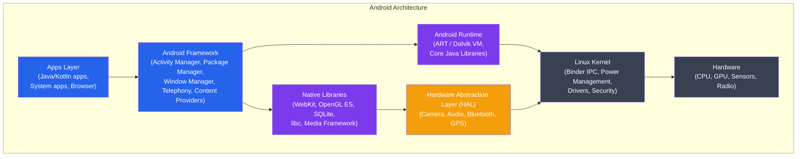
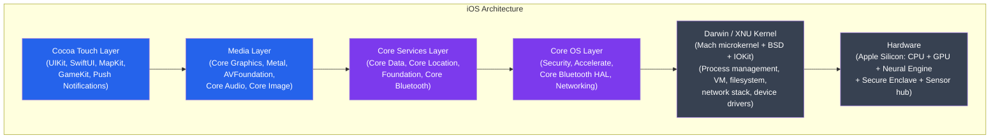
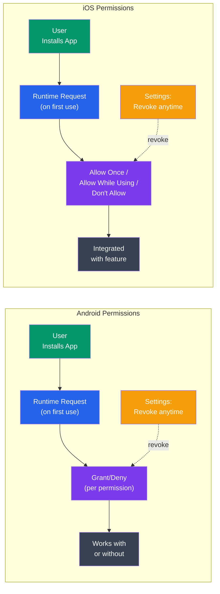

# Mobile Operating Systems

## What You'll Learn

In this tutorial, you'll understand the architecture and design principles of mobile operating systems:

- Android architecture: Linux kernel through the app layer
- Android app lifecycle and Activity states
- iOS architecture: XNU kernel through Cocoa Touch
- iOS app sandbox and entitlements
- Power management: Doze mode (Android) and App Nap (iOS)
- Permissions model comparison: Android vs iOS

**Time Required**: 45-55 minutes

---

## 1. Mobile OS vs Desktop OS

Mobile OSes face different constraints than desktop systems:

```
Mobile OS Design Constraints
==============================

Resource Constraints:
  Battery:    3000-6000 mAh — seconds count
  RAM:        4-16 GB (no swap historically)
  Storage:    Limited NAND flash (write endurance, cost)
  CPU:        ARM — energy-efficient, not raw throughput
  Heat:       Passive cooling only — must throttle aggressively

Trust Model Differences:
  Desktop: user runs trusted software, OS protects system
  Mobile:  app market apps are untrusted by default
           OS must sandbox every app from each other
           and from sensitive user data

UI Paradigm:
  Touch-first, no hover states, small screen
  Background processing must be heavily restricted
  (user leaves apps, doesn't quit them)

Connectivity:
  Always-on cellular modem (separate processor)
  WiFi, Bluetooth, NFC — all power consumers
  Push notifications instead of polling
```

---

## 2. Android Architecture

Android is built on a modified Linux kernel with a Java/Kotlin application framework on top.



### Linux Kernel Modifications for Android

```
Android-specific Kernel Additions
===================================

Binder IPC:
  - Android's primary inter-process communication mechanism
  - Kernel driver (/dev/binder) for efficient cross-process calls
  - Services publish to ServiceManager (similar to microkernel)
  - One copy: kernel maps memory directly between processes
  - Traditional IPC (sockets, pipes) requires 2 copies

Wake Locks:
  - Prevent CPU from sleeping while work is in progress
  - Applications acquire PowerManager.WAKE_LOCK
  - Must be released when done (leaked wake locks drain battery)

Low Memory Killer:
  - Extension of Linux OOM killer
  - Kills background processes by priority when memory low
  - oom_adj score: foreground apps protected, background killed first

Ashmem (Anonymous Shared Memory):
  - Android's alternative to POSIX shared memory
  - Supports memory pressure pinning/unpinning

ION Memory Allocator:
  - Unified memory allocation for GPU, camera, display subsystem
  - Shares buffers across hardware components with zero-copy
```

### Android Runtime (ART)

```
Dalvik vs ART
==============

Dalvik (pre-Android 5.0 Lollipop):
  - JIT (Just-In-Time) compilation
  - Compiled from Java bytecode → .dex (Dalvik Executable) format
  - Compact .dex designed for low memory devices
  - JIT: compile hot methods at runtime → slow startup, uses memory

ART (Android 5.0+):
  - AOT (Ahead-Of-Time) compilation at install time
  - .dex → .oat (native code, ELF format) during installation
  - Faster app startup (no JIT overhead at runtime)
  - Uses more storage (pre-compiled native code)
  - Profile-guided compilation: hybrid AOT+JIT based on usage patterns

ART in Android 7.0+ (Hybrid):
  - Profile-guided compilation
  - JIT runs first, collects "hot" method profile
  - OTA (background) AOT compiles hot methods from profile
  - Best of both worlds: fast startup + optimized hot paths

GC improvements in ART:
  - Concurrent GC (doesn't stop all threads)
  - Moving collector reduces heap fragmentation
  - Large object space for bitmaps (prevents GC pressure)
```

### Android App Sandbox

```bash
# Each Android app gets a unique Linux UID at install time
# (e.g., app1 = UID 10025, app2 = UID 10063)

# Apps run in separate processes with separate UIDs
# Linux DAC enforces isolation between apps

# Data directory isolation:
/data/data/com.example.app1/   # owned by UID 10025
/data/data/com.example.app2/   # owned by UID 10063
# Neither app can read the other's data

# SELinux enforces process-level isolation:
# Each app runs under untrusted_app domain
# Prevents escalation even if Linux DAC is bypassed

# Shared processes: apps from same developer can share UID
# (android:sharedUserId in manifest — deprecated in API 29+)
```

---

## 3. Android App Lifecycle

Android aggressively manages app state to conserve memory and battery. Understanding the Activity lifecycle is fundamental to Android development:

```
Activity Lifecycle State Machine
==================================

         onCreate()
              │
              ▼
          ─────────
         │ Created │
          ─────────
              │ onStart()
              ▼
          ───────
         │Visible│◄──────────────────────────┐
          ───────                             │ onRestart()
              │ onResume()                    │
              ▼                    onStop()   │
          ──────────      ┌──────────────────►┤
         │ Foreground│    │                   │
          ──────────      │           ─────────────
              │ onPause() │          │  Stopped    │
              ▼           │           ─────────────
          ─────────       │                   │
         │ Paused  │──────┘         onDestroy()│
          ─────────                            │
                                         ──────────
                                        │Destroyed │
                                         ──────────

State descriptions:
  Foreground: Activity is visible and user is interacting
              Never killed by system (unless ANR/crash)
  Visible:    Activity visible but another activity on top
              Only killed under extreme memory pressure
  Stopped:    Activity replaced but instance preserved in memory
              May be killed if system needs memory (no notification)
  Destroyed:  Activity has been removed from stack

Key lifecycle methods:
  onCreate():  Initialize — inflate UI, bind data, set up views
  onStart():   About to become visible
  onResume():  Back in foreground — start animations, camera, sensors
  onPause():   Losing foreground — save lightweight state (< 500ms!)
  onStop():    No longer visible — save heavy state, release resources
  onDestroy(): Final cleanup — cancel coroutines, close connections
```

```kotlin
class MainActivity : AppCompatActivity() {
    private lateinit var cameraManager: CameraManager

    override fun onCreate(savedInstanceState: Bundle?) {
        super.onCreate(savedInstanceState)
        setContentView(R.layout.activity_main)

        // Restore saved state if resuming after process death
        savedInstanceState?.let {
            val position = it.getInt("scroll_position", 0)
            scrollView.scrollTo(0, position)
        }
    }

    override fun onResume() {
        super.onResume()
        // Restart things that should only run in foreground
        cameraManager.startPreview()
        sensorManager.registerListener(this, accelerometer, SENSOR_DELAY_NORMAL)
    }

    override fun onPause() {
        super.onPause()
        // Release resources quickly — onPause must be fast!
        cameraManager.stopPreview()
        sensorManager.unregisterListener(this)
    }

    override fun onSaveInstanceState(outState: Bundle) {
        super.onSaveInstanceState(outState)
        // Save transient UI state (survives rotation, background kill)
        outState.putInt("scroll_position", scrollView.scrollY)
    }
}
```

---

## 4. iOS Architecture

iOS runs on Apple's custom XNU kernel (a hybrid of Mach microkernel and BSD UNIX).



### XNU Kernel Architecture

```
XNU: X is Not Unix
===================

XNU is a hybrid kernel combining:

Mach (microkernel core):
  - Virtual memory management (vm_map, pagers)
  - Thread scheduling (mach_thread)
  - Inter-process communication (Mach ports — like file descriptors for IPC)
  - Low-level hardware abstraction
  - Remote procedure calls: Mach traps

BSD layer (POSIX compatibility):
  - POSIX file system interface
  - POSIX process model (fork, exec, signals)
  - BSD networking stack (TCP/IP)
  - System calls: open(), read(), write(), etc.

IOKit (device driver framework):
  - C++ object-oriented driver framework
  - Device matching and probing
  - Power management for devices
  - Runs in kernel space (unlike Android's HAL in user space)

Mach IPC (ports) vs Android Binder:
  Both allow cross-process communication, but:
  - Mach ports: capability-based, kernel-mediated
  - Binder: service registry model, one-copy

Secure Enclave Processor (SEP):
  - Separate processor with its own OS (sepOS)
  - Stores biometric templates, encryption keys
  - Isolated from main application processor
  - Even kernel cannot read SEP contents
```

### iOS App Sandbox

```
iOS Sandbox (Entitlements-based)
==================================

Each iOS app:
  1. Runs as a separate UNIX process with unique UID
  2. Has a private container directory inaccessible to other apps
  3. Can only access system APIs explicitly granted via entitlements

Container structure:
  MyApp.app/              ← app bundle (read-only, signed)
  Documents/              ← user data (backed up to iCloud)
  Library/                ← app support files
    Application Support/  ← persistent data
    Caches/               ← re-creatable cache (purged under pressure)
    Preferences/          ← user preferences (NSUserDefaults)
  tmp/                    ← temporary files (purged on launch)

Entitlements (in app binary, signed by developer):
  com.apple.security.network.client    ← can make outgoing connections
  com.apple.security.network.server    ← can accept incoming connections
  com.apple.security.files.user-selected.read-write  ← file access
  com.apple.security.device.camera     ← camera access
  aps-environment                      ← push notifications

Sandbox policy enforced by kernel (Seatbelt/Sandbox framework):
  - Profiles written in Scheme-like language
  - "default deny" — everything blocked unless explicitly allowed
  - More granular than Android's permission model
```

---

## 5. Power Management

### Android Doze Mode

Doze conserves battery by restricting background app activity when the device is idle:

```
Android Doze Mode (API 23+)
============================

Triggers: screen off + stationary + on battery

Doze stages:
  Normal:     full access
       │ screen off + still + battery
       ▼
  Light Doze: some restrictions (Android 7.0+)
  - Deferred: network access, wakelocks, jobs, alarms
  - Allowed: high-priority FCM, foreground services
  - Maintenance window every few minutes
       │ extended idle
       ▼
  Deep Doze: full restrictions
  - Deferred: all network, wakelocks, jobs
  - Maintenance windows: rare (hours apart)
  - Allowed: high-priority FCM push only

App behavior in Doze:
  - WorkManager/JobScheduler jobs deferred to maintenance window
  - AlarmManager.setExact() deferred (use setExactAndAllowWhileIdle for critical)
  - Network calls blocked (socket operations fail)
  - Wakelocks don't work

App Standby Buckets (API 28+):
  Active:       just used → full access
  Working Set:  used recently → some restrictions
  Frequent:     used weekly → more restrictions
  Rare:         rarely used → strict restrictions
  Restricted:   very rarely used (API 30+) → very strict

Developer testing:
  adb shell dumpsys deviceidle
  adb shell dumpsys deviceidle force-idle deep   # enter Doze immediately
  adb shell dumpsys deviceidle step-idle
  adb shell dumpsys deviceidle unforce           # exit Doze
```

### iOS App Nap and Background Modes

```
iOS App States
===============

Running/Active:
  App in foreground, user interacting.
  Full resource access.

Running/Inactive:
  In foreground but not receiving events (e.g., phone call overlay).
  Should reduce activity.

Background:
  Not visible to user. Limited time to complete tasks (~30 seconds).
  After time expires → Suspended.

Suspended:
  In memory but no code executing.
  App Nap: system reduces CPU/network for background apps
           that aren't doing useful work (similar concept to OS X App Nap)

Terminated:
  Removed from memory.

Background execution modes (must declare in Info.plist):
  audio               ← play audio in background (music, navigation)
  location            ← continuous location updates (turn-by-turn nav)
  voip                ← VoIP socket (WhatsApp, Zoom)
  fetch               ← periodic background fetch (email, news)
  remote-notification ← silent push notification processing
  bluetooth-central   ← Bluetooth communication
  processing          ← long background processing with BGTaskScheduler

BGTaskScheduler (iOS 13+, replaces background fetch):
  BGAppRefreshTask: short refresh tasks (30s limit)
  BGProcessingTask: longer tasks (e.g., ML training, database maintenance)
    → scheduled by OS when device is charging + idle
```

---

## 6. Permissions Model Comparison



### Detailed Comparison

| Feature | Android | iOS |
|---------|---------|-----|
| Permission model | Declare in manifest, request at runtime | Declare in Info.plist, request at runtime |
| Granularity options | Allow / Deny | Allow Once / Allow While Using / Don't Allow |
| Location precision | Fine / Coarse | Precise / Approximate (iOS 14+) |
| Background location | Separate permission | Requires "Always" (hard to get) |
| Photo access | Full library (READ_MEDIA_IMAGES) | Full library / Selected photos (iOS 14+) |
| Contacts | Read / Write separate | All-or-nothing (until iOS 18) |
| Install-time permissions | Internet, Vibrate, etc. | None — all at runtime |
| Permission groups | Yes (CAMERA group grants front+back) | No groups |
| Auto-revoke | Unused apps (API 30+) | Unused apps (iOS 15+) |
| Dangerous permissions | ~30 categories | Similar categories |

```swift
// iOS permission request (Camera)
import AVFoundation

func requestCameraAccess() {
    switch AVCaptureDevice.authorizationStatus(for: .video) {
    case .authorized:
        setupCamera()
    case .notDetermined:
        AVCaptureDevice.requestAccess(for: .video) { granted in
            if granted { self.setupCamera() }
        }
    case .denied, .restricted:
        showPermissionDeniedAlert()
    @unknown default:
        break
    }
}
```

```kotlin
// Android permission request (Camera)
class CameraActivity : AppCompatActivity() {
    private val requestPermission = registerForActivityResult(
        ActivityResultContracts.RequestPermission()
    ) { granted ->
        if (granted) setupCamera()
        else showPermissionDeniedUI()
    }

    fun checkCameraPermission() {
        when {
            ContextCompat.checkSelfPermission(this, CAMERA) == PERMISSION_GRANTED ->
                setupCamera()
            shouldShowRequestPermissionRationale(CAMERA) ->
                showRationaleDialog { requestPermission.launch(CAMERA) }
            else ->
                requestPermission.launch(CAMERA)
        }
    }
}
```

---

## 7. Storage and Scoped Storage

### Android Scoped Storage (API 29+)

```
Android Storage Evolution
==========================

Pre-Android 10 (legacy):
  App could request READ_EXTERNAL_STORAGE and access entire SD card
  Users had no visibility into what apps were accessing

Scoped Storage (Android 10+):
  Each app gets isolated storage area
  Accessing other apps' files requires MediaStore API or SAF

Storage areas:
  App-specific storage (no permissions needed):
    /data/data/<package>/         ← internal app storage
    /sdcard/Android/data/<package>/ ← external app storage

  Shared storage (via MediaStore API):
    Images, audio, video — specific MediaStore collections
    Downloads — shareable, but app's own downloads visible

  System files:
    Require MANAGE_EXTERNAL_STORAGE (restricted by Play policy)

Storage Access Framework (SAF):
  Intent(Intent.ACTION_OPEN_DOCUMENT)  ← user picks a file
  Intent(Intent.ACTION_OPEN_DOCUMENT_TREE)  ← user picks a folder
  Grants persistent URI permission via content:// URIs
```

---

## 8. Key Architectural Differences

```
Android vs iOS Design Philosophy
==================================

Android:
  ✓ Open: any manufacturer can use it (OEM customization)
  ✓ Sideloading apps (APK outside Play Store)
  ✓ More background execution flexibility
  ✓ More granular storage access historically
  ✓ Intents: apps communicate via loosely-coupled messages
  ✗ Fragmentation: many OS versions active simultaneously
  ✗ Security patches depend on OEM + carrier (can be months delayed)

iOS:
  ✓ Tight hardware/software integration (Apple Silicon)
  ✓ Rapid OS adoption (80%+ on latest within months)
  ✓ Secure Enclave for biometrics/keys
  ✓ Strong app review reduces malware
  ✓ Consistent performance/battery optimization across all devices
  ✗ Walled garden: App Store only (until EU DMA, 2024)
  ✗ More restrictive background execution
  ✗ Less inter-app communication

Common ground:
  - Both use Linux-derived kernels (Android: Linux, iOS: Darwin/XNU with POSIX)
  - Both sandbox apps with process isolation
  - Both use runtime permissions
  - Both use ARM processors
  - Both have hardware-backed keystores (Android Keystore, iOS Secure Enclave)
```

---

## Summary

| Aspect | Android | iOS |
|--------|---------|-----|
| Kernel | Linux (modified) | XNU (Mach + BSD) |
| App runtime | ART (AOT + JIT) | Native (Swift/Obj-C → ARM) |
| IPC | Binder driver | Mach ports |
| App isolation | Linux UID + SELinux | Sandbox + Seatbelt |
| Background | Doze, App Standby Buckets | Background modes, App Nap |
| Permissions | Runtime, revocable | Runtime, "While Using" option |
| Hardware security | Android Keystore, StrongBox | Secure Enclave (SEP) |

Mobile OSes are fundamentally about **battery life and security** — every architectural decision from Binder IPC to Doze mode to the Secure Enclave exists to serve these two goals in a constrained environment where users expect days of battery life and trust their device with banking credentials and health data.
