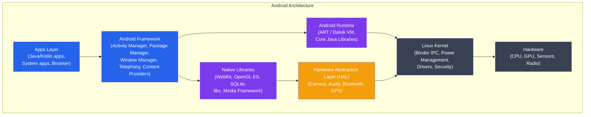
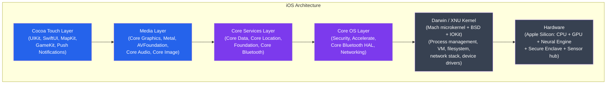
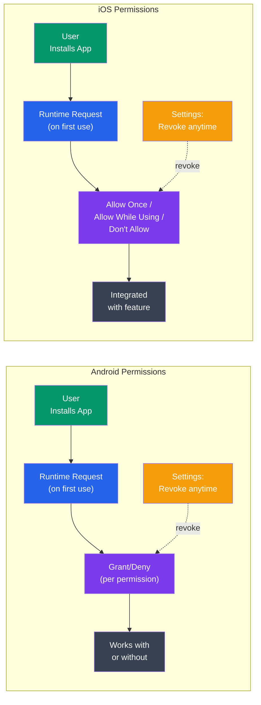

# Mobile Operating Systems

## Kya Seekhoge Is Tutorial Mein

Socho tumhare phone mein jo OS chal raha hai — Android ya iOS — woh ek desktop OS se bilkul alag mindset se banaya gaya hai. Is note mein hum dono ka andar-baahar dekhenge:

- Android architecture: Linux kernel se lekar app layer tak, poora stack
- Android app lifecycle aur Activity states — kyun aapki app achanak "restart" ho jaati hai
- iOS architecture: XNU kernel se Cocoa Touch tak
- iOS app sandbox aur entitlements — Apple itna strict kyun hai
- Power management: Android ka Doze mode aur iOS ka App Nap
- Permissions model: Android vs iOS mein kya farak hai

**Time Required**: 45-55 minutes

---

## 1. Mobile OS vs Desktop OS

Pehle samjho — mobile OS aur desktop OS mein farak sirf screen size ka nahi hai. Poora design philosophy hi alag hai. Socho apne laptop ko — usme charger laga hai, AC room mein hai, aur agar Chrome ke 40 tabs khule hain toh bhi koi dikkat nahi. Ab socho apne phone ko — battery 3500 mAh hai, jeb mein garam ho raha hai, aur agar ek app background mein zyada CPU khaye toh sham tak battery khatam.

Yehi wajah hai ki mobile OS designers ko bilkul different constraints ke saath kaam karna padta hai:

```
Mobile OS Design Constraints
==============================

Resource Constraints:
  Battery:    3000-6000 mAh — seconds count
  RAM:        4-16 GB (no swap historically)
  Storage:    Limited NAND flash (write endurance, cost)
  CPU:        ARM — energy-efficient, not raw throughput
  Heat:       Passive cooling only — must throttle aggressively

Trust Model Differences:
  Desktop: user runs trusted software, OS protects system
  Mobile:  app market apps are untrusted by default
           OS must sandbox every app from each other
           and from sensitive user data

UI Paradigm:
  Touch-first, no hover states, small screen
  Background processing must be heavily restricted
  (user leaves apps, doesn't quit them)

Connectivity:
  Always-on cellular modem (separate processor)
  WiFi, Bluetooth, NFC — all power consumers
  Push notifications instead of polling
```

Do cheezein yahan important hain jo aage sab kuch explain karti hain:

1. **Battery aur heat** — Phone mein fan nahi hota, radiator nahi hota. CPU zyada garam hoga toh khud hi throttle (slow down) ho jaayega. Isliye har design decision — Doze mode ho, ART compiler ho — end mein battery bachaane ke liye hai.
2. **Trust model** — Tumhare laptop pe tum khud software install karte ho aur trust karte ho. Lekin phone pe Play Store/App Store se koi bhi random developer ki app aa sakti hai. Socho — ek flashlight app ko tumhare contacts padhne ki zarurat kyun ho? Isliye OS ko har app ko doosri apps se aur user ke sensitive data se **sandbox** karke rakhna padta hai — jaise Zomato delivery boy ko sirf restaurant se customer tak jaane ka access diya jaata hai, poore building complex ki master-key nahi.
3. **"User apps chodta hai, band nahi karta"** — Desktop pe tum File menu se "Quit" dabate ho. Phone pe tum Home button dabakar chale jaate ho — app technically abhi bhi memory mein hai! Isliye OS ko decide karna padta hai kaunsi app zinda rakhni hai aur kaunsi maar deni hai jab RAM kam pade.

> [!info]
> Yeh poora tutorial isi ek idea ke around ghoomta hai: **battery bachao, aur untrusted apps se user ko bachao.** Har feature — Binder IPC ho, Doze mode ho, ya Secure Enclave — in do goals ko serve karta hai.

---

## 2. Android Architecture

Android Linux kernel ke upar bana hai, aur uske upar Java/Kotlin ka application framework baitha hai. Socho ise ek building ki tarah — sabse neeche foundation (Linux kernel), uske upar floors (libraries, runtime), aur sabse upar apps jo tum use karte ho.



Isko top-down padho: jab tum WhatsApp kholte ho (Apps Layer), woh Android Framework se services maangta hai (jaise "notification dikhao" — Activity Manager se), Framework ART runtime pe chalta hai jo tumhara Kotlin code execute karta hai, aur neeche jaake yeh sab Linux Kernel ke through actual hardware (camera, GPU) tak pahunchta hai.

### Linux Kernel Modifications for Android

Google ne plain Linux kernel nahi liya — usme Android ke liye kuch khaas cheezein add ki hain, kyunki normal Linux ek server ya desktop ke liye design hua tha, phone ke liye nahi:

```
Android-specific Kernel Additions
===================================

Binder IPC:
  - Android's primary inter-process communication mechanism
  - Kernel driver (/dev/binder) for efficient cross-process calls
  - Services publish to ServiceManager (similar to microkernel)
  - One copy: kernel maps memory directly between processes
  - Traditional IPC (sockets, pipes) requires 2 copies

Wake Locks:
  - Prevent CPU from sleeping while work is in progress
  - Applications acquire PowerManager.WAKE_LOCK
  - Must be released when done (leaked wake locks drain battery)

Low Memory Killer:
  - Extension of Linux OOM killer
  - Kills background processes by priority when memory low
  - oom_adj score: foreground apps protected, background killed first

Ashmem (Anonymous Shared Memory):
  - Android's alternative to POSIX shared memory
  - Supports memory pressure pinning/unpinning

ION Memory Allocator:
  - Unified memory allocation for GPU, camera, display subsystem
  - Shares buffers across hardware components with zero-copy
```

Chaar important additions samjho:

- **Binder IPC** — Yeh Android ka signature IPC mechanism hai. Normal Linux IPC (pipes, sockets) mein data 2 baar copy hota hai — process A se kernel mein, kernel se process B mein. Binder sirf **ek** copy karta hai kyunki kernel directly memory map kar deta hai dono processes ke beech. Socho ise UPI transfer ki tarah — pehle wale zamane mein cheque clear hone mein 2 din lagte the (2 hops: bank A → clearing house → bank B), UPI mein directly ek hop mein paisa transfer ho jaata hai. Har baar jab tumhari app "Camera service" ya "Location service" se baat karti hai, woh Binder ke through hi hoti hai.
- **Wake Locks** — Agar koi app kaam kar rahi hai (jaise music download ho raha hai), toh woh CPU ko sone se rok sakti hai — ek "wake lock" leke. Problem tab hoti hai jab developer wake lock release karna bhool jaaye — phir phone poori raat CPU jagaye rakhta hai aur subah battery 5% bachi milti hai. Isiliye bahut sari "battery drain" bugs actual mein leaked wake locks hoti hain.
- **Low Memory Killer (LMK)** — Jab RAM kam padti hai, yeh decide karta hai kis app ko pehle maarna hai. Har process ko ek `oom_adj` score milta hai — foreground app (jo abhi dikh rahi hai) ka score sabse safe hota hai, background wali apps pehle maari jaati hain. Socho Swiggy ke delivery fleet ki tarah — jo order abhi active hai (customer wait kar raha hai) woh priority pe hai, jo order already deliver ho chuka hai uska rider free kar diya jaata hai.
- **ION Allocator** — Camera, GPU, display sab ko memory buffers share karne padte hain (jaise camera se photo lekar seedha screen pe dikhana). ION unhe zero-copy tareeke se share karne deta hai — matlab data ko baar baar copy nahi karna padta, jo battery aur speed dono bachata hai.

### Android Runtime (ART)

```
Dalvik vs ART
==============

Dalvik (pre-Android 5.0 Lollipop):
  - JIT (Just-In-Time) compilation
  - Compiled from Java bytecode → .dex (Dalvik Executable) format
  - Compact .dex designed for low memory devices
  - JIT: compile hot methods at runtime → slow startup, uses memory

ART (Android 5.0+):
  - AOT (Ahead-Of-Time) compilation at install time
  - .dex → .oat (native code, ELF format) during installation
  - Faster app startup (no JIT overhead at runtime)
  - Uses more storage (pre-compiled native code)
  - Profile-guided compilation: hybrid AOT+JIT based on usage patterns

ART in Android 7.0+ (Hybrid):
  - Profile-guided compilation
  - JIT runs first, collects "hot" method profile
  - OTA (background) AOT compiles hot methods from profile
  - Best of both worlds: fast startup + optimized hot paths

GC improvements in ART:
  - Concurrent GC (doesn't stop all threads)
  - Moving collector reduces heap fragmentation
  - Large object space for bitmaps (prevents GC pressure)
```

Yeh samajhna important hai kyunki bahut se Node.js devs V8's JIT se familiar hote hain, toh comparison easy hai:

- **Dalvik (purana)** — Tumhara Kotlin/Java code `.dex` (bytecode) mein compile hota tha, aur phone pe **runtime pe** (JIT — Just In Time) native code mein convert hota tha. Isse app start hone mein time lagta tha, kyunki phone khud "translate" kar raha hota tha har baar jab app khulti thi.
- **ART (naya)** — Yahan installation ke time hi poora `.dex` code native ARM instructions (`.oat` file) mein compile ho jaata hai. Matlab jab tum Play Store se app install karte ho, uss waqt hi "translation" ho jaata hai. Isliye app open hote hi fast chalti hai — koi runtime overhead nahi. Trade-off yeh hai ki storage zyada lagta hai (compiled native code bytecode se bada hota hai).
- **Hybrid approach (Android 7+)** — Best of both worlds: pehle JIT chalta hai aur note karta hai konsa method "hot" hai (baar baar use ho raha hai), phir jab phone charging pe idle pada ho, background mein sirf un hot methods ko AOT compile kar deta hai. Bilkul waise jaise Swiggy apne busy routes ko dheere dheere optimize karta hai based on data — pehle sab manual chalta hai, phir jo route zyada use hota hai usko dedicated fast lane mil jaati hai.

> [!tip]
> Concurrent GC ka matlab hai garbage collection background mein chalta hai bina saare threads ko rokte — isse UI "jank" (frame drop/lag) kam hota hai. Yeh waisa hi hai jaise restaurant kitchen mein cleaning staff customer ko serve karte waqt bhi dishes wash karta rahe, bina poora kitchen band kiye.

### Android App Sandbox

```bash
# Each Android app gets a unique Linux UID at install time
# (e.g., app1 = UID 10025, app2 = UID 10063)

# Apps run in separate processes with separate UIDs
# Linux DAC enforces isolation between apps

# Data directory isolation:
/data/data/com.example.app1/   # owned by UID 10025
/data/data/com.example.app2/   # owned by UID 10063
# Neither app can read the other's data

# SELinux enforces process-level isolation:
# Each app runs under untrusted_app domain
# Prevents escalation even if Linux DAC is bypassed

# Shared processes: apps from same developer can share UID
# (android:sharedUserId in manifest — deprecated in API 29+)
```

Kya hota hai jab tum Play Store se app install karte ho? Android usse ek unique Linux UID (User ID) de deta hai — jaise ek naya "employee ID". Har app apne alag UID ke saath alag process mein chalti hai, aur Linux ka built-in permission system (DAC — Discretionary Access Control) enforce karta hai ki UID 10025 wali app UID 10063 ki files na padh sake.

Isko real life mein socho — CRED app aur PhonePe app dono tumhare phone mein hain. Dono ko apna alag "locker" milta hai (`/data/data/com.cred.app`, `/data/data/com.phonepe.app`). CRED chahe kitni bhi buggy ho, woh PhonePe ka locker nahi khol sakti — Linux khud hi usse rok deta hai.

Upar se ek aur layer hai — **SELinux**. Yeh extra security hai in case Linux ka normal permission system kisi tarah bypass ho jaaye (jaise koi exploit mil jaaye). Har third-party app `untrusted_app` domain mein chalti hai — jise bahut limited cheezein karne ki ijazat hoti hai, chahe woh root access bhi paa le.

> [!warning]
> `android:sharedUserId` (jisse do apps same UID share kar sakti thi, agar wo same developer ki hon) ab deprecated hai — Google ne API 29+ mein isse hata diya kyunki yeh security ka loophole ban sakta tha.

---

## 3. Android App Lifecycle

Yeh section Android developers ke liye sabse zaroori hai. Kyun? Kyunki Android mein tumhari app **kabhi bhi** background mein maari jaa sakti hai — bina warning ke. Agar tumne apna state sahi jagah save nahi kiya, toh user jab wapas app pe aayega, sab kuch reset mil sakta hai (form data gone, scroll position gone). Isliye Activity lifecycle samajhna utna hi zaroori hai jitna Express mein middleware chain samajhna.

```
Activity Lifecycle State Machine
==================================

         onCreate()
              │
              ▼
          ─────────
         │ Created │
          ─────────
              │ onStart()
              ▼
          ───────
         │Visible│◄──────────────────────────┐
          ───────                             │ onRestart()
              │ onResume()                    │
              ▼                    onStop()   │
          ──────────      ┌──────────────────►┤
         │ Foreground│    │                   │
          ──────────      │           ─────────────
              │ onPause() │          │  Stopped    │
              ▼           │           ─────────────
          ─────────       │                   │
         │ Paused  │──────┘         onDestroy()│
          ─────────                            │
                                         ──────────
                                        │Destroyed │
                                         ──────────

State descriptions:
  Foreground: Activity is visible and user is interacting
              Never killed by system (unless ANR/crash)
  Visible:    Activity visible but another activity on top
              Only killed under extreme memory pressure
  Stopped:    Activity replaced but instance preserved in memory
              May be killed if system needs memory (no notification)
  Destroyed:  Activity has been removed from stack

Key lifecycle methods:
  onCreate():  Initialize — inflate UI, bind data, set up views
  onStart():   About to become visible
  onResume():  Back in foreground — start animations, camera, sensors
  onPause():   Losing foreground — save lightweight state (< 500ms!)
  onStop():    No longer visible — save heavy state, release resources
  onDestroy(): Final cleanup — cancel coroutines, close connections
```

Isko ek real scenario se samjho: tum IRCTC app khol ke ticket book kar rahe ho (`Foreground` state). Achanak WhatsApp pe call aa gaya — tum call answer karne ke liye switch karte ho. Iss moment pe:

1. `onPause()` call hota hai — IRCTC ko turant (500ms se kam mein) apna lightweight state save karna hoga, jaise "user ne train X select kiya tha". Yeh itna fast hona chahiye kyunki agar tumne isme heavy kaam kiya (jaise database write), toh naya foreground app (phone call screen) lag/delay dikhega.
2. Agar call lambi chali aur system ko memory ki zarurat padi, `onStop()` call hoga — ab IRCTC heavy resources (jaise camera, network connections) release kar sakta hai.
3. Agar phone mein RAM ki bahut kami ho gayi (tumne beech mein 5 aur apps khol li), Android bina warning diye poori IRCTC process ko **maar** sakta hai — `onDestroy()` bhi guarantee nahi hai ki call ho. Jab user wapas IRCTC pe aayega, Android usse fresh process mein restart karega — lekin agar tumne `onSaveInstanceState()` mein data save kiya tha, wahi restore hoke user ko lagega ki kuch hua hi nahi.

Yeh bilkul waisa hi hai jaise Zomato delivery partner ka app — agar rider background mein app minimize karke kisi aur kaam mein lag jaaye, aur phone RAM kam padne pe app ko kill kar de, toh jab wapas khole tab bhi delivery ka current order state (kya pick kiya, kaha deliver karna hai) restore hona chahiye — warna order hi gum ho jaayega.

```kotlin
class MainActivity : AppCompatActivity() {
    private lateinit var cameraManager: CameraManager

    override fun onCreate(savedInstanceState: Bundle?) {
        super.onCreate(savedInstanceState)
        setContentView(R.layout.activity_main)

        // Restore saved state if resuming after process death
        savedInstanceState?.let {
            val position = it.getInt("scroll_position", 0)
            scrollView.scrollTo(0, position)
        }
    }

    override fun onResume() {
        super.onResume()
        // Restart things that should only run in foreground
        cameraManager.startPreview()
        sensorManager.registerListener(this, accelerometer, SENSOR_DELAY_NORMAL)
    }

    override fun onPause() {
        super.onPause()
        // Release resources quickly — onPause must be fast!
        cameraManager.stopPreview()
        sensorManager.unregisterListener(this)
    }

    override fun onSaveInstanceState(outState: Bundle) {
        super.onSaveInstanceState(outState)
        // Save transient UI state (survives rotation, background kill)
        outState.putInt("scroll_position", scrollView.scrollY)
    }
}
```

> [!warning]
> Sabse common mobile dev mistake: `onPause()` mein heavy kaam karna (jaise network call, file write). Yaad rakho — `onPause()` ke andar jo bhi ho, woh foreground app ko block kar sakta hai. Isse app "Application Not Responding" (ANR) dikhla sakta hai — bilkul waise jaise Node.js mein event loop ko synchronous heavy kaam se block karna.

---

## 4. iOS Architecture

Ab dusri taraf dekhte hain — iOS. Yeh Apple ke apne banaye hue **XNU** kernel pe chalta hai, jo Mach microkernel aur BSD UNIX ka hybrid hai. Android jahan open-source Linux use karta hai, wahin Apple ne apna khud ka kernel design kiya — poori tarah closed aur control mein.



Yahan bhi layering hai, Android jaisa hi concept — jab tum SwiftUI se UI banate ho (Cocoa Touch layer), niche Media aur Core Services layers use hote hain, aur end mein sab kuch XNU kernel ke through Apple Silicon hardware (CPU, GPU, Neural Engine, Secure Enclave) tak pahunchta hai.

### XNU Kernel Architecture

```
XNU: X is Not Unix
===================

XNU is a hybrid kernel combining:

Mach (microkernel core):
  - Virtual memory management (vm_map, pagers)
  - Thread scheduling (mach_thread)
  - Inter-process communication (Mach ports — like file descriptors for IPC)
  - Low-level hardware abstraction
  - Remote procedure calls: Mach traps

BSD layer (POSIX compatibility):
  - POSIX file system interface
  - POSIX process model (fork, exec, signals)
  - BSD networking stack (TCP/IP)
  - System calls: open(), read(), write(), etc.

IOKit (device driver framework):
  - C++ object-oriented driver framework
  - Device matching and probing
  - Power management for devices
  - Runs in kernel space (unlike Android's HAL in user space)

Mach IPC (ports) vs Android Binder:
  Both allow cross-process communication, but:
  - Mach ports: capability-based, kernel-mediated
  - Binder: service registry model, one-copy

Secure Enclave Processor (SEP):
  - Separate processor with its own OS (sepOS)
  - Stores biometric templates, encryption keys
  - Isolated from main application processor
  - Even kernel cannot read SEP contents
```

XNU naam hi mazedaar hai — "X is Not Unix" (recursive joke, jaise GNU "GNU's Not Unix"). Iske teen main hisse hain:

- **Mach** — Yeh core microkernel hai jo memory management, thread scheduling aur IPC (Inter-Process Communication) sambhalta hai. Mach ports IPC ka mechanism hain — inhe socho file descriptors jaise, lekin communication ke liye. Ek process doosre process ko ek "port" bhej sakta hai jispe woh messages daal sake.
- **BSD layer** — Yeh POSIX-compatible layer hai jo tumhe familiar UNIX system calls deta hai — `open()`, `read()`, `write()`, `fork()`. Isi wajah se iOS/macOS pe UNIX-based tools/libraries kaafi aasani se port ho jaate hain.
- **IOKit** — Yeh device drivers ke liye framework hai. Important difference Android se: IOKit drivers **kernel space** mein chalte hain, jabki Android ke HAL (Hardware Abstraction Layer) drivers **user space** mein chalte hain. Isse Apple ko zyada control milta hai, lekin agar driver mein bug ho toh poore system ko crash kar sakta hai — trade-off hai stability vs isolation ka.

**Mach ports vs Binder** — dono cross-process communication ke tareeke hain, bas philosophy alag hai:
- Mach ports **capability-based** hain — jise port ka access hai, wahi usko use kar sakta hai (jaise ek chaabi jo sirf ek darwaza kholti hai).
- Binder ek **service registry model** hai — services ServiceManager ke paas register hoti hain aur clients unhe naam se dhoondte hain, ek copy operation ke saath (kernel directly memory map karta hai).

**Secure Enclave Processor (SEP)** — yeh sabse interesting part hai. Socho iski tarah — ek chhota, alag processor jo apna khud ka mini-OS (`sepOS`) chalata hai, poori tarah main phone ke CPU se isolated. Tumhara fingerprint data, Face ID data, encryption keys — sab yahan store hote hain. Itna secure hai ki **khud iOS ka kernel bhi** SEP ke andar ka data nahi padh sakta. Yeh waisa hi hai jaise bank ka locker room — bank manager (kernel) bhi tumhara locker (SEP) nahi khol sakta bina tumhari chaabi (biometric match) ke.

### iOS App Sandbox

```
iOS Sandbox (Entitlements-based)
==================================

Each iOS app:
  1. Runs as a separate UNIX process with unique UID
  2. Has a private container directory inaccessible to other apps
  3. Can only access system APIs explicitly granted via entitlements

Container structure:
  MyApp.app/              ← app bundle (read-only, signed)
  Documents/              ← user data (backed up to iCloud)
  Library/                ← app support files
    Application Support/  ← persistent data
    Caches/               ← re-creatable cache (purged under pressure)
    Preferences/          ← user preferences (NSUserDefaults)
  tmp/                    ← temporary files (purged on launch)

Entitlements (in app binary, signed by developer):
  com.apple.security.network.client    ← can make outgoing connections
  com.apple.security.network.server    ← can accept incoming connections
  com.apple.security.files.user-selected.read-write  ← file access
  com.apple.security.device.camera     ← camera access
  aps-environment                      ← push notifications

Sandbox policy enforced by kernel (Seatbelt/Sandbox framework):
  - Profiles written in Scheme-like language
  - "default deny" — everything blocked unless explicitly allowed
  - More granular than Android's permission model
```

iOS ka sandbox model Android se conceptually similar hai (har app apna alag UID, apna alag data folder) lekin philosophy zyada strict hai — **"default deny"**. Matlab jab tak explicitly kisi cheez ki entitlement na di ho, woh block hi rahegi. Android mein bahut se defaults "allow" hote hain jab tak specifically deny na ho.

Container structure samjho — jab tum ek app install karte ho, usko ek poora "ghar" milta hai:
- `MyApp.app/` — yeh khud app ka code hai, read-only aur Apple/developer dwara signed. Koi runtime pe isse modify nahi kar sakta.
- `Documents/` — user ka data (jaise WhatsApp ke chat backups) — yeh iCloud pe backup bhi hota hai.
- `Library/Caches/` — yeh cache hai jo system pressure mein purge (delete) ho sakta hai — isliye important data yahan mat rakho.
- `tmp/` — bilkul temporary, app restart pe clear ho sakta hai.

**Entitlements** — yeh ek certificate jaisi cheez hai jo developer apni app ke binary mein sign karta hai, jisme likha hota hai "mujhe camera chahiye", "mujhe push notification chahiye" waghera. Kernel ka Sandbox framework (jise "Seatbelt" bhi kaha jaata hai) inhe enforce karta hai — agar entitlement nahi hai, toh API call fail ho jaayegi, chahe user ne allow bhi kiya ho.

---

## 5. Power Management

Yeh section shayad sabse practical hai — kyunki jo bhi background service, push notification, ya periodic sync tumne kabhi implement kiya hoga, uska behavior in power-saving mechanisms se directly control hota hai.

### Android Doze Mode

Doze ka pura concept hai — jab phone use nahi ho raha (screen off, stationary, battery pe), background apps ko heavily restrict kar do taaki battery drain na ho.

```
Android Doze Mode (API 23+)
============================

Triggers: screen off + stationary + on battery

Doze stages:
  Normal:     full access
       │ screen off + still + battery
       ▼
  Light Doze: some restrictions (Android 7.0+)
  - Deferred: network access, wakelocks, jobs, alarms
  - Allowed: high-priority FCM, foreground services
  - Maintenance window every few minutes
       │ extended idle
       ▼
  Deep Doze: full restrictions
  - Deferred: all network, wakelocks, jobs
  - Maintenance windows: rare (hours apart)
  - Allowed: high-priority FCM push only

App behavior in Doze:
  - WorkManager/JobScheduler jobs deferred to maintenance window
  - AlarmManager.setExact() deferred (use setExactAndAllowWhileIdle for critical)
  - Network calls blocked (socket operations fail)
  - Wakelocks don't work

App Standby Buckets (API 28+):
  Active:       just used → full access
  Working Set:  used recently → some restrictions
  Frequent:     used weekly → more restrictions
  Rare:         rarely used → strict restrictions
  Restricted:   very rarely used (API 30+) → very strict

Developer testing:
  adb shell dumpsys deviceidle
  adb shell dumpsys deviceidle force-idle deep   # enter Doze immediately
  adb shell dumpsys deviceidle step-idle
  adb shell dumpsys deviceidle unforce           # exit Doze
```

Socho tum raat ko so gaye, phone table pe pada hai, screen off, koi movement nahi. Android dhire dhire Doze mode mein chala jaata hai:

1. **Light Doze** — Phone soch raha hai "shayad idle hai" — background network calls aur jobs deferred (postpone) ho jaate hain, lekin har kuch minute mein ek chhota "maintenance window" khulta hai jisme apps apna pending kaam nipta sakti hain. High-priority FCM (Firebase Cloud Messaging) push notifications — jaise koi WhatsApp message — abhi bhi turant deliver hoti hain.
2. **Deep Doze** — Agar phone lambe time se idle hai, toh restrictions aur strict ho jaate hain. Maintenance windows ab ghanton baad aate hain. Sirf high-priority push hi turant aata hai.

Iska matlab agar tumne app mein "har 15 minute mein background sync karo" jaisa naive logic likha hai using normal `AlarmManager.setExact()`, toh Doze mode mein woh alarm delay ho jaayega — tumhare control mein nahi rahega. Agar sach mein critical hai (jaise alarm clock app), toh `setExactAndAllowWhileIdle()` use karna padta hai — lekin Google isko bhi abuse hone se rokta hai.

**App Standby Buckets** ek aur layer hai — jitna zyada user ne recently app use ki hai, utni zyada freedom milti hai. Socho ise ek gym membership ki tarah — jo member roz aata hai (Active bucket) usko locker aur towel turant milta hai, jo mahine mein ek baar aata hai (Rare bucket) usko wait karna padta hai counter pe.

Developer testing ke liye `adb` commands diye hain upar — inse tum apne phone ko force-idle karke test kar sakte ho ki tumhari app Doze mode mein sahi behave karti hai ya nahi (jaise: background sync fail hone pe graceful retry karta hai ya crash ho jaata hai).

### iOS App Nap and Background Modes

```
iOS App States
===============

Running/Active:
  App in foreground, user interacting.
  Full resource access.

Running/Inactive:
  In foreground but not receiving events (e.g., phone call overlay).
  Should reduce activity.

Background:
  Not visible to user. Limited time to complete tasks (~30 seconds).
  After time expires → Suspended.

Suspended:
  In memory but no code executing.
  App Nap: system reduces CPU/network for background apps
           that aren't doing useful work (similar concept to OS X App Nap)

Terminated:
  Removed from memory.

Background execution modes (must declare in Info.plist):
  audio               ← play audio in background (music, navigation)
  location            ← continuous location updates (turn-by-turn nav)
  voip                ← VoIP socket (WhatsApp, Zoom)
  fetch               ← periodic background fetch (email, news)
  remote-notification ← silent push notification processing
  bluetooth-central   ← Bluetooth communication
  processing          ← long background processing with BGTaskScheduler

BGTaskScheduler (iOS 13+, replaces background fetch):
  BGAppRefreshTask: short refresh tasks (30s limit)
  BGProcessingTask: longer tasks (e.g., ML training, database maintenance)
    → scheduled by OS when device is charging + idle
```

iOS ka approach Android se aur bhi strict hai. Jab tum Home button dabate ho, app **Background** state mein jaati hai lekin sirf ~30 seconds ka time milta hai apna kaam nipta ne ke liye. Uske baad woh **Suspended** ho jaati hai — matlab memory mein hai lekin ek bhi line of code execute nahi ho rahi. Bilkul waise jaise koi customer restaurant mein table book karke bahar chala jaaye — table (memory) uske liye hold hai lekin waiter (CPU) uski koi service nahi kar raha.

Agar tumhe kuch specific kaam background mein karna hai (jaise Spotify ko music continue bajana hai, ya Ola ko turn-by-turn navigation dena hai), tumhe Info.plist mein explicitly **background execution mode** declare karna padta hai:

- `audio` — music/navigation app apna audio background mein continue bajaye
- `location` — continuous GPS tracking (jaise Ola driver app)
- `voip` — WhatsApp/Zoom jaisi calling app ka socket zinda rahe
- `fetch` — periodically thoda data refresh karna (jaise news app)
- `remote-notification` — silent push aane pe kuch process karna

**BGTaskScheduler** (iOS 13+) modern approach hai:
- `BGAppRefreshTask` — chhote refresh kaam (jaise inbox check), max 30 second
- `BGProcessingTask` — lambe kaam, jaise ML model training ya database cleanup — yeh OS khud schedule karta hai jab phone charging pe ho aur idle ho (matlab raat ko jab phone charge pe laga hai)

> [!tip]
> Yeh dono OS ka common pattern hai — "jab phone charge pe ho aur idle ho, tabhi heavy kaam karo." Isliye apps jaise Google Photos apna backup raat ko karti hain jab phone charge pe hota hai — battery ki chinta nahi karni padti.

---

## 6. Permissions Model Comparison

Ab dekhte hain dono OS apps ko sensitive cheezein (camera, location, contacts) access karne ki ijazat kaise dete hain — aur yahan philosophy mein bahut farak hai.



Dono flows dikhne mein similar hain — install karo, runtime pe permission maango, grant/deny karo, aur settings se kabhi bhi revoke kar sakte ho. Lekin details mein farak bahut zyada hai.

### Detailed Comparison

| Feature | Android | iOS |
|---------|---------|-----|
| Permission model | Declare in manifest, request at runtime | Declare in Info.plist, request at runtime |
| Granularity options | Allow / Deny | Allow Once / Allow While Using / Don't Allow |
| Location precision | Fine / Coarse | Precise / Approximate (iOS 14+) |
| Background location | Separate permission | Requires "Always" (hard to get) |
| Photo access | Full library (READ_MEDIA_IMAGES) | Full library / Selected photos (iOS 14+) |
| Contacts | Read / Write separate | All-or-nothing (until iOS 18) |
| Install-time permissions | Internet, Vibrate, etc. | None — all at runtime |
| Permission groups | Yes (CAMERA group grants front+back) | No groups |
| Auto-revoke | Unused apps (API 30+) | Unused apps (iOS 15+) |
| Dangerous permissions | ~30 categories | Similar categories |

Kuch important points jo table se nahi dikhte:

- **iOS ka "Allow Once"** — yeh Android mein hai hi nahi (recent Android versions mein aaya hai kuch had tak). Socho jab tum ek naya food delivery app kholte ho aur usko location chahiye — tum "Allow Once" pe click karte ho, matlab agli baar app kholte hi wapas se poochega. Yeh privacy-conscious users ke liye badhiya hai — CRED jaisi app ko permanent location access dena zaruri nahi.
- **Location precision** — Ab dono OS "approximate" location dene ka option dete hain. Socho — Zomato ko sirf itna pata hona chahiye ki tum kis area mein ho (nearby restaurants dikhane ke liye), tumhara exact GPS coordinate nahi.
- **Install-time permissions Android mein** — Purane zamane mein Android mein saare permissions install time pe hi maang liye jaate the (ek lambi list dikhti thi). Ab sirf "safe" permissions (Internet, Vibrate) install time pe hain — baaki "dangerous" permissions (Camera, Location, Contacts) runtime pe hi maange jaate hain. iOS mein shuru se hi sab kuch runtime pe hota hai — koi install-time list nahi.

```swift
// iOS permission request (Camera)
import AVFoundation

func requestCameraAccess() {
    switch AVCaptureDevice.authorizationStatus(for: .video) {
    case .authorized:
        setupCamera()
    case .notDetermined:
        AVCaptureDevice.requestAccess(for: .video) { granted in
            if granted { self.setupCamera() }
        }
    case .denied, .restricted:
        showPermissionDeniedAlert()
    @unknown default:
        break
    }
}
```

```kotlin
// Android permission request (Camera)
class CameraActivity : AppCompatActivity() {
    private val requestPermission = registerForActivityResult(
        ActivityResultContracts.RequestPermission()
    ) { granted ->
        if (granted) setupCamera()
        else showPermissionDeniedUI()
    }

    fun checkCameraPermission() {
        when {
            ContextCompat.checkSelfPermission(this, CAMERA) == PERMISSION_GRANTED ->
                setupCamera()
            shouldShowRequestPermissionRationale(CAMERA) ->
                showRationaleDialog { requestPermission.launch(CAMERA) }
            else ->
                requestPermission.launch(CAMERA)
        }
    }
}
```

Dono code snippets ka pattern same hai — pehle check karo current status, agar already granted hai toh direct use karo, agar nahi poocha gaya toh maango, aur agar deny ho chuka hai toh user ko explain karo ki feature kyun chahiye (rationale dialog).

---

## 7. Storage and Scoped Storage

### Android Scoped Storage (API 29+)

```
Android Storage Evolution
==========================

Pre-Android 10 (legacy):
  App could request READ_EXTERNAL_STORAGE and access entire SD card
  Users had no visibility into what apps were accessing

Scoped Storage (Android 10+):
  Each app gets isolated storage area
  Accessing other apps' files requires MediaStore API or SAF

Storage areas:
  App-specific storage (no permissions needed):
    /data/data/<package>/         ← internal app storage
    /sdcard/Android/data/<package>/ ← external app storage

  Shared storage (via MediaStore API):
    Images, audio, video — specific MediaStore collections
    Downloads — shareable, but app's own downloads visible

  System files:
    Require MANAGE_EXTERNAL_STORAGE (restricted by Play policy)

Storage Access Framework (SAF):
  Intent(Intent.ACTION_OPEN_DOCUMENT)  ← user picks a file
  Intent(Intent.ACTION_OPEN_DOCUMENT_TREE)  ← user picks a folder
  Grants persistent URI permission via content:// URIs
```

Pehle (Android 9 aur usse pehle), ek baar `READ_EXTERNAL_STORAGE` permission mil jaaye toh app poore SD card ko padh sakti thi — matlab ek flashlight app bhi tumhari saari WhatsApp photos, dusri apps ke downloads, sab kuch dekh sakti thi. Yeh bahut bada privacy risk tha.

Android 10+ mein **Scoped Storage** aaya — ab har app ko apna isolated area milta hai, aur doosri jagah ki files access karne ke liye specific API use karni padti hai:

- **App-specific storage** — bina kisi permission ke, sirf apna hi folder access kar sakti hai.
- **Shared storage via MediaStore** — agar tumhe photos/videos/audio access karna hai (jaise Instagram ko gallery se photo upload karni hai), toh MediaStore API se specific collections access karte ho, poora SD card nahi.
- **SAF (Storage Access Framework)** — jab user khud koi file/folder pick karta hai (jaise ek PDF choose karna), tumhe ek `content://` URI milta hai jiska persistent access mil jaata hai — lekin tum poore file system mein ghoom nahi sakte.

Socho ise ek locker room ki tarah — pehle koi bhi apni chaabi se dusre ka locker khol sakta tha (agar permission mil jaaye). Ab har locker apna alag lock hai, aur agar tumhe kisi aur ka saman chahiye, toh unhe khud aakar dena padega (SAF ke through) ya ek shared common area (MediaStore) use karna padega.

---

## 8. Key Architectural Differences

Ab dono OS ki philosophy compare karte hain — kyunki inke design decisions unke business models se bhi juda hai.

```
Android vs iOS Design Philosophy
==================================

Android:
  ✓ Open: any manufacturer can use it (OEM customization)
  ✓ Sideloading apps (APK outside Play Store)
  ✓ More background execution flexibility
  ✓ More granular storage access historically
  ✓ Intents: apps communicate via loosely-coupled messages
  ✗ Fragmentation: many OS versions active simultaneously
  ✗ Security patches depend on OEM + carrier (can be months delayed)

iOS:
  ✓ Tight hardware/software integration (Apple Silicon)
  ✓ Rapid OS adoption (80%+ on latest within months)
  ✓ Secure Enclave for biometrics/keys
  ✓ Strong app review reduces malware
  ✓ Consistent performance/battery optimization across all devices
  ✗ Walled garden: App Store only (until EU DMA, 2024)
  ✗ More restrictive background execution
  ✗ Less inter-app communication

Common ground:
  - Both use Linux-derived kernels (Android: Linux, iOS: Darwin/XNU with POSIX)
  - Both sandbox apps with process isolation
  - Both use runtime permissions
  - Both use ARM processors
  - Both have hardware-backed keystores (Android Keystore, iOS Secure Enclave)
```

Android ka philosophy hai **openness** — Samsung, Xiaomi, OnePlus sab apna flavor bana sakte hain (One UI, MIUI, OxygenOS), tum APK sideload kar sakte ho (Play Store ke bahar se bhi install kar sakte ho, jaise WhatsApp Business ka APK direct website se), aur apps ek doosre se **Intents** ke through communicate kar sakti hain (jaise ek app doosri app ko "share" kar sakti hai bina directly integrate kiye).

Iska nuksaan hai **fragmentation** — India mein hi socho, kisi ke paas Android 10 wala budget phone hai, kisi ke paas Android 14 wala flagship. Developer ko sabke liye support likhna padta hai. Aur security patches — woh manufacturer aur telecom carrier pe depend karte hain, isliye kai baar mahino tak update nahi aata (jabki Google ne patch release kar diya ho).

iOS ka philosophy hai **control aur consistency** — Apple khud hardware aur software dono banata hai (Apple Silicon), isliye deep optimization possible hai. Naya iOS version aane ke 3-4 mahine mein 80%+ devices update ho jaate hain — Android mein yeh number bahut kam hota hai. App Store ka strict review process malware kam karta hai, lekin iska matlab hai walled garden — sirf App Store se hi apps aa sakti hain (EU mein 2024 se DMA regulation ke baad thoda change hua hai).

Interesting baat yeh hai ki jitne bhi differences hain, dono ki **foundation** bahut similar hai:
- Dono ke paas Linux-derived / UNIX-compatible kernel hai
- Dono process-level sandboxing karte hain
- Dono runtime permissions use karte hain (kam se kam ab)
- Dono hardware-backed secure key storage rakhte hain (Android Keystore vs Secure Enclave)

---

## Summary

| Aspect | Android | iOS |
|--------|---------|-----|
| Kernel | Linux (modified) | XNU (Mach + BSD) |
| App runtime | ART (AOT + JIT) | Native (Swift/Obj-C → ARM) |
| IPC | Binder driver | Mach ports |
| App isolation | Linux UID + SELinux | Sandbox + Seatbelt |
| Background | Doze, App Standby Buckets | Background modes, App Nap |
| Permissions | Runtime, revocable | Runtime, "While Using" option |
| Hardware security | Android Keystore, StrongBox | Secure Enclave (SEP) |

## Key Takeaways

- Mobile OS design mein sabse bada constraint battery aur heat hai — koi fan nahi, koi charger hamesha laga nahi — isliye har feature ka focus power saving pe hota hai.
- Android open-source Linux kernel pe bana hai, custom additions ke saath (Binder IPC, Wake Locks, Low Memory Killer, ION allocator) jo mobile-specific problems solve karte hain.
- ART (Android Runtime) install-time AOT compilation use karta hai fast startup ke liye, aur Android 7+ mein hybrid JIT+AOT approach best-of-both-worlds deta hai.
- Android Activity lifecycle samajhna critical hai — apps kabhi bhi background mein maari ja sakti hain, isliye `onSaveInstanceState()` aur proper state management zaruri hai.
- iOS XNU kernel (Mach + BSD hybrid) pe chalta hai, aur Secure Enclave Processor (SEP) biometric/encryption data ko main CPU se bhi isolate rakhta hai.
- Dono OS apps ko sandbox karte hain — Android UID + SELinux se, iOS entitlements + Seatbelt se — dono "untrusted third-party app" model follow karte hain.
- Power management ke liye Android ka Doze mode aur iOS ka App Nap/Background modes dono ka goal same hai — jab app use nahi ho rahi, uska background resource usage minimize karna.
- Permissions model mein iOS zyada granular options deta hai ("Allow Once", "Allow While Using"), jabki Android permission groups aur zyada background flexibility deta hai.
- Scoped Storage (Android 10+) ne per-app isolated storage model introduce kiya, jisse ek app doosri app ka data seedha padh nahi sakti.
- Android aur iOS ki philosophy alag hai — openness vs control — lekin dono ka foundation similar hai: UNIX-like kernel, process isolation, runtime permissions, aur hardware-backed security.
