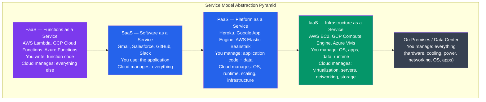

# Cloud Operating Systems

## What You'll Learn

In this tutorial, you'll understand how cloud computing transforms and extends OS concepts:

- Cloud computing models: IaaS, PaaS, SaaS, FaaS
- How cloud providers use hypervisors (AWS Nitro, GCP KVM)
- Container orchestration as cloud OS (Kubernetes control plane)
- Serverless: Lambda execution model and cold starts
- Multi-tenancy and tenant isolation
- Edge computing and CDN OS concepts
- Unikernels: MirageOS, IncludeOS — minimal single-purpose VMs

**Time Required**: 50-60 minutes

---

## 1. Cloud Service Models

Cloud computing provides computing resources over the internet with different abstraction levels:



### Detailed Model Comparison

```
What You Manage vs What Cloud Manages
=======================================

              On-Prem  IaaS    PaaS    SaaS/FaaS
Applications     YOU     YOU    YOU      Cloud
Data             YOU     YOU    YOU      Cloud
Runtime          YOU     YOU    Cloud    Cloud
Middleware       YOU     YOU    Cloud    Cloud
OS               YOU     YOU    Cloud    Cloud
Virtualization   YOU    Cloud   Cloud    Cloud
Servers          YOU    Cloud   Cloud    Cloud
Storage          YOU    Cloud   Cloud    Cloud
Networking       YOU    Cloud   Cloud    Cloud
Facilities       YOU    Cloud   Cloud    Cloud

IaaS use cases:
  - Lift-and-shift migrations (run existing VMs in cloud)
  - Custom OS/kernel requirements
  - Maximum control over infrastructure
  - Reserved/spot instances for cost optimization

PaaS use cases:
  - Web apps with auto-scaling (Heroku, App Engine)
  - Managed databases (RDS, Cloud SQL, Cosmos DB)
  - Develop faster without managing infrastructure

SaaS use cases:
  - End-user productivity tools (email, CRM, collaboration)
  - Pay per user/seat pricing

FaaS use cases:
  - Event-driven processing (image resizing, webhook handling)
  - Sporadic workloads (pay only when executing)
  - Microservices without servers
```

---

## 2. Hypervisors: The Cloud Foundation

Cloud providers run thousands of customer VMs on shared physical hardware using hypervisors.

### Type 1 vs Type 2 Hypervisors

```
Hypervisor Types
=================

Type 1 (Bare Metal):
  Hardware
  └── Hypervisor (runs directly on hardware)
      ├── VM 1 (Guest OS)
      ├── VM 2 (Guest OS)
      └── VM 3 (Guest OS)
  Examples: VMware ESXi, Microsoft Hyper-V, Xen, KVM (sort of)

Type 2 (Hosted):
  Hardware
  └── Host OS
      └── Hypervisor (runs as application)
          ├── VM 1 (Guest OS)
          └── VM 2 (Guest OS)
  Examples: VirtualBox, VMware Workstation, QEMU
  Use case: development/testing on laptops, not cloud production

KVM (Kernel-based Virtual Machine):
  Linux kernel module that turns the kernel into a Type 1 hypervisor
  Uses hardware virtualization (Intel VT-x, AMD-V)
  Guest VMs are processes from host OS perspective
  QEMU provides device emulation
  Used by: GCP, OpenStack, many cloud providers
```

### AWS Nitro System

```
AWS Nitro Architecture
=======================

Traditional hypervisor problem:
  Hypervisor handles VM isolation AND I/O virtualization
  → Hypervisor code is large, complex, potential attack surface
  → Hypervisor uses CPU cycles for I/O → less for customers

Nitro solution: offload hypervisor functions to dedicated hardware

Nitro Card (PCIe card in every Nitro host):
  - Nitro Security Chip: hardware-enforced isolation, attestation
  - Nitro I/O Card: VPC networking, EBS storage (offloaded from CPU)
  - Nitro Controller: manages cards, monitors hardware

Result:
  - Near bare-metal performance (hypervisor tax eliminated)
  - Smaller trusted computing base (less software to trust)
  - Hardware-enforced isolation between VMs
  - Bare Metal instances: customer gets direct hardware access
    (hypervisor still present but minimally involved)

Nitro Enclaves:
  - Isolated VM within a VM — no persistent storage, no networking
  - Only local socket to parent VM
  - Cryptographic attestation: verifiable identity + code hash
  - Used for: credential processing, ML inference on sensitive data
```

### KVM Deep Dive (Used by GCP)

```bash
# KVM internals
# Guest VM is a regular Linux process using /dev/kvm

# Check KVM support
lsmod | grep kvm
# kvm_intel    315392  0    (or kvm_amd)
# kvm          970752  1 kvm_intel

ls -la /dev/kvm
# crw-rw---- 1 root kvm 10, 232 /dev/kvm

# Guest CPU modes:
# Guest runs in VMX non-root mode (Intel VT-x hardware feature)
# Privileged instructions → VM exits (trap to hypervisor)
# KVM handles: CPU virtualization
# QEMU handles: device emulation (disk, NIC, etc.)

# With virtio: guest uses paravirtual drivers (knows it's in VM)
# Dramatically reduces VM exits for I/O
# virtio-net, virtio-blk, virtio-scsi, virtio-gpu

# Nested virtualization (VM inside VM — for cloud dev)
cat /sys/module/kvm_intel/parameters/nested
# Y   ← nested virt enabled
```

---

## 3. Kubernetes: Container Orchestration as Cloud OS

Kubernetes (K8s) acts as a distributed OS for containers, providing scheduling, resource management, and service discovery across a cluster.

```
Kubernetes Control Plane (The "Kernel")
=========================================

etcd:                   Consistent key-value store — cluster state ("memory")
API Server:             REST API + auth/authz + admission control — "system call interface"
Scheduler:              Assigns pods to nodes based on resource constraints — "scheduler"
Controller Manager:     Control loops that maintain desired state — "process management"
  - ReplicaSet Controller: ensures N replicas running
  - Deployment Controller: rolling updates
  - Node Controller: detects node failures

Worker Node Components (The "User Space"):
kubelet:                Node agent — runs pods, reports status to API Server
kube-proxy:             Network rules for Service load balancing (iptables/eBPF)
Container Runtime:      Runs containers (containerd, CRI-O)

Scheduling analogy to OS:
  Pod = process (unit of execution)
  Node = CPU core (place to run)
  Namespace = OS namespace (isolation boundary)
  ResourceQuota = cgroup (resource limits per namespace)
  PersistentVolume = file system (persistent storage)
  Service = socket address (stable network endpoint)
  ConfigMap/Secret = environment variables / files
```

```yaml
# Pod spec — analogous to a process descriptor
apiVersion: v1
kind: Pod
spec:
  containers:
  - name: webserver
    image: nginx:1.25
    resources:
      requests:              # scheduler uses this for placement
        memory: "128Mi"      # minimum guaranteed memory
        cpu: "250m"          # 250 millicores = 0.25 CPU
      limits:                # cgroup limits enforced by kubelet
        memory: "256Mi"      # OOM kill if exceeded
        cpu: "500m"          # CPU throttled if exceeded
    securityContext:
      runAsNonRoot: true
      runAsUser: 1000
      readOnlyRootFilesystem: true
      capabilities:
        drop: ["ALL"]        # drop all Linux capabilities
        add: ["NET_BIND_SERVICE"]
```

```bash
# Kubernetes cluster operations
kubectl get nodes                  # list worker nodes
kubectl get pods --all-namespaces  # list all pods (processes)
kubectl top nodes                  # resource usage per node
kubectl top pods                   # resource usage per pod

# Scheduler decisions — why is a pod on this node?
kubectl describe pod mypod | grep -A5 Events:

# Resource quotas per namespace (cgroup equivalent)
kubectl describe resourcequota -n production

# Drain a node (evacuate pods for maintenance)
kubectl drain node1 --ignore-daemonsets
kubectl cordon node1   # prevent new pods from scheduling
```

---

## 4. Serverless: FaaS and AWS Lambda

Serverless doesn't mean no servers — it means the developer doesn't manage servers. The cloud OS manages everything.

### Lambda Execution Model

```
AWS Lambda Execution Flow
==========================

Cold Start (first invocation or after idle):
  1. Provision microVM (Firecracker VM — ~125ms boot)
  2. Download function code from S3
  3. Start language runtime (JVM, Node.js, Python, etc.)
  4. Load function code / initialization (your init code runs)
  5. Execute function handler
  ──────────────────────────────────────────────────────────
  Total cold start: 100ms (Go/Python) to 3-5s (JVM without SnapStart)

Warm invocation (reused execution environment):
  1. Reuse existing Firecracker microVM + runtime
  2. Execute function handler only
  ──────────────────────────────────────────────────────────
  Total: few milliseconds overhead

Execution environment lifecycle:
  INIT → INVOKE → INVOKE → INVOKE → ... → SHUTDOWN
              (reused for multiple invocations — minutes to hours)

  /tmp is persistent within an execution environment
  Global variables persist between invocations (dangerous if not designed for this)

Lambda Layers:
  - Shared dependencies uploaded once, referenced by multiple functions
  - Up to 5 layers, max 250MB unzipped
  - Mounted at /opt/

Lambda limitations:
  Timeout:       max 15 minutes
  Memory:        128MB to 10GB (CPU scales with memory)
  Ephemeral storage: /tmp up to 10GB
  Concurrency:   default 1000 per region (soft limit, can increase)
  Payload:       6MB synchronous, 256KB async
```

### Firecracker: MicroVM for Serverless

```
Firecracker Architecture
==========================

Firecracker (open source, written in Rust):
  - Minimal VMM (Virtual Machine Monitor) for AWS Lambda + Fargate
  - KVM-based microVMs with extremely small footprint
  - Boot time: ~125 milliseconds
  - Memory overhead per VM: ~5MB (vs ~100MB for QEMU)
  - Minimal device model: virtio-net, virtio-blk, serial, balloon
  - No BIOS, no PCI bus, no USB — just what's needed for a container
  - Jailer: drops all Linux capabilities before launching VMM

Firecracker vs containers (Docker):
  Containers:   share host kernel → process isolation only
  Firecracker:  separate kernel per VM → stronger isolation
                but near-container performance and startup time

Firecracker vs traditional VMs (QEMU):
  QEMU:         full device emulation, ~200 virtual devices, ~100ms boot (at best)
  Firecracker:  6 virtual devices, 125ms boot, 5MB overhead

Google uses gVisor (kernel in user space) for Cloud Run.
Microsoft uses Hyper-V isolated containers for Azure Functions.
```

### Cold Start Mitigation

```bash
# Lambda cold start strategies:

# 1. Provisioned Concurrency — keep N environments warm (costs money)
aws lambda put-provisioned-concurrency-config \
  --function-name MyFunction \
  --qualifier LIVE \
  --provisioned-concurrent-executions 10

# 2. Lambda SnapStart (Java) — snapshot initialized environment
# In SAM/CloudFormation:
# SnapStart:
#   ApplyOn: PublishedVersions

# 3. Choose faster runtime
# Cold start order (fastest to slowest):
#   Compiled (Rust, Go, C++) → ~50-100ms
#   Python, Node.js → ~100-500ms
#   Java (with SnapStart) → ~500ms
#   Java (without) → 2-5s

# 4. Minimize initialization code
# Move expensive init outside handler (runs once, then cached)
# BAD: opens DB connection every invocation
def handler(event, context):
    conn = db.connect()  # cold start every time
    return query(conn)

# GOOD: connection reused on warm invocations
conn = db.connect()  # runs only on cold start
def handler(event, context):
    return query(conn)

# 5. Keep function size small (faster code download)
# Python: use Lambda Layers for dependencies
# Node.js: tree-shake dependencies, use esbuild
```

---

## 5. Multi-Tenancy and Isolation

Cloud providers run code from millions of customers on shared hardware. Isolation is critical:

```
Isolation Layers in Cloud
==========================

Physical isolation:
  Dedicated hardware (e.g., EC2 Dedicated Hosts, GCP Sole-Tenant Nodes)
  Most expensive, used for compliance/security requirements

Hypervisor isolation:
  Standard VM: KVM/Nitro/Hyper-V provides memory + CPU isolation
  Hardware-enforced via IOMMU, EPT/NPT (nested page tables)
  Spectre/Meltdown era: microarchitectural attacks on shared CPU caches
  Mitigations: L1TF flush, MDS mitigations, process-specific page tables (PTI)

Container isolation (weaker):
  Linux namespaces + cgroups
  Shared kernel: kernel bugs affect all containers on host
  Not appropriate for hostile multi-tenant workloads

MicroVM isolation (middle ground):
  Firecracker, gVisor, Kata Containers
  Near-container performance + VM-level isolation
  Used by Lambda, GKE Sandbox, Cloud Run

Tenant data isolation:
  Encryption at rest: each tenant's data encrypted with different key
  VPC: tenant gets their own virtual network (no cross-tenant traffic)
  IAM: identity-based access control per account/tenant
  Hardware security modules (HSM): tenant keys in HSM, can't be extracted
```

```bash
# AWS VPC — per-customer virtual network
# Each account gets an isolated VPC by default
# No traffic routes between VPCs without explicit peering

# GCP: projects provide tenant isolation boundary
# Azure: subscriptions provide tenant isolation

# Check instance metadata to understand isolation
# (only accessible from within the instance)
curl http://169.254.169.254/latest/meta-data/instance-id
curl http://169.254.169.254/latest/meta-data/placement/availability-zone

# Instance isolation verification tools
# AWS: inspector, trusted advisor
# Check for Spectre/Meltdown mitigations
grep . /sys/devices/system/cpu/vulnerabilities/*
```

---

## 6. Edge Computing and CDN OS

Edge computing extends cloud capabilities closer to users — reducing latency by running code at network edge nodes:

```
Edge Computing Hierarchy
=========================

Cloud Region (centralized):
  Full compute, storage, databases
  Latency: 50-200ms from user
  Use case: complex processing, storage, AI training

Edge PoP (Point of Presence) / CDN Node:
  50-500 servers per city, ~300 locations globally
  Latency: 5-30ms from user
  CDN: cache static content, SSL termination
  Edge compute: lightweight functions, personalization, A/B testing
  Products: Cloudflare Workers, AWS CloudFront Functions,
            Fastly Compute@Edge, Vercel Edge Functions

Edge Device:
  IoT gateways, retail systems, factory controllers
  Latency: <1ms (local network)
  Use case: real-time control, offline operation, data filtering

CDN OS Concepts:
  - Content served from nearest PoP (Anycast routing)
  - Cache invalidation: distributed cache with TTL + purge API
  - Edge workers: V8 isolates (JavaScript/WASM) running at PoP
  - Global key-value stores (Cloudflare KV, Durable Objects)
  - No cold starts for edge workers (persistent V8 isolate per PoP)
```

### Edge Functions vs Lambda

```javascript
// Cloudflare Worker — runs at the edge (V8 isolate, not a VM)
// No cold starts (~0ms), tiny memory limits (128MB), CPU time limits (50ms)
// Deployed globally to 300+ PoPs automatically

addEventListener('fetch', event => {
  event.respondWith(handleRequest(event.request))
})

async function handleRequest(request) {
  const url = new URL(request.url)

  // Geolocation available without extra API call (edge has this data)
  const country = request.cf.country
  const city = request.cf.city

  // Route based on user's location
  if (country === 'DE') {
    return fetch('https://eu-server.example.com' + url.pathname)
  }

  // A/B testing at the edge (no origin round trip needed)
  const variant = Math.random() < 0.5 ? 'A' : 'B'
  const response = await fetch(request)
  const newResponse = new Response(response.body, response)
  newResponse.headers.set('X-Variant', variant)
  return newResponse
}
```

---

## 7. Unikernels

Unikernels take the opposite approach from general-purpose OSes: build a **single-purpose VM** containing only the application and the specific OS components it needs.

```
Traditional OS vs Unikernel vs Container
==========================================

Traditional VM:
┌─────────────────────────────────────────┐
│ App                                     │
│ Libraries (libc, OpenSSL, ...)          │
│ System services (sshd, cron, syslog...) │
│ Full OS (Linux/Windows) — ~100MB+      │
│ Hypervisor / Hardware                  │
└─────────────────────────────────────────┘
  Attack surface: massive. Many unused services.

Container:
┌─────────────────────────────────────────┐
│ App + Dependencies                      │
│ Base image (Ubuntu/Alpine — 5-100MB)   │
│ Shared host kernel (Linux)              │
│ Hypervisor / Hardware                  │
└─────────────────────────────────────────┘
  Smaller but shares host kernel.

Unikernel:
┌─────────────────────────────────────────┐
│ App + only needed library OS functions  │
│ No shell, no sshd, no unused syscalls  │
│ Single address space (no user/kernel)   │
│ Single process, compiled together      │ ← ~1-10MB total
│ Hypervisor / Hardware                  │
└─────────────────────────────────────────┘
  Tiny attack surface. No shell = no easy exploitation.
```

### MirageOS

```ocaml
(* MirageOS — unikernel framework in OCaml *)
(* Compiles application + OS into a single bootable VM image *)

(* Define what OS components you need in config.ml *)
open Mirage

let stack = generic_stackv4v6 default_network

let server =
  foreign "Unikernel.Main"
    (stackv4v6 @-> job)

let () =
  register "my-web-server" [server $ stack]

(* The resulting image:
   - Contains only networking stack, TLS, HTTP — nothing else
   - No shell, no package manager, no unused drivers
   - Boots in ~10ms
   - Image size: 2-5 MB
   - Cannot be "logged into" (no SSH)
*)
```

### IncludeOS

```cpp
// IncludeOS — C++ unikernel
// Include only what you use — everything else is excluded at link time
#include <os>
#include <net/interfaces.hpp>

void Service::start() {
    // Configure networking
    auto& inet = net::Interfaces::get(0);
    inet.network_config(
        { 10, 0, 0, 42 },    // IP address
        { 255, 255, 255, 0 }, // netmask
        { 10, 0, 0, 1 }       // gateway
    );

    // Start HTTP server
    auto& server = inet.tcp().listen(80);
    server.on_connect([](auto conn) {
        conn->on_read(1024, [conn](auto buf, size_t n) {
            std::string request(buf.get(), n);
            conn->write("HTTP/1.1 200 OK\r\nContent-Length: 5\r\n\r\nHello");
        });
    });

    printf("IncludeOS HTTP server running on port 80\n");
}

// Build output: ELF binary bootable as Xen/KVM VM
// No libc, no POSIX, no system calls — direct hardware/hypervisor access
// Image size: ~2 MB, Boot time: <10ms
```

### Unikernel Use Cases and Limitations

```
Unikernel Tradeoffs
====================

Advantages:
  + Minimal attack surface (no shell, no unused services)
  + Extremely small image size (MB vs GB)
  + Fast boot (<100ms for KVM-based)
  + Single address space → no user/kernel mode switching overhead
  + Immutable infrastructure: redeploy instead of patch

Disadvantages:
  - Hard to debug (no shell, limited tooling)
  - Must recompile to change OS behavior
  - Library OS development requires expertise
  - Limited language support (OCaml, C++, Rust, Haskell)
  - Small ecosystem compared to Linux
  - Single process/address space: one bug crashes everything

Current adoption:
  MirageOS: DNS server, TLS reverse proxy, research
  IncludeOS: network function virtualization (NVF)
  Unikraft: active research project, POSIX-compatible unikernels
  Nanos (NanoVMs): run Linux binaries as unikernels (easier adoption)
  OSv: JVM unikernel for Java applications

Why containers "won" over unikernels:
  Docker solved the deployment workflow problem (build/ship/run)
  Containers work with existing tooling, languages, packages
  Unikernels require rebuilding the OS with the app → complex CI/CD
  Unikraft (2023) is the most promising path forward
```

---

## 8. Cloud OS Abstraction Summary

```
Cloud Computing as Distributed OS
===================================

OS Concept            Cloud Equivalent
─────────────────────────────────────────────────────────────
Process               Container / Function / VM
Thread                Goroutine / async task / Lambda concurrency
CPU scheduler         K8s scheduler + cloud autoscaler
Memory manager        Container memory limits + cloud RAM billing
File system           Object storage (S3, GCS) + block storage (EBS)
IPC                   Message queues (SQS, Pub/Sub), event buses
Network               VPC, service mesh (Istio, Linkerd)
System calls          Cloud APIs (AWS SDK, GCP client libraries)
Process supervisor    K8s controller manager, ECS service scheduler
Kernel                Hypervisor (Nitro, KVM)
Init system           Kubernetes (maintains desired state)
Package manager       Container registry (ECR, GCR, Docker Hub)
User management       IAM (roles, policies, service accounts)
Security              VPC, IAM, encryption, GuardDuty, Security Groups
```

---

## Summary

| Cloud Model | OS Analogy | You Write | Cloud Manages |
|-------------|-----------|-----------|---------------|
| IaaS | Bare hardware + hypervisor | OS + App | Physical infra |
| PaaS | OS + runtime | App code | OS + runtime + scaling |
| SaaS | Full OS | Nothing | Everything |
| FaaS | Event-driven scheduler | Function | Infra + scaling + runtime |
| Edge | Distributed process scheduler | JS/WASM function | Network edge infra |
| Unikernel | Application IS the OS | App + OS lib | Hypervisor |

The cloud has transformed operating systems from software running on a single machine to a distributed system spanning thousands of servers, where containers replaced processes, object storage replaced file systems, IAM replaced user accounts, and Kubernetes replaced the init system.
