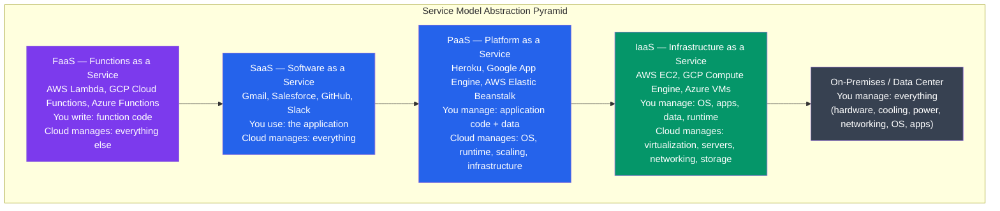

# Cloud Operating Systems

## Kya Seekhoge Is Tutorial Mein

Socho tumne apna khud ka data center kabhi nahi banaya, phir bhi tumhara app duniya bhar mein millions of users ko serve kar raha hai — ye jaadu nahi, cloud computing hai. Is tutorial mein hum dekhenge ki cloud computing kaise traditional OS concepts (process, scheduler, file system, memory manager) ko lekar unhe **hazaaron machines tak distribute** kar deta hai. Basically cloud ek "distributed OS" hai jo poore data center ko ek single computer ki tarah treat karta hai.

Cover karenge:

- Cloud computing models: IaaS, PaaS, SaaS, FaaS — kaun kya manage karta hai
- Cloud providers hypervisors kaise use karte hain (AWS Nitro, GCP KVM)
- Container orchestration cloud ka OS kaise ban gaya (Kubernetes control plane)
- Serverless: Lambda execution model aur cold starts ka pura scene
- Multi-tenancy aur tenant isolation — tumhara data doosre customer se kaise safe rehta hai
- Edge computing aur CDN OS concepts
- Unikernels: MirageOS, IncludeOS — minimal single-purpose VMs

**Time Required**: 50-60 minutes

---

## 1. Cloud Service Models

**Kya hota hai?** Cloud computing internet ke through computing resources deta hai, lekin alag-alag "abstraction levels" pe — matlab tum kitna khud manage karoge aur kitna cloud provider manage karega, ye level pe depend karta hai.

Isko samajhne ke liye Zomato ka example lo:
- **Khud restaurant chalana** (on-prem) — tumhe kitchen banana, staff hire karna, ingredients kharidna, delivery boys rakhna — sab khud karna hai.
- **Cloud kitchen rent pe lena (IaaS)** — kitchen space aur basic equipment mil gaya, lekin cooking, staff, menu sab tumhara.
- **Zomato ka platform use karna as a restaurant partner (PaaS jaisa)** — tum sirf khana banao, baaki (orders lena, payment, delivery) Zomato manage karta hai.
- **Zomato Gold jaisi ready service use karna (SaaS)** — tumhe kuch banana nahi, bas use karna hai.
- **Sirf ek dish deliver karwani hai on-demand (FaaS)** — tum sirf ek function likhte ho ("jab order aaye, ye dish bana do"), baaki sab infrastructure cloud sambhal leta hai.



### Detailed Model Comparison

Neeche wali table dekh — ye batati hai stack ke kis layer ko kaun manage karta hai. Jitna upar model jaata hai (IaaS → PaaS → SaaS/FaaS), utna kam kaam tumhe karna padta hai, lekin utna hi control bhi kam milta hai (trade-off yaad rakhna: **control vs convenience**).

```
What You Manage vs What Cloud Manages
=======================================

              On-Prem  IaaS    PaaS    SaaS/FaaS
Applications     YOU     YOU    YOU      Cloud
Data             YOU     YOU    YOU      Cloud
Runtime          YOU     YOU    Cloud    Cloud
Middleware       YOU     YOU    Cloud    Cloud
OS               YOU     YOU    Cloud    Cloud
Virtualization   YOU    Cloud   Cloud    Cloud
Servers          YOU    Cloud   Cloud    Cloud
Storage          YOU    Cloud   Cloud    Cloud
Networking       YOU    Cloud   Cloud    Cloud
Facilities       YOU    Cloud   Cloud    Cloud

IaaS use cases:
  - Lift-and-shift migrations (run existing VMs in cloud)
  - Custom OS/kernel requirements
  - Maximum control over infrastructure
  - Reserved/spot instances for cost optimization

PaaS use cases:
  - Web apps with auto-scaling (Heroku, App Engine)
  - Managed databases (RDS, Cloud SQL, Cosmos DB)
  - Develop faster without managing infrastructure

SaaS use cases:
  - End-user productivity tools (email, CRM, collaboration)
  - Pay per user/seat pricing

FaaS use cases:
  - Event-driven processing (image resizing, webhook handling)
  - Sporadic workloads (pay only when executing)
  - Microservices without servers
```

> [!tip]
> Interview mein agar poocha jaaye "IaaS vs PaaS vs SaaS mein difference batao" — seedha bol: "Jitna upar jaate ho pyramid mein, utna zyada cloud manage karta hai, utna kam tum manage karte ho." Fir example de do: EC2 (IaaS), Heroku (PaaS), Gmail (SaaS), Lambda (FaaS).

---

## 2. Hypervisors: Cloud Ki Foundation

**Kyun zaruri hai?** AWS, GCP jaise providers ek hi physical server pe hazaaron alag-alag customers ke VMs chalate hain. Socho ek building mein hazaaron flats hain (customers ke VMs), aur building ka structure (physical hardware) common hai — lekin har flat ka apna lock, apna space hai jisse ek flat wala doosre ke ghar mein nahi ghus sakta. Ye "lock" lagane ka kaam **hypervisor** karta hai.

### Type 1 vs Type 2 Hypervisors

Do tarah ke hypervisors hote hain:

```
Hypervisor Types
=================

Type 1 (Bare Metal):
  Hardware
  └── Hypervisor (runs directly on hardware)
      ├── VM 1 (Guest OS)
      ├── VM 2 (Guest OS)
      └── VM 3 (Guest OS)
  Examples: VMware ESXi, Microsoft Hyper-V, Xen, KVM (sort of)

Type 2 (Hosted):
  Hardware
  └── Host OS
      └── Hypervisor (runs as application)
          ├── VM 1 (Guest OS)
          └── VM 2 (Guest OS)
  Examples: VirtualBox, VMware Workstation, QEMU
  Use case: development/testing on laptops, not cloud production

KVM (Kernel-based Virtual Machine):
  Linux kernel module that turns the kernel into a Type 1 hypervisor
  Uses hardware virtualization (Intel VT-x, AMD-V)
  Guest VMs are processes from host OS perspective
  QEMU provides device emulation
  Used by: GCP, OpenStack, many cloud providers
```

Simple bhasha mein — Type 1 hypervisor **seedha hardware pe baithta hai** (jaise ek building manager jo directly building control karta hai), jabki Type 2 hypervisor ek **host OS ke andar chalne wali app** hai (jaise tum apne laptop pe VirtualBox chala rahe ho apne Windows/Mac ke upar). Production cloud mein hamesha Type 1 use hota hai kyunki extra layer nahi hai, so performance behtar hai.

**KVM** interesting hai — ye Linux kernel ka hi ek module hai jo poore Linux kernel ko hypervisor bana deta hai. Matlab tumhara normal Linux server, KVM module load hote hi, VMs chalane wala hypervisor ban jaata hai. GCP aur bahut saare cloud providers isi ko use karte hain kyunki ye open-source, battle-tested aur Linux ke saath deeply integrated hai.

### AWS Nitro System

**Problem kya thi?** Traditional hypervisor do kaam karta hai — (1) VM isolation aur (2) I/O virtualization (disk, network handle karna). Dono kaam ek hi jagah karne se hypervisor bahut bada aur complex ban jaata hai — jitna bada code, utna zyada attack surface. Aur ye I/O handling CPU cycles khaati hai, jo customer ko milne chahiye the.

AWS ne isko solve kiya **Nitro System** se — socho jaise ek restaurant mein waiter (CPU) sirf order lena aur serve karna kare, aur billing/security ka kaam ek alag dedicated counter (Nitro Card) sambhale, taaki waiter ka pura time customer ko serve karne mein jaaye.

```
AWS Nitro Architecture
=======================

Traditional hypervisor problem:
  Hypervisor handles VM isolation AND I/O virtualization
  → Hypervisor code is large, complex, potential attack surface
  → Hypervisor uses CPU cycles for I/O → less for customers

Nitro solution: offload hypervisor functions to dedicated hardware

Nitro Card (PCIe card in every Nitro host):
  - Nitro Security Chip: hardware-enforced isolation, attestation
  - Nitro I/O Card: VPC networking, EBS storage (offloaded from CPU)
  - Nitro Controller: manages cards, monitors hardware

Result:
  - Near bare-metal performance (hypervisor tax eliminated)
  - Smaller trusted computing base (less software to trust)
  - Hardware-enforced isolation between VMs
  - Bare Metal instances: customer gets direct hardware access
    (hypervisor still present but minimally involved)

Nitro Enclaves:
  - Isolated VM within a VM — no persistent storage, no networking
  - Only local socket to parent VM
  - Cryptographic attestation: verifiable identity + code hash
  - Used for: credential processing, ML inference on sensitive data
```

**Nitro Enclaves** ka use case samjho — socho tumhe credit card number process karna hai (jaise CRED ya Paytm karte hain). Tum us processing ko ek "isolated room" mein karna chahte ho jiska koi network access nahi, koi persistent storage nahi — sirf parent VM se ek socket se connect hai. Agar kisi ne main VM hack bhi kar liya, ye enclave phir bhi safe rehta hai. Ye highly sensitive data processing (payments, ML on private data) ke liye perfect hai.

### KVM Deep Dive (GCP Use Karta Hai)

Chalo thoda commands ke through dekhte hain KVM kaise kaam karta hai:

```bash
# KVM internals
# Guest VM is a regular Linux process using /dev/kvm

# Check KVM support
lsmod | grep kvm
# kvm_intel    315392  0    (or kvm_amd)
# kvm          970752  1 kvm_intel

ls -la /dev/kvm
# crw-rw---- 1 root kvm 10, 232 /dev/kvm

# Guest CPU modes:
# Guest runs in VMX non-root mode (Intel VT-x hardware feature)
# Privileged instructions → VM exits (trap to hypervisor)
# KVM handles: CPU virtualization
# QEMU handles: device emulation (disk, NIC, etc.)

# With virtio: guest uses paravirtual drivers (knows it's in VM)
# Dramatically reduces VM exits for I/O
# virtio-net, virtio-blk, virtio-scsi, virtio-gpu

# Nested virtualization (VM inside VM — for cloud dev)
cat /sys/module/kvm_intel/parameters/nested
# Y   ← nested virt enabled
```

Yahan pe interesting concept hai **"VM exit"** — jab guest VM ke andar koi privileged instruction (jaise disk access) chalta hai, CPU hypervisor ko trap karta hai (ye ek costly operation hai, jaise tumne kisi kaam ke liye manager ko bulaya). **virtio** drivers is trap ko kam karte hain kyunki guest OS ko pata hota hai "main VM ke andar hoon", to woh directly efficient tareeke se communicate karta hai — jaise tumhe pata ho ki tum Swiggy app use kar rahe ho (na ki restaurant khud call kar rahe ho), toh process fast ho jaata hai.

---

## 3. Kubernetes: Container Orchestration Cloud Ka OS

**Kya hota hai?** Kubernetes (K8s) ek distributed OS ki tarah kaam karta hai, lekin single machine ke liye nahi — poore **cluster of machines** ke liye. Jaise ek normal OS process ko schedule karta hai CPU pe, waise hi K8s ek "pod" (containers ka group) ko schedule karta hai kisi node (machine) pe.

Socho Swiggy ka delivery-dispatch system — thousands of orders (pods) aa rahe hain, aur system ko decide karna hai kaunsa order kaunse delivery boy (node) ko jaaye, based on delivery boy ki availability (resources). Agar koi delivery boy sick pad jaaye (node fail ho jaaye), system automatically uske orders kisi aur ko reassign kar deta hai. Yehi Kubernetes karta hai apne "Controller" logic se.

```
Kubernetes Control Plane (The "Kernel")
=========================================

etcd:                   Consistent key-value store — cluster state ("memory")
API Server:             REST API + auth/authz + admission control — "system call interface"
Scheduler:              Assigns pods to nodes based on resource constraints — "scheduler"
Controller Manager:     Control loops that maintain desired state — "process management"
  - ReplicaSet Controller: ensures N replicas running
  - Deployment Controller: rolling updates
  - Node Controller: detects node failures

Worker Node Components (The "User Space"):
kubelet:                Node agent — runs pods, reports status to API Server
kube-proxy:             Network rules for Service load balancing (iptables/eBPF)
Container Runtime:      Runs containers (containerd, CRI-O)

Scheduling analogy to OS:
  Pod = process (unit of execution)
  Node = CPU core (place to run)
  Namespace = OS namespace (isolation boundary)
  ResourceQuota = cgroup (resource limits per namespace)
  PersistentVolume = file system (persistent storage)
  Service = socket address (stable network endpoint)
  ConfigMap/Secret = environment variables / files
```

Analogy table pe dhyaan do — ye bahut kaam ki hai interview ke liye. Har Kubernetes concept ka ek direct OS equivalent hai:
- **etcd** — cluster ki "memory" hai, jahan poore cluster ka current state store hota hai (jaise OS RAM mein process table rakhta hai).
- **API Server** — ye "system call interface" hai. Har request (kubectl command ho ya controller ka internal call) isi se guzarta hai.
- **Scheduler** — decide karta hai kaunsa pod kis node pe jayega, based on resource availability. Bilkul CPU scheduler ki tarah, bas yahan "CPU core" ki jagah "machine" hai.
- **Controller Manager** — continuously check karta rehta hai "kya cluster ka actual state, desired state ke barabar hai?" Agar nahi, toh fix karta hai (jaise agar 3 replicas chahiye the aur ek crash ho gaya, ek naya spin up kar deta hai).

```yaml
# Pod spec — analogous to a process descriptor
apiVersion: v1
kind: Pod
spec:
  containers:
  - name: webserver
    image: nginx:1.25
    resources:
      requests:              # scheduler uses this for placement
        memory: "128Mi"      # minimum guaranteed memory
        cpu: "250m"          # 250 millicores = 0.25 CPU
      limits:                # cgroup limits enforced by kubelet
        memory: "256Mi"      # OOM kill if exceeded
        cpu: "500m"          # CPU throttled if exceeded
    securityContext:
      runAsNonRoot: true
      runAsUser: 1000
      readOnlyRootFilesystem: true
      capabilities:
        drop: ["ALL"]        # drop all Linux capabilities
        add: ["NET_BIND_SERVICE"]
```

Is YAML mein `requests` aur `limits` ka difference samajhna zaruri hai — **requests** batata hai "mujhe minimum itna guaranteed chahiye" (scheduler isi ko dekh ke decide karta hai kis node pe pod fit hoga), aur **limits** batata hai "isse zyada mat lene do" (agar memory limit cross ho gayi, OOM killer pod ko maar dega — bilkul jaise Linux OOM killer normal process ko maarta hai jab system memory khatam ho jaati hai).

```bash
# Kubernetes cluster operations
kubectl get nodes                  # list worker nodes
kubectl get pods --all-namespaces  # list all pods (processes)
kubectl top nodes                  # resource usage per node
kubectl top pods                   # resource usage per pod

# Scheduler decisions — why is a pod on this node?
kubectl describe pod mypod | grep -A5 Events:

# Resource quotas per namespace (cgroup equivalent)
kubectl describe resourcequota -n production

# Drain a node (evacuate pods for maintenance)
kubectl drain node1 --ignore-daemonsets
kubectl cordon node1   # prevent new pods from scheduling
```

> [!info]
> `kubectl drain` bilkul aisa hai jaise IRCTC train ko maintenance ke liye platform se hata ke saare passengers (pods) ko doosri train (node) mein shift kar de, aur `cordon` bol de "is platform pe naye passenger mat bhejo, jab tak maintenance khatam na ho."

---

## 4. Serverless: FaaS Aur AWS Lambda

**Serverless ka matlab servers nahi hai** — matlab ye hai ki **developer ko servers manage nahi karne padte**. Cloud OS sab kuch khud sambhal leta hai — provisioning, scaling, patching, sab.

Socho tumne UPI se koi payment split app banaya — tumhe har transaction ke liye ek naya server chalu rakhne ki zaroorat nahi. Bas ek function likh do "jab payment request aaye, ye calculation karo," aur AWS Lambda usko chala dega jab bhi trigger ho, aur jab traffic nahi hai toh koi resource waste nahi hoga.

### Lambda Execution Model

```
AWS Lambda Execution Flow
==========================

Cold Start (first invocation or after idle):
  1. Provision microVM (Firecracker VM — ~125ms boot)
  2. Download function code from S3
  3. Start language runtime (JVM, Node.js, Python, etc.)
  4. Load function code / initialization (your init code runs)
  5. Execute function handler
  ──────────────────────────────────────────────────────────
  Total cold start: 100ms (Go/Python) to 3-5s (JVM without SnapStart)

Warm invocation (reused execution environment):
  1. Reuse existing Firecracker microVM + runtime
  2. Execute function handler only
  ──────────────────────────────────────────────────────────
  Total: few milliseconds overhead

Execution environment lifecycle:
  INIT → INVOKE → INVOKE → INVOKE → ... → SHUTDOWN
              (reused for multiple invocations — minutes to hours)

  /tmp is persistent within an execution environment
  Global variables persist between invocations (dangerous if not designed for this)

Lambda Layers:
  - Shared dependencies uploaded once, referenced by multiple functions
  - Up to 5 layers, max 250MB unzipped
  - Mounted at /opt/

Lambda limitations:
  Timeout:       max 15 minutes
  Memory:        128MB to 10GB (CPU scales with memory)
  Ephemeral storage: /tmp up to 10GB
  Concurrency:   default 1000 per region (soft limit, can increase)
  Payload:       6MB synchronous, 256KB async
```

**Cold start** ka concept samjho ek Zomato analogy se — jab tum pehli baar naye restaurant se order karte ho jo abhi tak "active" nahi tha, restaurant ko pehle apna staff bulana padta hai, gas chulha on karna padta hai, tab jaake khana banna shuru hota hai — ye extra time hai "cold start." Lekin agar restaurant already active hai (recently order aaya tha), staff already ready hai, khana turant banna shuru ho jaata hai — ye "warm invocation" hai.

> [!warning]
> Lambda ke global variables **invocations ke beech persist** ho sakte hain (jab tak environment warm hai). Ye dangerous ho sakta hai agar tumne isko assume nahi kiya — jaise agar tum global variable mein user-specific data store kar rahe ho, next invocation (kisi doosre user ka) usi purani value ko dekh sakta hai. Isliye per-request state ko hamesha handler ke andar rakho, global scope mein sirf reusable cheezein (jaise DB connection) rakho.

### Firecracker: Serverless Ke Liye MicroVM

```
Firecracker Architecture
==========================

Firecracker (open source, written in Rust):
  - Minimal VMM (Virtual Machine Monitor) for AWS Lambda + Fargate
  - KVM-based microVMs with extremely small footprint
  - Boot time: ~125 milliseconds
  - Memory overhead per VM: ~5MB (vs ~100MB for QEMU)
  - Minimal device model: virtio-net, virtio-blk, serial, balloon
  - No BIOS, no PCI bus, no USB — just what's needed for a container
  - Jailer: drops all Linux capabilities before launching VMM

Firecracker vs containers (Docker):
  Containers:   share host kernel → process isolation only
  Firecracker:  separate kernel per VM → stronger isolation
                but near-container performance and startup time

Firecracker vs traditional VMs (QEMU):
  QEMU:         full device emulation, ~200 virtual devices, ~100ms boot (at best)
  Firecracker:  6 virtual devices, 125ms boot, 5MB overhead

Google uses gVisor (kernel in user space) for Cloud Run.
Microsoft uses Hyper-V isolated containers for Azure Functions.
```

Firecracker samajhne ka simple tareeka — ye ek "chota sa VM" hai jo sirf wahi cheezein include karta hai jo Lambda function chalane ke liye chahiye, baaki sab bekar cheez (BIOS, USB, PCI bus) hata di gayi hai. Isse VM ka boot time bahut kam ho jaata hai (~125ms) aur memory overhead bhi bahut kam (~5MB), jabki full VM ki tarah **strong isolation** bhi milti hai — matlab tumhe container jaisi speed aur VM jaisi security, dono ek saath.

### Cold Start Mitigation

```bash
# Lambda cold start strategies:

# 1. Provisioned Concurrency — keep N environments warm (costs money)
aws lambda put-provisioned-concurrency-config \
  --function-name MyFunction \
  --qualifier LIVE \
  --provisioned-concurrent-executions 10

# 2. Lambda SnapStart (Java) — snapshot initialized environment
# In SAM/CloudFormation:
# SnapStart:
#   ApplyOn: PublishedVersions

# 3. Choose faster runtime
# Cold start order (fastest to slowest):
#   Compiled (Rust, Go, C++) → ~50-100ms
#   Python, Node.js → ~100-500ms
#   Java (with SnapStart) → ~500ms
#   Java (without) → 2-5s

# 4. Minimize initialization code
# Move expensive init outside handler (runs once, then cached)
# BAD: opens DB connection every invocation
def handler(event, context):
    conn = db.connect()  # cold start every time
    return query(conn)

# GOOD: connection reused on warm invocations
conn = db.connect()  # runs only on cold start
def handler(event, context):
    return query(conn)

# 5. Keep function size small (faster code download)
# Python: use Lambda Layers for dependencies
# Node.js: tree-shake dependencies, use esbuild
```

Yahan pe **"BAD" vs "GOOD"** example dhyaan se dekh — ye ek bahut common mistake hai jo Node.js developers karte hain (tum khud bhi kar sakte ho). Agar tum DB connection handler ke **andar** khol rahe ho, har invocation pe naya connection banega, jo slow hai aur DB connections bhi waste karta hai. Connection ko handler ke **bahar** (module scope mein) khol do, taaki sirf cold start pe ek baar connect ho, aur warm invocations usi connection ko reuse karein — bilkul jaise ek call center agent har call pe naya phone connect nahi karta, wahi line use karta rehta hai.

---

## 5. Multi-Tenancy Aur Isolation

**Kyun zaruri hai?** Cloud providers millions of alag-alag customers ka code ek hi shared hardware pe chala rahe hain. Socho ek hi building mein Flipkart, Swiggy, aur tumhara personal side-project — sab ke servers same physical machine pe ho sakte hain (different VMs mein). Isolation ka matlab hai ki ek customer ka code/data kabhi doosre customer tak leak na ho, chahe woh accidentally ho ya koi hacker jaan-boojh kar try kare.

```
Isolation Layers in Cloud
==========================

Physical isolation:
  Dedicated hardware (e.g., EC2 Dedicated Hosts, GCP Sole-Tenant Nodes)
  Most expensive, used for compliance/security requirements

Hypervisor isolation:
  Standard VM: KVM/Nitro/Hyper-V provides memory + CPU isolation
  Hardware-enforced via IOMMU, EPT/NPT (nested page tables)
  Spectre/Meltdown era: microarchitectural attacks on shared CPU caches
  Mitigations: L1TF flush, MDS mitigations, process-specific page tables (PTI)

Container isolation (weaker):
  Linux namespaces + cgroups
  Shared kernel: kernel bugs affect all containers on host
  Not appropriate for hostile multi-tenant workloads

MicroVM isolation (middle ground):
  Firecracker, gVisor, Kata Containers
  Near-container performance + VM-level isolation
  Used by Lambda, GKE Sandbox, Cloud Run

Tenant data isolation:
  Encryption at rest: each tenant's data encrypted with different key
  VPC: tenant gets their own virtual network (no cross-tenant traffic)
  IAM: identity-based access control per account/tenant
  Hardware security modules (HSM): tenant keys in HSM, can't be extracted
```

Isolation ke levels ko ek building society ke security levels se samjho:
- **Physical isolation** — poora alag building hi le lo (dedicated hardware), sabse mehenga, koi shared risk nahi.
- **Hypervisor isolation** — same building, lekin har flat ka apna strong door aur lock (VM boundary), hardware-level protection.
- **Container isolation** — same flat mein alag-alag kamre (rooms), lekin ghar ka main gate (kernel) sab ke liye common hai — agar main gate ka lock toot gaya (kernel bug), sab kamre affected ho sakte hain.
- **MicroVM isolation** — beech ka rasta: chota kamra jaisa fast, lekin apna alag lock (kernel) bhi hai.

> [!warning]
> Spectre/Meltdown jaise attacks yaad rakhna — ye hardware-level bugs the jinhone shared CPU cache ka use karke ek VM se doosre VM ka data chura liya, bina kisi software vulnerability ke. Isliye "hypervisor isolation" bhi 100% foolproof nahi hai — hardware-level mitigations (jaise PTI, L1TF flush) bhi zaruri hain.

```bash
# AWS VPC — per-customer virtual network
# Each account gets an isolated VPC by default
# No traffic routes between VPCs without explicit peering

# GCP: projects provide tenant isolation boundary
# Azure: subscriptions provide tenant isolation

# Check instance metadata to understand isolation
# (only accessible from within the instance)
curl http://169.254.169.254/latest/meta-data/instance-id
curl http://169.254.169.254/latest/meta-data/placement/availability-zone

# Instance isolation verification tools
# AWS: inspector, trusted advisor
# Check for Spectre/Meltdown mitigations
grep . /sys/devices/system/cpu/vulnerabilities/*
```

---

## 6. Edge Computing Aur CDN OS

**Kya hota hai?** Edge computing cloud ki capabilities ko user ke **paas** le aata hai — matlab compute ab centralized data center mein nahi, balki network ke "edge" (border) pe, user ke geographically nazdeek chal raha hota hai. Isse latency drastically kam ho jaati hai.

Socho BigBasket ka warehouse model — agar ek hi central warehouse Mumbai mein ho aur poore India mein wahi se delivery ho, Delhi ke customer ko order aane mein bahut time lagega. Isliye BigBasket har city mein chote-chote local warehouses (dark stores) banata hai — order jaldi nazdeek se hi deliver ho jaata hai. Edge computing bhi yahi karta hai — computation ko user ke paas ke "mini data centers" (PoPs) mein le jaata hai.

```
Edge Computing Hierarchy
=========================

Cloud Region (centralized):
  Full compute, storage, databases
  Latency: 50-200ms from user
  Use case: complex processing, storage, AI training

Edge PoP (Point of Presence) / CDN Node:
  50-500 servers per city, ~300 locations globally
  Latency: 5-30ms from user
  CDN: cache static content, SSL termination
  Edge compute: lightweight functions, personalization, A/B testing
  Products: Cloudflare Workers, AWS CloudFront Functions,
            Fastly Compute@Edge, Vercel Edge Functions

Edge Device:
  IoT gateways, retail systems, factory controllers
  Latency: <1ms (local network)
  Use case: real-time control, offline operation, data filtering

CDN OS Concepts:
  - Content served from nearest PoP (Anycast routing)
  - Cache invalidation: distributed cache with TTL + purge API
  - Edge workers: V8 isolates (JavaScript/WASM) running at PoP
  - Global key-value stores (Cloudflare KV, Durable Objects)
  - No cold starts for edge workers (persistent V8 isolate per PoP)
```

**Edge workers** (jaise Cloudflare Workers) VM nahi hain, balki **V8 isolates** hain — matlab woh wahi engine hai jo Chrome browser mein JavaScript chalata hai, bas server pe multiple customers ke liye isolated instances mein chal raha hai. Isliye inka cold start almost zero hota hai — VM boot karne ki zaroorat hi nahi.

### Edge Functions vs Lambda

```javascript
// Cloudflare Worker — runs at the edge (V8 isolate, not a VM)
// No cold starts (~0ms), tiny memory limits (128MB), CPU time limits (50ms)
// Deployed globally to 300+ PoPs automatically

addEventListener('fetch', event => {
  event.respondWith(handleRequest(event.request))
})

async function handleRequest(request) {
  const url = new URL(request.url)

  // Geolocation available without extra API call (edge has this data)
  const country = request.cf.country
  const city = request.cf.city

  // Route based on user's location
  if (country === 'DE') {
    return fetch('https://eu-server.example.com' + url.pathname)
  }

  // A/B testing at the edge (no origin round trip needed)
  const variant = Math.random() < 0.5 ? 'A' : 'B'
  const response = await fetch(request)
  const newResponse = new Response(response.body, response)
  newResponse.headers.set('X-Variant', variant)
  return newResponse
}
```

Is code mein dekho — `request.cf.country` jaisi info edge pe **already available** hai, extra API call ki zaroorat nahi. Ye bilkul waise hai jaise Zomato app tumhari location already jaanta hai jab tum app kholte ho — koi extra network round-trip nahi lagta, isliye response bijli ki speed se aata hai.

---

## 7. Unikernels

**Kya hota hai?** Unikernels general-purpose OS ka bilkul opposite approach lete hain — ek **single-purpose VM** banao jisme sirf woh cheezein hon jo tumhara application actually use karta hai, aur kuch nahi. No shell, no SSH, no unused drivers.

Isko samjho aise — normal OS ek "full sabzi mandi" ki tarah hai jisme har tarah ki sabzi milti hai (chahe tumhe use karni ho ya na ho), jabki unikernel ek "sirf ek dish ka tiffin" hai — bas woh cheezein hain jo tumhari specific dish (application) ke liye chahiye, aur kuch nahi. Isse attack surface bahut kam ho jaata hai kyunki attacker ke paas exploit karne ke liye extra services hi nahi hain.

```
Traditional OS vs Unikernel vs Container
==========================================

Traditional VM:
┌─────────────────────────────────────────┐
│ App                                     │
│ Libraries (libc, OpenSSL, ...)          │
│ System services (sshd, cron, syslog...) │
│ Full OS (Linux/Windows) — ~100MB+      │
│ Hypervisor / Hardware                  │
└─────────────────────────────────────────┘
  Attack surface: massive. Many unused services.

Container:
┌─────────────────────────────────────────┐
│ App + Dependencies                      │
│ Base image (Ubuntu/Alpine — 5-100MB)   │
│ Shared host kernel (Linux)              │
│ Hypervisor / Hardware                  │
└─────────────────────────────────────────┘
  Smaller but shares host kernel.

Unikernel:
┌─────────────────────────────────────────┐
│ App + only needed library OS functions  │
│ No shell, no sshd, no unused syscalls  │
│ Single address space (no user/kernel)   │
│ Single process, compiled together      │ ← ~1-10MB total
│ Hypervisor / Hardware                  │
└─────────────────────────────────────────┘
  Tiny attack surface. No shell = no easy exploitation.
```

### MirageOS

MirageOS OCaml mein likha ek unikernel framework hai jo tumhari application aur zaruri OS components ko compile karke ek **single bootable VM image** bana deta hai.

```ocaml
(* MirageOS — unikernel framework in OCaml *)
(* Compiles application + OS into a single bootable VM image *)

(* Define what OS components you need in config.ml *)
open Mirage

let stack = generic_stackv4v6 default_network

let server =
  foreign "Unikernel.Main"
    (stackv4v6 @-> job)

let () =
  register "my-web-server" [server $ stack]

(* The resulting image:
   - Contains only networking stack, TLS, HTTP — nothing else
   - No shell, no package manager, no unused drivers
   - Boots in ~10ms
   - Image size: 2-5 MB
   - Cannot be "logged into" (no SSH)
*)
```

Notice karo — resulting image mein **SSH tak nahi hai**, matlab koi bhi login karke usme ghus hi nahi sakta. Ye security ke liye zabardast hai — tum credential-based attack ki chinta hi nahi karte kyunki login karne ka rasta hi exist nahi karta.

### IncludeOS

IncludeOS C++ mein likha ek aur unikernel framework hai — link-time pe sirf woh cheezein include hoti hain jo actually use ho rahi hain.

```cpp
// IncludeOS — C++ unikernel
// Include only what you use — everything else is excluded at link time
#include <os>
#include <net/interfaces.hpp>

void Service::start() {
    // Configure networking
    auto& inet = net::Interfaces::get(0);
    inet.network_config(
        { 10, 0, 0, 42 },    // IP address
        { 255, 255, 255, 0 }, // netmask
        { 10, 0, 0, 1 }       // gateway
    );

    // Start HTTP server
    auto& server = inet.tcp().listen(80);
    server.on_connect([](auto conn) {
        conn->on_read(1024, [conn](auto buf, size_t n) {
            std::string request(buf.get(), n);
            conn->write("HTTP/1.1 200 OK\r\nContent-Length: 5\r\n\r\nHello");
        });
    });

    printf("IncludeOS HTTP server running on port 80\n");
}

// Build output: ELF binary bootable as Xen/KVM VM
// No libc, no POSIX, no system calls — direct hardware/hypervisor access
// Image size: ~2 MB, Boot time: <10ms
```

Dhyaan do — is code mein **no libc, no POSIX, no system calls** likha hai. Matlab ye application seedha hardware/hypervisor ke saath baat karta hai, koi middle-man OS layer nahi hai. Isi wajah se boot time itna kam (<10ms) hai.

### Unikernel Use Cases Aur Limitations

```
Unikernel Tradeoffs
====================

Advantages:
  + Minimal attack surface (no shell, no unused services)
  + Extremely small image size (MB vs GB)
  + Fast boot (<100ms for KVM-based)
  + Single address space → no user/kernel mode switching overhead
  + Immutable infrastructure: redeploy instead of patch

Disadvantages:
  - Hard to debug (no shell, limited tooling)
  - Must recompile to change OS behavior
  - Library OS development requires expertise
  - Limited language support (OCaml, C++, Rust, Haskell)
  - Small ecosystem compared to Linux
  - Single process/address space: one bug crashes everything

Current adoption:
  MirageOS: DNS server, TLS reverse proxy, research
  IncludeOS: network function virtualization (NVF)
  Unikraft: active research project, POSIX-compatible unikernels
  Nanos (NanoVMs): run Linux binaries as unikernels (easier adoption)
  OSv: JVM unikernel for Java applications

Why containers "won" over unikernels:
  Docker solved the deployment workflow problem (build/ship/run)
  Containers work with existing tooling, languages, packages
  Unikernels require rebuilding the OS with the app → complex CI/CD
  Unikraft (2023) is the most promising path forward
```

**Interview ke liye important question**: "Unikernels itne secure aur fast hone ke bawajood containers itne popular kyun ho gaye?" Jawab hai — Docker ne sirf technology nahi, **workflow** solve kiya. Build-ship-run itna easy bana diya ki existing tools, languages, packages sab seamlessly kaam karte hain. Unikernels ke liye tumhe poora OS + app dobara compile karna padta hai — CI/CD pipeline complex ho jaata hai. Isliye Docker jeet gaya, chahe unikernels technically zyada secure/fast hon.

---

## 8. Cloud OS Abstraction Summary

Ab poori tasveer ek saath dekhte hain — cloud computing kaise traditional OS concepts ko distributed scale pe le gaya:

```
Cloud Computing as Distributed OS
===================================

OS Concept            Cloud Equivalent
─────────────────────────────────────────────────────────────
Process               Container / Function / VM
Thread                Goroutine / async task / Lambda concurrency
CPU scheduler         K8s scheduler + cloud autoscaler
Memory manager        Container memory limits + cloud RAM billing
File system           Object storage (S3, GCS) + block storage (EBS)
IPC                   Message queues (SQS, Pub/Sub), event buses
Network               VPC, service mesh (Istio, Linkerd)
System calls          Cloud APIs (AWS SDK, GCP client libraries)
Process supervisor    K8s controller manager, ECS service scheduler
Kernel                Hypervisor (Nitro, KVM)
Init system           Kubernetes (maintains desired state)
Package manager       Container registry (ECR, GCR, Docker Hub)
User management       IAM (roles, policies, service accounts)
Security              VPC, IAM, encryption, GuardDuty, Security Groups
```

Ye table baar-baar padho — ye poore tutorial ka essence hai. Har concept jo tumne single-machine OS mein seekha (process, scheduler, file system, IPC, kernel), cloud mein usi ka ek scaled-up, distributed version exist karta hai.

---

## Summary

| Cloud Model | OS Analogy | You Write | Cloud Manages |
|-------------|-----------|-----------|---------------|
| IaaS | Bare hardware + hypervisor | OS + App | Physical infra |
| PaaS | OS + runtime | App code | OS + runtime + scaling |
| SaaS | Full OS | Nothing | Everything |
| FaaS | Event-driven scheduler | Function | Infra + scaling + runtime |
| Edge | Distributed process scheduler | JS/WASM function | Network edge infra |
| Unikernel | Application IS the OS | App + OS lib | Hypervisor |

Cloud ne operating systems ko ek single machine pe chalne wale software se badal ke ek distributed system bana diya hai jo hazaaron servers mein failaya hua hai — jahan containers ne processes ki jagah li, object storage ne file systems ki jagah li, IAM ne user accounts ki jagah li, aur Kubernetes ne init system ki jagah le li.

## Key Takeaways

- Cloud service models (IaaS, PaaS, SaaS, FaaS) ka core difference sirf ek cheez hai — **kaun kya manage karta hai**. Jitna upar pyramid mein jaoge, utna kam tum manage karoge.
- Hypervisors (KVM, AWS Nitro) hi cloud ki foundation hain — ye ek hi hardware pe hazaaron isolated customer VMs chalane deti hain, hardware-enforced isolation ke saath.
- Kubernetes ek distributed OS hai jahan pod = process, node = CPU, namespace = isolation boundary — poora K8s control plane, ek traditional OS kernel ke concepts ka distributed version hai.
- Serverless (Lambda) mein cold start ek real cost hai — Firecracker microVMs isko minimize karte hain (~125ms boot), aur init code ko handler ke bahar rakhna best practice hai.
- Multi-tenancy security layers mein trade-off hai: physical isolation (mehenga, safest) se lekar container isolation (sasta, weaker) tak — MicroVMs (Firecracker, gVisor) beech ka sweet spot hain.
- Edge computing latency kam karta hai compute ko user ke geographically nazdeek le jaake — V8 isolates (jaise Cloudflare Workers) cold-start-free hote hain kyunki ye VM nahi, lightweight JS sandboxes hain.
- Unikernels technically superior (tiny attack surface, fast boot) hone ke bawajood adoption mein peeche reh gaye kyunki Docker ne deployment **workflow** solve kiya, na ki sirf technology.
