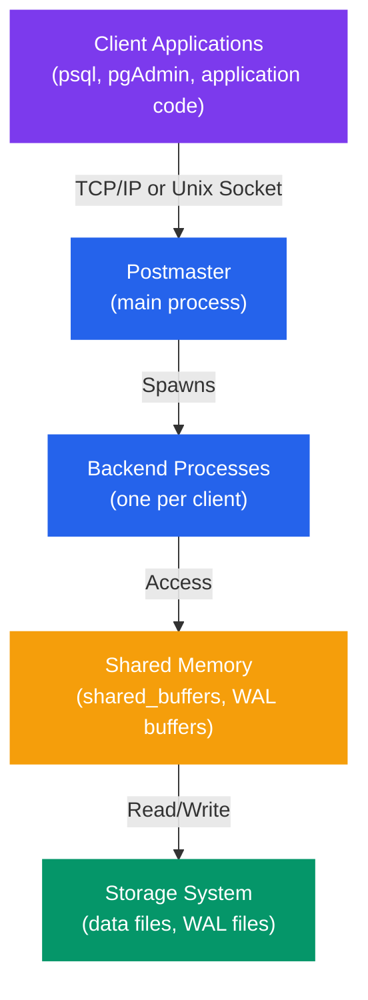
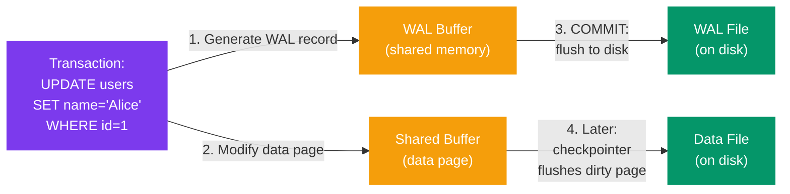

# PostgreSQL Architecture

## Overview

This module explores PostgreSQL's internal architecture, including the client/server model, processes, memory structures, Write-Ahead Logging (WAL), Multi-Version Concurrency Control (MVCC), and storage organization.

---

## Theory

### Client/Server Architecture

PostgreSQL uses a classic client/server architecture:



**Components:**
1. **Client**: Application that connects to PostgreSQL
2. **Postmaster**: Main server process that manages connections
3. **Backend Processes**: Individual processes handling client requests
4. **Shared Memory**: Memory shared between all backend processes
5. **Storage**: Physical files on disk

### Postmaster Process

The **postmaster** is the first process started when PostgreSQL starts. Its responsibilities include:

- Listening for incoming client connections (default port 5432)
- Spawning new backend processes for each client connection
- Managing background worker processes (autovacuum, stats collector, etc.)
- Coordinating server shutdown and startup
- Monitoring and respawning failed background processes

**Key Characteristics:**
- Only one postmaster runs per PostgreSQL instance
- Parent of all other PostgreSQL processes
- If postmaster dies, all backend processes are terminated

### Backend Processes

Each client connection gets its own dedicated **backend process** (also called "server process"):

**Responsibilities:**
- Execute SQL queries from the client
- Access shared memory and disk storage
- Manage transaction state for the client
- Enforce access control and permissions
- Communicate query results back to client

**Process Lifecycle:**
1. Client connects to postmaster
2. Postmaster spawns new backend process
3. Backend process handles all client requests
4. When client disconnects, backend process terminates

**Important Notes:**
- One-to-one relationship between clients and backend processes
- Each backend has its own process memory (work_mem, temp_buffers)
- Backends communicate via shared memory, not directly

### Background Processes

PostgreSQL runs several background processes:

| Process | Purpose |
|---------|---------|
| **Background Writer** | Writes dirty buffers from shared memory to disk |
| **Checkpointer** | Performs checkpoints (flushes all dirty pages to disk) |
| **WAL Writer** | Writes WAL records from WAL buffers to disk |
| **Autovacuum Launcher** | Starts autovacuum workers as needed |
| **Autovacuum Workers** | Clean up dead tuples and update statistics |
| **Stats Collector** | Collects database usage statistics |
| **Logical Replication Workers** | Handle logical replication (pub/sub) |
| **WAL Sender** | Sends WAL data to replicas (streaming replication) |
| **WAL Receiver** | Receives WAL data on replicas |

### Shared Memory

PostgreSQL uses shared memory for inter-process communication and caching:

#### 1. Shared Buffers (shared_buffers)

The most important shared memory area:

- **Purpose**: Cache frequently accessed data pages
- **Default Size**: 128 MB (too small for production)
- **Recommended**: 25% of system RAM (up to 8-16 GB)
- **Content**: Database pages (8 KB each by default)

**How It Works:**
1. Backend needs a data page
2. Checks shared buffers first
3. If found (cache hit): reads from memory
4. If not found (cache miss): reads from disk, loads into shared buffers
5. Modified pages marked "dirty" and eventually written to disk

#### 2. WAL Buffers (wal_buffers)

Buffer for Write-Ahead Log records:

- **Purpose**: Buffer WAL records before writing to disk
- **Default Size**: 1/32 of shared_buffers (max 16 MB)
- **Recommended**: 16 MB for most workloads
- **Content**: WAL records waiting to be written

#### 3. Other Shared Memory Areas

- **Lock Manager**: Tracks locks held by transactions
- **Transaction Status (CLOG)**: Commit status of transactions
- **Snapshot Data**: Current transaction snapshots for MVCC
- **Prepared Transactions**: Two-phase commit data

### Write-Ahead Logging (WAL)

WAL is fundamental to PostgreSQL's durability and crash recovery:

**Concept:**
- **"Write-Ahead"**: Changes are logged *before* data pages are modified
- All modifications first written to WAL, then to data files
- Ensures consistency after crashes

**WAL Workflow:**



```
Transaction: UPDATE users SET name = 'Alice' WHERE id = 1;

1. Generate WAL record describing the change
2. Write WAL record to WAL buffer (in shared memory)
3. Modify data page in shared buffer
4. Mark data page as "dirty"
5. On COMMIT:
   a. Flush WAL buffer to disk (WAL file)
   b. Transaction is now durable
6. Later (asynchronously):
   a. Checkpointer/background writer flushes dirty page to data file
```

**WAL Benefits:**
- **Crash Recovery**: Replay WAL to restore database to consistent state
- **Point-in-Time Recovery (PITR)**: Restore to any point using base backup + WAL
- **Replication**: Ship WAL to replicas for streaming replication
- **Performance**: Sequential WAL writes faster than random data file writes

**WAL Files:**
- Stored in `pg_wal/` directory (formerly `pg_xlog/`)
- Default size: 16 MB per segment
- Recycled (renamed) when no longer needed
- Archived for backup/PITR if configured

**Key Settings:**
```sql
-- Size of WAL buffers in shared memory
wal_buffers = '16MB'

-- Minimum number of WAL segments
min_wal_size = '1GB'

-- Maximum WAL size before forcing checkpoint
max_wal_size = '4GB'

-- WAL level (minimal, replica, logical)
wal_level = 'replica'

-- When to flush WAL to disk
wal_sync_method = 'fsync'  -- or fdatasync, open_sync
```

### Multi-Version Concurrency Control (MVCC)

MVCC allows multiple transactions to access the same data concurrently without locking:

**Core Concept:**
- Each transaction sees a **snapshot** of the database at a specific point in time
- Readers don't block writers, writers don't block readers
- Multiple versions of a row can exist simultaneously

**How It Works:**

Each tuple (row) has hidden system columns:
- **xmin**: Transaction ID that inserted the tuple
- **xmax**: Transaction ID that deleted/updated the tuple (0 if still valid)
- **ctid**: Physical location of the tuple

**Example Scenario:**
```
Time    Transaction 1               Transaction 2           Tuple Versions
────────────────────────────────────────────────────────────────────────────
T1      BEGIN;                                              id=1, name='Alice', xmin=100, xmax=0
        SELECT * FROM users
        WHERE id = 1;
        → sees: name='Alice'

T2                                  BEGIN;
                                    UPDATE users
                                    SET name='Bob'
                                    WHERE id = 1;
                                    (xid = 200)             id=1, name='Alice', xmin=100, xmax=200
                                                            id=1, name='Bob', xmin=200, xmax=0

T3      SELECT * FROM users
        WHERE id = 1;
        → still sees: name='Alice'
        (Transaction 200 not
        committed in T1's snapshot)

T4                                  COMMIT;                 Transaction 200 committed

T5      SELECT * FROM users
        WHERE id = 1;
        → still sees: name='Alice'
        (snapshot taken at BEGIN)

T6      COMMIT;
        BEGIN;
        SELECT * FROM users
        WHERE id = 1;
        → now sees: name='Bob'
        (new snapshot, sees committed data)
```

**MVCC Benefits:**
- High concurrency (minimal locking)
- Consistent reads without locking
- Automatic rollback (just mark transaction as aborted)

**MVCC Costs:**
- Multiple tuple versions consume space
- Dead tuples need cleanup (VACUUM)
- Transaction ID wraparound risk (requires periodic vacuuming)

### Vacuum

VACUUM is critical for MVCC maintenance:

**Purpose:**
1. **Remove Dead Tuples**: Clean up old tuple versions no longer visible to any transaction
2. **Update Statistics**: Keep query planner statistics current
3. **Prevent Transaction ID Wraparound**: Reset old transaction IDs
4. **Return Space**: Mark space as reusable (or return to OS with FULL)

**Types of Vacuum:**

**1. Regular VACUUM**
```sql
VACUUM;  -- All tables
VACUUM users;  -- Specific table
```
- Marks dead tuple space as reusable
- Doesn't return space to OS
- Can run concurrently with normal operations
- Typically fast

**2. VACUUM FULL**
```sql
VACUUM FULL users;
```
- Rewrites entire table, removing dead space
- Returns space to OS
- Requires exclusive lock (blocks all access)
- Much slower
- Rarely needed with proper autovacuum

**3. VACUUM ANALYZE**
```sql
VACUUM ANALYZE users;
```
- Performs VACUUM + ANALYZE
- Updates query planner statistics
- Recommended combination

**Autovacuum:**
PostgreSQL automatically runs vacuum via autovacuum daemon:

```sql
-- Enable autovacuum (on by default)
autovacuum = on

-- When to trigger autovacuum on a table
autovacuum_vacuum_threshold = 50  -- base threshold
autovacuum_vacuum_scale_factor = 0.2  -- 20% of table

-- Triggers when: dead_tuples > threshold + (scale_factor * table_size)
```

**Monitoring Vacuum:**
```sql
-- Check last vacuum/autovacuum times
SELECT
    schemaname,
    relname,
    last_vacuum,
    last_autovacuum,
    n_dead_tup,
    n_live_tup
FROM pg_stat_user_tables
ORDER BY n_dead_tup DESC;
```

### Storage Layout

#### Data Directory Structure

```
$PGDATA/
├── base/                   # Database files (one subdirectory per database)
│   ├── 1/                 # Template1 database
│   ├── 13000/            # Database OID 13000
│   │   ├── 16384         # Table/index file (OID 16384)
│   │   ├── 16384.1       # Continuation file if > 1GB
│   │   └── ...
│   └── ...
├── global/                # Cluster-wide tables (pg_database, etc.)
├── pg_wal/               # Write-Ahead Log files
│   ├── 000000010000000000000001
│   ├── 000000010000000000000002
│   └── ...
├── pg_logical/           # Logical replication status
├── pg_stat/              # Statistics files
├── pg_tblspc/            # Tablespace symbolic links
├── pg_xact/              # Transaction commit status (CLOG)
├── postgresql.conf       # Main configuration file
├── pg_hba.conf          # Client authentication configuration
├── pg_ident.conf        # User name mapping
└── postmaster.pid       # PID file (exists when server is running)
```

#### Tablespaces

Tablespaces allow storing database objects in different filesystem locations:

**Use Cases:**
- Place frequently accessed tables on fast SSD
- Move large historical data to slower, cheaper storage
- Separate indexes from tables for I/O optimization
- Work around filesystem size limits

**System Tablespaces:**
- **pg_default**: Default tablespace (in `$PGDATA/base/`)
- **pg_global**: Cluster-wide objects (in `$PGDATA/global/`)

#### Page Structure

PostgreSQL organizes data in fixed-size pages (default 8 KB):

```
Page (8 KB)
┌─────────────────────────────────────┐
│ Page Header (24 bytes)              │
│ - LSN, checksum, flags              │
├─────────────────────────────────────┤
│ Item Pointers (array)               │
│ - Offset and length for each tuple │
├─────────────────────────────────────┤
│ Free Space                          │
├─────────────────────────────────────┤
│ Tuples (actual row data)            │
│ - Stored from end, growing backward │
├─────────────────────────────────────┤
│ Special Space (for indexes)         │
└─────────────────────────────────────┘
```

**Key Points:**
- Each table/index is stored as one or more 8 KB pages
- Pages are the unit of I/O between disk and shared buffers
- Large tables split across multiple files (1 GB segments)

---

## Syntax

### Viewing Process Information

```sql
-- View active backend processes
SELECT pid, usename, application_name, client_addr, state, query
FROM pg_stat_activity;

-- View background processes (requires superuser or pg_read_all_stats role)
SELECT pid, backend_type
FROM pg_stat_activity
WHERE backend_type != 'client backend';
```

### Viewing Memory Configuration

```sql
-- View current memory settings
SHOW shared_buffers;
SHOW work_mem;
SHOW maintenance_work_mem;
SHOW wal_buffers;

-- View all memory-related settings
SELECT name, setting, unit, context
FROM pg_settings
WHERE name LIKE '%mem%' OR name LIKE '%buffer%'
ORDER BY name;
```

### WAL Configuration

```sql
-- View WAL settings
SHOW wal_level;
SHOW max_wal_size;
SHOW min_wal_size;
SHOW wal_buffers;

-- View current WAL location
SELECT pg_current_wal_lsn();

-- View WAL statistics
SELECT * FROM pg_stat_wal;
```

### VACUUM Syntax

```sql
VACUUM [ ( option [, ...] ) ] [ table_name [ (column_name [, ...]) ] ]
VACUUM [ FULL ] [ FREEZE ] [ VERBOSE ] [ ANALYZE ] [ table_name ]

Options:
    FULL [ boolean ]
    FREEZE [ boolean ]
    VERBOSE [ boolean ]
    ANALYZE [ boolean ]
    DISABLE_PAGE_SKIPPING [ boolean ]
    SKIP_LOCKED [ boolean ]
    INDEX_CLEANUP { AUTO | ON | OFF }
    TRUNCATE [ boolean ]
```

---

## Examples

### Example 1: Monitoring Backend Processes

```sql
-- View all active connections
SELECT
    pid,
    usename AS username,
    application_name,
    client_addr AS client_ip,
    client_port,
    backend_start,
    state,
    LEFT(query, 50) AS query_preview
FROM pg_stat_activity
WHERE state != 'idle'
ORDER BY backend_start;

-- Count connections by state
SELECT state, COUNT(*) AS count
FROM pg_stat_activity
GROUP BY state
ORDER BY count DESC;

-- Find long-running queries
SELECT
    pid,
    NOW() - query_start AS duration,
    usename,
    query
FROM pg_stat_activity
WHERE state = 'active'
  AND NOW() - query_start > INTERVAL '5 minutes'
ORDER BY duration DESC;

-- Kill a specific backend (use with caution)
-- SELECT pg_terminate_backend(12345);  -- Replace 12345 with actual PID

-- Cancel a running query (gentler than terminate)
-- SELECT pg_cancel_backend(12345);
```

**Sample Output:**
```
 pid  | username | application_name | client_ip | client_port |      backend_start      | state  |              query_preview
------+----------+------------------+-----------+-------------+-------------------------+--------+------------------------------------------
 1234 | postgres | psql             | 127.0.0.1 |       54321 | 2024-02-10 10:30:15.123 | active | SELECT * FROM large_table WHERE ...
 1235 | appuser  | myapp            | 10.0.1.5  |       43210 | 2024-02-10 10:31:22.456 | active | UPDATE orders SET status = 'shipped' ...
```

### Example 2: Understanding Shared Buffers

```sql
-- View shared buffer configuration
SELECT
    name,
    setting,
    unit,
    CASE
        WHEN unit = '8kB' THEN pg_size_pretty((setting::bigint * 8192)::bigint)
        ELSE setting || ' ' || COALESCE(unit, '')
    END AS human_readable
FROM pg_settings
WHERE name IN ('shared_buffers', 'effective_cache_size', 'work_mem', 'maintenance_work_mem');

-- Check shared buffer usage
CREATE EXTENSION IF NOT EXISTS pg_buffercache;

-- View what's in shared buffers
SELECT
    c.relname,
    COUNT(*) AS buffers,
    pg_size_pretty(COUNT(*) * 8192) AS size_in_cache
FROM pg_buffercache b
JOIN pg_class c ON b.relfilenode = pg_relation_filenode(c.oid)
WHERE b.reldatabase IN (0, (SELECT oid FROM pg_database WHERE datname = current_database()))
  AND b.usagecount > 0
GROUP BY c.relname
ORDER BY COUNT(*) DESC
LIMIT 20;

-- Buffer cache hit ratio (should be > 95%)
SELECT
    SUM(heap_blks_read) AS heap_read,
    SUM(heap_blks_hit) AS heap_hit,
    ROUND(SUM(heap_blks_hit) / NULLIF((SUM(heap_blks_hit) + SUM(heap_blks_read)), 0) * 100, 2) AS cache_hit_ratio
FROM pg_statio_user_tables;
```

**Sample Output:**
```
       name           | setting |  unit  | human_readable
----------------------+---------+--------+----------------
 shared_buffers       | 32768   | 8kB    | 256 MB
 effective_cache_size | 131072  | 8kB    | 1024 MB
 work_mem             | 4096    | kB     | 4096 kB
 maintenance_work_mem | 65536   | kB     | 65536 kB

       relname        | buffers | size_in_cache
----------------------+---------+---------------
 users                |     245 | 1960 kB
 orders               |     189 | 1512 kB
 products             |     156 | 1248 kB

 heap_read | heap_hit  | cache_hit_ratio
-----------+-----------+-----------------
     12345 | 1234567   |           99.01
```

### Example 3: WAL Monitoring and Management

```sql
-- View current WAL location and status
SELECT
    pg_current_wal_lsn() AS current_wal_location,
    pg_wal_lsn_diff(pg_current_wal_lsn(), '0/0') / 1024 / 1024 AS wal_mb_generated;

-- View WAL file information
SELECT
    name,
    setting,
    unit
FROM pg_settings
WHERE name LIKE 'wal%' OR name LIKE '%wal%'
ORDER BY name;

-- Check WAL generation rate
CREATE TABLE wal_stats AS
SELECT
    NOW() AS measurement_time,
    pg_current_wal_lsn() AS wal_lsn
FROM pg_stat_wal;

-- Wait a bit, then measure again
SELECT pg_sleep(60);  -- Wait 60 seconds

-- Calculate WAL generation rate
WITH current_wal AS (
    SELECT pg_current_wal_lsn() AS current_lsn
),
previous_wal AS (
    SELECT wal_lsn, measurement_time FROM wal_stats ORDER BY measurement_time DESC LIMIT 1
)
SELECT
    pg_wal_lsn_diff(c.current_lsn, p.wal_lsn) / 1024 / 1024 AS wal_mb_generated,
    EXTRACT(EPOCH FROM (NOW() - p.measurement_time)) AS seconds_elapsed,
    (pg_wal_lsn_diff(c.current_lsn, p.wal_lsn) / 1024 / 1024) /
        NULLIF(EXTRACT(EPOCH FROM (NOW() - p.measurement_time)), 0) AS mb_per_second
FROM current_wal c, previous_wal p;

-- List WAL files
SELECT
    name,
    size,
    modification
FROM pg_ls_waldir()
ORDER BY modification DESC
LIMIT 10;

-- Force a WAL checkpoint (use with caution)
-- CHECKPOINT;

-- View last checkpoint information
SELECT
    checkpoint_lsn,
    redo_lsn,
    timeline_id,
    checkpoint_time
FROM pg_control_checkpoint();
```

### Example 4: Understanding MVCC in Action

```sql
-- Create a test table
CREATE TABLE mvcc_demo (
    id SERIAL PRIMARY KEY,
    value TEXT,
    updated_at TIMESTAMP DEFAULT CURRENT_TIMESTAMP
);

INSERT INTO mvcc_demo (value) VALUES ('Original Value');

-- Enable showing system columns
-- In psql: \x for expanded display helps here

-- View tuple with system columns
SELECT
    id,
    value,
    xmin,  -- Transaction ID that inserted this tuple
    xmax,  -- Transaction ID that deleted/updated this tuple
    ctid   -- Physical location (page, tuple)
FROM mvcc_demo;

-- Expected output:
-- id | value           | xmin | xmax | ctid
-- ----+-----------------+------+------+-------
--  1 | Original Value  | 1000 |    0 | (0,1)

-- Start two transactions to demonstrate MVCC
-- In one terminal (Transaction 1):
BEGIN;
SELECT txid_current();  -- Note this transaction ID
SELECT id, value, xmin, xmax, ctid FROM mvcc_demo;
-- Don't commit yet!

-- In another terminal (Transaction 2):
BEGIN;
UPDATE mvcc_demo SET value = 'Updated Value' WHERE id = 1;
SELECT id, value, xmin, xmax, ctid FROM mvcc_demo;
COMMIT;

-- Back to Transaction 1:
-- This still sees the old value (due to MVCC)
SELECT id, value, xmin, xmax, ctid FROM mvcc_demo;
COMMIT;

-- After both commits, view the table again
SELECT id, value, xmin, xmax, ctid FROM mvcc_demo;

-- View dead tuples (old versions)
SELECT
    relname AS table_name,
    n_live_tup AS live_tuples,
    n_dead_tup AS dead_tuples,
    last_autovacuum
FROM pg_stat_user_tables
WHERE relname = 'mvcc_demo';

-- Clean up
DROP TABLE mvcc_demo;
```

### Example 5: VACUUM and Bloat Analysis

```sql
-- Create a table with some bloat
CREATE TABLE vacuum_demo (
    id SERIAL PRIMARY KEY,
    data TEXT
);

-- Insert 10,000 rows
INSERT INTO vacuum_demo (data)
SELECT 'Row ' || generate_series(1, 10000);

-- Check table size
SELECT
    pg_size_pretty(pg_total_relation_size('vacuum_demo')) AS total_size,
    pg_size_pretty(pg_relation_size('vacuum_demo')) AS table_size,
    pg_size_pretty(pg_indexes_size('vacuum_demo')) AS indexes_size;

-- Update all rows (creates dead tuples)
UPDATE vacuum_demo SET data = 'Updated ' || id;

-- Check bloat
SELECT
    relname AS table_name,
    n_live_tup AS live_tuples,
    n_dead_tup AS dead_tuples,
    ROUND(n_dead_tup::numeric / NULLIF(n_live_tup, 0) * 100, 2) AS dead_tuple_percent,
    pg_size_pretty(pg_relation_size(relid)) AS table_size
FROM pg_stat_user_tables
WHERE relname = 'vacuum_demo';

-- Run VACUUM
VACUUM VERBOSE vacuum_demo;

-- Check stats after VACUUM
SELECT
    relname AS table_name,
    n_live_tup AS live_tuples,
    n_dead_tup AS dead_tuples,
    last_vacuum,
    last_autovacuum
FROM pg_stat_user_tables
WHERE relname = 'vacuum_demo';

-- Update multiple times to create significant bloat
UPDATE vacuum_demo SET data = 'Update 2 - ' || id;
UPDATE vacuum_demo SET data = 'Update 3 - ' || id;
UPDATE vacuum_demo SET data = 'Update 4 - ' || id;

-- Check size again
SELECT
    pg_size_pretty(pg_relation_size('vacuum_demo')) AS table_size_before_full;

-- VACUUM FULL (rewrites entire table)
VACUUM FULL vacuum_demo;

-- Check size after VACUUM FULL
SELECT
    pg_size_pretty(pg_relation_size('vacuum_demo')) AS table_size_after_full;

-- Clean up
DROP TABLE vacuum_demo;
```

### Example 6: Exploring Tablespaces

```sql
-- List existing tablespaces
SELECT
    spcname AS tablespace_name,
    pg_catalog.pg_get_userbyid(spcowner) AS owner,
    pg_tablespace_location(oid) AS location
FROM pg_tablespace;

-- Create a custom tablespace (requires filesystem directory)
-- First, create directory on filesystem (as postgres user)
-- mkdir /mnt/fast_ssd/pg_tablespace
-- chown postgres:postgres /mnt/fast_ssd/pg_tablespace

-- Create tablespace pointing to that directory
-- CREATE TABLESPACE fast_storage LOCATION '/mnt/fast_ssd/pg_tablespace';

-- Create table in specific tablespace
-- CREATE TABLE important_data (
--     id SERIAL PRIMARY KEY,
--     data TEXT
-- ) TABLESPACE fast_storage;

-- Move existing table to different tablespace
-- ALTER TABLE existing_table SET TABLESPACE fast_storage;

-- View tablespace for each table
SELECT
    t.relname AS table_name,
    COALESCE(ts.spcname, 'pg_default') AS tablespace
FROM pg_class t
LEFT JOIN pg_tablespace ts ON t.reltablespace = ts.oid
WHERE t.relkind = 'r'  -- regular tables only
  AND t.relnamespace = (SELECT oid FROM pg_namespace WHERE nspname = 'public')
ORDER BY t.relname;

-- Check tablespace disk usage
SELECT
    spcname AS tablespace,
    pg_size_pretty(pg_tablespace_size(spcname)) AS size
FROM pg_tablespace
ORDER BY pg_tablespace_size(spcname) DESC;
```

---

## Common Mistakes

### Mistake 1: Setting shared_buffers Too Low

**Problem:**
```sql
-- Default setting (too low for production)
SHOW shared_buffers;
-- shared_buffers = 128MB
```

**Impact:**
- Frequent disk I/O
- Poor cache hit ratio
- Slow query performance

**Solution:**
```sql
-- Set shared_buffers to 25% of RAM (for dedicated database server)
-- Edit postgresql.conf:
-- shared_buffers = '4GB'  # For 16GB RAM server

-- Restart PostgreSQL to apply
-- sudo systemctl restart postgresql

-- Verify change
SHOW shared_buffers;

-- Monitor cache hit ratio (should be > 95%)
SELECT
    SUM(heap_blks_hit) AS heap_hit,
    SUM(heap_blks_read) AS heap_read,
    ROUND(SUM(heap_blks_hit) / NULLIF((SUM(heap_blks_hit) + SUM(heap_blks_read)), 0) * 100, 2) AS hit_ratio
FROM pg_statio_user_tables;
```

### Mistake 2: Ignoring Dead Tuples

**Problem:**
```sql
-- Check for tables with many dead tuples
SELECT
    relname,
    n_dead_tup,
    n_live_tup,
    ROUND(n_dead_tup::numeric / NULLIF(n_live_tup, 0) * 100, 2) AS dead_ratio
FROM pg_stat_user_tables
WHERE n_dead_tup > 1000
ORDER BY n_dead_tup DESC;

-- High dead tuple ratio = table bloat
```

**Impact:**
- Wasted disk space
- Slower queries (more pages to scan)
- Increased I/O

**Solution:**
```sql
-- Run VACUUM on bloated tables
VACUUM VERBOSE problematic_table;

-- Or VACUUM all tables
VACUUM;

-- Ensure autovacuum is enabled
SHOW autovacuum;  -- Should be 'on'

-- Tune autovacuum for busy tables
ALTER TABLE busy_table SET (
    autovacuum_vacuum_scale_factor = 0.1,  -- Vacuum at 10% change (vs default 20%)
    autovacuum_vacuum_threshold = 50
);
```

### Mistake 3: Not Monitoring WAL Growth

**Problem:**
```bash
# WAL directory growing uncontrollably
du -sh /var/lib/postgresql/16/main/pg_wal
# Output: 50G  /var/lib/postgresql/16/main/pg_wal
```

**Impact:**
- Disk space exhaustion
- Potential database shutdown
- Replication lag

**Solution:**
```sql
-- Check WAL settings
SHOW max_wal_size;
SHOW min_wal_size;

-- Adjust if needed (in postgresql.conf)
-- max_wal_size = '2GB'
-- min_wal_size = '512MB'

-- Check if archiving is stuck
SHOW archive_mode;
SHOW archive_command;

-- View WAL files
SELECT COUNT(*), pg_size_pretty(SUM(size)) AS total_size
FROM pg_ls_waldir();

-- Force checkpoint to clean up old WAL
CHECKPOINT;
```

### Mistake 4: Terminating Postmaster Instead of Graceful Shutdown

**Wrong:**
```bash
# Killing postmaster process directly
kill -9 <postmaster_pid>  # DANGEROUS!
```

**Impact:**
- Corrupted data files
- Long crash recovery on restart
- Lost transactions

**Correct:**
```bash
# Graceful shutdown methods:

# Smart shutdown (wait for clients to disconnect)
pg_ctl stop -D /var/lib/postgresql/16/main -m smart

# Fast shutdown (disconnect clients, rollback transactions)
pg_ctl stop -D /var/lib/postgresql/16/main -m fast

# Immediate shutdown (emergency, but safer than kill -9)
pg_ctl stop -D /var/lib/postgresql/16/main -m immediate

# Using systemctl (recommended on Linux)
sudo systemctl stop postgresql
```

### Mistake 5: Forgetting Transaction ID Wraparound

**Problem:**
```sql
-- Check transaction ID age
SELECT
    datname,
    age(datfrozenxid) AS xid_age,
    2000000000 - age(datfrozenxid) AS xids_until_wraparound
FROM pg_database
ORDER BY age(datfrozenxid) DESC;

-- If xid_age approaches 2 billion, trouble ahead!
```

**Impact:**
- Database shutdown to prevent data loss
- Emergency VACUUM FREEZE required

**Solution:**
```sql
-- Regular VACUUM prevents this
-- Autovacuum handles it automatically

-- For tables that haven't been vacuumed in a while
VACUUM FREEZE problematic_table;

-- Emergency fix (vacuum all databases)
vacuumdb --all --freeze

-- Monitor autovacuum is running
SELECT * FROM pg_stat_progress_vacuum;
```

---

## Best Practices

### 1. Configure Memory Appropriately

```sql
-- For dedicated database server with 16 GB RAM:

-- postgresql.conf settings:
shared_buffers = '4GB'                    -- 25% of RAM
effective_cache_size = '12GB'             -- 75% of RAM (just a hint)
work_mem = '16MB'                         -- Per-operation memory
maintenance_work_mem = '512MB'            -- For VACUUM, CREATE INDEX
wal_buffers = '16MB'                      -- WAL buffer size

-- Apply changes
SELECT pg_reload_conf();

-- Verify
SELECT name, setting, unit
FROM pg_settings
WHERE name IN ('shared_buffers', 'effective_cache_size', 'work_mem', 'maintenance_work_mem');
```

### 2. Monitor Key Metrics

```sql
-- Create monitoring queries

-- 1. Cache hit ratio (should be > 95%)
CREATE OR REPLACE VIEW cache_hit_ratio AS
SELECT
    'index hit rate' AS metric,
    ROUND(SUM(idx_blks_hit) / NULLIF(SUM(idx_blks_hit + idx_blks_read), 0) * 100, 2) AS percentage
FROM pg_statio_user_indexes
UNION ALL
SELECT
    'table hit rate',
    ROUND(SUM(heap_blks_hit) / NULLIF(SUM(heap_blks_hit + heap_blks_read), 0) * 100, 2)
FROM pg_statio_user_tables;

-- 2. Table bloat
CREATE OR REPLACE VIEW table_bloat AS
SELECT
    schemaname,
    tablename,
    n_live_tup,
    n_dead_tup,
    ROUND(n_dead_tup::numeric / NULLIF(n_live_tup, 0) * 100, 2) AS dead_ratio,
    last_vacuum,
    last_autovacuum
FROM pg_stat_user_tables
WHERE n_dead_tup > 1000
ORDER BY n_dead_tup DESC;

-- 3. Long-running queries
CREATE OR REPLACE VIEW long_running_queries AS
SELECT
    pid,
    NOW() - query_start AS duration,
    usename,
    state,
    LEFT(query, 100) AS query
FROM pg_stat_activity
WHERE state != 'idle'
  AND query_start IS NOT NULL
ORDER BY duration DESC;

-- Use them
SELECT * FROM cache_hit_ratio;
SELECT * FROM table_bloat;
SELECT * FROM long_running_queries;
```

### 3. Regular VACUUM Strategy

```sql
-- Let autovacuum do its job (enabled by default)
SHOW autovacuum;  -- Ensure it's 'on'

-- For critical tables, tune autovacuum
ALTER TABLE orders SET (
    autovacuum_vacuum_scale_factor = 0.05,    -- Vacuum at 5% change
    autovacuum_vacuum_threshold = 100,
    autovacuum_analyze_scale_factor = 0.02,   -- Analyze at 2% change
    autovacuum_analyze_threshold = 50
);

-- Manual VACUUM during maintenance windows
-- Run weekly during low-traffic periods
VACUUM ANALYZE;  -- All tables
```

### 4. WAL Configuration for Different Workloads

```sql
-- OLTP (many small transactions)
-- postgresql.conf:
wal_buffers = '16MB'
checkpoint_timeout = '15min'
max_wal_size = '2GB'
min_wal_size = '512MB'

-- Bulk loading / data warehouse
-- Temporarily adjust:
ALTER SYSTEM SET wal_buffers = '64MB';
ALTER SYSTEM SET checkpoint_timeout = '30min';
ALTER SYSTEM SET max_wal_size = '8GB';
SELECT pg_reload_conf();

-- After bulk load, revert to normal settings
```

### 5. Backup Strategy

```sql
-- Continuous archiving (WAL archiving)
-- postgresql.conf:
wal_level = 'replica'
archive_mode = on
archive_command = 'cp %p /mnt/backup/pg_wal/%f'

-- Or use pg_receivewal for streaming
-- pg_receivewal -D /mnt/backup/pg_wal -h localhost -U replicator

-- Regular base backups
-- Automated script:
-- pg_basebackup -D /mnt/backup/base -Ft -z -P

-- Point-in-time recovery enabled with base backup + WAL archives
```

---

## Practice Exercises

### Exercise 1: Process Monitoring

**Task:** Monitor PostgreSQL processes and understand their roles.

```sql
-- 1. View all PostgreSQL processes
SELECT
    pid,
    backend_type,
    CASE
        WHEN backend_type = 'client backend' THEN usename || ' - ' || COALESCE(application_name, 'unknown')
        ELSE backend_type
    END AS description,
    backend_start,
    state
FROM pg_stat_activity
ORDER BY backend_type, backend_start;

-- 2. Identify the postmaster PID
SHOW data_directory;
-- Look for postmaster.pid file

-- On Linux/macOS:
-- cat /var/lib/postgresql/16/main/postmaster.pid
-- First line is the PID

-- 3. Simulate load and observe new backend processes
-- Open multiple psql sessions
-- Run this in each:
SELECT pg_backend_pid(), current_user, application_name;

-- In another session, view all backends:
SELECT pid, usename, application_name, backend_start
FROM pg_stat_activity
WHERE backend_type = 'client backend'
ORDER BY backend_start DESC;

-- 4. Find and terminate a specific backend (your own)
SELECT pg_backend_pid();  -- Note your PID
-- From another session:
-- SELECT pg_cancel_backend(<your_pid>);
```

**Challenge:**
- Write a query to count how many backends each user has
- Identify which application has the most connections
- Find the oldest backend connection

### Exercise 2: Memory and Cache Analysis

**Task:** Analyze shared buffer usage and cache efficiency.

```sql
-- 1. Install pg_buffercache extension
CREATE EXTENSION IF NOT EXISTS pg_buffercache;

-- 2. Create test tables
CREATE TABLE cache_test_hot (
    id SERIAL PRIMARY KEY,
    data TEXT
);

CREATE TABLE cache_test_cold (
    id SERIAL PRIMARY KEY,
    data TEXT
);

-- 3. Insert data
INSERT INTO cache_test_hot (data)
SELECT 'Hot data ' || generate_series(1, 10000);

INSERT INTO cache_test_cold (data)
SELECT 'Cold data ' || generate_series(1, 10000);

-- 4. Access hot table repeatedly
SELECT COUNT(*) FROM cache_test_hot;
SELECT COUNT(*) FROM cache_test_hot;
SELECT COUNT(*) FROM cache_test_hot;

-- 5. Check which table is in shared buffers
SELECT
    c.relname,
    COUNT(*) AS buffers_used,
    pg_size_pretty(COUNT(*) * 8192) AS size_in_cache,
    ROUND(AVG(b.usagecount), 2) AS avg_usage_count
FROM pg_buffercache b
JOIN pg_class c ON b.relfilenode = pg_relation_filenode(c.oid)
WHERE c.relname IN ('cache_test_hot', 'cache_test_cold')
GROUP BY c.relname
ORDER BY buffers_used DESC;

-- 6. Calculate cache hit ratio for these tables
SELECT
    relname,
    heap_blks_read AS disk_reads,
    heap_blks_hit AS cache_hits,
    ROUND(heap_blks_hit::numeric / NULLIF(heap_blks_hit + heap_blks_read, 0) * 100, 2) AS hit_ratio
FROM pg_statio_user_tables
WHERE relname LIKE 'cache_test%';

-- 7. Clean up
DROP TABLE cache_test_hot, cache_test_cold;
DROP EXTENSION pg_buffercache;
```

**Expected Results:**
- cache_test_hot should have high buffer usage and cache hit ratio
- cache_test_cold should have lower cache presence

### Exercise 3: MVCC Demonstration

**Task:** Observe MVCC behavior with concurrent transactions.

```sql
-- Session 1: Create and populate table
CREATE TABLE mvcc_test (
    id INTEGER PRIMARY KEY,
    value TEXT,
    version INTEGER
);

INSERT INTO mvcc_test VALUES (1, 'Initial', 1);

-- View initial state with system columns
SELECT
    id, value, version,
    xmin AS created_by_xid,
    xmax AS deleted_by_xid,
    ctid AS physical_location
FROM mvcc_test;

-- Session 1: Start transaction
BEGIN TRANSACTION ISOLATION LEVEL READ COMMITTED;
SELECT txid_current() AS my_transaction_id;  -- Note this
SELECT * FROM mvcc_test WHERE id = 1;

-- Session 2: Update the row (in a new terminal/connection)
BEGIN;
SELECT txid_current() AS my_transaction_id;  -- Different from Session 1
UPDATE mvcc_test SET value = 'Updated by Session 2', version = 2 WHERE id = 1;
SELECT * FROM mvcc_test WHERE id = 1;
-- See the update
COMMIT;

-- Session 1: Read again (still in transaction)
SELECT * FROM mvcc_test WHERE id = 1;
-- With READ COMMITTED, you see the new data
-- With REPEATABLE READ, you'd still see old data

-- View system columns to see multiple versions
SELECT
    id, value, version,
    xmin, xmax, ctid
FROM mvcc_test WHERE id = 1;

COMMIT;

-- Check for dead tuples
SELECT
    relname,
    n_live_tup,
    n_dead_tup
FROM pg_stat_user_tables
WHERE relname = 'mvcc_test';

-- Clean up
VACUUM mvcc_test;

SELECT n_live_tup, n_dead_tup
FROM pg_stat_user_tables
WHERE relname = 'mvcc_test';

DROP TABLE mvcc_test;
```

**Challenge:**
- Try with REPEATABLE READ isolation level
- Create a scenario with 3 concurrent transactions
- Observe when dead tuples are created

---

## Summary

Key architecture concepts:
- PostgreSQL uses a process-per-connection model with postmaster and backend processes
- Shared memory (shared_buffers, WAL buffers) is critical for performance
- WAL provides durability and enables crash recovery and replication
- MVCC allows high concurrency without read locks
- VACUUM is essential for reclaiming space from dead tuples
- Storage is organized in tablespaces, databases, and 8KB pages

**Next Steps:**
- [Databases and Schemas](./04-databases-schemas.md) - Organize your data effectively
- [psql Commands](./05-psql-commands.md) - Master the command-line interface

---

## Additional Resources

- PostgreSQL Internals: https://www.postgresql.org/docs/current/internals.html
- The Internals of PostgreSQL: http://www.interdb.jp/pg/
- WAL Explained: https://www.postgresql.org/docs/current/wal-intro.html
- MVCC Introduction: https://www.postgresql.org/docs/current/mvcc-intro.html

---

**Module:** 01-Fundamentals | **Previous:** [Installation and Setup](./02-installation-setup.md) | **Next:** [Databases and Schemas](./04-databases-schemas.md)
