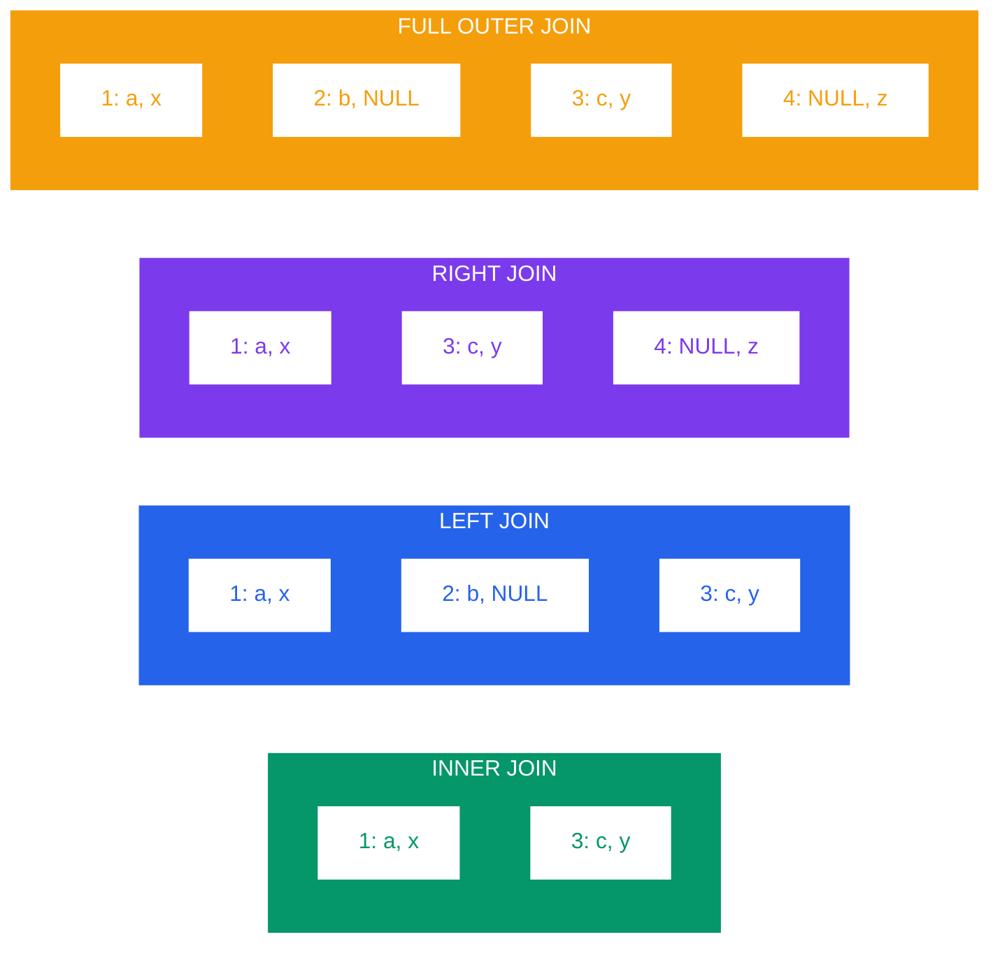

# Joins in PostgreSQL

## Table of Contents
- [Theory](#theory)
- [Syntax](#syntax)
- [Examples](#examples)
- [Common Mistakes](#common-mistakes)
- [Best Practices](#best-practices)
- [Practice Exercises](#practice-exercises)

## Theory

### What are Joins?

Joins combine rows from two or more tables based on related columns between them. They are fundamental to relational databases and allow you to query normalized data across multiple tables.

### Visual Representation of Join Types



**JOIN Results:**
Result: 9 rows (every A row with every B row)
```

### Types of Joins

1. **INNER JOIN**: Returns only matching rows from both tables
2. **LEFT JOIN (LEFT OUTER JOIN)**: Returns all rows from left table, matching rows from right (NULL if no match)
3. **RIGHT JOIN (RIGHT OUTER JOIN)**: Returns all rows from right table, matching rows from left (NULL if no match)
4. **FULL OUTER JOIN**: Returns all rows from both tables (NULL where no match)
5. **CROSS JOIN**: Returns Cartesian product (every row from A with every row from B)
6. **NATURAL JOIN**: Joins on all columns with same names (avoid in production)
7. **SELF JOIN**: Table joined with itself

### Join Conditions: ON vs USING

- **ON**: Explicit condition, allows any comparison
- **USING**: Shorthand for equi-joins on same-named columns

### Performance Considerations

- Join order matters for multi-table joins
- Indexes on join columns dramatically improve performance
- PostgreSQL query planner optimizes join order automatically
- Small tables should typically be joined first (but planner handles this)
- Hash joins for large equi-joins, nested loop for small tables, merge join for sorted data

## Syntax

### INNER JOIN

```sql
-- ON clause
SELECT columns
FROM table1
INNER JOIN table2 ON table1.column = table2.column;

-- USING clause (when column names match)
SELECT columns
FROM table1
INNER JOIN table2 USING (column);

-- Short form (implicit inner join)
SELECT columns
FROM table1, table2
WHERE table1.column = table2.column;  -- Avoid this style
```

### LEFT JOIN (LEFT OUTER JOIN)

```sql
SELECT columns
FROM table1
LEFT JOIN table2 ON table1.column = table2.column;

-- Find unmatched rows
SELECT columns
FROM table1
LEFT JOIN table2 ON table1.column = table2.column
WHERE table2.column IS NULL;
```

### RIGHT JOIN (RIGHT OUTER JOIN)

```sql
SELECT columns
FROM table1
RIGHT JOIN table2 ON table1.column = table2.column;

-- Note: RIGHT JOIN is less common; usually rewrite as LEFT JOIN
```

### FULL OUTER JOIN

```sql
SELECT columns
FROM table1
FULL OUTER JOIN table2 ON table1.column = table2.column;

-- Find rows that don't match in either table
WHERE table1.column IS NULL OR table2.column IS NULL;
```

### CROSS JOIN

```sql
-- Explicit syntax
SELECT columns
FROM table1
CROSS JOIN table2;

-- Implicit syntax
SELECT columns
FROM table1, table2;
```

### NATURAL JOIN

```sql
-- Joins on all columns with matching names
SELECT columns
FROM table1
NATURAL JOIN table2;

-- Avoid in production code!
```

### Self Join

```sql
SELECT a.column1, b.column2
FROM table1 a
JOIN table1 b ON a.id = b.parent_id;
```

### Multiple Joins

```sql
SELECT columns
FROM table1
JOIN table2 ON table1.id = table2.table1_id
JOIN table3 ON table2.id = table3.table2_id
LEFT JOIN table4 ON table3.id = table4.table3_id;
```

## Examples

### Setup Tables

```sql
-- Create sample tables for demonstrations
CREATE TABLE departments (
    department_id SERIAL PRIMARY KEY,
    department_name VARCHAR(100) NOT NULL,
    location VARCHAR(100)
);

CREATE TABLE employees (
    employee_id SERIAL PRIMARY KEY,
    employee_name VARCHAR(100) NOT NULL,
    department_id INTEGER REFERENCES departments(department_id),
    manager_id INTEGER REFERENCES employees(employee_id),
    salary NUMERIC(10, 2),
    hire_date DATE
);

CREATE TABLE projects (
    project_id SERIAL PRIMARY KEY,
    project_name VARCHAR(100) NOT NULL,
    budget NUMERIC(12, 2)
);

CREATE TABLE employee_projects (
    employee_id INTEGER REFERENCES employees(employee_id),
    project_id INTEGER REFERENCES projects(project_id),
    role VARCHAR(50),
    hours_allocated INTEGER,
    PRIMARY KEY (employee_id, project_id)
);

-- Insert sample data
INSERT INTO departments (department_name, location) VALUES
    ('Engineering', 'San Francisco'),
    ('Marketing', 'New York'),
    ('Sales', 'Chicago'),
    ('HR', 'San Francisco'),
    ('Finance', 'New York');

INSERT INTO employees (employee_name, department_id, manager_id, salary, hire_date) VALUES
    ('Alice Johnson', 1, NULL, 150000, '2020-01-15'),
    ('Bob Smith', 1, 1, 120000, '2020-03-20'),
    ('Carol White', 2, 1, 95000, '2021-02-10'),
    ('David Brown', 1, 2, 105000, '2021-06-01'),
    ('Eve Davis', 2, 3, 85000, '2022-01-15'),
    ('Frank Miller', 3, 1, 90000, '2020-08-10'),
    ('Grace Lee', NULL, NULL, 80000, '2023-03-01');  -- No department

INSERT INTO projects (project_name, budget) VALUES
    ('Website Redesign', 500000),
    ('Mobile App', 750000),
    ('Data Migration', 300000),
    ('Marketing Campaign', 200000);

INSERT INTO employee_projects (employee_id, project_id, role, hours_allocated) VALUES
    (1, 1, 'Lead', 160),
    (2, 1, 'Developer', 320),
    (2, 2, 'Developer', 160),
    (4, 2, 'Developer', 320),
    (3, 4, 'Manager', 120),
    (5, 4, 'Coordinator', 200);
```

### Example 1: INNER JOIN - Basic Employee-Department Join

```sql
-- Show employees with their department names
SELECT
    e.employee_name,
    e.salary,
    d.department_name,
    d.location
FROM employees e
INNER JOIN departments d ON e.department_id = d.department_id
ORDER BY e.employee_name;

/*
Result: Shows 6 employees (Grace Lee excluded - no department)
employee_name  | salary    | department_name | location
---------------+-----------+-----------------+--------------
Alice Johnson  | 150000.00 | Engineering     | San Francisco
Bob Smith      | 120000.00 | Engineering     | San Francisco
Carol White    | 95000.00  | Marketing       | New York
David Brown    | 105000.00 | Engineering     | San Francisco
Eve Davis      | 85000.00  | Marketing       | New York
Frank Miller   | 90000.00  | Sales           | Chicago
*/
```

### Example 2: LEFT JOIN - Include All Employees

```sql
-- Show all employees, even those without departments
SELECT
    e.employee_name,
    e.salary,
    COALESCE(d.department_name, 'Unassigned') as department,
    d.location
FROM employees e
LEFT JOIN departments d ON e.department_id = d.department_id
ORDER BY d.department_name NULLS LAST, e.employee_name;

/*
Result: Shows all 7 employees, Grace Lee has NULL location
Alice Johnson  | 150000.00 | Engineering     | San Francisco
Bob Smith      | 120000.00 | Engineering     | San Francisco
David Brown    | 105000.00 | Engineering     | San Francisco
Carol White    | 95000.00  | Marketing       | New York
Eve Davis      | 85000.00  | Marketing       | New York
Frank Miller   | 90000.00  | Sales           | Chicago
Grace Lee      | 80000.00  | Unassigned      | NULL
*/
```

### Example 3: LEFT JOIN - Find Unmatched Rows

```sql
-- Find employees without departments
SELECT
    e.employee_id,
    e.employee_name,
    e.salary
FROM employees e
LEFT JOIN departments d ON e.department_id = d.department_id
WHERE d.department_id IS NULL;

/*
Result:
employee_id | employee_name | salary
------------+---------------+---------
7           | Grace Lee     | 80000.00
*/

-- Find departments with no employees
SELECT
    d.department_id,
    d.department_name
FROM departments d
LEFT JOIN employees e ON d.department_id = e.department_id
WHERE e.employee_id IS NULL;

/*
Result:
department_id | department_name
--------------+----------------
4             | HR
5             | Finance
*/
```

### Example 4: FULL OUTER JOIN - Show All Mismatches

```sql
-- Show all employees and departments, highlighting unmatched
SELECT
    e.employee_name,
    d.department_name,
    CASE
        WHEN e.employee_id IS NULL THEN 'No employees'
        WHEN d.department_id IS NULL THEN 'No department'
        ELSE 'Matched'
    END as status
FROM employees e
FULL OUTER JOIN departments d ON e.department_id = d.department_id
WHERE e.employee_id IS NULL OR d.department_id IS NULL
ORDER BY status;

/*
Result:
employee_name | department_name | status
--------------+-----------------+---------------
Grace Lee     | NULL            | No department
NULL          | Finance         | No employees
NULL          | HR              | No employees
*/
```

### Example 5: CROSS JOIN - Generate Combinations

```sql
-- Generate all possible employee-project combinations (for analysis)
SELECT
    e.employee_name,
    p.project_name
FROM employees e
CROSS JOIN projects p
WHERE e.department_id = 1  -- Just Engineering for brevity
ORDER BY e.employee_name, p.project_name
LIMIT 8;

/*
Result: Each engineer paired with each project
employee_name  | project_name
---------------+------------------
Alice Johnson  | Data Migration
Alice Johnson  | Marketing Campaign
Alice Johnson  | Mobile App
Alice Johnson  | Website Redesign
Bob Smith      | Data Migration
Bob Smith      | Marketing Campaign
Bob Smith      | Mobile App
Bob Smith      | Website Redesign
*/
```

### Example 6: Self Join - Employee-Manager Relationship

```sql
-- Show employees with their managers
SELECT
    e.employee_name as employee,
    e.salary as employee_salary,
    m.employee_name as manager,
    m.salary as manager_salary
FROM employees e
LEFT JOIN employees m ON e.manager_id = m.employee_id
ORDER BY m.employee_name NULLS FIRST, e.employee_name;

/*
Result:
employee      | employee_salary | manager       | manager_salary
--------------+-----------------+---------------+----------------
Alice Johnson | 150000.00       | NULL          | NULL
Grace Lee     | 80000.00        | NULL          | NULL
Bob Smith     | 120000.00       | Alice Johnson | 150000.00
Carol White   | 95000.00        | Alice Johnson | 150000.00
Frank Miller  | 90000.00        | Alice Johnson | 150000.00
David Brown   | 105000.00       | Bob Smith     | 120000.00
Eve Davis     | 85000.00        | Carol White   | 95000.00
*/
```

### Example 7: Multiple Joins - Complete Project Assignment View

```sql
-- Show complete project assignments with all details
SELECT
    p.project_name,
    p.budget,
    e.employee_name,
    d.department_name,
    ep.role,
    ep.hours_allocated
FROM projects p
INNER JOIN employee_projects ep ON p.project_id = ep.project_id
INNER JOIN employees e ON ep.employee_id = e.employee_id
LEFT JOIN departments d ON e.department_id = d.department_id
ORDER BY p.project_name, e.employee_name;

/*
Result:
project_name        | budget    | employee_name | department_name | role        | hours_allocated
--------------------+-----------+---------------+-----------------+-------------+----------------
Marketing Campaign  | 200000.00 | Carol White   | Marketing       | Manager     | 120
Marketing Campaign  | 200000.00 | Eve Davis     | Marketing       | Coordinator | 200
Mobile App          | 750000.00 | Bob Smith     | Engineering     | Developer   | 160
Mobile App          | 750000.00 | David Brown   | Engineering     | Developer   | 320
Website Redesign    | 500000.00 | Alice Johnson | Engineering     | Lead        | 160
Website Redesign    | 500000.00 | Bob Smith     | Engineering     | Developer   | 320
*/
```

### Example 8: USING Clause - Cleaner Syntax

```sql
-- When column names match, USING is cleaner
-- First, let's create a view to demonstrate
CREATE TEMP VIEW employee_dept AS
SELECT
    e.employee_id,
    e.employee_name,
    e.department_id,
    d.department_name
FROM employees e
JOIN departments d USING (department_id);

-- Now join with employee_projects
SELECT
    ed.employee_name,
    ed.department_name,
    p.project_name,
    ep.role
FROM employee_dept ed
JOIN employee_projects ep USING (employee_id)
JOIN projects p USING (project_id)
ORDER BY ed.employee_name;

/*
Result:
employee_name  | department_name | project_name        | role
---------------+-----------------+---------------------+-------------
Alice Johnson  | Engineering     | Website Redesign    | Lead
Bob Smith      | Engineering     | Mobile App          | Developer
Bob Smith      | Engineering     | Website Redesign    | Developer
Carol White    | Marketing       | Marketing Campaign  | Manager
David Brown    | Engineering     | Mobile App          | Developer
Eve Davis      | Marketing       | Marketing Campaign  | Coordinator
*/
```

### Example 9: Multiple Join Conditions

```sql
-- Join with multiple conditions for complex relationships
SELECT
    e1.employee_name as employee,
    e2.employee_name as colleague,
    d.department_name
FROM employees e1
JOIN employees e2 ON e1.department_id = e2.department_id
                 AND e1.employee_id < e2.employee_id  -- Avoid duplicates
JOIN departments d ON e1.department_id = d.department_id
ORDER BY d.department_name, e1.employee_name;

/*
Result: Shows colleagues in same department
employee      | colleague     | department_name
--------------+---------------+----------------
Alice Johnson | Bob Smith     | Engineering
Alice Johnson | David Brown   | Engineering
Bob Smith     | David Brown   | Engineering
Carol White   | Eve Davis     | Marketing
*/
```

### Example 10: Join Performance - Analyzing Query Plans

```sql
-- Without index on join column
EXPLAIN ANALYZE
SELECT e.employee_name, d.department_name
FROM employees e
JOIN departments d ON e.department_id = d.department_id;

/*
Shows execution plan with timing
Hash Join or Nested Loop depending on table sizes
*/

-- Create index for better performance
CREATE INDEX idx_employees_department ON employees(department_id);

-- Same query will now use index scan
EXPLAIN ANALYZE
SELECT e.employee_name, d.department_name
FROM employees e
JOIN departments d ON e.department_id = d.department_id;
```

## Common Mistakes

### 1. Confusing INNER JOIN with LEFT JOIN

```sql
-- WRONG: Using INNER JOIN when you need all rows from left table
SELECT e.employee_name, d.department_name
FROM employees e
INNER JOIN departments d ON e.department_id = d.department_id;
-- Missing: Grace Lee (no department)

-- CORRECT: Use LEFT JOIN to include all employees
SELECT e.employee_name, d.department_name
FROM employees e
LEFT JOIN departments d ON e.department_id = d.department_id;
```

### 2. Using NATURAL JOIN in Production

```sql
-- DANGEROUS: Column names might change, breaking query silently
SELECT *
FROM employees
NATURAL JOIN departments;
-- If columns change, join condition changes unexpectedly

-- SAFE: Explicit join condition
SELECT *
FROM employees e
JOIN departments d ON e.department_id = d.department_id;
```

### 3. Forgetting NULL Checks with Outer Joins

```sql
-- WRONG: WHERE clause converts LEFT JOIN to INNER JOIN
SELECT e.employee_name, d.department_name
FROM employees e
LEFT JOIN departments d ON e.department_id = d.department_id
WHERE d.location = 'New York';
-- Filters out employees with NULL department

-- CORRECT: Use AND in JOIN or handle NULLs
SELECT e.employee_name, d.department_name
FROM employees e
LEFT JOIN departments d ON e.department_id = d.department_id
                        AND d.location = 'New York';
```

### 4. Accidental CROSS JOIN

```sql
-- WRONG: Forgot join condition = CROSS JOIN
SELECT e.employee_name, d.department_name
FROM employees e, departments d;
-- Returns 7 * 5 = 35 rows instead of 6

-- CORRECT: Always specify join condition
SELECT e.employee_name, d.department_name
FROM employees e
JOIN departments d ON e.department_id = d.department_id;
```

### 5. Wrong Join Order in Multi-Table Joins

```sql
-- CONFUSING: Poor readability
SELECT p.project_name, e.employee_name, d.department_name
FROM employee_projects ep
JOIN projects p ON ep.project_id = p.project_id
JOIN employees e ON ep.employee_id = e.employee_id
JOIN departments d ON e.department_id = d.department_id;

-- BETTER: Logical order (main entity first)
SELECT p.project_name, e.employee_name, d.department_name
FROM projects p
JOIN employee_projects ep ON p.project_id = ep.project_id
JOIN employees e ON ep.employee_id = e.employee_id
JOIN departments d ON e.department_id = d.department_id;
```

## Best Practices

### 1. Always Use Explicit JOIN Syntax

```sql
-- AVOID: Implicit joins
SELECT e.employee_name, d.department_name
FROM employees e, departments d
WHERE e.department_id = d.department_id;

-- PREFER: Explicit JOIN keyword
SELECT e.employee_name, d.department_name
FROM employees e
JOIN departments d ON e.department_id = d.department_id;
```

### 2. Use Table Aliases for Readability

```sql
-- Use short, meaningful aliases
SELECT
    e.employee_name,
    d.department_name,
    m.employee_name as manager_name
FROM employees e
JOIN departments d ON e.department_id = d.department_id
LEFT JOIN employees m ON e.manager_id = m.employee_id;
```

### 3. Index Foreign Key Columns

```sql
-- Always index columns used in joins
CREATE INDEX idx_employees_department_id ON employees(department_id);
CREATE INDEX idx_employees_manager_id ON employees(manager_id);
CREATE INDEX idx_employee_projects_employee ON employee_projects(employee_id);
CREATE INDEX idx_employee_projects_project ON employee_projects(project_id);
```

### 4. Use LEFT JOIN Instead of RIGHT JOIN

```sql
-- LESS READABLE: RIGHT JOIN
SELECT e.employee_name, d.department_name
FROM employees e
RIGHT JOIN departments d ON e.department_id = d.department_id;

-- MORE READABLE: Swap tables and use LEFT JOIN
SELECT e.employee_name, d.department_name
FROM departments d
LEFT JOIN employees e ON d.department_id = e.department_id;
```

### 5. Be Specific with Column Names in Joins

```sql
-- When joining multiple tables, qualify all columns
SELECT
    e.employee_id,
    e.employee_name,
    d.department_name,
    p.project_name
FROM employees e
JOIN departments d ON e.department_id = d.department_id
JOIN employee_projects ep ON e.employee_id = ep.employee_id
JOIN projects p ON ep.project_id = p.project_id;
```

### 6. Consider Join Order for Performance

```sql
-- PostgreSQL optimizes automatically, but logical order helps readability
-- Start with most restrictive table or smallest result set
SELECT p.project_name, e.employee_name
FROM projects p
JOIN employee_projects ep ON p.project_id = ep.project_id
JOIN employees e ON ep.employee_id = e.employee_id
WHERE p.budget > 500000;  -- Filter early
```

## Practice Exercises

### Exercise 1: Multi-Level Hierarchy Query

Write a query that shows each employee, their manager, and their manager's manager (if any). Include employees who don't have managers.

Expected columns: employee_name, manager_name, senior_manager_name

<details>
<summary>Solution</summary>

```sql
SELECT
    e.employee_name,
    m1.employee_name as manager_name,
    m2.employee_name as senior_manager_name
FROM employees e
LEFT JOIN employees m1 ON e.manager_id = m1.employee_id
LEFT JOIN employees m2 ON m1.manager_id = m2.employee_id
ORDER BY e.employee_name;

/*
Result:
employee_name  | manager_name  | senior_manager_name
---------------+---------------+--------------------
Alice Johnson  | NULL          | NULL
Bob Smith      | Alice Johnson | NULL
Carol White    | Alice Johnson | NULL
David Brown    | Bob Smith     | Alice Johnson
Eve Davis      | Carol White   | Alice Johnson
Frank Miller   | Alice Johnson | NULL
Grace Lee      | NULL          | NULL
*/
```
</details>

### Exercise 2: Project Staffing Analysis

Write a query that shows all projects with their total allocated hours and the list of departments involved. Include projects that have no staff assigned yet.

Expected columns: project_name, budget, total_hours, department_count, departments

Hint: Use string aggregation (STRING_AGG) and GROUP BY.

<details>
<summary>Solution</summary>

```sql
SELECT
    p.project_name,
    p.budget,
    COALESCE(SUM(ep.hours_allocated), 0) as total_hours,
    COUNT(DISTINCT d.department_id) as department_count,
    STRING_AGG(DISTINCT d.department_name, ', ' ORDER BY d.department_name) as departments
FROM projects p
LEFT JOIN employee_projects ep ON p.project_id = ep.project_id
LEFT JOIN employees e ON ep.employee_id = e.employee_id
LEFT JOIN departments d ON e.department_id = d.department_id
GROUP BY p.project_id, p.project_name, p.budget
ORDER BY p.project_name;

/*
Result:
project_name        | budget    | total_hours | dept_count | departments
--------------------+-----------+-------------+------------+-------------
Data Migration      | 300000.00 | 0           | 0          | NULL
Marketing Campaign  | 200000.00 | 320         | 1          | Marketing
Mobile App          | 750000.00 | 480         | 1          | Engineering
Website Redesign    | 500000.00 | 480         | 1          | Engineering
*/
```
</details>

### Exercise 3: Finding Disconnected Data

Write a query that identifies all "orphaned" or disconnected records:
- Employees without departments
- Departments without employees
- Projects without assigned employees

Return separate counts for each category and also a detailed list.

<details>
<summary>Solution</summary>

```sql
-- Summary counts
SELECT
    COUNT(DISTINCT e.employee_id) as employees_without_dept,
    COUNT(DISTINCT d.department_id) as depts_without_employees,
    COUNT(DISTINCT p.project_id) as projects_without_staff
FROM employees e
FULL JOIN departments d ON e.department_id = d.department_id
FULL JOIN projects p ON FALSE  -- Always false to get all projects
LEFT JOIN employee_projects ep ON p.project_id = ep.project_id
WHERE (e.department_id IS NULL AND e.employee_id IS NOT NULL)
   OR (d.department_id IS NOT NULL AND e.employee_id IS NULL)
   OR (p.project_id IS NOT NULL AND ep.employee_id IS NULL);

-- Detailed list
SELECT 'Employee without dept' as issue_type, e.employee_name as name
FROM employees e
WHERE e.department_id IS NULL

UNION ALL

SELECT 'Dept without employees', d.department_name
FROM departments d
LEFT JOIN employees e ON d.department_id = e.department_id
WHERE e.employee_id IS NULL

UNION ALL

SELECT 'Project without staff', p.project_name
FROM projects p
LEFT JOIN employee_projects ep ON p.project_id = ep.project_id
WHERE ep.employee_id IS NULL

ORDER BY issue_type, name;

/*
Result:
issue_type                | name
--------------------------+----------------
Dept without employees    | Finance
Dept without employees    | HR
Employee without dept     | Grace Lee
Project without staff     | Data Migration
*/
```
</details>

## Related Topics

- [Subqueries](./02-subqueries.md) - Alternative to joins for some queries
- [Set Operations](./03-set-operations.md) - UNION, INTERSECT, EXCEPT
- [LATERAL Joins](./04-lateral-joins.md) - Advanced join technique
- [Indexes](../04-data-manipulation-and-queries/04-indexes.md) - Critical for join performance

## Additional Resources

- [PostgreSQL Documentation: Joins](https://www.postgresql.org/docs/current/queries-table-expressions.html#QUERIES-JOIN)
- [PostgreSQL Documentation: Query Planning](https://www.postgresql.org/docs/current/planner-optimizer.html)
- [Understanding Join Algorithms](https://www.postgresql.org/docs/current/runtime-config-query.html#RUNTIME-CONFIG-QUERY-ENABLE)
