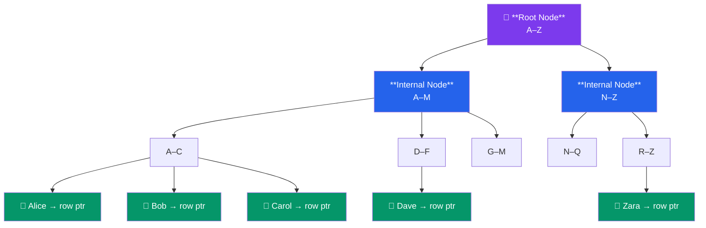
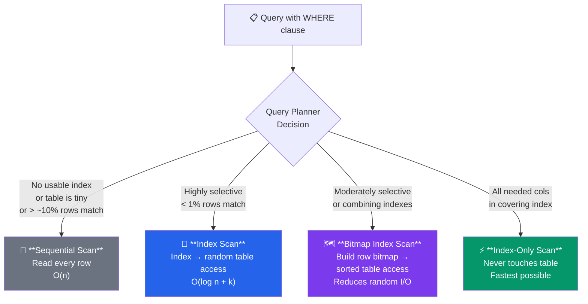

# Index Fundamentals

## Theory

### What is an Index?

An index in PostgreSQL is a separate data structure that provides fast access to rows in a table based on the values of one or more columns. Think of it like a book index: instead of reading every page to find a topic, you look it up in the index at the back, which tells you exactly which pages to read.

**B-tree Analogy:**
The default PostgreSQL index type is B-tree (Balanced tree), which works like a hierarchical phone book:
- **Root level**: Broad categories (A-M, N-Z)
- **Intermediate levels**: Narrower ranges (A-C, D-F, etc.)
- **Leaf level**: Actual pointers to table rows

This tree structure allows PostgreSQL to find any value in O(log n) time instead of O(n) for a sequential scan.



### How PostgreSQL Uses Indexes

When you execute a query, the PostgreSQL query planner decides whether to use an index based on:
- **Statistics**: Row counts, data distribution (stored in pg_stats)
- **Cost estimation**: Expected I/O, CPU usage, memory
- **Selectivity**: What percentage of rows match the condition

The planner chooses from several scan strategies:



#### Scan Types

1. **Sequential Scan (Seq Scan)** — reads every row sequentially. Used when no suitable index exists, query needs most rows, or table is small.
2. **Index Scan** — uses index to find matching rows, then fetches actual table data (random access). Best for highly selective queries.
3. **Bitmap Index Scan** — builds bitmap of row locations first, then reads table in physical order. Efficient for moderately selective queries or combining multiple indexes.
4. **Index-Only Scan** — retrieves data entirely from index with no table access. Requires a covering index with all needed columns.

### When Indexes Help

**Indexes speed up:**
- WHERE clause filtering (equality, ranges)
- JOIN operations
- ORDER BY sorting
- MIN/MAX aggregates
- DISTINCT operations
- Uniqueness enforcement

**Indexes slow down:**
- INSERT operations (index must be updated)
- UPDATE operations (if indexed columns change)
- DELETE operations (index entries must be removed)
- Large bulk loads (consider dropping/recreating indexes)

**Storage cost:**
- Indexes consume disk space (often 20-50% of table size)
- More indexes = more write overhead

### When NOT to Use Indexes

- Small tables (< 1000 rows) - sequential scan is often faster
- Columns with low selectivity (e.g., boolean with 50/50 distribution)
- Queries that return > 5-10% of table rows
- Columns that are rarely queried
- Write-heavy tables with rare reads

## Syntax

### CREATE INDEX

```sql
-- Basic index
CREATE INDEX index_name ON table_name (column_name);

-- Multi-column index
CREATE INDEX index_name ON table_name (col1, col2, col3);

-- Unique index
CREATE UNIQUE INDEX index_name ON table_name (column_name);

-- Partial index (with WHERE clause)
CREATE INDEX index_name ON table_name (column_name) WHERE condition;

-- Expression index
CREATE INDEX index_name ON table_name (LOWER(column_name));

-- With specific index type
CREATE INDEX index_name ON table_name USING btree (column_name);

-- Concurrent creation (doesn't block writes)
CREATE INDEX CONCURRENTLY index_name ON table_name (column_name);

-- With included columns (covering index)
CREATE INDEX index_name ON table_name (key_col) INCLUDE (other_col);
```

### DROP INDEX

```sql
-- Basic drop
DROP INDEX index_name;

-- Concurrent drop (doesn't block reads/writes)
DROP INDEX CONCURRENTLY index_name;

-- With IF EXISTS
DROP INDEX IF EXISTS index_name;

-- Drop multiple indexes
DROP INDEX index1, index2, index3;

-- Cascade drop (also drop dependent objects)
DROP INDEX index_name CASCADE;
```

### Checking Index Usage

```sql
-- View query execution plan
EXPLAIN SELECT * FROM table_name WHERE column = value;

-- View execution plan with actual runtime stats
EXPLAIN ANALYZE SELECT * FROM table_name WHERE column = value;

-- More detailed output
EXPLAIN (ANALYZE, BUFFERS, VERBOSE) SELECT * FROM table_name WHERE column = value;
```

## Examples

### Example 1: Creating and Testing Basic Indexes

```sql
-- Create a test table with significant data
CREATE TABLE employees (
    employee_id SERIAL PRIMARY KEY,
    first_name VARCHAR(50),
    last_name VARCHAR(50),
    email VARCHAR(100),
    department VARCHAR(50),
    salary NUMERIC(10, 2),
    hire_date DATE,
    is_active BOOLEAN DEFAULT true
);

-- Insert test data (100,000 rows)
INSERT INTO employees (first_name, last_name, email, department, salary, hire_date, is_active)
SELECT
    'FirstName' || i,
    'LastName' || i,
    'email' || i || '@company.com',
    (ARRAY['Engineering', 'Sales', 'Marketing', 'HR', 'Finance'])[1 + (i % 5)],
    30000 + (random() * 120000)::NUMERIC(10, 2),
    CURRENT_DATE - (random() * 3650)::INTEGER,
    (random() > 0.1)  -- 90% active
FROM generate_series(1, 100000) AS i;

-- Query WITHOUT index - note the Sequential Scan
EXPLAIN ANALYZE
SELECT * FROM employees WHERE last_name = 'LastName50000';
-- Result: Seq Scan on employees  (cost=0.00..2139.00 rows=1 width=...)
--         Planning Time: 0.123 ms
--         Execution Time: 45.234 ms

-- Create index on last_name
CREATE INDEX idx_employees_last_name ON employees(last_name);

-- Same query WITH index - note the Index Scan
EXPLAIN ANALYZE
SELECT * FROM employees WHERE last_name = 'LastName50000';
-- Result: Index Scan using idx_employees_last_name  (cost=0.29..8.31 rows=1 width=...)
--         Planning Time: 0.234 ms
--         Execution Time: 0.123 ms

-- Check index size
SELECT
    pg_size_pretty(pg_relation_size('employees')) AS table_size,
    pg_size_pretty(pg_relation_size('idx_employees_last_name')) AS index_size;
```

### Example 2: Different Scan Types

```sql
-- Index Scan (highly selective - returns 1 row)
EXPLAIN ANALYZE
SELECT * FROM employees WHERE last_name = 'LastName12345';
-- Result: Index Scan using idx_employees_last_name

-- Bitmap Index Scan (moderately selective - returns ~2000 rows)
EXPLAIN ANALYZE
SELECT * FROM employees WHERE department = 'Engineering';
-- Result: Bitmap Heap Scan on employees
--         -> Bitmap Index Scan on idx_employees_department

-- Sequential Scan (low selectivity - returns ~90,000 rows)
EXPLAIN ANALYZE
SELECT * FROM employees WHERE is_active = true;
-- Result: Seq Scan on employees (index won't help - too many rows)

-- Create index for index-only scan
CREATE INDEX idx_employees_email_salary ON employees(email) INCLUDE (salary);

-- Ensure table is vacuumed (required for index-only scans)
VACUUM employees;

-- Index-Only Scan (all needed columns in index)
EXPLAIN ANALYZE
SELECT email, salary FROM employees WHERE email = 'email50000@company.com';
-- Result: Index Only Scan using idx_employees_email_salary
```

### Example 3: CONCURRENTLY Option

```sql
-- Regular CREATE INDEX blocks all writes to the table
-- Use CONCURRENTLY for production databases with active traffic

-- This allows concurrent writes but takes longer to build
CREATE INDEX CONCURRENTLY idx_employees_hire_date ON employees(hire_date);

-- Check index validity (CONCURRENTLY can fail and leave invalid index)
SELECT
    schemaname,
    tablename,
    indexname,
    indexdef
FROM pg_indexes
WHERE indexname = 'idx_employees_hire_date';

-- Check if index is valid
SELECT
    indexname,
    indexrelid::regclass,
    indisvalid,
    indisready
FROM pg_index
JOIN pg_class ON pg_class.oid = pg_index.indexrelid
WHERE pg_class.relname = 'idx_employees_hire_date';

-- If indisvalid = false, drop and recreate
-- DROP INDEX CONCURRENTLY idx_employees_hire_date;
```

### Example 4: Monitoring Index Usage with pg_stat_user_indexes

```sql
-- Reset statistics (requires superuser)
-- SELECT pg_stat_reset();

-- Generate some queries
SELECT * FROM employees WHERE last_name = 'LastName1000';
SELECT * FROM employees WHERE email = 'email2000@company.com';
SELECT * FROM employees WHERE department = 'Engineering' AND hire_date > '2024-01-01';

-- View index usage statistics
SELECT
    schemaname,
    tablename,
    indexname,
    idx_scan,           -- Number of index scans initiated
    idx_tup_read,       -- Number of index entries returned by scans
    idx_tup_fetch,      -- Number of live table rows fetched
    pg_size_pretty(pg_relation_size(indexrelid)) AS index_size
FROM pg_stat_user_indexes
WHERE tablename = 'employees'
ORDER BY idx_scan DESC;

-- Find unused indexes (idx_scan = 0)
SELECT
    schemaname,
    tablename,
    indexname,
    pg_size_pretty(pg_relation_size(indexrelid)) AS index_size
FROM pg_stat_user_indexes
WHERE idx_scan = 0
    AND indexrelname NOT LIKE '%_pkey'  -- Exclude primary keys
ORDER BY pg_relation_size(indexrelid) DESC;
```

### Example 5: Index Size and Table Statistics

```sql
-- Comprehensive index analysis
SELECT
    t.tablename,
    i.indexname,
    pg_size_pretty(pg_relation_size(i.indexrelid)) AS index_size,
    idx_scan,
    idx_tup_read,
    idx_tup_fetch,
    ROUND(100.0 * idx_scan / NULLIF(idx_scan + seq_scan, 0), 2) AS index_scan_pct
FROM pg_stat_user_indexes i
JOIN pg_stat_user_tables t ON i.tablename = t.tablename
WHERE i.schemaname = 'public'
    AND t.tablename = 'employees'
ORDER BY pg_relation_size(i.indexrelid) DESC;

-- Check table and all indexes total size
SELECT
    pg_size_pretty(pg_total_relation_size('employees')) AS total_size,
    pg_size_pretty(pg_relation_size('employees')) AS table_size,
    pg_size_pretty(pg_total_relation_size('employees') - pg_relation_size('employees')) AS indexes_size;

-- Table statistics from pg_stat_user_tables
SELECT
    schemaname,
    relname AS tablename,
    seq_scan,           -- Number of sequential scans
    seq_tup_read,       -- Number of rows read by sequential scans
    idx_scan,           -- Number of index scans
    idx_tup_fetch,      -- Number of rows fetched by index scans
    n_tup_ins,          -- Rows inserted
    n_tup_upd,          -- Rows updated
    n_tup_del,          -- Rows deleted
    n_live_tup,         -- Estimated live rows
    n_dead_tup,         -- Estimated dead rows
    last_vacuum,
    last_autovacuum,
    last_analyze,
    last_autoanalyze
FROM pg_stat_user_tables
WHERE relname = 'employees';
```

## Common Mistakes

### 1. Creating Too Many Indexes

```sql
-- BAD: Index every column "just in case"
CREATE INDEX idx1 ON employees(first_name);
CREATE INDEX idx2 ON employees(last_name);
CREATE INDEX idx3 ON employees(email);
CREATE INDEX idx4 ON employees(department);
CREATE INDEX idx5 ON employees(salary);
CREATE INDEX idx6 ON employees(hire_date);
CREATE INDEX idx7 ON employees(is_active);
-- Result: Slow writes, wasted disk space, confused query planner

-- GOOD: Index based on actual query patterns
-- Analyze your queries first!
CREATE INDEX idx_employees_last_name ON employees(last_name);
CREATE INDEX idx_employees_email ON employees(email);  -- If frequently queried
-- Only create indexes you'll actually use
```

### 2. Forgetting to Use CONCURRENTLY in Production

```sql
-- BAD: Blocks all writes during index creation (can take hours on large tables)
CREATE INDEX idx_large_table ON huge_table(column_name);
-- Your application is now DOWN!

-- GOOD: Use CONCURRENTLY to avoid blocking writes
CREATE INDEX CONCURRENTLY idx_large_table ON huge_table(column_name);
-- Application continues running, index builds in background
```

### 3. Not Checking if Index is Actually Used

```sql
-- BAD: Create index and assume it's being used
CREATE INDEX idx_employees_salary ON employees(salary);

-- GOOD: Use EXPLAIN to verify
EXPLAIN ANALYZE
SELECT * FROM employees WHERE salary > 50000;
-- Check the output - is it using your index?

-- If you see Seq Scan instead of Index Scan:
-- 1. Query returns too many rows (index not selective enough)
-- 2. Statistics are outdated (run ANALYZE)
-- 3. Index type doesn't match query pattern
-- 4. Query planner thinks seq scan is cheaper (might be right!)
```

### 4. Indexing Low-Selectivity Columns

```sql
-- BAD: Index column with only a few distinct values
CREATE INDEX idx_employees_is_active ON employees(is_active);
-- Only 2 possible values (true/false) - index rarely helps

-- Test it:
EXPLAIN ANALYZE
SELECT * FROM employees WHERE is_active = true;
-- Result: Seq Scan (90% of rows are true, index scan would be slower)

-- GOOD: Use partial index if you frequently query the minority value
CREATE INDEX idx_employees_inactive ON employees(employee_id)
WHERE is_active = false;
-- This index only contains the 10% inactive employees
```

### 5. Not Monitoring Index Health

```sql
-- BAD: Create indexes and forget about them

-- GOOD: Regularly check index usage
SELECT
    schemaname,
    tablename,
    indexname,
    idx_scan,
    pg_size_pretty(pg_relation_size(indexrelid)) AS size
FROM pg_stat_user_indexes
WHERE schemaname = 'public'
ORDER BY pg_relation_size(indexrelid) DESC;

-- Drop unused indexes wasting space
-- (But keep them for a monitoring period first - some queries are infrequent!)
```

## Best Practices

### 1. Index Based on Query Patterns

```sql
-- Analyze your actual queries first
-- Look at slow query logs, pg_stat_statements, application logs

-- Common query pattern:
SELECT * FROM employees WHERE last_name = ? AND department = ?;

-- Create appropriate index:
CREATE INDEX idx_employees_last_dept ON employees(last_name, department);
```

### 2. Use EXPLAIN to Validate

```sql
-- Always test index effectiveness
EXPLAIN (ANALYZE, BUFFERS)
SELECT * FROM employees WHERE last_name = 'Smith';

-- Look for:
-- - Index Scan/Index Only Scan (good)
-- - Bitmap Index Scan (acceptable)
-- - Seq Scan (may indicate index isn't helping)
-- - Buffers: shared hits vs reads (cache effectiveness)
```

### 3. Keep Statistics Updated

```sql
-- Manual analyze after large data changes
ANALYZE employees;

-- Or specific column
ANALYZE employees(last_name);

-- Configure autovacuum appropriately (postgresql.conf)
-- autovacuum_analyze_scale_factor = 0.1  (default)
-- autovacuum_analyze_threshold = 50      (default)

-- Check when table was last analyzed
SELECT
    schemaname,
    relname,
    last_analyze,
    last_autoanalyze,
    n_live_tup,
    n_dead_tup
FROM pg_stat_user_tables
WHERE relname = 'employees';
```

### 4. Name Indexes Descriptively

```sql
-- BAD: Unclear names
CREATE INDEX idx1 ON employees(last_name);
CREATE INDEX idx2 ON employees(department, hire_date);

-- GOOD: Descriptive names showing table and columns
CREATE INDEX idx_employees_last_name ON employees(last_name);
CREATE INDEX idx_employees_dept_hire ON employees(department, hire_date);

-- Naming convention: idx_tablename_column1_column2
```

### 5. Consider Total Cost of Ownership

```sql
-- An index costs:
-- 1. Disk space
-- 2. Write performance (INSERT/UPDATE/DELETE)
-- 3. Maintenance overhead (VACUUM, REINDEX)

-- Index is worth it if:
-- Query speedup > (Write slowdown + Space cost + Maintenance cost)

-- For write-heavy tables, be conservative with indexes
-- For read-heavy tables, indexes are more valuable
```

## Practice Exercises

### Exercise 1: Index Performance Analysis

Create a table with enough data to see meaningful performance differences, then compare query performance with and without indexes.

```sql
-- 1. Create a products table
CREATE TABLE products (
    product_id SERIAL PRIMARY KEY,
    product_name VARCHAR(100),
    category VARCHAR(50),
    price NUMERIC(10, 2),
    stock_quantity INTEGER,
    created_at TIMESTAMP DEFAULT CURRENT_TIMESTAMP
);

-- 2. Insert 500,000 rows
INSERT INTO products (product_name, category, price, stock_quantity)
SELECT
    'Product ' || i,
    (ARRAY['Electronics', 'Clothing', 'Food', 'Books', 'Toys'])[1 + (i % 5)],
    (random() * 1000)::NUMERIC(10, 2),
    (random() * 1000)::INTEGER
FROM generate_series(1, 500000) AS i;

-- 3. Test query WITHOUT index
EXPLAIN (ANALYZE, BUFFERS)
SELECT * FROM products WHERE category = 'Electronics' ORDER BY price;

-- 4. Create appropriate indexes
-- (Hint: You need an index for WHERE and ORDER BY)

-- 5. Test same query WITH indexes
EXPLAIN (ANALYZE, BUFFERS)
SELECT * FROM products WHERE category = 'Electronics' ORDER BY price;

-- 6. Compare execution times and buffer usage
-- Questions:
-- - What scan type is used without index?
-- - What scan type is used with index?
-- - How much faster is the indexed query?
-- - How many buffers are read in each case?
```

### Exercise 2: Identifying Unused Indexes

Simulate a production scenario where some indexes are unused and should be removed.

```sql
-- 1. Create a customers table with multiple indexes
CREATE TABLE customers (
    customer_id SERIAL PRIMARY KEY,
    email VARCHAR(100),
    first_name VARCHAR(50),
    last_name VARCHAR(50),
    city VARCHAR(50),
    state VARCHAR(2),
    zip_code VARCHAR(10),
    registration_date DATE,
    last_login TIMESTAMP
);

-- 2. Create several indexes (some useful, some not)
CREATE INDEX idx_customers_email ON customers(email);
CREATE INDEX idx_customers_name ON customers(last_name, first_name);
CREATE INDEX idx_customers_city ON customers(city);
CREATE INDEX idx_customers_state ON customers(state);
CREATE INDEX idx_customers_zip ON customers(zip_code);
CREATE INDEX idx_customers_reg_date ON customers(registration_date);
CREATE INDEX idx_customers_last_login ON customers(last_login);

-- 3. Insert test data
INSERT INTO customers (email, first_name, last_name, city, state, zip_code, registration_date, last_login)
SELECT
    'customer' || i || '@email.com',
    'First' || i,
    'Last' || i,
    'City' || (i % 100),
    (ARRAY['CA', 'NY', 'TX', 'FL', 'WA'])[1 + (i % 5)],
    LPAD((i % 100000)::TEXT, 5, '0'),
    CURRENT_DATE - (random() * 1825)::INTEGER,
    CURRENT_TIMESTAMP - (random() * 90 || ' days')::INTERVAL
FROM generate_series(1, 100000) AS i;

-- 4. Simulate typical application queries
-- Run these queries multiple times:
SELECT * FROM customers WHERE email = 'customer50000@email.com';
SELECT * FROM customers WHERE last_name = 'Last12345';
SELECT * FROM customers WHERE last_login > CURRENT_TIMESTAMP - INTERVAL '7 days';

-- 5. Query pg_stat_user_indexes to find unused indexes
-- Write a query to show:
-- - Index name
-- - Index size
-- - Number of scans
-- - Recommendation (drop if unused and not a primary key)

-- 6. Drop unused indexes (keep them documented in case needed later)
```

### Exercise 3: Understanding Different Scan Types

Explore when PostgreSQL chooses different scan strategies.

```sql
-- 1. Create orders table
CREATE TABLE orders (
    order_id SERIAL PRIMARY KEY,
    customer_id INTEGER,
    order_date DATE,
    total_amount NUMERIC(10, 2),
    status VARCHAR(20),
    shipped_date DATE
);

-- 2. Insert 1,000,000 rows with specific distributions
INSERT INTO orders (customer_id, order_date, total_amount, status, shipped_date)
SELECT
    (random() * 100000)::INTEGER,
    CURRENT_DATE - (random() * 730)::INTEGER,
    (random() * 5000)::NUMERIC(10, 2),
    (ARRAY['pending', 'processing', 'shipped', 'delivered', 'cancelled'])[
        CASE
            WHEN random() < 0.05 THEN 1  -- 5% pending
            WHEN random() < 0.10 THEN 2  -- 5% processing
            WHEN random() < 0.30 THEN 3  -- 20% shipped
            WHEN random() < 0.90 THEN 4  -- 60% delivered
            ELSE 5                       -- 10% cancelled
        END
    ],
    CASE
        WHEN random() < 0.70 THEN CURRENT_DATE - (random() * 700)::INTEGER
        ELSE NULL
    END
FROM generate_series(1, 1000000);

-- 3. Create index on status
CREATE INDEX idx_orders_status ON orders(status);

-- 4. Run ANALYZE
ANALYZE orders;

-- 5. Test different selectivity levels and observe scan types:

-- Very selective (5% of rows - should use Index Scan)
EXPLAIN (ANALYZE, BUFFERS)
SELECT * FROM orders WHERE status = 'pending';

-- Moderately selective (20% - might use Bitmap Index Scan)
EXPLAIN (ANALYZE, BUFFERS)
SELECT * FROM orders WHERE status = 'shipped';

-- Low selectivity (60% - should use Sequential Scan)
EXPLAIN (ANALYZE, BUFFERS)
SELECT * FROM orders WHERE status = 'delivered';

-- 6. Questions:
-- - At what selectivity threshold does PostgreSQL switch from Index to Bitmap scan?
-- - At what threshold does it switch from Bitmap to Sequential scan?
-- - How do the buffer reads differ between scan types?
-- - What happens if you add ORDER BY order_id to each query?
```

## Summary

Indexes are critical for query performance in PostgreSQL, but they come with tradeoffs:
- Speed up reads (WHERE, JOIN, ORDER BY)
- Slow down writes (INSERT, UPDATE, DELETE)
- Consume disk space
- Require maintenance

Key takeaways:
1. Create indexes based on actual query patterns, not speculation
2. Use EXPLAIN ANALYZE to validate index effectiveness
3. Monitor index usage with pg_stat_user_indexes
4. Use CONCURRENTLY for production deployments
5. Keep statistics updated with ANALYZE
6. Understand different scan types and when each is appropriate
7. Balance read performance vs write overhead

Next: [Index Types](02-index-types.md) - Learn about B-tree, Hash, GiST, GIN, BRIN and when to use each.
