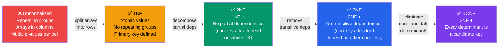

# Database Normalization

## Theory

Database normalization is the process of organizing data in a database to reduce redundancy and improve data integrity. It involves decomposing tables into smaller, well-structured tables and defining relationships between them.

### Goals of Normalization

1. **Eliminate Redundant Data**: Store each piece of information only once
2. **Ensure Data Dependencies Make Sense**: Only store related data together
3. **Prevent Anomalies**: Avoid insertion, update, and deletion anomalies
4. **Improve Data Integrity**: Maintain consistency across the database

### Functional Dependencies

A functional dependency exists when one attribute uniquely determines another attribute. Written as X → Y (X determines Y).

**Types of Dependencies**:
- **Full Functional Dependency**: Y is fully dependent on all of X
- **Partial Dependency**: Y depends on only part of a composite key
- **Transitive Dependency**: X → Y and Y → Z, therefore X → Z

### Normal Forms Overview

- **1NF**: Atomic values, no repeating groups
- **2NF**: 1NF + no partial dependencies
- **3NF**: 2NF + no transitive dependencies
- **BCNF**: 3NF + every determinant is a candidate key
- **4NF**: BCNF + no multi-valued dependencies
- **5NF**: 4NF + no join dependencies



## First Normal Form (1NF)

### Rules

1. Each column contains atomic (indivisible) values
2. Each column contains values of a single type
3. Each column has a unique name
4. The order of rows doesn't matter
5. No repeating groups or arrays

### Syntax/Diagrams

```
UNNORMALIZED:
Student: John Doe
Courses: Math, Physics, Chemistry
Phone: 555-1234, 555-5678

VIOLATES 1NF (multiple values per column)

1NF:
student_id | student_name | course      | phone
1          | John Doe     | Math        | 555-1234
1          | John Doe     | Physics     | 555-1234
1          | John Doe     | Chemistry   | 555-1234
```

### Examples

```sql
-- VIOLATES 1NF: Array column
CREATE TABLE bad_orders (
    order_id INT PRIMARY KEY,
    customer_name TEXT,
    products TEXT[]  -- Array violates 1NF
);

-- 1NF Compliant: Separate table for products
CREATE TABLE orders (
    order_id SERIAL PRIMARY KEY,
    customer_name TEXT NOT NULL,
    order_date DATE DEFAULT CURRENT_DATE
);

CREATE TABLE order_items (
    order_item_id SERIAL PRIMARY KEY,
    order_id INT REFERENCES orders(order_id),
    product_name TEXT NOT NULL,
    quantity INT NOT NULL
);

-- Insert example
INSERT INTO orders (customer_name) VALUES ('John Doe');

INSERT INTO order_items (order_id, product_name, quantity) VALUES
(1, 'Laptop', 1),
(1, 'Mouse', 2),
(1, 'Keyboard', 1);

-- Query all items in an order
SELECT o.order_id, o.customer_name, oi.product_name, oi.quantity
FROM orders o
JOIN order_items oi ON o.order_id = oi.order_id
WHERE o.order_id = 1;
```

## Second Normal Form (2NF)

### Rules

1. Must be in 1NF
2. No partial dependencies (all non-key attributes must depend on the entire primary key)
3. Only applies to tables with composite primary keys

### Examples

```sql
-- VIOLATES 2NF: partial dependency
-- course_name depends only on course_id, not on (student_id, course_id)
CREATE TABLE student_courses_bad (
    student_id INT,
    course_id INT,
    student_name TEXT,      -- depends on student_id only
    course_name TEXT,       -- depends on course_id only (PARTIAL DEPENDENCY)
    grade CHAR(2),
    PRIMARY KEY (student_id, course_id)
);

-- 2NF Compliant: Separate tables
CREATE TABLE students (
    student_id SERIAL PRIMARY KEY,
    student_name TEXT NOT NULL
);

CREATE TABLE courses (
    course_id SERIAL PRIMARY KEY,
    course_name TEXT NOT NULL,
    credits INT
);

CREATE TABLE enrollments (
    student_id INT REFERENCES students(student_id),
    course_id INT REFERENCES courses(course_id),
    grade CHAR(2),
    enrollment_date DATE DEFAULT CURRENT_DATE,
    PRIMARY KEY (student_id, course_id)
);

-- Insert data
INSERT INTO students (student_name) VALUES
('Alice Johnson'),
('Bob Smith');

INSERT INTO courses (course_name, credits) VALUES
('Database Systems', 3),
('Operating Systems', 4);

INSERT INTO enrollments (student_id, course_id, grade) VALUES
(1, 1, 'A'),
(1, 2, 'B+'),
(2, 1, 'A-');

-- Query student enrollments
SELECT s.student_name, c.course_name, e.grade, c.credits
FROM students s
JOIN enrollments e ON s.student_id = e.student_id
JOIN courses c ON e.course_id = c.course_id
WHERE s.student_id = 1;
```

## Third Normal Form (3NF)

### Rules

1. Must be in 2NF
2. No transitive dependencies (non-key attributes must not depend on other non-key attributes)

### Examples

```sql
-- VIOLATES 3NF: transitive dependency
-- dept_name depends on dept_id, and dept_id depends on employee_id
CREATE TABLE employees_bad (
    employee_id SERIAL PRIMARY KEY,
    employee_name TEXT,
    dept_id INT,
    dept_name TEXT,          -- TRANSITIVE DEPENDENCY
    dept_location TEXT       -- TRANSITIVE DEPENDENCY
);

-- 3NF Compliant
CREATE TABLE departments (
    dept_id SERIAL PRIMARY KEY,
    dept_name TEXT NOT NULL,
    dept_location TEXT
);

CREATE TABLE employees (
    employee_id SERIAL PRIMARY KEY,
    employee_name TEXT NOT NULL,
    dept_id INT REFERENCES departments(dept_id),
    hire_date DATE DEFAULT CURRENT_DATE,
    salary NUMERIC(10, 2)
);

-- Insert data
INSERT INTO departments (dept_name, dept_location) VALUES
('Engineering', 'Building A'),
('Sales', 'Building B'),
('HR', 'Building C');

INSERT INTO employees (employee_name, dept_id, salary) VALUES
('Alice Johnson', 1, 85000),
('Bob Smith', 1, 90000),
('Carol White', 2, 75000);

-- Query with department info
SELECT e.employee_name, e.salary, d.dept_name, d.dept_location
FROM employees e
JOIN departments d ON e.dept_id = d.dept_id
ORDER BY d.dept_name, e.employee_name;
```

## Boyce-Codd Normal Form (BCNF)

### Rules

1. Must be in 3NF
2. For every functional dependency X → Y, X must be a candidate key
3. A stricter version of 3NF that handles certain anomalies

### Examples

```sql
-- VIOLATES BCNF: professor determines subject, but professor is not a candidate key
CREATE TABLE class_schedule_bad (
    student_id INT,
    subject TEXT,
    professor TEXT,
    PRIMARY KEY (student_id, subject),
    -- Functional dependency: professor → subject
    -- But professor is not a candidate key
    UNIQUE(student_id, professor)
);

-- BCNF Compliant
CREATE TABLE professors (
    professor_id SERIAL PRIMARY KEY,
    professor_name TEXT NOT NULL,
    subject TEXT NOT NULL,
    UNIQUE(professor_name, subject)
);

CREATE TABLE student_classes (
    enrollment_id SERIAL PRIMARY KEY,
    student_id INT NOT NULL,
    professor_id INT REFERENCES professors(professor_id),
    semester TEXT NOT NULL,
    UNIQUE(student_id, professor_id, semester)
);

-- Insert data
INSERT INTO professors (professor_name, subject) VALUES
('Dr. Smith', 'Database Systems'),
('Dr. Jones', 'Algorithms'),
('Dr. Brown', 'Networks');

INSERT INTO student_classes (student_id, professor_id, semester) VALUES
(101, 1, 'Fall 2024'),
(101, 2, 'Fall 2024'),
(102, 1, 'Fall 2024');

-- Query student schedule
SELECT sc.student_id, p.professor_name, p.subject, sc.semester
FROM student_classes sc
JOIN professors p ON sc.professor_id = p.professor_id
WHERE sc.student_id = 101
ORDER BY p.subject;
```

## Fourth Normal Form (4NF)

### Rules

1. Must be in BCNF
2. No multi-valued dependencies (a record should not contain two or more independent multi-valued facts)

### Examples

```sql
-- VIOLATES 4NF: skills and certifications are independent
CREATE TABLE employee_details_bad (
    employee_id INT,
    skill TEXT,
    certification TEXT,
    PRIMARY KEY (employee_id, skill, certification)
    -- Problem: Creates cartesian product of skills × certifications
);

-- Example of the problem:
-- Employee 1: Skills (Java, Python), Certifications (AWS, Azure)
-- Results in 4 rows: Java-AWS, Java-Azure, Python-AWS, Python-Azure
-- But employee might only have Java-AWS and Python-Azure

-- 4NF Compliant: Separate independent facts
CREATE TABLE employee_skills (
    employee_id INT,
    skill TEXT,
    proficiency_level TEXT,
    PRIMARY KEY (employee_id, skill)
);

CREATE TABLE employee_certifications (
    employee_id INT,
    certification TEXT,
    obtained_date DATE,
    expiry_date DATE,
    PRIMARY KEY (employee_id, certification)
);

-- Insert data
INSERT INTO employee_skills (employee_id, skill, proficiency_level) VALUES
(1, 'PostgreSQL', 'Expert'),
(1, 'Python', 'Advanced'),
(1, 'Docker', 'Intermediate');

INSERT INTO employee_certifications (employee_id, certification, obtained_date) VALUES
(1, 'AWS Solutions Architect', '2023-06-15'),
(1, 'PostgreSQL Professional', '2024-01-20');

-- Query all details for an employee
SELECT
    e.employee_id,
    array_agg(DISTINCT es.skill) as skills,
    array_agg(DISTINCT ec.certification) as certifications
FROM (SELECT DISTINCT employee_id FROM employee_skills
      UNION SELECT DISTINCT employee_id FROM employee_certifications) e
LEFT JOIN employee_skills es ON e.employee_id = es.employee_id
LEFT JOIN employee_certifications ec ON e.employee_id = ec.employee_id
WHERE e.employee_id = 1
GROUP BY e.employee_id;
```

## Fifth Normal Form (5NF)

### Rules

1. Must be in 4NF
2. No join dependencies (the table cannot be decomposed into smaller tables without losing information)
3. Rarely needed in practice

### Examples

```sql
-- Example: Agent-Company-Product relationship
-- An agent can represent a company
-- A company can sell a product
-- An agent can sell a product
-- But: An agent sells a product ONLY if they represent the company that makes it

-- VIOLATES 5NF (potential join dependency)
CREATE TABLE agent_company_product_bad (
    agent_id INT,
    company_id INT,
    product_id INT,
    PRIMARY KEY (agent_id, company_id, product_id)
);

-- 5NF Compliant: Decompose into three tables
CREATE TABLE agent_company (
    agent_id INT,
    company_id INT,
    contract_date DATE,
    PRIMARY KEY (agent_id, company_id)
);

CREATE TABLE company_product (
    company_id INT,
    product_id INT,
    PRIMARY KEY (company_id, product_id)
);

CREATE TABLE agent_product (
    agent_id INT,
    product_id INT,
    PRIMARY KEY (agent_id, product_id)
);

-- Insert data
INSERT INTO agent_company (agent_id, company_id, contract_date) VALUES
(1, 100, '2024-01-01'),
(1, 101, '2024-02-01'),
(2, 100, '2024-01-15');

INSERT INTO company_product (company_id, product_id) VALUES
(100, 1001),
(100, 1002),
(101, 2001);

INSERT INTO agent_product (agent_id, product_id) VALUES
(1, 1001),  -- Agent 1 sells product 1001 (from company 100)
(1, 2001),  -- Agent 1 sells product 2001 (from company 101)
(2, 1001);  -- Agent 2 sells product 1001 (from company 100)

-- Reconstruct valid agent-company-product combinations
SELECT ac.agent_id, ac.company_id, cp.product_id
FROM agent_company ac
JOIN company_product cp ON ac.company_id = cp.company_id
JOIN agent_product ap ON ac.agent_id = ap.agent_id
    AND cp.product_id = ap.product_id;
```

## Complete Normalization Example

### Starting Point: Denormalized Table

```sql
-- Unnormalized order data
CREATE TABLE orders_denormalized (
    order_id SERIAL PRIMARY KEY,
    order_date DATE,
    customer_name TEXT,
    customer_email TEXT,
    customer_phone TEXT,
    customer_address TEXT,
    customer_city TEXT,
    customer_state TEXT,
    customer_zip TEXT,
    product1_name TEXT,
    product1_price NUMERIC,
    product1_qty INT,
    product2_name TEXT,
    product2_price NUMERIC,
    product2_qty INT,
    product3_name TEXT,
    product3_price NUMERIC,
    product3_qty INT
);

-- Problems:
-- 1. Repeating groups (product1, product2, product3) - Violates 1NF
-- 2. Customer data repeated for each order - Redundancy
-- 3. Limited to 3 products per order
-- 4. NULL values when fewer than 3 products
```

### Step 1: Achieve 1NF

```sql
-- Eliminate repeating groups
CREATE TABLE orders_1nf (
    order_id INT,
    order_date DATE,
    customer_name TEXT,
    customer_email TEXT,
    customer_phone TEXT,
    customer_address TEXT,
    customer_city TEXT,
    customer_state TEXT,
    customer_zip TEXT,
    product_name TEXT,
    product_price NUMERIC,
    product_qty INT,
    PRIMARY KEY (order_id, product_name)
);

-- Now each product is a separate row
-- But still has redundancy issues
```

### Step 2: Achieve 2NF

```sql
-- Remove partial dependencies
CREATE TABLE orders_2nf (
    order_id SERIAL PRIMARY KEY,
    order_date DATE,
    customer_name TEXT,
    customer_email TEXT,
    customer_phone TEXT,
    customer_address TEXT,
    customer_city TEXT,
    customer_state TEXT,
    customer_zip TEXT
);

CREATE TABLE order_items_2nf (
    order_id INT,
    product_name TEXT,
    product_price NUMERIC,
    product_qty INT,
    PRIMARY KEY (order_id, product_name),
    FOREIGN KEY (order_id) REFERENCES orders_2nf(order_id)
);

-- Customer info still depends only on customer, not order
```

### Step 3: Achieve 3NF

```sql
-- Remove transitive dependencies
CREATE TABLE customers (
    customer_id SERIAL PRIMARY KEY,
    customer_name TEXT NOT NULL,
    customer_email TEXT UNIQUE NOT NULL,
    customer_phone TEXT
);

CREATE TABLE addresses (
    address_id SERIAL PRIMARY KEY,
    customer_id INT REFERENCES customers(customer_id),
    street_address TEXT,
    city TEXT,
    state TEXT,
    zip TEXT,
    is_primary BOOLEAN DEFAULT false
);

CREATE TABLE products (
    product_id SERIAL PRIMARY KEY,
    product_name TEXT UNIQUE NOT NULL,
    product_price NUMERIC(10, 2) NOT NULL,
    description TEXT
);

CREATE TABLE orders_3nf (
    order_id SERIAL PRIMARY KEY,
    customer_id INT REFERENCES customers(customer_id),
    order_date DATE DEFAULT CURRENT_DATE,
    shipping_address_id INT REFERENCES addresses(address_id),
    status TEXT DEFAULT 'pending'
);

CREATE TABLE order_items_3nf (
    order_item_id SERIAL PRIMARY KEY,
    order_id INT REFERENCES orders_3nf(order_id),
    product_id INT REFERENCES products(product_id),
    quantity INT NOT NULL CHECK (quantity > 0),
    unit_price NUMERIC(10, 2) NOT NULL,
    UNIQUE(order_id, product_id)
);

-- Insert sample data
INSERT INTO customers (customer_name, customer_email, customer_phone) VALUES
('John Doe', 'john@example.com', '555-1234'),
('Jane Smith', 'jane@example.com', '555-5678');

INSERT INTO addresses (customer_id, street_address, city, state, zip, is_primary) VALUES
(1, '123 Main St', 'New York', 'NY', '10001', true),
(2, '456 Oak Ave', 'Los Angeles', 'CA', '90001', true);

INSERT INTO products (product_name, product_price, description) VALUES
('Laptop', 999.99, '15-inch laptop'),
('Mouse', 29.99, 'Wireless mouse'),
('Keyboard', 79.99, 'Mechanical keyboard');

INSERT INTO orders_3nf (customer_id, shipping_address_id) VALUES
(1, 1);

INSERT INTO order_items_3nf (order_id, product_id, quantity, unit_price) VALUES
(1, 1, 1, 999.99),
(1, 2, 2, 29.99);

-- Query complete order with customer and products
SELECT
    o.order_id,
    o.order_date,
    c.customer_name,
    c.customer_email,
    a.street_address || ', ' || a.city || ', ' || a.state || ' ' || a.zip as shipping_address,
    p.product_name,
    oi.quantity,
    oi.unit_price,
    oi.quantity * oi.unit_price as line_total
FROM orders_3nf o
JOIN customers c ON o.customer_id = c.customer_id
JOIN addresses a ON o.shipping_address_id = a.address_id
JOIN order_items_3nf oi ON o.order_id = oi.order_id
JOIN products p ON oi.product_id = p.product_id
WHERE o.order_id = 1;
```

## Common Mistakes

### 1. Over-normalization

```sql
-- TOO NORMALIZED: Separate table for customer name parts
CREATE TABLE customer_first_names (
    first_name_id SERIAL PRIMARY KEY,
    first_name TEXT
);

CREATE TABLE customer_last_names (
    last_name_id SERIAL PRIMARY KEY,
    last_name TEXT
);

-- This is excessive - keep first_name and last_name as columns
```

### 2. Under-normalization

```sql
-- NOT ENOUGH: Keeping calculated values without a good reason
CREATE TABLE orders_bad (
    order_id SERIAL PRIMARY KEY,
    customer_name TEXT,
    customer_email TEXT,  -- Should be in separate customers table
    total_amount NUMERIC  -- Should be calculated from order_items
);
```

### 3. Ignoring Performance Implications

```sql
-- Problem: Too many joins for common queries
-- Sometimes strategic denormalization is needed
-- (See ../13-database-design/02-denormalization.md)
```

### 4. Not Storing Historical Prices

```sql
-- WRONG: Using current price
CREATE TABLE order_items_wrong (
    order_id INT,
    product_id INT,  -- What if product price changes?
    quantity INT
);

-- RIGHT: Store price at time of order
CREATE TABLE order_items_right (
    order_id INT,
    product_id INT,
    quantity INT,
    unit_price NUMERIC  -- Price when ordered
);
```

## Best Practices

### 1. Start with 3NF

Most applications benefit from 3NF. Go to BCNF, 4NF, or 5NF only when specific anomalies arise.

### 2. Use Surrogate Keys

```sql
CREATE TABLE customers (
    customer_id SERIAL PRIMARY KEY,  -- Surrogate key
    customer_email TEXT UNIQUE,      -- Natural key
    customer_name TEXT
);
```

### 3. Document Functional Dependencies

```sql
-- Comment your schema with functional dependencies
CREATE TABLE employees (
    employee_id SERIAL PRIMARY KEY,
    ssn TEXT UNIQUE,           -- ssn → employee_id
    dept_id INT,               -- employee_id → dept_id
    manager_id INT             -- employee_id → manager_id
);
```

### 4. Consider Query Patterns

```sql
-- If you frequently need customer order counts
-- Consider a materialized view instead of denormalizing
CREATE MATERIALIZED VIEW customer_order_summary AS
SELECT
    c.customer_id,
    c.customer_name,
    COUNT(o.order_id) as order_count,
    SUM(oi.quantity * oi.unit_price) as total_spent
FROM customers c
LEFT JOIN orders_3nf o ON c.customer_id = o.customer_id
LEFT JOIN order_items_3nf oi ON o.order_id = oi.order_id
GROUP BY c.customer_id, c.customer_name;

CREATE UNIQUE INDEX ON customer_order_summary(customer_id);
```

### 5. Balance Normalization with Performance

```sql
-- For high-read, low-write scenarios
-- Store computed values with triggers to maintain them
CREATE TABLE order_summary (
    order_id INT PRIMARY KEY REFERENCES orders_3nf(order_id),
    item_count INT,
    total_amount NUMERIC
);

CREATE OR REPLACE FUNCTION update_order_summary()
RETURNS TRIGGER AS $$
BEGIN
    INSERT INTO order_summary (order_id, item_count, total_amount)
    SELECT
        NEW.order_id,
        COUNT(*),
        SUM(quantity * unit_price)
    FROM order_items_3nf
    WHERE order_id = NEW.order_id
    ON CONFLICT (order_id) DO UPDATE
    SET item_count = EXCLUDED.item_count,
        total_amount = EXCLUDED.total_amount;
    RETURN NEW;
END;
$$ LANGUAGE plpgsql;

CREATE TRIGGER trg_update_order_summary
AFTER INSERT OR UPDATE OR DELETE ON order_items_3nf
FOR EACH ROW EXECUTE FUNCTION update_order_summary();
```

## Practice Exercises

### Exercise 1: Normalize a Library Database

Given this denormalized table, normalize it to 3NF:

```sql
CREATE TABLE library_denormalized (
    checkout_id SERIAL PRIMARY KEY,
    member_name TEXT,
    member_email TEXT,
    member_phone TEXT,
    book_title TEXT,
    book_isbn TEXT,
    author_name TEXT,
    author_country TEXT,
    publisher_name TEXT,
    publisher_address TEXT,
    checkout_date DATE,
    due_date DATE,
    return_date DATE
);

-- Tasks:
-- 1. Identify all functional dependencies
-- 2. Create normalized tables (1NF, 2NF, 3NF)
-- 3. Write queries to:
--    a) Find all books checked out by a member
--    b) Find all overdue books
--    c) Find the most popular authors (by checkout count)
```

**Solution:**

```sql
-- Normalized schema
CREATE TABLE members (
    member_id SERIAL PRIMARY KEY,
    member_name TEXT NOT NULL,
    member_email TEXT UNIQUE NOT NULL,
    member_phone TEXT
);

CREATE TABLE authors (
    author_id SERIAL PRIMARY KEY,
    author_name TEXT NOT NULL,
    author_country TEXT
);

CREATE TABLE publishers (
    publisher_id SERIAL PRIMARY KEY,
    publisher_name TEXT NOT NULL,
    publisher_address TEXT
);

CREATE TABLE books (
    book_id SERIAL PRIMARY KEY,
    book_title TEXT NOT NULL,
    book_isbn TEXT UNIQUE NOT NULL,
    author_id INT REFERENCES authors(author_id),
    publisher_id INT REFERENCES publishers(publisher_id),
    publication_year INT
);

CREATE TABLE checkouts (
    checkout_id SERIAL PRIMARY KEY,
    member_id INT REFERENCES members(member_id),
    book_id INT REFERENCES books(book_id),
    checkout_date DATE DEFAULT CURRENT_DATE,
    due_date DATE NOT NULL,
    return_date DATE,
    CHECK (due_date > checkout_date),
    CHECK (return_date IS NULL OR return_date >= checkout_date)
);

-- Sample data
INSERT INTO authors (author_name, author_country) VALUES
('George Orwell', 'UK'),
('Jane Austen', 'UK');

INSERT INTO publishers (publisher_name, publisher_address) VALUES
('Penguin Books', '375 Hudson St, New York, NY');

INSERT INTO members (member_name, member_email, member_phone) VALUES
('Alice Johnson', 'alice@example.com', '555-0001');

INSERT INTO books (book_title, book_isbn, author_id, publisher_id) VALUES
('1984', '978-0-452-28423-4', 1, 1),
('Pride and Prejudice', '978-0-14-143951-8', 2, 1);

INSERT INTO checkouts (member_id, book_id, due_date) VALUES
(1, 1, CURRENT_DATE + INTERVAL '14 days');

-- a) Find all books checked out by a member
SELECT b.book_title, a.author_name, c.checkout_date, c.due_date
FROM checkouts c
JOIN books b ON c.book_id = b.book_id
JOIN authors a ON b.author_id = a.author_id
WHERE c.member_id = 1 AND c.return_date IS NULL;

-- b) Find all overdue books
SELECT
    m.member_name,
    b.book_title,
    c.due_date,
    CURRENT_DATE - c.due_date as days_overdue
FROM checkouts c
JOIN members m ON c.member_id = m.member_id
JOIN books b ON c.book_id = b.book_id
WHERE c.return_date IS NULL AND c.due_date < CURRENT_DATE;

-- c) Find the most popular authors
SELECT
    a.author_name,
    COUNT(c.checkout_id) as checkout_count
FROM authors a
JOIN books b ON a.author_id = b.author_id
JOIN checkouts c ON b.book_id = c.book_id
GROUP BY a.author_id, a.author_name
ORDER BY checkout_count DESC
LIMIT 10;
```

### Exercise 2: Identify Normal Form Violations

For each table below, identify which normal form it violates and fix it:

```sql
-- Table A
CREATE TABLE student_advisor (
    student_id INT,
    advisor_id INT,
    advisor_name TEXT,
    advisor_dept TEXT,
    dept_building TEXT,
    PRIMARY KEY (student_id)
);

-- Table B
CREATE TABLE project_assignment (
    employee_id INT,
    project_id INT,
    employee_skills TEXT[],
    PRIMARY KEY (employee_id, project_id)
);

-- Table C
CREATE TABLE course_instructor (
    course_id INT,
    instructor_id INT,
    instructor_name TEXT,
    course_room TEXT,
    PRIMARY KEY (course_id, instructor_id),
    -- Constraint: each course has only one room
    UNIQUE(course_id)
);
```

**Solution:**

```sql
-- Table A violates 3NF: dept_building depends on advisor_dept (transitive dependency)
-- Fixed:
CREATE TABLE advisors (
    advisor_id SERIAL PRIMARY KEY,
    advisor_name TEXT NOT NULL,
    dept_id INT REFERENCES departments(dept_id)
);

CREATE TABLE departments (
    dept_id SERIAL PRIMARY KEY,
    dept_name TEXT NOT NULL,
    dept_building TEXT
);

CREATE TABLE students (
    student_id SERIAL PRIMARY KEY,
    advisor_id INT REFERENCES advisors(advisor_id)
);

-- Table B violates 4NF: employee_skills is independent multi-valued fact
-- Fixed:
CREATE TABLE project_assignments (
    employee_id INT,
    project_id INT,
    PRIMARY KEY (employee_id, project_id)
);

CREATE TABLE employee_skills_fixed (
    employee_id INT,
    skill TEXT,
    PRIMARY KEY (employee_id, skill)
);

-- Table C violates BCNF: course_id → course_room, but course_id is not a candidate key
-- The composite key is (course_id, instructor_id), but course_room depends only on course_id
-- Fixed:
CREATE TABLE courses_fixed (
    course_id SERIAL PRIMARY KEY,
    course_name TEXT NOT NULL,
    course_room TEXT
);

CREATE TABLE course_instructors (
    course_id INT REFERENCES courses_fixed(course_id),
    instructor_id INT,
    semester TEXT,
    PRIMARY KEY (course_id, instructor_id, semester)
);
```

### Exercise 3: Design from Requirements

Design a normalized database (to 3NF) for a hospital system with these requirements:

- Track patients (name, date of birth, contact info, insurance)
- Track doctors (name, specialization, license number)
- Track appointments (patient, doctor, date/time, reason, status)
- Track prescriptions (patient, doctor, medication, dosage, date)
- Track medical records (patient, doctor, date, diagnosis, notes)
- Multiple doctors can treat the same patient
- A patient can have multiple insurance policies

**Solution:**

```sql
CREATE TABLE patients (
    patient_id SERIAL PRIMARY KEY,
    first_name TEXT NOT NULL,
    last_name TEXT NOT NULL,
    date_of_birth DATE NOT NULL,
    phone TEXT,
    email TEXT,
    address TEXT
);

CREATE TABLE insurance_companies (
    insurance_id SERIAL PRIMARY KEY,
    company_name TEXT NOT NULL,
    contact_phone TEXT
);

CREATE TABLE patient_insurance (
    patient_id INT REFERENCES patients(patient_id),
    insurance_id INT REFERENCES insurance_companies(insurance_id),
    policy_number TEXT NOT NULL,
    start_date DATE NOT NULL,
    end_date DATE,
    is_primary BOOLEAN DEFAULT false,
    PRIMARY KEY (patient_id, insurance_id, policy_number)
);

CREATE TABLE specializations (
    specialization_id SERIAL PRIMARY KEY,
    specialization_name TEXT UNIQUE NOT NULL
);

CREATE TABLE doctors (
    doctor_id SERIAL PRIMARY KEY,
    first_name TEXT NOT NULL,
    last_name TEXT NOT NULL,
    license_number TEXT UNIQUE NOT NULL,
    specialization_id INT REFERENCES specializations(specialization_id),
    phone TEXT,
    email TEXT
);

CREATE TABLE appointments (
    appointment_id SERIAL PRIMARY KEY,
    patient_id INT REFERENCES patients(patient_id),
    doctor_id INT REFERENCES doctors(doctor_id),
    appointment_date DATE NOT NULL,
    appointment_time TIME NOT NULL,
    reason TEXT,
    status TEXT DEFAULT 'scheduled',
    CHECK (status IN ('scheduled', 'completed', 'cancelled', 'no-show')),
    UNIQUE(doctor_id, appointment_date, appointment_time)
);

CREATE TABLE medications (
    medication_id SERIAL PRIMARY KEY,
    medication_name TEXT UNIQUE NOT NULL,
    generic_name TEXT
);

CREATE TABLE prescriptions (
    prescription_id SERIAL PRIMARY KEY,
    patient_id INT REFERENCES patients(patient_id),
    doctor_id INT REFERENCES doctors(doctor_id),
    medication_id INT REFERENCES medications(medication_id),
    dosage TEXT NOT NULL,
    frequency TEXT NOT NULL,
    prescribed_date DATE DEFAULT CURRENT_DATE,
    duration_days INT,
    refills_allowed INT DEFAULT 0
);

CREATE TABLE medical_records (
    record_id SERIAL PRIMARY KEY,
    patient_id INT REFERENCES patients(patient_id),
    doctor_id INT REFERENCES doctors(doctor_id),
    visit_date DATE DEFAULT CURRENT_DATE,
    diagnosis TEXT,
    notes TEXT,
    appointment_id INT REFERENCES appointments(appointment_id)
);

-- Indexes for common queries
CREATE INDEX idx_appointments_patient ON appointments(patient_id, appointment_date);
CREATE INDEX idx_appointments_doctor ON appointments(doctor_id, appointment_date);
CREATE INDEX idx_prescriptions_patient ON prescriptions(patient_id);
CREATE INDEX idx_medical_records_patient ON medical_records(patient_id, visit_date);
```

## Related Topics

- [Denormalization Strategies](./02-denormalization.md)
- [ER Modeling](./03-er-modeling.md)
- [Design Patterns](./04-design-patterns.md)
- [Indexes](../07-indexes/01-index-basics.md)
- [Foreign Keys](../04-constraints/02-foreign-keys.md)
