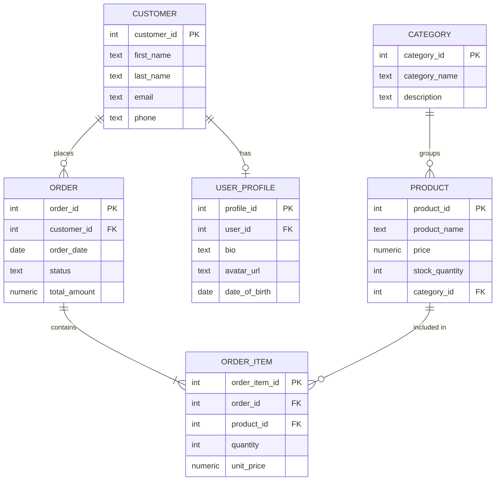

# Entity-Relationship (ER) Modeling

## Theory

Entity-Relationship (ER) modeling is a visual and conceptual approach to database design that represents data as entities, attributes, and relationships. It helps plan database structure before writing SQL code.

### Core Concepts

**Entity**: A thing or object in the real world that can be distinctly identified (e.g., Customer, Product, Order)

**Attribute**: A property or characteristic of an entity (e.g., customer_name, product_price)

**Relationship**: An association between entities (e.g., Customer places Order)

**Cardinality**: The numerical relationship between entities:
- One-to-One (1:1)
- One-to-Many (1:N)
- Many-to-Many (M:N)

### ER Diagram Benefits

1. **Visual Communication**: Easier to discuss with stakeholders
2. **Early Error Detection**: Identify design issues before implementation
3. **Documentation**: Serves as system documentation
4. **Planning**: Helps estimate storage and performance needs
5. **Normalization Guide**: Makes it easier to identify normalization opportunities

### Text-Based ER Notation

```
ENTITY [Entity_Name] {
    pk: primary_key
    attribute1
    attribute2
    fk: foreign_key
}

RELATIONSHIP:
Entity1 --relationship_type-- Entity2
Cardinality: 1:1, 1:N, M:N
```

## Entities and Attributes

### Entity Definition

```
ENTITY [Customer] {
    pk: customer_id (SERIAL)
    first_name (TEXT, NOT NULL)
    last_name (TEXT, NOT NULL)
    email (TEXT, UNIQUE, NOT NULL)
    phone (TEXT)
    created_at (TIMESTAMP)
}

ENTITY [Product] {
    pk: product_id (SERIAL)
    product_name (TEXT, NOT NULL)
    description (TEXT)
    price (NUMERIC, NOT NULL)
    stock_quantity (INT)
}
```

### Converting to SQL

```sql
CREATE TABLE customers (
    customer_id SERIAL PRIMARY KEY,
    first_name TEXT NOT NULL,
    last_name TEXT NOT NULL,
    email TEXT UNIQUE NOT NULL,
    phone TEXT,
    created_at TIMESTAMP DEFAULT CURRENT_TIMESTAMP
);

CREATE TABLE products (
    product_id SERIAL PRIMARY KEY,
    product_name TEXT NOT NULL,
    description TEXT,
    price NUMERIC(10, 2) NOT NULL CHECK (price >= 0),
    stock_quantity INT DEFAULT 0 CHECK (stock_quantity >= 0)
);
```

### Attribute Types

```sql
-- Simple attributes (atomic values)
CREATE TABLE employees (
    employee_id SERIAL PRIMARY KEY,
    first_name TEXT,  -- Simple attribute
    salary NUMERIC    -- Simple attribute
);

-- Composite attributes (can be broken down)
-- Instead of: full_address TEXT
-- Use separate components:
CREATE TABLE addresses (
    address_id SERIAL PRIMARY KEY,
    street_address TEXT,
    city TEXT,
    state TEXT,
    zip_code TEXT,
    country TEXT DEFAULT 'USA'
);

-- Derived attributes (calculated from other attributes)
CREATE TABLE invoices (
    invoice_id SERIAL PRIMARY KEY,
    subtotal NUMERIC(10, 2),
    tax_rate NUMERIC(4, 3) DEFAULT 0.08,
    -- Don't store: total (derived from subtotal * (1 + tax_rate))
    -- Calculate on query or use generated column
    total NUMERIC(10, 2) GENERATED ALWAYS AS (subtotal * (1 + tax_rate)) STORED
);

-- Multi-valued attributes (multiple values)
-- DON'T use arrays in normalized design
-- Instead, use separate table:
CREATE TABLE person_phone_numbers (
    person_id INT,
    phone_number TEXT,
    phone_type TEXT,  -- home, work, mobile
    PRIMARY KEY (person_id, phone_number)
);
```

## Relationships and Cardinality



### One-to-One (1:1)

```
ER DIAGRAM:
ENTITY [User] {
    pk: user_id
    username
    email
}

ENTITY [UserProfile] {
    pk: profile_id
    fk: user_id (UNIQUE)
    bio
    avatar_url
}

RELATIONSHIP: User --has one-- UserProfile
CARDINALITY: 1:1
```

```sql
CREATE TABLE users (
    user_id SERIAL PRIMARY KEY,
    username TEXT UNIQUE NOT NULL,
    email TEXT UNIQUE NOT NULL,
    created_at TIMESTAMP DEFAULT CURRENT_TIMESTAMP
);

CREATE TABLE user_profiles (
    profile_id SERIAL PRIMARY KEY,
    user_id INT UNIQUE NOT NULL REFERENCES users(user_id) ON DELETE CASCADE,
    bio TEXT,
    avatar_url TEXT,
    date_of_birth DATE,
    location TEXT
);

-- Alternative: Combine into single table if always used together
CREATE TABLE users_with_profile (
    user_id SERIAL PRIMARY KEY,
    username TEXT UNIQUE NOT NULL,
    email TEXT UNIQUE NOT NULL,
    bio TEXT,
    avatar_url TEXT,
    created_at TIMESTAMP DEFAULT CURRENT_TIMESTAMP
);
```

### One-to-Many (1:N)

```
ER DIAGRAM:
ENTITY [Author] {
    pk: author_id
    author_name
}

ENTITY [Book] {
    pk: book_id
    fk: author_id
    title
    isbn
}

RELATIONSHIP: Author --writes-- Book
CARDINALITY: 1:N (one author writes many books)
```

```sql
CREATE TABLE authors (
    author_id SERIAL PRIMARY KEY,
    author_name TEXT NOT NULL,
    country TEXT,
    birth_year INT
);

CREATE TABLE books (
    book_id SERIAL PRIMARY KEY,
    author_id INT NOT NULL REFERENCES authors(author_id),
    title TEXT NOT NULL,
    isbn TEXT UNIQUE,
    publication_year INT,
    pages INT
);

CREATE INDEX idx_books_author ON books(author_id);

-- Sample data
INSERT INTO authors (author_name, country) VALUES
('George Orwell', 'UK'),
('Jane Austen', 'UK');

INSERT INTO books (author_id, title, isbn) VALUES
(1, '1984', '978-0-452-28423-4'),
(1, 'Animal Farm', '978-0-452-28424-1'),
(2, 'Pride and Prejudice', '978-0-14-143951-8');

-- Query: Author with their books
SELECT a.author_name, b.title
FROM authors a
LEFT JOIN books b ON a.author_id = b.author_id
ORDER BY a.author_name, b.title;
```

### Many-to-Many (M:N)

```
ER DIAGRAM:
ENTITY [Student] {
    pk: student_id
    student_name
    email
}

ENTITY [Course] {
    pk: course_id
    course_name
    credits
}

ENTITY [Enrollment] {
    pk: (student_id, course_id)
    fk: student_id
    fk: course_id
    enrollment_date
    grade
}

RELATIONSHIP: Student --enrolls in-- Course
CARDINALITY: M:N (many students in many courses)
JUNCTION TABLE: Enrollment
```

```sql
CREATE TABLE students (
    student_id SERIAL PRIMARY KEY,
    student_name TEXT NOT NULL,
    email TEXT UNIQUE NOT NULL,
    enrollment_year INT
);

CREATE TABLE courses (
    course_id SERIAL PRIMARY KEY,
    course_code TEXT UNIQUE NOT NULL,
    course_name TEXT NOT NULL,
    credits INT NOT NULL
);

-- Junction/Bridge/Associative Table
CREATE TABLE enrollments (
    student_id INT REFERENCES students(student_id),
    course_id INT REFERENCES courses(course_id),
    enrollment_date DATE DEFAULT CURRENT_DATE,
    grade CHAR(2),
    semester TEXT,
    PRIMARY KEY (student_id, course_id, semester)
);

CREATE INDEX idx_enrollments_student ON enrollments(student_id);
CREATE INDEX idx_enrollments_course ON enrollments(course_id);

-- Sample data
INSERT INTO students (student_name, email) VALUES
('Alice Johnson', 'alice@university.edu'),
('Bob Smith', 'bob@university.edu');

INSERT INTO courses (course_code, course_name, credits) VALUES
('CS101', 'Intro to Computer Science', 3),
('CS201', 'Data Structures', 4),
('MATH101', 'Calculus I', 4);

INSERT INTO enrollments (student_id, course_id, grade, semester) VALUES
(1, 1, 'A', 'Fall 2024'),
(1, 2, 'B+', 'Fall 2024'),
(2, 1, 'A-', 'Fall 2024'),
(2, 3, 'B', 'Fall 2024');

-- Query: Students with their courses
SELECT s.student_name, c.course_name, e.grade
FROM students s
JOIN enrollments e ON s.student_id = e.student_id
JOIN courses c ON e.course_id = c.course_id
WHERE s.student_id = 1;

-- Query: Courses with enrolled students
SELECT c.course_name, COUNT(*) as student_count
FROM courses c
JOIN enrollments e ON c.course_id = e.course_id
GROUP BY c.course_id, c.course_name
ORDER BY student_count DESC;
```

## Identifying vs Non-Identifying Relationships

### Non-Identifying Relationship

The child entity can exist independently of the parent. The foreign key is NOT part of the primary key.

```
ER DIAGRAM:
ENTITY [Department] {
    pk: dept_id
    dept_name
}

ENTITY [Employee] {
    pk: employee_id  ← Independent primary key
    fk: dept_id      ← Optional foreign key
    employee_name
}

RELATIONSHIP: Department --has-- Employee
TYPE: Non-Identifying (employee can exist without department)
```

```sql
CREATE TABLE departments (
    dept_id SERIAL PRIMARY KEY,
    dept_name TEXT NOT NULL,
    location TEXT
);

CREATE TABLE employees (
    employee_id SERIAL PRIMARY KEY,  -- Independent key
    employee_name TEXT NOT NULL,
    dept_id INT REFERENCES departments(dept_id),  -- Can be NULL
    hire_date DATE DEFAULT CURRENT_DATE
);

-- Employee can exist without a department
INSERT INTO employees (employee_name) VALUES ('John Doe');
```

### Identifying Relationship

The child entity's existence depends on the parent. The foreign key IS part of the primary key.

```
ER DIAGRAM:
ENTITY [Order] {
    pk: order_id
    customer_id
    order_date
}

ENTITY [OrderItem] {
    pk: (order_id, item_number)  ← order_id is part of PK
    fk: order_id
    product_id
    quantity
}

RELATIONSHIP: Order --contains-- OrderItem
TYPE: Identifying (order item cannot exist without order)
```

```sql
CREATE TABLE orders (
    order_id SERIAL PRIMARY KEY,
    customer_id INT NOT NULL,
    order_date DATE DEFAULT CURRENT_DATE,
    status TEXT DEFAULT 'pending'
);

CREATE TABLE order_items (
    order_id INT REFERENCES orders(order_id) ON DELETE CASCADE,
    item_number INT,  -- Line item number within order
    product_id INT NOT NULL,
    quantity INT NOT NULL,
    unit_price NUMERIC(10, 2) NOT NULL,
    PRIMARY KEY (order_id, item_number)  -- Composite key includes FK
);

-- OrderItem MUST have an order
INSERT INTO orders (customer_id) VALUES (1);
INSERT INTO order_items (order_id, item_number, product_id, quantity, unit_price)
VALUES (1, 1, 101, 2, 29.99);

-- Deleting order cascades to items
DELETE FROM orders WHERE order_id = 1;
-- order_items are automatically deleted
```

## Weak Entities

A weak entity depends on a strong entity for its existence and identification.

```
ER DIAGRAM:
ENTITY [Building] {  ← Strong Entity
    pk: building_id
    building_name
}

ENTITY [Room] {  ← Weak Entity
    pk: (building_id, room_number)  ← Partial key
    fk: building_id
    room_number
    capacity
}

RELATIONSHIP: Building --contains-- Room
TYPE: Identifying (room depends on building)
NOTATION: Room is a weak entity (shown with double box in traditional ER)
```

```sql
CREATE TABLE buildings (
    building_id SERIAL PRIMARY KEY,
    building_name TEXT NOT NULL,
    address TEXT,
    floors INT
);

CREATE TABLE rooms (
    building_id INT REFERENCES buildings(building_id) ON DELETE CASCADE,
    room_number TEXT,  -- Partial key (not unique across all buildings)
    capacity INT,
    room_type TEXT,
    PRIMARY KEY (building_id, room_number)
);

-- Sample data
INSERT INTO buildings (building_name, address) VALUES
('Engineering Hall', '123 Campus Dr'),
('Science Building', '456 University Ave');

INSERT INTO rooms (building_id, room_number, capacity, room_type) VALUES
(1, '101', 30, 'Classroom'),
(1, '102', 25, 'Classroom'),
(2, '101', 40, 'Lab'),  -- Same room number, different building
(2, '201', 50, 'Lecture Hall');

-- Room 101 exists in multiple buildings
SELECT b.building_name, r.room_number, r.capacity
FROM buildings b
JOIN rooms r ON b.building_id = r.building_id
WHERE r.room_number = '101';
```

## Converting ER to Tables

### Algorithm

1. **Strong Entities** → Create table with primary key
2. **Weak Entities** → Create table with composite primary key (including foreign key from owner)
3. **1:1 Relationships** → Add foreign key to either side (or merge into one table)
4. **1:N Relationships** → Add foreign key on the "many" side
5. **M:N Relationships** → Create junction table with foreign keys from both entities
6. **Multi-valued Attributes** → Create separate table
7. **Composite Attributes** → Break into simple attributes
8. **Derived Attributes** → Don't store (calculate on query or use generated columns)

### Complete Example

```
ER DIAGRAM:

ENTITY [Company] {
    pk: company_id
    company_name
    industry
}

ENTITY [Employee] {
    pk: employee_id
    first_name
    last_name
    email
    fk: company_id
    fk: manager_id (self-referencing)
}

ENTITY [Project] {
    pk: project_id
    project_name
    budget
    fk: company_id
}

ENTITY [Assignment] {  ← Junction for M:N
    pk: (employee_id, project_id)
    fk: employee_id
    fk: project_id
    role
    start_date
}

RELATIONSHIPS:
- Company --employs-- Employee (1:N)
- Company --runs-- Project (1:N)
- Employee --works on-- Project (M:N via Assignment)
- Employee --manages-- Employee (1:N, self-referencing)
```

```sql
-- Strong entities
CREATE TABLE companies (
    company_id SERIAL PRIMARY KEY,
    company_name TEXT NOT NULL,
    industry TEXT,
    founded_year INT,
    headquarters TEXT
);

CREATE TABLE employees (
    employee_id SERIAL PRIMARY KEY,
    first_name TEXT NOT NULL,
    last_name TEXT NOT NULL,
    email TEXT UNIQUE NOT NULL,
    company_id INT NOT NULL REFERENCES companies(company_id),
    manager_id INT REFERENCES employees(employee_id),  -- Self-referencing
    hire_date DATE DEFAULT CURRENT_DATE,
    salary NUMERIC(10, 2)
);

CREATE TABLE projects (
    project_id SERIAL PRIMARY KEY,
    project_name TEXT NOT NULL,
    company_id INT NOT NULL REFERENCES companies(company_id),
    budget NUMERIC(12, 2),
    start_date DATE,
    end_date DATE,
    status TEXT DEFAULT 'planning'
);

-- M:N Junction table
CREATE TABLE project_assignments (
    employee_id INT REFERENCES employees(employee_id),
    project_id INT REFERENCES projects(project_id),
    role TEXT NOT NULL,  -- developer, manager, analyst, etc.
    start_date DATE DEFAULT CURRENT_DATE,
    end_date DATE,
    hours_allocated INT,
    PRIMARY KEY (employee_id, project_id)
);

-- Indexes
CREATE INDEX idx_employees_company ON employees(company_id);
CREATE INDEX idx_employees_manager ON employees(manager_id);
CREATE INDEX idx_projects_company ON projects(company_id);
CREATE INDEX idx_assignments_employee ON project_assignments(employee_id);
CREATE INDEX idx_assignments_project ON project_assignments(project_id);

-- Sample data
INSERT INTO companies (company_name, industry) VALUES
('TechCorp', 'Software'),
('DataSystems', 'Analytics');

INSERT INTO employees (first_name, last_name, email, company_id, manager_id) VALUES
('Alice', 'Johnson', 'alice@techcorp.com', 1, NULL),  -- CEO
('Bob', 'Smith', 'bob@techcorp.com', 1, 1),           -- Reports to Alice
('Carol', 'White', 'carol@techcorp.com', 1, 1);       -- Reports to Alice

INSERT INTO projects (project_name, company_id, budget) VALUES
('Website Redesign', 1, 100000),
('Mobile App', 1, 150000);

INSERT INTO project_assignments (employee_id, project_id, role) VALUES
(2, 1, 'Lead Developer'),
(3, 1, 'Designer'),
(2, 2, 'Developer'),
(3, 2, 'UX Designer');

-- Query: Company organizational chart
SELECT
    e.employee_id,
    e.first_name || ' ' || e.last_name as employee,
    m.first_name || ' ' || m.last_name as manager
FROM employees e
LEFT JOIN employees m ON e.manager_id = m.employee_id
WHERE e.company_id = 1
ORDER BY e.manager_id NULLS FIRST, e.employee_id;

-- Query: Project assignments
SELECT
    p.project_name,
    e.first_name || ' ' || e.last_name as employee,
    pa.role
FROM projects p
JOIN project_assignments pa ON p.project_id = pa.project_id
JOIN employees e ON pa.employee_id = e.employee_id
WHERE p.company_id = 1
ORDER BY p.project_name, pa.role;
```

## Recursive Relationships (Self-Referencing)

### Employee-Manager Hierarchy

```sql
CREATE TABLE employees_hierarchy (
    employee_id SERIAL PRIMARY KEY,
    employee_name TEXT NOT NULL,
    manager_id INT REFERENCES employees_hierarchy(employee_id),
    title TEXT,
    level INT  -- Organizational level (denormalized for performance)
);

INSERT INTO employees_hierarchy (employee_name, manager_id, title, level) VALUES
('CEO Alice', NULL, 'Chief Executive Officer', 1),
('VP Bob', 1, 'Vice President', 2),
('VP Carol', 1, 'Vice President', 2),
('Manager Dave', 2, 'Engineering Manager', 3),
('Manager Eve', 2, 'Product Manager', 3),
('Developer Frank', 4, 'Senior Developer', 4);

-- Query: All employees under a manager (recursive CTE)
WITH RECURSIVE subordinates AS (
    -- Base case: start with a specific manager
    SELECT employee_id, employee_name, manager_id, title, 1 as depth
    FROM employees_hierarchy
    WHERE employee_id = 2  -- VP Bob

    UNION ALL

    -- Recursive case: find employees reporting to current level
    SELECT e.employee_id, e.employee_name, e.manager_id, e.title, s.depth + 1
    FROM employees_hierarchy e
    JOIN subordinates s ON e.manager_id = s.employee_id
)
SELECT
    REPEAT('  ', depth - 1) || employee_name as org_chart,
    title
FROM subordinates
ORDER BY depth, employee_name;

-- Query: Management chain for an employee
WITH RECURSIVE management_chain AS (
    -- Base case: start with specific employee
    SELECT employee_id, employee_name, manager_id, title, 0 as level
    FROM employees_hierarchy
    WHERE employee_id = 6  -- Developer Frank

    UNION ALL

    -- Recursive case: find manager
    SELECT e.employee_id, e.employee_name, e.manager_id, e.title, mc.level + 1
    FROM employees_hierarchy e
    JOIN management_chain mc ON e.employee_id = mc.manager_id
)
SELECT employee_name, title, level
FROM management_chain
ORDER BY level DESC;
```

### Category Hierarchy

```sql
CREATE TABLE categories (
    category_id SERIAL PRIMARY KEY,
    category_name TEXT NOT NULL,
    parent_category_id INT REFERENCES categories(category_id),
    level INT,
    path TEXT  -- Denormalized path for easier queries
);

INSERT INTO categories (category_name, parent_category_id, level, path) VALUES
('Electronics', NULL, 1, 'Electronics'),
('Computers', 1, 2, 'Electronics > Computers'),
('Laptops', 2, 3, 'Electronics > Computers > Laptops'),
('Desktops', 2, 3, 'Electronics > Computers > Desktops'),
('Phones', 1, 2, 'Electronics > Phones'),
('Smartphones', 5, 3, 'Electronics > Phones > Smartphones');

-- Query: All subcategories under a category
WITH RECURSIVE subcategories AS (
    SELECT category_id, category_name, parent_category_id, 1 as depth
    FROM categories
    WHERE category_id = 1  -- Electronics

    UNION ALL

    SELECT c.category_id, c.category_name, c.parent_category_id, s.depth + 1
    FROM categories c
    JOIN subcategories s ON c.parent_category_id = s.category_id
)
SELECT
    REPEAT('  ', depth - 1) || category_name as category_tree
FROM subcategories
ORDER BY depth, category_name;
```

## Practical ER Modeling Exercise

### Scenario: University Course Registration System

```
REQUIREMENTS:
1. Students enroll in courses
2. Courses are taught by instructors
3. Courses are offered in specific semesters
4. Each course has prerequisites
5. Students have a major/department
6. Track grades for completed courses
7. Each course offering has a max capacity

ER DIAGRAM:

ENTITY [Student] {
    pk: student_id
    first_name
    last_name
    email
    fk: major_id
}

ENTITY [Department] {
    pk: dept_id
    dept_name
    building
}

ENTITY [Instructor] {
    pk: instructor_id
    name
    email
    fk: dept_id
}

ENTITY [Course] {
    pk: course_id
    course_code
    course_name
    credits
    fk: dept_id
}

ENTITY [Prerequisite] {
    pk: (course_id, prereq_course_id)
    fk: course_id
    fk: prereq_course_id
}

ENTITY [CourseOffering] {
    pk: offering_id
    fk: course_id
    fk: instructor_id
    semester
    year
    max_capacity
}

ENTITY [Enrollment] {
    pk: (student_id, offering_id)
    fk: student_id
    fk: offering_id
    grade
    enrollment_date
}

RELATIONSHIPS:
- Department --has-- Student (1:N)
- Department --has-- Instructor (1:N)
- Department --offers-- Course (1:N)
- Course --has-- Prerequisite (M:N, self-referencing)
- Course --is offered as-- CourseOffering (1:N)
- Instructor --teaches-- CourseOffering (1:N)
- Student --enrolls in-- CourseOffering (M:N via Enrollment)
```

```sql
-- Implementation
CREATE TABLE departments (
    dept_id SERIAL PRIMARY KEY,
    dept_code TEXT UNIQUE NOT NULL,
    dept_name TEXT NOT NULL,
    building TEXT,
    head_of_dept TEXT
);

CREATE TABLE students (
    student_id SERIAL PRIMARY KEY,
    first_name TEXT NOT NULL,
    last_name TEXT NOT NULL,
    email TEXT UNIQUE NOT NULL,
    major_id INT REFERENCES departments(dept_id),
    enrollment_year INT,
    gpa NUMERIC(3, 2)
);

CREATE TABLE instructors (
    instructor_id SERIAL PRIMARY KEY,
    first_name TEXT NOT NULL,
    last_name TEXT NOT NULL,
    email TEXT UNIQUE NOT NULL,
    dept_id INT NOT NULL REFERENCES departments(dept_id),
    office_number TEXT
);

CREATE TABLE courses (
    course_id SERIAL PRIMARY KEY,
    course_code TEXT UNIQUE NOT NULL,
    course_name TEXT NOT NULL,
    credits INT NOT NULL CHECK (credits > 0),
    dept_id INT NOT NULL REFERENCES departments(dept_id),
    description TEXT
);

-- Self-referencing M:N for prerequisites
CREATE TABLE course_prerequisites (
    course_id INT REFERENCES courses(course_id),
    prereq_course_id INT REFERENCES courses(course_id),
    is_required BOOLEAN DEFAULT true,
    PRIMARY KEY (course_id, prereq_course_id),
    CHECK (course_id != prereq_course_id)
);

CREATE TABLE course_offerings (
    offering_id SERIAL PRIMARY KEY,
    course_id INT NOT NULL REFERENCES courses(course_id),
    instructor_id INT NOT NULL REFERENCES instructors(instructor_id),
    semester TEXT NOT NULL,  -- Fall, Spring, Summer
    year INT NOT NULL,
    max_capacity INT NOT NULL CHECK (max_capacity > 0),
    room TEXT,
    schedule TEXT,  -- e.g., "MWF 9:00-10:00"
    UNIQUE(course_id, semester, year, instructor_id)
);

CREATE TABLE enrollments (
    student_id INT REFERENCES students(student_id),
    offering_id INT REFERENCES course_offerings(offering_id),
    enrollment_date DATE DEFAULT CURRENT_DATE,
    grade CHAR(2),
    status TEXT DEFAULT 'enrolled',  -- enrolled, dropped, completed
    PRIMARY KEY (student_id, offering_id)
);

-- Indexes
CREATE INDEX idx_students_major ON students(major_id);
CREATE INDEX idx_instructors_dept ON instructors(dept_id);
CREATE INDEX idx_courses_dept ON courses(dept_id);
CREATE INDEX idx_offerings_course ON course_offerings(course_id);
CREATE INDEX idx_offerings_instructor ON course_offerings(instructor_id);
CREATE INDEX idx_enrollments_student ON enrollments(student_id);
CREATE INDEX idx_enrollments_offering ON enrollments(offering_id);

-- Sample data
INSERT INTO departments (dept_code, dept_name, building) VALUES
('CS', 'Computer Science', 'Engineering Hall'),
('MATH', 'Mathematics', 'Science Building');

INSERT INTO instructors (first_name, last_name, email, dept_id) VALUES
('Dr. Alice', 'Smith', 'alice.smith@university.edu', 1),
('Dr. Bob', 'Jones', 'bob.jones@university.edu', 2);

INSERT INTO courses (course_code, course_name, credits, dept_id) VALUES
('CS101', 'Intro to Programming', 3, 1),
('CS201', 'Data Structures', 4, 1),
('MATH101', 'Calculus I', 4, 2);

INSERT INTO course_prerequisites (course_id, prereq_course_id) VALUES
(2, 1);  -- CS201 requires CS101

INSERT INTO course_offerings (course_id, instructor_id, semester, year, max_capacity, schedule) VALUES
(1, 1, 'Fall', 2024, 30, 'MWF 9:00-10:00'),
(2, 1, 'Fall', 2024, 25, 'TuTh 10:00-11:30'),
(3, 2, 'Fall', 2024, 40, 'MWF 11:00-12:00');

INSERT INTO students (first_name, last_name, email, major_id, enrollment_year) VALUES
('John', 'Doe', 'john.doe@student.edu', 1, 2023),
('Jane', 'Smith', 'jane.smith@student.edu', 1, 2024);

INSERT INTO enrollments (student_id, offering_id) VALUES
(1, 1), (1, 2), (2, 1), (2, 3);

-- Query: Course schedule for a student
SELECT
    c.course_code,
    c.course_name,
    i.first_name || ' ' || i.last_name as instructor,
    co.schedule,
    co.room
FROM enrollments e
JOIN course_offerings co ON e.offering_id = co.offering_id
JOIN courses c ON co.course_id = c.course_id
JOIN instructors i ON co.instructor_id = i.instructor_id
WHERE e.student_id = 1 AND e.status = 'enrolled'
ORDER BY c.course_code;

-- Query: Check if student has prerequisites
SELECT
    c.course_name as desired_course,
    pc.course_name as prerequisite,
    CASE
        WHEN e.grade IS NOT NULL AND e.grade != 'F' THEN 'Completed'
        ELSE 'Not Completed'
    END as status
FROM courses c
JOIN course_prerequisites cp ON c.course_id = cp.course_id
JOIN courses pc ON cp.prereq_course_id = pc.course_id
LEFT JOIN course_offerings pco ON pc.course_id = pco.course_id
LEFT JOIN enrollments e ON pco.offering_id = e.offering_id AND e.student_id = 1
WHERE c.course_id = 2;  -- Checking prerequisites for CS201

-- Query: Course capacity
SELECT
    c.course_code,
    c.course_name,
    co.max_capacity,
    COUNT(e.student_id) as enrolled,
    co.max_capacity - COUNT(e.student_id) as seats_available
FROM course_offerings co
JOIN courses c ON co.course_id = c.course_id
LEFT JOIN enrollments e ON co.offering_id = e.offering_id AND e.status = 'enrolled'
WHERE co.semester = 'Fall' AND co.year = 2024
GROUP BY co.offering_id, c.course_code, c.course_name, co.max_capacity
ORDER BY c.course_code;
```

## Common Mistakes

### 1. Not Using Junction Tables for M:N

```sql
-- WRONG: Array of foreign keys
CREATE TABLE students_wrong (
    student_id SERIAL PRIMARY KEY,
    course_ids INT[]  -- Can't enforce referential integrity
);

-- RIGHT: Junction table
CREATE TABLE student_courses (
    student_id INT REFERENCES students(student_id),
    course_id INT REFERENCES courses(course_id),
    PRIMARY KEY (student_id, course_id)
);
```

### 2. Storing Derived Attributes

```sql
-- WRONG: Storing calculated value that can become inconsistent
CREATE TABLE orders_wrong (
    order_id SERIAL PRIMARY KEY,
    item_count INT,  -- Could become out of sync
    total_amount NUMERIC
);

-- BETTER: Calculate on query or use triggers
CREATE TABLE orders_right (
    order_id SERIAL PRIMARY KEY
    -- Calculate from order_items table
);
```

### 3. Creating Circular Dependencies

```sql
-- PROBLEM: Circular foreign keys
CREATE TABLE table_a (
    id INT PRIMARY KEY,
    b_id INT REFERENCES table_b(id)  -- References table_b
);

CREATE TABLE table_b (
    id INT PRIMARY KEY,
    a_id INT REFERENCES table_a(id)  -- References table_a (circular!)
);

-- SOLUTION: Add foreign key after table creation
CREATE TABLE table_a (
    id INT PRIMARY KEY,
    b_id INT
);

CREATE TABLE table_b (
    id INT PRIMARY KEY,
    a_id INT
);

ALTER TABLE table_a ADD CONSTRAINT fk_a_b FOREIGN KEY (b_id) REFERENCES table_b(id);
ALTER TABLE table_b ADD CONSTRAINT fk_b_a FOREIGN KEY (a_id) REFERENCES table_a(id);
```

### 4. Not Considering NULL Semantics

```sql
-- Be explicit about optional vs required relationships
CREATE TABLE employees (
    employee_id SERIAL PRIMARY KEY,
    manager_id INT REFERENCES employees(employee_id),  -- NULL allowed (CEO has no manager)
    dept_id INT NOT NULL REFERENCES departments(dept_id)  -- NULL not allowed
);
```

## Best Practices

### 1. Name Entities as Nouns, Relationships as Verbs

```
GOOD:
Entity: Customer
Relationship: Customer --places-- Order

BAD:
Entity: Ordering
Relationship: Customer --has-- Ordering
```

### 2. Use Meaningful Names

```sql
-- GOOD: Descriptive names
CREATE TABLE customer_shipping_addresses (
    address_id SERIAL PRIMARY KEY,
    customer_id INT REFERENCES customers(customer_id),
    street_address TEXT
);

-- BAD: Cryptic abbreviations
CREATE TABLE cust_ship_addr (
    csa_id SERIAL PRIMARY KEY,
    c_id INT
);
```

### 3. Document Your ER Diagram

```sql
-- Include comments explaining relationships
COMMENT ON TABLE enrollments IS 'Junction table for M:N relationship between students and course_offerings. Tracks which students are enrolled in which course sections.';

COMMENT ON COLUMN enrollments.status IS 'Possible values: enrolled, dropped, completed';
```

### 4. Consider Future Requirements

Design for extensibility:

```sql
-- Instead of boolean is_primary_address
-- Use address_type to allow for future address types
CREATE TABLE addresses (
    address_id SERIAL PRIMARY KEY,
    customer_id INT,
    address_type TEXT,  -- 'billing', 'shipping', 'mailing', etc.
    CHECK (address_type IN ('billing', 'shipping', 'mailing'))
);
```

## Practice Exercises

### Exercise 1: E-Commerce ER Model

Design an ER model for an e-commerce system with these requirements:

```
REQUIREMENTS:
- Customers place orders
- Orders contain multiple products
- Products belong to categories (a product can be in multiple categories)
- Track inventory for each product
- Customers have multiple addresses (billing, shipping)
- Products can have reviews from customers
- Track payment information for orders
- Support for discount codes

TASKS:
1. Draw the ER diagram (text format)
2. Identify all entities, attributes, and relationships
3. Specify cardinalities
4. Implement in SQL
5. Write queries for:
   - All orders for a customer
   - Products in a category with average rating
   - Apply discount code to order
```

**Solution:**

```sql
CREATE TABLE customers (
    customer_id SERIAL PRIMARY KEY,
    email TEXT UNIQUE NOT NULL,
    password_hash TEXT NOT NULL,
    first_name TEXT,
    last_name TEXT,
    created_at TIMESTAMP DEFAULT CURRENT_TIMESTAMP
);

CREATE TABLE addresses (
    address_id SERIAL PRIMARY KEY,
    customer_id INT REFERENCES customers(customer_id) ON DELETE CASCADE,
    address_type TEXT NOT NULL,
    street_address TEXT NOT NULL,
    city TEXT NOT NULL,
    state TEXT,
    zip_code TEXT,
    country TEXT DEFAULT 'USA',
    is_default BOOLEAN DEFAULT false,
    CHECK (address_type IN ('billing', 'shipping'))
);

CREATE TABLE categories (
    category_id SERIAL PRIMARY KEY,
    category_name TEXT UNIQUE NOT NULL,
    parent_category_id INT REFERENCES categories(category_id)
);

CREATE TABLE products (
    product_id SERIAL PRIMARY KEY,
    product_name TEXT NOT NULL,
    description TEXT,
    price NUMERIC(10, 2) NOT NULL CHECK (price >= 0),
    stock_quantity INT DEFAULT 0 CHECK (stock_quantity >= 0),
    sku TEXT UNIQUE
);

CREATE TABLE product_categories (
    product_id INT REFERENCES products(product_id),
    category_id INT REFERENCES categories(category_id),
    PRIMARY KEY (product_id, category_id)
);

CREATE TABLE discount_codes (
    code_id SERIAL PRIMARY KEY,
    code TEXT UNIQUE NOT NULL,
    discount_percent NUMERIC(5, 2),
    discount_amount NUMERIC(10, 2),
    valid_from DATE,
    valid_until DATE,
    max_uses INT,
    times_used INT DEFAULT 0,
    CHECK ((discount_percent IS NOT NULL) OR (discount_amount IS NOT NULL))
);

CREATE TABLE orders (
    order_id SERIAL PRIMARY KEY,
    customer_id INT NOT NULL REFERENCES customers(customer_id),
    order_date TIMESTAMP DEFAULT CURRENT_TIMESTAMP,
    shipping_address_id INT REFERENCES addresses(address_id),
    billing_address_id INT REFERENCES addresses(address_id),
    discount_code_id INT REFERENCES discount_codes(code_id),
    subtotal NUMERIC(10, 2),
    discount_amount NUMERIC(10, 2) DEFAULT 0,
    tax_amount NUMERIC(10, 2),
    total_amount NUMERIC(10, 2),
    status TEXT DEFAULT 'pending'
);

CREATE TABLE order_items (
    order_item_id SERIAL PRIMARY KEY,
    order_id INT REFERENCES orders(order_id) ON DELETE CASCADE,
    product_id INT REFERENCES products(product_id),
    quantity INT NOT NULL CHECK (quantity > 0),
    unit_price NUMERIC(10, 2) NOT NULL,
    UNIQUE(order_id, product_id)
);

CREATE TABLE payments (
    payment_id SERIAL PRIMARY KEY,
    order_id INT REFERENCES orders(order_id),
    payment_method TEXT NOT NULL,
    amount NUMERIC(10, 2) NOT NULL,
    payment_date TIMESTAMP DEFAULT CURRENT_TIMESTAMP,
    status TEXT DEFAULT 'pending',
    transaction_id TEXT
);

CREATE TABLE reviews (
    review_id SERIAL PRIMARY KEY,
    product_id INT REFERENCES products(product_id) ON DELETE CASCADE,
    customer_id INT REFERENCES customers(customer_id),
    rating INT NOT NULL CHECK (rating BETWEEN 1 AND 5),
    review_text TEXT,
    created_at TIMESTAMP DEFAULT CURRENT_TIMESTAMP,
    UNIQUE(product_id, customer_id)
);

-- Indexes
CREATE INDEX idx_orders_customer ON orders(customer_id);
CREATE INDEX idx_order_items_product ON order_items(product_id);
CREATE INDEX idx_reviews_product ON reviews(product_id);

-- Query: All orders for a customer
SELECT o.order_id, o.order_date, o.total_amount, o.status
FROM orders o
WHERE o.customer_id = 1
ORDER BY o.order_date DESC;

-- Query: Products in category with avg rating
SELECT
    p.product_id,
    p.product_name,
    p.price,
    AVG(r.rating) as avg_rating,
    COUNT(r.review_id) as review_count
FROM products p
JOIN product_categories pc ON p.product_id = pc.product_id
LEFT JOIN reviews r ON p.product_id = r.product_id
WHERE pc.category_id = 1
GROUP BY p.product_id, p.product_name, p.price
ORDER BY avg_rating DESC NULLS LAST;

-- Function: Apply discount code
CREATE OR REPLACE FUNCTION apply_discount_code(p_order_id INT, p_code TEXT)
RETURNS BOOLEAN AS $$
DECLARE
    v_code_id INT;
    v_discount_percent NUMERIC;
    v_discount_amount NUMERIC;
    v_subtotal NUMERIC;
    v_calculated_discount NUMERIC;
BEGIN
    -- Get discount code details
    SELECT code_id, discount_percent, discount_amount
    INTO v_code_id, v_discount_percent, v_discount_amount
    FROM discount_codes
    WHERE code = p_code
        AND (valid_from IS NULL OR valid_from <= CURRENT_DATE)
        AND (valid_until IS NULL OR valid_until >= CURRENT_DATE)
        AND (max_uses IS NULL OR times_used < max_uses);

    IF v_code_id IS NULL THEN
        RETURN FALSE;  -- Invalid or expired code
    END IF;

    -- Get order subtotal
    SELECT subtotal INTO v_subtotal FROM orders WHERE order_id = p_order_id;

    -- Calculate discount
    IF v_discount_percent IS NOT NULL THEN
        v_calculated_discount := v_subtotal * (v_discount_percent / 100);
    ELSE
        v_calculated_discount := v_discount_amount;
    END IF;

    -- Update order
    UPDATE orders
    SET discount_code_id = v_code_id,
        discount_amount = v_calculated_discount,
        total_amount = subtotal + tax_amount - v_calculated_discount
    WHERE order_id = p_order_id;

    -- Update code usage
    UPDATE discount_codes
    SET times_used = times_used + 1
    WHERE code_id = v_code_id;

    RETURN TRUE;
END;
$$ LANGUAGE plpgsql;
```

### Exercise 2: Hospital Management System

Create ER model and implementation for a hospital system.

```
REQUIREMENTS:
- Patients have appointments with doctors
- Doctors have specializations
- Track patient medical history
- Prescriptions are written by doctors for patients
- Hospital has multiple departments
- Track bed assignments for admitted patients
```

**Solution:**

```sql
CREATE TABLE departments (
    dept_id SERIAL PRIMARY KEY,
    dept_name TEXT UNIQUE NOT NULL,
    location TEXT,
    phone TEXT
);

CREATE TABLE specializations (
    specialization_id SERIAL PRIMARY KEY,
    specialization_name TEXT UNIQUE NOT NULL
);

CREATE TABLE doctors (
    doctor_id SERIAL PRIMARY KEY,
    first_name TEXT NOT NULL,
    last_name TEXT NOT NULL,
    license_number TEXT UNIQUE NOT NULL,
    specialization_id INT REFERENCES specializations(specialization_id),
    dept_id INT REFERENCES departments(dept_id),
    phone TEXT,
    email TEXT
);

CREATE TABLE patients (
    patient_id SERIAL PRIMARY KEY,
    first_name TEXT NOT NULL,
    last_name TEXT NOT NULL,
    date_of_birth DATE NOT NULL,
    phone TEXT,
    email TEXT,
    blood_type TEXT,
    emergency_contact TEXT,
    emergency_phone TEXT
);

CREATE TABLE appointments (
    appointment_id SERIAL PRIMARY KEY,
    patient_id INT REFERENCES patients(patient_id),
    doctor_id INT REFERENCES doctors(doctor_id),
    appointment_date DATE NOT NULL,
    appointment_time TIME NOT NULL,
    duration_minutes INT DEFAULT 30,
    reason TEXT,
    status TEXT DEFAULT 'scheduled',
    notes TEXT,
    UNIQUE(doctor_id, appointment_date, appointment_time)
);

CREATE TABLE medical_records (
    record_id SERIAL PRIMARY KEY,
    patient_id INT REFERENCES patients(patient_id),
    doctor_id INT REFERENCES doctors(doctor_id),
    visit_date DATE DEFAULT CURRENT_DATE,
    diagnosis TEXT,
    treatment TEXT,
    notes TEXT,
    appointment_id INT REFERENCES appointments(appointment_id)
);

CREATE TABLE medications (
    medication_id SERIAL PRIMARY KEY,
    medication_name TEXT UNIQUE NOT NULL,
    generic_name TEXT,
    dosage_forms TEXT  -- tablet, capsule, liquid, etc.
);

CREATE TABLE prescriptions (
    prescription_id SERIAL PRIMARY KEY,
    patient_id INT REFERENCES patients(patient_id),
    doctor_id INT REFERENCES doctors(doctor_id),
    medication_id INT REFERENCES medications(medication_id),
    dosage TEXT NOT NULL,
    frequency TEXT NOT NULL,
    duration_days INT,
    prescribed_date DATE DEFAULT CURRENT_DATE,
    refills_allowed INT DEFAULT 0,
    instructions TEXT
);

CREATE TABLE beds (
    bed_id SERIAL PRIMARY KEY,
    dept_id INT REFERENCES departments(dept_id),
    room_number TEXT NOT NULL,
    bed_number TEXT NOT NULL,
    bed_type TEXT,  -- ICU, general, private
    status TEXT DEFAULT 'available',
    UNIQUE(dept_id, room_number, bed_number)
);

CREATE TABLE admissions (
    admission_id SERIAL PRIMARY KEY,
    patient_id INT REFERENCES patients(patient_id),
    bed_id INT REFERENCES beds(bed_id),
    admission_date DATE DEFAULT CURRENT_DATE,
    discharge_date DATE,
    admitting_doctor_id INT REFERENCES doctors(doctor_id),
    reason TEXT,
    CHECK (discharge_date IS NULL OR discharge_date >= admission_date)
);

-- Indexes
CREATE INDEX idx_appointments_patient ON appointments(patient_id, appointment_date);
CREATE INDEX idx_appointments_doctor ON appointments(doctor_id, appointment_date);
CREATE INDEX idx_prescriptions_patient ON prescriptions(patient_id);
CREATE INDEX idx_admissions_patient ON admissions(patient_id);
CREATE INDEX idx_beds_status ON beds(status) WHERE status = 'available';
```

### Exercise 3: Social Network ER Model

Design a social network with posts, comments, likes, and friendships.

See [Real-World Schemas](./07-real-world-schemas.md) for a complete social media implementation.

## Related Topics

- [Normalization](./01-normalization.md)
- [Design Patterns](./04-design-patterns.md)
- [Hierarchical Data](./06-hierarchical-data.md)
- [Foreign Keys](../04-constraints/02-foreign-keys.md)
- [Recursive CTEs](../06-advanced-queries/04-recursive-queries.md)
