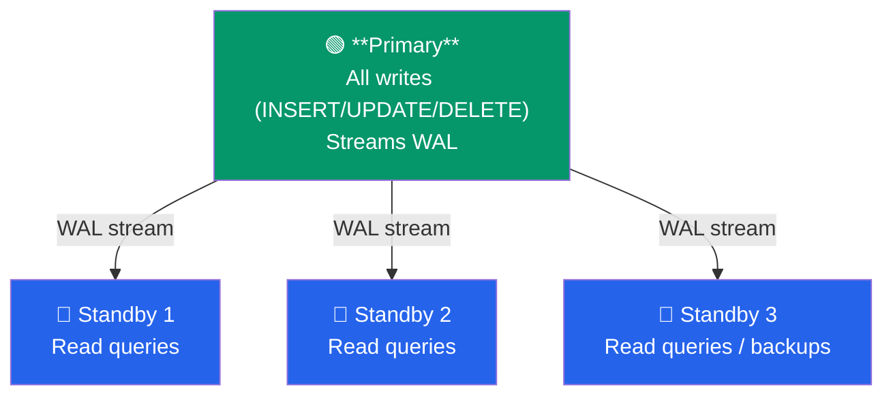
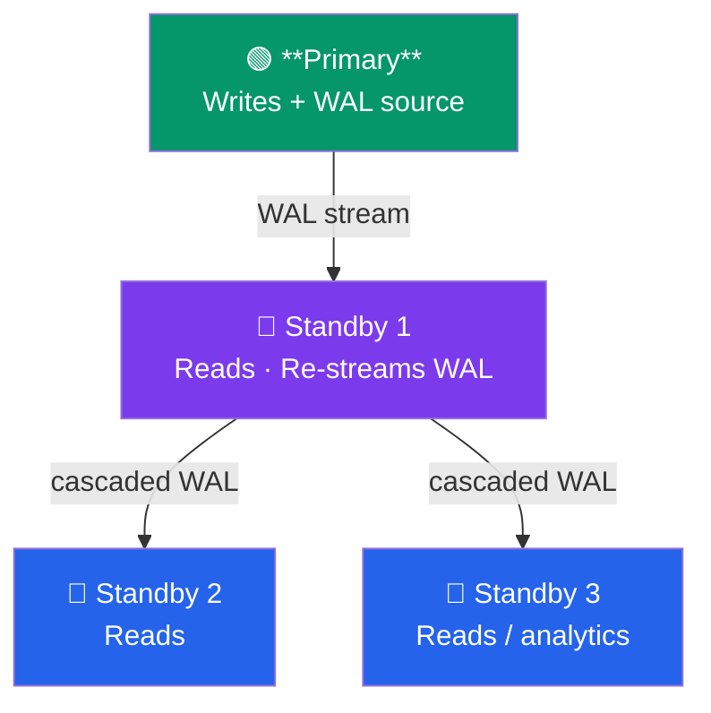
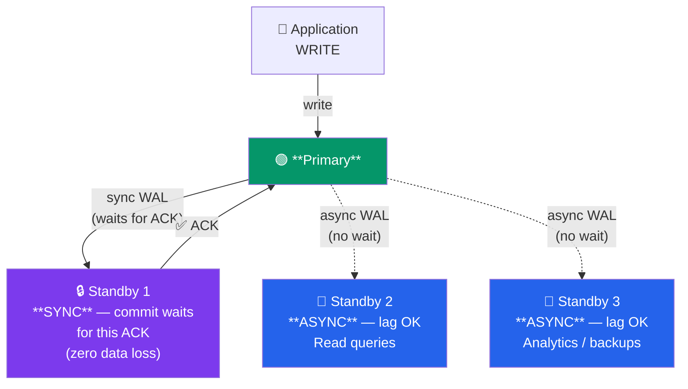

# Replication Basics

## Theory

### Why Replicate

Database replication creates copies of your database across multiple servers. Key benefits:

**High Availability**:
- Automatic failover if primary fails
- Minimal downtime during maintenance
- Geographic redundancy
- Disaster recovery

**Scalability**:
- Distribute read queries across replicas
- Reduce load on primary database
- Scale horizontally for read-heavy workloads

**Performance**:
- Serve reads from geographically closer replicas
- Reduce network latency for users
- Offload reporting/analytics to replicas

**Backup & Recovery**:
- Create backups from replica without impacting primary
- Point-in-time recovery using replica
- Test recovery procedures safely

### Primary/Standby Architecture

PostgreSQL uses a primary/standby (also called master/replica) model:

**Primary (Master)**:
- Accepts all write operations (INSERT, UPDATE, DELETE)
- Generates Write-Ahead Log (WAL) records
- Streams WAL to standby servers
- Single source of truth

**Standby (Replica)**:
- Receives WAL from primary
- Continuously applies WAL to stay in sync
- Can serve read-only queries (hot standby)
- Can be promoted to primary if needed

**Architecture Types**:

1. **Single Primary, Multiple Standbys**:



2. **Cascading Replication** — reduces load on Primary:



3. **Synchronous + Asynchronous Mix** — durable writes with read scale:



### Write-Ahead Log (WAL) Based Replication

PostgreSQL replication is based on the Write-Ahead Log:

**How WAL Works**:
1. Before data changes are written to data files, they're written to WAL
2. WAL is a sequential log of all database changes
3. WAL ensures crash recovery and replication
4. WAL files are typically 16MB segments

**Replication Process**:
1. Primary writes changes to WAL
2. Primary streams WAL to standby via TCP connection
3. Standby receives WAL and writes to its own WAL files
4. Standby replays WAL to apply changes
5. Standby updates its data files to match primary

**WAL Shipping Methods**:

**Streaming Replication** (real-time):
- WAL streamed continuously over TCP
- Minimal replication lag (milliseconds to seconds)
- Most common method
- Requires network connection

**File-based WAL Shipping** (batch):
- WAL files copied after completion
- Higher replication lag
- Works without persistent connection
- Used for archiving and PITR

### Streaming Replication Setup

Streaming replication requires configuration on both primary and standby:

**Primary Configuration**:
- `wal_level`: Must be `replica` or higher
- `max_wal_senders`: Number of concurrent WAL sender processes
- `wal_keep_size`: Minimum WAL to retain (PG13+)
- `archive_mode`: Optional, for WAL archiving
- Authentication: Allow standby to connect

**Standby Configuration**:
- `primary_conninfo`: Connection string to primary
- `restore_command`: Optional, for WAL archive recovery
- Initial data: Created via `pg_basebackup`

### pg_basebackup

`pg_basebackup` creates a base backup of a running PostgreSQL cluster:

**Purpose**:
- Initialize new standby servers
- Create physical backups
- Clone databases for testing

**How It Works**:
1. Connects to primary using replication protocol
2. Starts a backup on primary
3. Copies all data files
4. Optionally streams WAL during copy
5. Ends backup and creates recovery configuration

**Features**:
- No downtime on primary
- Consistent point-in-time snapshot
- Can compress during transfer
- Parallel transfer support (PG15+)

### Hot Standby

Hot standby allows read-only queries on standby servers:

**Configuration**:
- `hot_standby = on` (default in modern versions)
- Standby continuously applies WAL while serving queries

**Capabilities on Hot Standby**:
- All SELECT queries
- EXPLAIN
- Non-writing functions
- Cursors and prepared statements

**Limitations**:
- No writes (INSERT, UPDATE, DELETE)
- Some queries may be canceled if conflicting with WAL replay
- Temporary tables not supported (can use unlogged tables)
- Query performance may vary during heavy WAL replay

**Conflicts**:
When WAL replay conflicts with running queries:
- Query holds lock on row being modified
- Query sees row that WAL wants to delete
- PostgreSQL waits (`max_standby_streaming_delay`)
- If timeout exceeded, query is canceled
- Configure `hot_standby_feedback` to reduce conflicts

### Synchronous vs Asynchronous Replication

**Asynchronous Replication** (default):
- Primary commits without waiting for standby
- Minimal performance impact on primary
- Risk: Committed transactions may be lost on primary failure
- Use case: Read scaling, non-critical redundancy

**Synchronous Replication**:
- Primary waits for at least one standby to confirm WAL receipt
- Zero data loss (committed transactions always on standby)
- Performance impact: Commits wait for network round-trip
- Use case: High availability, data integrity critical

**Configuration**:
```sql
-- On primary
synchronous_standby_names = 'standby1,standby2'  -- Wait for first available
synchronous_standby_names = 'FIRST 2 (standby1,standby2,standby3)'  -- Wait for 2
synchronous_standby_names = 'ANY 1 (standby1,standby2)'  -- Any one is fine
```

**Trade-offs**:
| Aspect | Asynchronous | Synchronous |
|--------|--------------|-------------|
| Data loss risk | Possible | None |
| Performance | Fast | Slower commits |
| Availability | Higher | Lower (needs sync standby) |
| Network dependency | Low | High |

### Replication Slots

Replication slots prevent primary from deleting WAL that standby hasn't received:

**Without Slots**:
- Primary may delete WAL based on `wal_keep_size`
- If standby disconnects and reconnects later, needed WAL may be gone
- Standby fails, requires re-initialization

**With Slots**:
- Primary tracks each standby's WAL position
- Retains WAL until all standbys receive it
- Standbys can reconnect and resume from last position
- Risk: Disk fills up if standby disconnected for long time

**Types**:
- **Physical slots**: For streaming replication
- **Logical slots**: For logical replication

### Monitoring Replication

**Key Metrics**:

**Replication Lag**:
- Time or WAL bytes between primary and standby
- High lag indicates network issues, standby overload, or disk I/O problems

**Standby Status**:
- Connected or disconnected
- WAL sender active
- Sync vs async state

**WAL Generation Rate**:
- How fast primary generates WAL
- Helps plan network bandwidth and storage

**Standby Query Conflicts**:
- How many queries canceled due to WAL replay
- May need to tune `max_standby_streaming_delay`

## Syntax

### Primary Server Configuration

```sql
-- postgresql.conf on primary

-- Enable WAL archiving and replication
wal_level = replica                    -- or 'logical' for logical replication
max_wal_senders = 10                   -- Max concurrent replication connections
wal_keep_size = 1024                   -- MB of WAL to keep (PG13+)
# wal_keep_segments = 64               -- For PG12 and earlier

-- Synchronous replication (optional)
synchronous_commit = on
synchronous_standby_names = ''         -- Empty = async, or specify standbys

-- Archiving (optional, recommended)
archive_mode = on
archive_command = 'cp %p /mnt/archive/%f'

-- Replication slots (recommended)
max_replication_slots = 10

-- Hot standby feedback (reduces conflicts)
wal_sender_timeout = 60s
```

### Replication User Creation

```sql
-- Create replication user on primary
CREATE ROLE replicator WITH REPLICATION LOGIN PASSWORD 'secure_password';

-- Grant connection permissions
-- Edit pg_hba.conf to allow replication connections:
-- host    replication    replicator    192.168.1.0/24    scram-sha-256
```

### Creating Replication Slot

```sql
-- On primary, create physical replication slot
SELECT pg_create_physical_replication_slot('standby1_slot');

-- View replication slots
SELECT * FROM pg_replication_slots;

-- Drop replication slot
SELECT pg_drop_replication_slot('standby1_slot');
```

### pg_basebackup Command

```bash
# Basic backup to create standby
pg_basebackup -h primary_host -U replicator -D /var/lib/postgresql/data \
  -P -Xs -R

# Flags:
# -h: Primary host
# -U: Replication user
# -D: Target data directory (must be empty)
# -P: Show progress
# -Xs: Stream WAL during backup
# -R: Create recovery configuration (standby.signal + primary_conninfo)

# With replication slot
pg_basebackup -h primary_host -U replicator -D /var/lib/postgresql/data \
  -P -Xs -R -S standby1_slot

# Compressed transfer
pg_basebackup -h primary_host -U replicator -D /var/lib/postgresql/data \
  -P -Xs -R -Z 5

# Parallel jobs (PG15+)
pg_basebackup -h primary_host -U replicator -D /var/lib/postgresql/data \
  -P -Xs -R -j 4
```

### Standby Configuration

```sql
-- postgresql.conf on standby

-- Hot standby settings
hot_standby = on                       -- Allow read queries
max_standby_streaming_delay = 30s      -- How long to wait before canceling queries
hot_standby_feedback = on              -- Send feedback to primary to avoid conflicts

-- Recovery settings (postgresql.conf or postgresql.auto.conf)
primary_conninfo = 'host=primary_host port=5432 user=replicator password=secret application_name=standby1'
primary_slot_name = 'standby1_slot'    -- Use replication slot (optional)

-- Promote trigger (legacy, PG12+)
# promote_trigger_file = '/tmp/promote_trigger'
```

### Checking Replication Status

```sql
-- On primary: View replication status
SELECT
  pid,
  usename,
  application_name,
  client_addr,
  client_port,
  state,
  sync_state,
  sent_lsn,
  write_lsn,
  flush_lsn,
  replay_lsn,
  sync_priority,
  pg_wal_lsn_diff(sent_lsn, replay_lsn) AS lag_bytes
FROM pg_stat_replication;

-- On standby: Check if in recovery mode
SELECT pg_is_in_recovery();  -- Returns true if standby

-- On standby: View replication lag
SELECT
  NOW() - pg_last_xact_replay_timestamp() AS replication_lag;

-- On standby: Get last received/replayed WAL
SELECT
  pg_last_wal_receive_lsn() AS received,
  pg_last_wal_replay_lsn() AS replayed,
  pg_wal_lsn_diff(pg_last_wal_receive_lsn(), pg_last_wal_replay_lsn()) AS lag_bytes;
```

## Examples

### Example 1: Complete Streaming Replication Setup

**Step 1: Configure Primary**

```sql
-- On primary, edit postgresql.conf
-- wal_level = replica
-- max_wal_senders = 5
-- wal_keep_size = 1024

-- Create replication user
CREATE ROLE replicator WITH REPLICATION LOGIN PASSWORD 'rep_password_2026';

-- Create replication slot
SELECT pg_create_physical_replication_slot('standby1_slot');

-- Edit pg_hba.conf to allow replication connection
-- Add line:
-- host    replication    replicator    10.0.1.20/32    scram-sha-256

-- Reload configuration
SELECT pg_reload_conf();
```

**Step 2: Create Base Backup for Standby**

```bash
# On standby server (ensure data directory is empty)
sudo systemctl stop postgresql

# Remove existing data
sudo rm -rf /var/lib/postgresql/16/main/*

# Create base backup from primary
sudo -u postgres pg_basebackup \
  -h 10.0.1.10 \
  -U replicator \
  -D /var/lib/postgresql/16/main \
  -P \
  -Xs \
  -R \
  -S standby1_slot

# Verify standby.signal was created
ls -la /var/lib/postgresql/16/main/standby.signal
```

**Step 3: Configure Standby**

```bash
# Edit postgresql.auto.conf (created by pg_basebackup -R)
# Should contain:
# primary_conninfo = 'host=10.0.1.10 port=5432 user=replicator password=rep_password_2026 application_name=standby1'
# primary_slot_name = 'standby1_slot'

# Optionally edit postgresql.conf
# hot_standby = on
# max_standby_streaming_delay = 30s
# hot_standby_feedback = on

# Start standby
sudo systemctl start postgresql
```

**Step 4: Verify Replication**

```sql
-- On primary
SELECT
  application_name,
  client_addr,
  state,
  sync_state,
  pg_wal_lsn_diff(sent_lsn, replay_lsn) AS lag_bytes
FROM pg_stat_replication;

-- Expected output:
-- application_name | client_addr | state     | sync_state | lag_bytes
-- standby1        | 10.0.1.20   | streaming | async      | 0

-- On standby
SELECT pg_is_in_recovery();  -- Should return true

SELECT NOW() - pg_last_xact_replay_timestamp() AS lag;
-- Should show minimal lag (< 1 second)
```

### Example 2: Synchronous Replication Setup

```sql
-- On primary, configure synchronous replication
-- Edit postgresql.conf:
-- synchronous_standby_names = 'FIRST 1 (standby1, standby2)'
-- synchronous_commit = on

-- Reload configuration
SELECT pg_reload_conf();

-- Verify synchronous standby
SELECT
  application_name,
  sync_state,
  sync_priority
FROM pg_stat_replication;

-- Expected output:
-- application_name | sync_state | sync_priority
-- standby1        | sync       | 1
-- standby2        | potential  | 2

-- Test synchronous commit
BEGIN;
INSERT INTO test_table VALUES (1, 'sync test');
COMMIT;  -- Will wait for standby1 to confirm WAL receipt

-- Check replication lag (should be very low)
SELECT
  application_name,
  pg_wal_lsn_diff(sent_lsn, flush_lsn) AS lag_bytes
FROM pg_stat_replication;
```

### Example 3: Cascading Replication

Set up a three-tier replication: Primary -> Standby1 -> Standby2

**Step 1: Set up Standby1** (as in Example 1)

**Step 2: Configure Standby1 as Source for Cascading**

```sql
-- On standby1, edit postgresql.conf
-- wal_level = replica  (inherited from primary)
-- max_wal_senders = 3
-- hot_standby = on

-- Restart standby1
-- sudo systemctl restart postgresql
```

**Step 3: Create Standby2 from Standby1**

```bash
# On standby2 server
sudo -u postgres pg_basebackup \
  -h standby1_host \
  -U replicator \
  -D /var/lib/postgresql/16/main \
  -P \
  -Xs \
  -R

# Start standby2
sudo systemctl start postgresql
```

**Step 4: Verify Cascading Replication**

```sql
-- On primary
SELECT application_name, client_addr FROM pg_stat_replication;
-- Should show only standby1

-- On standby1
SELECT application_name, client_addr FROM pg_stat_replication;
-- Should show standby2

-- On standby2
SELECT pg_is_in_recovery();  -- true
```

### Example 4: Monitoring Replication Health

```sql
-- Create monitoring view on primary
CREATE VIEW replication_status AS
SELECT
  application_name,
  client_addr,
  client_port,
  state,
  sync_state,
  sent_lsn,
  write_lsn,
  flush_lsn,
  replay_lsn,
  pg_wal_lsn_diff(sent_lsn, write_lsn) AS write_lag_bytes,
  pg_wal_lsn_diff(write_lsn, flush_lsn) AS flush_lag_bytes,
  pg_wal_lsn_diff(flush_lsn, replay_lsn) AS replay_lag_bytes,
  pg_wal_lsn_diff(sent_lsn, replay_lsn) AS total_lag_bytes
FROM pg_stat_replication;

-- Query the view
SELECT * FROM replication_status;

-- Alert if lag exceeds threshold (10MB)
SELECT
  application_name,
  total_lag_bytes
FROM replication_status
WHERE total_lag_bytes > 10 * 1024 * 1024;

-- Check replication slot disk usage
SELECT
  slot_name,
  slot_type,
  active,
  pg_wal_lsn_diff(pg_current_wal_lsn(), restart_lsn) AS retained_wal_bytes,
  pg_size_pretty(pg_wal_lsn_diff(pg_current_wal_lsn(), restart_lsn)) AS retained_wal
FROM pg_replication_slots;

-- On standby: Create lag monitoring query
CREATE VIEW standby_lag AS
SELECT
  NOW() AS current_time,
  pg_last_xact_replay_timestamp() AS last_replay,
  NOW() - pg_last_xact_replay_timestamp() AS replication_lag,
  pg_last_wal_receive_lsn() AS received_lsn,
  pg_last_wal_replay_lsn() AS replayed_lsn,
  pg_wal_lsn_diff(pg_last_wal_receive_lsn(), pg_last_wal_replay_lsn()) AS lag_bytes;

SELECT * FROM standby_lag;
```

## Common Mistakes

### 1. Forgetting to Set wal_level

**Wrong**:
```sql
-- wal_level = minimal (default on old versions)
-- Replication will not work
```

**Correct**:
```sql
-- postgresql.conf
wal_level = replica
-- Restart PostgreSQL after changing
```

### 2. Not Configuring pg_hba.conf

**Wrong**:
```
# pg_hba.conf doesn't allow replication connections
# Standby cannot connect
```

**Correct**:
```
# pg_hba.conf on primary
host    replication    replicator    standby_ip/32    scram-sha-256
```

### 3. Running pg_basebackup on Non-Empty Directory

**Wrong**:
```bash
pg_basebackup -D /var/lib/postgresql/data  # Directory has files
# ERROR: directory "/var/lib/postgresql/data" exists but is not empty
```

**Correct**:
```bash
# Ensure directory is empty
rm -rf /var/lib/postgresql/data/*
pg_basebackup -D /var/lib/postgresql/data
```

### 4. Not Using Replication Slots

**Wrong**:
```
# No replication slot
# Standby disconnects for maintenance
# Primary deletes WAL
# Standby cannot resume, needs full re-sync
```

**Correct**:
```sql
-- Use replication slots
SELECT pg_create_physical_replication_slot('standby1_slot');
-- Configure standby to use it
-- primary_slot_name = 'standby1_slot'
```

### 5. Forgetting to Monitor Replication Lag

**Wrong**:
```
# No monitoring
# Lag increases to hours
# Failover would lose data
```

**Correct**:
```sql
-- Regular monitoring
SELECT
  application_name,
  pg_wal_lsn_diff(sent_lsn, replay_lsn) AS lag_bytes,
  NOW() - pg_last_xact_replay_timestamp() AS time_lag
FROM pg_stat_replication;

-- Set up alerts for lag > threshold
```

### 6. Synchronous Replication Without Failover Plan

**Wrong**:
```
# synchronous_standby_names = 'standby1'
# Standby1 goes down
# Primary blocks on commits waiting for standby
# Application becomes unavailable
```

**Correct**:
```
# Use multiple standbys with FIRST or ANY
synchronous_standby_names = 'FIRST 1 (standby1, standby2, standby3)'
# If standby1 fails, standby2 becomes sync
```

## Best Practices

### 1. Always Use Replication Slots

Prevents WAL deletion before standby receives it:
```sql
SELECT pg_create_physical_replication_slot('standby_name_slot');
```

### 2. Monitor Replication Continuously

Set up monitoring and alerting:
```sql
-- Check lag every minute
SELECT
  application_name,
  pg_wal_lsn_diff(sent_lsn, replay_lsn) AS lag_bytes
FROM pg_stat_replication;

-- Alert if lag > 100MB or time lag > 1 minute
```

### 3. Use Synchronous Replication for Critical Data

For zero data loss:
```
synchronous_standby_names = 'FIRST 1 (standby1, standby2)'
synchronous_commit = on
```

### 4. Enable hot_standby_feedback

Reduces query conflicts on standbys:
```
hot_standby_feedback = on
```

### 5. Regular Failover Testing

Test failover procedures quarterly:
```bash
# Promote standby to primary
pg_ctl promote -D /var/lib/postgresql/data
# Or: SELECT pg_promote();
```

### 6. Use Compression for Remote Replicas

For geographically distant replicas:
```bash
# Use compression in connection string
primary_conninfo = 'host=remote_host ... compression=on'
```

### 7. Monitor Replication Slot Disk Usage

Prevent disk space issues:
```sql
SELECT
  slot_name,
  pg_size_pretty(pg_wal_lsn_diff(pg_current_wal_lsn(), restart_lsn)) AS wal_retained
FROM pg_replication_slots
WHERE pg_wal_lsn_diff(pg_current_wal_lsn(), restart_lsn) > 1073741824;  -- > 1GB
```

## Practice Exercises

### Exercise 1: Set Up Two Standbys with Different Purposes

Configure one synchronous standby for HA and one asynchronous for reporting.

**Solution**:

```sql
-- On primary, create two replication slots
SELECT pg_create_physical_replication_slot('ha_standby_slot');
SELECT pg_create_physical_replication_slot('reporting_standby_slot');

-- Configure synchronous replication for HA standby only
-- postgresql.conf:
-- synchronous_standby_names = 'ha_standby'
-- synchronous_commit = on

-- pg_hba.conf:
-- host replication replicator ha_standby_ip/32 scram-sha-256
-- host replication replicator reporting_standby_ip/32 scram-sha-256

SELECT pg_reload_conf();

-- On ha_standby:
-- pg_basebackup with application_name=ha_standby, slot=ha_standby_slot

-- On reporting_standby:
-- pg_basebackup with application_name=reporting_standby, slot=reporting_standby_slot
-- postgresql.conf: max_standby_streaming_delay = -1  (never cancel queries)

-- Verify setup
SELECT
  application_name,
  sync_state,
  state
FROM pg_stat_replication;

-- Expected:
-- ha_standby       | sync  | streaming
-- reporting_standby| async | streaming
```

### Exercise 2: Implement Replication Monitoring

Create a comprehensive monitoring solution.

**Solution**:

```sql
-- On primary, create monitoring schema
CREATE SCHEMA IF NOT EXISTS monitoring;

-- Replication status view
CREATE OR REPLACE VIEW monitoring.replication_status AS
SELECT
  application_name,
  client_addr,
  state,
  sync_state,
  pg_wal_lsn_diff(sent_lsn, replay_lsn) AS lag_bytes,
  pg_size_pretty(pg_wal_lsn_diff(sent_lsn, replay_lsn)) AS lag,
  CASE
    WHEN pg_wal_lsn_diff(sent_lsn, replay_lsn) > 104857600 THEN 'CRITICAL'  -- > 100MB
    WHEN pg_wal_lsn_diff(sent_lsn, replay_lsn) > 10485760 THEN 'WARNING'    -- > 10MB
    ELSE 'OK'
  END AS status,
  sent_lsn,
  replay_lsn
FROM pg_stat_replication;

-- Replication slot health view
CREATE OR REPLACE VIEW monitoring.replication_slot_health AS
SELECT
  slot_name,
  slot_type,
  active,
  pg_wal_lsn_diff(pg_current_wal_lsn(), restart_lsn) AS wal_retained_bytes,
  pg_size_pretty(pg_wal_lsn_diff(pg_current_wal_lsn(), restart_lsn)) AS wal_retained,
  CASE
    WHEN NOT active THEN 'INACTIVE'
    WHEN pg_wal_lsn_diff(pg_current_wal_lsn(), restart_lsn) > 1073741824 THEN 'CRITICAL'  -- > 1GB
    WHEN pg_wal_lsn_diff(pg_current_wal_lsn(), restart_lsn) > 104857600 THEN 'WARNING'    -- > 100MB
    ELSE 'OK'
  END AS status
FROM pg_replication_slots;

-- Function to check replication health
CREATE OR REPLACE FUNCTION monitoring.check_replication_health()
RETURNS TABLE(check_name TEXT, status TEXT, details TEXT) AS $$
BEGIN
  -- Check if any standbys are connected
  RETURN QUERY
  SELECT
    'standbys_connected'::TEXT,
    CASE WHEN COUNT(*) > 0 THEN 'OK' ELSE 'CRITICAL' END,
    'Connected standbys: ' || COUNT(*)::TEXT
  FROM pg_stat_replication;

  -- Check for excessive lag
  RETURN QUERY
  SELECT
    'replication_lag'::TEXT,
    MAX(CASE
      WHEN lag_bytes > 104857600 THEN 'CRITICAL'
      WHEN lag_bytes > 10485760 THEN 'WARNING'
      ELSE 'OK'
    END),
    'Max lag: ' || pg_size_pretty(MAX(lag_bytes))
  FROM monitoring.replication_status;

  -- Check for inactive slots
  RETURN QUERY
  SELECT
    'inactive_slots'::TEXT,
    CASE WHEN COUNT(*) > 0 THEN 'WARNING' ELSE 'OK' END,
    'Inactive slots: ' || COUNT(*)::TEXT
  FROM pg_replication_slots
  WHERE NOT active;
END;
$$ LANGUAGE plpgsql;

-- Run health check
SELECT * FROM monitoring.check_replication_health();
```

### Exercise 3: Simulate and Recover from Network Interruption

Test replication resilience to network issues.

**Solution**:

```bash
# Step 1: Verify normal replication
# On primary:
psql -c "SELECT * FROM pg_stat_replication;"

# Step 2: Simulate network interruption (on standby)
# Block connection to primary
sudo iptables -A OUTPUT -d primary_ip -j DROP

# Step 3: Verify standby detects disconnection
# On standby:
psql -c "SELECT pg_last_wal_receive_lsn();"
# Run again after a few seconds - should be same (no new WAL)

# Step 4: Make changes on primary
# On primary:
psql -c "CREATE TABLE test_replication (id INT, data TEXT);"
psql -c "INSERT INTO test_replication VALUES (1, 'during network issue');"

# Step 5: Check replication slot retains WAL
# On primary:
psql -c "SELECT slot_name, pg_size_pretty(pg_wal_lsn_diff(pg_current_wal_lsn(), restart_lsn)) FROM pg_replication_slots;"
# Should show WAL accumulating

# Step 6: Restore network connection
sudo iptables -D OUTPUT -d primary_ip -j DROP

# Step 7: Verify standby catches up
# On standby (wait a few seconds):
psql -c "SELECT COUNT(*) FROM test_replication;"
# Should return 1 (caught up)

# Step 8: Verify lag is back to normal
# On primary:
psql -c "SELECT application_name, pg_wal_lsn_diff(sent_lsn, replay_lsn) FROM pg_stat_replication;"
# Should show 0 or minimal lag
```

These exercises provide hands-on experience with replication setup, monitoring, and troubleshooting.
