# High Availability

## Theory

### HA Concepts

High Availability (HA) ensures database services remain accessible despite failures:

**Key Metrics**:

**RTO (Recovery Time Objective)**:
- Maximum acceptable downtime
- How quickly service must be restored after failure
- Examples: 1 minute, 5 minutes, 1 hour
- Lower RTO = higher cost and complexity

**RPO (Recovery Point Objective)**:
- Maximum acceptable data loss
- How much recent data can be lost in recovery
- Examples: 0 seconds (no data loss), 5 minutes, 1 hour
- Lower RPO = more frequent backups/sync replication

**Availability Metrics**:
- 99.9% (three nines): ~8.76 hours downtime/year
- 99.99% (four nines): ~52.6 minutes downtime/year
- 99.999% (five nines): ~5.26 minutes downtime/year

**Components of HA**:

1. **Redundancy**: Multiple database servers (primary + standbys)
2. **Failover**: Automatic promotion of standby to primary
3. **Health Checks**: Continuous monitoring of primary health
4. **Routing**: Direct clients to active primary
5. **Data Protection**: Replication to prevent data loss

### Automatic Failover

Manual failover requires human intervention (minutes to hours of downtime). Automatic failover detects failures and promotes standby automatically:

**Failover Process**:
1. Monitor detects primary failure
2. Consensus on primary state (avoid split-brain)
3. Select best standby candidate (least lag, priority)
4. Promote standby to primary
5. Reconfigure other standbys to follow new primary
6. Update connection routing (DNS, VIP, proxy)
7. Application reconnects to new primary

```mermaid
flowchart TD
    subgraph Normal["✅ Normal Operation"]
        App1["Application"] -->|"writes"| P1["Primary\nPostgreSQL"]
        P1 -->|"streaming\nreplication"| S1["Standby 1\n(sync)"]
        P1 -->|"streaming\nreplication"| S2["Standby 2\n(async)"]
        App1 -->|"reads"| S1
    end

    subgraph Failure["🔴 Primary Failure Detected"]
        Mon["Patroni Monitor\n(etcd consensus)"]
        Mon -->|"1. detect failure"| Det["Primary Unreachable"]
        Det -->|"2. elect leader"| Elect["Standby 1 selected\n(least lag)"]
        Elect -->|"3. promote"| NewP["New Primary\n(former Standby 1)"]
        NewP -->|"4. reconfigure"| NewS["Standby 2 follows\nnew primary"]
        NewP -->|"5. update routing"| Proxy["HAProxy / VIP\npoints to new primary"]
        Proxy -->|"6. reconnect"| App2["Application\n(transparent)"]
    end

    style P1 fill:#2563eb,color:#fff
    style S1 fill:#059669,color:#fff
    style S2 fill:#059669,color:#fff
    style Det fill:#ef4444,color:#fff
    style NewP fill:#2563eb,color:#fff
    style Mon fill:#7c3aed,color:#fff
    style Proxy fill:#f59e0b,color:#000
```



**Challenges**:
- Split-brain: Two nodes think they're primary
- Data loss: Uncommitted transactions on old primary
- Client redirection: Applications must reconnect
- Fencing: Ensure old primary doesn't come back

### Patroni

Patroni is a popular HA solution for PostgreSQL using distributed consensus:

**Architecture**:
```
etcd/Consul/ZooKeeper (Distributed Config Store)
    ├─> Patroni + PostgreSQL (primary)
    ├─> Patroni + PostgreSQL (standby 1)
    └─> Patroni + PostgreSQL (standby 2)
```

**Key Features**:
- Automatic failover (typically < 30 seconds)
- Uses etcd, Consul, or ZooKeeper for consensus
- Built-in streaming replication setup
- REST API for monitoring and management
- Configurable failover policies
- Rolling restarts without downtime
- Integrates with HAProxy for routing

**How It Works**:
1. Each Patroni instance registers in DCS (Distributed Config Store)
2. Leader election via DCS determines primary
3. Primary holds a TTL lease in DCS
4. If primary fails to renew lease, failover triggered
5. Standby with least lag promoted
6. Other standbys reconfigured automatically

**Benefits**:
- Production-ready, widely adopted
- Active development and community
- Handles complex scenarios (network partitions, etc.)
- Cloud and on-premise deployments

**Drawbacks**:
- Requires DCS infrastructure (etcd/Consul/ZK)
- Learning curve for configuration
- Additional moving parts to manage

### pg_auto_failover

pg_auto_failover is a simpler HA solution from Citus Data (now Microsoft):

**Architecture**:
```
Monitor (pg_auto_failover monitor)
    ├─> PostgreSQL (primary) + pg_auto_failover keeper
    └─> PostgreSQL (standby) + pg_auto_failover keeper
```

**Key Features**:
- Built-in monitor (no external DCS required)
- Automatic failover (< 1 minute typically)
- Simple setup and configuration
- Supports synchronous replication
- Orchestrates manual switchover
- Health checks and automatic recovery

**How It Works**:
1. Monitor tracks state of primary and standby
2. Keepers report health to monitor
3. Monitor decides on state transitions
4. Keepers execute state changes (promote, follow, etc.)
5. Monitor stores state in its own PostgreSQL database

**Benefits**:
- Simpler than Patroni (no external DCS)
- Good for 2-3 node setups
- Easy to understand architecture
- Lower operational overhead

**Drawbacks**:
- Monitor is single point of failure (can be HA itself)
- Less flexible than Patroni
- Smaller community than Patroni
- Limited to PostgreSQL (no multi-DB support)

### repmgr

repmgr is an older, established HA solution:

**Key Features**:
- Replication cluster management
- Automatic failover (with repmgrd daemon)
- Manual switchover support
- Event notifications
- Command-line tools for administration

**Status**:
- Mature and stable
- Less active development than Patroni
- Still used in production by many

**When to Use**:
- Existing repmgr deployments
- Prefer simpler tool without DCS
- Don't need frequent topology changes

### Virtual IPs and DNS Failover

**Virtual IP (VIP)**:
- Single IP address shared between nodes
- Moves to new primary during failover
- Clients connect to VIP, automatically use new primary
- Requires network configuration (Keepalived, Pacemaker)

**Example**:
```
VIP: 192.168.1.100
  ├─> Primary: 192.168.1.10 (owns VIP)
  └─> Standby: 192.168.1.11 (standby)

After failover:
VIP: 192.168.1.100
  ├─> Old Primary: 192.168.1.10 (down)
  └─> New Primary: 192.168.1.11 (owns VIP now)
```

**DNS Failover**:
- DNS record points to current primary
- Updated during failover
- DNS TTL must be low (30-60 seconds)
- Client-side DNS caching can delay switchover

**Challenges**:
- DNS caching can delay failover
- Not all clients respect TTL
- VIPs require layer-2 network access

### Load Balancing Reads

Distribute read queries across multiple standbys:

**HAProxy**:
- Layer 4/7 load balancer
- Health checks for PostgreSQL
- Separate pools for read/write
- Widely used with Patroni

**Configuration**:
```
HAProxy
  ├─> Write Pool (port 5432)
  │     └─> Primary only
  └─> Read Pool (port 5433)
        ├─> Standby 1
        ├─> Standby 2
        └─> Standby 3
```

**pgpool-II**:
- PostgreSQL-specific middleware
- Connection pooling + load balancing
- Query routing (read/write split)
- Built-in failover support
- More complex than HAProxy

### Split-Brain Prevention

Split-brain: Multiple nodes think they're primary simultaneously.

**Causes**:
- Network partition isolates nodes
- Monitoring failure
- Configuration errors

**Consequences**:
- Divergent data on both primaries
- Data conflicts on recovery
- Potential data loss

**Prevention Strategies**:

**Quorum-Based**:
- Require majority consensus to be primary
- etcd/Consul/ZK provide quorum
- Node can only be primary if it can reach quorum

**Fencing**:
- Ensure old primary is truly stopped
- STONITH (Shoot The Other Node In The Head)
- Power management, network isolation

**Witness Nodes**:
- Dedicated node for breaking ties
- Doesn't replicate data
- Only participates in consensus

**Synchronous Replication**:
- Primary requires standby confirmation
- If network partitioned, primary cannot commit
- Prevents divergence

### Health Checks

Continuous monitoring to detect failures:

**Health Check Types**:

1. **Process Check**: Is PostgreSQL running?
2. **Connection Check**: Can we connect?
3. **Query Check**: Can we run SELECT 1?
4. **Replication Check**: Is standby connected and syncing?
5. **Lag Check**: Is replication lag acceptable?
6. **Disk Space Check**: Sufficient space available?
7. **Load Check**: Is server overloaded?

**Health Check Intervals**:
- Too frequent: Network overhead, false positives
- Too infrequent: Slow failure detection
- Typical: 5-10 seconds

**Failure Thresholds**:
- Single failure might be transient (network blip)
- Multiple consecutive failures before action
- Typical: 3-5 consecutive failures

### HA Architecture Patterns

**Single-Region HA**:
```
Region: US-East
  ├─> AZ-1: Primary + HAProxy
  ├─> AZ-2: Standby + HAProxy
  └─> AZ-3: Standby + etcd
```
- RTO: < 1 minute
- RPO: 0 (sync replication)
- Protects against: Server failure, AZ failure
- Doesn't protect against: Region failure

**Multi-Region HA**:
```
Region: US-East (Primary)
  ├─> Primary + Standby (sync)

Region: US-West (Async)
  └─> Standby (async from US-East)
```
- RTO: 1-5 minutes (cross-region)
- RPO: Seconds to minutes (async replication)
- Protects against: Region failure
- Trade-off: Higher latency for cross-region

**Read Scaling HA**:
```
Primary (writes)
  ├─> Standby 1 (HA, sync)
  ├─> Standby 2 (reads, async)
  ├─> Standby 3 (reads, async)
  └─> Standby 4 (reads, async)
```
- Combine HA with read scaling
- Sync standby for HA (low latency)
- Async standbys for read distribution

## Syntax

### Patroni Configuration

```yaml
# /etc/patroni/patroni.yml

scope: postgres-cluster
namespace: /service/
name: postgres-node1

restapi:
  listen: 0.0.0.0:8008
  connect_address: 192.168.1.10:8008

etcd:
  hosts: 192.168.1.20:2379,192.168.1.21:2379,192.168.1.22:2379

bootstrap:
  dcs:
    ttl: 30
    loop_wait: 10
    retry_timeout: 10
    maximum_lag_on_failover: 1048576  # 1MB
    synchronous_mode: true
    synchronous_mode_strict: false
    postgresql:
      use_pg_rewind: true
      parameters:
        max_connections: 200
        shared_buffers: 2GB
        wal_level: replica
        hot_standby: on
        max_wal_senders: 10
        max_replication_slots: 10

postgresql:
  listen: 0.0.0.0:5432
  connect_address: 192.168.1.10:5432
  data_dir: /var/lib/postgresql/16/main
  bin_dir: /usr/lib/postgresql/16/bin
  pgpass: /var/lib/postgresql/.pgpass
  authentication:
    replication:
      username: replicator
      password: rep_password
    superuser:
      username: postgres
      password: postgres_password
  parameters:
    unix_socket_directories: /var/run/postgresql

tags:
  nofailover: false
  noloadbalance: false
  clonefrom: false
  nosync: false
```

### Patroni Commands

```bash
# Check cluster status
patronictl -c /etc/patroni/patroni.yml list postgres-cluster

# Switchover to specific node
patronictl -c /etc/patroni/patroni.yml switchover postgres-cluster \
  --master postgres-node1 --candidate postgres-node2

# Reinitialize failed node
patronictl -c /etc/patroni/patroni.yml reinit postgres-cluster postgres-node1

# Restart PostgreSQL on node
patronictl -c /etc/patroni/patroni.yml restart postgres-cluster postgres-node1

# Reload configuration
patronictl -c /etc/patroni/patroni.yml reload postgres-cluster postgres-node1

# Edit configuration
patronictl -c /etc/patroni/patroni.yml edit-config postgres-cluster
```

### pg_auto_failover Setup

```bash
# Install pg_auto_failover
sudo apt-get install postgresql-16-auto-failover

# Initialize monitor
pg_autoctl create monitor \
  --hostname monitor.example.com \
  --pgdata /var/lib/postgresql/monitor \
  --pgport 5432

# Initialize primary
pg_autoctl create postgres \
  --hostname primary.example.com \
  --pgdata /var/lib/postgresql/16/main \
  --pgport 5432 \
  --monitor postgres://autoctl_node@monitor.example.com/pg_auto_failover

# Initialize standby
pg_autoctl create postgres \
  --hostname standby.example.com \
  --pgdata /var/lib/postgresql/16/main \
  --pgport 5432 \
  --monitor postgres://autoctl_node@monitor.example.com/pg_auto_failover

# Check status
pg_autoctl show state --pgdata /var/lib/postgresql/16/main

# Perform manual failover
pg_autoctl perform failover --pgdata /var/lib/postgresql/16/main

# Perform switchover
pg_autoctl perform switchover --pgdata /var/lib/postgresql/16/main
```

### HAProxy Configuration

```
# /etc/haproxy/haproxy.cfg

global
    maxconn 1000

defaults
    log global
    mode tcp
    timeout connect 10s
    timeout client 30s
    timeout server 30s

# PostgreSQL write (primary only)
listen postgres_write
    bind *:5432
    option httpchk
    http-check expect status 200
    default-server inter 3s fall 3 rise 2 on-marked-down shutdown-sessions
    server postgres-node1 192.168.1.10:5432 check port 8008
    server postgres-node2 192.168.1.11:5432 check port 8008 backup
    server postgres-node3 192.168.1.12:5432 check port 8008 backup

# PostgreSQL read (all nodes)
listen postgres_read
    bind *:5433
    balance roundrobin
    option httpchk
    http-check expect status 206
    default-server inter 3s fall 3 rise 2
    server postgres-node1 192.168.1.10:5432 check port 8008
    server postgres-node2 192.168.1.11:5432 check port 8008
    server postgres-node3 192.168.1.12:5432 check port 8008

# HAProxy stats
listen stats
    bind *:7000
    stats enable
    stats uri /
```

### Health Check Queries

```sql
-- Simple connection check
SELECT 1;

-- Check if node is primary
SELECT NOT pg_is_in_recovery() AS is_primary;

-- Check replication lag (on standby)
SELECT EXTRACT(EPOCH FROM (NOW() - pg_last_xact_replay_timestamp())) AS lag_seconds;

-- Check if accepting connections
SELECT pg_is_ready();

-- Comprehensive health check
CREATE OR REPLACE FUNCTION health_check()
RETURNS TABLE(
  check_name TEXT,
  status TEXT,
  details TEXT
) AS $$
BEGIN
  -- Check if database is accepting connections
  RETURN QUERY SELECT
    'accepting_connections'::TEXT,
    'OK'::TEXT,
    'Database is accepting connections'::TEXT;

  -- Check if primary or standby
  RETURN QUERY SELECT
    'node_role'::TEXT,
    CASE WHEN pg_is_in_recovery() THEN 'STANDBY' ELSE 'PRIMARY' END,
    ''::TEXT;

  -- Check replication lag if standby
  IF pg_is_in_recovery() THEN
    RETURN QUERY SELECT
      'replication_lag'::TEXT,
      CASE
        WHEN EXTRACT(EPOCH FROM (NOW() - pg_last_xact_replay_timestamp())) > 60 THEN 'WARNING'
        ELSE 'OK'
      END,
      'Lag: ' || ROUND(EXTRACT(EPOCH FROM (NOW() - pg_last_xact_replay_timestamp()))) || 's';
  END IF;

  -- Check disk space
  RETURN QUERY SELECT
    'disk_space'::TEXT,
    CASE
      WHEN (pg_database_size(current_database()) * 2) < pg_tablespace_size('pg_default') THEN 'OK'
      ELSE 'WARNING'
    END,
    'Database: ' || pg_size_pretty(pg_database_size(current_database()));
END;
$$ LANGUAGE plpgsql;

-- Use in health check
SELECT * FROM health_check();
```

## Examples

### Example 1: Patroni Three-Node Cluster Setup

**Prerequisites**: etcd cluster running on three nodes.

**Step 1: Install Patroni on All Nodes**

```bash
# On each PostgreSQL node
sudo apt-get install patroni

# Create Patroni configuration directory
sudo mkdir -p /etc/patroni
```

**Step 2: Configure Node 1 (Primary)**

```yaml
# /etc/patroni/patroni.yml on node1
scope: prod-cluster
namespace: /db/
name: node1

restapi:
  listen: 0.0.0.0:8008
  connect_address: 192.168.1.10:8008

etcd:
  hosts: 192.168.1.20:2379,192.168.1.21:2379,192.168.1.22:2379

bootstrap:
  dcs:
    ttl: 30
    loop_wait: 10
    retry_timeout: 10
    maximum_lag_on_failover: 1048576
    postgresql:
      use_pg_rewind: true
      parameters:
        wal_level: replica
        hot_standby: on
        max_connections: 200
        max_wal_senders: 10

  initdb:
    - encoding: UTF8
    - data-checksums

  pg_hba:
    - host replication replicator 0.0.0.0/0 scram-sha-256
    - host all all 0.0.0.0/0 scram-sha-256

  users:
    admin:
      password: admin_password
      options:
        - createrole
        - createdb

postgresql:
  listen: 0.0.0.0:5432
  connect_address: 192.168.1.10:5432
  data_dir: /var/lib/postgresql/16/main
  bin_dir: /usr/lib/postgresql/16/bin
  authentication:
    replication:
      username: replicator
      password: rep_pass
    superuser:
      username: postgres
      password: postgres_pass

tags:
  nofailover: false
  noloadbalance: false
```

**Step 3: Start Patroni on Node 1**

```bash
sudo systemctl start patroni
sudo systemctl enable patroni

# Check status
patronictl -c /etc/patroni/patroni.yml list prod-cluster
```

**Step 4: Configure and Start Nodes 2 and 3**

Same configuration, but change:
- `name: node2` and `name: node3`
- `connect_address: 192.168.1.11:8008` and `192.168.1.12:8008`

```bash
# On node2 and node3
sudo systemctl start patroni
sudo systemctl enable patroni
```

**Step 5: Verify Cluster**

```bash
patronictl -c /etc/patroni/patroni.yml list prod-cluster

# Output:
# + Cluster: prod-cluster (7123456789012345678) -----+----+-----------+
# | Member | Host          | Role    | State     | TL | Lag in MB |
# +--------+---------------+---------+-----------+----+-----------+
# | node1  | 192.168.1.10  | Leader  | running   |  1 |           |
# | node2  | 192.168.1.11  | Replica | streaming |  1 |         0 |
# | node3  | 192.168.1.12  | Replica | streaming |  1 |         0 |
# +--------+---------------+---------+-----------+----+-----------+
```

### Example 2: Test Automatic Failover with Patroni

```bash
# Step 1: Check current cluster state
patronictl -c /etc/patroni/patroni.yml list prod-cluster
# Note which node is Leader (e.g., node1)

# Step 2: Simulate primary failure
# On node1 (current primary)
sudo systemctl stop patroni

# Step 3: Watch failover (on any node)
watch -n 1 'patronictl -c /etc/patroni/patroni.yml list prod-cluster'

# Within 30-60 seconds, you should see:
# - node1: State changes to "stopped"
# - node2 or node3: Role changes to "Leader"
# - Other standby: Still "Replica", now following new leader

# Step 4: Bring node1 back online
# On node1
sudo systemctl start patroni

# Step 5: Verify node1 rejoins as replica
patronictl -c /etc/patroni/patroni.yml list prod-cluster
# node1 should be "Replica" now
```

### Example 3: HAProxy with Patroni for Read/Write Split

**Step 1: Install HAProxy**

```bash
sudo apt-get install haproxy
```

**Step 2: Configure HAProxy**

```
# /etc/haproxy/haproxy.cfg

global
    maxconn 1000
    log /dev/log local0

defaults
    log global
    mode tcp
    option tcplog
    timeout connect 10s
    timeout client 1h
    timeout server 1h

# Primary endpoint (writes)
listen postgres_primary
    bind *:5432
    option httpchk GET /primary
    http-check expect status 200
    default-server inter 3s fall 3 rise 2
    server node1 192.168.1.10:5432 check port 8008
    server node2 192.168.1.11:5432 check port 8008 backup
    server node3 192.168.1.12:5432 check port 8008 backup

# Replica endpoint (reads)
listen postgres_replicas
    bind *:5433
    balance leastconn
    option httpchk GET /replica
    http-check expect status 200
    default-server inter 3s fall 3 rise 2
    server node1 192.168.1.10:5432 check port 8008
    server node2 192.168.1.11:5432 check port 8008
    server node3 192.168.1.12:5432 check port 8008

# Statistics
listen stats
    bind *:7000
    stats enable
    stats uri /
    stats refresh 5s
```

**Step 3: Start HAProxy**

```bash
sudo systemctl restart haproxy
sudo systemctl enable haproxy
```

**Step 4: Test Connections**

```bash
# Connect to primary (writes)
psql -h haproxy-server -p 5432 -U postgres -d mydb

# Connect to replicas (reads)
psql -h haproxy-server -p 5433 -U postgres -d mydb

# Check which server you're connected to
SELECT inet_server_addr(), pg_is_in_recovery();
```

### Example 4: pg_auto_failover Two-Node Setup

**Step 1: Set Up Monitor**

```bash
# On monitor server
sudo apt-get install postgresql-16-auto-failover

# Create monitor
sudo -u postgres pg_autoctl create monitor \
  --hostname monitor.example.com \
  --pgdata /var/lib/postgresql/monitor \
  --pgport 5432 \
  --auth trust

# Start monitor
sudo -u postgres pg_autoctl run --pgdata /var/lib/postgresql/monitor &

# Or use systemd
sudo pg_autoctl -q show systemd --pgdata /var/lib/postgresql/monitor > /etc/systemd/system/pgautofailover-monitor.service
sudo systemctl daemon-reload
sudo systemctl enable pgautofailover-monitor
sudo systemctl start pgautofailover-monitor
```

**Step 2: Set Up Primary**

```bash
# On primary server
sudo apt-get install postgresql-16-auto-failover

# Create primary node
sudo -u postgres pg_autoctl create postgres \
  --hostname primary.example.com \
  --pgdata /var/lib/postgresql/16/main \
  --pgport 5432 \
  --username postgres \
  --dbname mydb \
  --monitor postgres://autoctl_node@monitor.example.com/pg_auto_failover

# Start keeper
sudo pg_autoctl -q show systemd --pgdata /var/lib/postgresql/16/main > /etc/systemd/system/pgautofailover.service
sudo systemctl daemon-reload
sudo systemctl enable pgautofailover
sudo systemctl start pgautofailover
```

**Step 3: Set Up Standby**

```bash
# On standby server
sudo -u postgres pg_autoctl create postgres \
  --hostname standby.example.com \
  --pgdata /var/lib/postgresql/16/main \
  --pgport 5432 \
  --username postgres \
  --dbname mydb \
  --monitor postgres://autoctl_node@monitor.example.com/pg_auto_failover

# Start keeper
sudo systemctl enable pgautofailover
sudo systemctl start pgautofailover
```

**Step 4: Verify Setup**

```bash
# Check cluster state
sudo -u postgres pg_autoctl show state --pgdata /var/lib/postgresql/16/main

# Expected output:
#  Name     | Port | Group | Node |     Current State |    Assigned State
# ----------+------+-------+------+-------------------+------------------
#  primary  | 5432 |     0 |    1 | primary           | primary
#  standby  | 5432 |     0 |    2 | secondary         | secondary
```

## Common Mistakes

### 1. Not Testing Failover Regularly

**Wrong**: Set up HA and never test failover.

**Correct**: Schedule quarterly failover tests in staging and annual in production.

### 2. Split-Brain Without Fencing

**Wrong**: Manual HA setup without proper consensus mechanism.

**Correct**: Use Patroni/pg_auto_failover with proper DCS or fencing.

### 3. Synchronous Replication Without Fallback

**Wrong**:
```yaml
synchronous_standby_names: 'node2'
# If node2 fails, primary blocks all writes
```

**Correct**:
```yaml
synchronous_standby_names: 'FIRST 1 (node2, node3)'
# If node2 fails, node3 becomes sync
```

### 4. Ignoring Replication Lag During Failover

**Wrong**: Promote standby with hours of lag.

**Correct**:
```yaml
maximum_lag_on_failover: 1048576  # 1MB max
# Patroni won't fail over if lag exceeds this
```

### 5. No Monitoring of HA Components

**Wrong**: No alerts for etcd, Patroni, or HAProxy failures.

**Correct**: Monitor all HA components, not just PostgreSQL.

### 6. Single HAProxy Instance

**Wrong**: HAProxy on one server (single point of failure).

**Correct**: Run HAProxy on multiple servers with keepalived for VIP.

## Best Practices

### 1. Use Synchronous Replication for HA Standby

```yaml
synchronous_mode: true
synchronous_mode_strict: false  # Allow async if sync unavailable
```

### 2. Monitor RTO and RPO Metrics

```sql
-- Track failover times in log
-- Measure replication lag continuously
SELECT
  application_name,
  NOW() - pg_last_xact_replay_timestamp() AS lag
FROM pg_stat_replication;
```

### 3. Test Failover Scenarios

- Primary server failure
- Network partition
- Standby server failure
- DCS (etcd) failure
- Disk full on primary

### 4. Document Runbooks

Create procedures for:
- Manual failover
- Emergency maintenance
- Split-brain resolution
- Adding new standbys
- Disaster recovery

### 5. Use Multiple Availability Zones

Distribute nodes across AZs to survive zone failures.

### 6. Implement Connection Pooling

Use pgBouncer or connection pooling in application to handle failover reconnections.

### 7. Monitor All Components

- PostgreSQL health
- Patroni/pg_auto_failover status
- etcd/Consul health
- HAProxy status
- Network connectivity
- Replication lag

## Practice Exercises

### Exercise 1: Simulate and Recover from Split-Brain

**Scenario**: Network partition creates split-brain.

**Solution**:

```bash
# This exercise is theoretical as safely creating split-brain is dangerous

# Step 1: Understand the scenario
# - Network partition separates primary from standbys
# - If using Patroni with etcd:
#   - Primary loses quorum, demotes itself
#   - Standbys with quorum promote one to primary
#   - No split-brain (prevented by quorum)

# Step 2: Manual split-brain (unsafe, test environment only)
# - Stop Patroni on all nodes
# - Manually promote two standbys to primary
# - This creates split-brain

# On node1:
pg_ctl promote -D /var/lib/postgresql/16/main

# On node2:
pg_ctl promote -D /var/lib/postgresql/16/main

# Both are now primary - split-brain!

# Step 3: Detection
# Applications write to both
# Data diverges

# Step 4: Resolution
# Choose one primary (node1), demote others

# On node2:
# Stop PostgreSQL
sudo systemctl stop postgresql

# Remove data directory
sudo rm -rf /var/lib/postgresql/16/main/*

# Recreate as standby from node1
sudo -u postgres pg_basebackup -h node1 -D /var/lib/postgresql/16/main -P -Xs -R

# Start standby
sudo systemctl start postgresql

# Step 5: Prevention
# Always use Patroni or pg_auto_failover with proper DCS
```

### Exercise 2: Set Up Cross-Region HA

Configure async standby in different region.

**Solution**:

```yaml
# Patroni configuration for cross-region standby

# On primary region (us-east)
# Standard Patroni config with local etcd

# On remote region standby (us-west)
# /etc/patroni/patroni.yml

scope: prod-cluster
namespace: /db/
name: us-west-standby

# Connect to primary region etcd
etcd:
  hosts: us-east-etcd-1:2379,us-east-etcd-2:2379,us-east-etcd-3:2379

bootstrap:
  dcs:
    ttl: 60  # Higher TTL for cross-region
    loop_wait: 20
    maximum_lag_on_failover: 104857600  # 100MB
    postgresql:
      use_pg_rewind: true

postgresql:
  listen: 0.0.0.0:5432
  connect_address: us-west-standby.example.com:5432
  data_dir: /var/lib/postgresql/16/main
  bin_dir: /usr/lib/postgresql/16/bin
  authentication:
    replication:
      username: replicator
      password: rep_pass
    superuser:
      username: postgres
      password: postgres_pass

tags:
  nofailover: true  # Don't auto-failover to remote region
  noloadbalance: true  # Don't use for read queries from primary region
  nosync: true  # Never make this synchronous (high latency)
```

### Exercise 3: Implement Comprehensive HA Monitoring

**Solution**:

```sql
-- Create monitoring schema
CREATE SCHEMA ha_monitoring;

-- Function to check overall HA health
CREATE OR REPLACE FUNCTION ha_monitoring.check_ha_health()
RETURNS TABLE(
  component TEXT,
  status TEXT,
  details TEXT,
  last_check TIMESTAMP
) AS $$
BEGIN
  -- Check node role
  RETURN QUERY SELECT
    'node_role'::TEXT,
    CASE WHEN pg_is_in_recovery() THEN 'STANDBY' ELSE 'PRIMARY' END,
    ''::TEXT,
    NOW();

  -- If primary, check replication
  IF NOT pg_is_in_recovery() THEN
    RETURN QUERY SELECT
      'connected_standbys'::TEXT,
      CASE
        WHEN COUNT(*) = 0 THEN 'CRITICAL'
        WHEN COUNT(*) = 1 THEN 'WARNING'
        ELSE 'OK'
      END,
      'Connected: ' || COUNT(*)::TEXT,
      NOW()
    FROM pg_stat_replication;

    RETURN QUERY SELECT
      'max_replication_lag'::TEXT,
      CASE
        WHEN MAX(pg_wal_lsn_diff(sent_lsn, replay_lsn)) > 104857600 THEN 'CRITICAL'
        WHEN MAX(pg_wal_lsn_diff(sent_lsn, replay_lsn)) > 10485760 THEN 'WARNING'
        ELSE 'OK'
      END,
      'Max lag: ' || pg_size_pretty(MAX(pg_wal_lsn_diff(sent_lsn, replay_lsn))),
      NOW()
    FROM pg_stat_replication;
  ELSE
    -- If standby, check replication lag
    RETURN QUERY SELECT
      'replication_lag'::TEXT,
      CASE
        WHEN EXTRACT(EPOCH FROM (NOW() - pg_last_xact_replay_timestamp())) > 300 THEN 'CRITICAL'
        WHEN EXTRACT(EPOCH FROM (NOW() - pg_last_xact_replay_timestamp())) > 60 THEN 'WARNING'
        ELSE 'OK'
      END,
      'Lag: ' || ROUND(EXTRACT(EPOCH FROM (NOW() - pg_last_xact_replay_timestamp()))) || 's',
      NOW();
  END IF;
END;
$$ LANGUAGE plpgsql;

-- Query HA health
SELECT * FROM ha_monitoring.check_ha_health();

-- Set up cron job (using pg_cron extension) to log health
CREATE EXTENSION IF NOT EXISTS pg_cron;

SELECT cron.schedule(
  'ha_health_check',
  '* * * * *',  -- Every minute
  $$INSERT INTO ha_monitoring.health_log SELECT * FROM ha_monitoring.check_ha_health()$$
);
```

These exercises provide hands-on experience with HA setup, failover testing, and monitoring.
