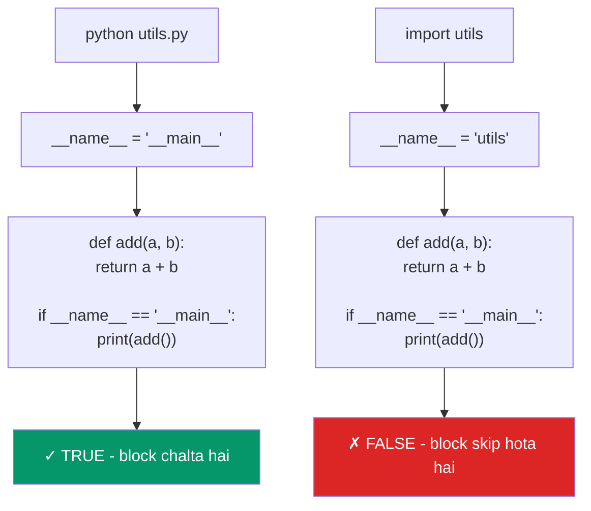

# 05 - Tumhara Pehla Python Script

> **Node.js developers ke liye:** `python script.py` chalana bilkul `node script.js` jaisa hi hai. Python ka REPL bhi Node REPL jaisa kaam karta hai. Ek naya concept jo yahan seekhna hai wo hai `if __name__ == "__main__":` — Python ka tarika ye batane ka ki file "script ki tarah run ho rahi hai" ya "module ki tarah import ki gayi hai."

---

## Table of Contents

1. [Hello World: Python vs Node.js](#hello-world-python-vs-nodejs)
2. [Python Scripts Kaise Run Karte Hain](#running-python-scripts)
3. [Python REPL](#the-python-repl)
4. [__name__ aur "__main__" Samajhna](#understanding-__name__-and-__main__)
5. [Script vs Module Pattern](#script-vs-module-pattern)
6. [Shebang Lines](#shebang-lines)
7. [Command-Line Arguments](#command-line-arguments)
8. [Sab Kuch Ek Saath](#putting-it-all-together)
9. [Practice Exercises](#practice-exercises)

---

## Hello World: Python vs Node.js

### Node.js

```javascript
// hello.js
console.log("Hello, World!");
```

```bash
node hello.js
# Hello, World!
```

### Python

```python
# hello.py
print("Hello, World!")
```

```bash
python hello.py
# Hello, World!
```

Bas itna hi. Na semicolons ka jhanjhat, na parentheses optional wali confusion — seedha `print()`.

### Ek Zyada Real Comparison

**Node.js:**

```javascript
// app.js
const http = require('http');  // ya: import http from 'http';

const server = http.createServer((req, res) => {
  res.writeHead(200, { 'Content-Type': 'text/plain' });
  res.end('Hello, World!\n');
});

server.listen(3000, () => {
  console.log('Server running on http://localhost:3000');
});
```

**Python equivalent:**

```python
# app.py
from http.server import HTTPServer, BaseHTTPRequestHandler

class Handler(BaseHTTPRequestHandler):
    def do_GET(self):
        self.send_response(200)
        self.send_header("Content-Type", "text/plain")
        self.end_headers()
        self.wfile.write(b"Hello, World!\n")

server = HTTPServer(("localhost", 3000), Handler)
print("Server running on http://localhost:3000")
server.serve_forever()
```

> [!info]
> Real projects mein tum raw `http.server` use nahi karoge — **Flask** ya **FastAPI** use karoge. Bilkul waise hi jaise Node.js mein raw `http` ki jagah **Express** use karte ho.

---

## Running Python Scripts

### Basic Execution

```bash
# Node.js
node script.js
node src/app.js
node .                     # package.json ka main run karta hai

# Python
python script.py
python src/app.py
python -m my_package       # package ka __main__.py run karta hai
```

### `-m` Flag Se Modules Run Karna

`-m` flag file path ke bajaye module ka naam lekar use run karta hai. Ye purely Python wala concept hai:

```bash
# Ek module run karo (Python usko path mein dhoondh leta hai)
python -m http.server 8000        # Quick HTTP server start karo
python -m json.tool data.json     # JSON ko pretty-print karo
python -m venv venv               # Virtual environment banao
python -m pytest                  # pytest chalao
python -m pip install flask       # pip ko explicitly run karo

# Node.js ka sabse kareeb equivalent
npx http-server                   # Naam se tool run karo
```

### One-Liners Chalana

```bash
# Node.js
node -e "console.log('Hello')"
node -e "console.log(2 + 2)"

# Python
python -c "print('Hello')"
python -c "print(2 + 2)"
python -c "import sys; print(sys.version)"
```

### Alag-Alag Directories Se Scripts Run Karna

```bash
# Dono same tarike se kaam karte hain
node /path/to/script.js
python /path/to/script.py

# Python: package se module run karo
cd my_project/
python -m my_package.main        # my_package/main.py ko module ki tarah run karta hai
```

---

## The Python REPL

### REPL Start Karna

```bash
# Node.js REPL
node
# > console.log("Hello")
# Hello
# > 2 + 2
# 4
# > .exit

# Python REPL
python
# >>> print("Hello")
# Hello
# >>> 2 + 2
# 4
# >>> exit()
```

### REPL Comparison

| Feature | Node.js REPL | Python REPL |
|---|---|---|
| Start | `node` | `python` |
| Prompt | `>` | `>>>` |
| Continuation | `...` | `...` |
| Exit | `.exit` ya Ctrl+D | `exit()` ya Ctrl+D |
| Last result | `_` | `_` |
| Clear screen | Ctrl+L ya `.clear` | Ctrl+L ya `import os; os.system('clear')` |
| Multi-line | Auto-detect hota hai | `\` use karo ya block enter karo (`if`, `def`, etc.) |
| Help | `.help` | `help()` ya `help(object)` |

### Python REPL Use Karna

Socho ek second ke liye — jaise tum Node REPL mein quick test karte ho, waise hi Python REPL bhi tumhara scratchpad hai:

```python
# Start with: python

>>> name = "Alice"
>>> f"Hello, {name}!"
'Hello, Alice!'                  # REPL expression ka result khud print kar deta hai

>>> 2 ** 10
1024

>>> _                             # _ mein last result hota hai (Node jaisa hi)
1024

>>> import math
>>> math.sqrt(144)
12.0

# Multi-line blocks (REPL inko khud detect kar leta hai)
>>> def greet(name):
...     return f"Hello, {name}!"  # ... continuation prompt notice karo
...                                # Block khatam karne ke liye empty line
>>> greet("World")
'Hello, World!'

# Quick help
>>> help(str.upper)
# str.upper ki documentation dikhata hai

>>> dir(str)
# str ke saare attributes/methods list karta hai (jaise Object.getOwnPropertyNames())

# Exit
>>> exit()
```

### Enhanced REPL: IPython

Default Python REPL basic hai. **IPython** Node REPL ka steroids wala version samjho:

```bash
# Install
pip install ipython

# Run
ipython
```

```python
# IPython features
In [1]: import requests

In [2]: response = requests.get("https://httpbin.org/json")

In [3]: response.json()
Out[3]: {'slideshow': {'author': 'Yours Truly', ...}}

In [4]: response.status_code
Out[4]: 200

# Tab completion (default REPL se kaafi behtar)
In [5]: response.<TAB>  # Saare available methods dikhata hai

# Magic commands
In [6]: %timeit sum(range(1000))
# 11.5 us per loop

In [7]: %history  # Command history dikhao

# Syntax highlighting, better error messages, auto-indent, aur bhi bahut kuch
```

### Async REPL

```bash
# Node.js: REPL mein top-level await kaam karta hai
node
> const response = await fetch('https://api.github.com')

# Python: asyncio REPL use karo
python -m asyncio
# >>> import httpx
# >>> async with httpx.AsyncClient() as client:
# ...     response = await client.get('https://api.github.com')
# >>> response.status_code
# 200
```

---

## Understanding __name__ and "__main__"

Ye chapter ka sabse zyada Python-specific concept hai. Node.js mein iska koi direct equivalent nahi hai.

### Problem Kya Hai?

Node.js mein, ye pata karne ka koi built-in tarika nahi hai ki file directly run ho rahi hai ya import ki gayi hai:

```javascript
// utils.js
function add(a, b) { return a + b; }
console.log(add(2, 3));  // Hamesha chalta hai! Import karne par bhi

// app.js
const { add } = require('./utils');
// Sirf import karne se "5" print ho jaata hai! Ideal nahi hai.
```

Node.js ka workaround:

```javascript
// utils.js
function add(a, b) { return a + b; }

// Sirf tab chalao jab ye main module ho
if (require.main === module) {
  console.log(add(2, 3));  // Sirf directly run karne par
}

// ES modules alternative:
// if (import.meta.url === `file://${process.argv[1]}`) { ... }

module.exports = { add };
```

### Python Ka Solution: `__name__`

Har Python module mein ek special variable hota hai `__name__`:
- Jab directly run karo: `__name__` ban jaata hai `"__main__"`
- Jab import karo: `__name__` module ka naam ban jaata hai

Socho isko ek Zomato order ki tarah — jab tum khud restaurant jaake order karte ho (directly run), aur jab dabbawala tumhara khana kisi aur ke liye deliver kar raha hota hai (import). Same "khana" (code), lekin context alag.

```python
# utils.py
def add(a, b):
    return a + b

print(f"__name__ is: {__name__}")

if __name__ == "__main__":
    # Ye block SIRF tab chalega jab file directly execute ho
    print(add(2, 3))
```

```bash
# Directly run karo
python utils.py
# __name__ is: __main__
# 5

# Kisi aur file se import karo
python -c "import utils"
# __name__ is: utils
# (koi "5" print nahi hua!)
```

### Standard Pattern

```python
# my_module.py

def main():
    """Main function jo program logic chalata hai."""
    print("Running the main program!")
    # ... tumhara code yahan ...

if __name__ == "__main__":
    main()
```

Ye pattern itna common hai ki basically Python ka idiom ban chuka hai. Ye:
1. Tumhari file ko module ki tarah importable banata hai (functions available rehte hain)
2. Tumhari file ko script ki tarah runnable banata hai (main logic execute hota hai)
3. Global scope ko clean rakhta hai (sab kuch functions ke andar hota hai)

### Visually Kaise Kaam Karta Hai



---

## Script vs Module Pattern

**Kyun zaruri hai?** Kabhi tumhe sirf ek quick kaam karna hota hai (jaise ek CSV padhna), aur kabhi tum kuch aisa likhte ho jo baad mein doosri files bhi reuse karengi. Python mein dono ke liye alag pattern hai — bilkul waise hi jaise tum kabhi ek quick `script.js` likhte ho aur kabhi ek proper `utils.js` module `require()` karne ke liye banate ho.

### Script Pattern (Jaldi Aur Simple)

One-off scripts ke liye achha — kisi simple Node.js script jaisa hi:

```python
# fetch_data.py
import requests

url = "https://api.github.com/repos/python/cpython"
response = requests.get(url)
data = response.json()

print(f"Stars: {data['stargazers_count']}")
print(f"Language: {data['language']}")
```

```bash
python fetch_data.py
```

### Module Pattern (Proper Structure)

Reusable code aur bade projects ke liye achha:

```python
# github.py
"""GitHub API utilities."""

import requests

BASE_URL = "https://api.github.com"

def get_repo_info(owner: str, repo: str) -> dict:
    """GitHub se repository ki info fetch karo."""
    url = f"{BASE_URL}/repos/{owner}/{repo}"
    response = requests.get(url)
    response.raise_for_status()
    return response.json()

def format_repo_summary(info: dict) -> str:
    """Repo info ko readable summary mein format karo."""
    return (
        f"Repository: {info['full_name']}\n"
        f"Stars: {info['stargazers_count']:,}\n"
        f"Language: {info['language']}\n"
        f"Description: {info['description']}"
    )

def main():
    """CLI entry point."""
    info = get_repo_info("python", "cpython")
    print(format_repo_summary(info))

if __name__ == "__main__":
    main()
```

Ab isko DONO tarike se use kar sakte ho:

```bash
# Script ki tarah
python github.py

# Module ki tarah (kisi aur file se ya REPL se)
python -c "from github import get_repo_info; print(get_repo_info('python', 'cpython')['stargazers_count'])"
```

### Node.js Comparison

```javascript
// github.js (Node.js)
const BASE_URL = "https://api.github.com";

async function getRepoInfo(owner, repo) {
  const response = await fetch(`${BASE_URL}/repos/${owner}/${repo}`);
  return response.json();
}

function formatRepoSummary(info) {
  return `Repository: ${info.full_name}
Stars: ${info.stargazers_count.toLocaleString()}
Language: ${info.language}`;
}

// Sirf tab chalao jab ye main module ho
if (require.main === module) {
  (async () => {
    const info = await getRepoInfo("nodejs", "node");
    console.log(formatRepoSummary(info));
  })();
}

module.exports = { getRepoInfo, formatRepoSummary };
```

```python
# github.py (Python -- same logic, cleaner pattern)
import requests

BASE_URL = "https://api.github.com"

def get_repo_info(owner: str, repo: str) -> dict:
    response = requests.get(f"{BASE_URL}/repos/{owner}/{repo}")
    response.raise_for_status()
    return response.json()

def format_repo_summary(info: dict) -> str:
    return (
        f"Repository: {info['full_name']}\n"
        f"Stars: {info['stargazers_count']:,}\n"
        f"Language: {info['language']}"
    )

if __name__ == "__main__":
    info = get_repo_info("python", "cpython")
    print(format_repo_summary(info))
```

### Package Pattern (__main__.py)

Packages ke liye (directories jinme `__init__.py` ho), tum `__main__.py` add karke pura package hi runnable bana sakte ho:

```
my_package/
    __init__.py      # Isko package banata hai
    __main__.py      # Isse runnable banata hai: python -m my_package
    core.py
    utils.py
```

```python
# my_package/__main__.py
from .core import main

if __name__ == "__main__":
    main()
```

```bash
# Package run karo
python -m my_package

# Ye bilkul waisa hi hai jaise package.json mein "main" hota hai:
# "main": "index.js"  ->  __main__.py
```

---

## Shebang Lines

Shebang lines tumhe scripts ko directly run karne dete hain (pehle `python` type kiye bina) macOS/Linux par. Windows par relevant nahi, lekin jaan lena achha hai.

### Node.js

```javascript
#!/usr/bin/env node
// cli.js
console.log("Hello from Node!");
```

```bash
chmod +x cli.js
./cli.js           # node se run hota hai
```

### Python

```python
#!/usr/bin/env python3
# cli.py
"""A simple CLI script."""

def main():
    print("Hello from Python!")

if __name__ == "__main__":
    main()
```

```bash
chmod +x cli.py
./cli.py           # python3 se run hota hai
```

### `#!/usr/bin/env python3` Kyun?

- `#!/usr/bin/env python3` -- `PATH` mein `python3` dhoondh leta hai (pyenv, venv sabke saath kaam karta hai)
- `#!/usr/bin/python3` -- Hardcoded path (tumhare pyenv/venv Python se match na kare, ho sakta hai)

Hamesha `env` wala variant use karo. Ye tumhare virtual environment aur pyenv setup ko respect karta hai.

### Encoding Declaration (Optional)

Purani Python files mein ye dikh sakta hai:

```python
#!/usr/bin/env python3
# -*- coding: utf-8 -*-
```

Python 3 mein ye zaruri nahi hai (UTF-8 already default hai), lekin legacy code mein ye milega.

---

## Command-Line Arguments

**Kya hota hai?** Jab tum terminal se script chalate ho, tum usko extra info bhi pass kar sakte ho — bilkul jaise `npm run build -- --prod` mein `--prod` flag pass karte ho, ya IRCTC ki website pe form fields fill karte ho. Python mein ye "arguments" `sys.argv` ya `argparse` ke through milte hain.

### Node.js

```javascript
// cli.js
const args = process.argv.slice(2);
console.log("Arguments:", args);

// node cli.js hello world
// Arguments: ["hello", "world"]
```

### Python (Basic)

```python
# cli.py
import sys

args = sys.argv[1:]  # sys.argv[0] script ka naam hota hai
print("Arguments:", args)

# python cli.py hello world
# Arguments: ['hello', 'world']
```

### Python (argparse Ke Saath -- Built-in)

Python mein ek powerful built-in argument parser hota hai (Node.js mein iske liye `commander` ya `yargs` chahiye hota hai):

```python
# cli.py
import argparse

def main():
    parser = argparse.ArgumentParser(description="A greeting CLI tool")
    parser.add_argument("name", help="Name to greet")
    parser.add_argument("-g", "--greeting", default="Hello", help="Greeting to use")
    parser.add_argument("-n", "--count", type=int, default=1, help="Number of times")
    parser.add_argument("-v", "--verbose", action="store_true", help="Verbose output")

    args = parser.parse_args()

    for _ in range(args.count):
        message = f"{args.greeting}, {args.name}!"
        if args.verbose:
            message += f" (greeting #{_ + 1})"
        print(message)

if __name__ == "__main__":
    main()
```

```bash
python cli.py Alice
# Hello, Alice!

python cli.py Alice -g "Hi" -n 3
# Hi, Alice!
# Hi, Alice!
# Hi, Alice!

python cli.py --help
# usage: cli.py [-h] [-g GREETING] [-n COUNT] [-v] name
#
# A greeting CLI tool
#
# positional arguments:
#   name                  Name to greet
#
# options:
#   -h, --help            show this help message and exit
#   -g, --greeting GREETING  Greeting to use
#   -n, --count COUNT     Number of times
#   -v, --verbose         Verbose output
```

Compare karo `commander` wale Node.js equivalent se:

```javascript
// cli.js (Node.js with commander)
const { Command } = require('commander');
const program = new Command();

program
  .argument('<name>', 'Name to greet')
  .option('-g, --greeting <greeting>', 'Greeting to use', 'Hello')
  .option('-n, --count <count>', 'Number of times', parseInt, 1)
  .option('-v, --verbose', 'Verbose output')
  .action((name, options) => {
    for (let i = 0; i < options.count; i++) {
      let message = `${options.greeting}, ${name}!`;
      if (options.verbose) message += ` (greeting #${i + 1})`;
      console.log(message);
    }
  });

program.parse();
```

Python ka `argparse` built-in hai — koi extra dependency nahi chahiye.

---

## Putting It All Together

Ye raha ek complete, well-structured Python script jo is chapter ke saare concepts dikhata hai:

```python
#!/usr/bin/env python3
"""
Todo List Manager - A simple CLI tool.

Ye demonstrate karta hai:
- Shebang line
- Module docstring
- __name__ guard
- CLI args ke liye argparse
- Type hints wale functions
- f-strings
- File I/O
"""

import argparse
import json
from pathlib import Path

# Constants
TODO_FILE = Path("todos.json")

def load_todos() -> list[dict]:
    """JSON file se todos load karo."""
    if TODO_FILE.exists():
        return json.loads(TODO_FILE.read_text())
    return []

def save_todos(todos: list[dict]) -> None:
    """Todos ko JSON file mein save karo."""
    TODO_FILE.write_text(json.dumps(todos, indent=2))

def add_todo(title: str, priority: str = "medium") -> dict:
    """Ek naya todo item add karo."""
    todos = load_todos()
    todo = {
        "id": len(todos) + 1,
        "title": title,
        "priority": priority,
        "done": False,
    }
    todos.append(todo)
    save_todos(todos)
    return todo

def list_todos(show_done: bool = False) -> list[dict]:
    """Saare todos list karo, optionally completed wale bhi."""
    todos = load_todos()
    if not show_done:
        todos = [t for t in todos if not t["done"]]
    return todos

def complete_todo(todo_id: int) -> dict | None:
    """Ek todo ko complete mark karo."""
    todos = load_todos()
    for todo in todos:
        if todo["id"] == todo_id:
            todo["done"] = True
            save_todos(todos)
            return todo
    return None

def display_todos(todos: list[dict]) -> None:
    """Todo list ko pretty-print karo."""
    if not todos:
        print("No todos found!")
        return

    for todo in todos:
        status = "done" if todo["done"] else "pending"
        icon = "[x]" if todo["done"] else "[ ]"
        print(f"  {icon} #{todo['id']} - {todo['title']} ({todo['priority']}) [{status}]")

def main():
    """CLI entry point."""
    parser = argparse.ArgumentParser(description="Simple Todo Manager")
    subparsers = parser.add_subparsers(dest="command", help="Available commands")

    # Add command
    add_parser = subparsers.add_parser("add", help="Add a new todo")
    add_parser.add_argument("title", help="Todo title")
    add_parser.add_argument("-p", "--priority", default="medium",
                            choices=["low", "medium", "high"])

    # List command
    list_parser = subparsers.add_parser("list", help="List todos")
    list_parser.add_argument("-a", "--all", action="store_true",
                             help="Show completed todos too")

    # Done command
    done_parser = subparsers.add_parser("done", help="Complete a todo")
    done_parser.add_argument("id", type=int, help="Todo ID to complete")

    args = parser.parse_args()

    if args.command == "add":
        todo = add_todo(args.title, args.priority)
        print(f"Added: #{todo['id']} - {todo['title']}")
    elif args.command == "list":
        todos = list_todos(show_done=args.all)
        display_todos(todos)
    elif args.command == "done":
        todo = complete_todo(args.id)
        if todo:
            print(f"Completed: #{todo['id']} - {todo['title']}")
        else:
            print(f"Todo #{args.id} not found")
    else:
        parser.print_help()

if __name__ == "__main__":
    main()
```

Use kaise karein:

```bash
python todo.py add "Learn Python" -p high
# Added: #1 - Learn Python

python todo.py add "Build REST API"
# Added: #2 - Build REST API

python todo.py list
#   [ ] #1 - Learn Python (high) [pending]
#   [ ] #2 - Build REST API (medium) [pending]

python todo.py done 1
# Completed: #1 - Learn Python

python todo.py list --all
#   [x] #1 - Learn Python (high) [done]
#   [ ] #2 - Build REST API (medium) [pending]
```

---

## Practice Exercises

### Exercise 1: Hello World Variations

Ek file banao `hello.py`:

```python
# 1. "Hello, World!" print karo
# 2. F-string use karke apna naam print karo
# 3. Python version print karo (hint: import sys; sys.version)
# 4. Current working directory print karo (hint: import os; os.getcwd())
```

Isse run karo:
```bash
python hello.py
```

Phir REPL mein bhi wahi commands try karo:
```bash
python
>>> # har command ko interactively type karo
```

### Exercise 2: REPL Explore Karo

Python REPL start karo aur ye try karo:

```python
# 1. Basic math
>>> 2 ** 100                   # Python bade numbers natively handle karta hai!

# 2. String operations
>>> "Python" * 5
>>> "hello world".title()
>>> "hello world".split()

# 3. Import aur explore
>>> import os
>>> dir(os)                     # os module mein sab kuch list karo
>>> help(os.path.join)          # Docs padho

# 4. Quick data processing
>>> numbers = list(range(1, 11))
>>> [n ** 2 for n in numbers if n % 2 == 0]

# 5. Zen of Python (Easter egg!)
>>> import this
```

### Exercise 3: __name__ Guard

Do files banao:

**math_utils.py:**
```python
def add(a, b):
    return a + b

def multiply(a, b):
    return a * b

# Ek __name__ guard add karo jo:
# 1. "Running math_utils directly" print kare
# 2. add(2, 3) aur multiply(4, 5) test kare
# 3. Results print kare

if __name__ == "__main__":
    # Yahan apna code likho
    pass
```

**app.py:**
```python
from math_utils import add, multiply

# Imported functions use karo
# Verify karo ki "Running math_utils directly" print NAHI hota
print(f"2 + 3 = {add(2, 3)}")
print(f"4 * 5 = {multiply(4, 5)}")
```

Dono test karo:
```bash
python math_utils.py    # "Running math_utils directly" + results dikhna chahiye
python app.py           # Sirf app.py ka output dikhna chahiye, math_utils se koi message nahi
```

### Exercise 4: CLI Tool Banao

`converter.py` banao — ek temperature converter CLI tool:

Requirements (kya chahiye):
1. CLI arguments ke liye `argparse` use karo
2. Ek temperature value aur unit (C ya F) accept karo
3. Convert karke result dikhao
4. Decimal places specify karne ke liye ek `--round` flag include karo
5. `__name__` guard use karo

Expected output:
```bash
python converter.py 100 C
# 100.0C = 212.0F

python converter.py 72 F --round 1
# 72.0F = 22.2C

python converter.py --help
# (help text dikhata hai)
```

<details>
<summary>Solution</summary>

```python
#!/usr/bin/env python3
"""Temperature converter CLI tool."""

import argparse

def celsius_to_fahrenheit(celsius: float) -> float:
    return celsius * 9 / 5 + 32

def fahrenheit_to_celsius(fahrenheit: float) -> float:
    return (fahrenheit - 32) * 5 / 9

def main():
    parser = argparse.ArgumentParser(description="Convert temperatures between C and F")
    parser.add_argument("value", type=float, help="Temperature value")
    parser.add_argument("unit", choices=["C", "F"], help="Unit (C or F)")
    parser.add_argument("-r", "--round", type=int, default=1, dest="decimals",
                        help="Decimal places (default: 1)")

    args = parser.parse_args()

    if args.unit == "C":
        result = celsius_to_fahrenheit(args.value)
        print(f"{args.value:.{args.decimals}f}C = {result:.{args.decimals}f}F")
    else:
        result = fahrenheit_to_celsius(args.value)
        print(f"{args.value:.{args.decimals}f}F = {result:.{args.decimals}f}C")

if __name__ == "__main__":
    main()
```

</details>

### Exercise 5: Module + Script Combo

Is structure ka ek mini-project banao:

```
my_first_project/
    greetings.py       # Greeting functions wala module
    main.py            # greetings module use karne wala script
```

**greetings.py** mein ye hona chahiye:
- `hello(name)` define karo jo `"Hello, {name}!"` return kare
- `goodbye(name)` define karo jo `"Goodbye, {name}!"` return kare
- `formal_greeting(name, title="Mr.")` define karo jo `"Good day, {title} {name}."` return kare
- Ek `__name__` guard ho jo teeno functions demonstrate kare

**main.py** mein ye hona chahiye:
- `greetings` se import karo
- Naam aur optional `--formal` flag accept karne ke liye `argparse` use karo
- Appropriate greeting print karo

```bash
python greetings.py
# (teeno functions demonstrate karta hai)

python main.py Alice
# Hello, Alice!

python main.py Alice --formal
# Good day, Mr. Alice.

python main.py Alice --formal --title Dr.
# Good day, Dr. Alice.
```

---

**Badhai ho!** Tumne Quick Start guide complete kar li. Ab tumhe pata hai:

- Python versions install aur manage karna (jaise nvm)
- Virtual environments banana (jaise node_modules)
- pip aur Poetry se packages manage karna (jaise npm)
- JavaScript/TypeScript developer ki tarah Python syntax padhna
- Python scripts aur modules likhna, run karna, aur structure karna

**Aage kya karein:**
- Ek chhota project banao (Flask ya FastAPI ke saath REST API)
- Zyada depth ke liye [Python Tutorial](https://docs.python.org/3/tutorial/) padho
- Python-specific features explore karo: generators, decorators, context managers, dataclasses
