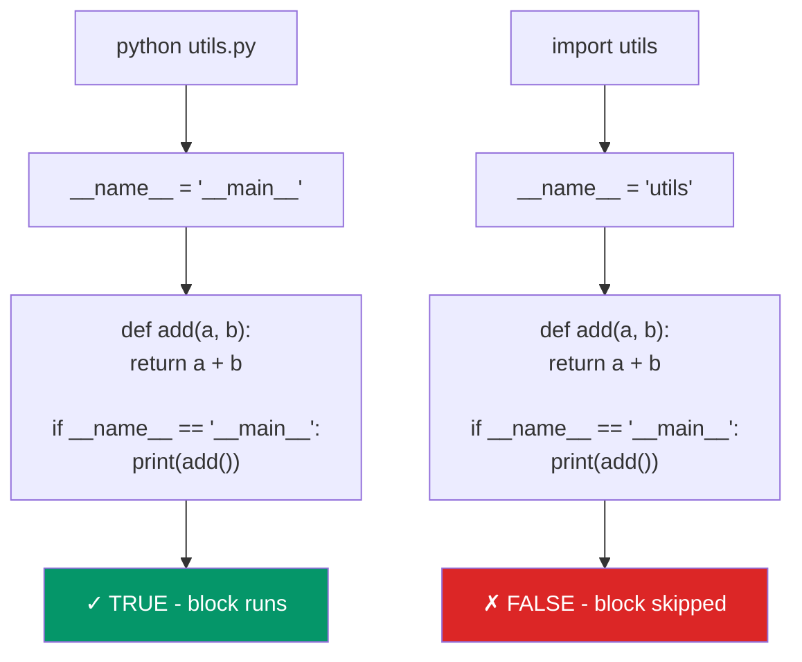

# 05 - Your First Python Script

> **For Node.js developers:** Running `python script.py` is like `node script.js`. The Python REPL works like the Node REPL. The big new concept is `if __name__ == "__main__":` -- Python's way of distinguishing "run as script" from "imported as module."

---

## Table of Contents

1. [Hello World: Python vs Node.js](#hello-world-python-vs-nodejs)
2. [Running Python Scripts](#running-python-scripts)
3. [The Python REPL](#the-python-repl)
4. [Understanding __name__ and "__main__"](#understanding-__name__-and-__main__)
5. [Script vs Module Pattern](#script-vs-module-pattern)
6. [Shebang Lines](#shebang-lines)
7. [Command-Line Arguments](#command-line-arguments)
8. [Putting It All Together](#putting-it-all-together)
9. [Practice Exercises](#practice-exercises)

---

## Hello World: Python vs Node.js

### Node.js

```javascript
// hello.js
console.log("Hello, World!");
```

```bash
node hello.js
# Hello, World!
```

### Python

```python
# hello.py
print("Hello, World!")
```

```bash
python hello.py
# Hello, World!
```

That's it. No semicolons, no parentheses-optional confusion, just `print()`.

### A More Realistic Comparison

**Node.js:**

```javascript
// app.js
const http = require('http');  // or: import http from 'http';

const server = http.createServer((req, res) => {
  res.writeHead(200, { 'Content-Type': 'text/plain' });
  res.end('Hello, World!\n');
});

server.listen(3000, () => {
  console.log('Server running on http://localhost:3000');
});
```

**Python equivalent:**

```python
# app.py
from http.server import HTTPServer, BaseHTTPRequestHandler

class Handler(BaseHTTPRequestHandler):
    def do_GET(self):
        self.send_response(200)
        self.send_header("Content-Type", "text/plain")
        self.end_headers()
        self.wfile.write(b"Hello, World!\n")

server = HTTPServer(("localhost", 3000), Handler)
print("Server running on http://localhost:3000")
server.serve_forever()
```

> In practice, you'd use **Flask** or **FastAPI** instead of the raw `http.server`, just like you'd use **Express** instead of raw `http` in Node.js.

---

## Running Python Scripts

### Basic Execution

```bash
# Node.js
node script.js
node src/app.js
node .                     # Runs main from package.json

# Python
python script.py
python src/app.py
python -m my_package       # Runs __main__.py in the package
```

### Running Modules with -m

The `-m` flag runs a module by name instead of by file path. This is a Python-specific concept:

```bash
# Run a module (Python finds it in the path)
python -m http.server 8000        # Start a quick HTTP server
python -m json.tool data.json     # Pretty-print JSON
python -m venv venv               # Create virtual environment
python -m pytest                  # Run pytest
python -m pip install flask       # Explicit pip run

# Node.js closest equivalent
npx http-server                   # Run a tool by name
```

### Running One-Liners

```bash
# Node.js
node -e "console.log('Hello')"
node -e "console.log(2 + 2)"

# Python
python -c "print('Hello')"
python -c "print(2 + 2)"
python -c "import sys; print(sys.version)"
```

### Running Scripts from Different Directories

```bash
# Both work the same way
node /path/to/script.js
python /path/to/script.py

# Python: run module from a package
cd my_project/
python -m my_package.main        # Runs my_package/main.py as a module
```

---

## The Python REPL

### Starting the REPL

```bash
# Node.js REPL
node
# > console.log("Hello")
# Hello
# > 2 + 2
# 4
# > .exit

# Python REPL
python
# >>> print("Hello")
# Hello
# >>> 2 + 2
# 4
# >>> exit()
```

### REPL Comparison

| Feature | Node.js REPL | Python REPL |
|---|---|---|
| Start | `node` | `python` |
| Prompt | `>` | `>>>` |
| Continuation | `...` | `...` |
| Exit | `.exit` or Ctrl+D | `exit()` or Ctrl+D |
| Last result | `_` | `_` |
| Clear screen | Ctrl+L or `.clear` | Ctrl+L or `import os; os.system('clear')` |
| Multi-line | Auto-detected | Use `\` or enter a block (`if`, `def`, etc.) |
| Help | `.help` | `help()` or `help(object)` |

### Using the Python REPL

```python
# Start with: python

>>> name = "Alice"
>>> f"Hello, {name}!"
'Hello, Alice!'                  # REPL auto-prints expression results

>>> 2 ** 10
1024

>>> _                             # _ holds the last result (same as Node)
1024

>>> import math
>>> math.sqrt(144)
12.0

# Multi-line blocks (REPL detects them automatically)
>>> def greet(name):
...     return f"Hello, {name}!"  # Note the ... continuation prompt
...                                # Empty line to finish the block
>>> greet("World")
'Hello, World!'

# Quick help
>>> help(str.upper)
# Shows documentation for str.upper

>>> dir(str)
# Lists all attributes/methods of str (like Object.getOwnPropertyNames())

# Exit
>>> exit()
```

### Enhanced REPL: IPython

The default Python REPL is basic. **IPython** is like the Node REPL on steroids:

```bash
# Install
pip install ipython

# Run
ipython
```

```python
# IPython features
In [1]: import requests

In [2]: response = requests.get("https://httpbin.org/json")

In [3]: response.json()
Out[3]: {'slideshow': {'author': 'Yours Truly', ...}}

In [4]: response.status_code
Out[4]: 200

# Tab completion (way better than default REPL)
In [5]: response.<TAB>  # Shows all available methods

# Magic commands
In [6]: %timeit sum(range(1000))
# 11.5 us per loop

In [7]: %history  # Show command history

# Syntax highlighting, better error messages, auto-indent, and more
```

### Async REPL

```bash
# Node.js: top-level await works in REPL
node
> const response = await fetch('https://api.github.com')

# Python: use asyncio REPL
python -m asyncio
# >>> import httpx
# >>> async with httpx.AsyncClient() as client:
# ...     response = await client.get('https://api.github.com')
# >>> response.status_code
# 200
```

---

## Understanding __name__ and "__main__"

This is the most Python-specific concept in this chapter. There's no direct equivalent in Node.js.

### The Problem

In Node.js, there's no built-in way to know if a file is being run directly or imported:

```javascript
// utils.js
function add(a, b) { return a + b; }
console.log(add(2, 3));  // Always runs! Even when imported

// app.js
const { add } = require('./utils');
// "5" gets printed just from importing! Not ideal.
```

Node.js workaround:

```javascript
// utils.js
function add(a, b) { return a + b; }

// Only run if this is the main module
if (require.main === module) {
  console.log(add(2, 3));  // Only when run directly
}

// ES modules alternative:
// if (import.meta.url === `file://${process.argv[1]}`) { ... }

module.exports = { add };
```

### Python's Solution: `__name__`

Every Python module has a special variable called `__name__`:
- When run directly: `__name__` equals `"__main__"`
- When imported: `__name__` equals the module name

```python
# utils.py
def add(a, b):
    return a + b

print(f"__name__ is: {__name__}")

if __name__ == "__main__":
    # This block ONLY runs when the file is executed directly
    print(add(2, 3))
```

```bash
# Run directly
python utils.py
# __name__ is: __main__
# 5

# Import from another file
python -c "import utils"
# __name__ is: utils
# (no "5" printed!)
```

### The Standard Pattern

```python
# my_module.py

def main():
    """Main function that runs the program logic."""
    print("Running the main program!")
    # ... your code here ...

if __name__ == "__main__":
    main()
```

This pattern is so common it's essentially a Python idiom. It:
1. Makes your file importable as a module (functions are available)
2. Makes your file runnable as a script (the main logic executes)
3. Keeps the global scope clean (everything is inside functions)

### How It Works Visually



---

## Script vs Module Pattern

### Script Pattern (Quick & Dirty)

Good for one-off scripts, similar to a simple Node.js script:

```python
# fetch_data.py
import requests

url = "https://api.github.com/repos/python/cpython"
response = requests.get(url)
data = response.json()

print(f"Stars: {data['stargazers_count']}")
print(f"Language: {data['language']}")
```

```bash
python fetch_data.py
```

### Module Pattern (Proper Structure)

Good for reusable code and larger projects:

```python
# github.py
"""GitHub API utilities."""

import requests

BASE_URL = "https://api.github.com"

def get_repo_info(owner: str, repo: str) -> dict:
    """Fetch repository information from GitHub."""
    url = f"{BASE_URL}/repos/{owner}/{repo}"
    response = requests.get(url)
    response.raise_for_status()
    return response.json()

def format_repo_summary(info: dict) -> str:
    """Format repo info as a readable summary."""
    return (
        f"Repository: {info['full_name']}\n"
        f"Stars: {info['stargazers_count']:,}\n"
        f"Language: {info['language']}\n"
        f"Description: {info['description']}"
    )

def main():
    """CLI entry point."""
    info = get_repo_info("python", "cpython")
    print(format_repo_summary(info))

if __name__ == "__main__":
    main()
```

Now it can be used BOTH ways:

```bash
# As a script
python github.py

# As a module (from another file or the REPL)
python -c "from github import get_repo_info; print(get_repo_info('python', 'cpython')['stargazers_count'])"
```

### Node.js Comparison

```javascript
// github.js (Node.js)
const BASE_URL = "https://api.github.com";

async function getRepoInfo(owner, repo) {
  const response = await fetch(`${BASE_URL}/repos/${owner}/${repo}`);
  return response.json();
}

function formatRepoSummary(info) {
  return `Repository: ${info.full_name}
Stars: ${info.stargazers_count.toLocaleString()}
Language: ${info.language}`;
}

// Only run if this is the main module
if (require.main === module) {
  (async () => {
    const info = await getRepoInfo("nodejs", "node");
    console.log(formatRepoSummary(info));
  })();
}

module.exports = { getRepoInfo, formatRepoSummary };
```

```python
# github.py (Python -- same logic, cleaner pattern)
import requests

BASE_URL = "https://api.github.com"

def get_repo_info(owner: str, repo: str) -> dict:
    response = requests.get(f"{BASE_URL}/repos/{owner}/{repo}")
    response.raise_for_status()
    return response.json()

def format_repo_summary(info: dict) -> str:
    return (
        f"Repository: {info['full_name']}\n"
        f"Stars: {info['stargazers_count']:,}\n"
        f"Language: {info['language']}"
    )

if __name__ == "__main__":
    info = get_repo_info("python", "cpython")
    print(format_repo_summary(info))
```

### Package Pattern (__main__.py)

For packages (directories with `__init__.py`), you can add a `__main__.py` to make the package runnable:

```
my_package/
    __init__.py      # Makes it a package
    __main__.py      # Makes it runnable with: python -m my_package
    core.py
    utils.py
```

```python
# my_package/__main__.py
from .core import main

if __name__ == "__main__":
    main()
```

```bash
# Run the package
python -m my_package

# This is like having "main" in package.json:
# "main": "index.js"  ->  __main__.py
```

---

## Shebang Lines

Shebang lines let you run scripts directly (without typing `python` first) on macOS/Linux. Not relevant on Windows, but good to know.

### Node.js

```javascript
#!/usr/bin/env node
// cli.js
console.log("Hello from Node!");
```

```bash
chmod +x cli.js
./cli.js           # Runs with node
```

### Python

```python
#!/usr/bin/env python3
# cli.py
"""A simple CLI script."""

def main():
    print("Hello from Python!")

if __name__ == "__main__":
    main()
```

```bash
chmod +x cli.py
./cli.py           # Runs with python3
```

### Why `#!/usr/bin/env python3`?

- `#!/usr/bin/env python3` -- Finds `python3` in `PATH` (works with pyenv, venv, etc.)
- `#!/usr/bin/python3` -- Hardcoded path (might not match your pyenv/venv Python)

Always use the `env` variant. It respects your virtual environment and pyenv setup.

### Encoding Declaration (Optional)

You might see this in older Python files:

```python
#!/usr/bin/env python3
# -*- coding: utf-8 -*-
```

This is unnecessary in Python 3 (UTF-8 is the default), but you'll encounter it in legacy code.

---

## Command-Line Arguments

### Node.js

```javascript
// cli.js
const args = process.argv.slice(2);
console.log("Arguments:", args);

// node cli.js hello world
// Arguments: ["hello", "world"]
```

### Python (Basic)

```python
# cli.py
import sys

args = sys.argv[1:]  # sys.argv[0] is the script name
print("Arguments:", args)

# python cli.py hello world
# Arguments: ['hello', 'world']
```

### Python (With argparse -- Built-in)

Python has a powerful built-in argument parser (Node.js needs `commander` or `yargs`):

```python
# cli.py
import argparse

def main():
    parser = argparse.ArgumentParser(description="A greeting CLI tool")
    parser.add_argument("name", help="Name to greet")
    parser.add_argument("-g", "--greeting", default="Hello", help="Greeting to use")
    parser.add_argument("-n", "--count", type=int, default=1, help="Number of times")
    parser.add_argument("-v", "--verbose", action="store_true", help="Verbose output")

    args = parser.parse_args()

    for _ in range(args.count):
        message = f"{args.greeting}, {args.name}!"
        if args.verbose:
            message += f" (greeting #{_ + 1})"
        print(message)

if __name__ == "__main__":
    main()
```

```bash
python cli.py Alice
# Hello, Alice!

python cli.py Alice -g "Hi" -n 3
# Hi, Alice!
# Hi, Alice!
# Hi, Alice!

python cli.py --help
# usage: cli.py [-h] [-g GREETING] [-n COUNT] [-v] name
#
# A greeting CLI tool
#
# positional arguments:
#   name                  Name to greet
#
# options:
#   -h, --help            show this help message and exit
#   -g, --greeting GREETING  Greeting to use
#   -n, --count COUNT     Number of times
#   -v, --verbose         Verbose output
```

Compare to the equivalent in Node.js with `commander`:

```javascript
// cli.js (Node.js with commander)
const { Command } = require('commander');
const program = new Command();

program
  .argument('<name>', 'Name to greet')
  .option('-g, --greeting <greeting>', 'Greeting to use', 'Hello')
  .option('-n, --count <count>', 'Number of times', parseInt, 1)
  .option('-v, --verbose', 'Verbose output')
  .action((name, options) => {
    for (let i = 0; i < options.count; i++) {
      let message = `${options.greeting}, ${name}!`;
      if (options.verbose) message += ` (greeting #${i + 1})`;
      console.log(message);
    }
  });

program.parse();
```

Python's `argparse` is built-in -- no extra dependency needed.

---

## Putting It All Together

Here's a complete, well-structured Python script that demonstrates all the concepts from this chapter:

```python
#!/usr/bin/env python3
"""
Todo List Manager - A simple CLI tool.

This demonstrates:
- Shebang line
- Module docstring
- __name__ guard
- argparse for CLI args
- Functions with type hints
- f-strings
- File I/O
"""

import argparse
import json
from pathlib import Path

# Constants
TODO_FILE = Path("todos.json")

def load_todos() -> list[dict]:
    """Load todos from the JSON file."""
    if TODO_FILE.exists():
        return json.loads(TODO_FILE.read_text())
    return []

def save_todos(todos: list[dict]) -> None:
    """Save todos to the JSON file."""
    TODO_FILE.write_text(json.dumps(todos, indent=2))

def add_todo(title: str, priority: str = "medium") -> dict:
    """Add a new todo item."""
    todos = load_todos()
    todo = {
        "id": len(todos) + 1,
        "title": title,
        "priority": priority,
        "done": False,
    }
    todos.append(todo)
    save_todos(todos)
    return todo

def list_todos(show_done: bool = False) -> list[dict]:
    """List all todos, optionally including completed ones."""
    todos = load_todos()
    if not show_done:
        todos = [t for t in todos if not t["done"]]
    return todos

def complete_todo(todo_id: int) -> dict | None:
    """Mark a todo as complete."""
    todos = load_todos()
    for todo in todos:
        if todo["id"] == todo_id:
            todo["done"] = True
            save_todos(todos)
            return todo
    return None

def display_todos(todos: list[dict]) -> None:
    """Pretty-print the todo list."""
    if not todos:
        print("No todos found!")
        return

    for todo in todos:
        status = "done" if todo["done"] else "pending"
        icon = "[x]" if todo["done"] else "[ ]"
        print(f"  {icon} #{todo['id']} - {todo['title']} ({todo['priority']}) [{status}]")

def main():
    """CLI entry point."""
    parser = argparse.ArgumentParser(description="Simple Todo Manager")
    subparsers = parser.add_subparsers(dest="command", help="Available commands")

    # Add command
    add_parser = subparsers.add_parser("add", help="Add a new todo")
    add_parser.add_argument("title", help="Todo title")
    add_parser.add_argument("-p", "--priority", default="medium",
                            choices=["low", "medium", "high"])

    # List command
    list_parser = subparsers.add_parser("list", help="List todos")
    list_parser.add_argument("-a", "--all", action="store_true",
                             help="Show completed todos too")

    # Done command
    done_parser = subparsers.add_parser("done", help="Complete a todo")
    done_parser.add_argument("id", type=int, help="Todo ID to complete")

    args = parser.parse_args()

    if args.command == "add":
        todo = add_todo(args.title, args.priority)
        print(f"Added: #{todo['id']} - {todo['title']}")
    elif args.command == "list":
        todos = list_todos(show_done=args.all)
        display_todos(todos)
    elif args.command == "done":
        todo = complete_todo(args.id)
        if todo:
            print(f"Completed: #{todo['id']} - {todo['title']}")
        else:
            print(f"Todo #{args.id} not found")
    else:
        parser.print_help()

if __name__ == "__main__":
    main()
```

Usage:

```bash
python todo.py add "Learn Python" -p high
# Added: #1 - Learn Python

python todo.py add "Build REST API"
# Added: #2 - Build REST API

python todo.py list
#   [ ] #1 - Learn Python (high) [pending]
#   [ ] #2 - Build REST API (medium) [pending]

python todo.py done 1
# Completed: #1 - Learn Python

python todo.py list --all
#   [x] #1 - Learn Python (high) [done]
#   [ ] #2 - Build REST API (medium) [pending]
```

---

## Practice Exercises

### Exercise 1: Hello World Variations

Create a file called `hello.py`:

```python
# 1. Print "Hello, World!"
# 2. Print your name using an f-string
# 3. Print the Python version (hint: import sys; sys.version)
# 4. Print the current working directory (hint: import os; os.getcwd())
```

Run it with:
```bash
python hello.py
```

Then try the same commands in the REPL:
```bash
python
>>> # type each command interactively
```

### Exercise 2: Explore the REPL

Start the Python REPL and try these:

```python
# 1. Basic math
>>> 2 ** 100                   # Python handles big numbers natively!

# 2. String operations
>>> "Python" * 5
>>> "hello world".title()
>>> "hello world".split()

# 3. Import and explore
>>> import os
>>> dir(os)                     # List everything in the os module
>>> help(os.path.join)          # Read the docs

# 4. Quick data processing
>>> numbers = list(range(1, 11))
>>> [n ** 2 for n in numbers if n % 2 == 0]

# 5. The Zen of Python (Easter egg!)
>>> import this
```

### Exercise 3: __name__ Guard

Create two files:

**math_utils.py:**
```python
def add(a, b):
    return a + b

def multiply(a, b):
    return a * b

# Add a __name__ guard that:
# 1. Prints "Running math_utils directly"
# 2. Tests add(2, 3) and multiply(4, 5)
# 3. Prints the results

if __name__ == "__main__":
    # Your code here
    pass
```

**app.py:**
```python
from math_utils import add, multiply

# Use the imported functions
# Verify that "Running math_utils directly" is NOT printed
print(f"2 + 3 = {add(2, 3)}")
print(f"4 * 5 = {multiply(4, 5)}")
```

Test both:
```bash
python math_utils.py    # Should show "Running math_utils directly" + results
python app.py           # Should only show app.py output, no message from math_utils
```

### Exercise 4: Build a CLI Tool

Create `converter.py` -- a temperature converter CLI tool:

Requirements:
1. Use `argparse` for CLI arguments
2. Accept a temperature value and a unit (C or F)
3. Convert and display the result
4. Include a `--round` flag to specify decimal places
5. Use the `__name__` guard

Expected usage:
```bash
python converter.py 100 C
# 100.0C = 212.0F

python converter.py 72 F --round 1
# 72.0F = 22.2C

python converter.py --help
# (shows help text)
```

<details>
<summary>Solution</summary>

```python
#!/usr/bin/env python3
"""Temperature converter CLI tool."""

import argparse

def celsius_to_fahrenheit(celsius: float) -> float:
    return celsius * 9 / 5 + 32

def fahrenheit_to_celsius(fahrenheit: float) -> float:
    return (fahrenheit - 32) * 5 / 9

def main():
    parser = argparse.ArgumentParser(description="Convert temperatures between C and F")
    parser.add_argument("value", type=float, help="Temperature value")
    parser.add_argument("unit", choices=["C", "F"], help="Unit (C or F)")
    parser.add_argument("-r", "--round", type=int, default=1, dest="decimals",
                        help="Decimal places (default: 1)")

    args = parser.parse_args()

    if args.unit == "C":
        result = celsius_to_fahrenheit(args.value)
        print(f"{args.value:.{args.decimals}f}C = {result:.{args.decimals}f}F")
    else:
        result = fahrenheit_to_celsius(args.value)
        print(f"{args.value:.{args.decimals}f}F = {result:.{args.decimals}f}C")

if __name__ == "__main__":
    main()
```

</details>

### Exercise 5: Module + Script Combo

Create a mini-project with this structure:

```
my_first_project/
    greetings.py       # Module with greeting functions
    main.py            # Script that uses greetings module
```

**greetings.py** should:
- Define `hello(name)` that returns `"Hello, {name}!"`
- Define `goodbye(name)` that returns `"Goodbye, {name}!"`
- Define `formal_greeting(name, title="Mr.")` that returns `"Good day, {title} {name}."`
- Have a `__name__` guard that demonstrates all three functions

**main.py** should:
- Import from `greetings`
- Use `argparse` to accept a name and an optional `--formal` flag
- Print the appropriate greeting

```bash
python greetings.py
# (demonstrates all three functions)

python main.py Alice
# Hello, Alice!

python main.py Alice --formal
# Good day, Mr. Alice.

python main.py Alice --formal --title Dr.
# Good day, Dr. Alice.
```

---

**Congratulations!** You've completed the Quick Start guide. You now know how to:

- Install and manage Python versions (like nvm)
- Create virtual environments (like node_modules)
- Manage packages with pip and Poetry (like npm)
- Read Python syntax as a JavaScript/TypeScript developer
- Write, run, and structure Python scripts and modules

**Suggested next steps:**
- Build a small project (REST API with Flask or FastAPI)
- Read through the [Python Tutorial](https://docs.python.org/3/tutorial/) for deeper coverage
- Explore Python-specific features: generators, decorators, context managers, dataclasses
