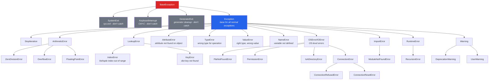

# 08 - Error Handling

## Coming from Node.js/TypeScript

Python's error handling looks similar to JavaScript's try/catch/finally, but with some important additions: `except` instead of `catch`, an `else` clause, a rich exception hierarchy, and a strong culture of "ask forgiveness not permission" (EAFP) instead of checking everything upfront.

---

## try / except / else / finally

### Basic Syntax

```python
try:
    result = 10 / 0
except ZeroDivisionError:
    print("Cannot divide by zero!")
```

```javascript
// JS equivalent
try {
    let result = 10 / 0;  // JS returns Infinity, no error!
} catch (error) {
    console.log("Error:", error.message);
}
```

**Important difference:** Many things that silently "work" in JS (returning `Infinity`, `NaN`, `undefined`) will throw exceptions in Python. Python is stricter about errors.

### The Full Structure

```python
try:
    # Code that might raise an exception
    value = int(input("Enter a number: "))
    result = 100 / value
except ValueError:
    # Handles the specific exception: invalid input for int()
    print("That's not a valid number!")
except ZeroDivisionError:
    # Handles another specific exception
    print("Can't divide by zero!")
except (TypeError, AttributeError) as e:
    # Handle multiple exception types, capture the exception object
    print(f"Type or attribute error: {e}")
except Exception as e:
    # Catch-all for any other exception (use sparingly)
    print(f"Unexpected error: {e}")
else:
    # Runs ONLY if NO exception was raised in the try block
    print(f"Result: {result}")
finally:
    # ALWAYS runs, whether or not an exception occurred
    print("Cleanup complete")
```

```javascript
// JS only has try/catch/finally (no else clause)
try {
    // ...
} catch (error) {
    if (error instanceof TypeError) { ... }
    else if (error instanceof RangeError) { ... }
    else { ... }
} finally {
    // always runs
}
```

### The else Clause -- Why It Matters

The `else` block runs only when the `try` block succeeds. This is better than putting code at the end of `try` because it narrows the scope of what is being "tried."

```python
# Without else (wider catch scope -- bad)
try:
    data = json.loads(raw_input)
    process(data)     # if process() raises, it's caught too!
except json.JSONDecodeError:
    print("Invalid JSON")

# With else (only catches what you intend)
try:
    data = json.loads(raw_input)
except json.JSONDecodeError:
    print("Invalid JSON")
else:
    process(data)     # if process() raises, it propagates normally
```

---

## The Exception Hierarchy

Python's exceptions form a class hierarchy. Understanding this helps you catch the right exceptions.



### Catching Specific vs Broad Exceptions

```python
# GOOD: Catch specific exceptions
try:
    with open("config.json") as f:
        config = json.load(f)
except FileNotFoundError:
    config = default_config
    print("Config file not found, using defaults")
except json.JSONDecodeError as e:
    print(f"Invalid JSON in config: {e}")
    raise   # re-raise after logging
except PermissionError:
    print("Permission denied reading config file")

# BAD: Bare except (catches EVERYTHING including Ctrl+C)
try:
    do_something()
except:               # NEVER do this
    pass

# BAD: Catching Exception too broadly
try:
    do_something()
except Exception:     # too broad -- masks real bugs
    pass

# ACCEPTABLE: Broad catch with logging
try:
    do_something()
except Exception as e:
    logger.error(f"Unexpected error: {e}", exc_info=True)
    raise             # re-raise so it's not silently swallowed
```

---

## raise -- Throwing Exceptions

```python
# Raise a built-in exception
raise ValueError("Age must be positive")
raise TypeError(f"Expected str, got {type(value).__name__}")
raise FileNotFoundError(f"Config file not found: {path}")

# Raise without arguments (re-raise the current exception)
try:
    process_data()
except ValueError:
    log_error()
    raise             # re-raises the original exception with traceback

# Raise from another exception (chaining)
try:
    value = int(user_input)
except ValueError as original:
    raise ValidationError(f"Invalid input: {user_input}") from original
# The traceback will show both: "The above exception was the direct cause..."

# Suppress the chain
try:
    value = int(user_input)
except ValueError:
    raise ValidationError(f"Invalid input") from None
# Only shows the new exception
```

```javascript
// JS equivalent
throw new Error("something went wrong");
throw new TypeError("expected string");

// Re-throw
try { ... } catch (e) {
    console.error(e);
    throw e;
}

// JS has no built-in exception chaining (need error.cause in ES2022)
throw new Error("wrapper", { cause: originalError });
```

---

## Custom Exception Classes

Creating custom exceptions is more idiomatic in Python than in JS.

```python
# Simple custom exception
class AppError(Exception):
    """Base exception for our application."""
    pass

class ValidationError(AppError):
    """Raised when input validation fails."""
    pass

class NotFoundError(AppError):
    """Raised when a resource is not found."""
    pass

class AuthenticationError(AppError):
    """Raised when authentication fails."""
    pass

# Custom exception with extra data
class APIError(AppError):
    """Raised when an API call fails."""
    def __init__(self, message, status_code=None, response=None):
        super().__init__(message)
        self.status_code = status_code
        self.response = response

    def __str__(self):
        if self.status_code:
            return f"APIError {self.status_code}: {super().__str__()}"
        return f"APIError: {super().__str__()}"

# Using custom exceptions
def get_user(user_id):
    if not isinstance(user_id, int):
        raise ValidationError(f"user_id must be int, got {type(user_id).__name__}")
    if user_id < 0:
        raise ValidationError("user_id must be positive")
    user = database.find(user_id)
    if user is None:
        raise NotFoundError(f"User {user_id} not found")
    return user

# Catching custom exceptions
try:
    user = get_user(user_id)
except ValidationError as e:
    return {"error": str(e), "code": 400}
except NotFoundError as e:
    return {"error": str(e), "code": 404}
except AppError as e:
    return {"error": str(e), "code": 500}
```

```javascript
// JS custom errors
class AppError extends Error {
    constructor(message) {
        super(message);
        this.name = 'AppError';
    }
}
class ValidationError extends AppError {
    constructor(message) {
        super(message);
        this.name = 'ValidationError';
    }
}
```

---

## Reading Tracebacks

Tracebacks are Python's stack traces. Read them **bottom to top** (the actual error is at the bottom).

```
Traceback (most recent call last):          <-- header
  File "main.py", line 15, in <module>      <-- where it started
    result = process_data(raw)
  File "main.py", line 10, in process_data  <-- through here
    parsed = parse_json(data)
  File "utils.py", line 5, in parse_json    <-- to here
    return json.loads(data)
           ^^^^^^^^^^^^^^^^
json.decoder.JSONDecodeError: Expecting value: line 1 column 1 (char 0)
                              ^-- THE ACTUAL ERROR (read this first!)
```

### Tips for Reading Tracebacks

1. **Start at the bottom** -- the last line tells you what went wrong
2. **Read up** -- the lines above show you the call chain
3. **Look at YOUR code** -- ignore standard library lines unless necessary
4. **The caret `^`** (Python 3.11+) points to the exact expression that failed

```python
# Python 3.11+ has even better tracebacks:
# Traceback (most recent call last):
#   File "example.py", line 3, in <module>
#     x["a"]["b"]["c"]
#     ~~~~~~~^^^^^
# TypeError: 'NoneType' object is not subscriptable
# (The carets show exactly which part failed!)
```

---

## EAFP vs LBYL

Python favors **EAFP** (Easier to Ask Forgiveness than Permission) over **LBYL** (Look Before You Leap).

```python
# LBYL (JS-style thinking -- check first)
if "key" in my_dict:
    value = my_dict["key"]
else:
    value = default

# EAFP (Pythonic -- just try it)
try:
    value = my_dict["key"]
except KeyError:
    value = default

# Even more Pythonic:
value = my_dict.get("key", default)

# LBYL for file access
import os
if os.path.exists(filepath):
    with open(filepath) as f:
        data = f.read()
    # PROBLEM: file could be deleted between check and open! (TOCTOU race)

# EAFP for file access (better!)
try:
    with open(filepath) as f:
        data = f.read()
except FileNotFoundError:
    data = None
```

---

## Common Error Handling Patterns

### Context Manager for Cleanup

```python
# Guaranteed cleanup with 'with' statement
with open("file.txt") as f:
    data = f.read()
# File is automatically closed, even if an exception occurs

# Database connection pattern
class DatabaseConnection:
    def __enter__(self):
        self.conn = create_connection()
        return self.conn

    def __exit__(self, exc_type, exc_val, exc_tb):
        self.conn.close()
        return False   # don't suppress exceptions

with DatabaseConnection() as conn:
    conn.execute("SELECT ...")
# Connection is always closed
```

### Retry with Exponential Backoff

```python
import time
import random

def retry_with_backoff(func, max_retries=3, base_delay=1):
    for attempt in range(max_retries):
        try:
            return func()
        except (ConnectionError, TimeoutError) as e:
            if attempt == max_retries - 1:
                raise  # last attempt, re-raise
            delay = base_delay * (2 ** attempt) + random.uniform(0, 1)
            print(f"Attempt {attempt + 1} failed: {e}. Retrying in {delay:.1f}s...")
            time.sleep(delay)
```

### Collecting Multiple Errors

```python
def validate_user(data):
    errors = []

    if not data.get("name"):
        errors.append("Name is required")
    elif len(data["name"]) < 2:
        errors.append("Name must be at least 2 characters")

    if not data.get("email"):
        errors.append("Email is required")
    elif "@" not in data["email"]:
        errors.append("Invalid email format")

    age = data.get("age")
    if age is not None:
        if not isinstance(age, int):
            errors.append("Age must be an integer")
        elif age < 0 or age > 150:
            errors.append("Age must be between 0 and 150")

    if errors:
        raise ValidationError(errors)

    return True

# Usage
try:
    validate_user({"name": "", "email": "bad", "age": -5})
except ValidationError as e:
    print(f"Validation failed: {e.args[0]}")
    # ['Name is required', 'Invalid email format', 'Age must be between 0 and 150']
```

### Exception Groups (Python 3.11+)

```python
# Handle multiple exceptions that occurred concurrently
try:
    raise ExceptionGroup("multiple errors", [
        ValueError("invalid value"),
        TypeError("wrong type"),
        KeyError("missing key"),
    ])
except* ValueError as eg:
    print(f"Value errors: {eg.exceptions}")
except* TypeError as eg:
    print(f"Type errors: {eg.exceptions}")
except* KeyError as eg:
    print(f"Key errors: {eg.exceptions}")
```

---

## Warnings (Not Exceptions)

Warnings are for non-fatal issues that should not crash the program.

```python
import warnings

def connect(host, port, use_ssl=False):
    if not use_ssl:
        warnings.warn(
            "Connection without SSL is deprecated. Use use_ssl=True.",
            DeprecationWarning,
            stacklevel=2,
        )
    # ... connect

connect("localhost", 5432)
# UserWarning: Connection without SSL is deprecated...

# Control warning behavior
warnings.filterwarnings("ignore", category=DeprecationWarning)
warnings.filterwarnings("error", category=UserWarning)  # treat as exception
```

---

## Summary: Error Handling Comparison

| Feature                  | Python                             | JavaScript                        |
|--------------------------|------------------------------------|------------------------------------|
| Try/catch syntax         | `try/except`                       | `try/catch`                        |
| Else clause              | `try...else:` (success block)      | No equivalent                      |
| Finally                  | `finally:`                         | `finally {}`                       |
| Throw/raise              | `raise ValueError("msg")`         | `throw new Error("msg")`           |
| Re-throw                 | `raise`                            | `throw`                            |
| Exception chaining       | `raise X from Y`                   | `new Error(msg, {cause: e})`       |
| Catch specific type      | `except TypeError:`                | `if (e instanceof TypeError)`      |
| Catch multiple types     | `except (TypeError, ValueError):`  | Multiple `instanceof` checks       |
| Custom exceptions        | `class MyError(Exception):`        | `class MyError extends Error {}`   |
| Cleanup guarantee        | `with` statement                   | No direct equivalent               |
| Division by zero         | `ZeroDivisionError`                | Returns `Infinity`                 |
| Null property access     | `AttributeError` / `TypeError`     | `TypeError` or `undefined`         |
| Missing dict key         | `KeyError`                         | Returns `undefined`                |
| Invalid array index      | `IndexError`                       | Returns `undefined`                |

---

## Practice Exercises

### Exercise 1: Safe JSON Parser
Write a `safe_json_parse` function that handles all possible errors and returns a tuple of `(data, error)` -- similar to Go's error handling pattern or a Result type.

```python
def safe_json_parse(json_string, expected_keys=None):
    """Parse JSON and optionally validate expected keys."""
    pass

# Should handle: invalid JSON, wrong type (not a dict), missing keys
```

<details>
<summary>Solution</summary>

```python
import json

def safe_json_parse(json_string, expected_keys=None):
    """
    Parse JSON safely.
    Returns (data, None) on success, (None, error_message) on failure.
    """
    try:
        data = json.loads(json_string)
    except json.JSONDecodeError as e:
        return None, f"Invalid JSON: {e}"
    except TypeError as e:
        return None, f"Input must be a string: {e}"

    if expected_keys:
        if not isinstance(data, dict):
            return None, f"Expected a JSON object, got {type(data).__name__}"
        missing = set(expected_keys) - set(data.keys())
        if missing:
            return None, f"Missing required keys: {missing}"

    return data, None

# Tests
data, err = safe_json_parse('{"name": "Alice", "age": 30}', ["name", "age"])
print(data, err)  # {'name': 'Alice', 'age': 30} None

data, err = safe_json_parse('invalid json')
print(data, err)  # None Invalid JSON: ...

data, err = safe_json_parse('[1, 2, 3]', ["name"])
print(data, err)  # None Expected a JSON object, got list

data, err = safe_json_parse('{"name": "Alice"}', ["name", "age"])
print(data, err)  # None Missing required keys: {'age'}
```
</details>

### Exercise 2: Custom Exception Hierarchy
Build a file processing system with a custom exception hierarchy. Create `FileProcessingError` as the base, with subtypes for `FileFormatError`, `FileSizeError`, and `FilePermissionError`. Each should carry relevant context.

<details>
<summary>Solution</summary>

```python
from pathlib import Path

class FileProcessingError(Exception):
    """Base exception for file processing errors."""
    def __init__(self, message, filepath=None):
        super().__init__(message)
        self.filepath = filepath

class FileFormatError(FileProcessingError):
    """Raised when file format is invalid."""
    def __init__(self, message, filepath=None, expected_format=None, actual_format=None):
        super().__init__(message, filepath)
        self.expected_format = expected_format
        self.actual_format = actual_format

class FileSizeError(FileProcessingError):
    """Raised when file exceeds size limit."""
    def __init__(self, message, filepath=None, size=None, max_size=None):
        super().__init__(message, filepath)
        self.size = size
        self.max_size = max_size

class FilePermissionError(FileProcessingError):
    """Raised when we lack permission to process the file."""
    def __init__(self, message, filepath=None, required_permission=None):
        super().__init__(message, filepath)
        self.required_permission = required_permission

MAX_FILE_SIZE = 10 * 1024 * 1024  # 10MB
ALLOWED_FORMATS = {".csv", ".json", ".xml"}

def process_file(filepath):
    path = Path(filepath)

    # Check format
    if path.suffix not in ALLOWED_FORMATS:
        raise FileFormatError(
            f"Unsupported file format: {path.suffix}",
            filepath=str(path),
            expected_format=ALLOWED_FORMATS,
            actual_format=path.suffix,
        )

    # Check existence and permissions
    try:
        size = path.stat().st_size
    except PermissionError:
        raise FilePermissionError(
            f"Cannot access file: {path}",
            filepath=str(path),
            required_permission="read",
        )
    except FileNotFoundError:
        raise FileProcessingError(f"File not found: {path}", filepath=str(path))

    # Check size
    if size > MAX_FILE_SIZE:
        raise FileSizeError(
            f"File too large: {size / 1024 / 1024:.1f}MB (max: {MAX_FILE_SIZE / 1024 / 1024:.0f}MB)",
            filepath=str(path),
            size=size,
            max_size=MAX_FILE_SIZE,
        )

    return f"Successfully processed {path.name}"

# Usage
try:
    result = process_file("data.xlsx")
except FileFormatError as e:
    print(f"Format error: {e}")
    print(f"  Allowed: {e.expected_format}")
except FileSizeError as e:
    print(f"Size error: {e}")
    print(f"  Size: {e.size}, Max: {e.max_size}")
except FilePermissionError as e:
    print(f"Permission error: {e}")
except FileProcessingError as e:
    print(f"Processing error: {e}")
```
</details>

### Exercise 3: Error-Resilient Data Pipeline
Write a data processing pipeline that continues processing even when individual records fail. Collect all errors and report them at the end.

```python
def process_records(records):
    """Process a list of records. Continue on individual failures."""
    pass

records = [
    {"id": 1, "name": "Alice", "age": "30"},
    {"id": 2, "name": "", "age": "25"},        # empty name
    {"id": 3, "name": "Charlie", "age": "abc"}, # invalid age
    {"id": 4, "name": "Diana", "age": "-5"},    # negative age
    {"id": 5, "name": "Eve", "age": "28"},
]
```

<details>
<summary>Solution</summary>

```python
from dataclasses import dataclass, field

@dataclass
class ProcessingResult:
    successes: list = field(default_factory=list)
    failures: list = field(default_factory=list)

    @property
    def total(self):
        return len(self.successes) + len(self.failures)

    @property
    def success_rate(self):
        return len(self.successes) / self.total if self.total else 0

    def summary(self):
        print(f"Processed {self.total} records:")
        print(f"  Successes: {len(self.successes)} ({self.success_rate:.0%})")
        print(f"  Failures: {len(self.failures)}")
        for record_id, error in self.failures:
            print(f"    Record {record_id}: {error}")

def validate_record(record):
    """Validate and transform a single record."""
    if not record.get("name"):
        raise ValueError("Name is required")

    try:
        age = int(record["age"])
    except (ValueError, KeyError):
        raise ValueError(f"Invalid age: {record.get('age')}")

    if age < 0:
        raise ValueError(f"Age must be non-negative, got {age}")

    return {
        "id": record["id"],
        "name": record["name"].strip().title(),
        "age": age,
    }

def process_records(records):
    result = ProcessingResult()

    for record in records:
        record_id = record.get("id", "unknown")
        try:
            processed = validate_record(record)
            result.successes.append(processed)
        except (ValueError, KeyError, TypeError) as e:
            result.failures.append((record_id, str(e)))

    return result

# Usage
records = [
    {"id": 1, "name": "Alice", "age": "30"},
    {"id": 2, "name": "", "age": "25"},
    {"id": 3, "name": "Charlie", "age": "abc"},
    {"id": 4, "name": "Diana", "age": "-5"},
    {"id": 5, "name": "Eve", "age": "28"},
]

result = process_records(records)
result.summary()
# Processed 5 records:
#   Successes: 2 (40%)
#   Failures: 3
#     Record 2: Name is required
#     Record 3: Invalid age: abc
#     Record 4: Age must be non-negative, got -5

print("\nSuccessful records:")
for r in result.successes:
    print(f"  {r}")
```
</details>
