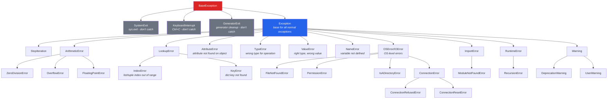

# 08 - Error Handling

## Node.js/TypeScript se aa rahe ho toh

Python ka error handling dekhne mein JavaScript ke try/catch/finally jaisa hi lagta hai, lekin kuch important cheezein add ho jaati hain — `catch` ki jagah `except`, ek `else` clause, exceptions ki ek poori rich hierarchy, aur ek strong culture hai "pehle permission maango ki nahi, bas try karo aur agar problem aaye toh maafi maang lo" (EAFP) — permission-first approach ke bajaye.

---

## try / except / else / finally

### Basic Syntax

```python
try:
    result = 10 / 0
except ZeroDivisionError:
    print("Cannot divide by zero!")
```

```javascript
// JS equivalent
try {
    let result = 10 / 0;  // JS returns Infinity, no error!
} catch (error) {
    console.log("Error:", error.message);
}
```

**Important difference:** JS mein jo cheezein chup-chaap "chal jaati hain" (`Infinity`, `NaN`, `undefined` return karke), Python mein wahi cheezein exception throw kar deti hain. Python errors ke maamle mein zyada strict hai.

### Poora Structure

```python
try:
    # Aisa code jo exception raise kar sakta hai
    value = int(input("Enter a number: "))
    result = 100 / value
except ValueError:
    # Specific exception handle karo: int() ke liye invalid input
    print("That's not a valid number!")
except ZeroDivisionError:
    # Ek aur specific exception handle karo
    print("Can't divide by zero!")
except (TypeError, AttributeError) as e:
    # Multiple exception types ek saath handle karo, exception object bhi pakdo
    print(f"Type or attribute error: {e}")
except Exception as e:
    # Har cheez ke liye catch-all (sambhal ke use karo)
    print(f"Unexpected error: {e}")
else:
    # Sirf tab chalega jab try block mein KOI exception NAHI aaya
    print(f"Result: {result}")
finally:
    # Hamesha chalega, exception aaya ho ya nahi
    print("Cleanup complete")
```

```javascript
// JS mein sirf try/catch/finally hota hai (else clause nahi hoti)
try {
    // ...
} catch (error) {
    if (error instanceof TypeError) { ... }
    else if (error instanceof RangeError) { ... }
    else { ... }
} finally {
    // always runs
}
```

### else Clause -- Yeh Kyun Matter Karta Hai

`else` block sirf tab chalta hai jab `try` block successfully complete ho jaaye. Yeh `try` ke andar hi sab code likhne se better hai, kyunki isse pata chalta hai ki asal mein "try" kya kiya ja raha hai — scope narrow ho jaata hai.

```python
# else ke bina (wider catch scope -- bura tareeka)
try:
    data = json.loads(raw_input)
    process(data)     # agar process() mein error aaya, woh bhi yahin catch ho jaayega!
except json.JSONDecodeError:
    print("Invalid JSON")

# else ke saath (sirf wahi catch hoga jo tum chahte ho)
try:
    data = json.loads(raw_input)
except json.JSONDecodeError:
    print("Invalid JSON")
else:
    process(data)     # agar process() mein error aaya, woh normally propagate hoga
```

> [!tip]
> Socho `try` block ko sirf "risky" step ke liye use karo (jaise JSON parse karna), aur `else` mein woh code rakho jo tabhi chalna chahiye jab woh risky step safal ho. Isse bugs chhupte nahi hain.

---

## Exception Hierarchy

Python ke exceptions ek class hierarchy banate hain — bilkul dabbawala system jaisa, jahan har cheez ka ek parent category hota hai. Yeh samajhna zaruri hai taaki tum sahi exception catch kar sako.



### Specific vs Broad Exceptions Catch Karna

```python
# ACCHA: Specific exceptions catch karo
try:
    with open("config.json") as f:
        config = json.load(f)
except FileNotFoundError:
    config = default_config
    print("Config file not found, using defaults")
except json.JSONDecodeError as e:
    print(f"Invalid JSON in config: {e}")
    raise   # log karne ke baad re-raise karo
except PermissionError:
    print("Permission denied reading config file")

# BURA: Bare except (SAB kuch catch kar lega, Ctrl+C bhi)
try:
    do_something()
except:               # KABHI mat karo yeh
    pass

# BURA: Exception ko bahut broad tarike se catch karna
try:
    do_something()
except Exception:     # bahut broad -- असली bugs chhupa deta hai
    pass

# THEEK HAI: Logging ke saath broad catch
try:
    do_something()
except Exception as e:
    logger.error(f"Unexpected error: {e}", exc_info=True)
    raise             # re-raise karo taaki chup-chaap gum na ho
```

> [!warning]
> Bare `except:` ya bhi broad `except Exception:` bina re-raise ke — yeh production mein sabse zyada dard dene wali galti hai. Zomato ka payment fail hua aur tumne `except: pass` likh diya toh user ko pata bhi nahi chalega ki uska paisa kat gaya lekin order place nahi hua!

---

## raise -- Exception Throw Karna

```python
# Ek built-in exception raise karo
raise ValueError("Age must be positive")
raise TypeError(f"Expected str, got {type(value).__name__}")
raise FileNotFoundError(f"Config file not found: {path}")

# Bina arguments ke raise karo (current exception ko re-raise karta hai)
try:
    process_data()
except ValueError:
    log_error()
    raise             # original exception ko traceback ke saath re-raise karta hai

# Ek exception se doosra raise karo (chaining)
try:
    value = int(user_input)
except ValueError as original:
    raise ValidationError(f"Invalid input: {user_input}") from original
# Traceback dono dikhaayega: "The above exception was the direct cause..."

# Chain ko suppress karo
try:
    value = int(user_input)
except ValueError:
    raise ValidationError(f"Invalid input") from None
# Sirf naya exception dikhega
```

```javascript
// JS equivalent
throw new Error("something went wrong");
throw new TypeError("expected string");

// Re-throw
try { ... } catch (e) {
    console.error(e);
    throw e;
}

// JS mein built-in exception chaining nahi hai (ES2022 mein error.cause chahiye)
throw new Error("wrapper", { cause: originalError });
```

---

## Custom Exception Classes

Python mein apne custom exceptions banana JS ke muqable mein zyada idiomatic hai — yeh normal practice hai.

```python
# Simple custom exception
class AppError(Exception):
    """Hamare application ka base exception."""
    pass

class ValidationError(AppError):
    """Jab input validation fail ho tab raise hota hai."""
    pass

class NotFoundError(AppError):
    """Jab koi resource na mile tab raise hota hai."""
    pass

class AuthenticationError(AppError):
    """Jab authentication fail ho tab raise hota hai."""
    pass

# Extra data ke saath custom exception
class APIError(AppError):
    """Jab koi API call fail ho jaaye."""
    def __init__(self, message, status_code=None, response=None):
        super().__init__(message)
        self.status_code = status_code
        self.response = response

    def __str__(self):
        if self.status_code:
            return f"APIError {self.status_code}: {super().__str__()}"
        return f"APIError: {super().__str__()}"

# Custom exceptions use karna
def get_user(user_id):
    if not isinstance(user_id, int):
        raise ValidationError(f"user_id must be int, got {type(user_id).__name__}")
    if user_id < 0:
        raise ValidationError("user_id must be positive")
    user = database.find(user_id)
    if user is None:
        raise NotFoundError(f"User {user_id} not found")
    return user

# Custom exceptions catch karna
try:
    user = get_user(user_id)
except ValidationError as e:
    return {"error": str(e), "code": 400}
except NotFoundError as e:
    return {"error": str(e), "code": 404}
except AppError as e:
    return {"error": str(e), "code": 500}
```

```javascript
// JS custom errors
class AppError extends Error {
    constructor(message) {
        super(message);
        this.name = 'AppError';
    }
}
class ValidationError extends AppError {
    constructor(message) {
        super(message);
        this.name = 'ValidationError';
    }
}
```

> [!info]
> Ek `AppError` base class banao aur uske neeche saare specific errors ka hierarchy khada karo (`ValidationError`, `NotFoundError`, waghera). Ye Swiggy jaisa hi hai — "OrderError" ek umbrella hai, uske andar "RestaurantClosedError", "PaymentFailedError" waghera aate hain. Isse tum kabhi bhi broad ya narrow level pe catch kar sakte ho.

---

## Tracebacks Padhna

Tracebacks Python ke stack traces hote hain. Inko **neeche se upar** padho (asli error sabse neeche hota hai).

```
Traceback (most recent call last):          <-- header
  File "main.py", line 15, in <module>      <-- yahan se shuru hua
    result = process_data(raw)
  File "main.py", line 10, in process_data  <-- yahan se guzra
    parsed = parse_json(data)
  File "utils.py", line 5, in parse_json    <-- yahan tak
    return json.loads(data)
           ^^^^^^^^^^^^^^^^
json.decoder.JSONDecodeError: Expecting value: line 1 column 1 (char 0)
                              ^-- ASLI ERROR (pehle yeh padho!)
```

### Tracebacks Padhne Ke Tips

1. **Sabse neeche se shuru karo** -- last line hi batati hai ki kya galat hua
2. **Upar padhte jao** -- upar wali lines call chain dikhati hain
3. **Apne khud ke code pe focus karo** -- standard library ki lines ignore karo, jab tak zaruri na ho
4. **Caret `^`** (Python 3.11+) exact expression point karta hai jo fail hua

```python
# Python 3.11+ mein aur bhi acche tracebacks hain:
# Traceback (most recent call last):
#   File "example.py", line 3, in <module>
#     x["a"]["b"]["c"]
#     ~~~~~~~^^^^^
# TypeError: 'NoneType' object is not subscriptable
# (Caret exactly dikhata hai kaunsa part fail hua!)
```

---

## EAFP vs LBYL

Python **EAFP** (Easier to Ask Forgiveness than Permission — pehle try karo, error aaye toh sambhal lo) ko **LBYL** (Look Before You Leap — pehle check karo phir karo) se zyada pasand karta hai.

```python
# LBYL (JS-style thinking -- pehle check karo)
if "key" in my_dict:
    value = my_dict["key"]
else:
    value = default

# EAFP (Pythonic -- bas try kar do)
try:
    value = my_dict["key"]
except KeyError:
    value = default

# Aur bhi zyada Pythonic:
value = my_dict.get("key", default)

# LBYL file access ke liye
import os
if os.path.exists(filepath):
    with open(filepath) as f:
        data = f.read()
    # PROBLEM: check aur open ke beech file delete ho sakti hai! (TOCTOU race)

# EAFP file access ke liye (behtar!)
try:
    with open(filepath) as f:
        data = f.read()
except FileNotFoundError:
    data = None
```

> [!tip]
> Socho IRCTC ka tatkal booking — pehle "seat available hai kya" check karke phir book karne ki koshish karoge toh tab tak koi aur book kar lega (LBYL race condition). Isse better hai directly book karne ki koshish karo, agar seat nahi hai toh error handle kar lo (EAFP). Yehi soch Python ke code mein bhi lagti hai.

---

## Common Error Handling Patterns

### Cleanup Ke Liye Context Manager

```python
# 'with' statement se guaranteed cleanup
with open("file.txt") as f:
    data = f.read()
# File apne aap close ho jaati hai, exception aaye ya na aaye

# Database connection pattern
class DatabaseConnection:
    def __enter__(self):
        self.conn = create_connection()
        return self.conn

    def __exit__(self, exc_type, exc_val, exc_tb):
        self.conn.close()
        return False   # exception ko suppress mat karo

with DatabaseConnection() as conn:
    conn.execute("SELECT ...")
# Connection hamesha close ho jaata hai
```

### Exponential Backoff Ke Saath Retry

```python
import time
import random

def retry_with_backoff(func, max_retries=3, base_delay=1):
    for attempt in range(max_retries):
        try:
            return func()
        except (ConnectionError, TimeoutError) as e:
            if attempt == max_retries - 1:
                raise  # last attempt tha, re-raise karo
            delay = base_delay * (2 ** attempt) + random.uniform(0, 1)
            print(f"Attempt {attempt + 1} failed: {e}. Retrying in {delay:.1f}s...")
            time.sleep(delay)
```

> [!info]
> Yeh exactly wahi pattern hai jo UPI payment apps use karte hain — agar server se connection fail ho jaaye, turant retry mat karo, thoda wait karo aur har baar wait time double karte jao. Isse server pe load bhi kam padta hai.

### Multiple Errors Collect Karna

```python
def validate_user(data):
    errors = []

    if not data.get("name"):
        errors.append("Name is required")
    elif len(data["name"]) < 2:
        errors.append("Name must be at least 2 characters")

    if not data.get("email"):
        errors.append("Email is required")
    elif "@" not in data["email"]:
        errors.append("Invalid email format")

    age = data.get("age")
    if age is not None:
        if not isinstance(age, int):
            errors.append("Age must be an integer")
        elif age < 0 or age > 150:
            errors.append("Age must be between 0 and 150")

    if errors:
        raise ValidationError(errors)

    return True

# Usage
try:
    validate_user({"name": "", "email": "bad", "age": -5})
except ValidationError as e:
    print(f"Validation failed: {e.args[0]}")
    # ['Name is required', 'Invalid email format', 'Age must be between 0 and 150']
```

### Exception Groups (Python 3.11+)

```python
# Ek saath (concurrently) hue multiple exceptions handle karo
try:
    raise ExceptionGroup("multiple errors", [
        ValueError("invalid value"),
        TypeError("wrong type"),
        KeyError("missing key"),
    ])
except* ValueError as eg:
    print(f"Value errors: {eg.exceptions}")
except* TypeError as eg:
    print(f"Type errors: {eg.exceptions}")
except* KeyError as eg:
    print(f"Key errors: {eg.exceptions}")
```

---

## Warnings (Exceptions Nahi Hain)

Warnings un non-fatal issues ke liye hoti hain jo program ko crash nahi karni chahiye.

```python
import warnings

def connect(host, port, use_ssl=False):
    if not use_ssl:
        warnings.warn(
            "Connection without SSL is deprecated. Use use_ssl=True.",
            DeprecationWarning,
            stacklevel=2,
        )
    # ... connect

connect("localhost", 5432)
# UserWarning: Connection without SSL is deprecated...

# Warning ka behavior control karo
warnings.filterwarnings("ignore", category=DeprecationWarning)
warnings.filterwarnings("error", category=UserWarning)  # exception jaisa treat karo
```

---

## Summary: Error Handling Comparison

| Feature                  | Python                             | JavaScript                        |
|--------------------------|------------------------------------|------------------------------------|
| Try/catch syntax         | `try/except`                       | `try/catch`                        |
| Else clause              | `try...else:` (success block)      | No equivalent                      |
| Finally                  | `finally:`                         | `finally {}`                       |
| Throw/raise              | `raise ValueError("msg")`         | `throw new Error("msg")`           |
| Re-throw                 | `raise`                            | `throw`                            |
| Exception chaining       | `raise X from Y`                   | `new Error(msg, {cause: e})`       |
| Catch specific type      | `except TypeError:`                | `if (e instanceof TypeError)`      |
| Catch multiple types     | `except (TypeError, ValueError):`  | Multiple `instanceof` checks       |
| Custom exceptions        | `class MyError(Exception):`        | `class MyError extends Error {}`   |
| Cleanup guarantee        | `with` statement                   | No direct equivalent               |
| Division by zero         | `ZeroDivisionError`                | Returns `Infinity`                 |
| Null property access     | `AttributeError` / `TypeError`     | `TypeError` or `undefined`         |
| Missing dict key         | `KeyError`                         | Returns `undefined`                |
| Invalid array index      | `IndexError`                       | Returns `undefined`                |

---

## Practice Exercises

### Exercise 1: Safe JSON Parser
Ek `safe_json_parse` function likho jo saare possible errors handle kare aur `(data, error)` ka tuple return kare -- bilkul Go ke error handling pattern ya Result type jaisa.

```python
def safe_json_parse(json_string, expected_keys=None):
    """Parse JSON and optionally validate expected keys."""
    pass

# Handle karna hai: invalid JSON, wrong type (dict nahi hai), missing keys
```

<details>
<summary>Solution</summary>

```python
import json

def safe_json_parse(json_string, expected_keys=None):
    """
    JSON ko safely parse karo.
    Success pe (data, None) return karta hai, failure pe (None, error_message).
    """
    try:
        data = json.loads(json_string)
    except json.JSONDecodeError as e:
        return None, f"Invalid JSON: {e}"
    except TypeError as e:
        return None, f"Input must be a string: {e}"

    if expected_keys:
        if not isinstance(data, dict):
            return None, f"Expected a JSON object, got {type(data).__name__}"
        missing = set(expected_keys) - set(data.keys())
        if missing:
            return None, f"Missing required keys: {missing}"

    return data, None

# Tests
data, err = safe_json_parse('{"name": "Alice", "age": 30}', ["name", "age"])
print(data, err)  # {'name': 'Alice', 'age': 30} None

data, err = safe_json_parse('invalid json')
print(data, err)  # None Invalid JSON: ...

data, err = safe_json_parse('[1, 2, 3]', ["name"])
print(data, err)  # None Expected a JSON object, got list

data, err = safe_json_parse('{"name": "Alice"}', ["name", "age"])
print(data, err)  # None Missing required keys: {'age'}
```
</details>

### Exercise 2: Custom Exception Hierarchy
Ek file processing system banao jisme custom exception hierarchy ho. `FileProcessingError` ko base banao, aur `FileFormatError`, `FileSizeError`, `FilePermissionError` uske subtypes hon. Har ek apna relevant context carry kare.

<details>
<summary>Solution</summary>

```python
from pathlib import Path

class FileProcessingError(Exception):
    """File processing errors ke liye base exception."""
    def __init__(self, message, filepath=None):
        super().__init__(message)
        self.filepath = filepath

class FileFormatError(FileProcessingError):
    """Jab file format invalid ho tab raise hota hai."""
    def __init__(self, message, filepath=None, expected_format=None, actual_format=None):
        super().__init__(message, filepath)
        self.expected_format = expected_format
        self.actual_format = actual_format

class FileSizeError(FileProcessingError):
    """Jab file size limit se zyada ho tab raise hota hai."""
    def __init__(self, message, filepath=None, size=None, max_size=None):
        super().__init__(message, filepath)
        self.size = size
        self.max_size = max_size

class FilePermissionError(FileProcessingError):
    """Jab file process karne ki permission na ho tab raise hota hai."""
    def __init__(self, message, filepath=None, required_permission=None):
        super().__init__(message, filepath)
        self.required_permission = required_permission

MAX_FILE_SIZE = 10 * 1024 * 1024  # 10MB
ALLOWED_FORMATS = {".csv", ".json", ".xml"}

def process_file(filepath):
    path = Path(filepath)

    # Format check karo
    if path.suffix not in ALLOWED_FORMATS:
        raise FileFormatError(
            f"Unsupported file format: {path.suffix}",
            filepath=str(path),
            expected_format=ALLOWED_FORMATS,
            actual_format=path.suffix,
        )

    # Existence aur permissions check karo
    try:
        size = path.stat().st_size
    except PermissionError:
        raise FilePermissionError(
            f"Cannot access file: {path}",
            filepath=str(path),
            required_permission="read",
        )
    except FileNotFoundError:
        raise FileProcessingError(f"File not found: {path}", filepath=str(path))

    # Size check karo
    if size > MAX_FILE_SIZE:
        raise FileSizeError(
            f"File too large: {size / 1024 / 1024:.1f}MB (max: {MAX_FILE_SIZE / 1024 / 1024:.0f}MB)",
            filepath=str(path),
            size=size,
            max_size=MAX_FILE_SIZE,
        )

    return f"Successfully processed {path.name}"

# Usage
try:
    result = process_file("data.xlsx")
except FileFormatError as e:
    print(f"Format error: {e}")
    print(f"  Allowed: {e.expected_format}")
except FileSizeError as e:
    print(f"Size error: {e}")
    print(f"  Size: {e.size}, Max: {e.max_size}")
except FilePermissionError as e:
    print(f"Permission error: {e}")
except FileProcessingError as e:
    print(f"Processing error: {e}")
```
</details>

### Exercise 3: Error-Resilient Data Pipeline
Ek data processing pipeline likho jo individual records fail hone par bhi processing continue rakhe. Saare errors collect karo aur end mein report karo.

```python
def process_records(records):
    """Records ki list process karo. Individual failures pe bhi rukna nahi hai."""
    pass

records = [
    {"id": 1, "name": "Alice", "age": "30"},
    {"id": 2, "name": "", "age": "25"},        # empty name
    {"id": 3, "name": "Charlie", "age": "abc"}, # invalid age
    {"id": 4, "name": "Diana", "age": "-5"},    # negative age
    {"id": 5, "name": "Eve", "age": "28"},
]
```

<details>
<summary>Solution</summary>

```python
from dataclasses import dataclass, field

@dataclass
class ProcessingResult:
    successes: list = field(default_factory=list)
    failures: list = field(default_factory=list)

    @property
    def total(self):
        return len(self.successes) + len(self.failures)

    @property
    def success_rate(self):
        return len(self.successes) / self.total if self.total else 0

    def summary(self):
        print(f"Processed {self.total} records:")
        print(f"  Successes: {len(self.successes)} ({self.success_rate:.0%})")
        print(f"  Failures: {len(self.failures)}")
        for record_id, error in self.failures:
            print(f"    Record {record_id}: {error}")

def validate_record(record):
    """Ek single record ko validate aur transform karo."""
    if not record.get("name"):
        raise ValueError("Name is required")

    try:
        age = int(record["age"])
    except (ValueError, KeyError):
        raise ValueError(f"Invalid age: {record.get('age')}")

    if age < 0:
        raise ValueError(f"Age must be non-negative, got {age}")

    return {
        "id": record["id"],
        "name": record["name"].strip().title(),
        "age": age,
    }

def process_records(records):
    result = ProcessingResult()

    for record in records:
        record_id = record.get("id", "unknown")
        try:
            processed = validate_record(record)
            result.successes.append(processed)
        except (ValueError, KeyError, TypeError) as e:
            result.failures.append((record_id, str(e)))

    return result

# Usage
records = [
    {"id": 1, "name": "Alice", "age": "30"},
    {"id": 2, "name": "", "age": "25"},
    {"id": 3, "name": "Charlie", "age": "abc"},
    {"id": 4, "name": "Diana", "age": "-5"},
    {"id": 5, "name": "Eve", "age": "28"},
]

result = process_records(records)
result.summary()
# Processed 5 records:
#   Successes: 2 (40%)
#   Failures: 3
#     Record 2: Name is required
#     Record 3: Invalid age: abc
#     Record 4: Age must be non-negative, got -5

print("\nSuccessful records:")
for r in result.successes:
    print(f"  {r}")
```
</details>

## Key Takeaways

- `except` = JS ka `catch`, lekin `else` clause bhi milta hai jo sirf tab chalta hai jab try successful ho — isse scope narrow rehta hai.
- Python errors ke maamle mein JS se zyada strict hai — division by zero, missing dict key waghera silently pass nahi hote, exception throw karte hain.
- Specific exceptions catch karo (`FileNotFoundError`, `ValueError`), bare `except:` ya broad `except Exception:` bina re-raise ke kabhi mat likho.
- `raise X from Y` se exception chaining milti hai — original error ka context bhi preserve hota hai.
- Custom exceptions banana Python mein bahut common practice hai — apna `AppError` base class banao aur uske neeche specific errors ka hierarchy khada karo.
- Traceback hamesha **neeche se upar** padho — asli error last line pe hota hai.
- EAFP (pehle try karo, error aaye toh sambhalo) Python ka pasandida style hai, LBYL (pehle check karo) ke muqable — especially file access aur dict lookups mein TOCTOU races bachane ke liye.
- `with` statement guaranteed cleanup deta hai — exception aaye ya na aaye, resource close ho jaata hai.
