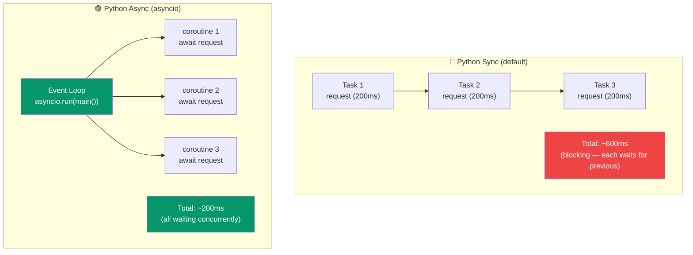

# Async/Await in Python

## The Critical Mindset Shift from Node.js

This is probably the **most important chapter** for a Node.js developer learning Python. The async models are fundamentally different:

| Aspect | Node.js | Python |
|---|---|---|
| Default mode | **Async** -- everything is non-blocking | **Sync** -- everything is blocking |
| Event loop | Always running, built into runtime | Must be explicitly started with `asyncio.run()` |
| File I/O | Async by default (`fs.promises`) | Sync by default (`open()`) |
| HTTP server | Async by default (Express, Fastify) | Sync by default (Flask, Django) |
| Ecosystem | One world -- everything is async | **Two worlds** -- sync and async libraries |

In Node.js, you live in an async world and occasionally do sync things. In Python, you live in a sync world and opt into async when you need it.



---

## Basic Syntax: Familiar Territory

The syntax is nearly identical to JavaScript:

```python
import asyncio

async def fetch_data(url: str) -> dict:
    print(f"Fetching {url}...")
    await asyncio.sleep(1)  # Simulate network delay
    return {"url": url, "data": "some content"}

async def main():
    result = await fetch_data("https://api.example.com")
    print(result)

# You MUST explicitly start the event loop
asyncio.run(main())
```

```javascript
// JavaScript -- nearly identical syntax
async function fetchData(url) {
  console.log(`Fetching ${url}...`);
  await new Promise((resolve) => setTimeout(resolve, 1000));
  return { url, data: "some content" };
}

// Event loop is already running -- just call it
const result = await fetchData("https://api.example.com");
console.log(result);
```

### Key difference: `asyncio.run()`

In Node.js, the event loop is always there. In Python, you must start it:

```python
import asyncio

async def main():
    print("Hello from async Python!")

# This is the entry point -- starts the event loop, runs main, then stops
asyncio.run(main())

# You CANNOT just await at the top level in a regular .py file
# await main()  # SyntaxError!

# (Python 3.12+ REPL does support top-level await, and Jupyter notebooks do too)
```

---

## Coroutines Explained

When you call an `async def` function, it doesn't execute -- it returns a coroutine object. This is different from JavaScript where calling an async function immediately starts execution and returns a Promise.

```python
async def greet(name: str) -> str:
    return f"Hello, {name}"

# This does NOT execute the function body!
coro = greet("Alice")
print(type(coro))  # <class 'coroutine'>

# You must await it to get the result
async def main():
    result = await greet("Alice")
    print(result)  # "Hello, Alice"

asyncio.run(main())
```

```javascript
// JavaScript -- calling async function immediately starts execution
const promise = greet("Alice"); // Already running!
console.log(typeof promise); // 'object' (Promise)
const result = await promise; // Just waiting for completion
```

---

## `asyncio.sleep()` vs `setTimeout`

```python
import asyncio

async def delayed_greet(name: str, delay: float) -> str:
    await asyncio.sleep(delay)  # Non-blocking sleep
    return f"Hello, {name}!"

# DON'T use time.sleep() in async code -- it blocks the event loop!
import time

async def BAD_example():
    time.sleep(5)  # BLOCKS the entire event loop for 5 seconds!
    # Nothing else can run during this time

async def GOOD_example():
    await asyncio.sleep(5)  # Non-blocking -- other tasks can run
```

```javascript
// JavaScript equivalent
function sleep(ms) {
  return new Promise((resolve) => setTimeout(resolve, ms));
}

async function delayedGreet(name, delay) {
  await sleep(delay * 1000);
  return `Hello, ${name}!`;
}
```

---

## Running Multiple Coroutines

### Sequential Execution

```python
import asyncio
import time

async def fetch(url: str) -> str:
    print(f"  Fetching {url}")
    await asyncio.sleep(1)
    return f"Data from {url}"

async def main():
    start = time.time()

    # Sequential -- each waits for the previous one
    r1 = await fetch("https://api1.example.com")
    r2 = await fetch("https://api2.example.com")
    r3 = await fetch("https://api3.example.com")

    print(f"Total: {time.time() - start:.1f}s")  # ~3.0s
    print(r1, r2, r3)

asyncio.run(main())
```

### Concurrent Execution with `asyncio.gather()`

```python
async def main():
    start = time.time()

    # Concurrent -- all run at the same time
    r1, r2, r3 = await asyncio.gather(
        fetch("https://api1.example.com"),
        fetch("https://api2.example.com"),
        fetch("https://api3.example.com"),
    )

    print(f"Total: {time.time() - start:.1f}s")  # ~1.0s (parallel!)
    print(r1, r2, r3)

asyncio.run(main())
```

```javascript
// JavaScript equivalent
const [r1, r2, r3] = await Promise.all([
  fetch("https://api1.example.com"),
  fetch("https://api2.example.com"),
  fetch("https://api3.example.com"),
]);
```

---

## Tasks: Fire and (Optionally) Forget

`asyncio.create_task()` schedules a coroutine to run concurrently, similar to calling an async function without awaiting it in JavaScript (but safer).

```python
import asyncio

async def background_job(name: str) -> None:
    print(f"Starting {name}")
    await asyncio.sleep(2)
    print(f"Finished {name}")

async def main():
    # Create task -- starts running immediately in the background
    task1 = asyncio.create_task(background_job("job1"))
    task2 = asyncio.create_task(background_job("job2"))

    # Do other work while tasks run
    print("Doing other work...")
    await asyncio.sleep(1)
    print("Still working...")

    # Wait for tasks to complete
    await task1
    await task2
    print("All done!")

asyncio.run(main())
```

```javascript
// JavaScript -- similar concept
async function main() {
  const promise1 = backgroundJob("job1"); // Started, not awaited
  const promise2 = backgroundJob("job2"); // Started, not awaited

  console.log("Doing other work...");
  await sleep(1000);

  await promise1;
  await promise2;
}
```

### Task Cancellation

```python
async def long_running():
    try:
        while True:
            print("Working...")
            await asyncio.sleep(1)
    except asyncio.CancelledError:
        print("Task was cancelled -- cleaning up")
        raise  # Re-raise to properly mark task as cancelled

async def main():
    task = asyncio.create_task(long_running())

    await asyncio.sleep(3)
    task.cancel()  # Request cancellation

    try:
        await task
    except asyncio.CancelledError:
        print("Task confirmed cancelled")

asyncio.run(main())
```

---

## Async HTTP with `aiohttp`

In Node.js, `fetch` is built-in and async. In Python, the standard `requests` library is sync. For async HTTP, you need `aiohttp`:

```bash
pip install aiohttp
```

```python
import aiohttp
import asyncio

async def fetch_json(url: str) -> dict:
    async with aiohttp.ClientSession() as session:
        async with session.get(url) as response:
            return await response.json()

async def main():
    # Sequential
    data1 = await fetch_json("https://jsonplaceholder.typicode.com/posts/1")

    # Concurrent
    urls = [f"https://jsonplaceholder.typicode.com/posts/{i}" for i in range(1, 6)]

    async with aiohttp.ClientSession() as session:
        tasks = [session.get(url) for url in urls]
        responses = await asyncio.gather(*tasks)
        data = [await r.json() for r in responses]

    print(f"Fetched {len(data)} posts")

asyncio.run(main())
```

```javascript
// JavaScript equivalent -- much simpler because fetch is built-in
const data1 = await fetch("https://jsonplaceholder.typicode.com/posts/1").then(
  (r) => r.json()
);

const urls = Array.from({ length: 5 }, (_, i) => `...posts/${i + 1}`);
const data = await Promise.all(urls.map((url) => fetch(url).then((r) => r.json())));
```

### POST requests with aiohttp

```python
async def create_post(title: str, body: str) -> dict:
    async with aiohttp.ClientSession() as session:
        payload = {"title": title, "body": body, "userId": 1}
        async with session.post(
            "https://jsonplaceholder.typicode.com/posts",
            json=payload,
            headers={"Content-Type": "application/json"},
        ) as response:
            return await response.json()
```

---

## The "Two Worlds" Problem (Colored Functions)

This is the biggest pain point for Python async. In Node.js, everything speaks the same async language. In Python, sync and async are separate worlds:

```python
# SYNC world
import requests

def get_user_sync(id: int) -> dict:
    response = requests.get(f"https://api.example.com/users/{id}")
    return response.json()

# ASYNC world
import aiohttp

async def get_user_async(id: int) -> dict:
    async with aiohttp.ClientSession() as session:
        async with session.get(f"https://api.example.com/users/{id}") as resp:
            return await resp.json()

# The problem: you can't mix them easily!
async def process_user():
    # You can't call a sync blocking function in async without blocking the loop
    user = get_user_sync(1)  # BAD: blocks the event loop

    # You must use the async version
    user = await get_user_async(1)  # GOOD

def sync_function():
    # You can't await in a sync function
    user = await get_user_async(1)  # SyntaxError!

    # You'd need to start an event loop
    user = asyncio.run(get_user_async(1))  # Creates new loop (not always possible)
```

### The Bridge: Running Sync Code in Async Context

```python
import asyncio
import requests

def blocking_fetch(url: str) -> str:
    """Sync function that blocks."""
    response = requests.get(url)
    return response.text

async def main():
    # Run blocking code in a thread pool to avoid blocking the event loop
    loop = asyncio.get_event_loop()
    result = await loop.run_in_executor(
        None,  # Use default ThreadPoolExecutor
        blocking_fetch,
        "https://example.com",
    )
    print(f"Got {len(result)} chars")

asyncio.run(main())
```

### Library Duplication

This two-worlds problem means Python has duplicate libraries:

| Sync Library | Async Library |
|---|---|
| `requests` | `aiohttp`, `httpx` |
| `psycopg2` | `asyncpg` |
| `redis-py` | `aioredis` |
| `sqlite3` | `aiosqlite` |
| `Flask` | `FastAPI`, `Starlette` |
| `Django` | `Django (async views, 3.1+)` |

> **`httpx`** is notable because it supports BOTH sync and async with the same API:
> ```python
> import httpx
>
> # Sync
> response = httpx.get("https://example.com")
>
> # Async
> async with httpx.AsyncClient() as client:
>     response = await client.get("https://example.com")
> ```

---

## Async Generators

Just like regular generators, but async:

```python
import asyncio

async def async_range(start: int, stop: int, delay: float = 0.1):
    """Async generator -- yields values with delays."""
    for i in range(start, stop):
        await asyncio.sleep(delay)
        yield i

async def main():
    # Use async for to consume
    async for num in async_range(0, 5, 0.5):
        print(num)

asyncio.run(main())
```

```javascript
// JavaScript equivalent
async function* asyncRange(start, stop, delay = 100) {
  for (let i = start; i < stop; i++) {
    await new Promise((r) => setTimeout(r, delay));
    yield i;
  }
}

for await (const num of asyncRange(0, 5, 500)) {
  console.log(num);
}
```

### Real-World: Async Data Stream

```python
import asyncio
import aiohttp

async def fetch_pages(base_url: str, max_pages: int = 100):
    """Async generator that fetches paginated API data."""
    async with aiohttp.ClientSession() as session:
        for page in range(1, max_pages + 1):
            url = f"{base_url}?page={page}"
            async with session.get(url) as response:
                data = await response.json()

                if not data["results"]:
                    return  # No more pages

                yield data["results"]

async def main():
    async for page_items in fetch_pages("https://api.example.com/items"):
        for item in page_items:
            process(item)
```

---

## Error Handling in Async Code

```python
import asyncio

async def might_fail(name: str) -> str:
    await asyncio.sleep(0.5)
    if name == "bad":
        raise ValueError(f"Bad input: {name}")
    return f"Success: {name}"

async def main():
    # Basic try/except -- same as sync
    try:
        result = await might_fail("bad")
    except ValueError as e:
        print(f"Caught: {e}")

    # Error handling with gather
    results = await asyncio.gather(
        might_fail("good"),
        might_fail("bad"),
        might_fail("also_good"),
        return_exceptions=True,  # Don't raise, return exceptions as values
    )

    for result in results:
        if isinstance(result, Exception):
            print(f"Error: {result}")
        else:
            print(f"OK: {result}")

asyncio.run(main())
```

```javascript
// JavaScript equivalent
const results = await Promise.allSettled([
  mightFail("good"),
  mightFail("bad"),
  mightFail("also_good"),
]);

results.forEach((result) => {
  if (result.status === "rejected") {
    console.log(`Error: ${result.reason}`);
  } else {
    console.log(`OK: ${result.value}`);
  }
});
```

---

## When to Use Async in Python

### Use async when:
- Building a web server that handles many concurrent connections (FastAPI, Starlette)
- Making many HTTP requests concurrently
- Working with WebSockets
- Building a chat server, real-time system
- I/O-bound tasks with high concurrency needs

### Stick with sync when:
- Simple scripts
- CPU-bound processing
- Using libraries that are sync-only
- Low concurrency needs
- CLI tools
- Data science / ML work

### The Python Way

```python
# For a web scraper that hits 100 URLs:
# Node.js dev instinct: "async all the things!"
# Python approach: depends on the use case

# Option 1: Simple script, scrape 5 URLs
# Just use requests (sync). It's simpler.
import requests
for url in urls:
    response = requests.get(url)
    process(response)

# Option 2: Need to scrape 100 URLs fast
# Use async for concurrency
import aiohttp
import asyncio

async def scrape_all(urls):
    async with aiohttp.ClientSession() as session:
        tasks = [session.get(url) for url in urls]
        return await asyncio.gather(*tasks)

# Option 3: Web server handling thousands of requests
# Use FastAPI (async framework)
from fastapi import FastAPI
app = FastAPI()

@app.get("/data")
async def get_data():
    result = await fetch_from_db()
    return result
```

---

## Common Pitfalls for Node.js Developers

### 1. Forgetting `asyncio.run()`
```python
# Wrong -- nothing happens
async def main():
    print("Hello")

main()  # Returns a coroutine, doesn't execute!

# Right
asyncio.run(main())
```

### 2. Blocking the Event Loop
```python
# Wrong -- blocks the loop
async def handler(request):
    data = requests.get("https://api.example.com")  # BLOCKING!
    return data.json()

# Right -- use async HTTP client
async def handler(request):
    async with aiohttp.ClientSession() as session:
        async with session.get("https://api.example.com") as resp:
            return await resp.json()

# Right -- or run blocking code in executor
async def handler(request):
    loop = asyncio.get_event_loop()
    data = await loop.run_in_executor(None, requests.get, "https://api.example.com")
    return data.json()
```

### 3. Creating Multiple Event Loops
```python
# Wrong -- can't nest asyncio.run()
async def inner():
    return 42

async def outer():
    result = asyncio.run(inner())  # ERROR! Loop already running

# Right
async def outer():
    result = await inner()
```

### 4. Not Awaiting Coroutines
```python
# Wrong -- creates coroutine but never awaits it
async def main():
    fetch_data("https://api.example.com")  # RuntimeWarning: coroutine was never awaited

# Right
async def main():
    await fetch_data("https://api.example.com")
    # Or create a task if you want background execution
    task = asyncio.create_task(fetch_data("https://api.example.com"))
```

---

## Practice Exercises

### Exercise 1: Async Fetcher
Write an async function that:
- Takes a list of URLs
- Fetches all of them concurrently using `aiohttp`
- Returns results in the same order as the input URLs
- Has a configurable concurrency limit (max N requests at once)
- Handles individual failures gracefully (returns None for failed URLs)

### Exercise 2: Async Cache
Build an async key-value cache with:
- `async get(key) -> value | None`
- `async set(key, value, ttl_seconds) -> None`
- Automatic expiration of old entries
- Simulate slow storage with `asyncio.sleep()`

### Exercise 3: Convert Sync to Async
Take this synchronous code and convert it to async:
```python
import requests
import time

def get_pokemon(name: str) -> dict:
    response = requests.get(f"https://pokeapi.co/api/v2/pokemon/{name}")
    return response.json()

def main():
    pokemon_names = ["pikachu", "charizard", "bulbasaur", "squirtle", "eevee"]
    start = time.time()
    results = [get_pokemon(name) for name in pokemon_names]
    elapsed = time.time() - start
    for r in results:
        print(f"{r['name']}: {r['weight']}")
    print(f"Time: {elapsed:.2f}s")

main()
```

### Exercise 4: Async Pipeline
Build an async data processing pipeline:
1. An async generator that produces items from a paginated API
2. An async filter that keeps only items matching a condition
3. An async transformer that enriches each item with additional data
4. A consumer that processes the final results

Chain them together using `async for`.

### Exercise 5: Sync-Async Bridge
Write a utility function `run_sync_in_async(func, *args)` that:
- Takes a synchronous (blocking) function and its arguments
- Runs it in a thread pool executor
- Returns the result as an awaitable
- Properly handles exceptions

Then write the reverse: `run_async_in_sync(coro)` that safely runs an async coroutine from synchronous code.
