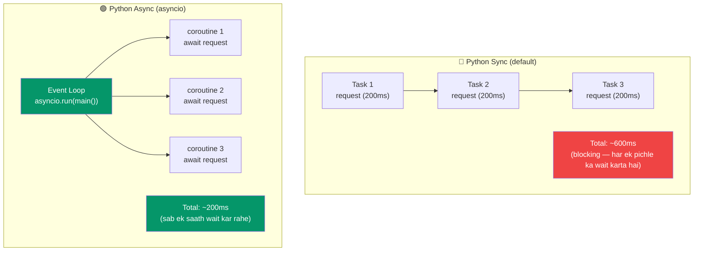

# Async/Await in Python

## Node.js se Sabse Bada Mindset Shift

Ye chapter ek Node.js developer ke liye **sabse important hai**. Kyun? Kyunki dono languages ka async model bilkul ulta hai:

| Aspect | Node.js | Python |
|---|---|---|
| Default mode | **Async** — sab kuch non-blocking | **Sync** — sab kuch blocking |
| Event loop | Hamesha chalta rehta hai, runtime mein built-in | `asyncio.run()` se explicitly start karna padta hai |
| File I/O | Async by default (`fs.promises`) | Sync by default (`open()`) |
| HTTP server | Async by default (Express, Fastify) | Sync by default (Flask, Django) |
| Ecosystem | Ek hi duniya — sab async hai | **Do duniya** — sync aur async libraries alag |

Socho aise: Node.js mein tum ek async shehar mein rehte ho jahan sab non-blocking ho. Kabhi-kabhi sync kaam karte ho, lekin wo exception hai. Python mein ulta — tum ek sync duniya mein default rehte ho, aur jab zarurat padti hai tab async mode activate karte ho. Jaise IRCTC — normally slow process, par tatkal booking karte time fast ho jaata hai.



---

## Basic Syntax: Jaana Pehchana Ilaka

Syntax level pe good news — JavaScript se **almost same** hi hai:

```python
import asyncio

async def fetch_data(url: str) -> dict:
    print(f"Fetching {url}...")
    await asyncio.sleep(1)  # Network delay simulate kar rahe hain
    return {"url": url, "data": "some content"}

async def main():
    result = await fetch_data("https://api.example.com")
    print(result)

# Event loop ko explicitly start karna PADEGA
asyncio.run(main())
```

```javascript
// JavaScript — almost identical syntax
async function fetchData(url) {
  console.log(`Fetching ${url}...`);
  await new Promise((resolve) => setTimeout(resolve, 1000));
  return { url, data: "some content" };
}

// Event loop pehle se hi chal raha hai — bas call karo
const result = await fetchData("https://api.example.com");
console.log(result);
```

### Farak yaha hai: `asyncio.run()`

Node.js mein event loop hamesha background mein chalta rehta hai — jaise Zomato ka delivery system jo 24x7 ready rehta hai chahe koi order aaye ya na aaye. Python mein tumhe khud ye "system" chalu karna padta hai:

```python
import asyncio

async def main():
    print("Hello from async Python!")

# Ye entry point hai — event loop start karta hai, main() run karta hai, phir band kar deta hai
asyncio.run(main())

# Normal .py file mein top-level pe direct await nahi kar sakte
# await main()  # SyntaxError! Ye kahega "mere andar kaunsa loop chala raha hai?"

# (Python 3.12+ ka REPL aur Jupyter notebooks top-level await support karte hain)
```

---

## Coroutines Ko Samjho

Jab tum `async def` wala function call karte ho, wo turant execute nahi hota. Ek **coroutine object** return hota hai. Ye JavaScript se bilkul different hai, jahan async function call karte hi execution start ho jaata hai aur Promise milta hai.

Socho ek Swiggy order ki tarah — order place karna (function call) matlab khana turant table pe nahi aa jaata. Pehle ek "order tracking object" milta hai (coroutine). Jab tak tum us pe "wait" (await) nahi karoge, khana banna shuru hi nahi hoga. Aur jo coroutine banao lekin await nahi karo, vo ek "pending order" ki tarah hang jaata hai.

```python
async def greet(name: str) -> str:
    return f"Hello, {name}"

# Ye function body ko EXECUTE NAHI karta!
coro = greet("Alice")
print(type(coro))  # <class 'coroutine'>

# Result paane ke liye await karna zaruri hai
async def main():
    result = await greet("Alice")
    print(result)  # "Hello, Alice"

asyncio.run(main())
```

```javascript
// JavaScript — async function call karte hi execution start ho jaata hai
const promise = greet("Alice"); // Pehle se hi chal raha hai!
console.log(typeof promise); // 'object' (Promise)
const result = await promise; // Bas completion ka wait
```

> [!info]
> **Key difference**: Python coroutines lazy hote hain — tab tak execution nahi hoti jab tak explicitly await nahi karte. JavaScript promises eager hote hain — call karte hi chalne lagta hai.

---

## `asyncio.sleep()` vs `setTimeout`

```python
import asyncio

async def delayed_greet(name: str, delay: float) -> str:
    await asyncio.sleep(delay)  # Non-blocking sleep
    return f"Hello, {name}!"

# Async code mein time.sleep() KABHI use mat karo — ye event loop ko PURA block kar deta hai!
import time

async def BAD_example():
    time.sleep(5)  # Poore event loop ko 5 second ke liye ROOK deta hai!
    # Is dauraan kuch aur kaam nahi chal sakta

async def GOOD_example():
    await asyncio.sleep(5)  # Non-blocking — baaki tasks chalte reh sakte hain
```

> [!warning]
> `time.sleep()` aur `asyncio.sleep()` dikhne mein similar lagte hain lekin bilkul different hain. `time.sleep()` ek restaurant ko lock-down kar deta hai jab tak ek order nahi ban jaata — puri team band baithta hai. `asyncio.sleep()` sirf ye kehta hai "mujhe abhi kuch nahi karna, tab tak doosre orders handle karo, main baad mein resume kar lunga".

```javascript
// JavaScript equivalent
function sleep(ms) {
  return new Promise((resolve) => setTimeout(resolve, ms));
}

async function delayedGreet(name, delay) {
  await sleep(delay * 1000);
  return `Hello, ${name}!`;
}
```

---

## Multiple Coroutines Chalana

### Sequential Execution

Ye waise hi hai jaise IRCTC pe ek-ek karke 3 tatkal tickets book karna — pehli ticket confirm hone ka wait, phir doosri, phir teesri. Bohot time waste hota hai:

```python
import asyncio
import time

async def fetch(url: str) -> str:
    print(f"  Fetching {url}")
    await asyncio.sleep(1)
    return f"Data from {url}"

async def main():
    start = time.time()

    # Sequential — har ek pichle wale ka wait karta hai
    r1 = await fetch("https://api1.example.com")
    r2 = await fetch("https://api2.example.com")
    r3 = await fetch("https://api3.example.com")

    print(f"Total: {time.time() - start:.1f}s")  # ~3.0s (3 ka wait!)
    print(r1, r2, r3)

asyncio.run(main())
```

### Concurrent Execution with `asyncio.gather()`

Ab teeno requests ek saath bhejo — jaise ek saath 3 alag Zomato restaurants se order dena, jo pehle ready ho use le lena:

```python
async def main():
    start = time.time()

    # Concurrent — sab ek saath chalte hain
    r1, r2, r3 = await asyncio.gather(
        fetch("https://api1.example.com"),
        fetch("https://api2.example.com"),
        fetch("https://api3.example.com"),
    )

    print(f"Total: {time.time() - start:.1f}s")  # ~1.0s (3x faster!)
    print(r1, r2, r3)

asyncio.run(main())
```

```javascript
// JavaScript equivalent — Promise.all se similar
const [r1, r2, r3] = await Promise.all([
  fetch("https://api1.example.com"),
  fetch("https://api2.example.com"),
  fetch("https://api3.example.com"),
]);
```

---

## Tasks: Fire and (Optionally) Forget

`asyncio.create_task()` ek coroutine ko background mein turant chalu kar deta hai — kuch-kuch JavaScript mein async function ko bina await kiye call karne jaisa, sirf Python wala version zyada safe aur controllable hai.

Socho ek dabbawala ki tarah — tum use tiffin (task) de dete ho aur vo delivery ke liye nikal jaata hai. Tum apna doosra kaam karte raho. Jab zarurat ho tabhi check karo "delivery hui ya nahi" (await task).

```python
import asyncio

async def background_job(name: str) -> None:
    print(f"Starting {name}")
    await asyncio.sleep(2)
    print(f"Finished {name}")

async def main():
    # Task create karo — background mein turant chalna shuru ho jaata hai
    task1 = asyncio.create_task(background_job("job1"))
    task2 = asyncio.create_task(background_job("job2"))

    # Tasks chalte rehne do, tab tak apna kaam karo
    print("Doing other work...")
    await asyncio.sleep(1)
    print("Still working...")

    # Ab tasks complete hone ka wait karo
    await task1
    await task2
    print("All done!")

asyncio.run(main())
```

```javascript
// JavaScript — similar concept
async function main() {
  const promise1 = backgroundJob("job1"); // Start ho gaya, await nahi kiya
  const promise2 = backgroundJob("job2"); // Start ho gaya, await nahi kiya

  console.log("Doing other work...");
  await sleep(1000);

  await promise1;
  await promise2;
}
```

### Task Cancellation

Kabhi-kabhi task ko mid-way mein cancel karna padta hai. Jaise Zomato se order cancel karna:

```python
async def long_running():
    try:
        while True:
            print("Working...")
            await asyncio.sleep(1)
    except asyncio.CancelledError:
        print("Task was cancelled — cleaning up")
        raise  # Task ko properly "cancelled" mark karne ke liye re-raise karo

async def main():
    task = asyncio.create_task(long_running())

    await asyncio.sleep(3)
    task.cancel()  # Cancellation request bhejo

    try:
        await task
    except asyncio.CancelledError:
        print("Task confirmed cancelled")

asyncio.run(main())
```

---

## Async HTTP with `aiohttp`

Node.js mein `fetch` built-in aur async hota hai. Python mein standard `requests` library **sync** hai. Async HTTP ke liye tumhe `aiohttp` chahiye:

```bash
pip install aiohttp
```

```python
import aiohttp
import asyncio

async def fetch_json(url: str) -> dict:
    async with aiohttp.ClientSession() as session:
        async with session.get(url) as response:
            return await response.json()

async def main():
    # Sequential
    data1 = await fetch_json("https://jsonplaceholder.typicode.com/posts/1")

    # Concurrent — 5 URLs ek saath fetch karo
    urls = [f"https://jsonplaceholder.typicode.com/posts/{i}" for i in range(1, 6)]

    async with aiohttp.ClientSession() as session:
        tasks = [session.get(url) for url in urls]
        responses = await asyncio.gather(*tasks)
        data = [await r.json() for r in responses]

    print(f"Fetched {len(data)} posts")

asyncio.run(main())
```

```javascript
// JavaScript equivalent — kaafi simple hai kyunki fetch built-in hai
const data1 = await fetch("https://jsonplaceholder.typicode.com/posts/1").then(
  (r) => r.json()
);

const urls = Array.from({ length: 5 }, (_, i) => `...posts/${i + 1}`);
const data = await Promise.all(urls.map((url) => fetch(url).then((r) => r.json())));
```

### POST requests with aiohttp

```python
async def create_post(title: str, body: str) -> dict:
    async with aiohttp.ClientSession() as session:
        payload = {"title": title, "body": body, "userId": 1}
        async with session.post(
            "https://jsonplaceholder.typicode.com/posts",
            json=payload,
            headers={"Content-Type": "application/json"},
        ) as response:
            return await response.json()
```

---

## "Do Duniya" Wali Problem (Colored Functions)

Ye Python async ka **sabse bada pain point** hai. Node.js mein sab ek hi async language bolte hain — sab promise/async functions compatible hote hain. Python mein sync aur async do **alag duniyayein** hain — jaise UPI aur cash payment system: dono paise transfer karte hain, lekin ek dusre ke saath direct compatible nahi hain, beech mein "bridge" chahiye hota hai.

```python
# SYNC duniya
import requests

def get_user_sync(id: int) -> dict:
    response = requests.get(f"https://api.example.com/users/{id}")
    return response.json()

# ASYNC duniya
import aiohttp

async def get_user_async(id: int) -> dict:
    async with aiohttp.ClientSession() as session:
        async with session.get(f"https://api.example.com/users/{id}") as resp:
            return await resp.json()

# Problem: dono ko aasani se mix nahi kar sakte!
async def process_user():
    # Async function ke andar sync blocking function seedha call nahi kar sakte
    user = get_user_sync(1)  # BAD: event loop ko block kar deta hai

    # Async version hi use karna padega
    user = await get_user_async(1)  # GOOD

def sync_function():
    # Sync function ke andar await nahi kar sakte
    user = await get_user_async(1)  # SyntaxError!

    # Iske liye ek naya event loop start karna padega
    user = asyncio.run(get_user_async(1))  # Naya loop banata hai (hamesha possible nahi)
```

### Bridge: Sync Code ko Async Context Mein Chalana

Jab tum kisi sync library ko async code mein use karna chahte ho, thread pool mein dalo taaki main event loop block na ho:

```python
import asyncio
import requests

def blocking_fetch(url: str) -> str:
    """Sync function jo blocking hai."""
    response = requests.get(url)
    return response.text

async def main():
    # Blocking code ko thread pool mein chalao taaki event loop block na ho
    loop = asyncio.get_event_loop()
    result = await loop.run_in_executor(
        None,  # Default ThreadPoolExecutor use karo
        blocking_fetch,
        "https://example.com",
    )
    print(f"Got {len(result)} chars")

asyncio.run(main())
```

### Library Duplication

Isi "do duniya" problem ki wajah se Python mein har cheez ka duplicate library hai — sync aur async dono versions:

| Sync Library | Async Library |
|---|---|
| `requests` | `aiohttp`, `httpx` |
| `psycopg2` | `asyncpg` |
| `redis-py` | `aioredis` |
| `sqlite3` | `aiosqlite` |
| `Flask` | `FastAPI`, `Starlette` |
| `Django` | `Django (async views, 3.1+)` |

> [!tip]
> **`httpx` special hai** — ye BOTH sync aur async support karta hai, same API ke saath:
> ```python
> import httpx
>
> # Sync
> response = httpx.get("https://example.com")
>
> # Async
> async with httpx.AsyncClient() as client:
>     response = await client.get("https://example.com")
> ```

---

## Async Generators

Regular generators jaise hi, bas `await` version:

```python
import asyncio

async def async_range(start: int, stop: int, delay: float = 0.1):
    """Async generator — delay ke saath values yield karta hai."""
    for i in range(start, stop):
        await asyncio.sleep(delay)
        yield i

async def main():
    # async for use karke consume karo
    async for num in async_range(0, 5, 0.5):
        print(num)

asyncio.run(main())
```

```javascript
// JavaScript equivalent
async function* asyncRange(start, stop, delay = 100) {
  for (let i = start; i < stop; i++) {
    await new Promise((r) => setTimeout(r, delay));
    yield i;
  }
}

for await (const num of asyncRange(0, 5, 500)) {
  console.log(num);
}
```

### Real-World: Async Data Stream

Ye Flipkart jaise kisi API se page-by-page products fetch karne jaisa — har page aane pe process karo, sab pages ek saath memory mein load karne ki zarurat nahi:

```python
import asyncio
import aiohttp

async def fetch_pages(base_url: str, max_pages: int = 100):
    """Async generator jo paginated API data fetch karta hai."""
    async with aiohttp.ClientSession() as session:
        for page in range(1, max_pages + 1):
            url = f"{base_url}?page={page}"
            async with session.get(url) as response:
                data = await response.json()

                if not data["results"]:
                    return  # Aur pages nahi hain

                yield data["results"]

async def main():
    async for page_items in fetch_pages("https://api.example.com/items"):
        for item in page_items:
            process(item)
```

---

## Error Handling in Async Code

Error handling sync jaisa hi hai, lekin async tasks ke saath zyada careful rehna padta hai:

```python
import asyncio

async def might_fail(name: str) -> str:
    await asyncio.sleep(0.5)
    if name == "bad":
        raise ValueError(f"Bad input: {name}")
    return f"Success: {name}"

async def main():
    # Basic try/except — sync jaisa hi hai
    try:
        result = await might_fail("bad")
    except ValueError as e:
        print(f"Caught: {e}")

    # gather() ke saath error handling
    results = await asyncio.gather(
        might_fail("good"),
        might_fail("bad"),
        might_fail("also_good"),
        return_exceptions=True,  # Raise mat karo, exceptions ko values ki tarah return karo
    )

    for result in results:
        if isinstance(result, Exception):
            print(f"Error: {result}")
        else:
            print(f"OK: {result}")

asyncio.run(main())
```

```javascript
// JavaScript equivalent — Promise.allSettled better approach
const results = await Promise.allSettled([
  mightFail("good"),
  mightFail("bad"),
  mightFail("also_good"),
]);

results.forEach((result) => {
  if (result.status === "rejected") {
    console.log(`Error: ${result.reason}`);
  } else {
    console.log(`OK: ${result.value}`);
  }
});
```

---

## Python Mein Async Kab Use Karein

### Async use karo jab:
- Web server bana rahe ho jo bohot saare concurrent connections handle karey (FastAPI, Starlette)
- Ek saath bohot saari HTTP requests bhejni ho
- WebSockets ke saath kaam kar rahe ho (real-time communication)
- Chat server ya real-time system bana rahe ho
- I/O-bound tasks hain jinme high concurrency chahiye

### Sync pe hi tike raho jab:
- Simple scripts likh rahe ho
- CPU-bound processing hai (threads ya multiprocessing better hai)
- Aisi libraries use kar rahe ho jo sync-only hain
- Concurrency ki zarurat kam hai
- CLI tools bana rahe ho
- Data science / ML ka kaam hai

### The Python Way

```python
# Ek web scraper ke liye jo 100 URLs hit karega:
# Node.js dev ka instinct: "sab kuch async bana do!"
# Python approach: use case pe depend karta hai

# Option 1: Simple script, 5 URLs scrape karni hain
# Bas requests (sync) use karo. Simple rehta hai, performance concern nahi.
import requests
for url in urls:
    response = requests.get(url)
    process(response)

# Option 2: 100 URLs fast scrape karni hain
# Concurrency ke liye async use karo
import aiohttp
import asyncio

async def scrape_all(urls):
    async with aiohttp.ClientSession() as session:
        tasks = [session.get(url) for url in urls]
        return await asyncio.gather(*tasks)

# Option 3: Web server jo hazaaron requests handle karega
# FastAPI (async framework) use karo
from fastapi import FastAPI
app = FastAPI()

@app.get("/data")
async def get_data():
    result = await fetch_from_db()
    return result
```

---

## Node.js Developers ke Liye Common Pitfalls

### 1. `asyncio.run()` bhool jaana

```python
# Galat — kuch nahi hota
async def main():
    print("Hello")

main()  # Coroutine object return karta hai, execute nahi karta!

# Sahi
asyncio.run(main())
```

### 2. Event Loop ko Block Karna

```python
# Galat — loop block ho jaata hai, doosre tasks ruk jaate hain
async def handler(request):
    data = requests.get("https://api.example.com")  # BLOCKING!
    return data.json()

# Sahi #1 — async HTTP client use karo
async def handler(request):
    async with aiohttp.ClientSession() as session:
        async with session.get("https://api.example.com") as resp:
            return await resp.json()

# Sahi #2 — ya blocking code ko executor mein chalao
async def handler(request):
    loop = asyncio.get_event_loop()
    data = await loop.run_in_executor(None, requests.get, "https://api.example.com")
    return data.json()
```

### 3. Multiple Event Loops Create Karna

```python
# Galat — asyncio.run() ko nest nahi kar sakte
async def inner():
    return 42

async def outer():
    result = asyncio.run(inner())  # ERROR! Loop already running hai

# Sahi
async def outer():
    result = await inner()
```

### 4. Coroutines Ko Await Na Karna

```python
# Galat — coroutine banaya lekin kabhi await nahi kiya
async def main():
    fetch_data("https://api.example.com")  # RuntimeWarning: coroutine was never awaited

# Sahi
async def main():
    await fetch_data("https://api.example.com")
    # Ya background execution chahiye to task banao
    task = asyncio.create_task(fetch_data("https://api.example.com"))
```

---

## Practice Exercises

### Exercise 1: Async Fetcher
Ek async function likho jo:
- URLs ki ek list le
- Sabko `aiohttp` se concurrently fetch kare
- Results ko input URLs ke same order mein return kare
- Configurable concurrency limit ho (ek time pe max N requests)
- Individual failures ko gracefully handle kare (failed URLs ke liye None return kare)

### Exercise 2: Async Cache
Ek async key-value cache banao jisme ho:
- `async get(key) -> value | None`
- `async set(key, value, ttl_seconds) -> None`
- Purani entries ka automatic expiration
- `asyncio.sleep()` se slow storage simulate karo

### Exercise 3: Sync Ko Async Mein Convert Karo
Ye synchronous code lo aur async mein convert karo:
```python
import requests
import time

def get_pokemon(name: str) -> dict:
    response = requests.get(f"https://pokeapi.co/api/v2/pokemon/{name}")
    return response.json()

def main():
    pokemon_names = ["pikachu", "charizard", "bulbasaur", "squirtle", "eevee"]
    start = time.time()
    results = [get_pokemon(name) for name in pokemon_names]
    elapsed = time.time() - start
    for r in results:
        print(f"{r['name']}: {r['weight']}")
    print(f"Time: {elapsed:.2f}s")

main()
```

### Exercise 4: Async Pipeline
Ek async data processing pipeline banao:
1. Ek async generator jo paginated API se items produce kare
2. Ek async filter jo sirf condition match karne wale items rakhe
3. Ek async transformer jo har item ko additional data se enrich kare
4. Ek consumer jo final results ko process kare

Inko `async for` use karke chain karo.

### Exercise 5: Sync-Async Bridge
Ek utility function `run_sync_in_async(func, *args)` likho jo:
- Ek synchronous (blocking) function aur uske arguments le
- Use thread pool executor mein chalaye
- Result ko awaitable ki tarah return kare
- Exceptions ko properly handle kare

Phir iska ulta likho: `run_async_in_sync(coro)` jo synchronous code se ek async coroutine ko safely chala sake.
