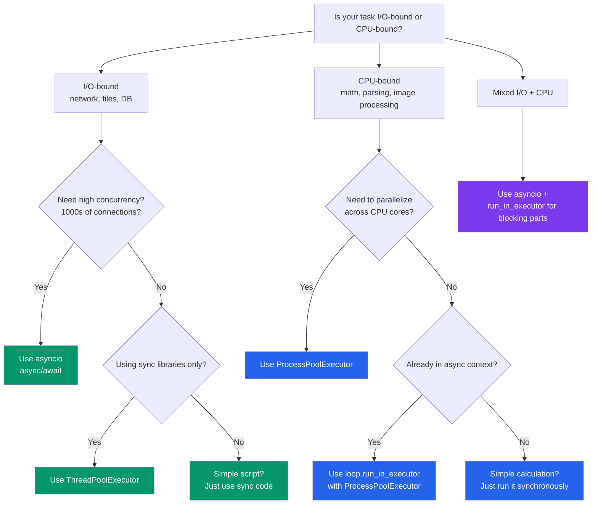

# Concurrency in Python

## GIL, Threads, Processes — aur Node.js se comparison

Ye chapter Python ke concurrency model ko explain karta hai — jo Node.js se sabse bada architectural difference hai. Agar tumhe Python mein performant code likhna hai, to ye samajhna zaruri hai.

---

## Global Interpreter Lock (GIL)

Kya hota hai? GIL ek mutex hai jo Python objects ko access karne ke liye lock laga deta hai — matlab ek time pe sirf **ek** thread hi Python bytecode execute kar sakta hai. Yahi wo cheez hai jo Python ko Node.js se sabse zyada alag banati hai.

Socho GIL ek akela cashier hai jo Zomato ke ek hi kitchen counter pe baitha hai — kitne bhi order aa jaayein, ek time pe wo sirf ek order hi process karega. Baaki sab line mein khade rahenge.

```
Node.js Model:
  Single thread, async I/O, no parallel JS execution
  Worker threads for CPU-bound (separate V8 isolates)

Python Model:
  GIL prevents true parallel PYTHON execution in threads
  But threads CAN run during I/O operations
  Multiprocessing bypasses the GIL entirely
```

### GIL practically ka matlab kya hai?

```python
import threading
import time

counter = 0

def increment(n: int) -> None:
    global counter
    for _ in range(n):
        counter += 1

# Two threads, each incrementing 1M times
t1 = threading.Thread(target=increment, args=(1_000_000,))
t2 = threading.Thread(target=increment, args=(1_000_000,))

start = time.time()
t1.start(); t2.start()
t1.join(); t2.join()
elapsed = time.time() - start

print(f"Counter: {counter}")   # NOT 2,000,000! Race condition.
print(f"Time: {elapsed:.2f}s") # Might be SLOWER than single-threaded
```

Do threads mila ke bhi 2 million ka answer nahi aayega — kyunki `counter += 1` ek atomic operation nahi hai, aur GIL ke hote hue bhi threads beech-beech mein switch hoti rehti hain. Result: classic race condition. Aur ulta, do threads lagane ke baad time **kam nahi**, kabhi-kabhi **zyada** ho sakta hai — kyunki thread switching ka bhi overhead hota hai.

### GIL Summary

| Scenario | GIL Impact | Solution |
|---|---|---|
| I/O-bound (HTTP, files, DB) | I/O wait ke time GIL release ho jaata hai | Threads ya asyncio use karo |
| CPU-bound (math, parsing) | GIL parallelism ko block karta hai | Multiprocessing use karo |
| Mixed (I/O + CPU) | Ratio pe depend karta hai | Dono approach combine karo |

> [!info]
> **Python 3.13+ note**: PEP 703 ek experimental free-threaded mode laata hai (`python -X nogil`) jo GIL hata deta hai. Abhi ye experimental hai, lekin future direction yahi hai.

---

## Threading: Concurrent (Parallel Nahi)

Python ke threads real OS threads hote hain, lekin GIL ki wajah se ek time pe sirf ek hi Python code execute karta hai. Lekin achi baat ye hai — I/O operations ke time GIL release ho jaata hai, isliye I/O-bound kaam ke liye threads bahut kaam ke hain.

Isko aise socho: jab Swiggy ka delivery partner restaurant mein order ka wait kar raha hai (I/O wait), tab wo apna phone check kar sakta hai ya doosra kaam nikal sakta hai. Lekin jab wo actually bike chala raha hai (CPU-bound kaam), tab wo sirf ek hi cheez kar sakta hai.

### Basic Threading

```python
import threading
import time

def download(url: str) -> str:
    """Simulated I/O-bound operation."""
    print(f"[{threading.current_thread().name}] Downloading {url}")
    time.sleep(1)  # GIL is released during sleep (simulating I/O)
    return f"Data from {url}"

# Create and start threads
threads = []
for i in range(5):
    t = threading.Thread(
        target=download,
        args=(f"https://api.example.com/data/{i}",),
        name=f"worker-{i}",
    )
    threads.append(t)
    t.start()

# Wait for all to complete
for t in threads:
    t.join()

print("All downloads complete")
# Total time: ~1s (concurrent), not 5s (sequential)
```

```javascript
// Node.js equivalent (much simpler because async is native)
const promises = Array.from({ length: 5 }, (_, i) =>
  fetch(`https://api.example.com/data/${i}`)
);
await Promise.all(promises);
```

Dekho Node.js mein ye kitna natural lagta hai — kyunki async waisa hi built-in hai. Python mein thread manually banana padta hai, `start()` karna padta hai, aur `join()` se wait karna padta hai. Thoda zyada boilerplate hai, lekin kaam wahi hota hai.

### Thread Synchronization

Jab multiple threads ek hi shared data ko touch karte hain (jaise wahi `counter` wala example upar), to race condition se bachne ke liye lock lagana padta hai — bilkul waise jaise IRCTC ka Tatkal booking system ek seat ko ek time pe sirf ek user ko allot karta hai.

```python
import threading

class SafeCounter:
    """Thread-safe counter using a Lock."""

    def __init__(self) -> None:
        self._value = 0
        self._lock = threading.Lock()

    def increment(self) -> None:
        with self._lock:  # Acquire lock, auto-release on exit
            self._value += 1

    @property
    def value(self) -> int:
        with self._lock:
            return self._value

# Thread-safe queue (built-in!)
from queue import Queue

def worker(q: Queue) -> None:
    while True:
        item = q.get()  # Blocks until item available
        if item is None:
            break
        print(f"Processing {item}")
        q.task_done()

q: Queue[str | None] = Queue()

# Start workers
threads = [threading.Thread(target=worker, args=(q,)) for _ in range(3)]
for t in threads:
    t.start()

# Add work
for item in range(10):
    q.put(f"task-{item}")

# Signal workers to stop
for _ in threads:
    q.put(None)

for t in threads:
    t.join()
```

> [!tip]
> `queue.Queue` already thread-safe hai — khud se lock lagane ki zarurat nahi. Producer-consumer pattern ke liye ye Python ka go-to tool hai.

---

## Multiprocessing: True Parallelism

Kya hota hai? Multiprocessing alag-alag Python **processes** spawn karta hai, aur har process ka apna alag GIL hota hai. Isliye CPU-bound kaam ke liye Python ka jawaab yahi hai.

Ye aise samjho jaise Zomato ne ek hi cashier rakhne ke bajaye har kitchen station pe alag chef laga diya — ab sab chefs ek saath, parallel mein kaam kar sakte hain, ek doosre ka wait kiye bina.

```python
import multiprocessing
import time

def cpu_intensive(n: int) -> int:
    """Simulate CPU-bound work."""
    total = 0
    for i in range(n):
        total += i * i
    return total

# Sequential: uses one CPU core
start = time.time()
results = [cpu_intensive(10_000_000) for _ in range(4)]
print(f"Sequential: {time.time() - start:.2f}s")

# Parallel: uses multiple CPU cores
start = time.time()
with multiprocessing.Pool(processes=4) as pool:
    results = pool.map(cpu_intensive, [10_000_000] * 4)
print(f"Parallel: {time.time() - start:.2f}s")
# About 4x faster on a 4-core machine!
```

```javascript
// Node.js equivalent -- worker_threads
const { Worker, isMainThread, workerData } = require("worker_threads");

if (isMainThread) {
  const workers = Array.from(
    { length: 4 },
    () =>
      new Promise((resolve) => {
        const w = new Worker(__filename, { workerData: 10_000_000 });
        w.on("message", resolve);
      })
  );
  const results = await Promise.all(workers);
} else {
  // Worker thread
  const result = cpuIntensive(workerData);
  parentPort.postMessage(result);
}
```

### Processes ke beech data share karna

Alag-alag processes ka apna-apna memory space hota hai (thread jaisa shared nahi), isliye data share karne ke liye special mechanism chahiye — jaise do alag branches ke bank employees ko baat karne ke liye phone call (IPC) chahiye hota hai, seedha table se paper pass nahi kar sakte.

```python
import multiprocessing

# Shared memory (limited to simple types)
counter = multiprocessing.Value("i", 0)  # shared integer
lock = multiprocessing.Lock()

def increment_shared(counter, lock, n: int) -> None:
    for _ in range(n):
        with lock:
            counter.value += 1

processes = []
for _ in range(4):
    p = multiprocessing.Process(
        target=increment_shared,
        args=(counter, lock, 250_000),
    )
    processes.append(p)
    p.start()

for p in processes:
    p.join()

print(f"Counter: {counter.value}")  # 1,000,000

# Shared array
arr = multiprocessing.Array("d", [0.0, 0.0, 0.0])  # shared array of doubles

# Manager for more complex shared objects
manager = multiprocessing.Manager()
shared_dict = manager.dict()
shared_list = manager.list()
```

---

## `concurrent.futures`: High-Level API

`concurrent.futures` threads aur processes dono ke liye ek unified interface deta hai. Zyada tar cases mein yahi **recommended** approach hai — kyunki low-level `threading`/`multiprocessing` khud handle karne se ye zyada clean hai.

### ThreadPoolExecutor

```python
from concurrent.futures import ThreadPoolExecutor, as_completed
import time

def fetch_url(url: str) -> dict:
    """Simulate I/O-bound work."""
    time.sleep(1)
    return {"url": url, "status": 200}

urls = [f"https://api.example.com/page/{i}" for i in range(10)]

# Using ThreadPoolExecutor as a context manager
with ThreadPoolExecutor(max_workers=5) as executor:
    # Submit all tasks
    futures = {executor.submit(fetch_url, url): url for url in urls}

    # Process results as they complete
    for future in as_completed(futures):
        url = futures[future]
        try:
            result = future.result()
            print(f"Got {result['status']} from {url}")
        except Exception as e:
            print(f"Error fetching {url}: {e}")

# Simpler: map() for ordered results
with ThreadPoolExecutor(max_workers=5) as executor:
    results = list(executor.map(fetch_url, urls))
    for result in results:
        print(result)
```

### ProcessPoolExecutor

```python
from concurrent.futures import ProcessPoolExecutor
import math

def is_prime(n: int) -> bool:
    """CPU-bound work."""
    if n < 2:
        return False
    for i in range(2, int(math.sqrt(n)) + 1):
        if n % i == 0:
            return False
    return True

numbers = [112272535095293, 112582705942171, 112272535095293,
           115280095190773, 115797848077099, 1099726899285419]

# Parallel prime checking
with ProcessPoolExecutor() as executor:
    results = list(executor.map(is_prime, numbers))

for num, is_p in zip(numbers, results):
    print(f"{num}: {'prime' if is_p else 'not prime'}")
```

### `executor.map()` vs `executor.submit()`

`map()` seedha-saada hai — order maintain hoti hai, bas list pakdao aur result list wapas mil jaayegi. `submit()` zyada control deta hai — jo pehle complete ho jaaye, wo pehle process kar sakte ho, order ki chinta nahi.

```python
from concurrent.futures import ThreadPoolExecutor, as_completed

# map() -- ordered results, simple API
with ThreadPoolExecutor(max_workers=5) as ex:
    results = ex.map(process, items)  # Results in input order

# submit() -- unordered, more control
with ThreadPoolExecutor(max_workers=5) as ex:
    futures = [ex.submit(process, item) for item in items]

    # Process as completed (faster than waiting in order)
    for future in as_completed(futures):
        result = future.result()
        print(result)
```

---

## Asyncio ko Threads/Processes ke saath combine karna

### Async context mein blocking code chalana

Jab tumhare paas koi purani sync library ho (jo `await` support nahi karti), to usse async code ke andar chalane ke liye thread pool mein daalna padta hai — jaise ek naya intern jo abhi tak company ka nayi Slack-based workflow nahi seekha, use ek alag chhoti team mein daal ke kaam le lo, baaki team ka flow disturb nahi hota.

```python
import asyncio
from concurrent.futures import ThreadPoolExecutor
import requests  # Sync library

async def fetch_with_threads(urls: list[str]) -> list[str]:
    """Use threads to run sync HTTP library in async context."""
    loop = asyncio.get_event_loop()

    with ThreadPoolExecutor(max_workers=10) as executor:
        # run_in_executor wraps blocking calls as awaitables
        tasks = [
            loop.run_in_executor(executor, requests.get, url)
            for url in urls
        ]
        responses = await asyncio.gather(*tasks)

    return [r.text for r in responses]

# asyncio.to_thread() -- simpler syntax (Python 3.9+)
async def fetch_one(url: str) -> str:
    response = await asyncio.to_thread(requests.get, url)
    return response.text
```

### Async context mein CPU-bound kaam chalana

```python
import asyncio
from concurrent.futures import ProcessPoolExecutor

def cpu_work(data: list[int]) -> int:
    """CPU-bound computation."""
    return sum(x * x for x in data)

async def process_data(chunks: list[list[int]]) -> list[int]:
    loop = asyncio.get_event_loop()

    with ProcessPoolExecutor() as executor:
        tasks = [
            loop.run_in_executor(executor, cpu_work, chunk)
            for chunk in chunks
        ]
        return await asyncio.gather(*tasks)

async def main():
    data = [list(range(i * 1000, (i + 1) * 1000)) for i in range(10)]
    results = await process_data(data)
    print(f"Results: {results}")

asyncio.run(main())
```

---

## Decision Matrix: Kab Kya Use Karein



### Comparison Table

| Approach | Best For | Parallelism | Overhead | Communication |
|---|---|---|---|---|
| `asyncio` | I/O-bound, bahut saari connections | Concurrent, parallel nahi | Kam | Easy (shared memory) |
| `threading` | I/O-bound, blocking libs | Concurrent (GIL limited) | Medium | Shared memory (locks use karo) |
| `multiprocessing` | CPU-bound | True parallel | Zyada | IPC (pickle, queues) |
| `ThreadPoolExecutor` | I/O-bound, simple API chahiye | Concurrent | Medium | Futures |
| `ProcessPoolExecutor` | CPU-bound, simple API chahiye | True parallel | Zyada | Futures (pickle) |

### Node.js se Comparison

| Python | Node.js Equivalent |
|---|---|
| `asyncio` | Built-in event loop (default) |
| `threading.Thread` | Koi direct equivalent nahi (sab kuch async hi hai) |
| `multiprocessing.Process` | `worker_threads.Worker` |
| `ThreadPoolExecutor` | `node:worker_threads` pool |
| `ProcessPoolExecutor` | `child_process.fork()` |
| GIL | V8 isolate per thread (similar effect) |

---

## Real-World Example: Web Scraper

Ye ek achha example hai jahan I/O-bound (page fetch karna) aur CPU-bound (HTML parse karna) dono kaam ek saath ho rahe hain — bilkul Swiggy jaisa: order fetch karna (I/O) alag kaam hai, aur bill calculate + invoice generate karna (CPU) alag kaam hai.

```python
import asyncio
import aiohttp
from concurrent.futures import ProcessPoolExecutor
from bs4 import BeautifulSoup
import time

# CPU-bound: parsing HTML (runs in separate process)
def parse_html(html: str) -> dict:
    soup = BeautifulSoup(html, "html.parser")
    return {
        "title": soup.title.string if soup.title else "",
        "links": len(soup.find_all("a")),
        "paragraphs": len(soup.find_all("p")),
    }

# I/O-bound: fetching pages (runs async)
async def fetch_page(session: aiohttp.ClientSession, url: str) -> str:
    async with session.get(url) as response:
        return await response.text()

async def scrape(urls: list[str]) -> list[dict]:
    results = []
    process_pool = ProcessPoolExecutor(max_workers=4)
    loop = asyncio.get_event_loop()

    async with aiohttp.ClientSession() as session:
        # Fetch all pages concurrently (I/O-bound -> async)
        sem = asyncio.Semaphore(20)

        async def fetch_limited(url):
            async with sem:
                return await fetch_page(session, url)

        pages = await asyncio.gather(*[fetch_limited(url) for url in urls])

        # Parse all pages in parallel (CPU-bound -> processes)
        parse_tasks = [
            loop.run_in_executor(process_pool, parse_html, page)
            for page in pages
        ]
        results = await asyncio.gather(*parse_tasks)

    process_pool.shutdown()
    return results

async def main():
    urls = [f"https://example.com/page/{i}" for i in range(100)]
    start = time.time()
    results = await scrape(urls)
    elapsed = time.time() - start
    print(f"Scraped {len(results)} pages in {elapsed:.2f}s")

# asyncio.run(main())
```

---

## Thread Safety Patterns

### Thread-Local Storage

Kya hota hai? Har thread ko apna alag "personal locker" mil jaata hai — ek thread jo data usme rakhega, doosri thread usse dekh nahi payegi. Database connection jaisi cheezon ke liye perfect hai, jinhe thread ke beech share nahi karna chahiye.

```python
import threading

# Thread-local data -- each thread gets its own copy
thread_local = threading.local()

def get_db_connection():
    if not hasattr(thread_local, "connection"):
        thread_local.connection = create_connection()
    return thread_local.connection

def worker():
    conn = get_db_connection()  # Each thread gets its own connection
    conn.execute("SELECT ...")
```

### Condition Variables

Producer-consumer pattern ka classic solution — jaise dabbawala system: agar dabba bhar chuka hai to naya producer wait karega (`not_full`), aur agar dabba khaali hai to consumer wait karega (`not_empty`), jab tak signal na mile.

```python
import threading
from collections import deque

class BoundedBuffer:
    def __init__(self, capacity: int) -> None:
        self.buffer: deque = deque(maxlen=capacity)
        self.capacity = capacity
        self.lock = threading.Lock()
        self.not_empty = threading.Condition(self.lock)
        self.not_full = threading.Condition(self.lock)

    def put(self, item) -> None:
        with self.not_full:
            while len(self.buffer) >= self.capacity:
                self.not_full.wait()  # Wait until space available
            self.buffer.append(item)
            self.not_empty.notify()  # Signal consumers

    def get(self):
        with self.not_empty:
            while len(self.buffer) == 0:
                self.not_empty.wait()  # Wait until item available
            item = self.buffer.popleft()
            self.not_full.notify()  # Signal producers
            return item
```

> [!warning]
> Locks, threads aur processes ke saath kaam karte waqt hamesha `with` statement use karo (context manager) — warna deadlock ya resource leak hone ka risk rehta hai.

---

## Practice Exercises

### Exercise 1: Thread Pool Downloader
Ek file downloader banao jo:
- URLs ki list le
- `ThreadPoolExecutor` use karke files concurrently download kare
- Concurrent downloads ko N tak limit kare
- Progress dikhaye (kitni files complete hui / total)
- Failed downloads ko 3 baar tak retry kare

### Exercise 2: Parallel Data Processing
Ek badi CSV file di gayi hai (generated data se simulate karo):
1. File read karo (I/O-bound — threads use karo)
2. Har chunk ko parse/transform karo (CPU-bound — processes use karo)
3. Result output file mein likho (I/O-bound — threads use karo)
`ThreadPoolExecutor` aur `ProcessPoolExecutor` dono combine karo.

### Exercise 3: Producer-Consumer with Threads
Ek multi-threaded image processing pipeline banao:
- Producer: ek directory se image file paths padhta hai
- Stage 1 workers (3 threads): disk se images load karte hain (I/O-bound)
- Stage 2 workers (CPU count jitne processes): resize/transform karte hain (CPU-bound)
- Consumer: processed images ko save karta hai (I/O-bound)
Stages ke beech `queue.Queue` use karo.

### Exercise 4: Async + Threads Integration
Ek async web server endpoint banao jo:
- URLs ki list aur computation type wala request receive kare
- Saare URLs concurrently fetch kare (asyncio)
- Response data ko process pool mein process kare (CPU-bound)
- Aggregated results return kare

### Exercise 5: Benchmark
Ek benchmark likho jo execution time compare kare:
1. Sequential execution
2. Threading (2, 4, 8 threads)
3. Multiprocessing (2, 4, 8 processes)
4. Asyncio

I/O-bound (`time.sleep` / `asyncio.sleep` se simulate karo) aur CPU-bound (fibonacci calculation) — dono workloads ke liye. Results ko formatted table mein dikhao.

## Key Takeaways

- GIL ek time pe sirf ek thread ko Python bytecode chalane deta hai — isliye threads CPU-bound kaam mein parallel nahi hoti.
- I/O operations (network, file, DB) ke time GIL release ho jaata hai — isliye I/O-bound kaam ke liye threading/asyncio bahut effective hai.
- CPU-bound kaam (heavy math, parsing) ke liye `multiprocessing` use karo — har process ka apna GIL hota hai, to true parallelism milta hai.
- `concurrent.futures` (`ThreadPoolExecutor`, `ProcessPoolExecutor`) high-level, recommended API hai — low-level `threading`/`multiprocessing` se zyada clean.
- Async code ke andar blocking/sync calls daalne ke liye `loop.run_in_executor()` ya `asyncio.to_thread()` use karo.
- Shared mutable state (jaise counter) ko hamesha `Lock` se protect karo, warna race conditions guaranteed hain.
- Node.js mein "sab kuch async" hota hai by default; Python mein tumhe explicitly decide karna padta hai — I/O-bound ke liye asyncio/threads, CPU-bound ke liye multiprocessing.
