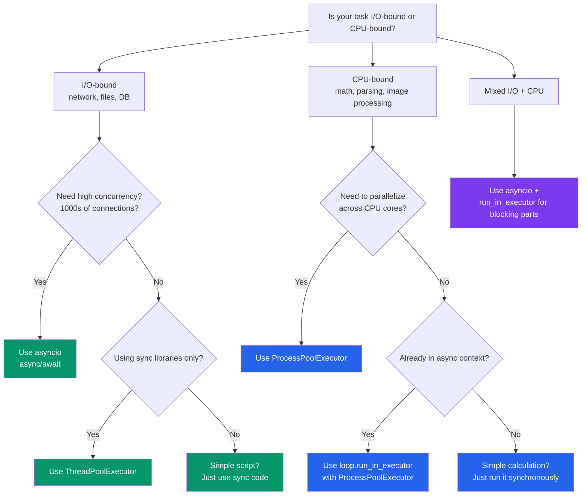

# Concurrency in Python

## The GIL, Threads, Processes, and How They Compare to Node.js

This chapter explains Python's concurrency model -- the biggest architectural difference from Node.js. Understanding this is critical for writing performant Python code.

---

## The Global Interpreter Lock (GIL)

The GIL is a mutex that protects access to Python objects, preventing multiple threads from executing Python bytecode simultaneously. This is **THE** key difference from Node.js.

```
Node.js Model:
  Single thread, async I/O, no parallel JS execution
  Worker threads for CPU-bound (separate V8 isolates)

Python Model:
  GIL prevents true parallel PYTHON execution in threads
  But threads CAN run during I/O operations
  Multiprocessing bypasses the GIL entirely
```

### What the GIL Means in Practice

```python
import threading
import time

counter = 0

def increment(n: int) -> None:
    global counter
    for _ in range(n):
        counter += 1

# Two threads, each incrementing 1M times
t1 = threading.Thread(target=increment, args=(1_000_000,))
t2 = threading.Thread(target=increment, args=(1_000_000,))

start = time.time()
t1.start(); t2.start()
t1.join(); t2.join()
elapsed = time.time() - start

print(f"Counter: {counter}")   # NOT 2,000,000! Race condition.
print(f"Time: {elapsed:.2f}s") # Might be SLOWER than single-threaded
```

### GIL Summary

| Scenario | GIL Impact | Solution |
|---|---|---|
| I/O-bound (HTTP, files, DB) | GIL released during I/O waits | Use threads or asyncio |
| CPU-bound (math, parsing) | GIL blocks parallelism | Use multiprocessing |
| Mixed (I/O + CPU) | Depends on ratio | Combine approaches |

> **Python 3.13+ note**: PEP 703 introduces an experimental free-threaded mode (`python -X nogil`) that removes the GIL. This is still experimental but represents the future direction.

---

## Threading: Concurrent (Not Parallel)

Python threads are real OS threads, but the GIL means only one executes Python code at a time. However, the GIL is released during I/O operations, making threads excellent for I/O-bound tasks.

### Basic Threading

```python
import threading
import time

def download(url: str) -> str:
    """Simulated I/O-bound operation."""
    print(f"[{threading.current_thread().name}] Downloading {url}")
    time.sleep(1)  # GIL is released during sleep (simulating I/O)
    return f"Data from {url}"

# Create and start threads
threads = []
for i in range(5):
    t = threading.Thread(
        target=download,
        args=(f"https://api.example.com/data/{i}",),
        name=f"worker-{i}",
    )
    threads.append(t)
    t.start()

# Wait for all to complete
for t in threads:
    t.join()

print("All downloads complete")
# Total time: ~1s (concurrent), not 5s (sequential)
```

```javascript
// Node.js equivalent (much simpler because async is native)
const promises = Array.from({ length: 5 }, (_, i) =>
  fetch(`https://api.example.com/data/${i}`)
);
await Promise.all(promises);
```

### Thread Synchronization

```python
import threading

class SafeCounter:
    """Thread-safe counter using a Lock."""

    def __init__(self) -> None:
        self._value = 0
        self._lock = threading.Lock()

    def increment(self) -> None:
        with self._lock:  # Acquire lock, auto-release on exit
            self._value += 1

    @property
    def value(self) -> int:
        with self._lock:
            return self._value

# Thread-safe queue (built-in!)
from queue import Queue

def worker(q: Queue) -> None:
    while True:
        item = q.get()  # Blocks until item available
        if item is None:
            break
        print(f"Processing {item}")
        q.task_done()

q: Queue[str | None] = Queue()

# Start workers
threads = [threading.Thread(target=worker, args=(q,)) for _ in range(3)]
for t in threads:
    t.start()

# Add work
for item in range(10):
    q.put(f"task-{item}")

# Signal workers to stop
for _ in threads:
    q.put(None)

for t in threads:
    t.join()
```

---

## Multiprocessing: True Parallelism

Multiprocessing spawns separate Python processes, each with its own GIL. This is Python's answer for CPU-bound work.

```python
import multiprocessing
import time

def cpu_intensive(n: int) -> int:
    """Simulate CPU-bound work."""
    total = 0
    for i in range(n):
        total += i * i
    return total

# Sequential: uses one CPU core
start = time.time()
results = [cpu_intensive(10_000_000) for _ in range(4)]
print(f"Sequential: {time.time() - start:.2f}s")

# Parallel: uses multiple CPU cores
start = time.time()
with multiprocessing.Pool(processes=4) as pool:
    results = pool.map(cpu_intensive, [10_000_000] * 4)
print(f"Parallel: {time.time() - start:.2f}s")
# About 4x faster on a 4-core machine!
```

```javascript
// Node.js equivalent -- worker_threads
const { Worker, isMainThread, workerData } = require("worker_threads");

if (isMainThread) {
  const workers = Array.from(
    { length: 4 },
    () =>
      new Promise((resolve) => {
        const w = new Worker(__filename, { workerData: 10_000_000 });
        w.on("message", resolve);
      })
  );
  const results = await Promise.all(workers);
} else {
  // Worker thread
  const result = cpuIntensive(workerData);
  parentPort.postMessage(result);
}
```

### Sharing Data Between Processes

```python
import multiprocessing

# Shared memory (limited to simple types)
counter = multiprocessing.Value("i", 0)  # shared integer
lock = multiprocessing.Lock()

def increment_shared(counter, lock, n: int) -> None:
    for _ in range(n):
        with lock:
            counter.value += 1

processes = []
for _ in range(4):
    p = multiprocessing.Process(
        target=increment_shared,
        args=(counter, lock, 250_000),
    )
    processes.append(p)
    p.start()

for p in processes:
    p.join()

print(f"Counter: {counter.value}")  # 1,000,000

# Shared array
arr = multiprocessing.Array("d", [0.0, 0.0, 0.0])  # shared array of doubles

# Manager for more complex shared objects
manager = multiprocessing.Manager()
shared_dict = manager.dict()
shared_list = manager.list()
```

---

## `concurrent.futures`: The High-Level API

`concurrent.futures` provides a unified interface for both threads and processes. This is the **recommended** approach for most use cases.

### ThreadPoolExecutor

```python
from concurrent.futures import ThreadPoolExecutor, as_completed
import time

def fetch_url(url: str) -> dict:
    """Simulate I/O-bound work."""
    time.sleep(1)
    return {"url": url, "status": 200}

urls = [f"https://api.example.com/page/{i}" for i in range(10)]

# Using ThreadPoolExecutor as a context manager
with ThreadPoolExecutor(max_workers=5) as executor:
    # Submit all tasks
    futures = {executor.submit(fetch_url, url): url for url in urls}

    # Process results as they complete
    for future in as_completed(futures):
        url = futures[future]
        try:
            result = future.result()
            print(f"Got {result['status']} from {url}")
        except Exception as e:
            print(f"Error fetching {url}: {e}")

# Simpler: map() for ordered results
with ThreadPoolExecutor(max_workers=5) as executor:
    results = list(executor.map(fetch_url, urls))
    for result in results:
        print(result)
```

### ProcessPoolExecutor

```python
from concurrent.futures import ProcessPoolExecutor
import math

def is_prime(n: int) -> bool:
    """CPU-bound work."""
    if n < 2:
        return False
    for i in range(2, int(math.sqrt(n)) + 1):
        if n % i == 0:
            return False
    return True

numbers = [112272535095293, 112582705942171, 112272535095293,
           115280095190773, 115797848077099, 1099726899285419]

# Parallel prime checking
with ProcessPoolExecutor() as executor:
    results = list(executor.map(is_prime, numbers))

for num, is_p in zip(numbers, results):
    print(f"{num}: {'prime' if is_p else 'not prime'}")
```

### `executor.map()` vs `executor.submit()`

```python
from concurrent.futures import ThreadPoolExecutor, as_completed

# map() -- ordered results, simple API
with ThreadPoolExecutor(max_workers=5) as ex:
    results = ex.map(process, items)  # Results in input order

# submit() -- unordered, more control
with ThreadPoolExecutor(max_workers=5) as ex:
    futures = [ex.submit(process, item) for item in items]

    # Process as completed (faster than waiting in order)
    for future in as_completed(futures):
        result = future.result()
        print(result)
```

---

## Combining Asyncio with Threads/Processes

### Running Blocking Code in Async Context

```python
import asyncio
from concurrent.futures import ThreadPoolExecutor
import requests  # Sync library

async def fetch_with_threads(urls: list[str]) -> list[str]:
    """Use threads to run sync HTTP library in async context."""
    loop = asyncio.get_event_loop()

    with ThreadPoolExecutor(max_workers=10) as executor:
        # run_in_executor wraps blocking calls as awaitables
        tasks = [
            loop.run_in_executor(executor, requests.get, url)
            for url in urls
        ]
        responses = await asyncio.gather(*tasks)

    return [r.text for r in responses]

# asyncio.to_thread() -- simpler syntax (Python 3.9+)
async def fetch_one(url: str) -> str:
    response = await asyncio.to_thread(requests.get, url)
    return response.text
```

### Running CPU-Bound Work in Async Context

```python
import asyncio
from concurrent.futures import ProcessPoolExecutor

def cpu_work(data: list[int]) -> int:
    """CPU-bound computation."""
    return sum(x * x for x in data)

async def process_data(chunks: list[list[int]]) -> list[int]:
    loop = asyncio.get_event_loop()

    with ProcessPoolExecutor() as executor:
        tasks = [
            loop.run_in_executor(executor, cpu_work, chunk)
            for chunk in chunks
        ]
        return await asyncio.gather(*tasks)

async def main():
    data = [list(range(i * 1000, (i + 1) * 1000)) for i in range(10)]
    results = await process_data(data)
    print(f"Results: {results}")

asyncio.run(main())
```

---

## Decision Matrix: When to Use What



### Comparison Table

| Approach | Best For | Parallelism | Overhead | Communication |
|---|---|---|---|---|
| `asyncio` | I/O-bound, many connections | Concurrent, not parallel | Low | Easy (shared memory) |
| `threading` | I/O-bound, blocking libs | Concurrent (GIL limited) | Medium | Shared memory (use locks) |
| `multiprocessing` | CPU-bound | True parallel | High | IPC (pickle, queues) |
| `ThreadPoolExecutor` | I/O-bound with simple API | Concurrent | Medium | Futures |
| `ProcessPoolExecutor` | CPU-bound with simple API | True parallel | High | Futures (pickle) |

### Compared to Node.js

| Python | Node.js Equivalent |
|---|---|
| `asyncio` | Built-in event loop (default) |
| `threading.Thread` | No direct equivalent (everything is async) |
| `multiprocessing.Process` | `worker_threads.Worker` |
| `ThreadPoolExecutor` | `node:worker_threads` pool |
| `ProcessPoolExecutor` | `child_process.fork()` |
| GIL | V8 isolate per thread (similar effect) |

---

## Real-World Example: Web Scraper

```python
import asyncio
import aiohttp
from concurrent.futures import ProcessPoolExecutor
from bs4 import BeautifulSoup
import time

# CPU-bound: parsing HTML (runs in separate process)
def parse_html(html: str) -> dict:
    soup = BeautifulSoup(html, "html.parser")
    return {
        "title": soup.title.string if soup.title else "",
        "links": len(soup.find_all("a")),
        "paragraphs": len(soup.find_all("p")),
    }

# I/O-bound: fetching pages (runs async)
async def fetch_page(session: aiohttp.ClientSession, url: str) -> str:
    async with session.get(url) as response:
        return await response.text()

async def scrape(urls: list[str]) -> list[dict]:
    results = []
    process_pool = ProcessPoolExecutor(max_workers=4)
    loop = asyncio.get_event_loop()

    async with aiohttp.ClientSession() as session:
        # Fetch all pages concurrently (I/O-bound -> async)
        sem = asyncio.Semaphore(20)

        async def fetch_limited(url):
            async with sem:
                return await fetch_page(session, url)

        pages = await asyncio.gather(*[fetch_limited(url) for url in urls])

        # Parse all pages in parallel (CPU-bound -> processes)
        parse_tasks = [
            loop.run_in_executor(process_pool, parse_html, page)
            for page in pages
        ]
        results = await asyncio.gather(*parse_tasks)

    process_pool.shutdown()
    return results

async def main():
    urls = [f"https://example.com/page/{i}" for i in range(100)]
    start = time.time()
    results = await scrape(urls)
    elapsed = time.time() - start
    print(f"Scraped {len(results)} pages in {elapsed:.2f}s")

# asyncio.run(main())
```

---

## Thread Safety Patterns

### Thread-Local Storage

```python
import threading

# Thread-local data -- each thread gets its own copy
thread_local = threading.local()

def get_db_connection():
    if not hasattr(thread_local, "connection"):
        thread_local.connection = create_connection()
    return thread_local.connection

def worker():
    conn = get_db_connection()  # Each thread gets its own connection
    conn.execute("SELECT ...")
```

### Condition Variables

```python
import threading
from collections import deque

class BoundedBuffer:
    def __init__(self, capacity: int) -> None:
        self.buffer: deque = deque(maxlen=capacity)
        self.capacity = capacity
        self.lock = threading.Lock()
        self.not_empty = threading.Condition(self.lock)
        self.not_full = threading.Condition(self.lock)

    def put(self, item) -> None:
        with self.not_full:
            while len(self.buffer) >= self.capacity:
                self.not_full.wait()  # Wait until space available
            self.buffer.append(item)
            self.not_empty.notify()  # Signal consumers

    def get(self):
        with self.not_empty:
            while len(self.buffer) == 0:
                self.not_empty.wait()  # Wait until item available
            item = self.buffer.popleft()
            self.not_full.notify()  # Signal producers
            return item
```

---

## Practice Exercises

### Exercise 1: Thread Pool Downloader
Build a file downloader that:
- Takes a list of URLs
- Downloads files concurrently using `ThreadPoolExecutor`
- Limits concurrent downloads to N
- Shows progress (files completed / total)
- Retries failed downloads up to 3 times

### Exercise 2: Parallel Data Processing
Given a large CSV file (simulate with generated data):
1. Read the file (I/O-bound -- use threads)
2. Parse/transform each chunk (CPU-bound -- use processes)
3. Write results to output file (I/O-bound -- use threads)
Combine `ThreadPoolExecutor` and `ProcessPoolExecutor`.

### Exercise 3: Producer-Consumer with Threads
Implement a multi-threaded image processing pipeline:
- Producer: reads image file paths from a directory
- Stage 1 workers (3 threads): load images from disk (I/O-bound)
- Stage 2 workers (CPU count processes): resize/transform (CPU-bound)
- Consumer: saves processed images (I/O-bound)
Use `queue.Queue` between stages.

### Exercise 4: Async + Threads Integration
Build an async web server endpoint that:
- Receives a request with a list of URLs and a computation type
- Fetches all URLs concurrently (asyncio)
- Processes the response data in a process pool (CPU-bound)
- Returns aggregated results

### Exercise 5: Benchmark
Write a benchmark that compares execution time for:
1. Sequential execution
2. Threading (2, 4, 8 threads)
3. Multiprocessing (2, 4, 8 processes)
4. Asyncio

For both I/O-bound (simulated with `time.sleep` / `asyncio.sleep`) and CPU-bound (fibonacci calculation) workloads. Display results in a formatted table.
