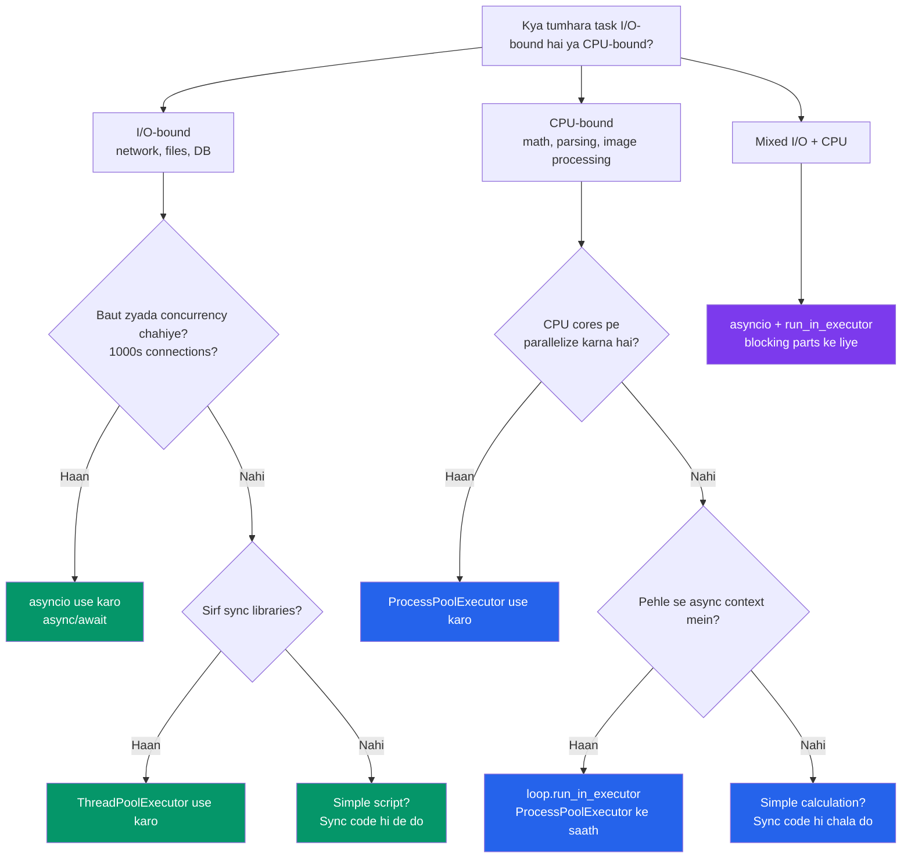

# Python mein Concurrency

## GIL, Threads, Processes — aur Node.js se comparison

Ye chapter Python ke concurrency model ko samjhata hai — jo Node.js se sabse bada architectural difference hai. Agar tumhe Python mein performant code likhna hai, to ye samajhna bilkul zaroori hai.

---

## Global Interpreter Lock (GIL)

Kya hota hai? GIL ek mutex lock hai jo Python objects ko access karne ke liye lagta hai — matlab ek time pe sirf **ek** thread hi Python bytecode execute kar sakta hai. Yahi wo cheez hai jo Python ko Node.js se sabse zyada alag banati hai.

Socho GIL ek akela cashier ki tarah hai Zomato ke kitchen counter pe — kitne bhi orders line mein khade ho, ek time pe sirf ek order hi process hoga. Baaki sab intezaar karte rahenege.

```
Node.js Model:
  ✓ Single thread, async I/O by default
  ✓ Worker threads ke liye alag V8 isolates (no shared memory)
  ✗ Real parallelism challenging hai

Python Model:
  ✗ GIL se true parallel Python execution nahi ho sakta threads mein
  ✓ Lekin I/O operations ke time GIL release ho jaata hai
  ✓ Multiprocessing se GIL bilkul bypass ho sakta hai
```

### GIL practically ka matlab kya hai?

```python
import threading
import time

counter = 0

def increment(n: int) -> None:
    global counter
    for _ in range(n):
        counter += 1

# Do threads, har ek 1 million bar count badhayenge
t1 = threading.Thread(target=increment, args=(1_000_000,))
t2 = threading.Thread(target=increment, args=(1_000_000,))

start = time.time()
t1.start(); t2.start()
t1.join(); t2.join()
elapsed = time.time() - start

print(f"Counter: {counter}")   # 2,000,000 nahi aayega! Race condition.
print(f"Time: {elapsed:.2f}s") # Aur time zyada lag sakta hai
```

Do threads mila ke bhi `counter` 2 million nahi hoga — kyunki `counter += 1` ek atomic operation nahi hai, aur GIL ke hote hue bhi threads beech mein switch hoti rehti hain. Nataija: classic race condition. Aur ulta, do threads lagne ke baad time **kam nahi**, alag-alag **zyada** ho sakta hai — kyunki thread switching ka bhi CPU overhead hota hai.

### GIL ka Summary

| Scenario | GIL ka asar | Solution |
|---|---|---|
| I/O-bound (HTTP, files, DB) | I/O ke wait ke time GIL release | Threads ya asyncio use karo |
| CPU-bound (math, parsing) | GIL parallelism ko block karta hai | Multiprocessing use karo |
| Mixed (I/O + CPU) | Ratio aur timing pe depend | Dono approach combine karo |

> [!info]
> **Python 3.13+ note**: PEP 703 ek experimental "nogil mode" laata hai (`python -X nogil`) jo GIL hata deta hai. Abhi experimental hai, lekin ye hi future direction hai.

---

## Threading: Concurrent (Parallel Nahi)

Python ke threads real OS threads hote hain, lekin GIL ki wajah se ek time pe sirf ek hi Python code execute hota hai. Lekin achi baat ye hai — I/O operations ke time GIL release ho jaata hai, isliye I/O-bound kaam ke liye threads bahut kaam ke hain.

Isko aise socho: jab Swiggy ka delivery partner restaurant mein order ka wait kar raha hai (I/O wait), tab wo apna phone check kar sakta hai ya doosra kaam nikal sakta hai. Lekin jab wo actually bike chala raha hai (CPU-bound kaam), tab wo sirf ek cheez hi kar sakta hai.

### Basic Threading

```python
import threading
import time

def download(url: str) -> str:
    """Simulated I/O-bound operation."""
    print(f"[{threading.current_thread().name}] Downloading {url}")
    time.sleep(1)  # GIL release hoti hai sleep ke time (I/O simulate)
    return f"Data from {url}"

# 5 threads create karo
threads = []
for i in range(5):
    t = threading.Thread(
        target=download,
        args=(f"https://api.example.com/data/{i}",),
        name=f"worker-{i}",
    )
    threads.append(t)
    t.start()

# Sabke complete hone ka wait karo
for t in threads:
    t.join()

print("All downloads complete")
# Total time: ~1s (concurrent), 5s nahi (sequential)
```

```javascript
// Node.js mein equivalent (bilkul simple)
const promises = Array.from({ length: 5 }, (_, i) =>
  fetch(`https://api.example.com/data/${i}`)
);
await Promise.all(promises);
```

Dekho Node.js mein ye kitna natural lagta hai — kyunki async waisa hi built-in hai language mein. Python mein thread manually banana padta hai, `start()` karna padta hai, aur `join()` se wait karna padta hai. Thoda zyada boilerplate hai, lekin kaam wahi hota hai.

### Thread Synchronization — Race Conditions se Bachna

Jab multiple threads ek hi shared data ko touch karte hain (jaise wahi `counter` wala example), to race condition se bachne ke liye lock lagana padta hai — bilkul waise jaise IRCTC ka Tatkal booking system ek seat ko ek time pe sirf ek user ko allot karta hai.

```python
import threading

class SafeCounter:
    """Thread-safe counter using Lock."""

    def __init__(self) -> None:
        self._value = 0
        self._lock = threading.Lock()

    def increment(self) -> None:
        with self._lock:  # Lock le, context exit pe auto-release
            self._value += 1

    @property
    def value(self) -> int:
        with self._lock:
            return self._value

# Thread-safe queue (built-in!)
from queue import Queue

def worker(q: Queue) -> None:
    while True:
        item = q.get()  # Jab tak item available nahi, block rahega
        if item is None:
            break
        print(f"Processing {item}")
        q.task_done()

q: Queue[str | None] = Queue()

# 3 workers start karo
threads = [threading.Thread(target=worker, args=(q,)) for _ in range(3)]
for t in threads:
    t.start()

# Work queue mein daalo
for item in range(10):
    q.put(f"task-{item}")

# Workers ko signal do ki bas karo
for _ in threads:
    q.put(None)

for t in threads:
    t.join()
```

> [!tip]
> `queue.Queue` already thread-safe hai — khud se lock lagane ki zarurat nahi. Producer-consumer pattern ke liye ye Python ka best tool hai.

---

## Multiprocessing: Sach Mein Parallel

Kya hota hai? Multiprocessing alag-alag Python **processes** spawn karta hai, aur har process ka apna alag GIL hota hai. Isliye CPU-bound kaam ke liye Python ka jawaab yahi hai.

Ye aise samjho: jaise Zomato ne ek hi cashier rakhne ke bajaye har kitchen station pe alag-alag chef laga diya — ab sab chefs ek saath, parallel mein kaam kar sakte hain, ek doosre ka wait kiye bina.

```python
import multiprocessing
import time

def cpu_intensive(n: int) -> int:
    """CPU-bound kaam simulate karo."""
    total = 0
    for i in range(n):
        total += i * i
    return total

# Sequential: ek hi CPU core use hota hai
start = time.time()
results = [cpu_intensive(10_000_000) for _ in range(4)]
print(f"Sequential: {time.time() - start:.2f}s")

# Parallel: sab CPU cores use honge
start = time.time()
with multiprocessing.Pool(processes=4) as pool:
    results = pool.map(cpu_intensive, [10_000_000] * 4)
print(f"Parallel: {time.time() - start:.2f}s")
# 4 cores wale machine pe ~4x faster!
```

```javascript
// Node.js equivalent -- worker_threads
const { Worker, isMainThread, workerData } = require("worker_threads");

if (isMainThread) {
  const workers = Array.from(
    { length: 4 },
    () =>
      new Promise((resolve) => {
        const w = new Worker(__filename, { workerData: 10_000_000 });
        w.on("message", resolve);
      })
  );
  const results = await Promise.all(workers);
} else {
  // Worker thread mein
  const result = cpuIntensive(workerData);
  parentPort.postMessage(result);
}
```

### Processes ke beech data share karna

Alag-alag processes ka apna-apna memory space hota hai (threads jaisa shared nahi), isliye data share karne ke liye special mechanism chahiye — jaise do alag bank branches ke employees ko baat karne ke liye phone call (IPC) chahiye, seedha table se paper pass nahi kar sakte.

```python
import multiprocessing

# Shared memory (sirf simple types ke liye)
counter = multiprocessing.Value("i", 0)  # shared integer
lock = multiprocessing.Lock()

def increment_shared(counter, lock, n: int) -> None:
    for _ in range(n):
        with lock:
            counter.value += 1

processes = []
for _ in range(4):
    p = multiprocessing.Process(
        target=increment_shared,
        args=(counter, lock, 250_000),
    )
    processes.append(p)
    p.start()

for p in processes:
    p.join()

print(f"Counter: {counter.value}")  # 1,000,000

# Shared array bhi bana sakte ho
arr = multiprocessing.Array("d", [0.0, 0.0, 0.0])  # shared doubles

# Manager ke through complex objects share karo
manager = multiprocessing.Manager()
shared_dict = manager.dict()
shared_list = manager.list()
```

---

## `concurrent.futures`: High-Level API

`concurrent.futures` threads aur processes dono ke liye ek unified interface deta hai. Zyada tar cases mein **yahi recommended** approach hai — kyunki low-level `threading`/`multiprocessing` khud manage karne se ye zyada clean aur readable hota hai.

### ThreadPoolExecutor

```python
from concurrent.futures import ThreadPoolExecutor, as_completed
import time

def fetch_url(url: str) -> dict:
    """I/O-bound kaam simulate karo."""
    time.sleep(1)
    return {"url": url, "status": 200}

urls = [f"https://api.example.com/page/{i}" for i in range(10)]

# ThreadPoolExecutor context manager ke saath use karo
with ThreadPoolExecutor(max_workers=5) as executor:
    # Sab tasks submit karo
    futures = {executor.submit(fetch_url, url): url for url in urls}

    # Results ko use karo jaise-jaise complete ho
    for future in as_completed(futures):
        url = futures[future]
        try:
            result = future.result()
            print(f"Got {result['status']} from {url}")
        except Exception as e:
            print(f"Error fetching {url}: {e}")

# Simpler: map() use karo agar order important hai
with ThreadPoolExecutor(max_workers=5) as executor:
    results = list(executor.map(fetch_url, urls))
    for result in results:
        print(result)
```

### ProcessPoolExecutor

```python
from concurrent.futures import ProcessPoolExecutor
import math

def is_prime(n: int) -> bool:
    """CPU-bound kaam."""
    if n < 2:
        return False
    for i in range(2, int(math.sqrt(n)) + 1):
        if n % i == 0:
            return False
    return True

numbers = [112272535095293, 112582705942171, 112272535095293,
           115280095190773, 115797848077099, 1099726899285419]

# Parallel mein prime check karo
with ProcessPoolExecutor() as executor:
    results = list(executor.map(is_prime, numbers))

for num, is_p in zip(numbers, results):
    print(f"{num}: {'prime' if is_p else 'not prime'}")
```

### `executor.map()` vs `executor.submit()`

`map()` seedha-saada hai — order maintain hoti hai, bas list pakdao aur result list wapas mil jaayegi. `submit()` zyada control deta hai — jo pehle complete ho jaaye, wo pehle process kar sakte ho, order ki chinta nahi.

```python
from concurrent.futures import ThreadPoolExecutor, as_completed

# map() -- ordered results, simple API
with ThreadPoolExecutor(max_workers=5) as ex:
    results = ex.map(process, items)  # Results input order mein

# submit() -- unordered, zyada control
with ThreadPoolExecutor(max_workers=5) as ex:
    futures = [ex.submit(process, item) for item in items]

    # Jaise-jaise complete ho, process karo (waiting se pehle)
    for future in as_completed(futures):
        result = future.result()
        print(result)
```

---

## Asyncio ko Threads/Processes ke saath combine karna

### Async context mein blocking code chalana

Jab tumhare paas koi purani sync library ho (jo `await` support nahi karti), to usse async code ke andar chalane ke liye thread pool mein daalna padta hai — jaise ek naya intern jo abhi company ka nayi Slack-based workflow nahi seekha, use ek alag chhoti team mein daal ke kaam le lo, taaki baaki team ka flow disturb nahi ho.

```python
import asyncio
from concurrent.futures import ThreadPoolExecutor
import requests  # Ye sync library hai

async def fetch_with_threads(urls: list[str]) -> list[str]:
    """Threads use karke sync HTTP library ko async mein chalao."""
    loop = asyncio.get_event_loop()

    with ThreadPoolExecutor(max_workers=10) as executor:
        # run_in_executor blocking calls ko awaitables mein convert karta hai
        tasks = [
            loop.run_in_executor(executor, requests.get, url)
            for url in urls
        ]
        responses = await asyncio.gather(*tasks)

    return [r.text for r in responses]

# asyncio.to_thread() -- simpler syntax (Python 3.9+)
async def fetch_one(url: str) -> str:
    response = await asyncio.to_thread(requests.get, url)
    return response.text
```

### Async context mein CPU-bound kaam chalana

```python
import asyncio
from concurrent.futures import ProcessPoolExecutor

def cpu_work(data: list[int]) -> int:
    """CPU-bound computation."""
    return sum(x * x for x in data)

async def process_data(chunks: list[list[int]]) -> list[int]:
    loop = asyncio.get_event_loop()

    with ProcessPoolExecutor() as executor:
        tasks = [
            loop.run_in_executor(executor, cpu_work, chunk)
            for chunk in chunks
        ]
        return await asyncio.gather(*tasks)

async def main():
    data = [list(range(i * 1000, (i + 1) * 1000)) for i in range(10)]
    results = await process_data(data)
    print(f"Results: {results}")

asyncio.run(main())
```

---

## Decision Matrix: Kab Kya Use Karein



### Comparison Table

| Approach | Best Kaun Ke Liye? | Parallelism | Overhead | Communication |
|---|---|---|---|---|
| `asyncio` | I/O-bound, bahut saari connections | Concurrent, parallel nahi | Kam | Easy (shared memory) |
| `threading` | I/O-bound, blocking libs | Concurrent (GIL se limited) | Medium | Shared memory (locks) |
| `multiprocessing` | CPU-bound | Sach mein parallel | Zyada | IPC (pickle, queues) |
| `ThreadPoolExecutor` | I/O-bound, simple API | Concurrent | Medium | Futures |
| `ProcessPoolExecutor` | CPU-bound, simple API | Sach mein parallel | Zyada | Futures (pickle) |

### Node.js se Comparison

| Python | Node.js Equivalent |
|---|---|
| `asyncio` | Built-in event loop (default) |
| `threading.Thread` | Direct equivalent nahi hai (sab async hai) |
| `multiprocessing.Process` | `worker_threads.Worker` |
| `ThreadPoolExecutor` | `node:worker_threads` pool |
| `ProcessPoolExecutor` | `child_process.fork()` |
| GIL | V8 isolate per thread (similar effect) |

---

## Real-World Example: Web Scraper

Ye ek perfect example hai jahan I/O-bound (page fetch karna) aur CPU-bound (HTML parse karna) dono kaam ek saath ho rahe hain — bilkul Swiggy jaisa: order fetch karna (I/O) alag kaam hai, aur bill calculate + invoice generate karna (CPU) alag kaam hai.

```python
import asyncio
import aiohttp
from concurrent.futures import ProcessPoolExecutor
from bs4 import BeautifulSoup
import time

# CPU-bound: HTML parse karna (alag process mein chale)
def parse_html(html: str) -> dict:
    soup = BeautifulSoup(html, "html.parser")
    return {
        "title": soup.title.string if soup.title else "",
        "links": len(soup.find_all("a")),
        "paragraphs": len(soup.find_all("p")),
    }

# I/O-bound: pages fetch karna (async chale)
async def fetch_page(session: aiohttp.ClientSession, url: str) -> str:
    async with session.get(url) as response:
        return await response.text()

async def scrape(urls: list[str]) -> list[dict]:
    results = []
    process_pool = ProcessPoolExecutor(max_workers=4)
    loop = asyncio.get_event_loop()

    async with aiohttp.ClientSession() as session:
        # Concurrent mein sab pages fetch karo (I/O-bound -> async)
        sem = asyncio.Semaphore(20)

        async def fetch_limited(url):
            async with sem:
                return await fetch_page(session, url)

        pages = await asyncio.gather(*[fetch_limited(url) for url in urls])

        # Parallel mein sab pages parse karo (CPU-bound -> processes)
        parse_tasks = [
            loop.run_in_executor(process_pool, parse_html, page)
            for page in pages
        ]
        results = await asyncio.gather(*parse_tasks)

    process_pool.shutdown()
    return results

async def main():
    urls = [f"https://example.com/page/{i}" for i in range(100)]
    start = time.time()
    results = await scrape(urls)
    elapsed = time.time() - start
    print(f"Scraped {len(results)} pages in {elapsed:.2f}s")

# asyncio.run(main())
```

---

## Thread Safety Patterns

### Thread-Local Storage

Kya hota hai? Har thread ko apna alag "personal locker" mil jaata hai — ek thread jo data usme rakhega, doosri thread usse dekh nahi payegi. Database connection jaisi cheezon ke liye perfect hai, jinhe threads ke beech share nahi karna chahiye.

```python
import threading

# Thread-local data -- har thread ko apna copy milta hai
thread_local = threading.local()

def get_db_connection():
    if not hasattr(thread_local, "connection"):
        thread_local.connection = create_connection()
    return thread_local.connection

def worker():
    conn = get_db_connection()  # Har thread ko apna connection milta hai
    conn.execute("SELECT ...")
```

### Condition Variables

Producer-consumer pattern ka classic solution — jaise dabbawala system: agar dabba bhar chuka hai to producer wait karega (`not_full`), aur agar dabba khaali hai to consumer wait karega (`not_empty`), jab tak signal na mile.

```python
import threading
from collections import deque

class BoundedBuffer:
    def __init__(self, capacity: int) -> None:
        self.buffer: deque = deque(maxlen=capacity)
        self.capacity = capacity
        self.lock = threading.Lock()
        self.not_empty = threading.Condition(self.lock)
        self.not_full = threading.Condition(self.lock)

    def put(self, item) -> None:
        with self.not_full:
            while len(self.buffer) >= self.capacity:
                self.not_full.wait()  # Jab tak space na mile, wait karo
            self.buffer.append(item)
            self.not_empty.notify()  # Consumers ko signal de do

    def get(self):
        with self.not_empty:
            while len(self.buffer) == 0:
                self.not_empty.wait()  # Jab tak item na mile, wait karo
            item = self.buffer.popleft()
            self.not_full.notify()  # Producers ko signal de do
            return item
```

> [!warning]
> Locks, threads aur processes ke saath kaam karte waqt hamesha `with` statement use karo (context manager) — warna deadlock ya resource leak ho sakta hai.

---

## Practice Exercises

### Exercise 1: Thread Pool Downloader
Ek file downloader banao jo:
- URLs ki list le
- `ThreadPoolExecutor` use karke files concurrently download kare
- Concurrent downloads ko N tak limit kare
- Progress dikhaye (kitni files complete hui / total)
- Failed downloads ko 3 baar tak retry kare

### Exercise 2: Parallel Data Processing
Ek badi CSV file di gayi hai (generated data se simulate karo):
1. File read karo (I/O-bound — threads use karo)
2. Har chunk ko parse/transform karo (CPU-bound — processes use karo)
3. Result output file mein likho (I/O-bound — threads use karo)
`ThreadPoolExecutor` aur `ProcessPoolExecutor` dono combine karo.

### Exercise 3: Producer-Consumer with Threads
Ek multi-threaded image processing pipeline banao:
- Producer: ek directory se image file paths padhta hai
- Stage 1 workers (3 threads): disk se images load karte hain (I/O-bound)
- Stage 2 workers (CPU count jitne processes): resize/transform karte hain (CPU-bound)
- Consumer: processed images ko save karta hai (I/O-bound)
Stages ke beech `queue.Queue` use karo.

### Exercise 4: Async + Threads Integration
Ek async web server endpoint banao jo:
- URLs ki list aur computation type wala request receive kare
- Saare URLs concurrently fetch kare (asyncio)
- Response data ko process pool mein process kare (CPU-bound)
- Aggregated results return kare

### Exercise 5: Benchmark
Ek benchmark likho jo execution time compare kare:
1. Sequential execution
2. Threading (2, 4, 8 threads)
3. Multiprocessing (2, 4, 8 processes)
4. Asyncio

I/O-bound (`time.sleep` / `asyncio.sleep` se simulate karo) aur CPU-bound (fibonacci calculation) — dono workloads ke liye. Results ko formatted table mein dikhao.

## Key Takeaways

- **GIL**: Ek time pe sirf ek thread Python bytecode chalata hai — isliye threads CPU-bound kaam mein parallel nahi hoti.
- **I/O Operations**: Network, file, DB ke time GIL release ho jaata hai — isliye I/O-bound kaam ke liye threading/asyncio bahut effective hai.
- **CPU-bound kaam**: `multiprocessing` use karo — har process ka apna GIL hota hai, to true parallelism milta hai.
- **concurrent.futures**: `ThreadPoolExecutor` aur `ProcessPoolExecutor` high-level, recommended API hain — low-level `threading`/`multiprocessing` se zyada clean.
- **Async + blocking**: Async code ke andar blocking/sync calls daalne ke liye `loop.run_in_executor()` ya `asyncio.to_thread()` use karo.
- **Shared mutable state**: Hamesha `Lock` se protect karo, warna race conditions guaranteed hain.
- **Node.js vs Python**: Node.js mein "sab kuch async" hota hai by default; Python mein tumhe explicitly decide karna padta hai — I/O-bound ke liye asyncio/threads, CPU-bound ke liye multiprocessing.
