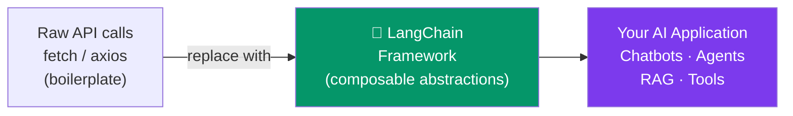

# 01 - Introduction to LangChain

## What Is LangChain?

LangChain is a framework for building applications powered by large language models (LLMs). If you have built Node.js backends that call the OpenAI or Anthropic API directly, LangChain is the layer on top that gives you composable abstractions for prompts, chains, agents, memory, and retrieval -- so you stop reinventing the same plumbing in every project.

Think of it the way Express sits on top of Node's `http` module: you *could* do everything yourself, but the framework removes boilerplate and enforces useful patterns.



---

## The LangChain Ecosystem

LangChain is not a single package. It is a family of packages, each with a focused responsibility.

| Package | Purpose |
|---|---|
| `langchain-core` | Base abstractions (Runnables, prompt templates, output parsers). Almost never installed directly -- other packages depend on it. |
| `langchain` | Higher-level chains, agents, and retrieval logic. |
| `langchain-community` | Third-party integrations maintained by the community (vector stores, document loaders, tools). |
| `langchain-openai` | Official OpenAI integration (ChatOpenAI, OpenAIEmbeddings). |
| `langchain-anthropic` | Official Anthropic integration (ChatAnthropic). |
| `langchain-chroma` | ChromaDB vector store integration. |
| `langgraph` | State-machine framework for building complex, stateful agents. |
| `langsmith` | Tracing, evaluation, and monitoring platform (SaaS + SDK). |

> **JS/TS developer note:** There *is* a `langchain` npm package (`langchain` on npm, docs at js.langchain.com). The JavaScript version mirrors many Python APIs, but Python is the primary implementation. New features land in Python first, the ecosystem of integrations is larger, and most tutorials and community examples are in Python. That is why Python is the recommended language for serious LangChain work.

---

## Core Concepts at a Glance

Before diving deep in later chapters, here is the mental map.

### Models
Wrappers around LLM providers (OpenAI, Anthropic, local models). They expose a uniform `.invoke()` interface regardless of which provider you use.

### Prompts
Templates that turn user input and context into the actual text sent to the model. Comparable to tagged template literals in JS, but with role-based message support and validation.

### Chains
Sequences of steps (prompt -> model -> parser) composed together. LangChain's Expression Language (LCEL) lets you pipe components with the `|` operator, similar to RxJS pipes.

### Agents
LLMs that can *decide* which tools to call and in what order. They loop: think -> act -> observe -> repeat.

### Memory
Mechanisms for maintaining conversation history across multiple turns. Ranges from "store everything" to "summarize old messages."

### Retrievers
Components that fetch relevant documents from a vector store or search index to feed into the LLM as context (the "R" in RAG).

---

## Installation

### Create a project and virtual environment

```bash
# Create a project directory
mkdir langchain-learning && cd langchain-learning

# Create virtual environment (like node_modules, but for Python)
python -m venv .venv

# Activate it
# Windows PowerShell:
.venv\Scripts\Activate.ps1
# macOS / Linux:
source .venv/bin/activate
```

### Install packages

```bash
# Core framework + OpenAI + Anthropic integrations
pip install langchain langchain-openai langchain-anthropic

# Common extras you will need soon
pip install langchain-community langchain-chroma

# For loading environment variables (like dotenv in Node.js)
pip install python-dotenv

# Save your dependencies (like package-lock.json)
pip freeze > requirements.txt
```

### Comparison with Node.js

| Node.js | Python |
|---|---|
| `npm init -y` | `python -m venv .venv` |
| `npm install` | `pip install -r requirements.txt` |
| `package.json` | `requirements.txt` or `pyproject.toml` |
| `node_modules/` | `.venv/lib/` |
| `.env` + `dotenv` | `.env` + `python-dotenv` |

---

## Environment Setup

### Create a `.env` file

```env
# .env -- NEVER commit this file
OPENAI_API_KEY=sk-proj-...
ANTHROPIC_API_KEY=sk-ant-...

# Optional: LangSmith tracing (covered in chapter 09)
LANGCHAIN_TRACING_V2=true
LANGCHAIN_API_KEY=lsv2_pt_...
LANGCHAIN_PROJECT=langchain-learning
```

### Load environment variables in Python

```python
# load_env.py
import os
from dotenv import load_dotenv

# Reads .env and sets values as environment variables
load_dotenv()

# Verify
print("OpenAI key loaded:", "OPENAI_API_KEY" in os.environ)
print("Anthropic key loaded:", "ANTHROPIC_API_KEY" in os.environ)
```

> **Node.js parallel:** This is exactly like `require('dotenv').config()` at the top of your `index.ts`. LangChain reads API keys from environment variables automatically -- you do not need to pass them to every constructor (though you can).

### Minimal "hello world"

```python
# hello_langchain.py
from dotenv import load_dotenv
load_dotenv()

from langchain_openai import ChatOpenAI

# Create a model instance (like `new OpenAI(...)` in the JS SDK)
model = ChatOpenAI(model="gpt-4o-mini", temperature=0)

# Invoke it with a simple string
response = model.invoke("Say hello in three languages.")
print(response.content)
```

Run it:

```bash
python hello_langchain.py
# Output: Hello! (English) | Hola! (Spanish) | Bonjour! (French)
```

### Using Anthropic instead

```python
from langchain_anthropic import ChatAnthropic

model = ChatAnthropic(model="claude-sonnet-4-20250514", temperature=0)
response = model.invoke("Say hello in three languages.")
print(response.content)
```

The `.invoke()` interface is identical. That is the power of the abstraction -- swap providers without changing your chain logic.

---

## Project Structure Recommendation

```
langchain-learning/
├── .env                  # API keys (git-ignored)
├── .gitignore
├── requirements.txt
├── src/
│   ├── __init__.py
│   ├── models.py         # Model setup
│   ├── chains/
│   │   ├── __init__.py
│   │   └── qa_chain.py
│   ├── agents/
│   │   ├── __init__.py
│   │   └── research_agent.py
│   ├── tools/
│   │   ├── __init__.py
│   │   └── search_tool.py
│   └── utils/
│       ├── __init__.py
│       └── prompts.py
└── tests/
    └── test_chains.py
```

This mirrors how you would structure a Node.js project with `src/`, `utils/`, and `tests/`.

---

## Practice Exercises

### Exercise 1: Environment verification
Set up a new Python project with a virtual environment. Install `langchain`, `langchain-openai`, `langchain-anthropic`, and `python-dotenv`. Create a `.env` file with at least one API key. Write a script that loads the environment, creates both a `ChatOpenAI` and a `ChatAnthropic` model, invokes each with the same prompt, and prints both responses side by side.

### Exercise 2: Explore the package structure
Run `pip show langchain` and `pip show langchain-core` in your terminal. Note the version numbers and dependencies. Then open a Python shell and run:

```python
import langchain
print(langchain.__version__)

import langchain_core
print(dir(langchain_core))
```

List five modules inside `langchain_core` and write a one-sentence description of each based on their names.

### Exercise 3: Compare with raw API calls
Write two scripts that accomplish the same task -- asking an LLM to summarize a paragraph of text:
1. Using the `openai` Python package directly (`pip install openai`)
2. Using `langchain-openai`'s `ChatOpenAI`

Compare the code. How many lines does each take? What happens when you want to switch from OpenAI to Anthropic in each version?

### Exercise 4: Error handling exploration
Write a script that intentionally passes an invalid API key to `ChatOpenAI`. Catch the exception and print its type and message. Then do the same with `ChatAnthropic`. What exception types do they raise? How would you write a unified error handler?

```python
from langchain_openai import ChatOpenAI

try:
    model = ChatOpenAI(model="gpt-4o-mini", api_key="invalid-key")
    model.invoke("hello")
except Exception as e:
    print(f"Exception type: {type(e).__name__}")
    print(f"Message: {e}")
```

### Exercise 5: Version pinning
Look at your `requirements.txt`. Research why pinning exact versions matters in Python (hint: think about how `package-lock.json` works in Node.js). Install `pip-tools` and create a `requirements.in` file with unpinned dependencies, then run `pip-compile` to generate a fully pinned `requirements.txt`.
