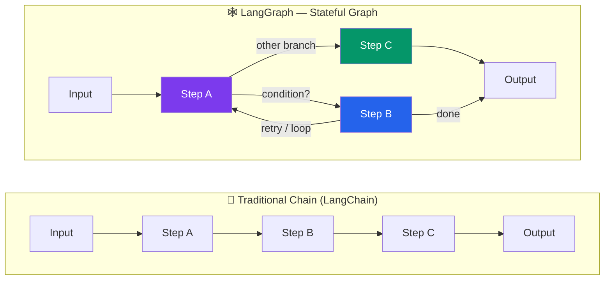

# 01 - Introduction to LangGraph

## What is LangGraph?

LangGraph is a framework for building **stateful, multi-step AI agent workflows** modeled as graphs. It is built on top of LangChain but takes a fundamentally different approach: instead of chaining calls linearly, you define a **directed graph** where nodes are functions and edges are transitions between them.

If you have worked with state machines in the JavaScript/TypeScript world (e.g., XState), LangGraph will feel conceptually familiar. The key difference is that LangGraph is purpose-built for AI agent workflows: the "state" typically contains conversation messages, tool results, and planning data, and the "transitions" are often driven by LLM decisions.



Graphs can have **cycles** (an agent retrying or iterating), **conditional branching** (the LLM decides what to do next), and **human-in-the-loop** interruptions (pause, get approval, resume). None of these are natural in a linear chain.

---

## LangGraph vs LangChain Chains

| Feature | LangChain Chains | LangGraph |
|---|---|---|
| Execution flow | Linear or simple branching | Arbitrary graph with cycles |
| State | Passed through chain, immutable | Centralized, mutable state object |
| Cycles / loops | Not natively supported | First-class support |
| Human-in-the-loop | Manual workarounds | Built-in interrupt/resume |
| Persistence | DIY | Built-in checkpointing |
| Multi-agent | Difficult to coordinate | Supervisor and handoff patterns |
| Streaming | Chain-level | Node-level, token-level |

**When to use plain LangChain chains:**
- Simple prompt -> LLM -> output
- Retrieval-augmented generation (RAG) with a fixed pipeline
- One-shot tasks with no iteration

**When to use LangGraph:**
- Agents that decide which tools to call and may call them multiple times
- Multi-step reasoning that loops until a condition is met
- Workflows requiring human approval before proceeding
- Multi-agent systems where agents hand off to each other
- Any scenario requiring persistent conversation state across requests

---

## Core Architecture: State Machine as a Graph

LangGraph models your workflow as a **directed graph** with three primitives:

### 1. State
A typed dictionary that holds all data flowing through the graph. Every node reads from and writes to this shared state.

```python
from typing import TypedDict, Annotated
import operator

class AgentState(TypedDict):
    messages: Annotated[list, operator.add]  # Appends new messages
    next_action: str
    iteration_count: int
```

### 2. Nodes
Python functions that receive the current state, do work, and return state updates. A node might call an LLM, execute a tool, transform data, or make a decision.

```python
def call_llm(state: AgentState) -> dict:
    """Node that calls the LLM and returns a state update."""
    response = llm.invoke(state["messages"])
    return {"messages": [response]}
```

### 3. Edges
Connections between nodes. Edges can be:
- **Normal edges**: always go from A to B
- **Conditional edges**: a router function inspects the state and returns the name of the next node

```python
graph.add_edge("call_llm", "process_response")           # Always
graph.add_conditional_edges("process_response", router)   # Conditional
```

### 4. Special Nodes
- `START`: the entry point of the graph
- `END`: the exit point; reaching this stops execution

### 5. Compilation
After defining nodes and edges, you **compile** the graph into a runnable object:

```python
app = graph.compile()
result = app.invoke({"messages": [HumanMessage(content="Hello")]})
```

---

## Comparison with XState (JavaScript State Machines)

If you have used XState in your Node.js projects, the mental model maps closely:

| XState Concept | LangGraph Equivalent |
|---|---|
| `Machine` | `StateGraph` |
| `context` | State (`TypedDict`) |
| `states` / `on` | Nodes + Edges |
| `guards` | Conditional edge functions |
| `actions` | Node functions |
| `invoke` (services) | Nodes that call LLMs or tools |
| `assign` | Returning a state update dict |
| `final` state | `END` node |

**XState example (conceptual):**
```typescript
// TypeScript / XState
const agentMachine = createMachine({
  id: "agent",
  initial: "thinking",
  context: { messages: [], toolResults: [] },
  states: {
    thinking: {
      invoke: { src: "callLLM", onDone: "deciding" },
    },
    deciding: {
      always: [
        { target: "usingTool", guard: "needsTool" },
        { target: "responding" },
      ],
    },
    usingTool: {
      invoke: { src: "executeTool", onDone: "thinking" },
    },
    responding: { type: "final" },
  },
});
```

**LangGraph equivalent:**
```python
from langgraph.graph import StateGraph, START, END

graph = StateGraph(AgentState)

graph.add_node("thinking", call_llm)
graph.add_node("using_tool", execute_tool)
graph.add_node("responding", format_response)

graph.add_edge(START, "thinking")
graph.add_conditional_edges("thinking", decide_next, {
    "use_tool": "using_tool",
    "respond": "responding",
})
graph.add_edge("using_tool", "thinking")  # Cycle back!
graph.add_edge("responding", END)

app = graph.compile()
```

The LangGraph version is arguably more explicit and easier to follow for AI-specific workflows.

---

## Installation

```bash
# Core LangGraph
pip install langgraph

# You will also want LangChain core and an LLM provider
pip install langchain-core langchain-openai

# For visualization (optional)
pip install pygraphviz
# Or use the built-in Mermaid output (no extra install needed)
```

Verify the installation:

```python
import langgraph
print(langgraph.__version__)
```

Set up your API key for OpenAI (or your preferred provider):

```bash
# .env file or environment variable
export OPENAI_API_KEY="sk-..."
```

```python
import os
os.environ["OPENAI_API_KEY"] = "sk-..."
```

---

## Your First LangGraph: Hello World

Let us build the simplest possible graph: two nodes in sequence.

```python
from typing import TypedDict
from langgraph.graph import StateGraph, START, END


# 1. Define the state
class GreetingState(TypedDict):
    name: str
    greeting: str


# 2. Define node functions
def create_greeting(state: GreetingState) -> dict:
    return {"greeting": f"Hello, {state['name']}! Welcome to LangGraph."}


def add_emoji(state: GreetingState) -> dict:
    return {"greeting": state["greeting"] + " Have a great day!"}


# 3. Build the graph
graph = StateGraph(GreetingState)
graph.add_node("greet", create_greeting)
graph.add_node("enhance", add_emoji)

graph.add_edge(START, "greet")
graph.add_edge("greet", "enhance")
graph.add_edge("enhance", END)

# 4. Compile and run
app = graph.compile()
result = app.invoke({"name": "Alex", "greeting": ""})

print(result["greeting"])
# Output: Hello, Alex! Welcome to LangGraph. Have a great day!
```

### Visualize the graph

```python
# Output as Mermaid diagram syntax
print(app.get_graph().draw_mermaid())
```

This produces Mermaid-compatible text you can paste into any Mermaid renderer to see your graph visually.

---

## Key Takeaways

1. LangGraph models AI workflows as **directed graphs** with nodes (functions) and edges (transitions).
2. Unlike linear chains, graphs support **cycles**, **conditional branching**, and **human-in-the-loop**.
3. State is a **typed dictionary** shared across all nodes; each node returns partial updates.
4. The mental model is close to **XState** in the JS world, but purpose-built for LLM agent workflows.
5. You define the graph declaratively, **compile** it, then **invoke** it with initial state.

---

## Practice Exercises

### Exercise 1: Concept Check
Without writing code, sketch (on paper or in a comment) a graph for a customer support bot that:
- Receives a message
- Classifies it as "billing", "technical", or "general"
- Routes to a specialized handler node for each category
- All handlers converge to a "format_response" node
- Then END

How many nodes do you have? How many edges? Which edges are conditional?

### Exercise 2: Simple Sequential Graph
Build a graph with three nodes:
1. `fetch_data` - sets `state["data"]` to a hardcoded list of numbers `[10, 20, 30, 40, 50]`
2. `process_data` - computes the sum and stores it in `state["result"]`
3. `format_output` - creates a string like `"The sum of 5 numbers is 150"` and stores in `state["output"]`

Run the graph and print the final output.

### Exercise 3: Add an LLM Node
Extend the Hello World example:
1. Replace the `create_greeting` node with one that calls an LLM to generate a creative greeting
2. Add a third node that translates the greeting to Spanish (also using the LLM)
3. Run the graph and print the result

```python
# Starter code
from langchain_openai import ChatOpenAI

llm = ChatOpenAI(model="gpt-4o-mini", temperature=0.7)

def llm_greeting(state):
    response = llm.invoke(f"Create a creative one-line greeting for {state['name']}")
    return {"greeting": response.content}
```

### Exercise 4: Explore the Graph Object
After compiling a graph, explore these methods and attributes:
```python
app = graph.compile()

# Try each of these and note what they return:
print(app.get_graph().nodes)
print(app.get_graph().edges)
print(app.get_graph().draw_mermaid())
print(type(app))
```

What type is the compiled graph? What does the Mermaid output look like?

### Exercise 5: Compare Paradigms
Write the same logic two ways:
1. As a LangChain `RunnableSequence` (using `|` pipe operator)
2. As a LangGraph `StateGraph`

The logic: take a topic, generate 3 quiz questions with an LLM, then format them as numbered items.

Which version is easier to read? Which would be easier to extend with error handling or retries?
