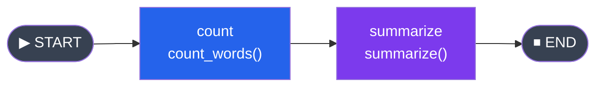

# 02 - State Graphs: The Foundation

## StateGraph Class

The `StateGraph` is the core building block of LangGraph. It is a directed graph where:
- **Nodes** are Python functions that transform state
- **Edges** define the flow between nodes
- **State** is a typed dictionary shared across all nodes

Think of it like building an Express.js middleware pipeline, but instead of `req`/`res` flowing linearly, you have a state object flowing through a graph with branches and cycles.

```python
from langgraph.graph import StateGraph, START, END
```

---

## Defining State with TypedDict

State is defined as a Python `TypedDict`. This gives you type safety similar to TypeScript interfaces.

```python
from typing import TypedDict

class MyState(TypedDict):
    query: str
    response: str
    confidence: float
```

**TypeScript equivalent for comparison:**
```typescript
interface MyState {
  query: string;
  response: string;
  confidence: number;
}
```

The `TypedDict` serves as the schema. LangGraph uses it to understand what keys exist in your state and how to merge updates.

### State with Default Values

You cannot set defaults directly in `TypedDict`, but you provide initial values when invoking the graph:

```python
class SearchState(TypedDict):
    query: str
    results: list[str]
    page: int

# When invoking, provide all needed initial values
app.invoke({"query": "langgraph tutorial", "results": [], "page": 1})
```

---

## Adding Nodes

Nodes are functions that:
1. Receive the current state as their argument
2. Perform some work (call an LLM, run a tool, transform data)
3. Return a **partial state update** dictionary

```python
def analyze_query(state: MyState) -> dict:
    """Analyze the incoming query and set confidence."""
    query = state["query"]
    # Some analysis logic
    is_clear = len(query.split()) > 3
    return {
        "confidence": 0.9 if is_clear else 0.3
    }

def generate_response(state: MyState) -> dict:
    """Generate a response based on the query."""
    return {
        "response": f"Here is the answer to: {state['query']}"
    }
```

Add them to the graph with `add_node`:

```python
graph = StateGraph(MyState)
graph.add_node("analyze", analyze_query)
graph.add_node("generate", generate_response)
```

The first argument is the **node name** (a string identifier). The second is the function. Node names must be unique within a graph.

**Important:** The returned dictionary is **merged** into the current state. You only need to return the keys you want to update. Keys you do not return remain unchanged.

---

## Adding Edges

Edges define transitions between nodes. A normal edge says: "After node A finishes, always go to node B."

```python
graph.add_edge("analyze", "generate")
```

### START and END Special Nodes

Every graph needs an entry point and at least one exit point:

- `START`: a virtual node representing where execution begins
- `END`: a virtual node representing where execution stops

```python
from langgraph.graph import START, END

graph.add_edge(START, "analyze")       # Entry: start at "analyze"
graph.add_edge("generate", END)        # Exit: stop after "generate"
```

A graph can have multiple paths to `END` (e.g., different branches that all terminate).

### Complete Linear Graph Example

```python
from typing import TypedDict
from langgraph.graph import StateGraph, START, END


class PipelineState(TypedDict):
    text: str
    word_count: int
    summary: str


def count_words(state: PipelineState) -> dict:
    words = state["text"].split()
    return {"word_count": len(words)}


def summarize(state: PipelineState) -> dict:
    text = state["text"]
    # Simple truncation as "summary" for demonstration
    summary = text[:100] + "..." if len(text) > 100 else text
    return {"summary": f"({state['word_count']} words) {summary}"}


# Build the graph
graph = StateGraph(PipelineState)
graph.add_node("count", count_words)
graph.add_node("summarize", summarize)

graph.add_edge(START, "count")
graph.add_edge("count", "summarize")
graph.add_edge("summarize", END)

# Compile
app = graph.compile()

# Graph visualization:
```



```python
# Run
result = app.invoke({
    "text": "LangGraph is a powerful framework for building stateful AI agent workflows. "
            "It models computation as a directed graph with nodes and edges.",
    "word_count": 0,
    "summary": "",
})

print(result["summary"])
# Output: (21 words) LangGraph is a powerful framework for building stateful AI agent workflows. It models computation as a di...
```

---

## Compiling the Graph

Calling `graph.compile()` validates your graph and returns a **runnable** object (a `CompiledGraph`):

```python
app = graph.compile()
```

Compilation checks for:
- Every node has at least one incoming edge (or is connected to `START`)
- Every node has at least one outgoing edge (or connects to `END`)
- Node names referenced in edges actually exist

You can also pass options during compilation:

```python
from langgraph.checkpoint.memory import MemorySaver

# With checkpointing (persistence)
memory = MemorySaver()
app = graph.compile(checkpointer=memory)

# With interrupt points (human-in-the-loop)
app = graph.compile(
    checkpointer=memory,
    interrupt_before=["dangerous_action"]
)
```

---

## Running the Graph

### Synchronous: `invoke`

```python
result = app.invoke({"text": "Hello world", "word_count": 0, "summary": ""})
print(result)  # Full final state dictionary
```

`invoke` runs the graph to completion and returns the final state.

### Asynchronous: `ainvoke`

If you are coming from Node.js, you are used to async being the default. In Python, async is opt-in. LangGraph supports both patterns:

```python
import asyncio

async def main():
    result = await app.ainvoke({
        "text": "Hello world",
        "word_count": 0,
        "summary": "",
    })
    print(result)

asyncio.run(main())
```

**Node.js comparison:**
```typescript
// In Node.js, you'd do:
const result = await app.invoke({ text: "Hello world" });

// In Python async:
result = await app.ainvoke({"text": "Hello world"})
```

### Streaming: `stream` and `astream`

For real-time output, you can stream state updates as nodes complete:

```python
for event in app.stream({"text": "Hello world", "word_count": 0, "summary": ""}):
    print(event)
    # Each event is a dict with the node name as key and its output as value
    # {"count": {"word_count": 2}}
    # {"summarize": {"summary": "(2 words) Hello world"}}
```

Async streaming:

```python
async for event in app.astream(initial_state):
    print(event)
```

---

## A More Realistic Example: LLM Pipeline

```python
from typing import TypedDict
from langchain_openai import ChatOpenAI
from langchain_core.messages import HumanMessage, SystemMessage
from langgraph.graph import StateGraph, START, END

llm = ChatOpenAI(model="gpt-4o-mini", temperature=0)


class ArticleState(TypedDict):
    topic: str
    outline: str
    draft: str
    final: str


def generate_outline(state: ArticleState) -> dict:
    messages = [
        SystemMessage(content="You are a technical writer. Create a brief outline."),
        HumanMessage(content=f"Create an outline for an article about: {state['topic']}"),
    ]
    response = llm.invoke(messages)
    return {"outline": response.content}


def write_draft(state: ArticleState) -> dict:
    messages = [
        SystemMessage(content="You are a technical writer. Write a short article."),
        HumanMessage(content=f"Write an article following this outline:\n{state['outline']}"),
    ]
    response = llm.invoke(messages)
    return {"draft": response.content}


def polish(state: ArticleState) -> dict:
    messages = [
        SystemMessage(content="You are an editor. Polish this article for clarity."),
        HumanMessage(content=f"Polish this draft:\n{state['draft']}"),
    ]
    response = llm.invoke(messages)
    return {"final": response.content}


# Build graph
graph = StateGraph(ArticleState)
graph.add_node("outline", generate_outline)
graph.add_node("draft", write_draft)
graph.add_node("polish", polish)

graph.add_edge(START, "outline")
graph.add_edge("outline", "draft")
graph.add_edge("draft", "polish")
graph.add_edge("polish", END)

app = graph.compile()

result = app.invoke({
    "topic": "Why Python is great for AI development",
    "outline": "",
    "draft": "",
    "final": "",
})

print(result["final"])
```

---

## Visualization

LangGraph can output your graph as a Mermaid diagram, which is useful for documentation and debugging.

```python
# Get the Mermaid diagram as a string
mermaid_str = app.get_graph().draw_mermaid()
print(mermaid_str)
```

This outputs something like:

```
%%{init: {'flowchart': {'curve': 'linear'}}}%%
graph TD;
    __start__([<p>__start__</p>]):::first
    outline(outline)
    draft(draft)
    polish(polish)
    __end__([<p>__end__</p>]):::last
    __start__ --> outline;
    outline --> draft;
    draft --> polish;
    polish --> __end__;
```

You can render this in any Mermaid-compatible tool (GitHub markdown, Mermaid Live Editor, VS Code extensions).

### Save as PNG (requires additional dependencies)

```python
# Requires pygraphviz or grandalf
from IPython.display import Image, display

# In a Jupyter notebook:
display(Image(app.get_graph().draw_mermaid_png()))

# Save to file:
with open("graph.png", "wb") as f:
    f.write(app.get_graph().draw_mermaid_png())
```

---

## Inspecting the Graph

```python
# Get the graph object
g = app.get_graph()

# List all nodes
print(g.nodes)
# {'__start__': ..., 'outline': ..., 'draft': ..., 'polish': ..., '__end__': ...}

# List all edges
print(g.edges)
# [Edge(source='__start__', target='outline'), Edge(source='outline', target='draft'), ...]
```

---

## Common Patterns for Node Functions

### Pattern 1: Pure transformation (no I/O)
```python
def transform(state: MyState) -> dict:
    return {"processed": state["raw"].upper()}
```

### Pattern 2: LLM call
```python
def llm_node(state: MyState) -> dict:
    response = llm.invoke(state["messages"])
    return {"messages": [response]}
```

### Pattern 3: External API call
```python
import httpx

def api_node(state: MyState) -> dict:
    response = httpx.get(f"https://api.example.com/search?q={state['query']}")
    return {"api_result": response.json()}
```

### Pattern 4: Async node
```python
async def async_node(state: MyState) -> dict:
    async with httpx.AsyncClient() as client:
        response = await client.get(f"https://api.example.com/data")
    return {"data": response.json()}
```

When you use async node functions, invoke the graph with `ainvoke` or `astream`.

---

## Key Takeaways

1. `StateGraph` is the foundation. You define state, add nodes, add edges, compile, and invoke.
2. State is a `TypedDict` providing type safety similar to TypeScript interfaces.
3. Nodes are functions that receive full state and return **partial updates**.
4. `START` and `END` are special nodes marking entry and exit points.
5. Compilation validates the graph structure. The compiled graph is a runnable object.
6. Both sync (`invoke`) and async (`ainvoke`) execution are supported.
7. Visualization via Mermaid helps you understand and document your workflows.

---

## Practice Exercises

### Exercise 1: Three-Step Text Processor
Build a graph that processes text in three steps:
1. `clean` - removes extra whitespace and converts to lowercase
2. `tokenize` - splits into words and stores as a list
3. `analyze` - counts word frequencies and stores the top 5 most common words

State should include: `raw_text`, `clean_text`, `tokens`, `top_words`.

### Exercise 2: Multi-Step Calculator
Create a graph that takes a math problem description in English:
1. `parse` - extracts numbers and operation from the text (use simple string parsing)
2. `compute` - performs the calculation
3. `format` - creates a human-readable result string

Test with: `"What is the sum of 42 and 58?"`

### Exercise 3: Async Web Scraper Pipeline
Build an async graph with three nodes:
1. `fetch` - uses `httpx.AsyncClient` to fetch a webpage (use `https://httpbin.org/json`)
2. `extract` - pulls specific fields from the JSON response
3. `format` - formats the extracted data as a readable string

Use `ainvoke` to run it.

### Exercise 4: Streaming Observer
Using the article generation example from this chapter:
1. Run the graph with `stream()` instead of `invoke()`
2. Print a message each time a node completes, including the node name and a preview of its output (first 100 chars)
3. Time how long each node takes to execute

```python
import time

for event in app.stream(initial_state):
    node_name = list(event.keys())[0]
    output_preview = str(list(event.values())[0])[:100]
    print(f"[{node_name}] completed: {output_preview}...")
```

### Exercise 5: Graph Visualizer
Create a function `describe_graph(compiled_app)` that:
1. Prints the number of nodes and edges
2. Lists each node and its connections
3. Identifies the entry node(s) and exit node(s)
4. Outputs the Mermaid diagram

Test it with the graphs you built in exercises 1-3.
