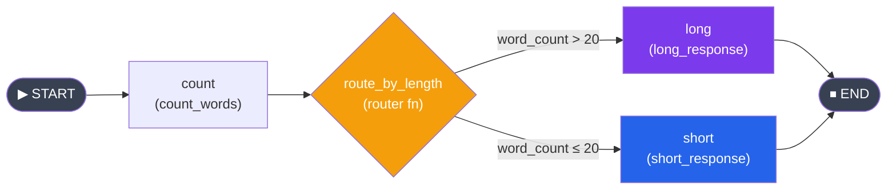

# 03 - Conditional Edges: Branching and Routing

## Why Conditional Edges?

In a real AI agent, the next step depends on what happened in the previous step. The LLM might decide to use a tool, ask for clarification, or give a final answer. This is where **conditional edges** come in -- they let you branch the graph based on the current state.



Think of it like Express.js middleware that routes to different handlers based on the request:

```typescript
// Node.js analogy
app.use((req, res, next) => {
  if (req.body.type === "billing") return billingHandler(req, res);
  if (req.body.type === "technical") return techHandler(req, res);
  return generalHandler(req, res);
});
```

In LangGraph, this is done with `add_conditional_edges`.

---

## add_conditional_edges()

The method signature:

```python
graph.add_conditional_edges(
    source="node_name",           # The node AFTER which we decide
    path=router_function,         # Function that returns the next node name
    path_map={"key": "node"},     # Optional: maps return values to node names
)
```

### The Router Function

A router function receives the current state and returns a string indicating which node to go to next:

```python
def router(state: MyState) -> str:
    if state["confidence"] > 0.8:
        return "respond"
    else:
        return "clarify"
```

### Basic Example

```python
from typing import TypedDict
from langgraph.graph import StateGraph, START, END


class ReviewState(TypedDict):
    text: str
    word_count: int
    result: str


def count_words(state: ReviewState) -> dict:
    return {"word_count": len(state["text"].split())}


def short_response(state: ReviewState) -> dict:
    return {"result": f"Short text ({state['word_count']} words): {state['text']}"}


def long_response(state: ReviewState) -> dict:
    return {"result": f"Long text ({state['word_count']} words): {state['text'][:50]}..."}


def route_by_length(state: ReviewState) -> str:
    """Router: decide based on word count."""
    if state["word_count"] > 20:
        return "long"
    return "short"


graph = StateGraph(ReviewState)
graph.add_node("count", count_words)
graph.add_node("short", short_response)
graph.add_node("long", long_response)

graph.add_edge(START, "count")
graph.add_conditional_edges("count", route_by_length, {
    "short": "short",
    "long": "long",
})
graph.add_edge("short", END)
graph.add_edge("long", END)

app = graph.compile()

# Test with short text
result = app.invoke({"text": "Hello world", "word_count": 0, "result": ""})
print(result["result"])  # Short text (2 words): Hello world

# Test with long text
long_text = "This is a much longer piece of text that contains many words and should trigger the long response path in our graph"
result = app.invoke({"text": long_text, "word_count": 0, "result": ""})
print(result["result"])  # Long text (21 words): This is a much longer piece of text that contains...
```

---

## The path_map Parameter

The `path_map` maps the router function's return values to actual node names. This is useful when:
- You want the router to return simple labels instead of exact node names
- You want to map to `END`

```python
# Router returns descriptive labels
def classify(state):
    score = state["score"]
    if score >= 90:
        return "excellent"
    elif score >= 70:
        return "good"
    else:
        return "needs_work"

# Map labels to node names
graph.add_conditional_edges("evaluate", classify, {
    "excellent": "celebrate",
    "good": "summarize",
    "needs_work": "retry",
})
```

If you omit `path_map`, the router's return value must exactly match a node name or `END`:

```python
def classify(state):
    if state["score"] >= 70:
        return "summarize"    # Must be an actual node name
    return END                # Can return END directly

graph.add_conditional_edges("evaluate", classify)  # No path_map needed
```

---

## Routing to END

A common pattern is to either continue processing or stop:

```python
from langgraph.graph import END

def should_continue(state: AgentState) -> str:
    last_message = state["messages"][-1]
    # If the LLM made tool calls, continue to tool execution
    if last_message.tool_calls:
        return "tools"
    # Otherwise, we are done
    return END

graph.add_conditional_edges("agent", should_continue, {
    "tools": "tool_executor",
    END: END,
})
```

---

## Multiple Possible Next Nodes (Fan-Out)

You can route to many different nodes from a single conditional edge:

```python
class TaskState(TypedDict):
    task_type: str
    input_data: str
    output: str


def route_task(state: TaskState) -> str:
    task_map = {
        "translate": "translator",
        "summarize": "summarizer",
        "analyze": "analyzer",
        "code": "coder",
    }
    return task_map.get(state["task_type"], "default_handler")


def translator(state: TaskState) -> dict:
    return {"output": f"Translated: {state['input_data']}"}

def summarizer(state: TaskState) -> dict:
    return {"output": f"Summary: {state['input_data'][:20]}..."}

def analyzer(state: TaskState) -> dict:
    return {"output": f"Analysis of: {state['input_data']}"}

def coder(state: TaskState) -> dict:
    return {"output": f"Code for: {state['input_data']}"}

def default_handler(state: TaskState) -> dict:
    return {"output": f"Default handling: {state['input_data']}"}


graph = StateGraph(TaskState)

for name, func in [
    ("translator", translator),
    ("summarizer", summarizer),
    ("analyzer", analyzer),
    ("coder", coder),
    ("default_handler", default_handler),
]:
    graph.add_node(name, func)

graph.add_edge(START, "router_node")
graph.add_node("router_node", lambda state: {})  # No-op, just for routing

graph.add_conditional_edges("router_node", route_task, {
    "translator": "translator",
    "summarizer": "summarizer",
    "analyzer": "analyzer",
    "coder": "coder",
    "default_handler": "default_handler",
})

# All paths lead to END
for node in ["translator", "summarizer", "analyzer", "coder", "default_handler"]:
    graph.add_edge(node, END)

app = graph.compile()

result = app.invoke({"task_type": "summarize", "input_data": "A very long document about AI", "output": ""})
print(result["output"])  # Summary: A very long document...
```

---

## Pattern: LLM Decides the Next Step

This is the most important pattern in agent development. The LLM's response determines what happens next:

```python
from typing import TypedDict, Annotated
import operator
from langchain_openai import ChatOpenAI
from langchain_core.messages import HumanMessage, AIMessage, BaseMessage
from langgraph.graph import StateGraph, START, END

llm = ChatOpenAI(model="gpt-4o-mini", temperature=0)


class AgentState(TypedDict):
    messages: Annotated[list[BaseMessage], operator.add]
    final_answer: str


def call_agent(state: AgentState) -> dict:
    """The agent node: calls the LLM."""
    system_prompt = (
        "You are a helpful assistant. If you need to do math, "
        "respond with CALCULATE: <expression>. Otherwise, respond normally."
    )
    messages = [{"role": "system", "content": system_prompt}] + state["messages"]
    response = llm.invoke(messages)
    return {"messages": [response]}


def calculator(state: AgentState) -> dict:
    """Executes a math expression found in the last message."""
    last_msg = state["messages"][-1].content
    expression = last_msg.split("CALCULATE:")[-1].strip()
    try:
        result = eval(expression)  # In production, use a safe evaluator!
        return {"messages": [HumanMessage(content=f"The result is: {result}")]}
    except Exception as e:
        return {"messages": [HumanMessage(content=f"Error calculating: {e}")]}


def format_final(state: AgentState) -> dict:
    return {"final_answer": state["messages"][-1].content}


def should_calculate(state: AgentState) -> str:
    """Router: check if the LLM wants to calculate."""
    last_message = state["messages"][-1]
    if "CALCULATE:" in last_message.content:
        return "calculate"
    return "done"


graph = StateGraph(AgentState)
graph.add_node("agent", call_agent)
graph.add_node("calculator", calculator)
graph.add_node("format", format_final)

graph.add_edge(START, "agent")
graph.add_conditional_edges("agent", should_calculate, {
    "calculate": "calculator",
    "done": "format",
})
# After calculating, go back to agent (cycle!) so it can interpret the result
graph.add_edge("calculator", "agent")
graph.add_edge("format", END)

app = graph.compile()

result = app.invoke({
    "messages": [HumanMessage(content="What is 1234 * 5678?")],
    "final_answer": "",
})
print(result["final_answer"])
```

Notice the **cycle**: `agent -> calculator -> agent`. The agent can keep using the calculator until it is ready to give a final answer.

---

## Building a Decision Tree

Conditional edges can be chained to form a decision tree:

```python
class SupportState(TypedDict):
    question: str
    category: str
    priority: str
    response: str


def categorize(state: SupportState) -> dict:
    q = state["question"].lower()
    if "bill" in q or "payment" in q or "charge" in q:
        return {"category": "billing"}
    elif "bug" in q or "error" in q or "crash" in q:
        return {"category": "technical"}
    else:
        return {"category": "general"}


def assess_priority(state: SupportState) -> dict:
    q = state["question"].lower()
    if "urgent" in q or "crash" in q or "down" in q:
        return {"priority": "high"}
    return {"priority": "normal"}


def route_category(state: SupportState) -> str:
    return state["category"]


def route_priority(state: SupportState) -> str:
    return state["priority"]


def billing_handler(state: SupportState) -> dict:
    return {"response": "Billing team will review your inquiry."}

def tech_normal(state: SupportState) -> dict:
    return {"response": "A technician will look into this within 24 hours."}

def tech_urgent(state: SupportState) -> dict:
    return {"response": "URGENT: Escalating to on-call engineer immediately."}

def general_handler(state: SupportState) -> dict:
    return {"response": "Thank you for reaching out. We will respond shortly."}


graph = StateGraph(SupportState)

graph.add_node("categorize", categorize)
graph.add_node("assess_priority", assess_priority)
graph.add_node("billing", billing_handler)
graph.add_node("tech_normal", tech_normal)
graph.add_node("tech_urgent", tech_urgent)
graph.add_node("general", general_handler)

graph.add_edge(START, "categorize")

# First branch: by category
graph.add_conditional_edges("categorize", route_category, {
    "billing": "billing",
    "technical": "assess_priority",
    "general": "general",
})

# Second branch: technical tickets by priority
graph.add_conditional_edges("assess_priority", route_priority, {
    "high": "tech_urgent",
    "normal": "tech_normal",
})

# All leaf nodes go to END
for node in ["billing", "tech_normal", "tech_urgent", "general"]:
    graph.add_edge(node, END)

app = graph.compile()

# Test different paths
tests = [
    "I was overcharged on my bill",
    "The app keeps crashing, this is urgent!",
    "How do I change my username?",
]

for q in tests:
    result = app.invoke({"question": q, "category": "", "priority": "", "response": ""})
    print(f"Q: {q}")
    print(f"A: {result['response']}\n")
```

---

## Default / Fallback Edges

When using `path_map`, make sure your router can handle all cases. If the router returns a value not in the map, LangGraph will raise an error.

**Strategy 1: Catch-all in the router**
```python
def route(state):
    category = state.get("category", "unknown")
    if category in ("billing", "technical", "general"):
        return category
    return "general"  # Fallback
```

**Strategy 2: Use END as a fallback**
```python
graph.add_conditional_edges("node", route, {
    "known_path": "handler",
    END: END,  # Anything else terminates
})
```

---

## Complex Routing with Multiple Conditions

Sometimes routing depends on multiple state fields:

```python
def complex_router(state: AgentState) -> str:
    has_tool_calls = bool(state["messages"][-1].tool_calls)
    iteration = state.get("iteration_count", 0)
    max_iterations = 5

    if iteration >= max_iterations:
        return "force_respond"          # Safety: prevent infinite loops
    elif has_tool_calls:
        return "execute_tools"
    else:
        return "respond"
```

This pattern is critical for production agents where you need to prevent infinite loops while still allowing the agent to iterate.

---

## Key Takeaways

1. `add_conditional_edges` enables branching based on state -- the core of agent decision-making.
2. Router functions receive state and return a string indicating the next node.
3. `path_map` translates router return values to node names; omit it to use node names directly.
4. The LLM-decides-next-step pattern is the foundation of tool-using agents.
5. Cycles (node A -> node B -> node A) are how agents iterate until they have a final answer.
6. Always include a maximum iteration guard to prevent infinite loops.

---

## Practice Exercises

### Exercise 1: Grade Router
Build a graph that takes a student's score (0-100) and routes to different feedback nodes:
- 90-100: "excellent" node
- 70-89: "good" node
- 50-69: "needs_improvement" node
- Below 50: "failing" node

Each node should return appropriate feedback text. Test with scores 95, 75, 55, and 30.

### Exercise 2: Content Classifier
Build a graph that classifies text content and processes it differently:
1. `classify` node: determines if the text is a "question", "statement", or "command" (use simple heuristics -- ends with `?`, starts with a verb, etc.)
2. Route conditionally to:
   - `answer_question` - responds with "That's a great question about..."
   - `acknowledge_statement` - responds with "I understand that..."
   - `execute_command` - responds with "I will now..."
3. All paths converge at `format_output` before END

Test with: "What is Python?", "Python is a great language.", "Tell me about Python."

### Exercise 3: Retry Loop
Build a graph with a cycle that simulates an unreliable operation:
1. `attempt` node: generates a random number 1-10, stores it in state
2. Router: if the number is 8 or higher, route to "success"; otherwise route back to "attempt"
3. Track the number of attempts in state
4. Add a safety limit: after 10 attempts, force-route to "give_up" node

```python
import random

def attempt(state):
    roll = random.randint(1, 10)
    return {
        "last_roll": roll,
        "attempts": state["attempts"] + 1,
    }
```

### Exercise 4: LLM-Powered Router
Build a graph where the LLM itself decides the routing:
1. `receive_query` node: takes a user question
2. `classify_with_llm` node: asks the LLM to classify the query as "factual", "creative", or "code"
3. Route to three different handler nodes based on the LLM's classification
4. Each handler uses the LLM with a different system prompt appropriate for the category

### Exercise 5: Multi-Level Decision Tree
Extend the support ticket example to add a third level of routing:
- After determining category and priority, route to specific sub-handlers:
  - billing + high: "billing_escalation"
  - billing + normal: "billing_queue"
  - technical + high: "tech_oncall"
  - technical + normal: "tech_queue"
- Add a node at the end that logs the full routing path taken (store it in state as a list)

Visualize the complete graph with Mermaid and verify all paths.
