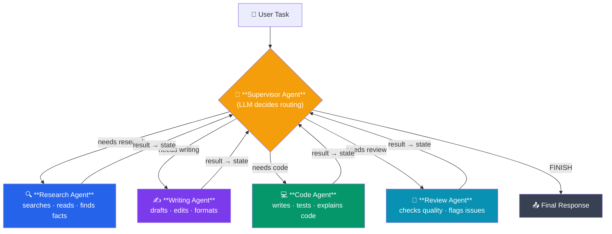

# 07 - Multi-Agent Systems: Supervisor, Handoff, and Coordination

## Why Multi-Agent?

A single LLM agent struggles with complex tasks that span multiple domains. Just as in software engineering you split a monolith into microservices, in AI you can split a mega-agent into **specialized agents** that collaborate.

**Node.js microservice analogy:**
```
API Gateway (supervisor)
  |-- Auth Service (specialist)
  |-- Payment Service (specialist)
  |-- Notification Service (specialist)
  |-- User Service (specialist)
```

In LangGraph:



---

## The Supervisor Pattern

The most common multi-agent architecture. One "supervisor" agent decides which specialist to invoke and when the task is complete.

```python
from typing import TypedDict, Annotated, Literal
from langchain_core.messages import HumanMessage, AIMessage, BaseMessage, SystemMessage
from langchain_openai import ChatOpenAI
from langgraph.graph import StateGraph, START, END, add_messages

llm = ChatOpenAI(model="gpt-4o-mini", temperature=0)


class MultiAgentState(TypedDict):
    messages: Annotated[list[BaseMessage], add_messages]
    next_agent: str
    final_response: str


# --- Supervisor ---
def supervisor(state: MultiAgentState) -> dict:
    """Decides which agent to call next or to finish."""
    system_prompt = """You are a supervisor managing a team of specialists:
- "researcher": For finding information and facts
- "writer": For drafting and editing text
- "coder": For writing and explaining code

Based on the conversation, decide which agent should handle the next step.
Respond with ONLY one of: "researcher", "writer", "coder", "FINISH"
If the task is complete, respond with "FINISH"."""

    response = llm.invoke([
        SystemMessage(content=system_prompt),
        *state["messages"],
    ])
    next_agent = response.content.strip().strip('"').lower()
    return {"next_agent": next_agent}


# --- Specialist Agents ---
def researcher(state: MultiAgentState) -> dict:
    response = llm.invoke([
        SystemMessage(content="You are a research specialist. Find relevant information, "
                              "cite sources, and provide factual data. Be thorough."),
        *state["messages"],
    ])
    return {"messages": [AIMessage(content=f"[Researcher]: {response.content}", name="researcher")]}


def writer(state: MultiAgentState) -> dict:
    response = llm.invoke([
        SystemMessage(content="You are a writing specialist. Draft clear, engaging content. "
                              "Use the research provided in the conversation."),
        *state["messages"],
    ])
    return {"messages": [AIMessage(content=f"[Writer]: {response.content}", name="writer")]}


def coder(state: MultiAgentState) -> dict:
    response = llm.invoke([
        SystemMessage(content="You are a coding specialist. Write clean, well-commented code. "
                              "Explain your implementation choices."),
        *state["messages"],
    ])
    return {"messages": [AIMessage(content=f"[Coder]: {response.content}", name="coder")]}


def finalize(state: MultiAgentState) -> dict:
    """Compile the final response from all agent contributions."""
    response = llm.invoke([
        SystemMessage(content="Compile a final, coherent response from the team's work above."),
        *state["messages"],
    ])
    return {"final_response": response.content}


# --- Routing ---
def route_supervisor(state: MultiAgentState) -> str:
    next_agent = state.get("next_agent", "FINISH")
    if next_agent == "FINISH" or next_agent == "finish":
        return "finalize"
    return next_agent


# --- Build the Graph ---
graph = StateGraph(MultiAgentState)

graph.add_node("supervisor", supervisor)
graph.add_node("researcher", researcher)
graph.add_node("writer", writer)
graph.add_node("coder", coder)
graph.add_node("finalize", finalize)

graph.add_edge(START, "supervisor")

graph.add_conditional_edges("supervisor", route_supervisor, {
    "researcher": "researcher",
    "writer": "writer",
    "coder": "coder",
    "finalize": "finalize",
})

# After each specialist, go back to supervisor for next decision
graph.add_edge("researcher", "supervisor")
graph.add_edge("writer", "supervisor")
graph.add_edge("coder", "supervisor")
graph.add_edge("finalize", END)

app = graph.compile()

# Run it
result = app.invoke({
    "messages": [
        HumanMessage(content="I need a blog post about Python decorators with code examples.")
    ],
    "next_agent": "",
    "final_response": "",
})

print(result["final_response"])
```

### Visualize the Supervisor Pattern

```python
print(app.get_graph().draw_mermaid())
```

This produces a star topology with the supervisor at the center and specialists radiating outward.

---

## Preventing Infinite Loops

The supervisor pattern has a cycle (specialist -> supervisor -> specialist). You must guard against infinite loops:

```python
class SafeMultiAgentState(TypedDict):
    messages: Annotated[list[BaseMessage], add_messages]
    next_agent: str
    iteration_count: int
    max_iterations: int
    final_response: str


def supervisor(state: SafeMultiAgentState) -> dict:
    if state["iteration_count"] >= state["max_iterations"]:
        return {"next_agent": "FINISH", "iteration_count": state["iteration_count"] + 1}

    # Normal supervisor logic...
    response = llm.invoke([...])
    return {
        "next_agent": response.content.strip(),
        "iteration_count": state["iteration_count"] + 1,
    }


# Initialize with safety limit
result = app.invoke({
    "messages": [HumanMessage(content="...")],
    "next_agent": "",
    "iteration_count": 0,
    "max_iterations": 10,
    "final_response": "",
})
```

---

## Agent Handoff Pattern

Instead of a central supervisor, agents can **hand off** directly to each other. Each agent decides which agent should go next:

```python
class HandoffState(TypedDict):
    messages: Annotated[list[BaseMessage], add_messages]
    current_agent: str
    task_complete: bool


def research_agent(state: HandoffState) -> dict:
    response = llm.invoke([
        SystemMessage(content="You are a research agent. Do your research, then decide: "
                              "if writing is needed, say HANDOFF:writer. "
                              "If code is needed, say HANDOFF:coder. "
                              "If done, say DONE."),
        *state["messages"],
    ])
    content = response.content
    return {
        "messages": [AIMessage(content=content, name="researcher")],
        "current_agent": "researcher",
    }


def writing_agent(state: HandoffState) -> dict:
    response = llm.invoke([
        SystemMessage(content="You are a writing agent. Write content, then decide: "
                              "if review is needed, say HANDOFF:reviewer. "
                              "If done, say DONE."),
        *state["messages"],
    ])
    return {
        "messages": [AIMessage(content=response.content, name="writer")],
        "current_agent": "writer",
    }


def route_from_research(state: HandoffState) -> str:
    last_msg = state["messages"][-1].content
    if "HANDOFF:writer" in last_msg:
        return "writer"
    if "HANDOFF:coder" in last_msg:
        return "coder"
    return END


def route_from_writer(state: HandoffState) -> str:
    last_msg = state["messages"][-1].content
    if "HANDOFF:reviewer" in last_msg:
        return "reviewer"
    return END


graph = StateGraph(HandoffState)
graph.add_node("researcher", research_agent)
graph.add_node("writer", writing_agent)
# ... add other agents

graph.add_edge(START, "researcher")
graph.add_conditional_edges("researcher", route_from_research)
graph.add_conditional_edges("writer", route_from_writer)
```

---

## Shared vs. Separate State

### Shared State (Default)
All agents read from and write to the same state. Simple but can lead to conflicts.

```python
class SharedState(TypedDict):
    messages: Annotated[list[BaseMessage], add_messages]
    # All agents see and modify these:
    research_data: str
    draft: str
    code: str
```

**Pros:** Simple, agents can see each other's work.
**Cons:** Agents might accidentally overwrite each other's data.

### Separate State with Shared Communication Channel
Each agent has its own "workspace" in the state, and they communicate through messages:

```python
class IsolatedState(TypedDict):
    # Shared communication channel
    messages: Annotated[list[BaseMessage], add_messages]

    # Agent-specific workspaces (only written by their respective agent)
    researcher_workspace: dict  # Only researcher writes here
    writer_workspace: dict      # Only writer writes here
    coder_workspace: dict       # Only coder writes here

    # Shared results (written by finalize)
    final_output: str
```

```python
def researcher(state: IsolatedState) -> dict:
    # Reads from messages, writes ONLY to researcher_workspace
    findings = do_research(state["messages"])
    return {
        "researcher_workspace": {"findings": findings, "sources": [...]},
        "messages": [AIMessage(content=f"Research complete. Found: {findings[:100]}")],
    }

def writer(state: IsolatedState) -> dict:
    # Reads from messages + researcher_workspace, writes ONLY to writer_workspace
    research = state["researcher_workspace"]
    draft = write_article(research["findings"])
    return {
        "writer_workspace": {"draft": draft, "word_count": len(draft.split())},
        "messages": [AIMessage(content=f"Draft complete. {len(draft.split())} words.")],
    }
```

**Node.js analogy:** This is like microservices communicating through a message queue (messages) while maintaining their own databases (workspaces).

---

## Example: Research + Writing + Review Team

A complete, practical multi-agent system:

```python
from typing import TypedDict, Annotated
from langchain_core.messages import HumanMessage, AIMessage, SystemMessage, BaseMessage
from langchain_openai import ChatOpenAI
from langgraph.graph import StateGraph, START, END, add_messages

llm = ChatOpenAI(model="gpt-4o-mini", temperature=0)


class TeamState(TypedDict):
    messages: Annotated[list[BaseMessage], add_messages]
    task: str
    research_output: str
    draft: str
    review: str
    revision_needed: bool
    revision_count: int
    max_revisions: int
    final: str


def research_agent(state: TeamState) -> dict:
    """Researches the topic thoroughly."""
    response = llm.invoke([
        SystemMessage(content="You are a thorough researcher. Provide detailed, factual information "
                              "with multiple perspectives. Structure your findings clearly."),
        HumanMessage(content=f"Research this topic: {state['task']}"),
    ])
    return {
        "research_output": response.content,
        "messages": [AIMessage(content=f"[Research Agent] Completed research on: {state['task']}", name="researcher")],
    }


def writing_agent(state: TeamState) -> dict:
    """Writes an article based on research and any review feedback."""
    writing_prompt = f"Write a well-structured article about: {state['task']}\n\nResearch:\n{state['research_output']}"
    if state.get("review") and state.get("revision_needed"):
        writing_prompt += f"\n\nPrevious review feedback to address:\n{state['review']}"

    response = llm.invoke([
        SystemMessage(content="You are a skilled writer. Create clear, engaging content."),
        HumanMessage(content=writing_prompt),
    ])
    return {
        "draft": response.content,
        "revision_count": state.get("revision_count", 0) + 1,
        "messages": [AIMessage(content=f"[Writing Agent] Draft v{state.get('revision_count', 0) + 1} complete.", name="writer")],
    }


def review_agent(state: TeamState) -> dict:
    """Reviews the draft and decides if revision is needed."""
    response = llm.invoke([
        SystemMessage(content="You are a strict editor. Review the article for accuracy, clarity, "
                              "and completeness. If issues exist, describe them clearly. "
                              "End with VERDICT: APPROVE or VERDICT: REVISE."),
        HumanMessage(content=f"Review this article:\n{state['draft']}"),
    ])
    content = response.content
    needs_revision = "VERDICT: REVISE" in content.upper()

    # Force approve if we have hit max revisions
    if state["revision_count"] >= state["max_revisions"]:
        needs_revision = False

    return {
        "review": content,
        "revision_needed": needs_revision,
        "messages": [AIMessage(
            content=f"[Review Agent] {'Needs revision' if needs_revision else 'Approved!'}",
            name="reviewer",
        )],
    }


def compile_final(state: TeamState) -> dict:
    return {
        "final": state["draft"],
        "messages": [AIMessage(content="[System] Article finalized and published.", name="system")],
    }


def route_after_review(state: TeamState) -> str:
    if state["revision_needed"]:
        return "writer"  # Send back for revision
    return "compile"


# Build the graph
graph = StateGraph(TeamState)

graph.add_node("researcher", research_agent)
graph.add_node("writer", writing_agent)
graph.add_node("reviewer", review_agent)
graph.add_node("compile", compile_final)

graph.add_edge(START, "researcher")
graph.add_edge("researcher", "writer")
graph.add_edge("writer", "reviewer")
graph.add_conditional_edges("reviewer", route_after_review, {
    "writer": "writer",
    "compile": "compile",
})
graph.add_edge("compile", END)

app = graph.compile()

# Run the team
result = app.invoke({
    "task": "The impact of large language models on software development",
    "messages": [],
    "research_output": "",
    "draft": "",
    "review": "",
    "revision_needed": False,
    "revision_count": 0,
    "max_revisions": 3,
    "final": "",
})

# Print the conversation log
for msg in result["messages"]:
    print(f"{msg.name or 'unknown'}: {msg.content[:120]}")

print("\n--- Final Article ---")
print(result["final"][:500])
```

---

## Comparison with Node.js Microservice Orchestration

| Concept | Node.js Microservices | LangGraph Multi-Agent |
|---|---|---|
| Coordinator | API Gateway / Orchestrator | Supervisor node |
| Service | Express app | Specialist agent node |
| Communication | HTTP / Message Queue | Shared state + messages |
| State | Database per service | TypedDict with workspaces |
| Routing | API Gateway rules | Conditional edges |
| Retry | Circuit breaker | Cycle back + revision count |
| Monitoring | Logging, tracing | Stream events, state history |

**Key Insight:** In microservices, you worry about network calls, serialization, and eventual consistency. In LangGraph multi-agent, all agents share in-process state, making coordination simpler but requiring careful state design to avoid conflicts.

---

## Advanced: Dynamic Team Composition

The supervisor can dynamically choose how many agents to involve:

```python
def smart_supervisor(state: TeamState) -> dict:
    """Analyzes the task and creates an execution plan."""
    response = llm.invoke([
        SystemMessage(content="""Analyze this task and create an execution plan.
Available agents: researcher, writer, coder, reviewer.
Return a JSON list of agents to invoke in order.
Example: ["researcher", "coder", "reviewer"]"""),
        HumanMessage(content=state["task"]),
    ])

    import json
    try:
        plan = json.loads(response.content)
    except json.JSONDecodeError:
        plan = ["researcher", "writer", "reviewer"]  # Default plan

    return {"execution_plan": plan, "plan_step": 0}


def route_by_plan(state: TeamState) -> str:
    plan = state["execution_plan"]
    step = state["plan_step"]
    if step >= len(plan):
        return "finalize"
    return plan[step]
```

---

## Key Takeaways

1. The **supervisor pattern** uses a central coordinator to route tasks to specialist agents.
2. **Agent handoff** allows agents to directly pass work to each other without a supervisor.
3. **Shared state** is simpler; **isolated workspaces** prevent conflicts between agents.
4. Always include **iteration limits** to prevent infinite loops in multi-agent cycles.
5. Multi-agent in LangGraph is like **in-process microservice orchestration** -- coordination is simpler than distributed systems.
6. Stream events to observe the full agent collaboration in real time.

---

## Practice Exercises

### Exercise 1: Customer Support Team
Build a multi-agent support system:
- **Triage Agent**: classifies incoming tickets (billing, technical, account)
- **Billing Agent**: handles billing inquiries
- **Technical Agent**: handles technical issues
- **Account Agent**: handles account management

Use the supervisor pattern. The supervisor routes to the appropriate specialist based on the ticket content.

### Exercise 2: Code Review Pipeline
Build a code review team:
- **Code Writer**: generates code based on requirements
- **Security Reviewer**: checks for security issues
- **Performance Reviewer**: checks for performance issues
- **Final Approver**: combines reviews and gives final verdict

If any reviewer finds issues, the code goes back to the writer with feedback.

### Exercise 3: Debate Agents
Build two agents that debate a topic:
- **Pro Agent**: argues in favor
- **Con Agent**: argues against
- **Moderator**: summarizes after 3 rounds and declares a conclusion

Each agent should reference and counter the other's previous arguments.

### Exercise 4: Agent Handoff Chain
Implement the handoff pattern where:
- Agent A does initial analysis and hands off to B or C
- Agent B does detailed work and hands off to D
- Agent C does alternative work and hands off to D
- Agent D compiles everything

No supervisor -- each agent decides where to hand off based on the state of the work.

### Exercise 5: Dynamic Team with Planning
Build a system where:
1. A planner agent analyzes the task and decides which specialists are needed
2. The plan is stored in state as a list of agent names
3. A coordinator iterates through the plan, invoking each specialist in order
4. After all specialists run, a compiler agent produces the final output

Test with tasks that require different team compositions.
