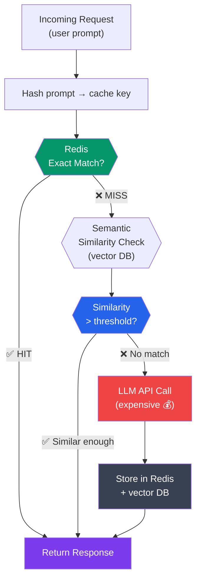

# Caching Strategies for LLM-Powered Applications

## Why Caching Is Critical for AI Backends

A typical API call costs fractions of a cent. A GPT-4o call costs 1-5 cents.
If 100 users ask the same question, that is 100 identical LLM calls at $1-5 total,
plus 100x the latency. Caching a single response saves both money and time.

**The math:**
- GPT-4o: ~$5 per 1M input tokens, ~$15 per 1M output tokens
- Average response: ~500 tokens = ~$0.0075
- 10,000 similar requests/day = $75/day = $2,250/month
- With caching at 60% hit rate: $900/month saved

---

## 1. Redis with Python vs Node.js

### redis-py (Sync and Async)

```python
# Sync client -- similar to ioredis in Node.js
import redis

r = redis.Redis(host="localhost", port=6379, db=0, decode_responses=True)
r.set("key", "value", ex=3600)  # ex = expiry in seconds
value = r.get("key")


# Async client -- what you'll use with FastAPI
import redis.asyncio as aioredis

redis_client = aioredis.from_url(
    "redis://localhost:6379/0",
    encoding="utf-8",
    decode_responses=True,
)

async def example():
    await redis_client.set("key", "value", ex=3600)
    value = await redis_client.get("key")

    # Pipeline (batch commands) -- same concept as ioredis pipeline
    async with redis_client.pipeline(transaction=True) as pipe:
        await pipe.set("a", "1")
        await pipe.set("b", "2")
        await pipe.execute()
```

```typescript
// ioredis equivalent in Node.js
import Redis from 'ioredis';

const redis = new Redis({ host: 'localhost', port: 6379 });
await redis.set('key', 'value', 'EX', 3600);
const value = await redis.get('key');

// Pipeline
const pipeline = redis.pipeline();
pipeline.set('a', '1');
pipeline.set('b', '2');
await pipeline.exec();
```

### Redis Connection in FastAPI

```python
# src/core/redis.py
import redis.asyncio as aioredis
from src.core.config import settings

# Connection pool (like ioredis connection pool)
redis_pool = aioredis.ConnectionPool.from_url(
    settings.REDIS_URL,
    max_connections=20,
    decode_responses=True,
)


def get_redis() -> aioredis.Redis:
    """Dependency for FastAPI routes."""
    return aioredis.Redis(connection_pool=redis_pool)


async def close_redis():
    """Call during app shutdown."""
    await redis_pool.disconnect()
```

---

## 2. Caching Strategies for LLM Applications



### Strategy 1: Exact Match LLM Response Cache

The simplest approach -- cache the exact prompt-response pair.

```python
# src/services/cache/llm_cache.py
import hashlib
import json
import structlog
import redis.asyncio as aioredis

logger = structlog.get_logger(__name__)


class LLMResponseCache:
    """
    Cache LLM responses by exact prompt match.

    Node.js equivalent: a Redis wrapper with JSON serialization,
    similar to what you'd build with ioredis + a custom class.
    """

    def __init__(self, redis: aioredis.Redis, prefix: str = "llm", ttl: int = 3600):
        self.redis = redis
        self.prefix = prefix
        self.ttl = ttl

    def _make_key(self, model: str, prompt: str, **params) -> str:
        """Create a deterministic cache key from the prompt and parameters."""
        payload = json.dumps(
            {"model": model, "prompt": prompt, **params},
            sort_keys=True,
        )
        hash_val = hashlib.sha256(payload.encode()).hexdigest()[:16]
        return f"{self.prefix}:{model}:{hash_val}"

    async def get(self, model: str, prompt: str, **params) -> dict | None:
        key = self._make_key(model, prompt, **params)
        cached = await self.redis.get(key)
        if cached:
            logger.info("LLM cache hit", cache_key=key)
            return json.loads(cached)
        logger.debug("LLM cache miss", cache_key=key)
        return None

    async def set(
        self,
        model: str,
        prompt: str,
        response: dict,
        ttl: int | None = None,
        **params,
    ) -> None:
        key = self._make_key(model, prompt, **params)
        await self.redis.set(
            key,
            json.dumps(response),
            ex=ttl or self.ttl,
        )
        logger.debug("LLM response cached", cache_key=key, ttl=ttl or self.ttl)

    async def invalidate(self, model: str, prompt: str, **params) -> None:
        key = self._make_key(model, prompt, **params)
        await self.redis.delete(key)
```

### Using the Cache in a Service

```python
# src/services/chat_service.py
class ChatService:
    def __init__(self, llm, cache: LLMResponseCache):
        self.llm = llm
        self.cache = cache

    async def get_response(self, prompt: str) -> str:
        # Check cache first
        cached = await self.cache.get(model="gpt-4o", prompt=prompt)
        if cached:
            return cached["content"]

        # Call LLM
        response = await self.llm.ainvoke(prompt)

        # Cache the result
        await self.cache.set(
            model="gpt-4o",
            prompt=prompt,
            response={
                "content": response.content,
                "tokens": response.usage_metadata.get("total_tokens", 0),
            },
            ttl=3600,
        )
        return response.content
```

### Strategy 2: Semantic Cache

Exact match misses "What is Python?" vs "Tell me about Python". Semantic caching
uses embeddings to find similar-enough cached prompts.

```python
# src/services/cache/semantic_cache.py
import json
import numpy as np
import structlog
import redis.asyncio as aioredis
from langchain_openai import OpenAIEmbeddings

logger = structlog.get_logger(__name__)


class SemanticCache:
    """
    Cache LLM responses with semantic similarity matching.
    Uses embeddings to find cached responses for similar (not identical) prompts.

    For production, consider using Redis Vector Search (RediSearch) or
    a dedicated vector DB instead of this brute-force approach.
    """

    def __init__(
        self,
        redis: aioredis.Redis,
        embeddings: OpenAIEmbeddings,
        similarity_threshold: float = 0.95,
        ttl: int = 3600,
    ):
        self.redis = redis
        self.embeddings = embeddings
        self.threshold = similarity_threshold
        self.ttl = ttl

    async def get(self, prompt: str) -> dict | None:
        """Find a semantically similar cached prompt."""
        query_embedding = await self.embeddings.aembed_query(prompt)

        # Get all cached entries (in production, use Redis Vector Search)
        keys = await self.redis.keys("semantic_cache:*")
        if not keys:
            return None

        for key in keys:
            cached = await self.redis.get(key)
            if not cached:
                continue
            entry = json.loads(cached)
            similarity = self._cosine_similarity(
                query_embedding, entry["embedding"]
            )
            if similarity >= self.threshold:
                logger.info(
                    "Semantic cache hit",
                    similarity=round(similarity, 4),
                    original_prompt=entry["prompt"][:50],
                )
                return entry["response"]

        return None

    async def set(self, prompt: str, response: dict) -> None:
        embedding = await self.embeddings.aembed_query(prompt)
        import hashlib
        key = f"semantic_cache:{hashlib.sha256(prompt.encode()).hexdigest()[:16]}"
        await self.redis.set(
            key,
            json.dumps({
                "prompt": prompt,
                "embedding": embedding,
                "response": response,
            }),
            ex=self.ttl,
        )

    @staticmethod
    def _cosine_similarity(a: list[float], b: list[float]) -> float:
        a_arr, b_arr = np.array(a), np.array(b)
        return float(np.dot(a_arr, b_arr) / (np.linalg.norm(a_arr) * np.linalg.norm(b_arr)))
```

### Strategy 3: Embedding Cache

Embeddings are deterministic -- the same text always produces the same embedding.
Cache them aggressively.

```python
# src/services/cache/embedding_cache.py
import hashlib
import json
import redis.asyncio as aioredis
from langchain_openai import OpenAIEmbeddings


class CachedEmbeddings:
    """
    Wraps OpenAIEmbeddings with a Redis cache.
    Embedding API calls are deterministic so they can be cached indefinitely.

    Cost savings example:
    - Embedding 1000 documents: ~$0.01 per call
    - Re-indexing 10 times during development: $0.10 vs $0.01 with cache
    - At scale: embedding 1M documents = $10.00, cache saves repeated costs
    """

    def __init__(self, redis: aioredis.Redis, model: str = "text-embedding-3-small"):
        self.redis = redis
        self.base = OpenAIEmbeddings(model=model)
        self.model = model

    async def aembed_documents(self, texts: list[str]) -> list[list[float]]:
        results: list[list[float] | None] = [None] * len(texts)
        uncached_indices: list[int] = []
        uncached_texts: list[str] = []

        # Check cache for each text
        for i, text in enumerate(texts):
            key = self._cache_key(text)
            cached = await self.redis.get(key)
            if cached:
                results[i] = json.loads(cached)
            else:
                uncached_indices.append(i)
                uncached_texts.append(text)

        # Embed only uncached texts
        if uncached_texts:
            new_embeddings = await self.base.aembed_documents(uncached_texts)
            pipe = self.redis.pipeline()
            for idx, embedding in zip(uncached_indices, new_embeddings):
                results[idx] = embedding
                key = self._cache_key(uncached_texts[uncached_indices.index(idx)])
                # Cache embeddings for 7 days (they're deterministic)
                pipe.set(key, json.dumps(embedding), ex=604_800)
            await pipe.execute()

        return results  # type: ignore

    def _cache_key(self, text: str) -> str:
        h = hashlib.sha256(text.encode()).hexdigest()[:16]
        return f"emb:{self.model}:{h}"
```

---

## 3. LangChain Built-in Cache Integration

LangChain has native caching support. This is the easiest way to get started.

```python
# src/core/llm_cache.py
from langchain_core.globals import set_llm_cache
from langchain_community.cache import InMemoryCache, RedisCache
import redis

from src.core.config import settings


def setup_llm_cache() -> None:
    """
    Configure LangChain's global LLM cache.

    Every LLM call through LangChain will automatically check
    this cache before making an API call.
    """
    if settings.ENVIRONMENT == "development":
        # In-memory cache -- fast, lost on restart
        set_llm_cache(InMemoryCache())
    else:
        # Redis cache -- shared across workers, survives restarts
        redis_client = redis.from_url(settings.REDIS_URL)
        set_llm_cache(RedisCache(redis_client, ttl=settings.LLM_CACHE_TTL))


# That's it! Now all LangChain LLM calls are cached:
from langchain_openai import ChatOpenAI

llm = ChatOpenAI(model="gpt-4o")
# First call: hits OpenAI API
response1 = await llm.ainvoke("What is Python?")
# Second call with same input: returns cached response instantly
response2 = await llm.ainvoke("What is Python?")
```

---

## 4. FastAPI Response Caching

For API responses (not just LLM calls), use HTTP-level caching.

```python
# src/api/middleware/cache.py
import hashlib
import json
import structlog
from functools import wraps
from typing import Callable

import redis.asyncio as aioredis
from fastapi import Request, Response

logger = structlog.get_logger(__name__)


def cache_response(
    ttl: int = 60,
    key_builder: Callable[[Request], str] | None = None,
):
    """
    Decorator to cache FastAPI route responses in Redis.

    Similar to apicache or route-cache middleware in Express.

    Usage:
        @router.get("/documents/{doc_id}/summary")
        @cache_response(ttl=3600)
        async def get_summary(doc_id: str, redis: RedisDep):
            ...
    """
    def decorator(func):
        @wraps(func)
        async def wrapper(*args, **kwargs):
            request: Request = kwargs.get("request") or args[0]
            redis_client: aioredis.Redis = kwargs.get("redis")

            if not redis_client:
                return await func(*args, **kwargs)

            # Build cache key
            if key_builder:
                cache_key = key_builder(request)
            else:
                cache_key = f"api:{request.method}:{request.url.path}:{request.url.query}"

            # Check cache
            cached = await redis_client.get(cache_key)
            if cached:
                logger.debug("API cache hit", key=cache_key)
                return Response(
                    content=cached,
                    media_type="application/json",
                    headers={"X-Cache": "HIT"},
                )

            # Execute route
            response = await func(*args, **kwargs)

            # Cache the response
            response_json = json.dumps(response) if isinstance(response, dict) else response
            await redis_client.set(cache_key, response_json, ex=ttl)
            logger.debug("API response cached", key=cache_key, ttl=ttl)

            return response

        return wrapper
    return decorator
```

---

## 5. functools.lru_cache and @cache

Python has built-in function-level caching -- no external library needed.

```python
from functools import lru_cache, cache


# lru_cache: keeps the N most recent results
@lru_cache(maxsize=128)
def get_prompt_template(template_name: str) -> str:
    """
    Load and cache prompt templates. Since templates don't change
    at runtime, we can cache them in memory.

    Node.js equivalent: a simple Map or object used as a cache.
    """
    with open(f"prompts/{template_name}.txt") as f:
        return f.read()


# cache (Python 3.9+): unlimited cache, same as lru_cache(maxsize=None)
@cache
def compute_token_cost(model: str, input_tokens: int, output_tokens: int) -> float:
    """Pure function -- deterministic, safe to cache forever."""
    rates = {
        "gpt-4o": {"input": 5.0, "output": 15.0},
        "gpt-4o-mini": {"input": 0.15, "output": 0.6},
    }
    r = rates.get(model, rates["gpt-4o"])
    return (input_tokens * r["input"] + output_tokens * r["output"]) / 1_000_000


# For async functions, lru_cache doesn't work -- use a library or manual cache
from async_lru import alru_cache  # pip install async-lru

@alru_cache(maxsize=64)
async def get_user_preferences(user_id: str) -> dict:
    """Cache user preferences to avoid repeated DB lookups."""
    async with get_db() as db:
        return await db.get_user_prefs(user_id)
```

```typescript
// Node.js -- no built-in equivalent, manual implementation:
const cache = new Map<string, string>();
function getPromptTemplate(name: string): string {
  if (cache.has(name)) return cache.get(name)!;
  const content = fs.readFileSync(`prompts/${name}.txt`, 'utf-8');
  cache.set(name, content);
  return content;
}
```

### Important: lru_cache Gotchas

```python
# WRONG -- mutable default arguments are cached by reference
@lru_cache(maxsize=128)
def process(data: dict):   # dicts are not hashable -- this raises TypeError
    pass

# RIGHT -- use frozen/hashable types
@lru_cache(maxsize=128)
def process(data: tuple):  # tuples are hashable
    pass

# To clear the cache:
get_prompt_template.cache_clear()

# To see cache stats:
info = get_prompt_template.cache_info()
# CacheInfo(hits=42, misses=7, maxsize=128, currsize=7)
```

---

## 6. Cache Invalidation Strategies

Cache invalidation is one of the hardest problems in computer science.
Here are practical strategies for LLM apps.

```python
# src/services/cache/invalidation.py
import redis.asyncio as aioredis
import structlog

logger = structlog.get_logger(__name__)


class CacheManager:
    """
    Centralized cache management with invalidation strategies.
    """

    def __init__(self, redis: aioredis.Redis):
        self.redis = redis

    # ── Strategy 1: TTL-based (Time to Live) ────────────
    # Set at write time. Already shown above. Best for:
    # - LLM responses (cache for 1-24 hours)
    # - API responses (cache for 1-60 minutes)
    # - Embeddings (cache for days/weeks)

    # ── Strategy 2: Event-based invalidation ────────────
    async def invalidate_on_document_update(self, document_id: str) -> None:
        """
        When a document is updated, invalidate all related caches:
        - Embedding cache for the document
        - Summary cache
        - Any RAG responses that used this document
        """
        patterns = [
            f"emb:*:{document_id}:*",
            f"summary:{document_id}",
            f"rag:*:doc:{document_id}",
        ]
        for pattern in patterns:
            keys = []
            async for key in self.redis.scan_iter(match=pattern, count=100):
                keys.append(key)
            if keys:
                await self.redis.delete(*keys)
                logger.info(
                    "Cache invalidated",
                    pattern=pattern,
                    keys_deleted=len(keys),
                )

    # ── Strategy 3: Version-based invalidation ──────────
    async def set_with_version(
        self, key: str, value: str, version: int, ttl: int = 3600
    ) -> None:
        """Include version in key -- deploy a new version to invalidate all."""
        versioned_key = f"v{version}:{key}"
        await self.redis.set(versioned_key, value, ex=ttl)

    async def get_with_version(self, key: str, version: int) -> str | None:
        versioned_key = f"v{version}:{key}"
        return await self.redis.get(versioned_key)

    # ── Strategy 4: Tag-based invalidation ──────────────
    async def set_with_tags(
        self, key: str, value: str, tags: list[str], ttl: int = 3600
    ) -> None:
        """Associate cache entries with tags for group invalidation."""
        pipe = self.redis.pipeline()
        pipe.set(key, value, ex=ttl)
        for tag in tags:
            pipe.sadd(f"tag:{tag}", key)
            pipe.expire(f"tag:{tag}", ttl)
        await pipe.execute()

    async def invalidate_by_tag(self, tag: str) -> int:
        """Delete all cache entries with a specific tag."""
        tag_key = f"tag:{tag}"
        members = await self.redis.smembers(tag_key)
        if members:
            await self.redis.delete(*members, tag_key)
            logger.info("Tag invalidation", tag=tag, keys_deleted=len(members))
            return len(members)
        return 0
```

### When to Use Each Strategy

| Strategy | Use Case | Example |
|----------|----------|---------|
| TTL | Data that naturally expires | LLM responses, API data |
| Event-based | Data tied to source changes | Document embeddings after doc edit |
| Version-based | Deploy-time invalidation | Prompt template changes |
| Tag-based | Related data groups | All caches for a user or project |

---

## 7. Cost Optimization: When to Cache

```python
# src/services/cache/cost_tracker.py
import structlog

logger = structlog.get_logger(__name__)


class CacheCostTracker:
    """
    Track cache hit/miss rates and estimate cost savings.
    Useful for justifying caching infrastructure to management.
    """

    def __init__(self, redis):
        self.redis = redis

    async def record_hit(self, model: str, estimated_tokens: int) -> None:
        """Record a cache hit and the tokens it saved."""
        pipe = self.redis.pipeline()
        pipe.incr("cache:stats:hits")
        pipe.incr("cache:stats:tokens_saved", estimated_tokens)
        await pipe.execute()

    async def record_miss(self, model: str, actual_tokens: int) -> None:
        pipe = self.redis.pipeline()
        pipe.incr("cache:stats:misses")
        pipe.incr("cache:stats:tokens_used", actual_tokens)
        await pipe.execute()

    async def get_stats(self) -> dict:
        hits = int(await self.redis.get("cache:stats:hits") or 0)
        misses = int(await self.redis.get("cache:stats:misses") or 0)
        tokens_saved = int(await self.redis.get("cache:stats:tokens_saved") or 0)
        total = hits + misses

        # Approximate cost savings (GPT-4o rates)
        cost_saved = tokens_saved * 10 / 1_000_000  # ~$10/1M tokens blended

        return {
            "hits": hits,
            "misses": misses,
            "hit_rate": hits / total if total > 0 else 0,
            "tokens_saved": tokens_saved,
            "estimated_cost_saved_usd": round(cost_saved, 2),
        }


# ── Decision framework: what to cache ──────────────────

CACHING_DECISION_GUIDE = """
Cache aggressively:
  - Embeddings (deterministic, expensive at scale)
  - Summarizations of static documents
  - Classification results for unchanged inputs
  - Prompt templates and system prompts

Cache with short TTL (5-60 min):
  - Search/RAG results (source data might change)
  - API response aggregations

Cache with long TTL (1-24 hours):
  - LLM responses for common questions (FAQ-like)
  - Generated reports

Do NOT cache:
  - Conversational responses (context-dependent)
  - Creative generation (users expect variety)
  - Real-time data lookups
  - Anything involving user-specific private data (unless per-user cache)
"""
```

---

## 8. Complete Caching Integration Example

```python
# src/services/chat_service.py (with caching integrated)
import structlog
from src.services.cache.llm_cache import LLMResponseCache
from src.services.cache.cost_tracker import CacheCostTracker

logger = structlog.get_logger(__name__)


class ChatService:
    def __init__(self, llm, cache: LLMResponseCache, cost_tracker: CacheCostTracker):
        self.llm = llm
        self.cache = cache
        self.cost_tracker = cost_tracker

    async def answer_question(self, question: str) -> dict:
        """
        Answer a question with caching and cost tracking.
        """
        # 1. Check cache
        cached = await self.cache.get(model="gpt-4o", prompt=question)
        if cached:
            await self.cost_tracker.record_hit(
                model="gpt-4o",
                estimated_tokens=cached.get("tokens", 500),
            )
            return {
                "answer": cached["content"],
                "cached": True,
                "tokens_used": 0,
            }

        # 2. Call LLM
        response = await self.llm.ainvoke(question)
        tokens = response.usage_metadata.get("total_tokens", 0)

        # 3. Cache the response
        await self.cache.set(
            model="gpt-4o",
            prompt=question,
            response={"content": response.content, "tokens": tokens},
            ttl=3600,
        )

        # 4. Track cost
        await self.cost_tracker.record_miss(model="gpt-4o", actual_tokens=tokens)

        logger.info(
            "Question answered",
            tokens_used=tokens,
            cached=False,
        )

        return {
            "answer": response.content,
            "cached": False,
            "tokens_used": tokens,
        }
```

---

## 9. Practice Exercises

### Exercise 1: Redis Basics
Set up a Redis connection with `redis.asyncio` and write an async function that:
1. Stores a JSON object with a 60-second TTL
2. Retrieves it and parses it back to a dict
3. Checks if a key exists before getting it
4. Deletes a key
5. Uses a pipeline to set 5 keys in one round-trip

Compare the API to `ioredis` -- write the same operations in Node.js side by side.

### Exercise 2: LLM Response Cache
Build a complete `LLMResponseCache` class that:
1. Generates deterministic cache keys from (model, prompt, temperature, max_tokens)
2. Serializes responses to JSON for storage
3. Tracks hit/miss counts
4. Has a `clear_by_model(model_name)` method that removes all cache entries for a model
5. Exposes cache statistics via a `stats()` method

Write tests using `fakeredis` (a Redis mock library).

### Exercise 3: Smart Cache Decorator
Create a `@cached` decorator that works on any async function:

```python
@cached(ttl=300, key_prefix="summary")
async def summarize_document(doc_id: str) -> str:
    # expensive LLM call
    ...
```

The decorator should:
- Auto-generate cache keys from function name + arguments
- Support TTL configuration
- Support cache bypass with a `skip_cache=True` parameter
- Log cache hits and misses

### Exercise 4: Cache Invalidation
Build a document processing system where:
1. Documents are embedded and cached
2. Summaries are generated and cached
3. When a document is updated, both caches are invalidated
4. Implement tag-based invalidation: each document's caches are tagged with `doc:{id}`

Write a test that verifies: upload doc -> cache embedding -> update doc -> old cache gone.

### Exercise 5: Cost Dashboard
Create a FastAPI endpoint `GET /admin/cache-stats` that returns:
- Total cache hits and misses
- Hit rate percentage
- Estimated tokens saved
- Estimated cost saved (in USD)
- Top 10 most frequently cached prompts

Use the `CacheCostTracker` from the example above and extend it.

### Exercise 6: Benchmark
Write a benchmark script that:
1. Sends 100 identical requests to your API
2. Measures latency for cached vs uncached responses
3. Calculates the speedup factor
4. Estimates monthly cost savings at 10,000 requests/day

Compare the results with and without caching enabled.
