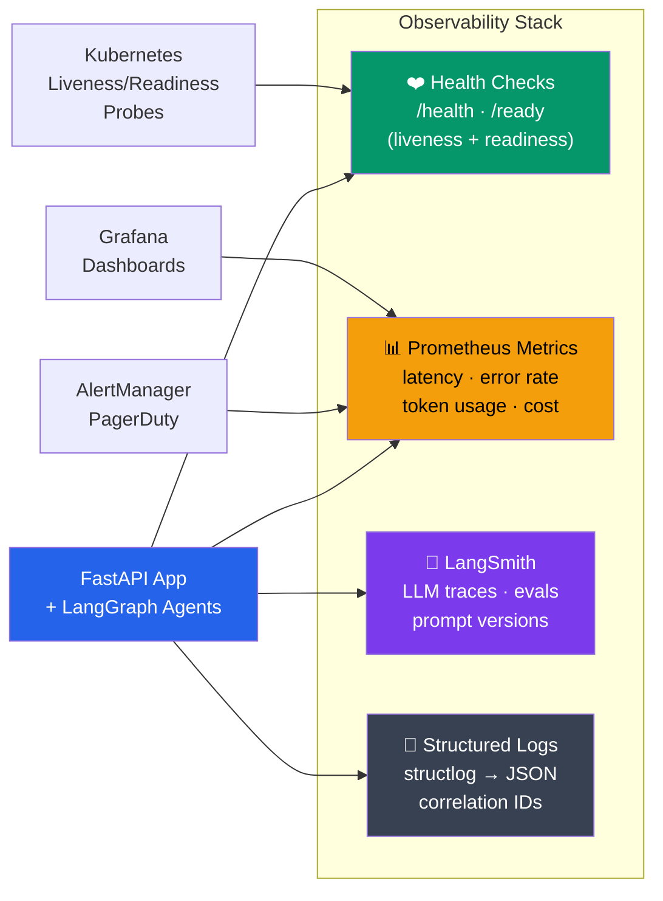

# Monitoring, Observability, and LLM-Specific Metrics

## Why Standard Monitoring Is Not Enough for AI Apps

A traditional backend needs monitoring for latency, error rates, and throughput.
An AI backend also needs monitoring for:
- **LLM costs** (you can burn through $1000 in minutes with a bug)
- **Token usage** (hitting rate limits degrades all users)
- **Agent behavior** (infinite loops, hallucinations, tool failures)
- **Response quality** (was the answer actually correct?)

This guide covers all four layers: health checks, metrics, tracing, and LLM-specific observability.



---

## 1. Health Check Endpoints

Every production application needs at minimum two health endpoints.

```python
# src/api/v1/health.py
import time
import structlog
from fastapi import APIRouter, Depends
from sqlalchemy import text
from sqlalchemy.ext.asyncio import AsyncSession

from src.api.deps import get_db
from src.core.config import settings

router = APIRouter(tags=["Health"])
logger = structlog.get_logger(__name__)

# Track startup time for uptime reporting
_start_time = time.time()


@router.get("/health")
async def health():
    """
    Liveness probe: Is the process alive?

    Kubernetes uses this to decide whether to restart the pod.
    Keep it lightweight -- no external calls.

    Node.js equivalent:
        app.get('/health', (req, res) => res.json({ status: 'ok' }));
    """
    return {
        "status": "ok",
        "version": settings.VERSION,
        "uptime_seconds": round(time.time() - _start_time),
    }


@router.get("/ready")
async def readiness(db: AsyncSession = Depends(get_db)):
    """
    Readiness probe: Can this instance handle requests?

    Kubernetes uses this to decide whether to route traffic to the pod.
    Check all critical dependencies.
    """
    checks: dict[str, dict] = {}

    # Database check
    try:
        start = time.monotonic()
        await db.execute(text("SELECT 1"))
        elapsed = (time.monotonic() - start) * 1000
        checks["database"] = {"status": "ok", "latency_ms": round(elapsed, 1)}
    except Exception as e:
        checks["database"] = {"status": "error", "error": str(e)}

    # Redis check
    try:
        from src.core.redis import get_redis
        redis = get_redis()
        start = time.monotonic()
        await redis.ping()
        elapsed = (time.monotonic() - start) * 1000
        checks["redis"] = {"status": "ok", "latency_ms": round(elapsed, 1)}
    except Exception as e:
        checks["redis"] = {"status": "error", "error": str(e)}

    # LLM API check (lightweight -- don't actually call the model)
    try:
        import httpx
        async with httpx.AsyncClient(timeout=5.0) as client:
            resp = await client.get("https://api.openai.com/v1/models",
                                     headers={"Authorization": f"Bearer {settings.OPENAI_API_KEY}"})
            checks["llm_api"] = {
                "status": "ok" if resp.status_code == 200 else "degraded",
                "status_code": resp.status_code,
            }
    except Exception as e:
        checks["llm_api"] = {"status": "error", "error": str(e)}

    all_ok = all(c["status"] == "ok" for c in checks.values())
    status_code = 200 if all_ok else 503

    from fastapi.responses import JSONResponse
    return JSONResponse(
        status_code=status_code,
        content={
            "status": "ready" if all_ok else "not_ready",
            "checks": checks,
            "version": settings.VERSION,
            "environment": settings.ENVIRONMENT,
        },
    )
```

```typescript
// Node.js equivalent with Express
app.get('/health', (req, res) => {
  res.json({ status: 'ok', version: process.env.VERSION });
});

app.get('/ready', async (req, res) => {
  const checks: Record<string, any> = {};
  try {
    await db.query('SELECT 1');
    checks.database = { status: 'ok' };
  } catch (e) {
    checks.database = { status: 'error', error: e.message };
  }
  const allOk = Object.values(checks).every(c => c.status === 'ok');
  res.status(allOk ? 200 : 503).json({ status: allOk ? 'ready' : 'not_ready', checks });
});
```

---

## 2. Prometheus Metrics

### prometheus-fastapi-instrumentator

This library automatically instruments FastAPI with Prometheus metrics -- similar
to `express-prometheus-middleware` or `prom-client` in Node.js.

```python
# src/core/metrics.py
from prometheus_fastapi_instrumentator import Instrumentator
from prometheus_client import Counter, Histogram, Gauge


# ── Auto-instrumentation ────────────────────────────────
instrumentator = Instrumentator(
    should_group_status_codes=True,     # Group 2xx, 3xx, etc.
    should_ignore_untemplated=True,     # Ignore unknown routes
    should_respect_env_var=False,       # Always enable
    excluded_handlers=["/health", "/ready", "/metrics"],
    inprogress_name="http_requests_inprogress",
    inprogress_labels=True,
)


# ── Custom LLM Metrics ──────────────────────────────────

# How many LLM calls are we making?
llm_calls_total = Counter(
    "llm_calls_total",
    "Total number of LLM API calls",
    ["model", "status"],  # Labels: model name, success/failure
)

# How long do LLM calls take?
llm_call_duration_seconds = Histogram(
    "llm_call_duration_seconds",
    "LLM API call duration in seconds",
    ["model"],
    buckets=[0.5, 1.0, 2.0, 5.0, 10.0, 30.0, 60.0, 120.0],
)

# How many tokens are we using?
llm_tokens_total = Counter(
    "llm_tokens_total",
    "Total tokens consumed",
    ["model", "token_type"],  # token_type: prompt, completion
)

# Estimated cost tracking
llm_cost_usd_total = Counter(
    "llm_cost_usd_total",
    "Estimated cumulative LLM cost in USD",
    ["model"],
)

# Active agent executions
agent_executions_active = Gauge(
    "agent_executions_active",
    "Number of agent executions currently running",
    ["agent_name"],
)

# Agent iteration count (to detect infinite loops)
agent_iterations = Histogram(
    "agent_iterations_total",
    "Number of iterations per agent execution",
    ["agent_name"],
    buckets=[1, 2, 3, 5, 10, 15, 20, 50],
)

# Cache metrics
cache_hits_total = Counter(
    "cache_hits_total",
    "Total cache hits",
    ["cache_type"],  # llm, embedding, api
)

cache_misses_total = Counter(
    "cache_misses_total",
    "Total cache misses",
    ["cache_type"],
)

# Tool execution metrics
tool_calls_total = Counter(
    "tool_calls_total",
    "Total tool calls by agents",
    ["tool_name", "status"],
)

tool_call_duration_seconds = Histogram(
    "tool_call_duration_seconds",
    "Tool execution duration",
    ["tool_name"],
    buckets=[0.1, 0.5, 1.0, 2.0, 5.0, 10.0, 30.0],
)


def setup_metrics(app):
    """Call during app startup."""
    instrumentator.instrument(app).expose(app, endpoint="/metrics")
```

### Using Metrics in Application Code

```python
# src/services/llm_service.py
import time
import structlog
from src.core.metrics import (
    llm_calls_total,
    llm_call_duration_seconds,
    llm_tokens_total,
    llm_cost_usd_total,
)

logger = structlog.get_logger(__name__)

# Cost per 1M tokens (update as pricing changes)
TOKEN_COSTS = {
    "gpt-4o": {"input": 5.00, "output": 15.00},
    "gpt-4o-mini": {"input": 0.15, "output": 0.60},
    "gpt-4-turbo": {"input": 10.00, "output": 30.00},
}


class InstrumentedLLMService:
    """LLM service with Prometheus metrics instrumentation."""

    def __init__(self, model: str = "gpt-4o"):
        self.model = model

    async def invoke(self, prompt: str) -> dict:
        start = time.monotonic()

        try:
            response = await self._call_llm(prompt)
            elapsed = time.monotonic() - start

            # Record metrics
            llm_calls_total.labels(model=self.model, status="success").inc()
            llm_call_duration_seconds.labels(model=self.model).observe(elapsed)

            # Token metrics
            usage = response.get("usage", {})
            prompt_tokens = usage.get("prompt_tokens", 0)
            completion_tokens = usage.get("completion_tokens", 0)

            llm_tokens_total.labels(
                model=self.model, token_type="prompt"
            ).inc(prompt_tokens)
            llm_tokens_total.labels(
                model=self.model, token_type="completion"
            ).inc(completion_tokens)

            # Cost tracking
            costs = TOKEN_COSTS.get(self.model, TOKEN_COSTS["gpt-4o"])
            cost = (
                prompt_tokens * costs["input"] +
                completion_tokens * costs["output"]
            ) / 1_000_000
            llm_cost_usd_total.labels(model=self.model).inc(cost)

            logger.info(
                "LLM call completed",
                model=self.model,
                latency_s=round(elapsed, 2),
                prompt_tokens=prompt_tokens,
                completion_tokens=completion_tokens,
                cost_usd=round(cost, 6),
            )

            return response

        except Exception as e:
            elapsed = time.monotonic() - start
            llm_calls_total.labels(model=self.model, status="error").inc()
            llm_call_duration_seconds.labels(model=self.model).observe(elapsed)
            raise

    async def _call_llm(self, prompt: str) -> dict:
        """Actual LLM call -- implement with your preferred client."""
        ...
```

```typescript
// Node.js prom-client equivalent
import { Counter, Histogram, register } from 'prom-client';

const llmCallsTotal = new Counter({
  name: 'llm_calls_total',
  help: 'Total LLM API calls',
  labelNames: ['model', 'status'],
});

const llmDuration = new Histogram({
  name: 'llm_call_duration_seconds',
  help: 'LLM call duration',
  labelNames: ['model'],
  buckets: [0.5, 1, 2, 5, 10, 30, 60],
});

// Usage
const end = llmDuration.startTimer({ model: 'gpt-4o' });
const result = await llm.invoke(prompt);
end();
llmCallsTotal.inc({ model: 'gpt-4o', status: 'success' });

// Expose metrics
app.get('/metrics', async (req, res) => {
  res.set('Content-Type', register.contentType);
  res.end(await register.metrics());
});
```

---

## 3. LangSmith for LLM Observability

LangSmith is LangChain's observability platform. Think of it as Datadog specifically
designed for LLM applications. It traces every LLM call, tool use, and chain execution.

### Setup

```python
# src/core/langsmith.py
import os
from src.core.config import settings


def setup_langsmith() -> None:
    """
    Configure LangSmith tracing.

    Once configured, ALL LangChain/LangGraph calls are automatically
    traced -- no code changes needed in your agents or chains.
    """
    if not settings.LANGSMITH_API_KEY:
        return

    os.environ["LANGCHAIN_TRACING_V2"] = "true"
    os.environ["LANGCHAIN_API_KEY"] = settings.LANGSMITH_API_KEY
    os.environ["LANGCHAIN_PROJECT"] = settings.LANGSMITH_PROJECT
    os.environ["LANGCHAIN_ENDPOINT"] = "https://api.smith.langchain.com"


# Call in main.py lifespan:
# setup_langsmith()
```

### Custom Tracing with LangSmith

```python
# src/services/chat_service.py
from langsmith import traceable
from langsmith.run_helpers import get_current_run_tree


class ChatService:

    @traceable(
        name="process_chat_message",
        run_type="chain",
        tags=["production", "chat"],
    )
    async def process_message(self, user_id: str, message: str) -> dict:
        """
        The @traceable decorator sends this function's execution trace
        to LangSmith, including:
        - Input arguments
        - Output value
        - Duration
        - Any nested LLM/tool calls
        - Errors (if any)

        This is like adding a span to a distributed trace,
        but specifically designed for LLM workflows.
        """

        # Add metadata to the current trace
        run = get_current_run_tree()
        if run:
            run.metadata = {
                "user_id": user_id,
                "message_length": len(message),
                "environment": "production",
            }

        # All LangChain calls inside this function are automatically
        # nested under this trace
        result = await self.agent.invoke(message)

        return {
            "reply": result.content,
            "tokens": result.usage_metadata.get("total_tokens", 0),
        }
```

### What LangSmith Shows You

```
Trace: process_chat_message (2.3s)
├── ChatOpenAI.invoke (1.8s)
│   ├── Input: "Research the latest on quantum computing"
│   ├── Output: "I'll search for recent information..."
│   ├── Model: gpt-4o
│   ├── Tokens: 1,234
│   └── Cost: $0.0185
├── Tool: web_search (0.3s)
│   ├── Input: {"query": "quantum computing 2025 breakthroughs"}
│   └── Output: [3 results]
├── ChatOpenAI.invoke (1.2s)
│   ├── Input: [system + user + tool results]
│   ├── Output: "Based on recent developments..."
│   ├── Tokens: 2,100
│   └── Cost: $0.0315
└── Total Cost: $0.0500
```

### Evaluations with LangSmith

```python
# scripts/run_eval.py
"""
Run LLM evaluations against a test dataset.
This is how you measure whether your prompts and agents are improving.
"""
from langsmith import Client
from langsmith.evaluation import evaluate


client = Client()

# Create or load a dataset
dataset = client.create_dataset("qa-test-cases")
client.create_examples(
    inputs=[
        {"question": "What is Python?"},
        {"question": "Explain async/await"},
        {"question": "What is a decorator?"},
    ],
    outputs=[
        {"answer": "Python is a programming language..."},
        {"answer": "async/await is a pattern for asynchronous..."},
        {"answer": "A decorator is a function that modifies..."},
    ],
    dataset_id=dataset.id,
)


# Define what you're evaluating
async def target(inputs: dict) -> dict:
    """The function under evaluation."""
    from src.services.chat_service import ChatService
    service = ChatService()
    result = await service.process_message("eval_user", inputs["question"])
    return {"answer": result["reply"]}


# Run evaluation
results = evaluate(
    target,
    data=dataset.name,
    evaluators=[
        "qa",           # Built-in QA correctness evaluator
        "relevance",    # Is the response relevant to the question?
    ],
    experiment_prefix="v2-prompt-update",
    max_concurrency=4,
)

print(f"Results: {results}")
```

---

## 4. OpenTelemetry

OpenTelemetry (OTel) is the vendor-neutral standard for observability.
It works the same way in Python and Node.js.

### Setup

```python
# src/core/telemetry.py
from opentelemetry import trace, metrics
from opentelemetry.sdk.trace import TracerProvider
from opentelemetry.sdk.trace.export import BatchSpanProcessor
from opentelemetry.sdk.metrics import MeterProvider
from opentelemetry.sdk.metrics.export import PeriodicExportingMetricReader
from opentelemetry.sdk.resources import Resource
from opentelemetry.exporter.otlp.proto.grpc.trace_exporter import OTLPSpanExporter
from opentelemetry.exporter.otlp.proto.grpc.metric_exporter import OTLPMetricExporter
from opentelemetry.instrumentation.fastapi import FastAPIInstrumentor
from opentelemetry.instrumentation.httpx import HTTPXClientInstrumentor
from opentelemetry.instrumentation.sqlalchemy import SQLAlchemyInstrumentor
from opentelemetry.instrumentation.redis import RedisInstrumentor

from src.core.config import settings


def setup_telemetry(app) -> None:
    """
    Configure OpenTelemetry for traces, metrics, and logs.

    Equivalent Node.js setup:
        const { NodeTracerProvider } = require('@opentelemetry/sdk-trace-node');
        const { registerInstrumentations } = require('@opentelemetry/instrumentation');
    """
    if settings.ENVIRONMENT == "development":
        return  # Skip in development, use LangSmith instead

    resource = Resource.create({
        "service.name": settings.PROJECT_NAME,
        "service.version": settings.VERSION,
        "deployment.environment": settings.ENVIRONMENT,
    })

    # ── Tracing ──────────────────────────────────────────
    tracer_provider = TracerProvider(resource=resource)
    tracer_provider.add_span_processor(
        BatchSpanProcessor(
            OTLPSpanExporter(
                endpoint="http://otel-collector:4317",
                insecure=True,
            )
        )
    )
    trace.set_tracer_provider(tracer_provider)

    # ── Metrics ──────────────────────────────────────────
    metric_reader = PeriodicExportingMetricReader(
        OTLPMetricExporter(
            endpoint="http://otel-collector:4317",
            insecure=True,
        ),
        export_interval_millis=60_000,
    )
    meter_provider = MeterProvider(resource=resource, metric_readers=[metric_reader])
    metrics.set_meter_provider(meter_provider)

    # ── Auto-instrumentation ─────────────────────────────
    FastAPIInstrumentor.instrument_app(app)
    HTTPXClientInstrumentor().instrument()  # Trace outgoing HTTP (LLM API calls)
    SQLAlchemyInstrumentor().instrument()
    RedisInstrumentor().instrument()
```

### Custom Spans for LLM Calls

```python
# src/services/llm_service.py
from opentelemetry import trace

tracer = trace.get_tracer(__name__)


class LLMServiceWithTracing:

    async def invoke(self, prompt: str) -> dict:
        with tracer.start_as_current_span(
            "llm.invoke",
            attributes={
                "llm.model": self.model,
                "llm.prompt_length": len(prompt),
                "llm.provider": "openai",
            },
        ) as span:
            try:
                response = await self._call_llm(prompt)

                # Add response attributes
                span.set_attribute("llm.tokens.prompt", response["usage"]["prompt_tokens"])
                span.set_attribute("llm.tokens.completion", response["usage"]["completion_tokens"])
                span.set_attribute("llm.tokens.total", response["usage"]["total_tokens"])
                span.set_attribute("llm.cost_usd", self._calculate_cost(response["usage"]))

                return response

            except Exception as e:
                span.set_status(trace.Status(trace.StatusCode.ERROR, str(e)))
                span.record_exception(e)
                raise
```

```typescript
// Node.js OpenTelemetry equivalent
import { trace } from '@opentelemetry/api';

const tracer = trace.getTracer('llm-service');

async function invokeLLM(prompt: string) {
  return tracer.startActiveSpan('llm.invoke', async (span) => {
    try {
      span.setAttribute('llm.model', 'gpt-4o');
      const response = await callLLM(prompt);
      span.setAttribute('llm.tokens.total', response.usage.totalTokens);
      return response;
    } catch (e) {
      span.setStatus({ code: SpanStatusCode.ERROR, message: e.message });
      throw e;
    } finally {
      span.end();
    }
  });
}
```

### OpenTelemetry Collector Configuration

```yaml
# otel-collector-config.yaml
receivers:
  otlp:
    protocols:
      grpc:
        endpoint: 0.0.0.0:4317
      http:
        endpoint: 0.0.0.0:4318

processors:
  batch:
    timeout: 10s
    send_batch_size: 1024

exporters:
  # Jaeger for traces
  jaeger:
    endpoint: jaeger:14250
    tls:
      insecure: true

  # Prometheus for metrics
  prometheus:
    endpoint: 0.0.0.0:8889

  # Loki for logs (via Grafana)
  loki:
    endpoint: http://loki:3100/loki/api/v1/push

service:
  pipelines:
    traces:
      receivers: [otlp]
      processors: [batch]
      exporters: [jaeger]
    metrics:
      receivers: [otlp]
      processors: [batch]
      exporters: [prometheus]
```

---

## 5. Alerting on LLM Costs and Error Rates

### Prometheus Alerting Rules

```yaml
# prometheus/alerts.yml
groups:
  - name: llm_alerts
    rules:
      # ── Cost Alerts ────────────────────────────────────
      - alert: LLMCostHigh
        expr: increase(llm_cost_usd_total[1h]) > 10
        for: 5m
        labels:
          severity: warning
        annotations:
          summary: "LLM costs exceeding $10/hour"
          description: "Estimated LLM spending is {{ $value | humanize }}USD in the last hour."

      - alert: LLMCostCritical
        expr: increase(llm_cost_usd_total[1h]) > 50
        for: 1m
        labels:
          severity: critical
        annotations:
          summary: "LLM costs exceeding $50/hour -- possible runaway agent"

      # ── Error Rate Alerts ──────────────────────────────
      - alert: LLMErrorRateHigh
        expr: |
          rate(llm_calls_total{status="error"}[5m])
          / rate(llm_calls_total[5m]) > 0.1
        for: 5m
        labels:
          severity: warning
        annotations:
          summary: "LLM error rate above 10%"

      - alert: LLMRateLimited
        expr: increase(llm_calls_total{status="rate_limited"}[5m]) > 10
        for: 2m
        labels:
          severity: warning
        annotations:
          summary: "Getting rate limited by LLM provider"

      # ── Latency Alerts ─────────────────────────────────
      - alert: LLMLatencyHigh
        expr: |
          histogram_quantile(0.95, rate(llm_call_duration_seconds_bucket[5m])) > 30
        for: 5m
        labels:
          severity: warning
        annotations:
          summary: "P95 LLM latency above 30 seconds"

      # ── Agent Alerts ───────────────────────────────────
      - alert: AgentLoopDetected
        expr: |
          histogram_quantile(0.99, rate(agent_iterations_total_bucket[5m])) > 15
        for: 2m
        labels:
          severity: critical
        annotations:
          summary: "Agent likely stuck in a loop (>15 iterations)"

      - alert: ToolFailureRateHigh
        expr: |
          rate(tool_calls_total{status="error"}[5m])
          / rate(tool_calls_total[5m]) > 0.2
        for: 5m
        labels:
          severity: warning
        annotations:
          summary: "Tool failure rate above 20% for {{ $labels.tool_name }}"
```

### Cost Circuit Breaker

```python
# src/core/cost_limiter.py
import structlog
import redis.asyncio as aioredis

from src.core.exceptions import AppError

logger = structlog.get_logger(__name__)


class CostLimitExceeded(AppError):
    def __init__(self, current_cost: float, limit: float):
        super().__init__(
            message=f"LLM cost limit exceeded: ${current_cost:.2f} >= ${limit:.2f}",
            code="COST_LIMIT_EXCEEDED",
            status_code=429,
        )


class CostLimiter:
    """
    Circuit breaker that stops LLM calls if spending exceeds a threshold.
    This prevents a buggy agent from burning through your budget.
    """

    def __init__(self, redis: aioredis.Redis, hourly_limit_usd: float = 50.0):
        self.redis = redis
        self.hourly_limit = hourly_limit_usd

    async def check_and_record(self, cost_usd: float) -> None:
        """Call after every LLM call to track spending."""
        key = "cost:hourly"

        pipe = self.redis.pipeline()
        pipe.incrbyfloat(key, cost_usd)
        pipe.expire(key, 3600)  # Reset every hour
        results = await pipe.execute()

        current_total = float(results[0])

        if current_total >= self.hourly_limit:
            logger.critical(
                "Cost limit exceeded -- blocking LLM calls",
                current_cost=current_total,
                limit=self.hourly_limit,
            )
            raise CostLimitExceeded(current_total, self.hourly_limit)

        if current_total >= self.hourly_limit * 0.8:
            logger.warning(
                "Approaching cost limit",
                current_cost=current_total,
                limit=self.hourly_limit,
                utilization_pct=round(current_total / self.hourly_limit * 100, 1),
            )
```

---

## 6. Dashboard Recommendations

### Grafana Dashboard Layout

```
┌─────────────────────────────────────────────────────────┐
│                    AI Backend Dashboard                   │
├────────────────────┬────────────────────┬────────────────┤
│   Requests/sec     │   Error Rate (%)   │  P95 Latency   │
│   ████████ 150     │   ██ 2.3%          │  ████ 2.1s     │
├────────────────────┴────────────────────┴────────────────┤
│                    LLM Metrics                           │
├────────────────────┬────────────────────┬────────────────┤
│ Hourly LLM Cost    │  Tokens/min        │ Cache Hit Rate │
│ $12.50 ↑15%        │  45,000 tokens     │ 67% ████████   │
├────────────────────┼────────────────────┼────────────────┤
│ LLM Calls/min      │  LLM Error Rate    │ Avg LLM Latency│
│ 120 calls          │  1.2%              │ 2.3s           │
├────────────────────┴────────────────────┴────────────────┤
│                    Agent Metrics                         │
├────────────────────┬────────────────────┬────────────────┤
│ Active Agents      │  Avg Iterations    │ Tool Failures  │
│ 8                  │  3.2               │ 0.5%           │
├────────────────────┴────────────────────┴────────────────┤
│                    Infrastructure                        │
├────────────────────┬────────────────────┬────────────────┤
│ CPU Utilization    │  Memory Usage      │ DB Connections │
│ 45% ████████       │  62% ████████████  │ 15/20          │
└────────────────────┴────────────────────┴────────────────┘
```

### Grafana Dashboard JSON (Key Panels)

```json
{
  "panels": [
    {
      "title": "Hourly LLM Cost (USD)",
      "type": "stat",
      "targets": [{
        "expr": "increase(llm_cost_usd_total[1h])",
        "legendFormat": "Cost"
      }],
      "thresholds": {
        "steps": [
          {"color": "green", "value": 0},
          {"color": "yellow", "value": 10},
          {"color": "red", "value": 50}
        ]
      }
    },
    {
      "title": "LLM Calls by Model",
      "type": "timeseries",
      "targets": [{
        "expr": "rate(llm_calls_total[5m])",
        "legendFormat": "{{model}} - {{status}}"
      }]
    },
    {
      "title": "Token Usage by Type",
      "type": "timeseries",
      "targets": [
        {
          "expr": "rate(llm_tokens_total{token_type='prompt'}[5m])",
          "legendFormat": "Prompt Tokens"
        },
        {
          "expr": "rate(llm_tokens_total{token_type='completion'}[5m])",
          "legendFormat": "Completion Tokens"
        }
      ]
    },
    {
      "title": "Cache Hit Rate",
      "type": "gauge",
      "targets": [{
        "expr": "rate(cache_hits_total[5m]) / (rate(cache_hits_total[5m]) + rate(cache_misses_total[5m]))"
      }]
    }
  ]
}
```

---

## 7. Complete docker-compose for Observability Stack

```yaml
# docker-compose.observability.yml
services:
  # Your application
  api:
    build: .
    environment:
      - OTEL_EXPORTER_OTLP_ENDPOINT=http://otel-collector:4317
    depends_on:
      - otel-collector

  # OpenTelemetry Collector
  otel-collector:
    image: otel/opentelemetry-collector-contrib:latest
    volumes:
      - ./otel-collector-config.yaml:/etc/otelcol/config.yaml
    ports:
      - "4317:4317"   # gRPC
      - "4318:4318"   # HTTP
      - "8889:8889"   # Prometheus metrics

  # Jaeger (traces)
  jaeger:
    image: jaegertracing/all-in-one:latest
    ports:
      - "16686:16686"  # UI
      - "14250:14250"  # gRPC

  # Prometheus (metrics)
  prometheus:
    image: prom/prometheus:latest
    volumes:
      - ./prometheus/prometheus.yml:/etc/prometheus/prometheus.yml
      - ./prometheus/alerts.yml:/etc/prometheus/alerts.yml
    ports:
      - "9090:9090"

  # Grafana (dashboards)
  grafana:
    image: grafana/grafana:latest
    ports:
      - "3000:3000"
    environment:
      - GF_SECURITY_ADMIN_PASSWORD=admin
    volumes:
      - grafana-data:/var/lib/grafana

  # Alertmanager
  alertmanager:
    image: prom/alertmanager:latest
    volumes:
      - ./alertmanager/config.yml:/etc/alertmanager/config.yml
    ports:
      - "9093:9093"

volumes:
  grafana-data:
```

```yaml
# prometheus/prometheus.yml
global:
  scrape_interval: 15s
  evaluation_interval: 15s

rule_files:
  - alerts.yml

alerting:
  alertmanagers:
    - static_configs:
        - targets: ['alertmanager:9093']

scrape_configs:
  - job_name: 'ai-backend'
    static_configs:
      - targets: ['api:8000']
    metrics_path: /metrics

  - job_name: 'otel-collector'
    static_configs:
      - targets: ['otel-collector:8889']
```

---

## 8. Practice Exercises

### Exercise 1: Health Endpoints
Implement `/health` and `/ready` endpoints that:
1. `/health` returns immediately with status and uptime
2. `/ready` checks PostgreSQL, Redis, and returns per-dependency status
3. Returns 503 if any dependency is down
4. Include response time for each dependency check

Test by stopping Redis and verifying `/ready` returns 503 while `/health` still returns 200.

### Exercise 2: Custom Prometheus Metrics
Add the following custom metrics to your application:
1. `llm_calls_total` (Counter) with labels: model, status
2. `llm_call_duration_seconds` (Histogram) with labels: model
3. `llm_tokens_total` (Counter) with labels: model, token_type
4. `llm_cost_usd_total` (Counter) with labels: model

Instrument your LLM service to record these metrics on every call.
Verify the metrics appear at `/metrics` endpoint.

### Exercise 3: LangSmith Integration
Set up LangSmith tracing:
1. Create a LangSmith account and get an API key
2. Configure environment variables
3. Add `@traceable` decorator to your main service method
4. Run 10 different queries and view the traces in the LangSmith dashboard
5. Create a test dataset and run an evaluation

### Exercise 4: Cost Circuit Breaker
Implement the `CostLimiter` class that:
1. Tracks hourly LLM spending in Redis
2. Warns at 80% of the limit
3. Blocks all LLM calls at 100% of the limit
4. Automatically resets every hour

Write a test that simulates 100 LLM calls with known costs and verifies
the circuit breaker triggers at the right threshold.

### Exercise 5: Observability Stack
Deploy the full observability stack with Docker Compose:
1. Application with Prometheus metrics endpoint
2. Prometheus scraping the application
3. Grafana with a dashboard showing the key LLM metrics
4. Set up one alert: "LLM error rate > 5% for 5 minutes"

Take a screenshot of your Grafana dashboard after sending 50 test requests.

### Exercise 6: End-to-End Trace
Create a request that flows through:
1. FastAPI route (auto-instrumented)
2. Service layer (custom span)
3. LLM call (custom span with token attributes)
4. Tool execution (custom span)
5. Database query (auto-instrumented)

View the complete trace in Jaeger and verify all 5 spans are connected.
Compare this trace view with what you see in your Node.js application's
tracing (if you have one set up).

### Exercise 7: Monitoring Comparison
Create a table comparing monitoring approaches:

| Aspect | Your Node.js App | This Python Setup |
|--------|-----------------|-------------------|
| Health checks | ? | /health + /ready |
| Metrics | ? | Prometheus + custom |
| Tracing | ? | OpenTelemetry + LangSmith |
| LLM cost tracking | ? | Prometheus counter + circuit breaker |
| Alerting | ? | Alertmanager rules |

Fill in the Node.js column with your current setup and identify gaps.
