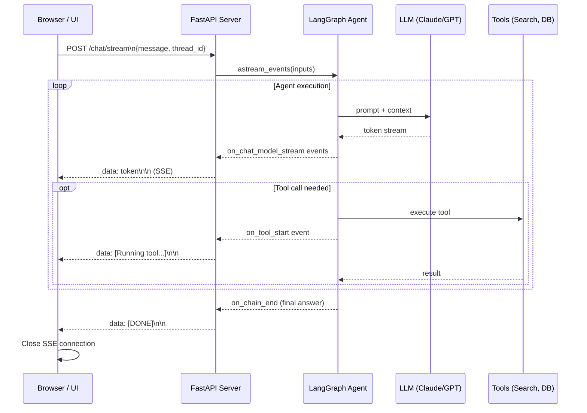

# Phase 4: Production & Deployment of Agentic AI

**Timeline:** Weeks 11-14
**Focus:** Taking your LangGraph agents out of the notebook and into production. You will learn how to stream real-time responses to user interfaces, rigorously evaluate non-deterministic agent outputs, integrate securely with enterprise backends, and package your system for scalable deployment.

---

## Week 11: Streaming Responses from Agents to Frontends

When dealing with Agentic AI, processing times can be long. An agent might need to search the web, query a database, and synthesize an answer, which can take several seconds. To prevent poor User Experience (UX) and connection timeouts, you must stream responses back to the client as they are generated. 

### Server-Sent Events (SSE) vs. WebSockets
*   **WebSockets:** Provide full-duplex, bidirectional communication. Best for highly interactive, real-time bidirectional chat applications.
*   **Server-Sent Events (SSE):** Provide a unidirectional stream of data from the server to the client. Ideal for LLM token streaming, as the user sends a single HTTP request and the server responds with a continuous stream of tokens.



### Implementing SSE with FastAPI and LangGraph

LangGraph provides native support for asynchronous streaming via `astream()` or `astream_events()`. We can wrap this in a FastAPI `StreamingResponse`.

```python
import asyncio
from typing import AsyncGenerator
from fastapi import FastAPI
from fastapi.responses import StreamingResponse
from pydantic import BaseModel
from langchain_core.messages import HumanMessage
# Assuming `compiled_graph` is your LangGraph StateGraph instance
from my_agent.graph import compiled_graph 

app = FastAPI(title="Streaming Agent API")

class ChatRequest(BaseModel):
    message: str
    thread_id: str

async def generate_token_stream(message: str, thread_id: str) -> AsyncGenerator[str, None]:
    """
    Generator function that yields tokens from the LangGraph agent as SSE.
    """
    inputs = {"messages": [HumanMessage(content=message)]}
    config = {"configurable": {"thread_id": thread_id}}
    
    # astream_events allows us to stream not just final output, but tool calls and intermediate steps
    async for event in compiled_graph.astream_events(inputs, config=config, version="v2"):
        kind = event["event"]
        
        # Stream standard LLM generation tokens
        if kind == "on_chat_model_stream":
            chunk = event["data"]["chunk"]
            if chunk.content:
                # SSE format requires 'data: {content}\n\n'
                yield f"data: {chunk.content}\n\n"
                
        # Optionally stream tool execution updates to the frontend
        elif kind == "on_tool_start":
            tool_name = event["name"]
            yield f"data: [System: Running tool {tool_name}...]\n\n"

@app.post("/chat/stream")
async def chat_stream(request: ChatRequest):
    """
    Endpoint consumed by the frontend (React, Vue, etc.) using EventSource or Fetch API.
    """
    return StreamingResponse(
        generate_token_stream(request.message, request.thread_id),
        media_type="text/event-stream"
    )
```

**Frontend Integration:** Your frontend will use the browser's native `fetch` API (or `EventSource`) to read this stream, appending chunks to the UI state in real-time, creating the familiar "typing" effect seen in ChatGPT.

---

## Week 12: Evaluating Agent Accuracy & Reliability

Traditional unit tests expect deterministic outputs (`assert 2 + 2 == 4`). AI agents are inherently non-deterministic. To measure accuracy, prevent regressions, and guard against hallucinations, we must use **LLM-as-a-Judge** evaluation frameworks.

### The Evaluation Paradigm

Instead of exact string matching, we use stronger, highly-instructed LLMs (like GPT-4) to grade our agent's outputs based on specific metrics:
1.  **Context Precision:** Did the agent retrieve the right information?
2.  **Answer Relevance:** Does the answer directly address the user's prompt?
3.  **Faithfulness:** Is the answer strictly derived from the retrieved context (preventing hallucinations)?

### Popular Frameworks
*   **LangSmith:** Best integrated with LangChain/LangGraph. Excellent for tracing and dataset testing.
*   **DeepEval:** An open-source framework specializing in specific RAG and Agentic metrics.
*   **Ragas:** Great for evaluating Retrieval-Augmented Generation pipelines.

### Implementing a Custom Evaluator (LangSmith approach)

Here is how you define a custom evaluator that checks if an agent successfully utilized a tool to answer a question, rather than just guessing.

```python
from langsmith import Client
from langsmith.evaluation import evaluate, LangChainStringEvaluator
from langchain_openai import ChatOpenAI
from langchain_core.prompts import PromptTemplate

# Initialize LangSmith client
client = Client()

# Define an LLM-as-a-Judge evaluator
def exactness_evaluator(run, example):
    """
    Custom evaluator to check if the agent's answer matches the expected baseline.
    """
    # Get the agent's actual output from the run trace
    agent_output = run.outputs["output"]
    # Get the expected answer from your dataset
    expected_answer = example.outputs["answer"]
    
    # Use a prompt to ask GPT-4 to grade the response
    eval_prompt = PromptTemplate.from_template(
        "You are an expert grader. \n"
        "Expected Answer: {expected}\n"
        "Agent Output: {output}\n"
        "Are these answers semantically equivalent? Respond with only 'YES' or 'NO'."
    )
    
    grader_llm = ChatOpenAI(model="gpt-4o", temperature=0)
    chain = eval_prompt | grader_llm
    
    result = chain.invoke({"expected": expected_answer, "output": agent_output})
    
    # Return a score mapping to LangSmith
    score = 1 if "YES" in result.content.upper() else 0
    return {"key": "semantic_exactness", "score": score}

# Example usage (assuming a dataset exists in LangSmith)
if __name__ == "__main__":
    # Your compiled LangGraph agent wrapped in a predictor function
    def predict_for_eval(inputs):
        return compiled_graph.invoke(inputs)

    evaluate(
        predict_for_eval,
        data="my_erp_agent_dataset", # Name of your dataset in LangSmith
        evaluators=[exactness_evaluator],
        experiment_prefix="erp-agent-v1"
    )
```

---

## Week 13: Connecting Agents to SaaS/ERP Backends

Agents are only as powerful as the data they can access and the actions they can take. In enterprise environments, this means connecting your LangGraph tools to ERPs (SAP, NetSuite), CRMs (Salesforce), or custom internal APIs.

### Secure Integration Patterns

1.  **Authentication:** Never hardcode API keys. Use environment variables. For user-specific SaaS actions, implement OAuth 2.0 where the agent uses a Bearer token specific to the user making the request.
2.  **Read vs. Write Isolation:** Separate tools that fetch data (`get_customer_info`) from tools that mutate data (`update_customer_status`). 
3.  **Human-in-the-Loop (HITL):** For high-stakes write operations (e.g., executing a refund), configure your LangGraph to interrupt execution and wait for human approval before proceeding.

### Example: Building an ERP Tool

```python
import os
import httpx
from langchain_core.tools import tool
from pydantic import BaseModel, Field

# Define input schema for strong typing and better LLM understanding
class CustomerQueryInput(BaseModel):
    customer_id: str = Field(description="The unique alphanumeric ID of the customer")

@tool("get_erp_customer_data", args_schema=CustomerQueryInput)
def get_erp_customer_data(customer_id: str) -> str:
    """
    Queries the enterprise ERP system to retrieve real-time customer data, 
    including account balance and recent orders.
    """
    erp_api_url = os.getenv("ERP_API_BASE_URL")
    api_key = os.getenv("ERP_API_KEY")
    
    headers = {
        "Authorization": f"Bearer {api_key}",
        "Content-Type": "application/json"
    }
    
    try:
        # Using httpx for synchronous requests (use AsyncClient for async graphs)
        response = httpx.get(
            f"{erp_api_url}/v1/customers/{customer_id}",
            headers=headers,
            timeout=10.0
        )
        response.raise_for_status()
        data = response.json()
        
        # Format the data into a clean string for the LLM to digest
        return (
            f"Customer Name: {data['name']}\n"
            f"Status: {data['status']}\n"
            f"Outstanding Balance: ${data['balance']}\n"
            f"Last Order Date: {data['last_order_date']}"
        )
    except httpx.HTTPStatusError as e:
        return f"Error querying ERP: API returned status code {e.response.status_code}"
    except Exception as e:
        return f"An unexpected error occurred while contacting the ERP: {str(e)}"
```

*Note: You would bind this tool to your LangGraph LLM node using `llm.bind_tools([get_erp_customer_data])`.*

---

## Week 14: Deployment via FastAPI & Docker

To run your agent reliably in production (AWS ECS, Google Cloud Run, Kubernetes), it must be containerized. Docker ensures that your agent runs in the exact same environment locally as it does in the cloud.

### 1. The FastAPI Application Structure

Ensure your project is structured cleanly:
```text
my_agent_project/
├── requirements.txt
├── Dockerfile
├── docker-compose.yml
├── .env.example
└── app/
    ├── __init__.py
    ├── server.py         # FastAPI endpoints (including streaming)
    ├── graph.py          # LangGraph definition
    └── tools.py          # ERP/SaaS integrations
```

### 2. Creating the Dockerfile

We use a slim Python image to keep the container lightweight and secure.

```dockerfile
# Use official Python lightweight image
FROM python:3.11-slim

# Prevent Python from writing .pyc files to disc and enable unbuffered logging
ENV PYTHONDONTWRITEBYTECODE=1
ENV PYTHONUNBUFFERED=1

# Set working directory
WORKDIR /code

# Install system dependencies (often required for compiling certain Python packages)
RUN apt-get update && apt-get install -y \
    build-essential \
    && rm -rf /var/lib/apt/lists/*

# Copy requirements and install
COPY requirements.txt .
RUN pip install --no-cache-dir -r requirements.txt

# Copy the actual application code
COPY ./app /code/app

# Expose the port FastAPI will run on
EXPOSE 8000

# Command to run the application using Uvicorn
CMD ["uvicorn", "app.server:app", "--host", "0.0.0.0", "--port", "8000", "--workers", "4"]
```

### 3. Docker Compose for Local Production Testing

A `docker-compose.yml` file allows you to test your production container locally, easily passing in environment variables.

```yaml
version: '3.8'

services:
  agent-api:
    build: .
    ports:
      - "8000:8000"
    env_file:
      - .env
    environment:
      - ENVIRONMENT=production
      # It is best practice to inject secrets via .env rather than hardcoding here
      - OPENAI_API_KEY=${OPENAI_API_KEY}
      - LANGCHAIN_API_KEY=${LANGCHAIN_API_KEY}
      - LANGCHAIN_TRACING_V2=true
      - ERP_API_BASE_URL=${ERP_API_BASE_URL}
      - ERP_API_KEY=${ERP_API_KEY}
    restart: unless-stopped
```

### Deployment Best Practices
*   **Statelessness:** FastAPI containers should be stateless. LangGraph state (memory) should be persisted to an external database (e.g., PostgreSQL using `AsyncPostgresSaver`) rather than in-memory, allowing you to run multiple Docker containers concurrently behind a load balancer.
*   **Worker Counts:** In the Dockerfile CMD, `--workers 4` utilizes multiple CPU cores to handle concurrent connections, which is crucial for handling multiple simultaneous streaming requests.
*   **Health Checks:** Always add a `/health` endpoint in your FastAPI app that Kubernetes or your load balancer can ping to ensure the container is responsive.