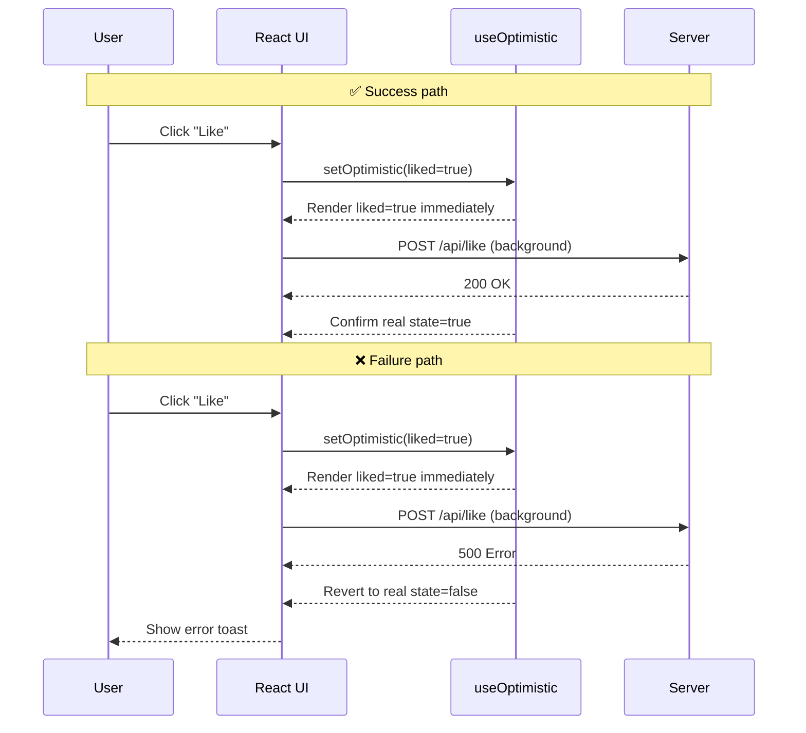

# useOptimistic - Optimistic UI Updates

## What You'll Learn

- What optimistic updates are and why they improve UX
- How to use React 19's `useOptimistic` hook
- Patterns for optimistic state management with TypeScript
- Error handling and state reconciliation
- Common use cases: forms, likes, todos, messaging

---

## What are Optimistic Updates?

**Optimistic updates** immediately show the expected result of an action before the server confirms it. This makes apps feel faster and more responsive by eliminating perceived wait times.

### Without Optimistic Updates:
```
User clicks "Like" → Show loading → Wait for server → Update UI (slow!)
```

### With Optimistic Updates:
```
User clicks "Like" → Immediately show "Liked" → Server confirms in background (fast!)
```

If the server operation fails, React automatically reverts to the previous state.



---

## The `useOptimistic` Hook

React 19 introduces `useOptimistic` to manage optimistic state updates.

### Basic Syntax

```typescript
const [optimisticState, setOptimisticState] = useOptimistic<T>(
  currentState: T,
  updateFn?: (currentState: T, optimisticValue: T) => T
);
```

- **`currentState`**: The actual state value
- **`updateFn`** (optional): A reducer function to compute optimistic state
- **Returns**: `[optimisticState, setOptimisticState]`

---

## Pattern 1: Simple Boolean Toggle

Perfect for like/favorite buttons.

```typescript
import { useState, useOptimistic, startTransition } from 'react';

interface LikeButtonProps {
  postId: string;
  initialLiked: boolean;
}

async function toggleLikeOnServer(postId: string, liked: boolean): Promise<boolean> {
  const response = await fetch(`/api/posts/${postId}/like`, {
    method: 'POST',
    headers: { 'Content-Type': 'application/json' },
    body: JSON.stringify({ liked }),
  });
  
  if (!response.ok) throw new Error('Failed to update like');
  
  const data = await response.json();
  return data.liked;
}

export function LikeButton({ postId, initialLiked }: LikeButtonProps) {
  const [isLiked, setIsLiked] = useState(initialLiked);
  const [optimisticIsLiked, setOptimisticIsLiked] = useOptimistic(isLiked);

  async function handleClick() {
    startTransition(async () => {
      const newValue = !optimisticIsLiked;
      
      // Immediately update UI
      setOptimisticIsLiked(newValue);
      
      try {
        // Update server in background
        const updatedValue = await toggleLikeOnServer(postId, newValue);
        
        // Update real state when server confirms
        startTransition(() => {
          setIsLiked(updatedValue);
        });
      } catch (error) {
        // React automatically reverts optimistic state on error
        console.error('Failed to update like:', error);
        // Optionally show error toast
      }
    });
  }

  const isPending = optimisticIsLiked !== isLiked;

  return (
    <button
      onClick={handleClick}
      disabled={isPending}
      className={isPending ? 'opacity-50' : ''}
    >
      {optimisticIsLiked ? '❤️ Unlike' : '🤍 Like'}
    </button>
  );
}
```

**Key Points:**
- Wrap async operations in `startTransition`
- Optimistic state shows immediately
- Real state updates when server confirms
- Automatic revert on error

---

## Pattern 2: Form Submission with Optimistic State

Update UI immediately when submitting forms.

```typescript
import { useState, useOptimistic, useRef } from 'react';

interface NameFormProps {
  currentName: string;
  onUpdateName: (name: string) => void;
}

async function updateNameOnServer(name: string): Promise<string> {
  const response = await fetch('/api/user/name', {
    method: 'PUT',
    headers: { 'Content-Type': 'application/json' },
    body: JSON.stringify({ name }),
  });
  
  if (!response.ok) throw new Error('Failed to update name');
  
  const data = await response.json();
  return data.name;
}

export function NameForm({ currentName, onUpdateName }: NameFormProps) {
  const [optimisticName, setOptimisticName] = useOptimistic(currentName);
  const formRef = useRef<HTMLFormElement>(null);
  const [error, setError] = useState<string | null>(null);

  const isPending = currentName !== optimisticName;

  async function submitAction(formData: FormData) {
    const newName = formData.get('name') as string;
    
    if (!newName.trim()) {
      setError('Name cannot be empty');
      return;
    }

    setError(null);
    
    // Show optimistic update immediately
    setOptimisticName(newName);
    
    try {
      // Update server in background
      const updatedName = await updateNameOnServer(newName);
      
      // Update real state
      onUpdateName(updatedName);
      
      // Reset form
      formRef.current?.reset();
    } catch (err) {
      setError('Failed to update name. Please try again.');
      // Optimistic state automatically reverts
    }
  }

  return (
    <form
      ref={formRef}
      action={submitAction}
      className="space-y-4"
    >
      <div>
        <p className="text-sm text-gray-600">Your name is:</p>
        <p className="text-xl font-semibold">
          {optimisticName}
          {isPending && (
            <span className="ml-2 text-sm text-gray-500">(Saving...)</span>
          )}
        </p>
      </div>

      {error && (
        <div className="text-red-600 text-sm">{error}</div>
      )}

      <div>
        <label htmlFor="name" className="block text-sm font-medium">
          Change Name:
        </label>
        <input
          id="name"
          type="text"
          name="name"
          disabled={isPending}
          className="mt-1 block w-full rounded border-gray-300"
          placeholder="Enter new name"
        />
      </div>

      <button
        type="submit"
        disabled={isPending}
        className="px-4 py-2 bg-blue-600 text-white rounded disabled:opacity-50"
      >
        {isPending ? 'Updating...' : 'Update Name'}
      </button>
    </form>
  );
}
```

---

## Pattern 3: Optimistic List Updates with Reducer

For adding items to lists (todos, comments, messages).

```typescript
import { useState, useOptimistic, startTransition } from 'react';

interface Todo {
  id: string;
  text: string;
  pending?: boolean;
}

async function addTodoToServer(todo: Omit<Todo, 'pending'>): Promise<Todo> {
  const response = await fetch('/api/todos', {
    method: 'POST',
    headers: { 'Content-Type': 'application/json' },
    body: JSON.stringify(todo),
  });
  
  if (!response.ok) throw new Error('Failed to add todo');
  
  return response.json();
}

export function TodoList() {
  const [todos, setTodos] = useState<Todo[]>([
    { id: '1', text: 'Learn React 19' },
  ]);

  // Reducer function to add optimistic todo
  const [optimisticTodos, addOptimisticTodo] = useOptimistic<Todo[], Todo>(
    todos,
    (currentTodos, newTodo) => [
      ...currentTodos,
      { ...newTodo, pending: true }, // Mark as pending
    ]
  );

  async function handleAddTodo(text: string) {
    const newTodo: Todo = {
      id: crypto.randomUUID(),
      text,
    };

    startTransition(async () => {
      // Add optimistic todo immediately
      addOptimisticTodo(newTodo);
      
      try {
        // Save to server
        const savedTodo = await addTodoToServer(newTodo);
        
        // Update real state
        startTransition(() => {
          setTodos((prevTodos) => [...prevTodos, savedTodo]);
        });
      } catch (error) {
        console.error('Failed to add todo:', error);
        // Optimistic todo automatically removed on error
      }
    });
  }

  return (
    <div className="space-y-4">
      <button
        onClick={() => handleAddTodo('New todo')}
        className="px-4 py-2 bg-green-600 text-white rounded"
      >
        Add Todo
      </button>

      <ul className="space-y-2">
        {optimisticTodos.map((todo) => (
          <li
            key={todo.id}
            className={`p-3 rounded ${
              todo.pending ? 'bg-gray-100 opacity-70' : 'bg-white'
            }`}
          >
            {todo.text}
            {todo.pending && (
              <span className="ml-2 text-sm text-gray-500">(Adding...)</span>
            )}
          </li>
        ))}
      </ul>
    </div>
  );
}
```

**Why Use a Reducer?**
- Keeps optimistic updates in sync if base state changes
- Prevents stale state issues
- Cleaner logic for complex updates

---

## Pattern 4: Messaging App with Optimistic Messages

Show messages immediately while they're being sent.

```typescript
import { useState, useOptimistic, useRef, FormEvent } from 'react';

interface Message {
  id: string;
  text: string;
  sending?: boolean;
  timestamp: Date;
}

async function sendMessageToServer(text: string): Promise<Message> {
  const response = await fetch('/api/messages', {
    method: 'POST',
    headers: { 'Content-Type': 'application/json' },
    body: JSON.stringify({ text }),
  });
  
  if (!response.ok) throw new Error('Failed to send message');
  
  return response.json();
}

export function MessageThread() {
  const [messages, setMessages] = useState<Message[]>([
    { id: '1', text: 'Hello there!', timestamp: new Date() },
  ]);

  const formRef = useRef<HTMLFormElement>(null);

  const [optimisticMessages, addOptimisticMessage] = useOptimistic<
    Message[],
    string
  >(
    messages,
    (currentMessages, newMessageText) => [
      ...currentMessages,
      {
        id: crypto.randomUUID(),
        text: newMessageText,
        sending: true,
        timestamp: new Date(),
      },
    ]
  );

  async function handleSubmit(e: FormEvent<HTMLFormElement>) {
    e.preventDefault();
    
    const formData = new FormData(e.currentTarget);
    const messageText = formData.get('message') as string;
    
    if (!messageText.trim()) return;

    // Add optimistic message immediately
    addOptimisticMessage(messageText);
    
    // Reset form
    formRef.current?.reset();
    
    try {
      // Send to server
      const sentMessage = await sendMessageToServer(messageText);
      
      // Update with real message
      setMessages((prev) => [...prev, sentMessage]);
    } catch (error) {
      console.error('Failed to send message:', error);
      // Optimistic message automatically removed
    }
  }

  return (
    <div className="flex flex-col h-96">
      <div className="flex-1 overflow-y-auto space-y-2 p-4 bg-gray-50">
        {optimisticMessages.map((message) => (
          <div
            key={message.id}
            className={`p-2 rounded ${
              message.sending
                ? 'bg-blue-100 opacity-70'
                : 'bg-white shadow'
            }`}
          >
            <p>{message.text}</p>
            {message.sending && (
              <small className="text-gray-500">Sending...</small>
            )}
          </div>
        ))}
      </div>

      <form
        ref={formRef}
        onSubmit={handleSubmit}
        className="flex gap-2 p-4 border-t"
      >
        <input
          type="text"
          name="message"
          placeholder="Type a message..."
          className="flex-1 px-3 py-2 border rounded"
          autoComplete="off"
        />
        <button
          type="submit"
          className="px-4 py-2 bg-blue-600 text-white rounded"
        >
          Send
        </button>
      </form>
    </div>
  );
}
```

---

## Best Practices

### ✅ Do's

1. **Always use `startTransition`** for async operations:
```typescript
startTransition(async () => {
  setOptimisticState(newValue);
  await serverOperation();
});
```

2. **Show pending state visually**:
```typescript
const isPending = optimisticState !== realState;
return <div className={isPending ? 'opacity-70' : ''}>{content}</div>;
```

3. **Handle errors gracefully**:
```typescript
try {
  await serverOperation();
} catch (error) {
  showErrorToast(error.message);
  // React reverts optimistic state automatically
}
```

4. **Use reducers for complex updates**:
```typescript
const [optimistic, add] = useOptimistic(state, (current, action) => {
  // Complex update logic
  return newState;
});
```

### ❌ Don'ts

1. **Don't forget to update real state**:
```typescript
// ❌ Bad - optimistic state will revert
setOptimisticState(value);
await serverOp();

// ✅ Good
setOptimisticState(value);
const result = await serverOp();
setRealState(result);
```

2. **Don't use without `startTransition`**:
```typescript
// ❌ Bad - may cause issues
setOptimisticState(value);

// ✅ Good
startTransition(() => {
  setOptimisticState(value);
});
```

3. **Don't ignore failed operations**:
```typescript
// ❌ Bad - user doesn't know it failed
await serverOp().catch(() => {});

// ✅ Good
await serverOp().catch((error) => {
  showErrorNotification('Operation failed');
});
```

---

## Common Use Cases

| Use Case | Pattern | Example |
|----------|---------|---------|
| **Like/Favorite** | Boolean toggle | Social media likes |
| **Form Updates** | Single value | Profile name/bio |
| **List Additions** | Reducer pattern | Todo lists, comments |
| **Messaging** | List with metadata | Chat apps |
| **Voting** | Boolean/number | Upvotes/downvotes |
| **Status Changes** | Enum values | Task status updates |

---

## TypeScript Tips

### Type the Optimistic State

```typescript
interface Post {
  id: string;
  liked: boolean;
  likeCount: number;
}

const [post, setPost] = useState<Post>(initialPost);
const [optimisticPost, setOptimisticPost] = useOptimistic<Post>(post);
```

### Type the Reducer Function

```typescript
interface Todo {
  id: string;
  text: string;
  pending?: boolean;
}

type TodoAction = Todo;

const [todos, addTodo] = useOptimistic<Todo[], TodoAction>(
  initialTodos,
  (currentTodos: Todo[], newTodo: TodoAction): Todo[] => [
    ...currentTodos,
    { ...newTodo, pending: true },
  ]
);
```

### Type Server Functions

```typescript
async function updateServer<T>(
  endpoint: string,
  data: T
): Promise<T> {
  const response = await fetch(endpoint, {
    method: 'POST',
    headers: { 'Content-Type': 'application/json' },
    body: JSON.stringify(data),
  });
  
  if (!response.ok) {
    throw new Error(`Failed to update: ${response.statusText}`);
  }
  
  return response.json();
}
```

---

## Practice Exercise

Create an optimistic comment system:

**Requirements:**
1. Show comments list
2. Add new comments optimistically
3. Show "Posting..." indicator for pending comments
4. Handle errors with toast notifications
5. TypeScript types for all state

**Bonus:**
- Add optimistic delete functionality
- Add optimistic edit functionality
- Implement retry logic for failed operations

---

## Summary

- **`useOptimistic`** makes apps feel faster by showing expected results immediately
- Always wrap updates in `startTransition` for proper handling
- React automatically reverts optimistic state if operations fail
- Use reducers for complex list updates
- Show pending states visually for better UX
- Handle errors gracefully with user feedback

---

## Next Steps

- [useFormStatus](./05_useFormStatus.md) - Track form submission state
- [State Management with Zustand](../03_state_management/01_zustand_intro.md)
- [Data Fetching with TanStack Query](../04_data_fetching/01_tanstack_intro.md)
