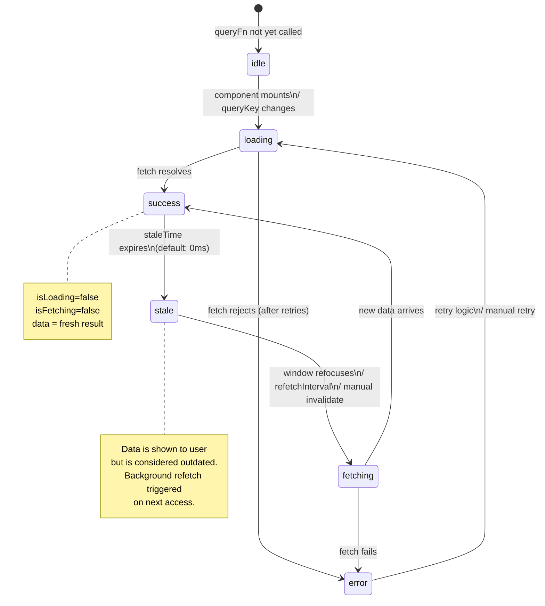

# Introduction to TanStack Query

Master TanStack Query (React Query) for powerful, declarative data fetching and server state management.

## What You'll Learn

- What TanStack Query solves
- Setting up React Query
- useQuery for fetching data
- useMutation for updates
- Caching and invalidation
- Loading and error states

## Why TanStack Query?

### Query Lifecycle / State Machine



### Without React Query

```typescript
// ❌ Manual data fetching with useState and useEffect
function UserProfile({ userId }: { userId: string }) {
  const [user, setUser] = useState(null);
  const [loading, setLoading] = useState(true);
  const [error, setError] = useState(null);

  useEffect(() => {
    setLoading(true);
    fetch(`/api/users/${userId}`)
      .then(res => res.json())
      .then(data => {
        setUser(data);
        setLoading(false);
      })
      .catch(err => {
        setError(err);
        setLoading(false);
      });
  }, [userId]);

  // Manual cache management, refetch logic, etc.
  // No automatic retries, no background updates
  // Must handle race conditions manually
}
```

### With React Query

```typescript
// ✅ Declarative data fetching with React Query
function UserProfile({ userId }: { userId: string }) {
  const { data: user, isLoading, error } = useQuery({
    queryKey: ['user', userId],
    queryFn: () => fetch(`/api/users/${userId}`).then(res => res.json()),
  });

  // Automatic caching, refetching, retries, and more!
  if (isLoading) return <div>Loading...</div>;
  if (error) return <div>Error: {error.message}</div>;
  return <div>{user.name}</div>;
}
```

## Installation

```bash
npm install @tanstack/react-query
npm install @tanstack/react-query-devtools
```

## Setup

```typescript
// main.tsx or App.tsx
import { QueryClient, QueryClientProvider } from '@tanstack/react-query';
import { ReactQueryDevtools } from '@tanstack/react-query-devtools';

// Create a client
const queryClient = new QueryClient({
  defaultOptions: {
    queries: {
      staleTime: 1000 * 60 * 5, // 5 minutes
      retry: 3,
      refetchOnWindowFocus: false,
    },
  },
});

function App() {
  return (
    <QueryClientProvider client={queryClient}>
      <YourApp />
      <ReactQueryDevtools initialIsOpen={false} />
    </QueryClientProvider>
  );
}
```

## useQuery - Fetching Data

### Basic Query

```typescript
import { useQuery } from '@tanstack/react-query';

interface User {
  id: number;
  name: string;
  email: string;
}

function UserProfile() {
  const { data, isLoading, error } = useQuery<User>({
    queryKey: ['user'],
    queryFn: async () => {
      const response = await fetch('/api/user');
      if (!response.ok) throw new Error('Failed to fetch user');
      return response.json();
    },
  });

  if (isLoading) return <div>Loading...</div>;
  if (error) return <div>Error: {error.message}</div>;
  
  return (
    <div>
      <h1>{data.name}</h1>
      <p>{data.email}</p>
    </div>
  );
}
```

### Query with Parameters

```typescript
interface Post {
  id: number;
  title: string;
  body: string;
}

function Post({ postId }: { postId: number }) {
  const { data: post, isLoading, error } = useQuery<Post>({
    queryKey: ['post', postId], // Include params in key
    queryFn: async () => {
      const response = await fetch(`/api/posts/${postId}`);
      if (!response.ok) throw new Error('Failed to fetch post');
      return response.json();
    },
    enabled: !!postId, // Only run if postId exists
  });

  // Render logic...
}
```

### Multiple Queries

```typescript
function Dashboard() {
  const userQuery = useQuery({
    queryKey: ['user'],
    queryFn: fetchUser,
  });

  const postsQuery = useQuery({
    queryKey: ['posts'],
    queryFn: fetchPosts,
  });

  const statsQuery = useQuery({
    queryKey: ['stats'],
    queryFn: fetchStats,
  });

  if (userQuery.isLoading || postsQuery.isLoading || statsQuery.isLoading) {
    return <div>Loading...</div>;
  }

  return (
    <div>
      <h1>Welcome {userQuery.data.name}</h1>
      <PostList posts={postsQuery.data} />
      <Stats data={statsQuery.data} />
    </div>
  );
}
```

## Query States

```typescript
function Component() {
  const { 
    data,
    error,
    isLoading,        // Initial loading
    isFetching,       // Any fetch (including background)
    isError,          // Error occurred
    isSuccess,        // Successful fetch
    status,           // 'pending' | 'error' | 'success'
    fetchStatus,      // 'fetching' | 'paused' | 'idle'
  } = useQuery({
    queryKey: ['data'],
    queryFn: fetchData,
  });

  // Different loading states
  if (isLoading) return <div>Initial loading...</div>;
  if (isError) return <div>Error: {error.message}</div>;
  
  return (
    <div>
      {isFetching && <div>Updating...</div>}
      <DataDisplay data={data} />
    </div>
  );
}
```

## Pagination

```typescript
interface PaginatedResponse {
  items: Post[];
  page: number;
  totalPages: number;
}

function PostList() {
  const [page, setPage] = useState(1);

  const { data, isLoading, isPlaceholderData } = useQuery<PaginatedResponse>({
    queryKey: ['posts', page],
    queryFn: () => fetchPosts(page),
    placeholderData: keepPreviousData, // Keep old data while fetching new
  });

  return (
    <div>
      {isLoading ? (
        <div>Loading...</div>
      ) : (
        <>
          {data.items.map(post => (
            <PostCard key={post.id} post={post} />
          ))}
          
          <div>
            <button
              onClick={() => setPage(old => Math.max(old - 1, 1))}
              disabled={page === 1}
            >
              Previous
            </button>
            <span>Page {page} of {data.totalPages}</span>
            <button
              onClick={() => setPage(old => old + 1)}
              disabled={isPlaceholderData || page === data.totalPages}
            >
              Next
            </button>
          </div>
        </>
      )}
    </div>
  );
}
```

## Infinite Queries

```typescript
interface PageResponse {
  items: Post[];
  nextCursor?: number;
}

function InfiniteFeed() {
  const {
    data,
    fetchNextPage,
    hasNextPage,
    isFetchingNextPage,
    isLoading,
  } = useInfiniteQuery<PageResponse>({
    queryKey: ['posts'],
    queryFn: ({ pageParam = 0 }) => fetchPosts(pageParam),
    getNextPageParam: (lastPage) => lastPage.nextCursor,
    initialPageParam: 0,
  });

  if (isLoading) return <div>Loading...</div>;

  return (
    <div>
      {data.pages.map((page, i) => (
        <div key={i}>
          {page.items.map(post => (
            <PostCard key={post.id} post={post} />
          ))}
        </div>
      ))}
      
      {hasNextPage && (
        <button
          onClick={() => fetchNextPage()}
          disabled={isFetchingNextPage}
        >
          {isFetchingNextPage ? 'Loading more...' : 'Load More'}
        </button>
      )}
    </div>
  );
}
```

## useMutation - Updating Data

### Basic Mutation

```typescript
interface CreatePostData {
  title: string;
  body: string;
}

function CreatePost() {
  const queryClient = useQueryClient();

  const mutation = useMutation({
    mutationFn: (newPost: CreatePostData) => {
      return fetch('/api/posts', {
        method: 'POST',
        headers: { 'Content-Type': 'application/json' },
        body: JSON.stringify(newPost),
      }).then(res => res.json());
    },
    onSuccess: () => {
      // Invalidate and refetch
      queryClient.invalidateQueries({ queryKey: ['posts'] });
    },
  });

  const handleSubmit = (e: React.FormEvent<HTMLFormElement>) => {
    e.preventDefault();
    const formData = new FormData(e.currentTarget);
    
    mutation.mutate({
      title: formData.get('title') as string,
      body: formData.get('body') as string,
    });
  };

  return (
    <form onSubmit={handleSubmit}>
      <input name="title" required />
      <textarea name="body" required />
      <button type="submit" disabled={mutation.isPending}>
        {mutation.isPending ? 'Creating...' : 'Create Post'}
      </button>
      {mutation.isError && (
        <div>Error: {mutation.error.message}</div>
      )}
      {mutation.isSuccess && (
        <div>Post created successfully!</div>
      )}
    </form>
  );
}
```

### Optimistic Updates

```typescript
function TodoList() {
  const queryClient = useQueryClient();

  const updateMutation = useMutation({
    mutationFn: (updatedTodo: Todo) => {
      return fetch(`/api/todos/${updatedTodo.id}`, {
        method: 'PUT',
        body: JSON.stringify(updatedTodo),
      });
    },
    onMutate: async (updatedTodo) => {
      // Cancel outgoing refetches
      await queryClient.cancelQueries({ queryKey: ['todos'] });

      // Snapshot the previous value
      const previousTodos = queryClient.getQueryData(['todos']);

      // Optimistically update
      queryClient.setQueryData<Todo[]>(['todos'], (old) =>
        old?.map((todo) =>
          todo.id === updatedTodo.id ? updatedTodo : todo
        )
      );

      // Return snapshot for rollback
      return { previousTodos };
    },
    onError: (err, updatedTodo, context) => {
      // Rollback on error
      queryClient.setQueryData(['todos'], context?.previousTodos);
    },
    onSettled: () => {
      // Refetch after error or success
      queryClient.invalidateQueries({ queryKey: ['todos'] });
    },
  });

  // Usage...
}
```

## Custom Hooks

### useUser Hook

```typescript
// hooks/useUser.ts
import { useQuery } from '@tanstack/react-query';
import axios from 'axios';

interface User {
  id: string;
  name: string;
  email: string;
}

export function useUser(userId: string) {
  return useQuery<User>({
    queryKey: ['user', userId],
    queryFn: async () => {
      const { data } = await axios.get(`/api/users/${userId}`);
      return data;
    },
    enabled: !!userId,
  });
}

// Usage
function UserProfile({ userId }: { userId: string }) {
  const { data: user, isLoading } = useUser(userId);
  // ...
}
```

### useCreatePost Hook

```typescript
// hooks/useCreatePost.ts
import { useMutation, useQueryClient } from '@tanstack/react-query';
import axios from 'axios';

interface CreatePostData {
  title: string;
  body: string;
}

export function useCreatePost() {
  const queryClient = useQueryClient();

  return useMutation({
    mutationFn: async (data: CreatePostData) => {
      const response = await axios.post('/api/posts', data);
      return response.data;
    },
    onSuccess: () => {
      queryClient.invalidateQueries({ queryKey: ['posts'] });
    },
  });
}

// Usage
function CreatePostForm() {
  const { mutate, isPending } = useCreatePost();
  // ...
}
```

## Query Invalidation

```typescript
import { useQueryClient } from '@tanstack/react-query';

function Component() {
  const queryClient = useQueryClient();

  // Invalidate specific query
  queryClient.invalidateQueries({ queryKey: ['posts'] });

  // Invalidate all queries starting with 'posts'
  queryClient.invalidateQueries({ queryKey: ['posts'], exact: false });

  // Invalidate and refetch
  queryClient.invalidateQueries({ 
    queryKey: ['posts'],
    refetchType: 'active' // 'active' | 'inactive' | 'all' | 'none'
  });

  // Refetch without invalidating
  queryClient.refetchQueries({ queryKey: ['posts'] });

  // Reset queries (back to initial state)
  queryClient.resetQueries({ queryKey: ['posts'] });
}
```

## Error Handling

```typescript
// Global error handling
const queryClient = new QueryClient({
  defaultOptions: {
    queries: {
      retry: 3,
      retryDelay: (attemptIndex) => Math.min(1000 * 2 ** attemptIndex, 30000),
    },
    mutations: {
      onError: (error) => {
        toast.error(`Error: ${error.message}`);
      },
    },
  },
});

// Per-query error handling
function Component() {
  const { data, error } = useQuery({
    queryKey: ['data'],
    queryFn: fetchData,
    retry: (failureCount, error) => {
      // Don't retry on 404
      if (error.status === 404) return false;
      return failureCount < 3;
    },
  });
}
```

## Best Practices

1. **Use query keys consistently**
```typescript
// ✅ Good: Hierarchical keys
['posts']              // All posts
['posts', postId]      // Single post
['posts', postId, 'comments']  // Post comments
```

2. **Create custom hooks**
```typescript
// ✅ Good: Encapsulate queries
export function usePosts() {
  return useQuery({ queryKey: ['posts'], queryFn: fetchPosts });
}
```

3. **Handle loading and error states**
```typescript
// ✅ Always handle all states
if (isLoading) return <Spinner />;
if (error) return <ErrorMessage error={error} />;
return <DataDisplay data={data} />;
```

4. **Use TypeScript**
```typescript
// ✅ Type your data
const { data } = useQuery<User>({...});
```

## Next Steps

- [useMutation - Updating Data](./03_useMutation.md)
- [Axios Integration](./04_axios_integration.md)

## Summary

TanStack Query provides:
- ✅ Automatic caching
- ✅ Background refetching
- ✅ Optimistic updates
- ✅ Loading and error states
- ✅ Pagination and infinite scroll
- ✅ Request deduplication
