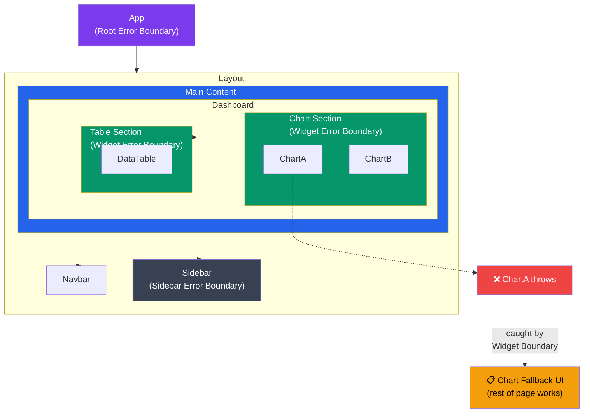

# Error Handling in React

Comprehensive guide to handling errors gracefully in React applications, from component-level errors to global error management.

## What You'll Learn

- Error Boundaries for component errors
- Async error handling patterns
- Form validation errors
- API error handling strategies
- Toast notifications for user feedback
- Error logging and monitoring
- User-friendly error messages
- Recovery strategies

---

## 1. Error Boundaries

Error boundaries catch JavaScript errors in component trees and display fallback UI.



### Basic Error Boundary

```typescript
// src/components/ErrorBoundary.tsx
import { Component, ReactNode } from 'react';

interface Props {
  children: ReactNode;
  fallback?: ReactNode;
  onError?: (error: Error, errorInfo: React.ErrorInfo) => void;
}

interface State {
  hasError: boolean;
  error: Error | null;
}

class ErrorBoundary extends Component<Props, State> {
  constructor(props: Props) {
    super(props);
    this.state = { hasError: false, error: null };
  }

  static getDerivedStateFromError(error: Error): State {
    return { hasError: true, error };
  }

  componentDidCatch(error: Error, errorInfo: React.ErrorInfo) {
    // Log to error reporting service
    console.error('Error caught by boundary:', error, errorInfo);
    this.props.onError?.(error, errorInfo);
  }

  render() {
    if (this.state.hasError) {
      return this.props.fallback || (
        <div className="error-boundary">
          <h2>Something went wrong</h2>
          <p>{this.state.error?.message}</p>
          <button onClick={() => this.setState({ hasError: false, error: null })}>
            Try again
          </button>
        </div>
      );
    }

    return this.props.children;
  }
}

export default ErrorBoundary;
```

### Usage

```typescript
// src/App.tsx
import ErrorBoundary from './components/ErrorBoundary';
import Dashboard from './pages/Dashboard';

function App() {
  return (
    <ErrorBoundary
      fallback={<ErrorFallback />}
      onError={(error, errorInfo) => {
        // Send to logging service
        logErrorToService(error, errorInfo);
      }}
    >
      <Dashboard />
    </ErrorBoundary>
  );
}
```

### Custom Error Fallback Component

```typescript
// src/components/ErrorFallback.tsx
interface ErrorFallbackProps {
  error?: Error;
  resetError?: () => void;
}

export function ErrorFallback({ error, resetError }: ErrorFallbackProps) {
  return (
    <div className="min-h-screen flex items-center justify-center bg-gray-50">
      <div className="max-w-md w-full bg-white shadow-lg rounded-lg p-6">
        <div className="flex items-center justify-center w-12 h-12 mx-auto bg-red-100 rounded-full">
          <svg
            className="w-6 h-6 text-red-600"
            fill="none"
            viewBox="0 0 24 24"
            stroke="currentColor"
          >
            <path
              strokeLinecap="round"
              strokeLinejoin="round"
              strokeWidth={2}
              d="M6 18L18 6M6 6l12 12"
            />
          </svg>
        </div>
        <h3 className="mt-4 text-lg font-medium text-center text-gray-900">
          Oops! Something went wrong
        </h3>
        <p className="mt-2 text-sm text-center text-gray-500">
          {error?.message || 'An unexpected error occurred'}
        </p>
        {resetError && (
          <button
            onClick={resetError}
            className="mt-6 w-full bg-blue-600 text-white py-2 px-4 rounded hover:bg-blue-700"
          >
            Try Again
          </button>
        )}
      </div>
    </div>
  );
}
```

### Multiple Error Boundaries

```typescript
// Wrap different sections with their own boundaries
function App() {
  return (
    <ErrorBoundary fallback={<GlobalError />}>
      <Header />
      
      <ErrorBoundary fallback={<SidebarError />}>
        <Sidebar />
      </ErrorBoundary>
      
      <main>
        <ErrorBoundary fallback={<ContentError />}>
          <Routes />
        </ErrorBoundary>
      </main>
    </ErrorBoundary>
  );
}
```

---

## 2. Async Error Handling

### Try-Catch Pattern

```typescript
// ❌ Bad: Unhandled errors
function BadComponent() {
  const [data, setData] = useState(null);
  
  useEffect(() => {
    fetchData().then(setData); // Error will crash the app
  }, []);
  
  return <div>{data?.name}</div>;
}

// ✅ Good: Proper error handling
function GoodComponent() {
  const [data, setData] = useState<Data | null>(null);
  const [error, setError] = useState<Error | null>(null);
  const [loading, setLoading] = useState(true);
  
  useEffect(() => {
    async function loadData() {
      try {
        setLoading(true);
        setError(null);
        const result = await fetchData();
        setData(result);
      } catch (err) {
        setError(err instanceof Error ? err : new Error('Unknown error'));
      } finally {
        setLoading(false);
      }
    }
    
    loadData();
  }, []);
  
  if (loading) return <Spinner />;
  if (error) return <ErrorMessage error={error} />;
  if (!data) return <EmptyState />;
  
  return <div>{data.name}</div>;
}
```

### Custom Hook for Async Operations

```typescript
// src/hooks/useAsync.ts
import { useState, useCallback } from 'react';

interface AsyncState<T> {
  data: T | null;
  error: Error | null;
  loading: boolean;
}

export function useAsync<T>() {
  const [state, setState] = useState<AsyncState<T>>({
    data: null,
    error: null,
    loading: false,
  });

  const execute = useCallback(async (promise: Promise<T>) => {
    setState({ data: null, error: null, loading: true });
    
    try {
      const data = await promise;
      setState({ data, error: null, loading: false });
      return data;
    } catch (error) {
      const err = error instanceof Error ? error : new Error('Unknown error');
      setState({ data: null, error: err, loading: false });
      throw err;
    }
  }, []);

  const reset = useCallback(() => {
    setState({ data: null, error: null, loading: false });
  }, []);

  return { ...state, execute, reset };
}
```

### Usage

```typescript
function UserProfile({ userId }: { userId: string }) {
  const { data, error, loading, execute } = useAsync<User>();
  
  useEffect(() => {
    execute(fetchUser(userId));
  }, [userId, execute]);
  
  if (loading) return <Spinner />;
  if (error) return <ErrorMessage error={error} />;
  if (!data) return null;
  
  return <div>{data.name}</div>;
}
```

---

## 3. API Error Handling

### Axios Error Handling

```typescript
// src/lib/api.ts
import axios, { AxiosError } from 'axios';

export interface ApiError {
  message: string;
  statusCode: number;
  field?: string;
  errors?: Record<string, string[]>;
}

export function handleApiError(error: unknown): ApiError {
  if (axios.isAxiosError(error)) {
    const axiosError = error as AxiosError<ApiError>;
    
    // Server responded with error
    if (axiosError.response) {
      return {
        message: axiosError.response.data?.message || 'Server error',
        statusCode: axiosError.response.status,
        errors: axiosError.response.data?.errors,
      };
    }
    
    // Request made but no response
    if (axiosError.request) {
      return {
        message: 'No response from server',
        statusCode: 0,
      };
    }
  }
  
  // Something else happened
  return {
    message: error instanceof Error ? error.message : 'Unknown error',
    statusCode: 500,
  };
}
```

### API Client with Error Handling

```typescript
// src/lib/apiClient.ts
import axios from 'axios';
import { toast } from 'sonner';

const apiClient = axios.create({
  baseURL: import.meta.env.VITE_API_URL,
  timeout: 10000,
});

// Request interceptor
apiClient.interceptors.request.use(
  (config) => {
    const token = localStorage.getItem('token');
    if (token) {
      config.headers.Authorization = `Bearer ${token}`;
    }
    return config;
  },
  (error) => Promise.reject(error)
);

// Response interceptor
apiClient.interceptors.response.use(
  (response) => response,
  (error: AxiosError<ApiError>) => {
    const apiError = handleApiError(error);
    
    // Handle specific status codes
    switch (apiError.statusCode) {
      case 401:
        // Unauthorized - redirect to login
        window.location.href = '/login';
        toast.error('Session expired. Please login again.');
        break;
      case 403:
        toast.error('You do not have permission to perform this action.');
        break;
      case 404:
        toast.error('Resource not found.');
        break;
      case 500:
        toast.error('Server error. Please try again later.');
        break;
      default:
        toast.error(apiError.message);
    }
    
    return Promise.reject(apiError);
  }
);

export default apiClient;
```

### TanStack Query Error Handling

```typescript
// src/hooks/useUser.ts
import { useQuery } from '@tanstack/react-query';
import { toast } from 'sonner';

export function useUser(userId: string) {
  return useQuery({
    queryKey: ['user', userId],
    queryFn: () => fetchUser(userId),
    retry: (failureCount, error) => {
      // Don't retry on 404
      if (error instanceof ApiError && error.statusCode === 404) {
        return false;
      }
      return failureCount < 3;
    },
    onError: (error: ApiError) => {
      // Only show toast if not handled elsewhere
      if (error.statusCode !== 401) {
        toast.error(error.message);
      }
    },
  });
}
```

### Global Query Error Handler

```typescript
// src/App.tsx
import { QueryClient, QueryClientProvider } from '@tanstack/react-query';
import { toast } from 'sonner';

const queryClient = new QueryClient({
  defaultOptions: {
    queries: {
      retry: 1,
      refetchOnWindowFocus: false,
      onError: (error) => {
        if (error instanceof ApiError) {
          toast.error(error.message);
        }
      },
    },
    mutations: {
      onError: (error) => {
        if (error instanceof ApiError) {
          toast.error(error.message);
        }
      },
    },
  },
});

function App() {
  return (
    <QueryClientProvider client={queryClient}>
      {/* Your app */}
    </QueryClientProvider>
  );
}
```

---

## 4. Form Validation Errors

### React Hook Form with Zod

```typescript
// src/components/SignupForm.tsx
import { useForm } from 'react-hook-form';
import { zodResolver } from '@hookform/resolvers/zod';
import { z } from 'zod';

const signupSchema = z.object({
  email: z.string().email('Invalid email address'),
  password: z.string().min(8, 'Password must be at least 8 characters'),
  confirmPassword: z.string(),
}).refine((data) => data.password === data.confirmPassword, {
  message: "Passwords don't match",
  path: ['confirmPassword'],
});

type SignupForm = z.infer<typeof signupSchema>;

export function SignupForm() {
  const {
    register,
    handleSubmit,
    formState: { errors, isSubmitting },
    setError,
  } = useForm<SignupForm>({
    resolver: zodResolver(signupSchema),
  });

  const onSubmit = async (data: SignupForm) => {
    try {
      await signup(data);
      toast.success('Account created successfully!');
    } catch (error) {
      if (error instanceof ApiError && error.errors) {
        // Set server-side validation errors
        Object.entries(error.errors).forEach(([field, messages]) => {
          setError(field as keyof SignupForm, {
            message: messages[0],
          });
        });
      } else {
        toast.error('Failed to create account');
      }
    }
  };

  return (
    <form onSubmit={handleSubmit(onSubmit)} className="space-y-4">
      <div>
        <label htmlFor="email">Email</label>
        <input
          id="email"
          type="email"
          {...register('email')}
          className={errors.email ? 'border-red-500' : ''}
        />
        {errors.email && (
          <p className="text-red-500 text-sm mt-1">{errors.email.message}</p>
        )}
      </div>

      <div>
        <label htmlFor="password">Password</label>
        <input
          id="password"
          type="password"
          {...register('password')}
          className={errors.password ? 'border-red-500' : ''}
        />
        {errors.password && (
          <p className="text-red-500 text-sm mt-1">{errors.password.message}</p>
        )}
      </div>

      <div>
        <label htmlFor="confirmPassword">Confirm Password</label>
        <input
          id="confirmPassword"
          type="password"
          {...register('confirmPassword')}
          className={errors.confirmPassword ? 'border-red-500' : ''}
        />
        {errors.confirmPassword && (
          <p className="text-red-500 text-sm mt-1">
            {errors.confirmPassword.message}
          </p>
        )}
      </div>

      <button
        type="submit"
        disabled={isSubmitting}
        className="w-full bg-blue-600 text-white py-2 rounded disabled:opacity-50"
      >
        {isSubmitting ? 'Creating account...' : 'Sign up'}
      </button>
    </form>
  );
}
```

### Reusable Form Field Component

```typescript
// src/components/FormField.tsx
import { FieldError } from 'react-hook-form';

interface FormFieldProps extends React.InputHTMLAttributes<HTMLInputElement> {
  label: string;
  error?: FieldError;
}

export function FormField({ label, error, id, ...props }: FormFieldProps) {
  return (
    <div className="space-y-1">
      <label htmlFor={id} className="block text-sm font-medium">
        {label}
      </label>
      <input
        id={id}
        {...props}
        className={`
          w-full px-3 py-2 border rounded-md
          ${error ? 'border-red-500 focus:ring-red-500' : 'border-gray-300'}
        `}
        aria-invalid={error ? 'true' : 'false'}
        aria-describedby={error ? `${id}-error` : undefined}
      />
      {error && (
        <p
          id={`${id}-error`}
          className="text-red-500 text-sm"
          role="alert"
        >
          {error.message}
        </p>
      )}
    </div>
  );
}

// Usage
<FormField
  label="Email"
  id="email"
  type="email"
  {...register('email')}
  error={errors.email}
/>
```

---

## 5. Toast Notifications

### Using Sonner

```bash
npm install sonner
```

```typescript
// src/App.tsx
import { Toaster } from 'sonner';

function App() {
  return (
    <>
      <YourApp />
      <Toaster position="top-right" richColors />
    </>
  );
}
```

### Toast Patterns

```typescript
import { toast } from 'sonner';

// Success
toast.success('Changes saved successfully!');

// Error
toast.error('Failed to save changes');

// Warning
toast.warning('You have unsaved changes');

// Info
toast.info('New version available');

// Loading
const toastId = toast.loading('Saving changes...');
// Later...
toast.success('Changes saved!', { id: toastId });

// With action
toast.error('Failed to delete item', {
  action: {
    label: 'Retry',
    onClick: () => deleteItem(),
  },
});

// Promise-based
toast.promise(saveData(), {
  loading: 'Saving...',
  success: 'Saved successfully!',
  error: 'Failed to save',
});
```

### Custom Toast Hook

```typescript
// src/hooks/useToast.ts
import { toast } from 'sonner';

export function useToast() {
  return {
    success: (message: string) => toast.success(message),
    error: (message: string) => toast.error(message),
    
    apiError: (error: ApiError) => {
      toast.error(error.message, {
        description: error.errors 
          ? Object.values(error.errors).flat().join(', ')
          : undefined,
      });
    },
    
    promise: async <T,>(
      promise: Promise<T>,
      messages: {
        loading: string;
        success: string;
        error: string;
      }
    ) => {
      return toast.promise(promise, messages);
    },
  };
}
```

---

## 6. Error Logging

### Error Logging Service

```typescript
// src/services/errorLogger.ts
interface ErrorLog {
  message: string;
  stack?: string;
  componentStack?: string;
  userAgent: string;
  url: string;
  timestamp: string;
  userId?: string;
}

export class ErrorLogger {
  private static instance: ErrorLogger;
  private endpoint = '/api/logs/error';

  static getInstance(): ErrorLogger {
    if (!ErrorLogger.instance) {
      ErrorLogger.instance = new ErrorLogger();
    }
    return ErrorLogger.instance;
  }

  log(error: Error, errorInfo?: React.ErrorInfo) {
    const errorLog: ErrorLog = {
      message: error.message,
      stack: error.stack,
      componentStack: errorInfo?.componentStack,
      userAgent: navigator.userAgent,
      url: window.location.href,
      timestamp: new Date().toISOString(),
      userId: this.getUserId(),
    };

    // Send to backend
    this.sendToBackend(errorLog);
    
    // Also log to console in development
    if (import.meta.env.DEV) {
      console.error('Error logged:', errorLog);
    }
  }

  private async sendToBackend(errorLog: ErrorLog) {
    try {
      await fetch(this.endpoint, {
        method: 'POST',
        headers: { 'Content-Type': 'application/json' },
        body: JSON.stringify(errorLog),
      });
    } catch (err) {
      // Silent fail - don't break the app for logging errors
      console.error('Failed to log error:', err);
    }
  }

  private getUserId(): string | undefined {
    // Get from your auth state
    return localStorage.getItem('userId') || undefined;
  }
}

export const errorLogger = ErrorLogger.getInstance();
```

### Integration with Error Boundary

```typescript
<ErrorBoundary
  onError={(error, errorInfo) => {
    errorLogger.log(error, errorInfo);
  }}
>
  <App />
</ErrorBoundary>
```

### Sentry Integration

```bash
npm install @sentry/react
```

```typescript
// src/main.tsx
import * as Sentry from '@sentry/react';

Sentry.init({
  dsn: import.meta.env.VITE_SENTRY_DSN,
  integrations: [
    new Sentry.BrowserTracing(),
    new Sentry.Replay(),
  ],
  tracesSampleRate: 1.0,
  replaysSessionSampleRate: 0.1,
  replaysOnErrorSampleRate: 1.0,
});

// Wrap your app
const SentryApp = Sentry.withProfiler(App);
```

---

## 7. User-Friendly Error Messages

### Error Message Component

```typescript
// src/components/ErrorMessage.tsx
interface ErrorMessageProps {
  error: Error | ApiError;
  retry?: () => void;
}

export function ErrorMessage({ error, retry }: ErrorMessageProps) {
  const message = getUserFriendlyMessage(error);
  
  return (
    <div className="rounded-lg bg-red-50 p-4 border border-red-200">
      <div className="flex items-start">
        <div className="flex-shrink-0">
          <svg
            className="h-5 w-5 text-red-400"
            viewBox="0 0 20 20"
            fill="currentColor"
          >
            <path
              fillRule="evenodd"
              d="M10 18a8 8 0 100-16 8 8 0 000 16zM8.707 7.293a1 1 0 00-1.414 1.414L8.586 10l-1.293 1.293a1 1 0 101.414 1.414L10 11.414l1.293 1.293a1 1 0 001.414-1.414L11.414 10l1.293-1.293a1 1 0 00-1.414-1.414L10 8.586 8.707 7.293z"
              clipRule="evenodd"
            />
          </svg>
        </div>
        <div className="ml-3 flex-1">
          <h3 className="text-sm font-medium text-red-800">
            {message.title}
          </h3>
          <p className="mt-1 text-sm text-red-700">
            {message.description}
          </p>
          {retry && (
            <button
              onClick={retry}
              className="mt-3 text-sm font-medium text-red-800 hover:text-red-900"
            >
              Try again →
            </button>
          )}
        </div>
      </div>
    </div>
  );
}

function getUserFriendlyMessage(error: Error | ApiError) {
  if ('statusCode' in error) {
    switch (error.statusCode) {
      case 404:
        return {
          title: 'Not Found',
          description: 'The item you\'re looking for doesn\'t exist or has been removed.',
        };
      case 403:
        return {
          title: 'Access Denied',
          description: 'You don\'t have permission to access this resource.',
        };
      case 500:
        return {
          title: 'Server Error',
          description: 'Something went wrong on our end. Please try again later.',
        };
      default:
        return {
          title: 'Error',
          description: error.message,
        };
    }
  }
  
  return {
    title: 'Unexpected Error',
    description: 'Something went wrong. Please try again.',
  };
}
```

### Empty State Component

```typescript
// src/components/EmptyState.tsx
interface EmptyStateProps {
  title: string;
  description: string;
  action?: {
    label: string;
    onClick: () => void;
  };
  icon?: React.ReactNode;
}

export function EmptyState({ title, description, action, icon }: EmptyStateProps) {
  return (
    <div className="text-center py-12">
      {icon && <div className="mx-auto h-12 w-12 text-gray-400">{icon}</div>}
      <h3 className="mt-2 text-sm font-semibold text-gray-900">{title}</h3>
      <p className="mt-1 text-sm text-gray-500">{description}</p>
      {action && (
        <button
          onClick={action.onClick}
          className="mt-6 inline-flex items-center px-4 py-2 border border-transparent shadow-sm text-sm font-medium rounded-md text-white bg-blue-600 hover:bg-blue-700"
        >
          {action.label}
        </button>
      )}
    </div>
  );
}
```

---

## 8. Complete Example: Data Fetching with Error Handling

```typescript
// src/pages/UserProfile.tsx
import { useQuery } from '@tanstack/react-query';
import { useParams, useNavigate } from 'react-router-dom';
import { ErrorMessage } from '@/components/ErrorMessage';
import { EmptyState } from '@/components/EmptyState';
import { Spinner } from '@/components/Spinner';
import { fetchUser } from '@/api/users';

export function UserProfile() {
  const { userId } = useParams<{ userId: string }>();
  const navigate = useNavigate();
  
  const {
    data: user,
    error,
    isLoading,
    refetch,
  } = useQuery({
    queryKey: ['user', userId],
    queryFn: () => fetchUser(userId!),
    enabled: !!userId,
  });

  if (isLoading) {
    return (
      <div className="flex justify-center items-center h-64">
        <Spinner />
      </div>
    );
  }

  if (error) {
    return (
      <div className="max-w-2xl mx-auto mt-8 px-4">
        <ErrorMessage
          error={error}
          retry={() => refetch()}
        />
      </div>
    );
  }

  if (!user) {
    return (
      <EmptyState
        title="User not found"
        description="The user you're looking for doesn't exist."
        action={{
          label: 'Go back',
          onClick: () => navigate(-1),
        }}
      />
    );
  }

  return (
    <div className="max-w-2xl mx-auto mt-8 px-4">
      <h1 className="text-2xl font-bold">{user.name}</h1>
      <p className="text-gray-600">{user.email}</p>
    </div>
  );
}
```

---

## Best Practices

### ✅ Do

- Always wrap async operations in try-catch
- Use Error Boundaries for component errors
- Provide retry mechanisms for failed operations
- Show user-friendly error messages
- Log errors for debugging and monitoring
- Handle different error types appropriately
- Validate user input before submission
- Use loading states during async operations

### ❌ Don't

- Let errors crash the entire app
- Show technical error messages to users
- Ignore errors silently
- Use generic "Something went wrong" for everything
- Forget to handle network errors
- Skip error logging in production
- Display stack traces to end users
- Retry indefinitely without limits

---

## Common Pitfalls

### 1. Not Handling Promise Rejections

```typescript
// ❌ Bad
useEffect(() => {
  fetchData().then(setData); // Unhandled rejection
}, []);

// ✅ Good
useEffect(() => {
  fetchData()
    .then(setData)
    .catch(error => setError(error));
}, []);
```

### 2. Error Boundaries Don't Catch Event Handler Errors

```typescript
// Error boundaries don't catch this
<button onClick={() => {
  throw new Error('Error!'); // Won't be caught
}}>
  Click
</button>

// Wrap in try-catch instead
<button onClick={() => {
  try {
    doSomething();
  } catch (error) {
    handleError(error);
  }
}}>
  Click
</button>
```

### 3. Not Providing Context in Error Messages

```typescript
// ❌ Bad
toast.error('Error occurred');

// ✅ Good
toast.error('Failed to save user profile. Please try again.');
```

---

## Next Steps

- **Testing**: Learn testing strategies in `04_testing.md`
- **Performance**: Optimize error handling in `05_performance.md`
- **Component Design**: Better component architecture in `01_component_design.md`
- **Forms**: Advanced form handling in `../05_ui_libraries/03_forms.md`

---

## Additional Resources

- [React Error Boundaries](https://react.dev/reference/react/Component#catching-rendering-errors-with-an-error-boundary)
- [Sentry React SDK](https://docs.sentry.io/platforms/javascript/guides/react/)
- [TanStack Query Error Handling](https://tanstack.com/query/latest/docs/react/guides/query-functions#handling-and-throwing-errors)
- [Axios Error Handling](https://axios-http.com/docs/handling_errors)
