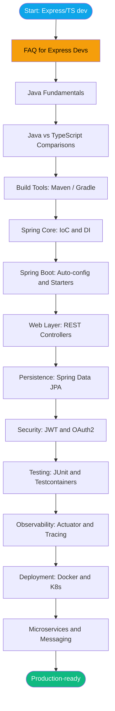

# Java + Spring Boot for the Express/TypeScript Developer

> [!info] Welcome
> This vault is a guided tour of Java and Spring Boot for someone who already builds backends in Node.js / Express / TypeScript. It assumes you know REST, async I/O, dependency injection (the concept), and SQL. It does **not** assume you've ever written a `class` keyword.

## Who this is for

You're an experienced backend developer who:
- Ships production Express/Fastify/Nest APIs in TypeScript
- Knows JWT, OAuth, Postgres, Redis, Docker, k8s — the stack stuff
- Wants to add Java + Spring Boot to your toolkit (new job, new team, polyglot ambitions)
- Doesn't want a beginner "what is a variable" tutorial

Every note opens with a **"For the Express/TS dev"** callout that maps the new concept to something you already know.

## How the vault is organized

```
00-Start-Here/         ← you are here
01-Java-Fundamentals/  ← language: types, generics, streams, concurrency
02-Java-vs-TypeScript/ ← side-by-side cheat sheets
03-Build-Tools/        ← Maven, Gradle, project layout
04-Spring-Core/        ← IoC, DI, beans, AOP
05-Spring-Boot/        ← auto-config, starters, configuration
06-Web-REST/           ← controllers, validation, error handling
07-Data-JPA/           ← entities, repositories, transactions
08-Security/           ← Spring Security, JWT, OAuth2
09-Testing/            ← JUnit, Mockito, Testcontainers
10-Microservices/      ← service discovery, gateway, config
11-Messaging/          ← Kafka, RabbitMQ
12-Observability/      ← Actuator, Micrometer, tracing
13-Deployment/         ← Docker, k8s, CI/CD, profiles
14-Ecosystem/          ← Lombok, MapStruct, Jackson, IDEs
```

## Suggested learning path

> [!tip] Start here, in this order
> 1. [[01-Learning-Path]] — week-by-week 8-week plan
> 2. [[06-FAQ-for-Express-Devs]] — answers your "where the hell is X?" questions in 2 minutes
> 3. [[05-Glossary]] — when a term feels alien
> 4. Then dive into the MOCs below as the path directs you



## Maps of Content (MOCs)

Each MOC is a curated landing page for a topic area:

- [[02-MOC-Java-Fundamentals]] — the language itself
- [[03-MOC-Spring]] — Core, Boot, Web, Data, Security
- [[04-MOC-Microservices]] — distributed systems, messaging, observability, deployment

## Quick references

- [[05-Glossary]] — A-Z definitions, each linked to a deep-dive note
- [[06-FAQ-for-Express-Devs]] — punchy Q&A: "Where's my package.json?" "Hot reload?" etc.
- [[01-Library-Cheatsheet]] — what's the Java equivalent of `lodash` / `winston` / `axios`?

## Visual canvases — open these first

> [!tip] Canvases are interactive — zoom, click notes, follow links
> All in `_canvases/`. Open in Obsidian by clicking the file.

| Canvas | What it shows |
|--------|--------------|
| `Learning-Path.canvas` | 8-week study path, phases and milestones |
| `Spring-IoC-DI-Container.canvas` | ApplicationContext bean resolution and injection |
| `Spring-Boot-Auto-Config.canvas` | How `@ConditionalOn*` wires everything from starters |
| `Request-Lifecycle-Spring-MVC.canvas` | Full request: Tomcat → Security → Controller → DB → Response |
| `Spring-Security-Filter-Chain.canvas` | Filter chain order, JWT auth sub-flow |
| `JWT-Auth-Flow.canvas` | Login → token issuance → request auth → refresh |
| `JPA-Entity-Lifecycle.canvas` | Entity states, `@Transactional` boundary, N+1 decision tree |
| `Microservices-Stack-Architecture.canvas` | **Your full stack** (Eureka + Gateway + Feign + JPA) on k8s |
| `Eureka-Gateway-Feign-Flow.canvas` | One request: Gateway → Eureka → Feign → services |
| `Observability-Stack.canvas` | Logs + Metrics + Traces → Grafana pipeline |
| `Kubernetes-Objects-Map.canvas` | Docker → k8s vocabulary + kubectl cheatsheet |

## How to use this vault in Obsidian

> [!tip] Obsidian features that shine here
> - **Graph view** (`Cmd/Ctrl+G`) — see how concepts interconnect
> - **Backlinks pane** — open any note to see what links to it
> - **Quick switcher** (`Cmd/Ctrl+O`) — jump to any note by name
> - **Tags pane** — filter by `#stage/foundation`, `#tags/spring-boot`, etc.
> - **Canvas** in `_canvases/` — visual diagrams for every major concept

## Conventions

- **Callouts** mean something:
  - `> [!info]` — context for the Express/TS reader
  - `> [!tip]` — actionable advice
  - `> [!warning]` — common pitfall
- **Wikilinks** like `[[02-Entity-Basics]]` jump to detailed notes
- **Stages** in frontmatter: `foundation` → `intermediate` → `advanced`

## Where to go next

> [!tip] Pick one
> - **Have a week to ramp up fast?** → [[01-Learning-Path]]
> - **Just want to write your first Spring Boot app today?** → [[05-Spring-Boot]] section, then [[06-Web-REST]]
> - **Coming from Nest.js?** → [[03-MOC-Spring]] (Spring Core feels familiar)
> - **Joining a team using Spring Security + JPA?** → [[08-Security]] and [[07-Data-JPA]]
> - **Your stack is Eureka + Gateway + Feign + Security + JPA on Docker/k8s?** → [[09-Stack-Specific-Eureka-Gateway-Feign-on-K8s]]
> - **Know Docker but new to Kubernetes?** → [[08-Kubernetes-From-Scratch]]

## Related
- [[01-Learning-Path]]
- [[02-MOC-Java-Fundamentals]]
- [[03-MOC-Spring]]
- [[04-MOC-Microservices]]
- [[05-Glossary]]
- [[06-FAQ-for-Express-Devs]]
- [[07-Recommended-Reading]]
