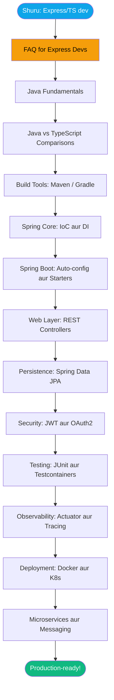

# Java + Spring Boot — Express/TypeScript Developer ke Liye Complete Guide

Socho ek second — tumhare paas Node.js mein kaafi experience hai. Tumne Zomato jaisi food delivery app banai hogi, ya CRED jaisi fintech app, ya koi bhi production-ready Express/TypeScript backend. Tumhe REST pata hai, JWT pata hai, Postgres pata hai, Docker bhi pata hai. Lekin ek din team lead bolta hai: "Yaar, humara new microservice Java + Spring Boot mein likhna hai." Ya phir naukri ki listing mein Spring Boot requirement dikhti hai aur tumhare andar ek chubhan hoti hai — "Kya main yeh seekh sakta hoon?"

Seedha jawab: Haan, aur bahut jaldi seekh sakte ho.

Yeh vault specifically tumhare liye banaya gaya hai — us developer ke liye jo pehle se backend ka khel jaanta hai, bas Spring Boot ki duniya se nayi dost nahi bani abhi tak. Yahan hum "variable kya hota hai" type basics nahi padhenge. Hum seedha wahan se shuru karenge jahan tumhari existing knowledge connect hoti hai — aur har cheez Node.js/Express se compare karenge.

> [!info] Yeh vault kis ke liye hai?
> Tum production Express/Fastify/NestJS APIs TypeScript mein ship karte ho. JWT, OAuth, Postgres, Redis, Docker, Kubernetes — yeh sab tumhara daily bread-butter hai. Ab Spring Boot add karna chahte ho apni toolkit mein — nayi job ke liye, nayi team ke liye, ya sirf isliye ki polyglot developer banna chahte ho. Tumhe "what is a variable" type tutorial nahi chahiye — aur yahan milega bhi nahi.

---

## Spring Boot Kyun? Node.js Toh Sahi Tha Na?

Yeh ek valid sawaal hai. Zomato bhi Node.js use karta tha ek waqt. Paytm ke kaafi services Node.js mein hain. Toh phir Java kyun?

**Reality check** — India ki badi fintech aur enterprise companies mein Java dominant hai:

- **HDFC, ICICI, Axis Bank** — core banking systems Java mein hain
- **Infosys, TCS, Wipro** — default stack mostly Java/Spring
- **Flipkart** — kaafi core services Java mein (Spring Boot included)
- **CRED** — backend mostly JVM-based
- **PhonePe** — Java + Kotlin heavy stack

Iska reason simple hai: Java/Spring Boot ka ecosystem mature hai, enterprise-grade hai, aur type safety + performance combination bahut strong hai. 

Node.js mein jo "eventual consistency" aur "callback hell" ya phir "TypeScript types kahan jayenge runtime pe" wali problems aati hain — Spring Boot mein woh structurally handle hoti hain. Aur ek cheez jo Spring Boot ka killer feature hai: **dependency injection aur IoC container built-in hai, sab kuch configured hai, tumhe kuch bhi manually wire nahi karna**.

Express mein tumne khud likha hoga:
```typescript
// Express mein manually sab wire karte ho
const userRepository = new UserRepository(db);
const userService = new UserService(userRepository, emailService);
const userController = new UserController(userService);
app.use('/users', userController.router);
```

Spring Boot mein bas annotations lagao, container sab handle karta hai:
```java
// Spring Boot mein — bas batao "yeh bean chahiye"
@RestController
@RequestMapping("/users")
public class UserController {
    
    @Autowired  // Spring khud inject karega
    private UserService userService;
    
    // Tumhara kaam sirf business logic likhna hai
}
```

> [!tip] Node.js se aya hoon, kitna time lagega?
> Agar tum already TypeScript + NestJS use karte ho, toh Spring Boot surprisingly familiar lagega. NestJS ne actually Spring Boot se inspiration liya hai — decorators (annotations), modules, dependency injection — concept wahi hain, syntax alag. Realistically 6-8 hafte mein tumhare paas production-ready Spring Boot knowledge hogi.

---

## Is Vault Ka Structure — Kahan Kya Milega

```
00-Start-Here/         ← abhi yahan ho tum
01-Java-Fundamentals/  ← language: types, generics, streams, concurrency
02-Java-vs-TypeScript/ ← side-by-side cheat sheets (yeh bahut kaam aayega)
03-Build-Tools/        ← Maven, Gradle, project layout (npm ka Java equivalent)
04-Spring-Core/        ← IoC, DI, beans, AOP — Spring ka dil
05-Spring-Boot/        ← auto-config, starters, configuration
06-Web-REST/           ← controllers, validation, error handling
07-Data-JPA/           ← entities, repositories, transactions (Prisma/TypeORM ka bhai)
08-Security/           ← Spring Security, JWT, OAuth2
09-Testing/            ← JUnit, Mockito, Testcontainers
10-Microservices/      ← service discovery, gateway, config
11-Messaging/          ← Kafka, RabbitMQ
12-Observability/      ← Actuator, Micrometer, tracing
13-Deployment/         ← Docker, k8s, CI/CD, profiles
14-Ecosystem/          ← Lombok, MapStruct, Jackson, IDEs
```

Har section mein ek **"Express/TS Dev ke liye"** callout hoga jo naya concept tumhari existing knowledge se connect karega. Tumhe har cheez naye sir se nahi seekhni — bas mapping samajhni hai.

---

## Seekhne Ka Sahi Order — Kahan Se Shuru Karein

> [!tip] Is order mein chalo, confuse nahi hoge
> 1. [[01-Learning-Path]] — 8-week plan, week-by-week breakdown
> 2. [[06-FAQ-for-Express-Devs]] — "package.json kahan hai?", "hot reload kaise?", "middleware kahan gaya?" — in 2 minutes mein answers
> 3. [[05-Glossary]] — jab koi term alien lage, wahan dekho
> 4. Phir niche ke MOCs follow karo jaise path direct kare



---

## Maps of Content (MOCs) — Topic ke Landing Pages

Har MOC ek topic area ka curated landing page hai — wahan se deep-dive notes tak jao:

- [[02-MOC-Java-Fundamentals]] — language itself: types, generics, streams, concurrency
- [[03-MOC-Spring]] — Core, Boot, Web, Data, Security
- [[04-MOC-Microservices]] — distributed systems, messaging, observability, deployment

---

## Quick References — Jaldi Kuch Chahiye Toh Yahan

- [[05-Glossary]] — A-Z definitions, har entry ek deep-dive note se linked
- [[06-FAQ-for-Express-Devs]] — punchy Q&A format: "Where's my package.json?" "Hot reload?" etc.
- [[01-Library-Cheatsheet]] — Java mein `lodash` ka equivalent kya hai? `winston` ka? `axios` ka?

---

## Visual Canvases — Pehle Inhe Dekho

> [!tip] Canvas files interactive hain — zoom karo, notes pe click karo, links follow karo
> Sab `_canvases/` folder mein hain. Obsidian mein file click karke khulega.

| Canvas | Kya dikhata hai |
|--------|----------------|
| `Learning-Path.canvas` | 8-week study path, phases aur milestones |
| `Spring-IoC-DI-Container.canvas` | ApplicationContext bean resolution aur injection kaise hoti hai |
| `Spring-Boot-Auto-Config.canvas` | `@ConditionalOn*` se starters sab kuch kaise wire karte hain |
| `Request-Lifecycle-Spring-MVC.canvas` | Full request: Tomcat → Security → Controller → DB → Response |
| `Spring-Security-Filter-Chain.canvas` | Filter chain order, JWT auth sub-flow |
| `JWT-Auth-Flow.canvas` | Login → token issuance → request auth → refresh |
| `JPA-Entity-Lifecycle.canvas` | Entity states, `@Transactional` boundary, N+1 decision tree |
| `Microservices-Stack-Architecture.canvas` | Tumhara full stack (Eureka + Gateway + Feign + JPA) on k8s |
| `Eureka-Gateway-Feign-Flow.canvas` | Ek request: Gateway → Eureka → Feign → services |
| `Observability-Stack.canvas` | Logs + Metrics + Traces → Grafana pipeline |
| `Kubernetes-Objects-Map.canvas` | Docker → k8s vocabulary + kubectl cheatsheet |

---

## Node.js se Spring Boot — Quick Mental Model

Pehle ek chiz clear kar lete hain — kuch cheezein directly map hoti hain, kuch nahi:

| Node.js / Express | Spring Boot Equivalent | Notes |
|---|---|---|
| `package.json` | `pom.xml` ya `build.gradle` | Dependencies aur project config |
| `npm install` | `mvn install` ya `gradle build` | Dependencies download karta hai |
| `express()` app | `@SpringBootApplication` class | Entry point |
| `app.use('/api', router)` | `@RestController` + `@RequestMapping` | Route definition |
| `req.body` | `@RequestBody` parameter | Request body parse karna |
| `req.params.id` | `@PathVariable` | URL parameter |
| `req.query` | `@RequestParam` | Query string |
| Middleware (`app.use()`) | `Filter` ya `Interceptor` | Request/response processing |
| `process.env.PORT` | `application.properties` ya `@Value` | Configuration |
| `async/await` | Synchronous code (by default) | Spring MVC blocking hai by default |
| `try/catch` in route | `@ControllerAdvice` + `@ExceptionHandler` | Global error handling |
| Prisma / TypeORM | Spring Data JPA | ORM layer |
| Zod / class-validator | Bean Validation (`@Valid`, `@NotNull`) | Input validation |
| Jest | JUnit 5 + Mockito | Testing |
| Passport.js | Spring Security | Auth framework |

> [!warning] Yeh important hai — Blocking vs Non-Blocking
> Node.js event loop pe based hai — non-blocking I/O. Spring Boot (MVC mode mein) **blocking** hai — har request ke liye ek thread. Iska matlab yeh nahi ki Spring Boot slow hai — thread pool bahut efficiently manage hota hai, aur zyada hardware pe Spring Boot actually Node.js se zyada throughput de sakta hai. Agar tumhe truly reactive/non-blocking chahiye toh **Spring WebFlux** hai (Project Reactor pe based), lekin shuru mein Spring MVC se shuru karo.

---

## Common Gotchas — Jo Beginners Se Galti Hoti Hai

**Gotcha #1: Annotations ka magic samajhna**

Spring Boot mein har kaam annotations se hota hai. Pehle yeh magic jaisi lagegi — `@Autowired` likhte ho aur object khud inject ho jaata hai. Tumhara pehla reaction hoga "yeh kaam kaise kar raha hai?" — aur yahi curiosity tumhe IoC container samjhayegi.

```java
// Yeh kaam karta hai... kyun?
@Service
public class OrderService {
    
    @Autowired
    private PaymentService paymentService;  // Tumne kahan banaya? Spring ne!
}
```

**Gotcha #2: `@Transactional` ko halkay mat lo**

Node.js mein manually `BEGIN TRANSACTION` likhte the. Yahan `@Transactional` lagao aur Spring handle karta hai. Lekin — agar same class ke andar ek method dusre `@Transactional` method ko call kare toh **proxy bypass** ho jaata hai aur transaction kaam nahi karta. Yeh Spring ka sabse common beginner mistake hai.

```java
// WRONG — transaction kaam nahi karega
@Service
public class UserService {
    
    public void processUser(Long id) {
        this.updateUser(id);  // 'this' se call = proxy bypass!
    }
    
    @Transactional
    public void updateUser(Long id) {
        // Yeh transaction apply nahi hoga
    }
}
```

**Gotcha #3: Maven/Gradle mein dependency version conflicts**

npm mein `package-lock.json` sab manage karta hai. Java mein version conflicts zyada explicit hote hain. Spring Boot ka `spring-boot-starter-parent` versions manage karta hai — isko override karne ki koshish karo toh conflict aa sakta hai.

**Gotcha #4: Application Context startup time**

Node.js app seconds mein start hoti hai. Spring Boot application context build hoti hai startup pe — production app mein 10-30 seconds normal hai. Development mein Spring Boot DevTools se hot reload milta hai (npm run dev jaisi feeling), lekin full restart slow hoga.

**Gotcha #5: Checked Exceptions**

Java mein `checked exceptions` hain jo TypeScript mein nahi hoti. Compiler force karta hai ki tum certain exceptions handle karo ya declare karo. Pehle irritating lagega, baad mein samjhoge ki yeh intentional design hai.

---

## Kahan Se Shuru Karein — Choose Your Adventure

> [!tip] Apna path chuno
> - **Ek hafte mein fast ramp up chahiye?** → [[01-Learning-Path]]
> - **Aaj hi pehla Spring Boot app likhna hai?** → [[05-Spring-Boot]] section, phir [[06-Web-REST]]
> - **NestJS background hai?** → [[03-MOC-Spring]] se shuru karo (Spring Core bahut familiar lagega)
> - **Team Spring Security + JPA use kar rahi hai?** → [[08-Security]] aur [[07-Data-JPA]] directly jaao
> - **Stack hai Eureka + Gateway + Feign + Security + JPA on Docker/k8s?** → [[09-Stack-Specific-Eureka-Gateway-Feign-on-K8s]]
> - **Docker pata hai, Kubernetes naya hai?** → [[08-Kubernetes-From-Scratch]]

---

## Obsidian Features Jo Yahan Kaam Aayenge

> [!tip] In features ko use karo
> - **Graph view** (`Cmd/Ctrl+G`) — dekho kaise concepts ek doosre se connected hain
> - **Backlinks pane** — koi bhi note kholo, dekho kaun us pe link kar raha hai
> - **Quick switcher** (`Cmd/Ctrl+O`) — kisi bhi note pe jump karo naam se
> - **Tags pane** — filter karo `#stage/foundation`, `#tags/spring-boot` se
> - **Canvas** in `_canvases/` — har major concept ke liye visual diagrams

---

## Vault Mein Conventions — Kya Matlab Hai Kiska

- **Callouts ka matlab:**
  - `> [!info]` — Express/TS reader ke liye context
  - `> [!tip]` — actionable advice, kuch karo
  - `> [!warning]` — common pitfall, dhyan rakho
- **Wikilinks** jaise `[[02-Entity-Basics]]` detailed notes pe jump karte hain
- **Stages** frontmatter mein: `foundation` → `intermediate` → `advanced`

---

## Related Notes

- [[01-Learning-Path]]
- [[02-MOC-Java-Fundamentals]]
- [[03-MOC-Spring]]
- [[04-MOC-Microservices]]
- [[05-Glossary]]
- [[06-FAQ-for-Express-Devs]]
- [[07-Recommended-Reading]]

---

## Key Takeaways

- Spring Boot ko Node.js ka replacement mat samjho — dono ki apni jagah hai. Spring Boot enterprise-grade, type-safe, aur mature ecosystem ke liye hai
- NestJS developers ke liye Spring Boot surprisingly familiar hoga — annotations = decorators, DI container = same concept, modules = similar pattern
- Sabse pehle **FAQ for Express Devs** padho — tumhare 80% starting questions wahan answer hain
- **Blocking vs non-blocking** ka difference samajhna zaroori hai — Spring MVC blocking hai, Spring WebFlux non-blocking
- `@Transactional` ko same-class mein call karna kaam nahi karta — yeh sabse common beginner mistake hai, yaad rakho
- Application startup slow lagegi Node.js se compare mein — yeh normal hai, Spring DevTools se development mein hot reload milta hai
- Maven/Gradle = npm ka equivalent, lekin Spring Boot starter parent versions manage karta hai — versions manually override karne se bachao
- 6-8 hafte mein, existing backend knowledge ke saath, tum production-ready Spring Boot developer ban sakte ho
